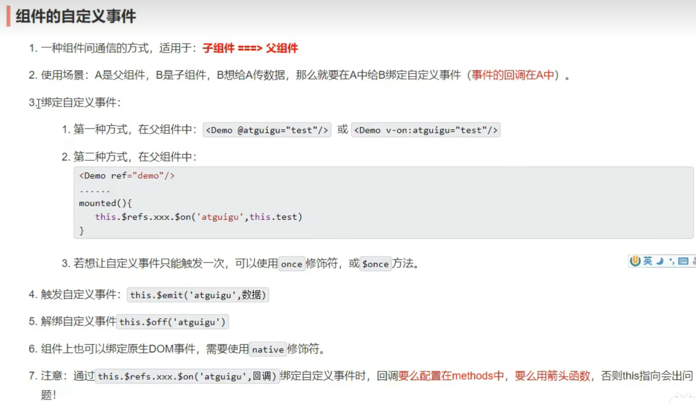
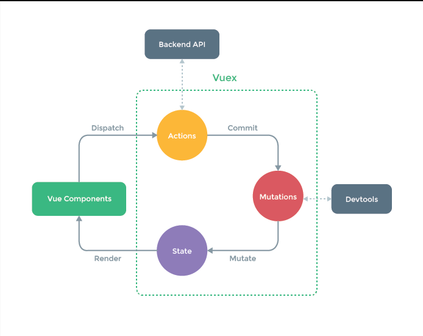

# Vue 2 开发


## 基础入门

### Vue.js 简介与特点

- **渐进式框架**：可逐步集成到项目中
- **响应式数据绑定**：数据变化自动更新视图
- **组件化开发**：高复用、低耦合的代码组织
- **虚拟DOM**：高效DOM操作，优化渲染性能
- **轻量级**：压缩后约30KB（生产环境）

### 安装与初始化项目

#### CDN 引入

```html
<!DOCTYPE html>
<html lang="en">
<head>
  <meta charset="UTF-8">
  <meta name="viewport" content="width=device-width, initial-scale=1.0">
  <title>Vue 2 入门</title>
  <script src="https://cdn.jsdelivr.net/npm/vue@2.6.14/dist/vue.js"></script>
</head>
<body>
  <div id="root">
    <h1>Hello，{{name}}</h1>
  </div>

  <script>
    Vue.config.devtools = true;
    const vm = new Vue({
      el: '#root',
      data: {
        name: 'Vue2',
        age: '25'
      }
    });
  </script>
</body>
</html>
```

#### Vue CLI 创建项目

```bash
# 安装 Vue CLI
npm install -g @vue/cli

# 创建项目
vue create my-project

# 选择 Vue 2
# 选择预设配置（Babel, ESLint等）
```

### 基础规则

1. 想让Vue工作，必须创建Vue实例，传入配置对象
2. root容器里的代码符合HTML规范，混入Vue特殊语法
3. root容器里的代码被称为【Vue模板】
4. Vue实例和容器是一一对应的
5. 真实开发中通常只有一个Vue实例，配合组件使用
6. `{{xxx}}`中的xxx要写JS表达式，可自动读取data中所有属性
7. data数据变化时，模板中用到该数据的地方自动更新

### MVVM 模型理解

#### 定义与组成

**MVVM (Model-View-ViewModel)** 是一种软件架构模式：

- **Model**：数据层，处理业务逻辑和数据存储
- **View**：视图层，用户界面（HTML/DOM）
- **ViewModel**：连接层，**双向绑定** View 和 Model，处理数据转换

#### 核心特点

- **双向数据绑定**：数据变更自动更新视图，用户操作自动更新数据
- 关注点分离：
  - View 专注 UI 展示（无需直接操作DOM）
  - Model 专注业务逻辑（不关心UI细节）
  - ViewModel 协调两者通信
- **自动同步**：开发者无需手动操作DOM更新

#### Vue中的实现

```javascript
const vm = new Vue({
  // ViewModel（Vue实例）
  el: '#app',
  data: { 
    message: 'Hello' // Model
  }
});
<!-- View -->
<div id="app">
  <input v-model="message"> <!-- 双向绑定 -->
  <p>{{ message }}</p>
</div>
```

> **提示**：在Vue中，通常将Vue实例赋值给变量`vm`（ViewModel缩写）

## 核心概念

### Vue 实例

#### 实例创建

```javascript
const vm = new Vue({
  el: '#app',       // 挂载点
  data: {           // 响应式数据
    message: 'Hello Vue!'
  },
  methods: {        // 业务逻辑方法
    greet() {
      return 'Hello ' + this.message;
    }
  }
});
```

#### 生命周期钩子

```javascript
new Vue({
  beforeCreate() {
    // 实例初始化后，数据观测和事件配置前
    console.log('beforeCreate');
  },
  created() {
    // 实例创建完成，data已观测，事件已配置
    console.log('created');
  },
  beforeMount() {
    // 挂载开始前，render函数首次被调用
    console.log('beforeMount');
  },
  mounted() {
    // 实例挂载完成，el被新创建的vm.$el替换
    console.log('mounted');
  },
  beforeUpdate() {
    // 数据更新时调用，发生在虚拟DOM打补丁前
    console.log('beforeUpdate');
  },
  updated() {
    // 数据更新导致的DOM重新渲染完成后
    console.log('updated');
  },
  beforeDestroy() {
    // 实例销毁前，实例仍然完全可用
    console.log('beforeDestroy');
  },
  destroyed() {
    // Vue实例销毁后，所有事件监听器被移除
    console.log('destroyed');
  }
});
```

#### 实例配置详解

##### el 选项

```javascript
// 选择器方式
el: '#app'

// DOM元素方式
el: document.getElementById('app')
```

- 仅在根实例中可用
- 挂载时机：在`created`之后，`mounted`之前
- 挂载后通过`this.$el`访问DOM元素

##### data 选项

```javascript
// 根实例（可对象或函数）
data: { title: 'Root' }

// 组件（必须函数式）
data() {
  return { message: 'Hello' }
}
```

- **关键规则**：组件必须使用函数返回新对象，避免多实例数据污染
- 仅代理根级属性，嵌套对象需用`Vue.set`
- 无法检测属性添加/删除（需用`Vue.set`/`Vue.delete`）

##### methods 选项

```javascript
methods: {
  // 正确：普通函数自动绑定this
  handleClick() {
    this.count++;
  },
  
  // 错误：箭头函数不绑定this
  badMethod: () => {
    this.count++; // this指向错误
  }
}
```

- 自动绑定`this`指向Vue实例
- 无缓存，每次访问都会执行
- 适合处理事件和业务逻辑

```html
<!DOCTYPE html>
<html lang="en">

<head>
  <meta charset="UTF-8">
  <meta name="viewport" content="width=device-width, initial-scale=1.0">
  <title>Document</title>
</head>

<body>
  <script src="./vue.js"></script>

  <div id="root">
    <h1>Hello，{{name}}</h1>
    <div>姓:<input type="text" v-model="people.firstname"></div>
    <div>名:<input type="text" v-model="people.lastname"></div>
    <!-- <div>{{people.firstname+people.lastname}}</div> -->
    <div>{{addName()}}</div>
  </div>

  <script>
    Vue.config.devtools = true
    new Vue({//data中用于存储数据，数据供el所指定的容器使用
      el: '#root',//用于指定当前Vue实例为哪个容器服务器，使用css选择器
      data: {
        name: 'Vue2',
        age: 'Vue3',
        people: {
          firstname: '张',
          lastname: '三',
        }
      },
      methods:{
        addName(){
          console.log(this);
          return this.people.firstname+this.people.lastname
        }
      }
    })

  </script>
</body>

</html>
```


### 响应式原理基础

#### 数据代理

**实现原理**：通过`Object.defineProperty`拦截属性访问和修改

```javascript
// 伪代码
Object.defineProperty(vm, 'message', {
  get() { /* 依赖收集 */ return data.message },
  set(newVal) { /* 触发更新 */ data.message = newVal }
});
```

**限制与解决方案**：

```javascript
// 无法检测属性添加/删除
vm.$set(vm.someObject, 'newProperty', 'value'); // 添加响应式属性
Vue.set(vm.someObject, 'newProperty', 'value');  // 全局方法

// 无法检测数组索引直接修改
vm.items.splice(indexOfItem, 1, newValue); // 正确
vm.items[indexOfItem] = newValue;           // 无效
```

#### 依赖追踪

- **依赖收集**：getter中收集使用该属性的Watcher
- **派发更新**：setter中通知所有相关Watcher更新
- **异步更新队列**：同一事件循环中多次修改合并为一次更新


## 模板语法

Vue 模板语法有 2 大类：

**插值语法**  

- 功能：用于在标签**文本内容中**动态插入数据  
- 语法：`{{ xxx }}`，其中 xxx 是 JavaScript 表达式  
- 特点：  
  - 可直接访问 data、props、computed 等响应式数据  
  - 支持简单表达式（如 `msg + '!'`、`count > 0 ? 'yes' : 'no'`）  
  - **不能用于 HTML 属性或事件绑定**  

**指令语法**  

- 功能：用于绑定 HTML 元素的**属性、事件、样式、条件、列表等**  
- 语法：`v-指令名:属性="表达式"` 或简写形式（如 `:` 代替 `v-bind`）  
- 示例：  
  ```html
  <a v-bind:href="url">链接</a>  <!-- 绑定属性 -->
  <button v-on:click="handleClick">点击</button>  <!-- 绑定事件 -->
  ```
- 特点：  
  - 以 `v-` 开头，如 `v-if`, `v-for`, `v-model` 等  
  - 支持修饰符（如 `.prevent`, `.stop`）  
  - 表达式同样可以访问响应式数据


### 插值语法

#### 插值语法 {{ }}

**作用**：在模板中动态输出数据，将 Vue 实例中的数据渲染到 DOM 中

> 常用在标签所展示的内容中

**基本语法**：

```html
<span>消息: {{ message }}</span>
```

**支持的内容**：

- 数据属性：`{{ message }}`

- JavaScript 表达式：

  ```html
  {{ number + 1 }}
  {{ ok ? 'YES' : 'NO' }}
  {{ message.split('').reverse().join('') }}
  ```

**不支持的内容**：

- 语句（如 if、for、var 等）
- 赋值表达式
- 只能包含单个表达式

**常用场景**：

```html
<p>当前计数: {{ count }}</p>
<p>计算总价: {{ price * quantity }}</p>
<p>格式化日期: {{ formatDate(date) }}</p>
```

**注意**：

- 只能用于标签内容中，不能用于属性（属性使用 `v-bind`）
- 会自动更新当数据变化时
- 如果显示原始 `{{ }}`，使用 `v-pre` 指令


#### data 函数式写法

**原因**：确保组件的每个实例都有独立的数据副本，避免多个实例间数据互相污染

**正确写法**：

```javascript
// 组件中（必须使用函数）
export default {
  data() {
    return {
      message: 'Hello Vue',
      count: 0,
      items: []
    }
  }
}

// 根实例中（可使用对象或函数）
new Vue({
  data: {
    title: 'Root Instance'
  }
})
```

**错误写法**（组件中）：

```javascript
// 错误！组件中不能直接使用对象
export default {
  data: {
    message: '共享数据' // 多个实例会共享此对象
  }
}
```

**原理**：

- Vue 在初始化组件时会调用 `data()` 函数
- 每次调用返回新对象，保证实例间数据隔离
- 根实例无此限制，因为只有一个实例

**注意事项**：

- 所有组件必须使用函数式写法

- 函数必须返回一个新对象

- 不能使用箭头函数（会丢失 this 上下文）：

  ```javascript
  // 错误！箭头函数没有自己的 this
  data: () => ({ count: 0 })
  
  // 正确
  data() { return { count: 0 } }
  ```

**最佳实践**：

```javascript
export default {
  data() {
    return {
      // 基本类型
      title: '',
      isActive: false,
      // 引用类型（每次返回新实例）
      user: { name: '', age: 0 },
      list: []
    }
  }
}
```


### 指令语法

#### v-bind单向绑定

**作用**：单向的动态绑定 HTML 属性或组件 props

**语法**：

```html
<!-- 完整写法 -->
<a v-bind:href="url"></a>

<!-- 简写（常用） -->
<a :href="url"></a>
```

**常用场景**：

- 绑定普通属性：``

- 绑定 class：

  ```html
  <div :class="{ active: isActive }"></div>
  <div :class="['static-class', dynamicClass]"></div>
  ```

- 绑定 style：

  ```html
  <div :style="{ color: textColor }"></div>
  ```

- 传递 props 给子组件：

  ```html
  <my-component :message="parentMsg"></my-component>
  ```

**特点**：

- 数据变化时自动更新
- 支持 JavaScript 表达式
- 简写 `:` 是最常用形式


#### v-model双向绑定

**作用**：创建 **表单元素** 的 **双向数据绑定** ，自动同步视图与数据

> 与v-bind不同，bind只能由data传至标签，而model在标签修改的值也能传回data

**语法**：

```html
<!-- 基本用法 -->
<input v-model="message">
```

**常用场景**：

- **文本输入**：

  ```html
  <input v-model="text">
  <textarea v-model="comment"></textarea>
  ```

- **复选框**：

  ```html
  <!-- 单个（布尔值） -->
  <input type="checkbox" v-model="isChecked">
  
  <!-- 多个（数组） -->
  <input type="checkbox" v-model="selected" value="item1">
  ```

- **单选按钮**：

  ```html
  <input type="radio" v-model="picked" value="one">
  ```

- **下拉选择**：

  ```html
  <select v-model="selected">
    <option value="A">选项A</option>
  </select>
  ```

- **自定义组件**：

  ```html
  <custom-input v-model="searchText"></custom-input>
  ```

**修饰符**：

- **.lazy**：转为 change 事件更新

  ```html
  <input v-model.lazy="msg">
  ```

- **.number**：自动转换为数字

  ```html
  <input v-model.number="age">
  ```

- **.trim**：自动过滤首尾空格

  ```html
  <input v-model.trim="name">
  ```

**特点**：

- 仅适用于表单元素和自定义组件
- 是 v-bind + v-on 的语法糖
- 修饰符可组合使用：`v-model.trim.number`
- 在组件中要求：接收 value prop，触发 input 事件

```html
<div id="app">
  <input v-model="message" placeholder="请输入">
  <p>内容: {{ message }}</p>
</div>

<script>
new Vue({
  el: '#app',
  data: {
    message: 'hello'
  }
})
</script>
```


#### v-on监听事件

**作用**：**监听 DOM 事件**，在事件触发时执行 JavaScript 代码

**语法**：

```html
<!-- 完整写法 -->
<button v-on:click="handleClick">点击</button>

<!-- 简写（常用） -->
<button @click="handleClick">点击</button>
```

**常用场景**：

- **方法调用**：

  ```html
  <button @click="submitForm">提交</button>
  ```

- **内联语句**：

  ```html
  <button @click="count++">+1</button>
  <button @click="greet('hello')">问候</button>
  ```

- **访问原生事件对象**：

  ```html
  <!-- $event 代表原生事件对象 -->
  <button @click="warn('Form cannot be submitted yet.', $event)">
    提交
  </button>
  ```

  访问原生 事件对象(event)会出现占用，使用`$event`来进行占位

- **组件自定义事件**：

  ```html
  <my-component @custom-event="handleEvent"></my-component>
  ```

**事件修饰符**（顺序很重要）：

```html
<!-- 阻止事件冒泡 -->
<a @click.stop="doThis"></a>

<!-- 阻止默认行为 -->
<form @submit.prevent="onSubmit"></form>

<!-- 仅触发一次 -->
<button @click.once="doThis"></button>

<!-- 串联修饰符 -->
<a @click.stop.prevent="doThat"></a>
```

**按键修饰符**：

```html
<!-- 只有当 keyCode 为 13 时触发（回车键） -->
<input @keyup.13="submit">

<!-- 别名修饰符 -->
<input @keyup.enter="submit">
<input @keyup.tab="onTab">
<input @keyup.delete="onDelete">

<!-- 系统修饰键 -->
<input @keyup.ctrl.c="clear"> <!-- Ctrl + C -->
<input @keyup.alt.a="action"> <!-- Alt + A -->
```

**特点**：

- 支持所有原生 DOM 事件（click、submit、keyup 等）
- 方法在 Vue 实例的 methods 选项中定义
- 修饰符用点号 `.` 连接，可串联使用
- 在组件上监听的是**自定义事件**，而非原生 DOM 事件
- 事件处理函数可以接收额外参数，`$event` 用于访问原生事件对象


#### v-if 系列指令

##### 基本语法

```html
<div v-if="condition">条件为真时渲染</div>
<div v-else-if="anotherCondition">第一个条件为假且此条件为真时渲染</div>
<div v-else>以上条件都为假时渲染</div>
```

v-if 系列指令根据表达式的真假值条件性地渲染元素。当条件为假时，元素不会被渲染到 DOM 中。

##### 工作原理

- **条件渲染**：仅当条件为真时，元素才会被添加到 DOM
- **惰性求值**：初始渲染时条件为假，元素及其子元素不会被创建
- **链式规则**：v-else-if 和 v-else 必须紧跟在 v-if 或 v-else-if 之后
- **元素销毁/重建**：条件变化时，元素会被完全销毁和重建，触发组件生命周期

##### 使用示例

```html
<div id="app">
  <div v-if="userType === 'admin'">
    <h2>管理员面板</h2>
    <p>您可以管理所有用户和内容。</p>
  </div>
  <div v-else-if="userType === 'editor'">
    <h2>编辑面板</h2>
    <p>您可以编辑和发布内容。</p>
  </div>
  <div v-else>
    <h2>访客面板</h2>
    <p>请登录查看完整内容。</p>
  </div>
  <button @click="changeUserType">切换用户类型</button>
</div>

<script>
const { createApp } = Vue;
createApp({
  data() {
    return {
      userType: 'admin'
    }
  },
  methods: {
    changeUserType() {
      const types = ['admin', 'editor', 'guest'];
      const currentIndex = types.indexOf(this.userType);
      this.userType = types[(currentIndex + 1) % types.length];
    }
  }
}).mount('#app');
</script>
```

##### 多元素条件渲染

```html
<template v-if="isLoggedIn">
  <h2>欢迎回来！</h2>
  <p>您有 {{ unreadMessages }} 条未读消息。</p>
  <button @click="logout">退出登录</button>
</template>
<template v-else>
  <h2>请登录</h2>
  <button @click="login">登录账号</button>
</template>
```

- 使用 `<template>` 标签作为不可见的包装器，避免添加额外 DOM 元素
- template 标签上的 v-if 控制其所有子元素

##### 注意事项

- **v-if 与 v-for 优先级**：在 Vue 3 中，v-if 优先级高于 v-for，不建议在同一元素上同时使用
- **元素重用问题**：Vue 会尽可能重用元素，为不同状态的元素添加 key 属性可强制重新创建
- **性能考虑**：适合条件不频繁变化的场景，频繁切换会有较高性能开销

#### v-show 指令

##### 基本语法

```html
<div v-show="isVisible">元素始终在 DOM 中，但通过 CSS 切换可见性</div>
```

v-show 指令通过切换元素的 CSS display 属性来控制元素的可见性，无论条件真假，元素始终会被渲染到 DOM 中。

##### 工作原理

- **CSS 控制**：通过添加/移除 `display: none` CSS 属性切换可见性
- **始终渲染**：元素及其子元素始终存在于 DOM 中
- **状态保留**：切换时保留元素状态（如表单输入值、滚动位置）
- **无生命周期**：切换时不触发组件的创建/销毁生命周期钩子

##### 使用示例

```html
<div id="app">
  <div class="panel" v-show="showDetails">
    <h3>详细信息</h3>
    <p>这些内容在切换时会保留状态。</p>
    <input v-model="userInput" placeholder="输入内容，切换面板时内容不会丢失">
  </div>
  <button @click="toggleDetails">
    {{ showDetails ? '隐藏详情' : '显示详情' }}
  </button>
  <p>输入内容: {{ userInput }}</p>
</div>

<script>
const { createApp } = Vue;
createApp({
  data() {
    return {
      showDetails: true,
      userInput: '示例文本'
    }
  },
  methods: {
    toggleDetails() {
      this.showDetails = !this.showDetails;
    }
  }
}).mount('#app');
</script>

<style>
.panel {
  border: 1px solid #42b883;
  padding: 15px;
  margin: 10px 0;
  border-radius: 4px;
  transition: opacity 0.3s;
}
</style>
```

##### 与 v-if 的区别

| 特性         | v-show                 | v-if                     |
| ------------ | ---------------------- | ------------------------ |
| **渲染方式** | 始终渲染，CSS 控制显示 | 条件为真才渲染           |
| **切换性能** | 高效（仅 CSS 变更）    | 较低（DOM 操作）         |
| **初始渲染** | 始终渲染，成本高       | 条件为假时不渲染，成本低 |
| **元素状态** | 保留状态               | 重建时重置状态           |
| **适用场景** | 频繁切换的元素         | 条件很少变化的元素       |
| **模板支持** | 不支持 `<template>`    | 支持 `<template>`        |

##### 最佳实践

1. **频繁切换场景**：对于需要频繁显示/隐藏的内容（如选项卡、折叠面板），优先使用 v-show

   ```html
   <div v-show="activeTab === 'profile'">个人资料</div>
   <div v-show="activeTab === 'settings'">设置</div>
   ```

2. **初始渲染优化**：当元素初始状态为隐藏且很少显示时，使用 v-if 减少初始渲染开销

   ```html
   <!-- 较少使用的帮助面板 -->
   <div v-if="showHelpPanel">帮助内容...</div>
   ```

3. **表单状态保留**：需要保留表单输入状态时，使用 v-show

   ```html
   <div v-show="showAdvancedOptions">
     <input v-model="advancedSettings.option1">
     <input v-model="advancedSettings.option2">
   </div>
   ```

4. **结合过渡效果**：v-show 可直接与 CSS 过渡配合使用

   ```css
   .panel {
     transition: opacity 0.3s ease;
   }
   .panel[style*="display: none"] {
     opacity: 0;
   }
   ```

> 选择原则：当需要频繁切换元素显示状态时，使用 v-show；当条件在运行时很少变化，或初始渲染性能至关重要时，使用 v-if。


#### v-for 指令

##### 基本语法

```html
<!-- 数组遍历 -->
<div v-for="(item, index) in items" :key="item.id">
  {{ index }} - {{ item.name }}
</div>

<!-- 对象遍历 -->
<div v-for="(value, key, index) in object" :key="key">
  {{ index }}. {{ key }}: {{ value }}
</div>

<!-- 数字遍历 -->
<span v-for="n in 5" :key="n">{{ n }} </span>
```

v-for 指令用于基于源数据多次渲染元素或模板，支持数组、对象和数字。

##### 使用示例

```html
<div id="app">
  <h2>待办事项列表</h2>
  <ul>
    <li v-for="(todo, index) in todos" :key="todo.id" 
        :class="{ completed: todo.done }">
      {{ index + 1 }}. {{ todo.text }}
      <button @click="toggleDone(todo)">✓</button>
      <button @click="removeTodo(todo.id)">×</button>
    </li>
  </ul>
  
  <div>
    <input v-model="newTodo" @keyup.enter="addTodo" placeholder="添加新任务">
    <button @click="addTodo">添加</button>
  </div>
</div>

<script>
const { createApp } = Vue;
createApp({
  data() {
    return {
      newTodo: '',
      todos: [
        { id: 1, text: '学习 Vue.js', done: false },
        { id: 2, text: '构建项目', done: true },
        { id: 3, text: '部署应用', done: false }
      ]
    }
  },
  methods: {
    addTodo() {
      if (this.newTodo.trim() === '') return;
      const newId = this.todos.length > 0 
        ? Math.max(...this.todos.map(t => t.id)) + 1 
        : 1;
      
      this.todos.push({
        id: newId,
        text: this.newTodo,
        done: false
      });
      this.newTodo = '';
    },
    toggleDone(todo) {
      todo.done = !todo.done;
    },
    removeTodo(id) {
      this.todos = this.todos.filter(todo => todo.id !== id);
    }
  }
}).mount('#app');
</script>

<style>
.completed {
  text-decoration: line-through;
  color: #999;
}
li {
  margin: 8px 0;
  padding: 8px;
  border: 1px solid #eee;
  border-radius: 4px;
}
button {
  margin-left: 8px;
  cursor: pointer;
}
</style>
```

##### key 属性的重要性

- **必要性**：在 v-for 中必须使用 key 属性，帮助 Vue 识别节点身份
- **最佳值**：使用唯一标识符（如 item.id），而非数组索引
- 作用：
  - 提高虚拟 DOM diff 算法效率
  - 保持组件状态（如表单输入、滚动位置）
  - 避免渲染错误

```html
<!-- 正确：使用唯一ID -->
<div v-for="item in items" :key="item.id">{{ item.name }}</div>

<!-- 避免：除非项目顺序永远不会改变 -->
<div v-for="(item, index) in items" :key="index">{{ item.name }}</div>
```

##### 与 v-if 的交互

- **Vue 3 优先级**：v-if 优先级高于 v-for，不建议在同一元素上同时使用
- **正确做法**：使用计算属性预先过滤，或使用 `<template>` 标签分离

```html
<!-- 推荐：使用计算属性 -->
<div v-for="item in filteredItems" :key="item.id">{{ item.name }}</div>

<!-- 或使用 template 标签 -->
<template v-for="item in items" :key="item.id">
  <div v-if="item.isVisible">{{ item.name }}</div>
</template>
```

##### 数组变化检测

Vue 不能检测以下数组变化，需使用特殊方法：

```javascript
// 响应式方法
this.todos.push({ id: 4, text: '新任务', done: false });
this.todos.pop();
this.todos.shift();
this.todos.unshift({ id: 0, text: '优先任务', done: false });
this.todos.splice(1, 1); // 替换/删除
this.todos.sort();
this.todos.reverse();

// 替换数组
this.todos = this.todos.filter(todo => !todo.done);

// Vue 3 无法自动检测的情况
// 错误：this.todos[0] = newValue (不触发更新)
// 正确：
this.todos = [...this.todos.slice(0, 0), newValue, ...this.todos.slice(1)];
// 或
this.$set(this.todos, 0, newValue); // Vue 2 专用
```

##### 最佳实践

1. **始终使用 key**：提供稳定的身份标识，避免使用索引（除非顺序固定）

   ```html
   <div v-for="item in items" :key="item.uniqueId"></div>
   ```

2. **计算属性预处理**：避免在模板中使用复杂逻辑

   ```javascript
   computed: {
     activeTodos() {
       return this.todos.filter(todo => !todo.done);
     }
   }
   ```

3. **虚拟滚动**：处理大型列表提高性能

   ```html
   <!-- 使用第三方库如 vue-virtual-scroller -->
   <virtual-scroller :items="largeList" :item-height="50">
     <template v-slot="{ item }">
       <div>{{ item.name }}</div>
     </template>
   </virtual-scroller>
   ```

4. **提取组件**：列表项复杂时提取为单独组件

   ```html
   <todo-item 
     v-for="todo in todos" 
     :key="todo.id"
     :todo="todo"
     @toggle="toggleDone"
     @remove="removeTodo">
   </todo-item>
   ```

5. **避免在 v-for 内部使用 v-if**：预先过滤数据

   ```html
   <!-- 避免 -->
   <li v-for="todo in todos" v-if="!todo.done" :key="todo.id">
   
   <!-- 推荐 -->
   <li v-for="todo in activeTodos" :key="todo.id">
   ```

> 适用原则：v-for 适用于渲染列表和重复元素，但需注意性能。大型列表应使用虚拟滚动、分页或懒加载。始终为每个项目提供唯一 key，优先使用计算属性处理复杂逻辑，避免在模板中进行数据转换。


#### v-text 指令

**作用**：**更新元素的文本内容**，将元素的textContent设置为表达式的值

**语法**：

```html
<!-- 完整写法 -->
<span v-text="message"></span>

<!-- 等效于 -->
<span>{{message}}</span>
```

**常用场景**：

- **替换元素全部内容**：

  ```html
  <p v-text="paragraphText"></p>
  ```

- **避免原始内容闪烁**：

  ```html
  <div v-text="loading ? '加载中...' : '加载完成'"></div>
  ```

- **动态文本更新**：

  ```html
  <h3 v-text="'当前页: ' + currentPage"></h3>
  ```

**特点**：

- 自动对内容进行HTML转义，防止XSS攻击
- 会替换元素内的所有现有内容
- 优先级高于{{}}插值语法
- 适用于纯文本内容，不适用于需要渲染HTML的场景
- 在性能上与{{}}插值几乎无差别，选择使用取决于具体场景和代码风格偏好

#### v-html 指令

**作用**：**更新元素的HTML内容**，将表达式的值作为HTML代码解析

**语法**：

```html
<div v-html="rawHtml"></div>
```

**常用场景**：

- **渲染富文本内容**：

  ```html
  <div v-html="articleContent"></div>
  ```

- **动态组件模板**：

  ```html
  <div v-html="componentTemplate"></div>
  ```

- **从服务端获取的HTML片段**：

  ```html
  <div v-html="fetchedHtmlContent"></div>
  ```

**安全注意事项**：

```html
<!-- 不安全的用法：永远不要对用户提交的内容使用v-html -->
<div v-html="userSubmittedContent"></div>

<!-- 更安全的做法：使用DOMPurify等库净化内容 -->
<div v-html="sanitizedContent"></div>
```

**特点**：

- 不会自动转义HTML内容，存在XSS攻击风险
- 仅对可信内容使用此指令
- 内容中的Vue模板语法不会被编译
- 组件内部的生命周期钩子不会被触发
- 优先级高于元素内部的其他内容和指令

#### v-cloak 指令

**作用**：**保持在元素上直到关联的Vue实例结束编译**，用于解决初始化时未编译模板的闪烁问题

> 人话说就是再vue还没有介入的时候搭配[v-cloak] { display: none; }，解决网速慢会先显示{{}}这样的模板，当new Vue创建好了会删除掉所有v-cloak属性

**语法**：

```html
<div v-cloak>
  {{ message }}
</div>
```

**常用场景**：

- **解决初始渲染闪烁**：

  ```html
  <div id="app">
    <p v-cloak>{{ message }}</p>
  </div>
  
  <style>
    [v-cloak] { display: none; }
  </style>
  ```

- **结合CSS实现优雅加载**：

  ```html
  <div v-cloak class="loading-content">
    {{ content }}
  </div>
  
  <style>
    [v-cloak].loading-content::before {
      content: "加载中...";
      color: #666;
    }
  </style>
  ```

**特点**：

- 不接收任何表达式或参数
- Vue编译完成后自动从元素上移除
- 适用于未使用构建工具的简单Vue应用
- 与CSS规则结合使用效果最佳
- 在服务器端渲染(SSR)场景中效果有限

#### v-once 指令

**作用**：**只渲染元素和组件一次**，后续重新渲染时跳过该元素及子节点

> 就是只渲染一次 后面的操作与其

**语法**：

```html
<span v-once>{{ thisWillNeverChange }}</span>
```

**常用场景**：

- **静态内容优化**：

  ```html
  <div v-once>
    <h1>应用标题</h1>
    <p>这部分内容永远不会变化</p>
  </div>
  ```

- **与v-for结合使用**：

  ```html
  <li v-for="item in items" v-once :key="item.id">
    {{ item.staticContent }}
  </li>
  ```

- **组件静态部分**：

  ```html
  <my-component>
    <template v-once>
      <div>这些内容仅渲染一次</div>
    </template>
  </my-component>
  ```

- **展示内容渲染一次**：

  ```html
  <div id="root">
    <h2 v-once>初始化的n值是:{{ n }}</h2>
    <h2>当前的n值是:{{ n }}</h2>
    <button @click="n++">点我n+1</button>
  </div>
  ```


**特点**：

- 不接收任何表达式
- 可显著提升大型应用的渲染性能
- 适用于内容确实不会变化的场景
- 与v-if或v-for一起使用时，条件/循环逻辑仍会执行，但渲染结果会被缓存
- 在动态内容中使用会导致UI不更新，需谨慎使用


#### v-pre 指令

**作用**：**跳过元素及其子元素的编译过程**，显示原始Mustache标签或提高静态内容的编译性能

> 说人话就是加上v-pre，vue就不会编译它，写的是什么，展示的就是什么

**语法**：

```html
<span v-pre>{{ this will not be compiled }}</span>
```

**常用场景**：

- **显示原始模板语法**：

  ```html
  <div v-pre>
    <p>{{ 这里的内容不会被编译 }}</p>
  </div>
  ```

- **大型静态内容优化**：

  ```html
  <div v-pre>
    <!-- 大量静态HTML内容，无需Vue编译 -->
    <table>
      <!-- 复杂静态表格结构 -->
    </table>
  </div>
  ```

- **文档或示例展示**：

  ```html
  <code-section v-pre>
    <pre>&lt;div&gt;{{ message }}&lt;/div&gt;</pre>
  </code-section>
  ```

**特点**：

- 不接收任何表达式
- 元素内所有Vue模板语法（指令、插值等）将被原样显示
- 可有效提升含大量静态内容页面的编译速度
- 该元素内的组件不会被初始化
- 适用于文档、示例代码或完全静态的内容区块
- 与v-once不同，v-pre在编译阶段就跳过处理，而v-once是渲染后缓存结果


## 事件修饰符

**作用**：修改事件行为，无需在方法中写原生 DOM 操作代码，使事件处理更声明式、更清晰

**基础语法**：

```html
<!-- 阻止事件冒泡 -->
<button @click.stop="doSomething">点击</button>

<!-- 阻止默认行为 -->
<form @submit.prevent="handleSubmit">
  <button type="submit">提交</button>
</form>
```


**.stop**：阻止事件冒泡

- 等价于 `event.stopPropagation()`
- 防止子元素触发父元素的相同事件

```html
<div @click="parentHandler">
  <button @click.stop="childHandler">点击我</button>
  <!-- 只触发 childHandler，不触发 parentHandler -->
</div>
```


**.prevent**：阻止默认行为

- 等价于 `event.preventDefault()`
- 常用于表单和链接

```html
<a href="https://example.com" @click.prevent="showWarning">
  点击前确认
</a>
<!-- 链接不会跳转，先执行 showWarning 方法 -->
```


**.capture**：使用事件捕获模式

- 改变事件流顺序：从外到内（捕获阶段）而非默认从内到外（冒泡阶段）

```html
<div @click.capture="outerHandler"> <!-- 先触发 -->
  <button @click="innerHandler">点击</button> <!-- 后触发 -->
</div>
```


**.self**：仅当事件从元素自身触发时响应

- 只有当 `event.target` 是元素本身时才触发
- 常用于模态框/弹窗遮罩层

```html
<div class="modal" @click.self="closeModal">
  <div class="content">内容区域</div>
  <!-- 点击灰色遮罩关闭弹窗，点击内容区域不关闭 -->
</div>
```


**.once**：事件只触发一次

- 触发后自动移除事件监听器

```html
<button @click.once="showWelcome">显示欢迎</button>
<!-- 点击一次后，按钮不再响应点击事件 -->
```


**.passive**：提升滚动性能

事件的默认行为会立即执行


- 声明不会调用 `preventDefault()`
- 允许浏览器立即滚动，不等待 JS 执行

```html
<div @scroll.passive="onScroll">
  <!-- 大量滚动内容 -->
</div>
<!-- 特别适用于移动端触摸事件 -->
```


**修饰符组合**：

```html
<!-- 安全的表单提交（阻止默认+阻止冒泡+仅一次） -->
<form @submit.prevent.stop.once="submitForm">
  <button type="submit">提交</button>
</form>
```

**注意事项**：

- 顺序一般不影响功能，但推荐按逻辑排列
- `.passive` 与 `.prevent` **不能同时使用**（`.prevent` 会被忽略）
- 修饰符**仅适用于原生 DOM 事件**，自定义事件需特殊处理
- 在 Vue 3 中，这些修饰符保持兼容，但有额外优化


## 计算属性 (computed)

### 作用

- 基于**组件数据动态计算**得出派生值
- 提供**缓存机制**，仅当依赖数据变化时重新计算
- 使模板更简洁，将复杂逻辑从模板中抽离

### 语法

```javascript
// 基本用法
computed: {
  propertyName() {
    return this.dependency + '处理结果';
  }
}
```

### 定义方式

- **仅getter**（最常见）：

  ```javascript
  computed: {
    fullName() {
      return this.firstName + ' ' + this.lastName;
    }
  }
  ```

- **getter和setter**：

  ```javascript
  computed: {
    fullName: {
      get() {
        return this.firstName + ' ' + this.lastName;
      },
      set(newValue) {
        const names = newValue.split(' ');
        this.firstName = names[0];
        this.lastName = names[1];
      }
    }
  }
  ```

### 简写方法

仅需getter时，可简写为函数形式：

```javascript
// 完整形式
computed: {
  fullName: {
    get() { return this.firstName + ' ' + this.lastName; }
  }
}

// 简写形式（推荐）
computed: {
  fullName() {
    return this.firstName + ' ' + this.lastName;
  }
}
```

**⚠️ 简写限制**

- 仅适用于**只有getter**的场景

- 需要setter时，必须使用完整对象形式：

  ```javascript
  computed: {
    fullName: {
      get() { /*...*/ },
      set(newValue) { /*...*/ } // 有setter不能简写
    }
  }
  ```

**💡 应用示例**

```javascript
new Vue({
  data: {
    items: [1, 2, 3, 4, 5],
    searchTerm: ''
  },
  computed: {
    // 简写形式的计算属性
    filteredItems() {
      return this.items.filter(item => 
        item.toString().includes(this.searchTerm)
      );
    },
    itemCount() {
      return this.filteredItems.length;
    }
  }
})
```


### 特点

- **缓存性**：依赖不变时，多次访问计算属性会立即返回之前计算结果
- **响应式**：当依赖项发生变化时自动重新求值
- **性能优势**：比methods更适合用于模板中频繁使用的复杂计算
- **与methods区别**：methods每次渲染都会执行，而计算属性有缓存
- **与watch区别**：watch适合执行异步或批量操作，计算属性适合简单派生状态
- **调试友好**：可在devtools中查看和调试计算属性

### 使用场景

- 模板中复杂表达式简化
- 多数据源合并计算
- 需要缓存的派生状态
- 表单验证结果计算
- 过滤/排序列表数据

```html
<!DOCTYPE html>
<html lang="en">

<head>
  <meta charset="UTF-8">
  <meta name="viewport" content="width=device-width, initial-scale=1.0">
  <title>Document</title>
</head>

<body>
  <script src="./vue.js"></script>

  <div id="root">
    <h1>Hello，{{name}}</h1>
    <div>姓:<input type="text" v-model="people.firstname"></div>
    <div>名:<input type="text" v-model="people.lastname"></div>
    <!-- <div>{{people.firstname+people.lastname}}</div> -->
    <div>{{fullName}}</div>
  </div>

  <script>
    Vue.config.devtools = true
    new Vue({//data中用于存储数据，数据供el所指定的容器使用
      el: '#root',//用于指定当前Vue实例为哪个容器服务器，使用css选择器
      data: {
        name: 'Vue2',
        age: 'Vue3',
        people: {
          firstname: '张',
          lastname: '三',
        }
      },
      computed: {
        fullName: {
          get(){
            return this.people.firstname + this.people.lastname
          }
        }
      }
    })

  </script>
</body>

</html>
```


## 侦听属性（Watch）

### 作用

- **观察响应式数据变化**，执行异步或复杂操作
- 当需要在数据变化时**执行副作用**（如API请求、复杂计算）时使用
- 适合处理**需要时间的操作**或**批量更新**

### 语法

```javascript
watch: {
  // 基本用法
  propertyName(newVal, oldVal) {
    // 处理逻辑
  },
  
  // 对象形式（带选项）
  propertyName: {
    handler(newVal, oldVal) {
      // 处理逻辑
    },
    immediate: true,  // 创建后立即执行
    deep: true        // 深度监听对象/数组
  }
}
```


### 简写方法

- 当只需监听变化，不需要 immediate/deep 选项时

  ，可简写为函数：

  ```javascript
  watch: {
    // 完整写法
    count: {
      handler(newVal, oldVal) {
        console.log(`从 ${oldVal} 变为 ${newVal}`);
      }
    }
    
    // 简写形式（推荐）
    count(newVal, oldVal) {
      console.log(`从 ${oldVal} 变为 ${newVal}`);
    }
  }
  ```

#### 实际示例

```html
<!DOCTYPE html>
<html>
<head>
  <meta charset="UTF-8">
  <title>Watch 简写示例</title>
  <script src="./vue.js"></script>
</head>
<body>
  <div id="app">
    <div>搜索: <input v-model="searchQuery"></div>
    <div>结果: {{ searchResults }}</div>
    
    <div>计数: {{ count }}</div>
    <button @click="count++">增加</button>
  </div>

  <script>
    new Vue({
      el: '#app',
      data: {
        searchQuery: '',
        searchResults: '',
        count: 0
      },
      watch: {
        // 简写1：监听搜索词
        searchQuery(newVal) {
          if (newVal.length > 2) {
            // 模拟搜索
            this.searchResults = `找到 "${newVal}" 相关结果`;
          } else {
            this.searchResults = '';
          }
        },
        
        // 简写2：监听计数器
        count(newVal, oldVal) {
          console.log(`计数从 ${oldVal} 变为 ${newVal}`);
        }
      }
    });
  </script>
</body>
</html>
```

#### 简写限制

- 仅适用于**不需要配置选项**的场景

- 需要 `immediate` 或 `deep` 时必须用完整写法：

  ```javascript
  watch: {
    // 需要 deep 选项，不能简写
    formData: {
      handler(newVal) {
        console.log('表单变化:', newVal);
      },
      deep: true
    },
    
    // 需要 immediate 选项，不能简写
    userId: {
      handler(newVal) {
        this.fetchUserData(newVal);
      },
      immediate: true
    }
  }
  ```

- 80% 简单场景用**简写形式**

- 仅当需要选项时用**完整形式**

- 命名使用

  动词开头

  （体现执行动作）：

  ```javascript
  watch: {
    // 好：动词开头，表示动作
    searchQuery(newVal) {
      this.fetchResults(newVal);
    },
    
    // 好
    userId(newVal) {
      this.loadUserData(newVal);
    }
  }
  ```

 

### 常用场景

- 异步操作：

  ```javascript
  watch: {
    searchQuery(newVal) {
      if (newVal.length > 2) {
        clearTimeout(this.timer);
        this.timer = setTimeout(() => {
          this.fetchData(newVal);
        }, 500);
      }
    }
  }
  ```

- 复杂数据结构（使用deep选项）：

  ```javascript
  watch: {
    formData: {
      handler(newVal) {
        this.validateForm();
      },
      deep: true
    }
  }
  ```

- 初始化获取数据（使用immediate选项）：

  ```javascript
  watch: {
    userId: {
      handler(newId) {
        this.loadUserData(newId);
      },
      immediate: true
    }
  }
  ```


### 选项配置

- **immediate: true** - 组件创建后立即执行一次handler

- **deep: true** - 深度监听对象内部属性变化

- **handler** - 回调函数，接收新值和旧值参数

- $watch API

   \- 在组件实例上动态创建监听器：

  ```javascript
  this.$watch('searchQuery', (newVal, oldVal) => {
    // 处理逻辑
  }, { immediate: true });
  ```

### 特点

- **无缓存机制**：每次数据变化都会执行
- **支持异步**：适合处理需要等待的操作
- **访问新旧值**：回调函数接收新值和旧值参数
- **灵活性高**：可执行任意逻辑，不限于返回值
- 与计算属性区别：
  - computed：基于依赖计算派生值，有缓存
  - watch：响应数据变化执行副作用，无缓存
- **性能考虑**：过度使用可能影响性能，尤其是深度监听大型对象


#### 简单案例

```html
<!DOCTYPE html>
<html>
<head>
  <meta charset="UTF-8">
  <title>最简 Watch 案例</title>
  <script src="./vue.js"></script>
</head>
<body>
  <div id="app">
    <h2>Watch 最简示例</h2>
    
    <div>计数器: {{ count }}</div>
    <button @click="count++">增加</button>
    
    <div>姓名: <input v-model="name"></div>
    <div>全名: {{ fullName }}</div>
    
    <div>对象: <input v-model="user.email"></div>
  </div>

  <script>
    new Vue({
      el: '#app',
      data: {
        count: 0,
        name: 'Vue',
        fullName: '',
        user: {
          email: 'test@example.com'
        }
      },
      watch: {
        // 基本用法：监听单个值
        count(newVal, oldVal) {
          console.log(`count 从 ${oldVal} 变为 ${newVal}`);
        },
        
        // 对象写法（带选项）
        name: {
          handler(newVal) {
            this.fullName = newVal + ' JS';
          },
          immediate: true  // 组件创建后立即执行一次
        },
        
        // 深度监听对象
        user: {
          handler(newVal) {
            console.log('user 对象变化:', newVal);
          },
          deep: true  // 监听对象内部属性变化
        }
      }
    });
  </script>
</body>
</html>
```


#### 深度监视详解

##### 作用

- **监听对象内部属性变化**，而不仅仅是对象引用变化
- 默认情况下，watch 只监听**引用变化**，不监听**内部属性变化**

##### 简单案例

```html
<!DOCTYPE html>
<html>
<head>
  <meta charset="UTF-8">
  <title>deep: true 示例</title>
  <script src="./vue.js"></script>
</head>
<body>
  <div id="app">
    <h3>用户信息</h3>
    <div>姓名: <input v-model="user.name"></div>
    <div>年龄: <input v-model="user.age"></div>
    <div>地址: <input v-model="user.address.city"></div>
    <p>控制台查看监听结果</p>
  </div>

  <script>
    new Vue({
      el: '#app',
      data: {
        // 要监听的对象
        user: {
          name: '张三',
          age: 25,
          address: {
            city: '北京'
          }
        }
      },
      watch: {
        // 不使用 deep: 默认只监听 user 引用变化
        user: function(newVal, oldVal) {
          console.log('普通监听:', newVal, oldVal);
          // 修改内部属性时不会触发！
        },
        
        // 使用 deep: 监听内部所有属性变化
        user: {
          handler: function(newVal, oldVal) {
            console.log('深度监听:', newVal, oldVal);
            // 修改任何内部属性都会触发
          },
          deep: true // 关键配置
        }
      }
    });
  </script>
</body>
</html>
```

##### 关键区别

| 监听方式       | 修改 `user.name` | 修改 `user` 引用 | 适用场景             |
| -------------- | ---------------- | ---------------- | -------------------- |
| **普通监听**   | ❌ 不触发         | ✅ 触发           | 只关心对象整体替换   |
| **deep: true** | ✅ 触发           | ✅ 触发           | 需要监听对象内部变化 |

##### 注意事项

- **性能开销**：深度监听大型对象可能影响性能

- **必要才用**：只在确实需要监听内部变化时使用

- 替代方案

  ：可监听具体路径（更高效）：

  ```javascript
  watch: {
    'user.name': function(newVal) {
      console.log('只监听name变化', newVal);
    },
    'user.address.city': function(newVal) {
      console.log('只监听city变化', newVal);
    }
  }
  ```

**何时使用 `deep: true`**

✅ 需要监听对象**所有内部属性**变化
✅ 对象结构**复杂且不确定**
✅ 需要监听**嵌套层级较深**的属性  

❌ 简单对象 → 直接监听具体路径
❌ 大型对象 → 考虑性能，只监听必要字段  

> 💡 **最佳实践**：优先使用路径监听（`'user.name'`），只有当需要监听对象大多数属性时才用 `deep: true`


## 常见事件


### 鼠标事件 (Mouse Events)

**作用**：监听用户鼠标交互行为，实现点击、悬停、拖拽等交互功能

**基础语法**：

```html
这些笔记所有标题去掉编号，并且最高层级不过h3
<button @click="handleClick">单击</button>
<button @dblclick="handleDoubleClick">双击</button>
<div @mouseover="onMouseOver">鼠标悬停</div>
<div @mouseout="onMouseOut">鼠标离开</div>
<div @mousemove="onMouseMove">鼠标移动</div>
```

#### 鼠标位置属性

```html
<div 
  @mousemove="showCoordinates" 
  style="border:1px solid #ccc; padding:20px;">
  移动鼠标查看坐标
</div>
methods: {
  showCoordinates(event) {
    console.log('客户端坐标:', event.clientX, event.clientY);
    console.log('页面坐标:', event.pageX, event.pageY);
    console.log('屏幕坐标:', event.screenX, event.screenY);
  }
}
```

#### 鼠标按钮

```html
<div @mousedown="checkMouseButton">
  点击这里（使用不同鼠标按钮）
</div>
methods: {
  checkMouseButton(event) {
    // event.button 值:
    // 0 = 主按钮 (通常为左键)
    // 1 = 中间按钮 (滚轮按钮)
    // 2 = 次按钮 (通常为右键)
    console.log('按下的按钮:', event.button);
    
    // event.buttons 用于多按钮同时按下
    console.log('按下的按钮状态:', event.buttons);
  }
}
```

#### 事件修饰符组合

```html
<!-- 阻止冒泡 -->
<div @click="parentAction">
  <button @click.stop="childAction">阻止事件冒泡</button>
</div>

<!-- 阻止默认右键菜单 -->
<div @contextmenu.prevent="showCustomMenu">
  右键点击显示自定义菜单
</div>

<!-- 仅当点击元素本身时触发（不包括子元素）-->
<div @click.self="handleSelfClick">
  <span>点击文字不会触发外层div的事件</span>
</div>
```

------

### 键盘事件 (Keyboard Events)

**作用**：监听键盘事件，结合按键修饰符实现特定按键的精确响应，无需手动检查 event keyCode

**基础语法**：

```html
<!-- 基础键盘事件 -->
<input @keyup="onKeyup">      <!-- 释放按键时触发 -->
<input @keydown="onKeydown">  <!-- 按下按键时触发 -->
<input @keypress="onKeypress"><!-- 按下字符键时触发（已废弃） -->
```

#### 按键别名

**标准别名**：

```html
<!-- 回车键 -->
<input @keyup.enter="submit">

<!-- 删除键 -->
<input @keyup.delete="onDelete">

<!-- 退出键 -->
<input @keyup.esc="closeModal">

<!-- 空格键 -->
<input @keyup.space="toggle">

<!-- 方向键 -->
<input @keyup.up="moveUp">
<input @keyup.down="moveDown">
<input @keyup.left="moveLeft">
<input @keyup.right="moveRight">
```

**功能键别名**：

```html
<!-- 修饰键 -->
<input @keyup.ctrl="onCtrl">
<input @keyup.alt="onAlt">
<input @keyup.shift="onShift">
<input @keyup.meta="onMeta"> <!-- Windows/Command键 -->
```

#### 系统修饰符

**组合键检测**：

```html
<!-- 仅当 Ctrl+C 时触发 -->
<input @keyup.ctrl.c="copyText">

<!-- 仅当 Alt+Enter 时触发 -->
<textarea @keydown.alt.enter="newlineWithIndent"></textarea>

<!-- 仅当 Shift+Tab 时触发 -->
<input @keydown.shift.tab="prevField">
```

#### 自定义按键别名

```javascript
Vue.config.keyCodes = {
  f1: 112,
  f2: 113,
  customKey: [32, 70] // 多个keyCode
}

// 使用
<input @keyup.f1="showHelp">
<input @keyup.customKey="specialAction">
```

#### 使用技巧

```html
<!-- 阻止浏览器默认保存行为 -->
<input @keydown.ctrl.s.prevent="saveDocument">

<!-- 表单提交优化 -->
<form @submit.prevent="submitForm">
  <input v-model="searchQuery" @keyup.enter="submitForm">
  <button type="submit">搜索</button>
</form>
```

------

### 表单事件 (Form Events)

**作用**：监听表单元素的用户交互，处理输入验证、提交等操作

**基础语法**：

```html
<form @submit="handleSubmit">
  <input type="text" @input="onInput" @change="onChange">
  <select @change="onSelectChange">
    <option value="1">选项1</option>
    <option value="2">选项2</option>
  </select>
  <button type="submit">提交</button>
</form>
```

#### input vs change 事件

```html
<div>
  <h4>input 事件（实时响应）</h4>
  <input @input="onRealTimeInput" placeholder="实时输入">
  <p>当前值: {{ realTimeValue }}</p>

  <h4>change 事件（失去焦点后触发）</h4>
  <input @change="onChangeInput" placeholder="修改后失去焦点触发">
  <p>已改变的值: {{ changedValue }}</p>
</div>
data() {
  return {
    realTimeValue: '',
    changedValue: ''
  }
},
methods: {
  onRealTimeInput(e) {
    this.realTimeValue = e.target.value;
    // 适用于实时搜索、输入验证等
  },
  onChangeInput(e) {
    this.changedValue = e.target.value;
    // 适用于不频繁触发的场景，如设置偏好
  }
}
```

#### 表单提交处理

```html
<form @submit.prevent="onSubmit" @reset="onReset">
  <input v-model="formData.email" type="email" required>
  <input v-model="formData.password" type="password" required>
  <div>
    <button type="submit">登录</button>
    <button type="reset">重置</button>
  </div>
  <p v-if="formError" class="error">{{ formError }}</p>
</form>
methods: {
  onSubmit() {
    if (this.validateForm()) {
      // 提交表单数据
      console.log('提交数据:', this.formData);
    }
  },
  onReset() {
    this.formData = { email: '', password: '' };
    this.formError = null;
  }
}
```

------

### 焦点事件 (Focus Events)

**作用**：处理元素获得/失去焦点时的行为，常用于表单验证、用户体验优化

**基础语法**：

```html
<input 
  @focus="onFocus" 
  @blur="onBlur"
  placeholder="点击输入框测试焦点事件">
```

#### 焦点事件应用场景

```html
<div class="form-group">
  <label for="email">邮箱</label>
  <input
    id="email"
    v-model="email"
    @focus="highlightField('email')"
    @blur="validateEmail"
    :class="{ 'error-border': emailError, 'focus-border': isFocused.email }"
  >
  <p v-if="emailError" class="error-message">{{ emailError }}</p>
</div>
data() {
  return {
    email: '',
    emailError: '',
    isFocused: {
      email: false
    }
  }
},
methods: {
  highlightField(field) {
    this.isFocused[field] = true;
    // 可以显示提示信息
    if (field === 'email') {
      this.helpText = '请输入有效的邮箱地址';
    }
  },
  validateEmail() {
    this.isFocused.email = false;
    const emailRegex = /^[^\s@]+@[^\s@]+\.[^\s@]+$/;
    if (!emailRegex.test(this.email)) {
      this.emailError = '请输入有效的邮箱地址';
    } else {
      this.emailError = '';
    }
  }
}
```

#### 自动聚焦

```html
<input 
  ref="searchInput" 
  placeholder="页面加载后自动聚焦">
mounted() {
  // 自动聚焦输入框
  this.$nextTick(() => {
    this.$refs.searchInput.focus();
  });
}
```

------

### 滚动事件 (Scroll Events)

**作用**：监听元素或窗口的滚动行为，实现懒加载、滚动动画、回到顶部等功能

**基础语法**：

```html
<!-- 窗口滚动 -->
<div @scroll="onWindowScroll">
  <div style="height: 2000px">滚动页面查看效果</div>
</div>

<!-- 元素内部滚动 -->
<div 
  @scroll="onElementScroll" 
  style="overflow: auto; height: 200px; border: 1px solid #ccc;">
  <div style="height: 500px">滚动内容区域</div>
</div>
```

#### 滚动位置检测

```javascript
methods: {
  onWindowScroll(event) {
    // 获取滚动位置
    const scrollTop = window.pageYOffset || document.documentElement.scrollTop;
    const scrollLeft = window.pageXOffset || document.documentElement.scrollLeft;
    
    // 滚动进度百分比
    const docHeight = document.documentElement.scrollHeight - window.innerHeight;
    const scrollPercent = (scrollTop / docHeight) * 100;
    
    console.log(`垂直滚动: ${scrollTop}px, 水平滚动: ${scrollLeft}px`);
    console.log(`滚动进度: ${scrollPercent.toFixed(1)}%`);
    
    // 实现回到顶部按钮显示/隐藏
    this.showBackToTop = scrollTop > 300;
  },
  onElementScroll(event) {
    const element = event.target;
    console.log('元素滚动位置:', element.scrollTop, element.scrollLeft);
    console.log('元素滚动高度:', element.scrollHeight);
  }
}
```

#### 性能优化

```html
<!-- 使用 .passive 修饰符提高滚动性能 -->
<div @scroll.passive="onScroll">
  <div style="height: 2000px">高性能滚动区域</div>
</div>
created() {
  // 使用防抖优化频繁触发的滚动事件
  this.debouncedScrollHandler = this._.debounce(this.handleScroll, 100);
},
methods: {
  onScroll(event) {
    // 对于不需要阻止默认行为的滚动事件，
    // 使用 .passive 修饰符可以大幅提升性能
    this.debouncedScrollHandler(event);
  },
  handleScroll(event) {
    // 实际处理逻辑
    console.log('处理滚动事件');
  }
},
beforeDestroy() {
  // 组件销毁前清理
  this.$refs.scrollContainer.removeEventListener('scroll', this.onScroll);
}
```

------

### 拖放事件 (Drag & Drop Events)

**作用**：实现元素的拖放功能，如文件上传、排序、移动等交互

**基础语法**：

```html
<div class="drag-container">
  <!-- 可拖拽元素 -->
  <div 
    draggable="true"
    @dragstart="onDragStart"
    class="draggable-item">
    拖拽我
  </div>
  
  <!-- 放置区域 -->
  <div 
    @dragover.prevent="onDragOver"
    @drop="onDrop"
    class="drop-zone">
    将元素拖放到这里
  </div>
</div>
```

#### 完整拖放示例

```html
<div class="drag-drop-example">
  <h3>待办事项</h3>
  <div 
    v-for="(item, index) in todoItems" 
    :key="'todo-'+index"
    draggable="true"
    @dragstart="startDrag('todo', index)"
    class="draggable-item todo-item">
    {{ item.text }}
  </div>
  
  <h3>已完成</h3>
  <div 
    v-for="(item, index) in doneItems" 
    :key="'done-'+index"
    draggable="true"
    @dragstart="startDrag('done', index)"
    class="draggable-item done-item">
    {{ item.text }}
  </div>
  
  <div 
    @dragover.prevent
    @drop="onDropTodo"
    class="drop-area todo-area">
    拖放到待办区域
  </div>
  
  <div 
    @dragover.prevent
    @drop="onDropDone"
    class="drop-area done-area">
    拖放到完成区域
  </div>
</div>
data() {
  return {
    todoItems: [
      { text: '学习Vue', id: 1 },
      { text: '写代码', id: 2 }
    ],
    doneItems: [
      { text: '阅读文档', id: 3 }
    ],
    dragging: null
  }
},
methods: {
  startDrag(list, index) {
    this.dragging = { list, index };
  },
  onDropTodo() {
    if (!this.dragging) return;
    
    if (this.dragging.list === 'done') {
      // 从未完成移动到已完成
      const item = this.doneItems.splice(this.dragging.index, 1)[0];
      this.todoItems.push(item);
    }
    this.dragging = null;
  },
  onDropDone() {
    if (!this.dragging) return;
    
    if (this.dragging.list === 'todo') {
      // 从已完成移动到未完成
      const item = this.todoItems.splice(this.dragging.index, 1)[0];
      this.doneItems.push(item);
    }
    this.dragging = null;
  }
}
```

#### 文件拖放上传

```html
<div 
  @dragover.prevent="highlightDropZone"
  @dragleave.prevent="unhighlightDropZone"
  @drop.prevent="handleFileDrop"
  :class="['file-drop-zone', { 'highlight': isDragging }]">
  <p v-if="!files.length">拖放文件到这里或点击选择文件</p>
  <p v-else>已选择 {{ files.length }} 个文件</p>
  <input 
    type="file" 
    multiple 
    @change="handleFileSelect" 
    ref="fileInput"
    class="file-input">
</div>
data() {
  return {
    files: [],
    isDragging: false
  }
},
methods: {
  highlightDropZone() {
    this.isDragging = true;
  },
  unhighlightDropZone() {
    this.isDragging = false;
  },
  handleFileDrop(e) {
    this.isDragging = false;
    const droppedFiles = Array.from(e.dataTransfer.files);
    this.files = [...this.files, ...droppedFiles];
    console.log('拖放的文件:', this.files);
  },
  handleFileSelect(e) {
    const selectedFiles = Array.from(e.target.files);
    this.files = [...this.files, ...selectedFiles];
  },
  triggerFileInput() {
    this.$refs.fileInput.click();
  }
}
```

------

### 触摸事件 (Touch Events)

**作用**：处理移动设备上的触摸交互，如滑动、长按、捏合等手势

**基础语法**：

```html
<div 
  @touchstart="onTouchStart"
  @touchmove="onTouchMove"
  @touchend="onTouchEnd"
  @touchcancel="onTouchCancel"
  class="touch-area">
  在移动设备上触摸这里
</div>
```

#### 基础触摸事件

```javascript
data() {
  return {
    touchStart: { x: 0, y: 0 },
    touchEnd: { x: 0, y: 0 },
    touchInfo: '等待触摸...'
  }
},
methods: {
  onTouchStart(e) {
    e.preventDefault(); // 阻止默认行为（如页面滚动）
    const touch = e.touches[0];
    this.touchStart = { x: touch.clientX, y: touch.clientY };
    this.touchInfo = '触摸开始';
  },
  onTouchMove(e) {
    e.preventDefault();
    const touch = e.touches[0];
    this.touchInfo = `移动中: X=${touch.clientX}, Y=${touch.clientY}`;
  },
  onTouchEnd(e) {
    const touch = e.changedTouches[0];
    this.touchEnd = { x: touch.clientX, y: touch.clientY };
    
    // 计算滑动距离
    const deltaX = this.touchEnd.x - this.touchStart.x;
    const deltaY = this.touchEnd.y - this.touchStart.y;
    const distance = Math.sqrt(deltaX * deltaX + deltaY * deltaY);
    
    if (distance > 50) {
      this.touchInfo = `滑动: ${deltaX > 0 ? '右' : '左'}, 距离: ${Math.round(distance)}px`;
    } else {
      this.touchInfo = '轻触';
    }
  },
  onTouchCancel(e) {
    this.touchInfo = '触摸被取消';
  }
}
```

#### 手势识别

```html
<div 
  @touchstart="handleTouchStart"
  @touchmove="handleTouchMove"
  @touchend="handleTouchEnd"
  class="gesture-area">
  <p>当前手势: {{ currentGesture }}</p>
  <p>滑动方向: {{ swipeDirection }}</p>
</div>
data() {
  return {
    touchStart: null,
    touchStartTime: null,
    currentGesture: '无',
    swipeDirection: '',
    isLongPress: false
  }
},
methods: {
  handleTouchStart(e) {
    e.preventDefault();
    const touch = e.touches[0];
    this.touchStart = { x: touch.clientX, y: touch.clientY };
    this.touchStartTime = Date.now();
    this.currentGesture = '触摸中';
    this.swipeDirection = '';
    
    // 长按检测
    this.longPressTimer = setTimeout(() => {
      this.isLongPress = true;
      this.currentGesture = '长按';
      // 长按处理逻辑
    }, 500);
  },
  handleTouchMove(e) {
    e.preventDefault();
    if (!this.touchStart) return;
    
    // 取消长按检测
    if (this.longPressTimer) {
      clearTimeout(this.longPressTimer);
      this.longPressTimer = null;
    }
    
    const touch = e.touches[0];
    const deltaX = touch.clientX - this.touchStart.x;
    const deltaY = touch.clientY - this.touchStart.y;
    
    // 判断滑动方向
    if (Math.abs(deltaX) > 10 || Math.abs(deltaY) > 10) {
      this.isLongPress = false;
      if (Math.abs(deltaX) > Math.abs(deltaY)) {
        this.swipeDirection = deltaX > 0 ? '右滑' : '左滑';
      } else {
        this.swipeDirection = deltaY > 0 ? '下滑' : '上滑';
      }
      this.currentGesture = '滑动';
    }
  },
  handleTouchEnd(e) {
    // 清除长按计时器
    if (this.longPressTimer) {
      clearTimeout(this.longPressTimer);
    }
    
    if (!this.isLongPress && Date.now() - this.touchStartTime < 300) {
      this.currentGesture = '点击';
    }
    
    this.touchStart = null;
    this.touchStartTime = null;
    this.isLongPress = false;
  }
}
```

------

### 媒体事件 (Media Events)

**作用**：处理音视频元素的播放、暂停、加载等状态变化

**基础语法**：

```html
<video 
  ref="videoPlayer"
  @play="onPlay"
  @pause="onPause"
  @ended="onEnded"
  @timeupdate="onTimeUpdate"
  @volumechange="onVolumeChange"
  controls
  width="400">
  <source src="video.mp4" type="video/mp4">
  您的浏览器不支持HTML5视频
</video>

<audio 
  ref="audioPlayer" 
  @play="onAudioPlay"
  @pause="onAudioPause"
  @ended="onAudioEnded"
  controls>
  <source src="audio.mp3" type="audio/mpeg">
  您的浏览器不支持HTML5音频
</audio>
```

#### 视频播放控制

```html
<div class="video-player">
  <video 
    ref="video" 
    :src="currentVideo.src"
    @timeupdate="updateProgress"
    @ended="videoEnded">
  </video>
  
  <div class="controls">
    <button @click="togglePlay">
      {{ isPlaying ? '暂停' : '播放' }}
    </button>
    <input 
      type="range" 
      min="0" 
      :max="duration" 
      v-model="currentTime" 
      @input="seekVideo"
      class="progress-bar">
    <span>{{ formatTime(currentTime) }} / {{ formatTime(duration) }}</span>
    <button @click="toggleMute">
      {{ isMuted ? '取消静音' : '静音' }}
    </button>
    <input 
      type="range" 
      min="0" 
      max="1" 
      step="0.1" 
      v-model="volume" 
      @input="setVolume"
      class="volume-control">
  </div>
</div>
data() {
  return {
    isPlaying: false,
    isMuted: false,
    currentTime: 0,
    duration: 0,
    volume: 0.7,
    currentVideo: {
      src: 'video.mp4',
      title: '示例视频'
    }
  }
},
methods: {
  togglePlay() {
    const video = this.$refs.video;
    if (this.isPlaying) {
      video.pause();
    } else {
      video.play();
    }
    this.isPlaying = !this.isPlaying;
  },
  updateProgress() {
    const video = this.$refs.video;
    this.currentTime = video.currentTime;
    this.duration = video.duration;
  },
  seekVideo() {
    const video = this.$refs.video;
    video.currentTime = this.currentTime;
  },
  toggleMute() {
    const video = this.$refs.video;
    this.isMuted = !this.isMuted;
    video.muted = this.isMuted;
  },
  setVolume() {
    const video = this.$refs.video;
    video.volume = this.volume;
  },
  videoEnded() {
    this.isPlaying = false;
    // 可以在这里实现自动播放下一视频
  },
  formatTime(seconds) {
    if (isNaN(seconds)) return '0:00';
    const mins = Math.floor(seconds / 60);
    const secs = Math.floor(seconds % 60).toString().padStart(2, '0');
    return `${mins}:${secs}`;
  }
},
mounted() {
  const video = this.$refs.video;
  
  // 监听原生事件
  video.addEventListener('play', () => {
    this.isPlaying = true;
  });
  
  video.addEventListener('pause', () => {
    this.isPlaying = false;
  });
  
  // 设置初始音量
  video.volume = this.volume;
}
```

#### 音频可视化

```html
<div class="audio-visualizer">
  <audio ref="audio" :src="audioSrc"></audio>
  <canvas ref="visualizer" width="400" height="100"></canvas>
  <div class="controls">
    <button @click="toggleAudio">
      {{ isPlaying ? '暂停' : '播放' }}
    </button>
    <button @click="loadAudio">加载音频</button>
  </div>
</div>
data() {
  return {
    isPlaying: false,
    audioSrc: null,
    audioContext: null,
    analyser: null,
    dataArray: null
  }
},
methods: {
  async loadAudio() {
    try {
      // 初始化Web Audio API
      this.audioContext = new (window.AudioContext || window.webkitAudioContext)();
      this.analyser = this.audioContext.createAnalyser();
      this.analyser.fftSize = 256;
      
      const bufferLength = this.analyser.frequencyBinCount;
      this.dataArray = new Uint8Array(bufferLength);
      
      // 请求音频文件
      const response = await fetch('/path/to/audio.mp3');
      const arrayBuffer = await response.arrayBuffer();
      
      // 解码音频数据
      const audioBuffer = await this.audioContext.decodeAudioData(arrayBuffer);
      
      // 创建音频源
      const source = this.audioContext.createBufferSource();
      source.buffer = audioBuffer;
      source.connect(this.analyser);
      this.analyser.connect(this.audioContext.destination);
      
      // 保存到ref
      this.$refs.audio.src = URL.createObjectURL(new Blob([arrayBuffer]));
      this.audioSource = source;
      
      // 开始可视化
      this.drawVisualizer();
    } catch (err) {
      console.error('加载音频失败:', err);
    }
  },
  toggleAudio() {
    if (!this.audioSource) return;
    
    if (this.isPlaying) {
      this.audioSource.stop();
    } else {
      this.audioSource.start();
    }
    this.isPlaying = !this.isPlaying;
  },
  drawVisualizer() {
    const canvas = this.$refs.visualizer;
    const ctx = canvas.getContext('2d');
    const WIDTH = canvas.width;
    const HEIGHT = canvas.height;
    
    const draw = () => {
      if (!this.isPlaying) return;
      
      requestAnimationFrame(draw);
      
      this.analyser.getByteFrequencyData(this.dataArray);
      
      ctx.fillStyle = 'rgb(255, 255, 255)';
      ctx.fillRect(0, 0, WIDTH, HEIGHT);
      
      const barWidth = (WIDTH / this.dataArray.length) * 2.5;
      let barHeight;
      let x = 0;
      
      for (let i = 0; i < this.dataArray.length; i++) {
        barHeight = this.dataArray[i] / 2;
        
        ctx.fillStyle = `rgb(${barHeight + 100}, 50, 50)`;
        ctx.fillRect(x, HEIGHT - barHeight, barWidth, barHeight);
        
        x += barWidth + 1;
      }
    };
    
    draw();
  }
}
```

------

### 过渡事件 (Transition Events)

**作用**：监听CSS过渡和动画的开始、进行中、结束等状态

**基础语法**：

```html
<transition
  @before-enter="beforeEnter"
  @enter="enter"
  @after-enter="afterEnter"
  @enter-cancelled="enterCancelled"
  @before-leave="beforeLeave"
  @leave="leave"
  @after-leave="afterLeave"
  @leave-cancelled="leaveCancelled">
  <div v-if="show" class="transition-box">
    过渡内容
  </div>
</transition>

<button @click="toggleShow">切换显示</button>
```

#### 过渡事件详解

```javascript
export default {
  data() {
    return {
      show: false
    }
  },
  methods: {
    toggleShow() {
      this.show = !this.show;
    },
    
    // 进入过渡
    beforeEnter(el) {
      console.log('进入过渡开始前');
      // 设置初始状态
      el.style.opacity = 0;
      el.style.transform = 'scale(0.9)';
    },
    enter(el, done) {
      console.log('进入过渡激活');
      // 设置过渡样式
      el.style.transition = 'all 0.3s ease';
      
      // 触发重绘
      requestAnimationFrame(() => {
        el.style.opacity = 1;
        el.style.transform = 'scale(1)';
      });
      
      // 如果是CSS过渡，可以设置done回调
      // setTimeout(done, 300);
      
      // 也可以直接调用done（JavaScript过渡）
      done();
    },
    afterEnter(el) {
      console.log('进入过渡完成');
      // 清理工作
      el.style.transition = '';
    },
    enterCancelled(el) {
      console.log('进入过渡被取消');
      // 处理过渡取消的情况
    },
    
    // 离开过渡
    beforeLeave(el) {
      console.log('离开过渡开始前');
      // 设置初始状态
      el.style.opacity = 1;
      el.style.transform = 'scale(1)';
    },
    leave(el, done) {
      console.log('离开过渡激活');
      el.style.transition = 'all 0.3s ease';
      
      // 触发重绘
      requestAnimationFrame(() => {
        el.style.opacity = 0;
        el.style.transform = 'scale(0.9)';
      });
      
      // 设置done回调
      setTimeout(done, 300);
    },
    afterLeave(el) {
      console.log('离开过渡完成');
      // 清理工作
      el.style.transition = '';
      el.style.opacity = '';
      el.style.transform = '';
    },
    leaveCancelled(el) {
      console.log('离开过渡被取消');
      // 处理过渡取消的情况
    }
  }
}
```

#### 动画事件

```html
<transition
  @before-enter="beforeEnter"
  @enter="enter"
  @after-enter="afterEnter"
  name="bounce">
  <div v-if="show" class="animated-box">
    动画内容
  </div>
</transition>
.bounce-enter-active {
  animation: bounce-in 0.5s;
}
.bounce-leave-active {
  animation: bounce-out 0.5s;
}
@keyframes bounce-in {
  0% { transform: scale(0); }
  50% { transform: scale(1.2); }
  100% { transform: scale(1); }
}
@keyframes bounce-out {
  0% { transform: scale(1); }
  50% { transform: scale(0.8); }
  100% { transform: scale(0); }
}
methods: {
  beforeEnter(el) {
    console.log('动画开始前');
    el.style.opacity = 0;
  },
  enter(el, done) {
    console.log('动画进行中');
    // 对于CSS动画，需要手动调用done
    const onAnimationEnd = () => {
      el.removeEventListener('animationend', onAnimationEnd);
      done();
    };
    el.addEventListener('animationend', onAnimationEnd);
  },
  afterEnter(el) {
    console.log('动画完成');
    el.style.opacity = 1;
  }
}
```


## Vue 样式绑定

### 概述

Vue.js 提供了两种主要方式动态绑定样式：

- **Class 绑定**：通过动态切换 CSS 类控制元素样式
- **Style 绑定**：直接设置内联样式，适用于需要动态计算的样式值

两种绑定都使用 `v-bind` 指令，通常使用简写语法（`:class` 和 `:style`）。

### Class 绑定

#### 基本语法

```html
<!-- 完整语法 -->
<div v-bind:class="{ active: isActive }"></div>

<!-- 简写语法 -->
<div :class="{ active: isActive }"></div>
```

#### 三种主要用法

##### 1. 对象语法

```html
<div id="app">
  <div :class="{ active: isActive, error: hasError }">
    对象语法示例
  </div>
  <button @click="toggleActive">切换active类</button>
  <button @click="toggleError">切换error类</button>
</div>

<script>
new Vue({
  el: '#app',
  data: {
    isActive: true,
    hasError: false
  },
  methods: {
    toggleActive() {
      this.isActive = !this.isActive;
    },
    toggleError() {
      this.hasError = !this.hasError;
    }
  }
});
</script>

<style>
.active {
  color: green;
  font-weight: bold;
}
.error {
  border: 1px solid red;
  padding: 5px;
}
</style>
```

- **语法**：键为 CSS 类名，值为布尔表达式
- **特点**：类名动态添加/移除取决于表达式的真值
- **适用场景**：条件性应用样式，如表单验证状态、激活状态等

##### 2. 数组语法

```html
<div id="app">
  <div :class="[staticClass, dynamicClass, condition ? conditionalClass : '']">
    数组语法示例
  </div>
  <button @click="changeTheme">更改主题</button>
</div>

<script>
new Vue({
  el: '#app',
  data: {
    staticClass: 'container',
    dynamicClass: 'primary',
    conditionalClass: 'highlight',
    condition: true,
    isDark: false
  },
  methods: {
    changeTheme() {
      this.isDark = !this.isDark;
      this.dynamicClass = this.isDark ? 'dark' : 'primary';
    }
  }
});
</script>

<style>
.container {
  padding: 10px;
  margin: 5px;
}
.primary {
  background-color: #3498db;
  color: white;
}
.dark {
  background-color: #34495e;
  color: white;
}
.highlight {
  border: 2px solid gold;
}
</style>
```

- **语法**：数组元素可以是字符串、对象或返回字符串/对象的计算属性
- **特点**：所有真值元素会被合并为单个 class 字符串
- **适用场景**：组合多个确定的 CSS 类，适用于主题切换等场景

##### 3. 混合语法

```html
<div :class="[{ active: isActive }, errorClass]"></div>
```

- **特点**：对象语法和字符串语法混合使用
- **适用场景**：需要同时使用条件类和固定类的复杂场景

#### 高级用法

##### 与静态 class 共存

```html
<div class="static-class" :class="{ dynamic: condition }"></div>
```

- 静态 class 和动态 class 可以同时存在
- 适用于基础样式与状态样式分离的场景

##### 在组件上使用

```html
<my-component class="static" :class="{ active: isActive }"></my-component>
```

- 默认添加到组件的根元素
- 可通过 `$attrs` 在组件内部指定应用位置

##### 计算属性组合

```html
<div id="app">
  <div :class="buttonClasses">
    计算属性示例
  </div>
  <input v-model="buttonState" placeholder="输入: normal, active, disabled, error">
</div>

<script>
new Vue({
  el: '#app',
  data: {
    buttonState: 'normal'
  },
  computed: {
    buttonClasses() {
      return {
        'btn': true,
        'btn-active': this.buttonState === 'active',
        'btn-disabled': this.buttonState === 'disabled',
        'btn-error': this.buttonState === 'error'
      };
    }
  }
});
</script>

<style>
.btn {
  padding: 8px 16px;
  border-radius: 4px;
  cursor: pointer;
}
.btn-active {
  background-color: #2ecc71;
}
.btn-disabled {
  background-color: #95a5a6;
  cursor: not-allowed;
}
.btn-error {
  background-color: #e74c3c;
}
</style>
```

- **优势**：将复杂逻辑移出模板，提高可读性和可维护性
- **适用场景**：多条件组合的复杂状态管理

### Style 绑定

#### 基本语法

```html
<!-- 完整语法 -->
<div v-bind:style="{ color: activeColor, fontSize: fontSize + 'px' }"></div>

<!-- 简写语法 -->
<div :style="{ color: activeColor, fontSize: fontSize + 'px' }"></div>
```

- **注意**：CSS 属性使用驼峰命名法（`fontSize` 而非 `font-size`）
- **单位**：数值类型需手动添加单位（`+ 'px'`）

#### 两种主要用法

##### 1. 对象语法

```html
<div id="app">
  <div :style="{
    color: textColor,
    fontSize: fontSize + 'px',
    backgroundColor: bgColor
  }">
    内联样式对象语法
  </div>
  <input v-model="textColor" placeholder="颜色 (如: #ff0000)">
  <input v-model.number="fontSize" type="range" min="10" max="50">
  <input v-model="bgColor" placeholder="背景色 (如: #f0f0f0)">
</div>

<script>
new Vue({
  el: '#app',
  data: {
    textColor: '#333',
    fontSize: 16,
    bgColor: '#f5f5f5'
  }
});
</script>
```

- **特点**：直接映射 JavaScript 对象到 CSS 样式
- **适用场景**：需要动态计算样式值的场景，如主题颜色、动态尺寸等

##### 2. 数组语法

```html
<div id="app">
  <div :style="[baseStyles, dynamicStyles]">
    样式数组语法
  </div>
  <button @click="toggleTheme">切换主题</button>
</div>

<script>
new Vue({
  el: '#app',
  data: {
    isDark: false,
    baseStyles: {
      padding: '15px',
      margin: '10px',
      borderRadius: '5px'
    }
  },
  computed: {
    dynamicStyles() {
      return this.isDark ? {
        backgroundColor: '#2c3e50',
        color: '#ecf0f1',
        border: '1px solid #34495e'
      } : {
        backgroundColor: '#ecf0f1',
        color: '#2c3e50',
        border: '1px solid #bdc3c7'
      };
    }
  },
  methods: {
    toggleTheme() {
      this.isDark = !this.isDark;
    }
  }
});
</script>
```

- **特点**：合并多个样式对象，后定义的样式覆盖前面的同名属性
- **适用场景**：基础样式与覆盖样式的组合，如主题切换

#### 高级特性

##### 1. 自动添加浏览器前缀

```html
<div :style="{ transform: 'rotate(30deg)' }"></div>
```

- Vue 自动检测并添加必要的浏览器前缀（`-webkit-`, `-moz-` 等）
- 无需手动处理浏览器兼容性问题

##### 2. 多重值支持 (Vue 2.3.0+)

```html
<div :style="{ display: ['-webkit-box', '-ms-flexbox', 'flex'] }"></div>
```

- 机制：依次尝试数组中每个值，使用第一个被浏览器支持的值
- 适用场景：处理跨浏览器兼容性问题

##### 3. 响应式设计示例

```html
<div id="app">
  <div :style="responsiveStyles">
    响应式宽度示例
  </div>
  <p>当前视口宽度: {{ windowWidth }}px</p>
</div>

<script>
new Vue({
  el: '#app',
  data: {
    windowWidth: window.innerWidth
  },
  computed: {
    responsiveStyles() {
      if (this.windowWidth < 600) {
        return {
          width: '95%',
          fontSize: '14px',
          padding: '8px'
        };
      } else if (this.windowWidth < 900) {
        return {
          width: '70%',
          fontSize: '16px',
          padding: '12px'
        };
      } else {
        return {
          width: '50%',
          fontSize: '18px',
          padding: '15px'
        };
      }
    }
  },
  mounted() {
    window.addEventListener('resize', () => {
      this.windowWidth = window.innerWidth;
    });
  },
  beforeDestroy() {
    window.removeEventListener('resize', this.handleResize);
  }
});
</script>

<style>
div[style] {
  margin: 20px auto;
  background-color: #2ecc71;
  color: white;
  text-align: center;
  transition: all 0.3s ease;
}
</style>
```

##### 与静态 style 共存

```html
<div style="margin: 10px" :style="{ padding: paddingSize + 'px' }"></div>
```

- 静态 style 和动态 style 可以同时存在
- 静态样式优先级低于动态样式（根据 CSS 层叠规则）

| 特性         | Class 绑定                     | Style 绑定                   |
| ------------ | ------------------------------ | ---------------------------- |
| **核心用途** | 通过 CSS 类管理样式            | 直接设置内联样式             |
| **缓存**     | 利用 CSS 类缓存                | 无缓存，每次重新计算         |
| **复用性**   | 高（CSS 类可多处使用）         | 低（内联样式绑定到特定元素） |
| **可维护性** | 高（样式与逻辑分离）           | 中（复杂样式难以维护）       |
| **性能**     | 高（浏览器优化 CSS 类切换）    | 中（频繁更新可能影响性能）   |
| **适用场景** | UI 状态（active, disabled 等） | 动态计算值（位置、尺寸等）   |
| **过渡效果** | 易与 transition 配合           | 需手动处理过渡               |

#### 选择指南

**优先使用 Class 绑定当：**

- 处理 UI 状态（active, pending, error 等）
- 样式规则复杂或需要复用
- 需要 CSS 过渡或动画
- 考虑响应式设计
- 需要浏览器默认样式优化

**优先使用 Style 绑定当：**

- 需要动态计算样式值（如位置、尺寸）
- 值来自用户输入或外部 API
- 需要精确控制样式（如 SVG 图表）
- 样式只在特定组件中使用
- 避免创建大量单一用途的 CSS 类

#### 最佳实践

1. **语义化命名**：使用描述性类名（`.is-active` 而非 `.red`）
2. **分离关注点**：保持样式逻辑与业务逻辑分离
3. **计算属性**：将复杂逻辑移至计算属性
4. **避免过度使用**：优先考虑 CSS 变量和媒体查询
5. **性能考量**：避免在渲染密集型组件中过度使用内联样式
6. **可访问性**：确保动态样式不会降低内容可访问性
7. **代码组织**：将样式对象集中管理，避免分散在模板中
8. **渐进增强**：提供基础样式，再添加动态增强

> 适用原则：80% 的场景应使用 Class 绑定，20% 需要动态计算的场景使用 Style 绑定。


## 数据监视原理

### 数据监视范围

- Vue 会监视 `data` 中**所有层次**的数据
- 响应式系统会递归地将所有嵌套属性转换为 getter/setter

### 对象数据监测

- **实现机制**：通过 `Object.defineProperty` 的 setter 实现

- 限制：

  - 仅在 `new Vue` 时传入的数据会被监测
  - 后续动态添加的属性**默认无响应性**

- 解决方案

  ：使用专用 API 添加响应式属性

  ```js
  // 全局方式
  Vue.set(vm.someObject, 'newProperty', value)
  
  // 实例方式（常用）
  this.$set(this.someObject, 'newProperty', value)
  ```

### 数组数据监测

- **实现机制**：重写数组变异方法（非 `Object.defineProperty`）
- 内部处理：
  1. 调用原生数组方法执行实际操作
  2. 触发依赖更新，重新解析模板
- 可监测的数组方法：
  - `push()` / `pop()`
  - `shift()` / `unshift()`
  - `splice()`
  - `sort()` / `reverse()`

### 修改数组元素的正确姿势

```js
// ✅ 正确方式
// 1. 使用变异方法
this.items.splice(index, 1, newValue)

// 2. 使用 Vue.set
this.$set(this.items, index, newValue)

// ❌ 无效方式（不会触发视图更新）
this.items[index] = newValue
```

### 关键限制

- Vue.set() 不能用于：

  - Vue 实例本身 (`vm`)
  - 根数据对象 (`vm.$data`)

- 正确做法：在创建实例前预先声明所有响应式属性

  ```js
  new Vue({
    data() {
      return {
        // 预先声明所有需要响应式的属性
        message: '',
        items: [],
        nested: {
          property: null
        }
      }
    }
  })
  ```

### 最佳实践

- **设计优先**：在组件设计阶段就规划好数据结构
- **避免深层嵌套**：过深的对象层级会降低响应式系统效率
- **Vue 3 优势**：使用 Proxy 替代 `Object.defineProperty`，解决大部分限制
- **替代方案**：对于复杂数据操作，考虑使用计算属性或方法替代直接修改


## 过滤器

### 基本用法

- **作用**：文本格式化，不修改原始数据
- **语法**：`{{ value | filterName }}` 或 `:attribute="value | filterName"`
- 特点：
  - Vue 2 原生支持，Vue 3 已移除（需替代方案）
  - 可串联使用：`{{ value | filterA | filterB }}`
  - 可接收参数：`{{ value | formatDate('YYYY-MM-DD') }}`

### 简单案例

```html
<div id="app">
  <p>原始消息: {{ message }}</p>
  <p>格式化后: {{ message | capitalize }}</p>
  <p>价格: {{ price | currency('¥') }}</p>
</div>

<script>
// 全局过滤器
Vue.filter('capitalize', function(value) {
  if (!value) return ''
  return value.charAt(0).toUpperCase() + value.slice(1)
})

new Vue({
  el: '#app',
  data: {
    message: 'hello world',
    price: 12.3456
  },
  // 局部过滤器
  filters: {
    currency: function(value, symbol = '$') {
      return symbol + value.toFixed(2)
    }
  }
})
</script>
```


### 常见过滤器示例

#### 文本处理

```js
// 首字母大写
Vue.filter('capitalize', value => {
  return value ? value.charAt(0).toUpperCase() + value.slice(1) : ''
})

// 转为大写
Vue.filter('uppercase', value => {
  return value ? value.toUpperCase() : ''
})

// 截取文本
Vue.filter('truncate', (value, limit = 10) => {
  return value && value.length > limit 
    ? value.substring(0, limit) + '...' 
    : value
})
```

#### 日期格式化

```js
// 简单日期格式
Vue.filter('dateFormat', (date, format = 'YYYY-MM-DD') => {
  if (!date) return ''
  const d = new Date(date)
  return `${d.getFullYear()}-${(d.getMonth()+1).toString().padStart(2, '0')}-${d.getDate().toString().padStart(2, '0')}`
})
```

#### 货币格式化

```js
// 货币格式
Vue.filter('currency', (value, currency = '¥', decimals = 2) => {
  if (!value) return '0.00'
  return currency + parseFloat(value).toFixed(decimals)
})
```


### 替代方案 (Vue 3)

- **方法替代**：`{{ formatCurrency(price) }}`
- **计算属性**：`computed: { formattedPrice() { return '¥' + this.price.toFixed(2) } }`
- **工具函数**：创建可复用的格式化工具库

> **注意**：过滤器中无法访问 `this`，只接收传递的值和参数。Vue 3 项目建议使用方法或计算属性替代过滤器。


## 自定义指令

自定义指令是Vue提供的强大扩展能力，允许我们直接操作DOM，封装DOM相关逻辑。Vue 2提供了两种指令定义方式：函数式指令（简写形式）和对象式指令（完整形式）。

### 函数式指令

**定义**：函数式指令是对象式指令的简写形式，当只需要在`bind`和`update`钩子执行相同操作时使用。它本质上是同时定义了bind和update钩子的简写语法，适用于简单场景。

**伪代码语法**：

```javascript
// 全局注册
Vue.directive('指令名', function(el, binding, vnode) {
  // 指令逻辑
});

// 局部注册
new Vue({
  directives: {
    '指令名': function(el, binding, vnode) {
      // 指令逻辑
    }
  }
});

// 模板中使用
<元素 v-指令名="值"></元素>
```

**简单案例** - 文本高亮指令：

```javascript
// 注册指令
Vue.directive('highlight', function(el, binding) {
  // 设置背景色，binding.value是传递给指令的值
  el.style.backgroundColor = binding.value || '#FFD700';
});

// 使用示例
<p v-highlight="'#E3F2FD'">这段文字有蓝色背景</p>
<p v-highlight>这段文字有默认金色背景</p>
```

### 对象式指令

**定义**：对象式指令提供完整的生命周期钩子，通过定义包含多个钩子函数的对象来精确控制指令在不同阶段的行为。适用于需要精细控制DOM操作、事件监听、动画等复杂场景。

**伪代码语法**：

```javascript
// 全局注册
Vue.directive('指令名', {
  bind: function(el, binding, vnode) { 
    // 指令第一次绑定到元素时调用 
  },
  inserted: function(el, binding, vnode) { 
    // 元素插入父节点时调用 
  },
  update: function(el, binding, vnode, oldVnode) { 
    // 元素所在组件VNode更新时调用 
  },
  componentUpdated: function(el, binding, vnode, oldVnode) { 
    // 元素和子元素全部更新后调用 
  },
  unbind: function(el, binding, vnode) { 
    // 指令与元素解绑时调用 
  }
});

// 局部注册
new Vue({
  directives: {
    '指令名': {
      bind() { /* 逻辑 */ },
      inserted() { /* 逻辑 */ },
      // ...其他钩子
    }
  }
});

// 模板中使用
<元素 v-指令名:参数.修饰符="值"></元素>
```

**简单案例** - 自动聚焦与权限控制指令：

```javascript
// 注册指令
Vue.directive('auth-focus', {
  inserted: function(el, binding) {
    // 获取权限级别
    const requiredLevel = binding.value || 1;
    const userLevel = binding.arg || 0; // 从参数获取用户级别
    
    // 权限检查
    if (parseInt(userLevel) >= requiredLevel) {
      // 具有权限，自动聚焦
      el.focus();
      
      // 添加视觉反馈
      el.style.boxShadow = '0 0 5px #4CAF50';
    } else {
      // 无权限，禁用元素
      el.disabled = true;
      el.title = '权限不足';
    }
  },
  update: function(el, binding) {
    // 权限变更时更新状态
    const requiredLevel = binding.value || 1;
    const userLevel = binding.arg || 0;
    
    if (parseInt(userLevel) >= requiredLevel && el.disabled) {
      el.disabled = false;
      el.focus();
    } else if (parseInt(userLevel) < requiredLevel && !el.disabled) {
      el.disabled = true;
    }
  },
  unbind: function(el) {
    // 清理操作
    el.style.boxShadow = '';
  }
});

// 使用示例
<input type="text" v-auth-focus:2="3" placeholder="管理员字段">
<input type="text" v-auth-focus:2="1" placeholder="普通用户无法使用">
```

对象式指令通过完整生命周期控制，可以实现更复杂的交互逻辑，而函数式指令则适合简单的一次性DOM操作。根据具体需求选择合适的指令形式，可以使代码更加清晰高效。


## 生命周期钩子

生命周期钩子是框架在特定阶段自动调用的函数，允许开发者在组件创建、更新、销毁等关键时间点插入自定义逻辑，是连接框架内部流程与开发者代码的桥梁。


### Vue实例钩子

Vue实例钩子是Vue组件实例在其生命周期中特定阶段触发的函数，包含beforeCreate、created、beforeMount、mounted、beforeUpdate、updated、beforeDestroy和destroyed八个核心钩子，用于在组件不同状态时执行相应操作


**Vue实例的生命周期钩子按以下顺序执行：**
`beforeCreate` → `created` → `beforeMount` → `mounted` → [`beforeUpdate` → `updated`] → `beforeDestroy` → `destroyed`。

其中，创建阶段（beforeCreate和created）处理数据初始化；

挂载阶段（beforeMount和mounted）处理DOM渲染；

更新阶段（beforeUpdate和updated）在数据变化时触发；

销毁阶段（beforeDestroy和destroyed）负责清理工作。

注意更新钩子会根据数据变化多次触发，而其他钩子在整个生命周期中仅执行一次。mounted钩子标志着组件已完全渲染，是操作DOM的常用时机；

beforeDestroy则是执行清理工作的最后机会。


#### beforeCreate

##### 定义与执行时机

beforeCreate 是 Vue 实例初始化后的第一个生命周期钩子，在实例完成以下操作后调用：

- 创建实例
- 初始化事件
- 初始化生命周期 但此时尚未进行数据观测（data observer）、属性和方法的运算、watch/event 事件回调的配置。

##### 可访问资源

在 beforeCreate 钩子内，组件实例可访问：

- `this.$options`：组件选项配置
- `this._uid`：组件唯一标识
- 无法访问 `this.data`、`this.methods`、`this.computed` 等响应式属性和方法
- 无法访问 `this.$el` 和 DOM 元素

##### 典型应用场景

1. **插件初始化**：在数据观测前初始化某些全局插件
2. **性能监控**：记录组件初始化起始时间
3. **特殊状态设置**：在数据观测前设置某些特殊状态
4. **调试工具集成**：为 Vue DevTools 提供早期钩子

##### 重要注意事项

1. **数据不可用**：无法访问响应式数据和方法
2. **DOM 不可用**：模板尚未编译，无 DOM 元素
3. **执行时机**：这是最早可进行自定义操作的钩子
4. **Vue 内部使用**：Vue 内部在此阶段设置响应式系统和事件系统

##### Vue 2 代码示例

```javascript
new Vue({
  el: '#app',
  data: {
    message: 'Hello Vue 2!'
  },
  beforeCreate: function() {
    console.log('beforeCreate: 实例已创建');
    console.log('data 可用性:', typeof this.message); // undefined
    console.log('$el 可用性:', this.$el); // undefined
    // 可访问 this.$options
    console.log('组件选项:', this.$options);
    
    // 实际应用：初始化某些状态
    if (this.$options.myPlugin) {
      this.$options.myPlugin.init(this);
    }
  },
  created: function() {
    console.log('created: 数据已初始化', this.message);
  }
});
```


#### created

##### 定义与执行时机

created 钩子在实例创建完成后被调用。此时已完成以下操作：

- 数据观测（data observer）设置
- 属性和方法的运算
- watch/event 事件回调的配置 但尚未开始模板编译和 DOM 挂载。

##### 可访问资源

在 created 钩子内，组件实例可访问：

- 所有响应式数据：`this.data`、`this.computed`、`this.props` 等
- 所有方法：`this.methods`
- 事件系统：`this.$emit`、`this.$on` 等
- 无法访问 `this.$el` 和 DOM 元素
- 可访问 `this.$options` 和组件配置

##### 典型应用场景

1. **初始数据获取**：从 API 获取初始数据
2. **状态初始化**：基于 props 或其他数据计算初始状态
3. **事件总线注册**：在组件可用时注册全局事件
4. **服务端渲染**：适合在 SSR 环境中获取数据，因为不依赖 DOM
5. **计算密集型任务**：执行不需要 DOM 的初始化计算

##### 重要注意事项

1. **无 DOM 访问**：模板尚未编译，无法访问或操作 DOM
2. **异步数据**：在此获取的数据不会阻塞组件渲染
3. **服务端兼容**：此钩子在服务端和客户端都会执行，适合 SSR
4. **父子顺序**：父组件的 created 钩子先于子组件执行

##### Vue 2 代码示例

```javascript
Vue.component('user-profile', {
  props: ['userId'],
  data: function() {
    return {
      userProfile: null,
      loading: true,
      error: null
    };
  },
  created: function() {
    console.log('组件已创建，可以访问数据和方法');
    console.log('用户ID:', this.userId); // 可访问 props
    this.fetchUserData();
  },
  methods: {
    fetchUserData: function() {
      this.loading = true;
      // 模拟API请求
      setTimeout(() => {
        if (Math.random() > 0.2) {
          this.userProfile = {
            id: this.userId,
            name: '用户' + this.userId,
            email: 'user' + this.userId + '@example.com'
          };
          this.error = null;
        } else {
          this.error = '获取用户数据失败';
        }
        this.loading = false;
      }, 1000);
    }
  },
  template: `
    <div class="user-profile">
      <div v-if="loading">加载中...</div>
      <div v-else-if="error" class="error">{{ error }}</div>
      <div v-else>
        <h2>{{ userProfile.name }}</h2>
        <p>{{ userProfile.email }}</p>
      </div>
    </div>
  `
});

// 在根实例中使用
new Vue({
  el: '#app',
  data: {
    currentUserId: 1
  },
  created: function() {
    console.log('根实例已创建');
  }
});
```


#### beforeMount

##### 定义与执行时机

beforeMount 钩子在挂载开始之前被调用，此时：

- 模板已编译成渲染函数
- 虚拟 DOM 已创建
- 但尚未将虚拟 DOM 渲染成实际 DOM
- 未将 DOM 挂载到文档中

##### 可访问资源

在 beforeMount 钩子内：

- 可访问所有响应式数据和方法
- 可访问 `this.$slots` 和 `this.$scopedSlots`
- `this.$el` 已存在，但仍然是挂载点的"占位符"元素，尚未替换
- 虚拟 DOM 已创建，但未渲染到真实 DOM

##### 典型应用场景

1. **最终数据验证**：在渲染前对数据进行最后验证
2. **条件渲染决策**：基于最终数据决定是否渲染组件
3. **性能优化**：避免不必要的渲染
4. **服务器端渲染**：在客户端激活前执行某些操作
5. **预处理**：在 DOM 渲染前进行某些预处理

##### 重要注意事项

1. **DOM 未挂载**：虽然 `this.$el` 存在，但内容仍是挂载点的原始内容
2. **无法操作真实DOM**：无法访问渲染后的真实 DOM 结构
3. **虚拟DOM完成**：此时虚拟 DOM 已完全生成，可用于某些分析
4. **渲染前最后机会**：这是修改数据而不触发额外渲染的最后机会

##### Vue 2 代码示例

```javascript
Vue.component('data-table', {
  props: ['data', 'columns'],
  data: function() {
    return {
      processedData: [],
      tableReady: false
    };
  },
  beforeMount: function() {
    console.log('beforeMount: 模板已编译，准备挂载');
    console.log('当前$el内容:', this.$el.innerHTML); // 通常是空的或注释节点
    
    // 验证数据
    if (!this.data || !Array.isArray(this.data)) {
      console.error('数据表格组件需要有效的数据数组');
      this.processedData = [];
      return;
    }
    
    // 预处理数据
    this.processedData = this.data.map(item => {
      const processed = {};
      this.columns.forEach(col => {
        processed[col.field] = item[col.field] || '';
      });
      return processed;
    });
    
    this.tableReady = true;
  },
  template: `
    <div class="data-table-container">
      <div v-if="!tableReady">数据处理中...</div>
      <table v-else class="data-table">
        <thead>
          <tr>
            <th v-for="col in columns" :key="col.field">{{ col.title }}</th>
          </tr>
        </thead>
        <tbody>
          <tr v-for="(row, index) in processedData" :key="index">
            <td v-for="col in columns" :key="col.field">
              {{ row[col.field] }}
            </td>
          </tr>
        </tbody>
      </table>
    </div>
  `
});

// 使用示例
new Vue({
  el: '#app',
  data: {
    tableData: [
      { id: 1, name: '张三', age: 28 },
      { id: 2, name: '李四', age: 32 },
      { id: 3, name: '王五', age: 25 }
    ],
    columns: [
      { field: 'id', title: 'ID' },
      { field: 'name', title: '姓名' },
      { field: 'age', title: '年龄' }
    ]
  }
});
```

（由于篇幅限制，我将继续提供其他生命周期钩子的笔记。接下来是 mounted 钩子，与之前提供的 Vue 2 版本一致，然后会继续提供 beforeUpdate、updated、beforeDestroy 和 destroyed 钩子的笔记。）

#### mounted

##### 定义与执行时机

mounted 钩子在组件的 DOM 元素完成渲染并挂载到文档后调用。此钩子在整个组件生命周期中仅执行一次。父组件的 mounted 钩子会在其所有子组件的 mounted 钩子执行完毕后才会被调用，确保了组件树的完整挂载顺序。

###### 可访问资源

在 mounted 钩子内，组件实例可以安全访问：

- `this.$el`：组件的根 DOM 元素
- `this.$refs`：所有通过 ref 属性注册的 DOM 元素或子组件
- `this.$children`：当前组件的直接子组件实例数组
- 组件的所有响应式数据、计算属性、方法和侦听器
- 完整的 DOM 树结构，可用于尺寸计算和 DOM 操作

##### 典型应用场景

1. **第三方库初始化**：需要访问真实 DOM 的库（如图表库、地图库等）
2. **DOM 操作**：直接操作组件渲染后的 DOM 元素
3. **全局事件监听**：设置需要在整个应用生命周期内有效的事件监听器
4. **基于 DOM 尺寸的计算**：根据元素实际尺寸执行布局或数据获取
5. **初始动画触发**：在组件完全渲染后启动进入动画

##### 重要注意事项

1. **服务端渲染兼容性**：mounted 钩子仅在客户端执行，在服务端渲染(SSR)过程中不会被调用
2. **异步操作**：在 mounted 中发起的异步操作（如 API 请求）不会阻塞组件的初始渲染
3. **清理责任**：在 mounted 中添加的全局事件监听器、定时器等副作用，必须在 beforeDestroy 钩子中进行清理
4. **数据更新**：若在 mounted 中修改响应式数据，DOM 将进行二次更新，如需访问更新后的 DOM，应使用 this.$nextTick
5. **性能考量**：避免在 mounted 中执行复杂计算或大量 DOM 操作，以免阻塞渲染进程

##### Vue 2 代码示例

```javascript
Vue.component('chart-component', {
  template: '<div><canvas ref="chartCanvas"></canvas></div>',
  data: function() {
    return {
      chartInstance: null
    };
  },
  props: ['chartData', 'chartOptions'],
  mounted: function() {
    // 初始化第三方图表
    this.chartInstance = new Chart(this.$refs.chartCanvas, {
      type: 'line',
      data: this.chartData,
      options: this.chartOptions
    });
    
    // 添加全局事件监听
    window.addEventListener('resize', this.handleResize);
    
    // 聚焦输入元素（如果存在）
    if (this.$refs.searchInput) {
      this.$refs.searchInput.focus();
    }
  },
  beforeDestroy: function() {
    // 清理工作
    window.removeEventListener('resize', this.handleResize);
    if (this.chartInstance) {
      this.chartInstance.destroy();
      this.chartInstance = null;
    }
  },
  methods: {
    handleResize: function() {
      if (this.chartInstance) {
        this.chartInstance.resize();
      }
    }
  }
});

// Vue 2 实例创建方式
new Vue({
  el: '#app',
  data: {
    message: 'Hello Vue 2!'
  },
  mounted: function() {
    console.log('Vue 2 实例已挂载');
    console.log('根元素:', this.$el);
  }
});
```

#### beforeUpdate

##### 定义与执行时机

beforeUpdate 钩子在数据更新导致虚拟 DOM 重新渲染之前调用。当响应式数据发生变化，Vue 将更新 DOM，此时会先调用 beforeUpdate 钩子，然后更新 DOM，最后调用 updated 钩子。

##### 可访问资源

在 beforeUpdate 钩子内：

- 可访问所有响应式数据（更新后的新值）
- 可访问所有方法和计算属性
- `this.$el` 包含当前已渲染的 DOM，反映的是更新前的状态
- 可以访问和操作现有的 DOM 元素

##### 典型应用场景

1. **状态快照**：在 DOM 更新前捕获当前状态
2. **性能优化**：跳过不必要的更新
3. **数据验证**：在渲染前验证更新的数据
4. **动画准备**：为即将发生的 DOM 变化准备动画
5. **日志记录**：记录数据变化和更新原因

##### 重要注意事项

1. **不要修改状态**：在 beforeUpdate 中修改响应式数据可能导致无限更新循环
2. **DOM 未更新**：DOM 仍处于更新前的状态
3. **多次触发**：每次数据变化都会触发此钩子
4. **子组件顺序**：父组件的 beforeUpdate 在子组件的 beforeUpdate 之前调用

##### Vue 2 代码示例

```javascript
Vue.component('live-search', {
  template: `
    <div class="search-container">
      <input 
        v-model="searchQuery" 
        placeholder="搜索..." 
        ref="searchInput"
      >
      <div v-if="isLoading" class="spinner">加载中...</div>
      <ul v-if="searchResults.length > 0" class="results-list">
        <li v-for="(result, index) in searchResults" :key="index">
          {{ result }}
        </li>
      </ul>
      <div v-else-if="searchQuery && !isLoading" class="no-results">
        未找到匹配结果
      </div>
    </div>
  `,
  data: function() {
    return {
      searchQuery: '',
      searchResults: [],
      isLoading: false,
      lastSearchQuery: '',
      searchTimeout: null
    };
  },
  beforeUpdate: function() {
    console.log('beforeUpdate: 准备更新 DOM');
    console.log('搜索查询 (新):', this.searchQuery);
    console.log('当前 DOM 内容:', this.$el.innerHTML.substring(0, 100) + '...');
    
    // 避免过于频繁的搜索
    if (this.searchQuery === this.lastSearchQuery) {
      return;
    }
    
    // 记录搜索状态
    this.lastSearchQuery = this.searchQuery;
    
    // 清除之前的定时器
    if (this.searchTimeout) {
      clearTimeout(this.searchTimeout);
    }
    
    // 设置加载状态
    this.isLoading = true;
    
    // 模拟 API 搜索（实际应用中会使用 axios 等）
    this.searchTimeout = setTimeout(() => {
      this.performSearch();
    }, 300); // 防抖
  },
  updated: function() {
    console.log('updated: DOM 已更新');
    // 确保搜索输入框保持焦点
    if (this.$refs.searchInput) {
      this.$refs.searchInput.focus();
    }
  },
  beforeDestroy: function() {
    if (this.searchTimeout) {
      clearTimeout(this.searchTimeout);
    }
  },
  methods: {
    performSearch: function() {
      if (!this.searchQuery.trim()) {
        this.searchResults = [];
        this.isLoading = false;
        return;
      }
      
      // 模拟搜索结果
      const query = this.searchQuery.toLowerCase();
      const allItems = [
        'Apple', 'Banana', 'Orange', 'Grape', 'Strawberry',
        'Blueberry', 'Watermelon', 'Pineapple', 'Mango', 'Kiwi'
      ];
      
      this.searchResults = allItems.filter(item => 
        item.toLowerCase().includes(query)
      );
      
      this.isLoading = false;
    }
  }
});

// 使用示例
new Vue({
  el: '#app',
  data: {
    isSearchVisible: true
  },
  methods: {
    toggleSearch: function() {
      this.isSearchVisible = !this.isSearchVisible;
    }
  }
});
```

#### updated

##### 定义与执行时机

updated 钩子在数据更新导致虚拟 DOM 重新渲染和打补丁后调用。此时，组件的 DOM 已经根据更新后的数据重新渲染完成。

##### 可访问资源

在 updated 钩子内：

- 可访问所有更新后的响应式数据
- `this.$el` 包含更新后的 DOM，已反映最新的数据状态
- 可以安全地执行依赖于更新后 DOM 的操作
- 所有 refs 都已更新到最新的 DOM 元素

##### 典型应用场景

1. **DOM 操作**：在数据更新后操作 DOM 元素
2. **第三方库更新**：更新依赖于 DOM 状态的第三方库
3. **滚动位置管理**：在内容变化后调整滚动位置
4. **访问更新后的尺寸**：获取更新后元素的实际尺寸
5. **动画触发**：在 DOM 更新后触发动画效果

##### 重要注意事项

1. **避免修改状态**：在 updated 中修改响应式数据可能导致无限更新循环
2. **使用 $nextTick**：如果需要在 DOM 更新后立即操作，应使用 this.$nextTick
3. **与 beforeUpdate 配对**：通常与 beforeUpdate 钩子一起使用，形成完整的更新周期
4. **性能影响**：频繁触发的 updated 钩子可能影响性能，应避免复杂操作
5. **初始渲染**：不会在初始渲染时调用，只在数据变化导致的更新时调用

##### Vue 2 代码示例

```javascript
Vue.component('infinite-list', {
  template: `
    <div class="infinite-list-container" ref="container">
      <ul class="list-items">
        <li 
          v-for="(item, index) in visibleItems" 
          :key="index" 
          class="list-item"
        >
          {{ item.content }}
        </li>
      </ul>
      <div v-if="loadingMore" class="loading-indicator">加载更多...</div>
      <div v-else-if="hasMore === false" class="no-more">没有更多内容了</div>
    </div>
  `,
  props: {
    items: {
      type: Array,
      required: true
    },
    pageSize: {
      type: Number,
      default: 10
    }
  },
  data: function() {
    return {
      visibleCount: this.pageSize,
      loadingMore: false,
      observer: null
    };
  },
  computed: {
    visibleItems: function() {
      return this.items.slice(0, this.visibleCount);
    },
    hasMore: function() {
      return this.visibleCount < this.items.length;
    }
  },
  mounted: function() {
    this.setupIntersectionObserver();
  },
  updated: function() {
    console.log('updated: DOM 已更新，可见项目数:', this.visibleCount);
    
    // 确保滚动位置正确（例如，当内容变化时）
    this.$nextTick(() => {
      if (this.visibleItems.length > 0) {
        console.log('DOM 完全更新后的容器高度:', this.$refs.container.offsetHeight);
      }
      
      // 重新配置观察器（如果需要）
      this.reobserveTarget();
    });
  },
  beforeDestroy: function() {
    if (this.observer) {
      this.observer.disconnect();
    }
  },
  methods: {
    setupIntersectionObserver: function() {
      // 模拟 IntersectionObserver 用于无限滚动
      this.observer = {
        observe: function() {},
        unobserve: function() {},
        disconnect: function() {}
      };
      
      // 使用滚动事件作为替代
      this.$refs.container.addEventListener('scroll', this.handleScroll);
    },
    reobserveTarget: function() {
      // 重新计算滚动位置等
      console.log('重新观察目标元素');
    },
    handleScroll: function() {
      const container = this.$refs.container;
      if (!container) return;
      
      const scrollTop = container.scrollTop;
      const scrollHeight = container.scrollHeight;
      const clientHeight = container.clientHeight;
      
      // 当滚动到底部附近时加载更多
      if (scrollHeight - scrollTop - clientHeight < 100 && this.hasMore && !this.loadingMore) {
        this.loadMoreItems();
      }
    },
    loadMoreItems: function() {
      if (!this.hasMore || this.loadingMore) return;
      
      this.loadingMore = true;
      
      // 模拟异步加载
      setTimeout(() => {
        this.visibleCount = Math.min(
          this.visibleCount + this.pageSize,
          this.items.length
        );
        this.loadingMore = false;
      }, 500);
    }
  }
});

// 使用示例
new Vue({
  el: '#app',
  data: {
    listItems: []
  },
  mounted: function() {
    // 生成模拟数据
    for (let i = 1; i <= 100; i++) {
      this.listItems.push({
        id: i,
        content: `项目 ${i}`
      });
    }
  }
});
```

#### beforeDestroy

##### 定义与执行时机

beforeDestroy 钩子在 Vue 实例销毁之前调用。此时实例仍然完全可用，所有数据、方法、事件监听器和子组件都处于活动状态。

##### 可访问资源

在 beforeDestroy 钩子内：

- 可访问所有响应式数据和方法
- 可访问所有子组件和 refs
- 可访问 DOM 元素（this.$el）
- 事件监听器和计算属性仍然有效
- 可以执行清理操作和最终状态保存

##### 典型应用场景

1. **清理工作**：移除全局事件监听器、定时器、WebSocket 连接等
2. **销毁第三方库**：清理第三方库实例（如图表、地图等）
3. **状态保存**：在组件销毁前保存重要状态
4. **资源释放**：释放占用的内存或其他资源
5. **取消异步操作**：取消未完成的 AJAX 请求、Promise 等

##### 重要注意事项

1. **唯一清理机会**：这是清理副作用的最后机会
2. **组件仍活动**：组件仍然完全正常工作，可执行任何操作
3. **子组件顺序**：父组件的 beforeDestroy 在子组件的 beforeDestroy 之后调用
4. **避免新状态**：避免在此钩子中创建新状态或执行复杂的异步操作
5. **路由离开**：在 Vue Router 中，导航离开时会触发此钩子

##### Vue 2 代码示例

```javascript
Vue.component('realtime-dashboard', {
  template: `
    <div class="dashboard">
      <h2>实时数据仪表盘</h2>
      <div class="chart-container" ref="chartContainer"></div>
      <div class="data-display">
        <p>当前值: {{ currentValue }}</p>
        <p>最后更新: {{ lastUpdate }}</p>
      </div>
      <button @click="toggleDataFeed">{{ isReceivingData ? '暂停' : '开始' }}数据</button>
    </div>
  `,
  data: function() {
    return {
      chart: null,
      websocket: null,
      dataInterval: null,
      currentValue: 0,
      lastUpdate: new Date().toLocaleTimeString(),
      isReceivingData: false
    };
  },
  mounted: function() {
    this.initChart();
    this.setupDataFeed();
  },
  beforeDestroy: function() {
    console.log('beforeDestroy: 开始清理组件资源');
    
    // 1. 关闭 WebSocket 连接
    this.teardownDataFeed();
    
    // 2. 销毁图表实例
    if (this.chart) {
      console.log('销毁图表实例');
      this.chart.destroy();
      this.chart = null;
    }
    
    // 3. 保存当前状态（例如到 localStorage）
    try {
      localStorage.setItem('dashboard-last-value', String(this.currentValue));
      localStorage.setItem('dashboard-last-update', this.lastUpdate);
      console.log('状态已保存');
    } catch (e) {
      console.error('保存状态失败:', e);
    }
    
    // 4. 清除所有事件监听
    window.removeEventListener('resize', this.handleResize);
    
    console.log('beforeDestroy: 所有资源已清理');
  },
  methods: {
    initChart: function() {
      // 模拟图表初始化
      console.log('初始化图表');
      this.chart = {
        render: function(data) {
          console.log('图表渲染数据:', data);
        },
        resize: function() {
          console.log('图表调整大小');
        },
        destroy: function() {
          console.log('图表已销毁');
        }
      };
      
      // 添加窗口大小变化监听
      window.addEventListener('resize', this.handleResize);
      
      // 初始渲染
      this.chart.render([this.currentValue]);
    },
    handleResize: function() {
      if (this.chart) {
        this.chart.resize();
      }
    },
    setupDataFeed: function() {
      console.log('设置数据源');
      
      // 模拟 WebSocket 连接
      this.websocket = {
        send: function(message) {
          console.log('WebSocket 发送:', message);
        },
        close: function() {
          console.log('WebSocket 已关闭');
        }
      };
      
      // 模拟实时数据
      this.isReceivingData = true;
      this.dataInterval = setInterval(() => {
        const newValue = Math.floor(Math.random() * 100);
        this.currentValue = newValue;
        this.lastUpdate = new Date().toLocaleTimeString();
        
        if (this.chart) {
          this.chart.render([newValue]);
        }
      }, 2000);
      
      // 通知服务端
      this.websocket.send(JSON.stringify({ action: 'subscribe', topic: 'realtime-data' }));
    },
    teardownDataFeed: function() {
      console.log('清理数据源');
      
      // 停止数据接收
      this.isReceivingData = false;
      
      // 清除定时器
      if (this.dataInterval) {
        clearInterval(this.dataInterval);
        this.dataInterval = null;
      }
      
      // 关闭 WebSocket
      if (this.websocket) {
        this.websocket.send(JSON.stringify({ action: 'unsubscribe', topic: 'realtime-data' }));
        this.websocket.close();
        this.websocket = null;
      }
    },
    toggleDataFeed: function() {
      if (this.isReceivingData) {
        this.teardownDataFeed();
      } else {
        this.setupDataFeed();
      }
    }
  }
});

// 使用示例
new Vue({
  el: '#app',
  data: {
    showDashboard: true
  },
  methods: {
    toggleDashboard: function() {
      this.showDashboard = !this.showDashboard;
    }
  }
});
```

#### destroyed

##### 定义与执行时机

destroyed 钩子在 Vue 实例销毁后调用。此时：

- 所有绑定的事件监听器已被移除
- 所有子组件实例已被销毁
- 所有指令已被解绑
- 组件的 DOM 元素已被移除

##### 可访问资源

在 destroyed 钩子内：

- 仍然可以访问组件实例的所有属性和方法
- 但无法访问 DOM 元素（this.$el 已被移除）
- 无法访问子组件（所有子组件已被销毁）
- 无法访问 refs（所有 refs 已失效）
- 无法访问计算属性和侦听器

##### 典型应用场景

1. **最终日志记录**：记录组件销毁信息
2. **内存泄漏检查**：验证是否所有资源都已正确释放
3. **全局状态清理**：从全局状态中移除组件特定的引用
4. **性能分析**：记录组件生命周期完成
5. **调试信息**：输出调试信息确认组件已完全销毁

##### 重要注意事项

1. **DOM 不可用**：组件的 DOM 元素已被移除，无法操作
2. **只读状态**：应避免修改数据或触发方法
3. **最后机会**：这是组件生命周期的最后一个钩子
4. **资源限制**：大部分资源已被释放，操作受限
5. **谨慎使用**：通常大多数清理工作应在 beforeDestroy 中完成

##### Vue 2 代码示例

```javascript
Vue.component('notification-system', {
  template: `
    <div class="notification-system">
      <div 
        v-for="(notification, index) in visibleNotifications" 
        :key="index" 
        class="notification"
        :class="notification.type"
      >
        <span class="message">{{ notification.message }}</span>
        <button @click="closeNotification(index)" class="close-btn">×</button>
      </div>
    </div>
  `,
  data: function() {
    return {
      notifications: [],
      maxNotifications: 5,
      cleanupInterval: null,
      notificationIdCounter: 0
    };
  },
  computed: {
    visibleNotifications: function() {
      return this.notifications.slice(0, this.maxNotifications);
    }
  },
  created: function() {
    console.log('通知系统创建');
    
    // 设置定期清理
    this.cleanupInterval = setInterval(() => {
      this.cleanupOldNotifications();
    }, 60000); // 每分钟清理一次
    
    // 从 localStorage 恢复重要通知
    try {
      const savedNotifications = JSON.parse(localStorage.getItem('important-notifications')) || [];
      this.notifications = savedNotifications.map(n => ({
        ...n,
        timestamp: new Date(n.timestamp) // 确保日期对象
      }));
      console.log('恢复了', this.notifications.length, '条通知');
    } catch (e) {
      console.error('恢复通知失败:', e);
    }
  },
  beforeDestroy: function() {
    console.log('beforeDestroy: 准备销毁通知系统');
    
    // 保存重要通知
    this.saveImportantNotifications();
    
    // 清理定时器
    if (this.cleanupInterval) {
      clearInterval(this.cleanupInterval);
      this.cleanupInterval = null;
    }
    
    console.log('beforeDestroy: 通知系统资源已清理');
  },
  destroyed: function() {
    console.log('destroyed: 通知系统已完全销毁');
    
    // 验证清理
    console.log('验证清理状态:');
    console.log('- 定时器:', this.cleanupInterval ? '仍存在' : '已清除 ✓');
    console.log('- 通知数量:', this.notifications.length);
    
    // 记录销毁时间和组件状态
    const destructionRecord = {
      component: 'notification-system',
      destroyedAt: new Date().toISOString(),
      notificationCount: this.notifications.length,
      hadImportantNotifications: this.notifications.some(n => n.isImportant)
    };
    
    console.log('销毁记录:', destructionRecord);
    
    // 可选：发送销毁分析数据
    this.sendDestructionAnalytics(destructionRecord);
  },
  methods: {
    addNotification: function(message, type = 'info', isImportant = false) {
      const notification = {
        id: this.notificationIdCounter++,
        message,
        type,
        timestamp: new Date(),
        isImportant,
        duration: isImportant ? 0 : 5000 // 重要通知不自动关闭
      };
      
      this.notifications.unshift(notification);
      
      // 自动移除旧通知
      if (!isImportant && this.notifications.length > 10) {
        this.notifications.pop();
      }
      
      // 非重要通知自动关闭
      if (!isImportant) {
        setTimeout(() => {
          const index = this.notifications.findIndex(n => n.id === notification.id);
          if (index !== -1) {
            this.notifications.splice(index, 1);
          }
        }, notification.duration);
      }
    },
    closeNotification: function(index) {
      this.notifications.splice(index, 1);
    },
    cleanupOldNotifications: function() {
      const retentionPeriod = 24 * 60 * 60 * 1000; // 24小时
      const now = Date.now();
      
      this.notifications = this.notifications.filter(notification => {
        if (notification.isImportant) return true;
        return (now - notification.timestamp.getTime()) < retentionPeriod;
      });
      
      console.log('清理后通知数量:', this.notifications.length);
    },
    saveImportantNotifications: function() {
      try {
        const importantNotifications = this.notifications
          .filter(n => n.isImportant)
          .map(n => ({
            ...n,
            timestamp: n.timestamp.toISOString() // 转为字符串以便存储
          }));
        
        localStorage.setItem('important-notifications', JSON.stringify(importantNotifications));
        console.log('已保存', importantNotifications.length, '条重要通知');
      } catch (e) {
        console.error('保存重要通知失败:', e);
      }
    },
    sendDestructionAnalytics: function(record) {
      // 模拟发送分析数据
      console.log('发送销毁分析数据:', record);
      // 实际应用中可能使用 axios 或 fetch 发送到分析服务器
    }
  },
  // 全局事件监听
  mounted: function() {
    // 监听全局通知事件
    this.$root.$on('show-notification', this.addNotification);
  },
  beforeDestroy: function() {
    // 移除全局事件监听
    this.$root.$off('show-notification', this.addNotification);
  }
});

// 使用示例
new Vue({
  el: '#app',
  data: {
    showNotifications: true
  },
  methods: {
    toggleNotifications: function() {
      this.showNotifications = !this.showNotifications;
    },
    triggerNotification: function() {
      const types = ['info', 'success', 'warning', 'error'];
      const messages = [
        '操作成功完成',
        '新消息: 3条未读',
        '系统将在5分钟后维护',
        '登录会话即将过期'
      ];
      
      const randomType = types[Math.floor(Math.random() * types.length)];
      const randomMessage = messages[Math.floor(Math.random() * messages.length)];
      const isImportant = Math.random() > 0.7;
      
      this.$refs.notificationSystem.addNotification(
        randomMessage, 
        randomType, 
        isImportant
      );
    }
  }
});
```


### 自定义指令钩子

Vue 2中自定义指令钩子是Vue指令在其生命周期各阶段触发的函数，主要包括bind(指令绑定到元素时)、inserted(元素插入父节点时)、update(组件更新时)、componentUpdated(组件更新完成时)和unbind(指令解绑时)五个钩子，用于精确控制DOM操作时机。 

#### 钩子函数顺序

##### **bind**

- **执行时机**：指令第一次绑定到元素时调用，只执行一次
- **DOM状态**：元素尚未插入文档，无法访问其父节点
- **适用场景**：一次性初始化设置，如设置初始样式、绑定初始数据等
- **参数**：`el`, `binding`, `vnode`


##### **inserted**

- **执行时机**：被绑定元素插入父节点时调用
- **DOM状态**：元素已插入DOM树，父节点可用
- **适用场景**：需要访问DOM的初始化操作，如自动聚焦、初始化第三方库等
- **参数**：`el`, `binding`, `vnode`


##### **update**

- **执行时机**：所在组件的VNode更新时调用
- **DOM状态**：元素本身可能已更新，但子元素可能尚未更新
- **适用场景**：响应数据变化，但不需要等待子元素更新完成的操作
- **参数**：`el`, `binding`, `vnode`, `oldVnode`
- **注意**：可能因内部状态改变而触发，即使指令值未变化


##### **componentUpdated**

- **执行时机**：指令所在组件及其所有子元素的VNode全部更新后调用
- **DOM状态**：整个组件的DOM已完全更新
- **适用场景**：需要在所有子元素都更新后执行的操作，如操作子元素、计算布局等
- **参数**：`el`, `binding`, `vnode`, `oldVnode`


##### **unbind**

- **执行时机**：指令与元素解绑时调用，如元素被销毁
- **DOM状态**：元素仍在DOM中，但即将被移除
- **适用场景**：清理工作，如移除事件监听器、清除定时器、销毁第三方实例等
- **参数**：`el`, `binding`, `vnode`


#### 参数详解

所有钩子函数接收相同的参数（除`update`和`componentUpdated`额外接收`oldVnode`外）：

- **el**：指令所绑定的元素，可直接操作DOM
- binding ：包含指令相关信息的对象
  - `name`：指令名（不含`v-`前缀）
  - `value`：指令绑定的值
  - `oldValue`：指令前一个值（仅在`update`和`componentUpdated`中可用）
  - `expression`：字符串形式的指令表达式
  - `arg`：传给指令的参数（如`v-my-directive:arg`中的`arg`）
  - `modifiers`：包含修饰符的对象（如`v-my-directive.foo.bar`生成`{ foo: true, bar: true }`）
- **vnode**：代表当前元素的虚拟DOM节点
- **oldVnode**：之前的虚拟DOM节点（仅在`update`和`componentUpdated`中可用）

#### 实用示例

```javascript
Vue.directive('tooltip', {
  bind: function(el, binding) {
    // 创建tooltip元素
    const tooltip = document.createElement('div');
    tooltip.className = 'tooltip';
    tooltip.textContent = binding.value;
    tooltip.style.position = 'absolute';
    tooltip.style.visibility = 'hidden';
    document.body.appendChild(tooltip);
    
    // 保存tooltip引用
    el._tooltip = tooltip;
  },
  
  inserted: function(el) {
    // 添加事件监听
    el.addEventListener('mouseenter', showTooltip);
    el.addEventListener('mouseleave', hideTooltip);
  },
  
  update: function(el, binding) {
    // 更新tooltip内容
    if (binding.value !== binding.oldValue) {
      el._tooltip.textContent = binding.value;
    }
  },
  
  unbind: function(el) {
    // 清理事件监听和DOM元素
    el.removeEventListener('mouseenter', showTooltip);
    el.removeEventListener('mouseleave', hideTooltip);
    
    if (el._tooltip && el._tooltip.parentNode) {
      document.body.removeChild(el._tooltip);
    }
  }
});

function showTooltip(e) {
  const tooltip = this._tooltip;
  tooltip.style.visibility = 'visible';
  // 设置tooltip位置...
}

function hideTooltip() {
  this._tooltip.style.visibility = 'hidden';
}
```


## 组件

### 定义

组件是可复用的 Vue 实例，具有自己的模板、数据、方法和生命周期。组件将 UI 拆分为独立、可复用的部分。

```html
<div id="app">
  <my-component></my-component>
</div>

<script>
Vue.component('my-component', {
  template: '<div>这是一个最简单的组件</div>'
})
new Vue({ el: '#app' })
</script>
```


### 非单文件组件

组件是通过 `Vue.extend` 创建组件构造器，传入模板、数据等配置生成的。`Vue.extend` 的作用是继承 Vue 的基础功能，扩展出一个包含模板和逻辑的组件类（构造函数）。通过 `Vue.component` 注册组件后，可以在页面中通过标签名使用组件。当 Vue 实例化时，会根据标签名找到对应的组件构造器，创建实例并挂载到 DOM 上进行渲染。

组件的使用就是3步 首先带着参数通过Vue.extend 创建组件构造器 然后使用Vue.component方法注册组件 形成映射表 最后在页面中使用 运行框架构造网页时遇到组件标签会通过注册形成的映射表 寻找对应的组件构造器 创建实例后 挂载到对应的DOM 上

#### Vue.extend 方式

**全局注册:**

```javascript
const MyComponent = Vue.extend({
  template: '<div>Vue.extend 全局注册组件</div>'
})
Vue.component('my-component', MyComponent)

new Vue({ el: '#app' })
```

**局部注册:**

```javascript
const ChildComponent = Vue.extend({
  template: '<div>Vue.extend 局部注册组件</div>'
})

new Vue({
  el: '#app',
  components: {
    'child-component': ChildComponent
  }
})
```

#### 对象字面量方式

**全局注册:**

```javascript
Vue.component('global-component', {
  template: '<div>对象字面量全局注册</div>',
  data() {
    return { message: 'Hello Global!' }
  }
})
new Vue({ el: '#app' })
```

**局部注册:**

```javascript
const LocalComponent = {
  template: '<div>对象字面量局部注册: {{ message }}</div>',
  data() {
    return { message: 'Hello Local!' }
  }
}

new Vue({
  el: '#app',
  components: {
    'local-component': LocalComponent
  }
})
```


### 单文件组件

#### 定义

Vue单文件组件（SFC，Single File Component）是Vue.js框架的一种特殊文件格式，以`.vue`为扩展名。它将模板、脚本和样式封装在一个文件中，使组件代码更加模块化和可维护。

##### 核心优势

- 封装性：将HTML、JavaScript和CSS封装在一起
- 作用域CSS：组件内的样式默认只作用于当前组件
- 预编译模板：提高运行时性能
- 更好的工具支持：语法高亮、ESLint、代码重构等

#### 基本结构

一个标准的Vue单文件组件包含三个主要部分：`<template>`、`<script>`和`<style>`。

```vue
<template>
  <!-- HTML模板 -->
</template>

<script>
// JavaScript代码
export default {
  // 组件选项
}
</script>

<style>
/* CSS样式 */
</style>
```

#### 部分详解

##### template部分

模板部分只能包含一个根元素，这与Vue组件的基本规则一致。

```vue
<template>
  <div class="component-root">
    <h1>{{ title }}</h1>
    <button @click="handleClick">点击</button>
  </div>
</template>
```

##### script部分

使用ES Module语法导出组件配置对象，包含data、methods、lifecycle hooks等选项。

```vue
<script>
export default {
  name: 'MyComponent',
  props: ['message'],
  data() {
    return {
      count: 0
    }
  },
  methods: {
    handleClick() {
      this.count++
    }
  },
  mounted() {
    console.log('组件已挂载')
  }
}
</script>
```

##### style部分

可以包含多个`<style>`标签，支持添加scoped属性限制CSS作用域。

```vue
<style scoped>
.component-root {
  padding: 20px;
}
</style>

<style>
/* 全局样式 */
body {
  font-family: Arial, sans-serif;
}
</style>
```

#### 高级特性

##### 作用域CSS

使用`scoped`属性使CSS只作用于当前组件：

```vue
<style scoped>
.example {
  color: red;
}
</style>
```

Vue通过为组件内元素添加唯一属性（如`data-v-f3f3eg9`）并为CSS规则添加属性选择器来实现作用域。

##### 预处理器支持

单文件组件支持多种预处理器，需要安装相应loader：

```vue
<style lang="scss">
$primary-color: #42b883;
.example {
  color: $primary-color;
  &:hover {
    opacity: 0.9;
  }
}
</style>

<template lang="pug">
div
  p {{ message }}
</template>

<script lang="ts">
// TypeScript支持
import Vue from 'vue'
export default Vue.extend({
  props: {
    message: String
  }
})
</script>
```

##### 资源导入

在单文件组件中，可以使用相对路径导入资源：

```vue
<template>
  
</template>

<style>
.logo {
  background: url(./assets/logo.png);
}
</style>
```

#### 最佳实践

##### 组件组织

- 按功能或页面组织组件
- 为组件命名使用PascalCase（如MyComponent）
- 保持组件小型化，单一职责

##### 开发规范

- 始终为组件定义name属性
- 使用props传递数据，避免直接修改props
- 为v-for指令添加key属性
- 使用计算属性处理复杂逻辑
- 组件文件名使用PascalCase或kebab-case

##### 性能优化

- 避免在模板中使用复杂表达式
- 大型列表使用虚拟滚动
- 按需导入第三方组件库
- 使用keep-alive缓存组件状态

##### 完整示例

```vue
<template>
  <div class="counter">
    <p>计数: {{ count }}</p>
    <button @click="increment">+1</button>
  </div>
</template>

<script>
export default {
  data() {
    return {
      count: 0
    }
  },
  methods: {
    increment() {
      this.count++
    }
  }
}
</script>

<style scoped>
.counter {
  padding: 10px;
  border: 1px solid #ccc;
}
</style>
```


### 组件嵌套

父组件通过 props 传递数据，子组件通过 $emit 触发事件与父组件通信。

```html
<div id="app">
  <parent-component></parent-component>
</div>

<script>
// 子组件
const ChildComponent = {
  template: `
    <div class="child">
      <p>子组件: {{ message }}</p>
      <button @click="notifyParent">通知父组件</button>
    </div>
  `,
  props: ['message'],
  methods: {
    notifyParent() {
      this.$emit('child-event', '子组件数据')
    }
  }
}

// 父组件
const ParentComponent = {
  template: `
    <div class="parent">
      <h3>父组件</h3>
      <p>来自子组件: {{ childData }}</p>
      <child-component 
        :message="parentMessage"
        @child-event="handleChildEvent"
      ></child-component>
    </div>
  `,
  data() {
    return {
      parentMessage: '父组件消息',
      childData: ''
    }
  },
  methods: {
    handleChildEvent(data) {
      this.childData = data
    }
  },
  components: {
    'child-component': ChildComponent
  }
}

// 全局注册父组件
Vue.component('parent-component', ParentComponent)
new Vue({ el: '#app' })
</script>
```


## Vue脚手架(CLI)

### 脚手架基础

#### 概述

Vue CLI是Vue.js官方提供的标准工具链，用于快速搭建现代化的Vue.js项目。它提供了一个完整的开发环境，包括项目脚手架、开发服务器、构建工具和插件系统，使开发者能够专注于业务代码而非配置细节。

##### 核心功能

- 交互式项目创建：通过命令行问答生成项目
- 预设配置：官方维护的Babel、ESLint、TypeScript等配置
- 图形化界面：通过vue ui命令启动可视化管理界面
- 插件系统：扩展项目功能的官方和社区插件
- 原生渐进增强：无需eject即可自定义配置

#### 安装与配置

Vue CLI需要Node.js环境（建议8.9+版本），通过npm或yarn全局安装CLI工具。

##### 全局安装

```bash
# 使用npm安装
npm install -g @vue/cli

# 使用yarn安装
yarn global add @vue/cli

# 检查版本
vue --version
```

##### 项目创建

创建新项目有两种方式：命令行和图形界面。

```bash
# 交互式创建项目
vue create my-project

# 使用预设快速创建
vue create --preset vuejs-templates/webpack-simple my-project

# 启动图形界面
vue ui
```

在交互式创建过程中，可以选择：

- Babel、TypeScript、PWA等基础功能
- Vue Router、Vuex等官方库
- CSS预处理器（SCSS、Less等）
- Linter/Formatter配置
- 测试解决方案（Jest、Cypress等）
- 配置文件存放位置（独立文件或package.json中）

##### 配置文件

Vue CLI项目的配置主要通过`vue.config.js`文件进行，该文件应放在项目根目录。

```javascript
// vue.config.js
module.exports = {
  publicPath: process.env.NODE_ENV === 'production' ? '/production-path/' : '/',
  outputDir: 'dist',
  assetsDir: 'static',
  lintOnSave: true,
  devServer: {
    port: 8080,
    open: true,
    proxy: {
      '/api': {
        target: 'http://localhost:3000',
        changeOrigin: true,
        pathRewrite: {
          '^/api': ''
        }
      }
    }
  },
  configureWebpack: {
    // webpack配置
    plugins: []
  },
  chainWebpack: config => {
    // 链式操作webpack配置
    config.module
      .rule('vue')
      .use('vue-loader')
      .tap(options => {
        return options
      })
  },
  css: {
    loaderOptions: {
      sass: {
        prependData: `@import "@/styles/variables.sass"`
      }
    }
  },
  pluginOptions: {
    // 第三方插件配置
  }
}
```

#### 项目结构

标准Vue CLI 3/4项目生成的目录结构清晰有序，每个目录都有明确的用途。

##### 目录说明

```
my-project/
├── node_modules/       # 项目依赖
├── public/             # 静态资源
│   ├── favicon.ico     # 站点图标
│   └── index.html      # 入口HTML模板
├── src/                # 源代码
│   ├── assets/         # 模块化资源（图片、字体等）
│   ├── components/     # 公共组件
│   ├── views/          # 页面级组件
│   ├── router/         # 路由配置
│   ├── store/          # Vuex状态管理
│   ├── App.vue         # 根组件
│   └── main.js         # 应用入口
├── tests/              # 测试文件
├── .browserslistrc     # 浏览器兼容性配置
├── .eslintrc.js        # ESLint配置
├── .gitignore          # Git忽略文件
├── babel.config.js     # Babel配置
├── package.json        # 项目配置与依赖
├── README.md           # 项目说明
└── vue.config.js       # Vue CLI配置
```

##### 关键文件

- **index.html**：唯一的HTML模板，由webpack动态注入资源
- **main.js**：应用入口文件，创建Vue实例
- **App.vue**：根组件，包含应用的基本布局
- **babel.config.js**：Babel配置，处理JavaScript兼容性
- **.eslintrc.js**：ESLint配置，代码质量检查

```html
<!-- public/index.html -->
<!DOCTYPE html>
<html lang="zh-CN">
  <head>
    <meta charset="utf-8">
    <meta http-equiv="X-UA-Compatible" content="IE=edge">
    <meta name="viewport" content="width=device-width,initial-scale=1.0">
    <link rel="icon" href="<%= BASE_URL %>favicon.ico">
    <title><%= htmlWebpackPlugin.options.title %></title>
  </head>
  <body>
    <noscript>
      <strong>We're sorry but <%= htmlWebpackPlugin.options.title %> doesn't work properly without JavaScript enabled. Please enable it to continue.</strong>
    </noscript>
    <div id="app"></div>
    <!-- built files will be auto injected -->
  </body>
</html>
```

#### 开发工作流

Vue CLI提供了一套完整的开发工作流，包括开发服务器、热更新、构建和部署等环节。

##### 开发服务器

内置的开发服务器支持热重载、代理和丰富的错误提示。

```bash
# 启动开发服务器
npm run serve
# 或
yarn serve
```

开发服务器特性：

- 模块热替换（HMR）：保持组件状态的同时更新代码
- 错误覆盖：在浏览器中显示详细错误信息
- 网络访问：允许通过局域网IP访问开发服务器
- PWA支持：离线工作和缓存策略

##### 构建命令

生产环境构建会进行代码分割、压缩、Tree-shaking等优化。

```bash
# 构建生产版本
npm run build
# 或
yarn build

# 构建并分析包大小
npm run build -- --report
```

构建优化策略：

- 代码分割：按路由和组件拆分代码
- 预加载/预渲染：优化关键资源加载
- 现代模式：同时构建ES6和ES5版本
- CSS提取：单独提取CSS文件
- 资源内联：小资源转换为base64

##### 环境变量

Vue CLI支持多环境配置，通过`.env`文件定义环境变量。

```
# .env                # 在所有环境中被载入
# .env.local          # 在所有环境中被载入，但会被git忽略
# .env.[mode]         # 只在指定的模式中被载入
# .env.[mode].local   # 只在指定的模式中被载入，但会被git忽略
```

环境变量示例：

```
# .env.development
VUE_APP_API_URL=http://localhost:3000/api
NODE_ENV=development

# .env.production
VUE_APP_API_URL=https://api.example.com
NODE_ENV=production
```

在应用中访问：

```javascript
console.log(process.env.VUE_APP_API_URL)
```

#### 插件系统

Vue CLI的插件系统是其最强大的功能之一，允许扩展项目功能而不破坏原有结构。

##### 官方插件

```bash
# 添加Vue Router
vue add router

# 添加Vuex
vue add vuex

# 添加TypeScript
vue add typescript

# 添加Vuetify
vue add vuetify

# 添加单元测试
vue add unit-jest

# 添加E2E测试
vue add e2e-cypress
```

##### 第三方插件

社区提供了丰富的第三方插件，用于UI框架、状态管理、工具库等集成。

```bash
# 安装第三方插件
vue add @scope/plugin-name
# 例如
vue add @vue-storefront/cli
```

插件开发基本结构：

```
plugin-name/
├── package.json
├── index.js          # 服务插件
├── generator.js      # 生成器
└── prompts.js        # 提示配置
```

#### 部署

Vue CLI应用部署简单灵活，可以部署到任何静态文件服务器。

##### 构建优化

在部署前，可以通过配置优化构建输出：

```javascript
// vue.config.js
module.exports = {
  productionSourceMap: false,  // 关闭source map
  css: {
    extract: true,            // 提取CSS
    sourceMap: false          // CSS不生成source map
  },
  configureWebpack: config => {
    if (process.env.NODE_ENV === 'production') {
      // 生产环境优化
      return {
        optimization: {
          splitChunks: {
            chunks: 'all',
            cacheGroups: {
              vendors: {
                test: /[\\/]node_modules[\\/]/,
                priority: -10
              },
              default: {
                minChunks: 2,
                priority: -20,
                reuseExistingChunk: true
              }
            }
          }
        }
      }
    }
  }
}
```

##### 部署策略

常见部署方式包括：

```bash
# 部署到GitHub Pages
npm install gh-pages --save-dev

# package.json中添加
"scripts": {
  "deploy": "gh-pages -d dist"
}

# 构建并部署
npm run build
npm run deploy
```

其他部署目标：

- Netlify：`netlify deploy`
- Vercel：`vercel`
- AWS S3：`aws s3 sync dist s3://your-bucket-name`
- Nginx/Apache：将dist目录复制到服务器

针对不同目标的配置调整：

- 非根路径部署：设置publicPath
- 路由回退：SPA需要配置服务器将所有路径指向index.html
- HTTPS：建议在生产环境启用
- CDN：静态资源部署到CDN并配置publicPath

##### 完整示例

```javascript
// package.json
{
  "name": "vue-app",
  "version": "0.1.0",
  "private": true,
  "scripts": {
    "serve": "vue-cli-service serve",
    "build": "vue-cli-service build",
    "lint": "vue-cli-service lint",
    "deploy": "gh-pages -d dist"
  },
  "dependencies": {
    "core-js": "^3.6.5",
    "vue": "^2.6.11",
    "vue-router": "^3.2.0",
    "vuex": "^3.4.0"
  },
  "devDependencies": {
    "@vue/cli-plugin-babel": "~4.5.0",
    "@vue/cli-plugin-eslint": "~4.5.0",
    "@vue/cli-plugin-router": "~4.5.0",
    "@vue/cli-plugin-vuex": "~4.5.0",
    "@vue/cli-service": "~4.5.0",
    "babel-eslint": "^10.1.0",
    "eslint": "^6.7.2",
    "eslint-plugin-vue": "^6.2.2",
    "sass": "^1.26.5",
    "sass-loader": "^8.0.2",
    "vue-template-compiler": "^2.6.11"
  },
  "eslintConfig": {
    "root": true,
    "env": {
      "node": true
    },
    "extends": [
      "plugin:vue/essential",
      "eslint:recommended"
    ],
    "parserOptions": {
      "parser": "babel-eslint"
    },
    "rules": {}
  },
  "browserslist": [
    "> 1%",
    "last 2 versions",
    "not dead"
  ]
}
```


### 组件项目使用

#### 项目结构概览

一个标准的Vue 2项目（通过Vue CLI创建）通常具有以下结构：

```
my-project/
├── node_modules/       # 依赖包
├── public/             # 静态资源
│   ├── index.html      # 主HTML文件
│   └── ...
├── src/                # 源代码目录
│   ├── assets/         # 静态资源（图片、字体等）
│   ├── components/     # 组件目录
│   │   └── HelloWorld.vue
│   ├── App.vue         # 根组件
│   └── main.js         # 应用入口文件
├── .gitignore
├── package.json
└── ...
```

#### 创建单文件组件

##### 基本结构

在`src/components/`目录下创建一个新组件文件，例如`Counter.vue`：

```vue
<template>
  <div class="counter">
    <p>当前计数: {{ count }}</p>
    <button @click="increment">增加</button>
    <button @click="decrement">减少</button>
  </div>
</template>

<script>
export default {
  name: 'Counter',  // 组件名称，推荐PascalCase命名
  data() {
    return {
      count: 0      // 组件内部状态
    }
  },
  methods: {      // 组件方法
    increment() {
      this.count++
    },
    decrement() {
      this.count--
    }
  }
}
</script>

<style scoped>
/* scoped属性使样式仅作用于当前组件 */
.counter {
  padding: 15px;
  border: 1px solid #ddd;
  border-radius: 4px;
  margin: 10px 0;
}

button {
  margin: 0 5px;
  padding: 5px 10px;
  cursor: pointer;
}
</style>
```

#### 组件注册与使用

##### 应用入口文件

`src/main.js`是应用的入口文件，负责创建Vue实例并挂载到DOM：

```javascript
import Vue from 'vue'
import App from './App.vue'

// 关闭生产提示
Vue.config.productionTip = false

// 创建Vue实例并挂载
new Vue({
  render: h => h(App),
}).$mount('#app')
```

##### 局部注册（推荐）

在需要使用组件的父组件中局部注册：

```vue
<!-- src/App.vue -->
<template>
  <div id="app">
    <h1>我的Vue应用</h1>
    <!-- 在模板中使用已注册的组件 -->
    <Counter />
  </div>
</template>

<script>
// 1. 导入组件
import Counter from './components/Counter.vue'

export default {
  name: 'App',
  // 2. 注册组件
  components: {
    Counter  // 等同于 Counter: Counter
  }
}
</script>

<style>
#app {
  font-family: Avenir, Helvetica, Arial, sans-serif;
  max-width: 600px;
  margin: 0 auto;
  padding: 20px;
}
</style>
```

##### 全局注册

在`main.js`中全局注册常用组件：

```javascript
// src/main.js
import Vue from 'vue'
import App from './App.vue'
import Counter from './components/Counter.vue' // 导入组件
import Button from './components/common/Button.vue' // 通用按钮组件

// 全局注册组件
Vue.component('Counter', Counter)
Vue.component('AppButton', Button) // 命名避免与HTML元素冲突

new Vue({
  render: h => h(App),
}).$mount('#app')
```

**注意**：全局注册应在创建Vue实例前完成。全局注册适合基础组件，但过度使用会增加打包体积。

#### 组件间通信

##### 父组件向子组件传递数据（Props）

修改`Counter.vue`，使其接收初始值：

```vue
<script>
export default {
  name: 'Counter',
  // 定义props
  props: {
    initialValue: {
      type: Number,    // 类型验证
      default: 0,      // 默认值
      validator(value) { // 自定义验证
        return value >= 0;
      }
    },
    title: {
      type: String,
      default: '计数器'
    }
  },
  data() {
    return {
      count: this.initialValue // 使用props初始化数据
    }
  },
  // 计算属性基于props
  computed: {
    displayTitle() {
      return `${this.title}: ${this.count}`
    }
  },
  methods: {
    increment() {
      this.count++
    },
    decrement() {
      this.count--
    }
  }
}
</script>

<template>
  <div class="counter">
    <h3>{{ displayTitle }}</h3>
    <p>当前计数: {{ count }}</p>
    <button @click="increment">增加</button>
    <button @click="decrement">减少</button>
  </div>
</template>
```

在父组件中传递数据：

```vue
<template>
  <div id="app">
    <h1>我的Vue应用</h1>
    <Counter 
      :initial-value="10"
      title="用户点数"
    />
  </div>
</template>
```

##### 子组件向父组件传递事件

在子组件中触发自定义事件：

```vue
<script>
export default {
  // ...
  methods: {
    increment() {
      this.count++
      // 触发自定义事件并传递数据
      this.$emit('change', this.count)
    }
  }
}
</script>
```

父组件监听子组件的事件：

```vue
<template>
  <div id="app">
    <h1>我的Vue应用</h1>
    <Counter 
      :initial-value="10" 
      @change="handleCountChange"
    />
    <p>父组件中计数: {{ totalCount }}</p>
  </div>
</template>

<script>
import Counter from './components/Counter.vue'

export default {
  name: 'App',
  components: {
    Counter
  },
  data() {
    return {
      totalCount: 10
    }
  },
  methods: {
    handleCountChange(newCount) {
      this.totalCount = newCount
      console.log('计数已更新:', newCount)
    }
  }
}
</script>
```

#### 项目组织最佳实践

##### 目录结构优化

随着项目增长，推荐按功能组织组件：

```
src/
├── assets/             # 静态资源
├── components/         # 通用组件
│   ├── common/         # 通用UI组件（按钮、输入框等）
│   ├── layout/         # 布局组件（导航栏、页脚等）
│   └── utils/          # 工具类组件
├── views/              # 页面级组件
│   ├── Home.vue
│   ├── About.vue
│   └── User/
│       ├── UserList.vue
│       ├── UserProfile.vue
│       └── components/  # 页面特定组件
│           └── UserCard.vue
├── store/              # Vuex状态管理
├── router/             # 路由配置
├── App.vue             # 根组件
└── main.js             # 入口文件
```

##### 命名规范

- **文件名**：使用PascalCase（大驼峰式）命名，如`UserCard.vue`
- **组件注册**：使用PascalCase，如`components: { UserCard }`
- **模板中使用**：使用kebab-case（短横线分隔），如`<user-card></user-card>`
- **基础组件**：以特定前缀开头，如`BaseButton`、`BaseInput`，便于全局识别
- **单例组件**：使用The前缀，如`TheHeader`、`TheSidebar`，表示应用中只使用一次的组件

##### 组件设计原则

1. **单一职责原则**：一个组件只做一件事

2. **Props向下，事件向上**：数据通过props向下传递，事件通过$emit向上传递

3. 展示组件 vs 容器组件

   ：

   - 展示组件：关注UI外观，几乎不含业务逻辑
   - 容器组件：关注业务逻辑，提供数据和行为

#### 复杂组件示例

##### 创建用户卡片组件

`src/views/User/components/UserCard.vue`:

```vue
<template>
  <div class="user-card">
    
    <div class="user-info">
      <h3>{{ user.name }}</h3>
      <p>{{ user.email }}</p>
      <button @click="handleEdit">编辑</button>
    </div>
  </div>
</template>

<script>
export default {
  name: 'UserCard',
  props: {
    user: {
      type: Object,
      required: true,
      default: () => ({})
    }
  },
  methods: {
    handleEdit() {
      // 向父组件触发edit事件，传递用户ID
      this.$emit('edit', this.user.id)
    }
  }
}
</script>

<style scoped>
.user-card {
  display: flex;
  border: 1px solid #eee;
  border-radius: 4px;
  padding: 10px;
  margin: 10px 0;
  box-shadow: 0 1px 3px rgba(0,0,0,0.1);
}

.avatar {
  width: 50px;
  height: 50px;
  border-radius: 50%;
  margin-right: 15px;
  object-fit: cover;
}

.user-info {
  flex: 1;
}

button {
  background-color: #42b883;
  color: white;
  border: none;
  padding: 4px 8px;
  border-radius: 3px;
  cursor: pointer;
}
</style>
```

##### 在用户列表中使用

`src/views/User/UserList.vue`:

```vue
<template>
  <div class="user-list">
    <h2>用户列表</h2>
    <div class="search-box">
      <input v-model="searchQuery" placeholder="搜索用户...">
    </div>
    <UserCard 
      v-for="user in filteredUsers" 
      :key="user.id" 
      :user="user"
      @edit="handleUserEdit"
    />
    <div v-if="filteredUsers.length === 0" class="no-users">
      没有找到匹配的用户
    </div>
  </div>
</template>

<script>
import UserCard from './components/UserCard.vue'

export default {
  name: 'UserList',
  components: {
    UserCard
  },
  data() {
    return {
      searchQuery: '',
      users: [
        { id: 1, name: '张三', email: 'zhangsan@example.com', avatar: 'https://randomuser.me/api/portraits/men/1.jpg' },
        { id: 2, name: '李四', email: 'lisi@example.com', avatar: 'https://randomuser.me/api/portraits/men/2.jpg' },
        { id: 3, name: '王五', email: 'wangwu@example.com', avatar: 'https://randomuser.me/api/portraits/women/1.jpg' },
      ]
    }
  },
  computed: {
    filteredUsers() {
      if (!this.searchQuery) return this.users;
      
      const query = this.searchQuery.toLowerCase();
      return this.users.filter(user => 
        user.name.toLowerCase().includes(query) || 
        user.email.toLowerCase().includes(query)
      );
    }
  },
  methods: {
    handleUserEdit(userId) {
      console.log('编辑用户ID:', userId);
      // 实际应用中这里会导航到编辑页面或打开模态框
      alert(`即将编辑用户ID: ${userId}`);
    }
  }
}
</script>

<style scoped>
.user-list {
  max-width: 800px;
  margin: 0 auto;
  padding: 20px;
}

.search-box {
  margin-bottom: 20px;
}

.search-box input {
  width: 100%;
  padding: 8px;
  border: 1px solid #ccc;
  border-radius: 4px;
}

.no-users {
  text-align: center;
  color: #666;
  padding: 20px;
  font-style: italic;
}
</style>
```

##### 在路由中使用

`src/router/index.js`:

```javascript
import Vue from 'vue'
import Router from 'vue-router'
import Home from '@/views/Home.vue'
import UserList from '@/views/User/UserList.vue'

Vue.use(Router)

export default new Router({
  routes: [
    {
      path: '/',
      name: 'home',
      component: Home
    },
    {
      path: '/users',
      name: 'users',
      component: UserList
    }
  ]
})
```

#### 构建与部署

##### 项目构建

完成开发后，使用以下命令构建生产版本：

```bash
npm run build
# 或
yarn build
```

构建完成后，会在项目根目录生成`dist/`文件夹，包含优化后的静态资源。

##### 部署准备

1. **静态服务器配置**：确保服务器正确配置，处理前端路由
2. **环境变量**：使用`.env`文件管理不同环境的变量
3. 资源优化：
   - 代码分割
   - 图片优化
   - CSS/JS压缩

#### 常见问题解决

##### 组件不显示

- **问题**：组件未正确注册或导入
- 解决方法：
  1. 检查组件路径是否正确
  2. 确认组件是否已注册（局部或全局）
  3. 检查模板中组件名称是否正确（大小写）

##### 样式未生效

- **问题**：scoped样式限制或CSS优先级问题

- 解决方法：

  1. 检查是否需要使用`scoped`属性

  2. 对于第三方组件，可能需要使用深度选择器：

     ```css
     .parent >>> .child {
       /* 样式 */
     }
     ```

  3. 考虑是否需要全局样式（移除scoped）

##### 组件通信问题

- 父传子失败：
  1. 检查props定义是否正确
  2. 确认是否使用了正确的绑定语法（`:prop`或`v-bind:prop`）
- 子传父失败：
  1. 检查是否正确触发了事件（`this.$emit('eventName', data)`）
  2. 确认父组件是否监听了正确的事件名

##### 热重载不工作

- **问题**：组件修改后页面未自动更新
- 解决方法：
  1. 检查开发服务器是否正常运行
  2. 确认文件是否已保存
  3. 检查控制台是否有错误信息
  4. 重启开发服务器

通过这个指南，你可以掌握Vue 2项目中单文件组件的完整使用流程，从项目结构到组件通信，再到最佳实践，为开发高质量的Vue应用奠定基础。


### vue.config.js配置文件

> 使用vue inspect > output.js可以查看到Vue脚手架的默认配置。
> 使用vue.config.js可以对脚手架进行个性化定制，详情见：https://cli.vuejs.org/zh


### render函数

#### 定义与作用

main.js中的render函数

是Vue实例的一个选项，用于创建虚拟DOM。在main.js入口文件中，它替代了传统的template或el挂载方式，直接渲染根组件。

##### 基本概念

render函数接收一个createElement方法（通常简写为h）作为参数，返回一个虚拟节点（VNode）。这是一种编程式的方式定义组件的渲染内容，比模板更灵活且性能略好。

```javascript
new Vue({
  render: h => h(App)
}).$mount('#app')
```

##### 与挂载方式的关系

在Vue应用中，有三种主要的挂载方式：

- 通过el选项挂载到DOM元素
- 通过$mount()方法手动挂载
- 通过render函数定义渲染内容

main.js中通常组合使用render函数和$mount()方法，这提供了最大的灵活性，特别是在使用单文件组件时。

#### 语法与参数

render函数的语法简洁但功能强大，其核心是createElement函数（通常别名为h）的使用。

##### createElement函数

createElement函数（参数通常命名为h）接受三个参数：

1. **标签名**：HTML标签名、组件选项对象或异步组件函数
2. **数据对象**：包含props、attrs、domProps、事件等配置
3. **子节点**：字符串或子VNode数组

```javascript
render: function (h) {
  return h('div', {
    attrs: {
      id: 'container'
    },
    on: {
      click: this.handleClick
    }
  }, [
    h('span', 'Hello World')
  ])
}
```

##### 返回值

render函数必须返回一个VNode，这代表了要渲染的内容。VNode是Vue内部对DOM节点的轻量级抽象表示，包含类型、props、children等信息。

```javascript
// 正确：返回单个VNode
render: h => h(App)

// 错误：返回多个根节点
render: h => [h('div'), h('span')] // 会报错
```

#### 在main.js中的应用

在Vue项目的入口文件main.js中，render函数扮演着核心角色，它连接了Vue实例和根组件。

##### 为什么使用render

在main.js中使用render函数而不是template的几个主要原因：

- **单文件组件支持**：完美配合.vue文件的导入使用
- **性能优化**：避免运行时模板编译，减小打包体积
- **类型推断**：在TypeScript项目中提供更好的类型支持
- **代码分割**：更易于实现异步组件和路由懒加载

```javascript
// 不使用render函数（需要包含Vue编译器）
new Vue({
  el: '#app',
  template: '<App/>',
  components: { App }
})

// 使用render函数（可以使用运行时-only版本）
new Vue({
  render: h => h(App)
}).$mount('#app')
```

##### 与App组件的关系

在标准Vue CLI项目中，render函数主要作用是将App.vue组件作为根组件渲染到页面上：

```javascript
import Vue from 'vue'
import App from './App.vue'

new Vue({
  // 将App组件作为根组件
  render: h => h(App)
}).$mount('#app')
```

这里的App是导入的根组件，可以包含路由器视图、状态管理等顶层配置。使用render函数使根实例和根组件的关系更加清晰。

#### 最佳实践与示例

在main.js中使用render函数有一些常见模式和最佳实践。

##### 基本示例

标准Vue CLI生成的main.js使用简洁的render函数语法：

```javascript
import Vue from 'vue'
import App from './App.vue'
import router from './router'
import store from './store'

Vue.config.productionTip = false

new Vue({
  router,
  store,
  render: h => h(App)
}).$mount('#app')
```

这个例子展示了：

- 注入Vue Router和Vuex
- 关闭生产提示
- 使用简写箭头函数语法
- 手动挂载到#app元素

##### 高级用法

在复杂场景中，render函数可以实现条件渲染、错误边界等高级功能：

```javascript
new Vue({
  render: h => {
    // 错误边界
    try {
      return h(App)
    } catch (error) {
      console.error('渲染失败:', error)
      return h('div', { class: 'error-boundary' }, '应用加载失败')
    }
  }
}).$mount('#app')
```

其他实用模式：

- **动态导入**：实现条件加载不同根组件
- **主题切换**：基于环境变量渲染不同主题
- **多入口应用**：同一代码库支持多个应用入口

##### 完整示例

```javascript
import Vue from 'vue'
import App from './App.vue'
import './registerServiceWorker'
import router from './router'
import store from './store'
import i18n from './i18n'
import './plugins/element.js'
import '@/styles/index.scss'

Vue.config.productionTip = false

// 全局错误处理
Vue.config.errorHandler = function (err, vm, info) {
  console.error(`Error in ${info}:`, err)
}

new Vue({
  router,
  store,
  i18n,
  render: h => h(App),
  mounted() {
    // 应用初始化逻辑
    console.log('应用已挂载')
  },
  beforeDestroy() {
    // 清理逻辑
    console.log('应用即将销毁')
  }
}).$mount('#app')
```


### $mount()方法

#### 定义与作用

`$mount()`是Vue实例的核心方法，用于将Vue实例挂载到指定DOM元素上，建立Vue与真实DOM的连接，启动渲染流程和响应式系统。

```javascript
// 基本用法
new Vue({
  render: h => h(App)
}).$mount('#app')
```

#### 语法与参数

`$mount()`提供灵活的挂载选项：

```javascript
vm.$mount([elementOrSelector])
```

- **无参数**：延迟挂载，后续可手动操作`vm.$el`
- **CSS选择器**：`vm.$mount('#app')`
- **DOM元素**：`vm.$mount(document.getElementById('app'))`

该方法返回Vue实例本身，支持链式调用。

#### 主要使用场景

1. **延迟挂载**：等待异步操作完成

   ```javascript
   const app = new Vue({ render: h => h(App) })
   loadData().then(() => app.$mount('#app'))
   ```

2. **条件挂载**：根据环境或权限决定

   ```javascript
   if (isAuthenticated) {
     app.$mount('#app')
   } else {
     app.$mount('#login-container')
   }
   ```

3. **服务端渲染(SSR)**：客户端激活

#### 与render函数的关系

`$mount()`负责"挂载到哪里"，render函数定义"渲染什么"。挂载过程：

1. 设置`$el`指向目标DOM
2. 触发生命周期：`beforeMount` → 调用render → `mounted`
3. 将虚拟DOM转换为真实DOM

#### 最佳实践

```javascript
import Vue from 'vue'
import App from './App.vue'

Vue.config.productionTip = false

// 创建实例
const app = new Vue({
  render: h => h(App)
})

// DOM加载完成后挂载
if (document.readyState === 'loading') {
  document.addEventListener('DOMContentLoaded', () => {
    app.$mount('#app')
  })
} else {
  app.$mount('#app')
}
```

精简版应用通常组合使用render函数和`$mount()`，这允许使用runtime-only版本的Vue，减小应用体积。


### ref 属性

#### 定义与作用

`ref` 是 Vue 提供的特殊属性，用于在模板中注册引用信息，允许直接访问 DOM 元素或子组件实例。

- **在普通 DOM 元素上**：获取原生 DOM 元素
- **在组件上**：获取组件实例
- **替代操作**：替代传统的 `document.querySelector` DOM 操作方式

#### 基本语法

```html
<!-- 在DOM元素上 -->
<input ref="inputField" type="text">

<!-- 在组件上 -->
<custom-component ref="myComponent"></custom-component>
```

#### 访问方式

在 Vue 实例中，通过 `$refs` 对象访问所有注册的 ref：

```javascript
export default {
  mounted() {
    // 访问DOM元素
    this.$refs.inputField.focus()
    
    // 访问子组件实例
    console.log(this.$refs.myComponent.someMethod())
  }
}
```

#### 使用场景

1. **表单操作**：直接聚焦输入框

   ```javascript
   this.$refs.searchInput.focus()
   ```

2. **组件通信**：调用子组件方法

   ```javascript
   this.$refs.childComponent.handleSubmit()
   ```

3. **第三方库集成**：初始化需要DOM元素的库

   ```javascript
   mounted() {
     new Chart(this.$refs.chartCanvas, { /* 配置 */ })
   }
   ```

#### 注意事项

- **仅在挂载后可用**：ref 只在组件挂载后才能访问（在 `mounted` 钩子之后）
- **不是响应式**：`$refs` 不是响应式的，不应在模板或计算属性中使用
- **避免滥用**：过度使用 ref 可能导致代码难以维护，优先考虑数据驱动的设计
- **v-for 中的 ref**：会变成数组，按顺序包含对应元素

```javascript
// 不推荐
computed: {
  inputVal() {
    return this.$refs.inputField.value // 非响应式，值不会更新
  }
}

// 推荐
data() {
  return {
    inputValue: ''
  }
}
```

#### Vue 2 与 Vue 3 差异

- **Vue 2**：在选项式 API 中使用 `this.$refs`
- **Vue 3 Composition API**：使用 `ref()` 创建引用，并通过 `expose`/`exposed` 暴露组件实例

```javascript
// Vue 3 Composition API
const inputRef = ref(null)
onMounted(() => {
  inputRef.value.focus()
})
```


### mixin 混入

#### 定义与作用

mixin 是 Vue 组件**可复用功能**的分发机制，将预定义的组件选项混入到组件中，实现代码复用。

- **功能封装**：将通用逻辑提取为独立单元
- **多继承**：解决单一继承模式下的功能复用限制
- **横向复用**：跨组件共享数据、方法和生命周期逻辑

#### 基本用法

```javascript
// 1. 定义mixin
const myMixin = {
  data() {
    return { sharedData: '共享数据' }
  },
  methods: {
    sharedMethod() { console.log('共享方法') }
  }
}

// 2. 组件中使用
export default {
  mixins: [myMixin], // 数组形式，可混入多个
  mounted() {
    this.sharedMethod() // 直接调用
  }
}
```

#### 合并规则

- **数据**：递归合并，组件数据优先
- **生命周期钩子**：合并为数组，mixin 钩子先执行
- **方法/计算属性**：同名时组件覆盖 mixin

```javascript
const myMixin = {
  created() { console.log('mixin created') },
  methods: { sameMethod() { console.log('mixin方法') } }
}

export default {
  mixins: [myMixin],
  created() { console.log('component created') },
  methods: { 
    sameMethod() { console.log('组件方法') } // 覆盖mixin方法
  }
}
// 输出: "mixin created" → "component created"
```

#### 全局混入（谨慎使用）

```javascript
Vue.mixin({
  mounted() {
    console.log('所有组件挂载时触发')
  }
})
```

#### 最佳实践

1. **命名前缀**：避免命名冲突

   ```javascript
   methods: {
     auth_validateToken() { /* ... */ } // auth_ 为前缀
   }
   ```

2. **功能单一**：一个 mixin 只做一件事

   ```javascript
   import formMixin from './form-mixin'
   import apiMixin from './api-mixin'
   
   export default {
     mixins: [formMixin, apiMixin]
   }
   ```

3. **避免全局混入**：除非是框架级功能

#### 替代方案

Vue 3 Composition API 提供更好的代码组织方式：

```javascript
// Vue 3 替代方案
export function useSharedLogic() {
  const sharedData = ref('共享数据')
  
  function sharedMethod() {
    console.log('共享方法')
  }
  
  return { sharedData, sharedMethod }
}

// 组件中使用
setup() {
  const { sharedData, sharedMethod } = useSharedLogic()
  return { sharedData, sharedMethod }
}
```

**提示**：Vue 2 项目中 mixin 仍是重要复用机制，但在新项目中优先考虑 Composition API 或自定义 hooks。


### Vue 2 插件

#### 定义与作用

插件是**扩展 Vue 功能**的工具，通过 `Vue.use()` 全局注册，为应用添加共享功能。

- **全局扩展**：添加全局方法、指令、组件
- **第三方集成**：简化库与 Vue 的集成
- **功能封装**：将相关功能打包为可复用单元

#### 创建与使用

```javascript
// 1. 创建插件 (myPlugin.js)
export default {
  install(Vue, options = {}) {
    // 添加全局过滤器（Vue 2）
    Vue.filter('capitalize', value => {
      return value.charAt(0).toUpperCase() + value.slice(1)
    })
    
    // 添加全局指令
    Vue.directive('focus', {
      mounted(el) {
        el.focus()
      }
    })
    
    // 配置全局混入
    Vue.mixin({
      created() {
        console.log('全局混入')
      }
    })
    
    // 添加实例方法/属性
    Vue.prototype.$myMethod = function() { /* ... */ }
    Vue.prototype.$myProperty = 'xxx'
  }
}

// 2. 使用插件 (main.js)
import Vue from 'vue'
import MyPlugin from './myPlugin'

Vue.use(MyPlugin, { /* 选项 */ })

new Vue({/* ... */}).$mount('#app')
```

#### 常见插件类型

| 类型          | 示例                  | 特点               |
| ------------- | --------------------- | ------------------ |
| **核心插件**  | Vue Router, Vuex      | 官方维护，深度集成 |
| **UI 组件库** | Element UI, Vuetify   | 提供预构建组件     |
| **工具类**    | Vue Axios, Vue Cookie | 封装常用功能       |
| **开发工具**  | Vue Devtools          | 增强开发体验       |

#### 最佳实践

1. **命名规范**：实例方法使用 `$` 前缀

   ```javascript
   Vue.prototype.$http = axios // 而不是 Vue.prototype.http
   ```

2. **防重复安装**：

   ```javascript
   install(Vue) {
     if (this.installed) return
     this.installed = true
     // 注册逻辑
   }
   ```

3. **按需引入**（大型插件）：

   ```javascript
   import { Button } from 'element-ui'
   Vue.use(Button) // 只引入按钮组件
   ```

4. **正确顺序**：

   ```javascript
   // 先注册插件
   Vue.use(Vuex)
   Vue.use(VueRouter)
   
   // 后创建实例
   new Vue({/* ... */})
   ```

#### 注意事项

- **全局影响**：插件修改 Vue 构造函数，影响所有组件
- **执行时机**：必须在创建根实例**前**注册
- **选项合并**：多个插件可能修改相同属性，注意冲突
- **替代方案**：Vue 3 中使用 `app.config.globalProperties` 替代 `Vue.prototype`

```javascript
// 错误：实例创建后注册插件
const app = new Vue({/* ... */})
Vue.use(MyPlugin) // 无效！

// 正确：先注册后创建
Vue.use(MyPlugin)
const app = new Vue({/* ... */})
```


### scoped样式

#### 定义与作用

`scoped` 是 Vue 单文件组件中 `<style>` 标签的特性，用于**限制 CSS 样式仅应用于当前组件**，避免全局样式污染。

- **样式隔离**：组件样式不会影响其他组件
- **避免冲突**：不同组件可以使用相同 class 名而不冲突
- **组件封装**：增强组件的独立性和可复用性

#### 基本语法

在 `<style>` 标签上添加 `scoped` 属性：

```html
<template>
  <div class="container">
    <p class="text">Scoped样式示例</p>
  </div>
</template>

<style scoped>
/* 这些样式只在当前组件生效 */
.container {
  padding: 20px;
  background: #f5f5f5;
}
.text {
  color: #333;
  font-size: 16px;
}
</style>
```

#### 工作原理

Vue 通过为组件元素添加唯一属性（如 `data-v-f3f3eg9`）并重写 CSS 选择器实现作用域：

编译前：

```css
.container { padding: 20px; }
```

编译后：

```css
.container[data-v-f3f3eg9] { padding: 20px; }
```

组件渲染结果：

```html
<div class="container" data-v-f3f3eg9>
  <p class="text" data-v-f3f3eg9>Scoped样式示例</p>
</div>
```

#### 深度选择器

当需要修改子组件或第三方组件的样式时，使用深度选择器穿透作用域：

```html
<style scoped>
/* 三种等效语法 */
.parent >>> .child {
  color: red;
}

.parent /deep/ .child {
  color: red;
}

.parent ::v-deep(.child) {
  color: red;
}

/* Vue 3 推荐语法（也兼容Vue 2） */
:deep(.child) {
  color: red;
}
</style>
```

#### 注意事项

1. **根元素影响**：

   

2. **动态内容限制**：

   ```javascript
   // 通过v-html插入的内容不会自动应用scoped样式
   <div v-html="dynamicHtml"></div>
   ```

3. **!important 优先级**：

   ```css
   /* 有时需要使用!important覆盖第三方组件样式 */
   ::v-deep(.third-party-element) {
     padding: 0 !important;
   }
   ```

#### 最佳实践

1. **合理使用**：

   - 公共样式（如重置样式）放在全局
   - 组件特有样式使用 scoped

2. **结合CSS变量**：

   ```html
   <style scoped>
   .container {
     --main-color: #42b883; /* 组件级CSS变量 */
   }
   .text {
     color: var(--main-color);
   }
   </style>
   ```

3. **组织结构**：

   ```html
   <style scoped>
   /* 基础样式 */
   .container { /* ... */ }
   
   /* 状态样式 */
   .container.is-active { /* ... */ }
   
   /* 响应式 */
   @media (max-width: 768px) {
     .container { /* ... */ }
   }
   </style>
   ```

4. **与预处理器结合**：

   ```html
   <style lang="scss" scoped>
   $primary-color: #42b883;
   
   .container {
     background: $primary-color;
     
     ::v-deep {
       .child-component {
         border-color: darken($primary-color, 10%);
       }
     }
   }
   </style>
   ```

**提示**：在 Vue 3 中，推荐使用 `:deep()` 替代旧的 `/deep/` 和 `>>>` 语法，以获得更好的兼容性和未来支持。对于复杂项目，考虑结合 CSS Modules 实现更精细的样式控制。


## 组件通信

在 Vue 应用中，组件是构成 UI 的基本单元。当构建复杂应用时，组件之间需要进行数据交换和状态同步，这就是组件通信的核心问题。组件通信遵循"单向数据流"原则，数据从父组件流向子组件，而子组件通过事件通知父组件状态变化。合理的通信方式能确保应用结构清晰、可维护性强，避免组件间过度耦合。以下是组件通信的主要场景及对应解决方案：

**组件通信四大场景与解决方案：**

- **父到子通信**：使用 `props` 传递数据
- **子到父通信**：通过 `prop函数回调` 与 `组件自定义事件` 通知父组件
- **兄弟组件通信**：通过**共同父级组件做中转**传递数据和事件
- **深层组件通信**：使用**全局事件总线**避免多层组件手动传递

这些通信方式构成了 Vue 应用数据流动的骨架，选择合适的通信策略对应用架构至关重要。基本原则是：优先使用最直接的通信方式，避免不必要地提升数据到全局状态。

> 父到子：props
> 子到父：prop函数回调与组件自定义事件
> 兄弟组件：通过共同父级组件做中转
> 深层组件：全局事件总线


### PubSub设计模式

#### 核心概念

**PubSub（发布-订阅）** 是一种解耦组件通信的设计模式：

- **发布者**：发送事件，不关心谁接收
- **订阅者**：监听事件，不关心谁发送
- **事件通道**：独立中介，负责消息传递

#### 与框架关系

- 全局事件总线是 PubSub 模式在 Vue 中的具体实现
- Vue2：用空 Vue 实例实现 (`new Vue()`)
- Vue3：用 mitt 等专用库替代（框架无关）
- 适用于任何 JavaScript 环境（不限于 Vue/React）

#### 核心价值

- **解耦**：组件间无直接依赖
- **灵活**：动态订阅/取消订阅
- **跨层级**：无视组件树结构限制

#### 适用场景

✅ 跨多层组件通信
✅ 全局通知系统（Toast）
✅ 业务模块解耦
❌ 简单父子通信（优先用 props/events）
❌ 核心状态管理（优先用 Pinia）

#### 常用库

- **mitt**：最轻量（Vue3 官方推荐）
- **PubSubJS**：功能丰富（通配符/主题分层）
- **TinyEmitter**：超轻量（<1KB）

> **本质**：PubSub 是"通信思想"，全局事件总线和 mitt 是"实现工具"——思想永恒，工具可替换。


### props 配置项

#### 定义与作用

`props` 是组件接收外部数据的接口，实现**父→子**的单向数据流。

- **组件契约**：定义组件期望接收的数据
- **解耦设计**：使组件独立于特定父组件，提高复用性
- **数据验证**：确保传入数据符合预期格式和类型

#### 基本语法

```javascript
// 数组形式（简单场景）
export default {
  props: ['title', 'content']
}

// 对象形式（推荐，带验证）
export default {
  props: {
    title: {
      type: String,
      required: true
    },
    likes: Number,
    isPublished: Boolean
  }
}
```

#### 验证与默认值

```javascript
export default {
  props: {
    // 基础类型
    message: String,
    
    // 多种可选类型
    id: [Number, String],
    
    // 必填验证
    title: {
      type: String,
      required: true
    },
    
    // 带默认值
    count: {
      type: Number,
      default: 0  // 简单类型直接赋值
    },
    
    // 对象/数组默认值需使用工厂函数
    userInfo: {
      type: Object,
      default: () => ({ name: 'Guest' })
    },
    
    // 自定义验证
    status: {
      validator: value => ['active', 'inactive', 'pending'].includes(value)
    }
  }
}
```

#### 使用方式

**子组件访问 props：**

```javascript
export default {
  props: ['message', 'count'],
  template: `<div>{{ message }} - {{ count }}</div>`,
  mounted() {
    console.log(this.message) // 选项式API中通过this访问
  }
}
```

**父组件传递 props：**

```html
<!-- 静态值 -->
<child-component message="hello"></child-component>

<!-- 动态值 -->
<child-component :count="42" :user="{ name: 'John' }"></child-component>

<!-- 命名规范：HTML使用kebab-case，JS中使用camelCase -->
<blog-post post-title="Hello"></blog-post>
<!-- 子组件中声明为 postTitle -->
```

#### 注意事项

- **只读原则**：props 应被视为只读，修改会触发警告

- **响应式更新**：父组件重新渲染时，props 自动更新

- **命名规范**：HTML 模板中使用 kebab-case，组件内部使用 camelCase

- 修改替代方案

  ：

  - 使用 data 属性存储 prop 的本地副本
  - 使用计算属性基于 prop 生成新值
  - 通过事件通知父组件更新原始值

#### 最佳实践

```javascript
export default {
  props: {
    // 1. 始终使用对象语法进行验证
    title: {
      type: String,
      required: true,
      default: ''
    },
    // 2. 复杂类型提供详细验证
    items: {
      type: Array,
      required: true,
      validator: arr => Array.isArray(arr) && arr.length > 0
    },
    // 3. 对象/数组使用工厂函数
    config: {
      type: Object,
      default: () => ({ theme: 'light' })
    },
    // 4. 表单组件使用v-model模式
    value: [String, Number]
  },
  data() {
    // 5. 需要转换的prop，使用本地data
    return {
      localValue: this.value
    }
  },
  watch: {
    // 6. 监听prop变化
    value(newVal) {
      this.localValue = newVal
    }
  },
  methods: {
    // 7. 通过事件更新父组件数据
    updateValue(newValue) {
      this.$emit('input', newValue)
    }
  }
}
```


### 函数prop子父

#### 基本原理

利用JavaScript函数一等公民特性，父组件通过prop传递方法给子组件，子组件直接调用该函数传值。

#### 实现步骤

1. **父组件**：定义处理方法作为prop传给子组件
2. **子组件**：接收函数prop并在需要时调用传参

#### 代码示例

**父组件**:

```vue
<template>
  <child-component :onUpdate="handleData" />
</template>
<script>
export default {
  methods: {
    handleData(data) {
      this.parentData = data;
    }
  }
}
</script>
```

**子组件**:

```vue
<script>
export default {
  props: {
    onUpdate: Function
  },
  methods: {
    sendData() {
      this.onUpdate({ message: '子组件数据' });
    }
  }
}
</script>
```

#### 适用场景

- 简单父子组件通信
- 需要同步返回结果
- TypeScript项目（类型明确）
- 小型应用

#### 优缺点

**优点**：

- 逻辑直观清晰
- 支持同步返回值
- TypeScript类型友好
- 无事件监听开销

**缺点**：

- 增加组件耦合度
- 违背单向数据流
- 难追踪数据流向
- 无法使用事件修饰符

#### 与$emit对比

函数prop适合简单通信场景，$emit更适合大型项目保持组件解耦。选择依据：项目复杂度、团队规范及具体需求。官方推荐优先使用$emit方式。


### 组件自定义事件

#### 定义与作用

自定义事件是 Vue 组件间通信的核心机制，允许子组件通过事件向父组件传递数据和触发行为。

- **单向数据流补充**：实现 **子→父** 的数据传递（props 实现父→子）
- **解耦设计**：子组件不直接操作父组件状态，通过事件通知变更
- **组件契约**：明确定义组件对外暴露的交互接口

#### $emit 方法详解

`this.$emit` 是 Vue 组件实例的核心方法，用于触发自定义事件。

##### 基本语法

```javascript
// 基础用法
this.$emit(eventName: string)

// 带参数
this.$emit(eventName: string, ...args)

// 返回值：返回当前组件实例（支持链式调用）
const result = this.$emit('event-name', payload)
// result === this
```

##### 参数说明

- eventName

  : 事件名称（字符串）

  - 推荐使用 kebab-case 格式（如 `form-submit`）
  - 避免使用 DOM 原生事件名（click/focus 等）

- ...args

  : 任意数量的参数

  - 可传递基本类型、对象、数组、函数等
  - 父组件通过 `$event` 特殊变量接收

##### 特性与限制

- **同步执行**：事件处理函数会同步执行
- **作用域限制**：只能在组件实例方法/生命周期钩子中调用
- **事件冒泡**：自定义事件不会像 DOM 事件那样冒泡
- **验证机制**：可通过 `emits` 选项（Vue 3）或 `model` 选项（Vue 2）进行事件声明

##### 调用上下文

```javascript
export default {
  // 在方法中
  methods: {
    handleClick() {
      this.$emit('custom-event')
    }
  },
  
  // 在生命周期钩子中
  mounted() {
    // 通常不推荐在生命周期中直接 emit
    // 除非是明确的初始化事件
    this.$emit('initialized')
  },
  
  // 在模板中（简化写法）
  template: `<button @click="$emit('close')">关闭</button>`
}
```

#### 事件注册与触发

```javascript
// 子组件：触发自定义事件
export default {
  methods: {
    // 基础触发
    handleClick() {
      this.$emit('custom-event')
    },
    
    // 带参数触发
    handleSubmit(data) {
      this.$emit('submit', data, Date.now())
    },
    
    // 表单组件规范（v-model 基础）
    handleInput(value) {
      this.$emit('input', value)
    },
    
    // .sync 修饰符规范
    updateTitle(newTitle) {
      this.$emit('update:title', newTitle)
    },
    
    // 链式调用示例
    chainEvents() {
      this.$emit('loading')
        .$emit('start-process')
    }
  }
}
<!-- 父组件：监听自定义事件 -->
<template>
  <child-component 
    @custom-event="handleEvent"
    @submit="handleSubmit"
    v-model="formData"
    :title.sync="pageTitle"
  />
  
  <!-- 等价写法 -->
  <!--
  <child-component 
    @custom-event="handleEvent"
    @submit="handleSubmit"
    :value="formData"
    @input="formData = $event"
    :title="pageTitle"
    @update:title="pageTitle = $event"
  />
  -->
</template>
```

#### 事件解绑与清理

Vue 通常自动管理事件监听的生命周期，但在特定场景下需要手动解绑事件：

##### 自动解绑场景

```javascript
// 通过模板注册的事件在组件销毁时自动解绑
<template>
  <child-component @custom-event="handleEvent" />
</template>
```

##### 手动解绑场景

```javascript
export default {
  data() {
    return {
      eventHandler: null
    }
  },
  
  mounted() {
    // 1. 手动注册事件监听
    this.eventHandler = (data) => {
      console.log('处理数据:', data)
    }
    this.$on('custom-event', this.eventHandler)
    
    // 2. 一次性监听（自动解绑）
    this.$once('init-complete', () => {
      console.log('初始化完成，此监听器会自动解绑')
    })
    
    // 3. 有条件地解绑
    setTimeout(() => {
      // 解绑特定事件的特定处理函数
      this.$off('custom-event', this.eventHandler)
      
      // 解绑特定事件的所有处理函数
      this.$off('custom-event')
      
      // 解绑所有事件监听
      this.$off()
    }, 5000)
  },
  
  beforeDestroy() {
    // 组件销毁前手动清理（重要！）
    if (this.eventHandler) {
      this.$off('custom-event', this.eventHandler)
    }
  }
}
```

##### 常见解绑场景

1. **动态事件监听**：

   ```javascript
   // 根据条件添加/移除事件监听
   watch: {
     isActive(newVal) {
       if (newVal) {
         this.$on('data-update', this.handleDataUpdate)
       } else {
         this.$off('data-update', this.handleDataUpdate)
       }
     }
   }
   ```

2. **第三方库集成**：

   ```javascript
   mounted() {
     // 集成非 Vue 库时需要手动清理
     this.externalLib = new ExternalLibrary()
     this.externalHandler = (data) => this.$emit('external-event', data)
     this.externalLib.on('data', this.externalHandler)
   },
   
   beforeDestroy() {
     // 必须手动清理以避免内存泄漏
     this.externalLib.off('data', this.externalHandler)
     this.externalLib.destroy()
   }
   ```

3. **事件总线清理**：

   ```javascript
   // eventBus.js
   export const eventBus = new Vue()
   
   // 组件中
   mounted() {
     eventBus.$on('global-event', this.handleGlobalEvent)
   },
   
   beforeDestroy() {
     // 事件总线不会自动清理，必须手动解绑
     eventBus.$off('global-event', this.handleGlobalEvent)
   }
   ```

#### 事件命名规范

| 场景         | 推荐写法        | 避免写法        | 说明                     |
| ------------ | --------------- | --------------- | ------------------------ |
| 普通事件     | `@form-submit`  | `@formSubmit`   | HTML 模板使用 kebab-case |
| v-model 事件 | `@input`        | `@change-value` | 遵循 Vue 内置规范        |
| .sync 事件   | `@update:title` | `@titleChanged` | 统一前缀增强可读性       |
| 原生事件转发 | `@click.native` | `@nativeClick`  | 使用 .native 修饰符      |

#### 通信模式

##### 基础事件通信

```javascript
// 子组件
this.$emit('update', { id: 1, value: 'new data' })

// 父组件
<child-component @update="handleUpdate" />
```

##### v-model 模式

```javascript
// 子组件
props: ['value'],
methods: {
  updateValue() {
    this.$emit('input', 'new value')
  }
}

// 父组件
<child-component v-model="searchText" />
```

##### .sync 修饰符模式

```javascript
// 子组件
props: ['visible'],
methods: {
  closeModal() {
    this.$emit('update:visible', false)
  }
}

// 父组件
<modal-dialog :visible.sync="showModal" />
```

#### 事件修饰符

| 修饰符     | 作用                     | 适用场景                     |
| ---------- | ------------------------ | ---------------------------- |
| `.native`  | 监听组件根元素的原生事件 | 封装第三方组件时监听原生事件 |
| `.once`    | 事件只触发一次           | 初始化操作、一次性通知       |
| `.stop`    | 阻止事件冒泡             | 防止事件穿透到父级元素       |
| `.prevent` | 阻止默认行为             | 表单提交、链接跳转控制       |

#### 简洁案例

```html
<!-- ItemForm.vue (子组件) -->
<template>
  <div>
    <input v-model="localContent" @input="syncContent">
    <button @click="handleSubmit">提交</button>
    <button @click="$emit('close')">关闭</button>
  </div>
</template>

<script>
export default {
  props: {
    value: String,    // v-model
    content: String,  // .sync
    valid: Boolean    // 验证状态
  },
  data() {
    return {
      localContent: this.content || ''
    }
  },
  watch: {
    content(newVal) {
      this.localContent = newVal
    }
  },
  methods: {
    syncContent() {
      // 同步 content prop
      this.$emit('update:content', this.localContent)
      
      // 同时更新 v-model 绑定
      if (this.valid) {
        this.$emit('input', this.localContent)
      }
    },
    handleSubmit() {
      // 带验证的提交
      this.$emit('submit', {
        content: this.localContent,
        isValid: this.localContent.length > 5
      })
    }
  }
}
</script>
<!-- Parent.vue (父组件) -->
<template>
  <div>
    <h3>当前内容: {{ formData }}</h3>
    <h4>临时内容: {{ tempContent }}</h4>
    
    <item-form
      v-model="formData"
      :content.sync="tempContent"
      :valid="isContentValid"
      @submit="handleSubmit"
      @close="handleClose"
    />
  </div>
</template>

<script>
import ItemForm from './ItemForm.vue'

export default {
  components: { ItemForm },
  data() {
    return {
      formData: '初始值',
      tempContent: '临时编辑内容',
      isContentValid: true
    }
  },
  methods: {
    handleSubmit(payload) {
      if (payload.isValid) {
        this.formData = payload.content
        alert('提交成功')
      } else {
        alert('内容太短')
      }
    },
    handleClose() {
      this.tempContent = ''
    }
  }
}
</script>
```

#### 注意事项

- **事件命名冲突**：避免使用 DOM 原生事件名（click/focus/submit）
- **参数精简原则**：只传递必要数据，避免暴露组件内部状态
- **解耦设计**：子组件不应知道父组件如何处理事件
- **验证反馈**：通过事件传递验证结果而非直接操作父组件状态
- Vue2 限制：
  - `.sync` 不能与 `v-model` 同时使用
  - 原生事件需通过 `.native` 监听
  - 多个 v-model 需使用 Vue3 语法
- **调试技巧**：使用 Vue DevTools 的 Events 面板追踪事件流
- $emit 最佳实践：
  - 避免在模板中直接使用复杂 $emit 逻辑
  - 优先在 methods 中封装 $emit 调用
  - 为事件参数定义明确的结构
  - 不要在 $emit 中传递 this 或组件实例引用
- 内存泄漏预防：
  - 手动注册的事件监听必须在 beforeDestroy 钩子中清理
  - 事件总线使用后必须解绑，避免累积监听器
  - 使用 $once 替代需要立即解绑的一次性事件
  - 第三方库集成时遵循其清理协议




### 全局事件总线

#### 核心概念

全局事件总线是 Vue2 中实现**跨组件通信**的设计模式，通过创建一个独立的空 Vue 实例作为中央事件分发器，使任意组件可以发布/订阅事件，实现解耦通信。

- **发布-订阅模式**：组件通过事件总线发布事件，其他组件订阅这些事件
- **中央调度**：所有事件通信经过单一通道，避免组件间直接依赖
- **解耦设计**：发布者和订阅者无需知道彼此的存在
- **独立生命周期**：事件总线生命周期独立于组件树

> 他与vuex的区别在于 vuex是将数据放到state中 而全局事件总线更像是订阅发布的平台

#### 创建与基础用法

##### 创建事件总线

```javascript
// src/eventBus.js
import Vue from 'vue'

// 创建空 Vue 实例作为事件总线
const EventBus = new Vue()

export default EventBus

// 全局挂载（谨慎使用）
// Vue.prototype.$eventBus = new Vue()
```

##### 核心 API

```javascript
// 发布/触发事件
EventBus.$emit('event-name', payload)

// 订阅/监听事件
EventBus.$on('event-name', callback)

// 一次性监听（触发后自动解绑）
EventBus.$once('event-name', callback)

// 解绑事件监听
EventBus.$off('event-name')          // 解绑特定事件的所有监听器
EventBus.$off('event-name', callback) // 解绑特定事件的特定监听器
EventBus.$off()                     // 解绑所有事件的所有监听器
```

##### 基础使用示例

```javascript
// 组件 A：发布事件
import EventBus from '@/eventBus'

export default {
  methods: {
    login() {
      const userData = { id: 1001, name: '张三' }
      EventBus.$emit('user:login', userData)
    }
  }
}
// 组件 B：订阅事件
import EventBus from '@/eventBus'

export default {
  created() {
    // 订阅事件
    EventBus.$on('user:login', this.handleUserLogin)
  },
  
  beforeDestroy() {
    // 必须手动解绑，防止内存泄漏
    EventBus.$off('user:login', this.handleUserLogin)
  },
  
  methods: {
    handleUserLogin(userData) {
      console.log('用户已登录:', userData.name)
      this.updateUserProfile(userData)
    }
  }
}
```

#### 事件命名规范

| 事件类型 | 推荐格式            | 示例                    | 说明           |
| -------- | ------------------- | ----------------------- | -------------- |
| 模块事件 | `module:action`     | `user:login`            | 按功能模块划分 |
| 通知事件 | `notification:type` | `notification:success`  | 通知类事件     |
| UI 事件  | `ui:action`         | `ui:sidebar-toggle`     | 界面操作相关   |
| 数据事件 | `data:operation`    | `data:refresh-complete` | 数据操作相关   |

```javascript
// 良好实践：使用常量管理事件名
// src/eventBus/events.js
export default {
  USER: {
    LOGIN: 'user:login',
    LOGOUT: 'user:logout',
    PROFILE_UPDATE: 'user:profile-update'
  },
  UI: {
    SIDEBAR_TOGGLE: 'ui:sidebar-toggle',
    MODAL_SHOW: 'ui:modal-show'
  },
  DATA: {
    REFRESH: 'data:refresh',
    LOAD_COMPLETE: 'data:load-complete'
  }
}

// 使用示例
import EVENTS from '@/eventBus/events'
EventBus.$emit(EVENTS.USER.LOGIN, userData)
```

#### 高级使用模式

##### 封装增强型事件总线

```javascript
// src/enhancedEventBus.js
import Vue from 'vue'

class EnhancedEventBus {
  constructor() {
    this.bus = new Vue()
    this.listeners = new Map() // 跟踪监听器
  }
  
  $on(event, callback, component = null) {
    this.bus.$on(event, callback)
    
    if (component) {
      const key = `${component._uid}:${event}`
      this.listeners.set(key, { event, callback, component })
    }
    
    return this
  }
  
  // 按组件自动解绑
  $offByComponent(component) {
    let removedCount = 0
    this.listeners.forEach((listener, key) => {
      if (listener.component === component) {
        this.bus.$off(listener.event, listener.callback)
        this.listeners.delete(key)
        removedCount++
      }
    })
    return removedCount
  }
  
  // 其他代理方法
  $emit(event, ...args) {
    this.bus.$emit(event, ...args)
    return this
  }
  
  $once(event, callback) {
    this.bus.$once(event, callback)
    return this
  }
}

export default new EnhancedEventBus()
```

##### 自动解绑 Mixin

```javascript
// src/mixins/eventBusMixin.js
import EventBus from '@/eventBus'

export default {
  data() {
    return {
      _eventBusListeners: []
    }
  },
  
  beforeDestroy() {
    // 自动解绑所有监听器
    this._eventBusListeners.forEach(({ event, handler }) => {
      EventBus.$off(event, handler)
    })
    this._eventBusListeners = []
  },
  
  methods: {
    $onEvent(event, handler) {
      EventBus.$on(event, handler)
      this._eventBusListeners.push({ event, handler })
    }
  }
}

// 组件中使用
import eventBusMixin from '@/mixins/eventBusMixin'

export default {
  mixins: [eventBusMixin],
  created() {
    // 无需手动解绑
    this.$onEvent('data:refresh', this.handleRefresh)
  }
}
```

#### 常见陷阱与解决方案

##### 陷阱 1：内存泄漏

```javascript
// ❌ 错误：未解绑监听器
export default {
  created() {
    EventBus.$on('data-update', this.handleUpdate)
  }
  // 缺少 beforeDestroy 钩子
}

// ✅ 正确：始终在 beforeDestroy 中解绑
export default {
  created() {
    EventBus.$on('data-update', this.handleUpdate)
  },
  
  beforeDestroy() {
    EventBus.$off('data-update', this.handleUpdate)
  }
}
```

##### 陷阱 2：使用匿名函数

```javascript
// ❌ 错误：匿名函数无法解绑
created() {
  EventBus.$on('event', (data) => {
    this.handleData(data)
  })
}

// ✅ 正确：使用组件方法
created() {
  EventBus.$on('event', this.handleEvent)
},
beforeDestroy() {
  EventBus.$off('event', this.handleEvent)
}
```

##### 陷阱 3：重复绑定

```javascript
// ❌ 错误：在 updated 钩子中绑定
updated() {
  EventBus.$on('event', this.handler) // 每次更新都会添加新监听器
}

// ✅ 正确：在 created 钩子中绑定一次
created() {
  EventBus.$on('event', this.handler)
}
```

#### 与组件自定义事件对比

| 特性         | 全局事件总线 | 组件自定义事件   |
| ------------ | ------------ | ---------------- |
| 通信范围     | 任意组件     | 仅父子组件       |
| 依赖关系     | 无直接依赖   | 需要直接父子关系 |
| 生命周期管理 | 需手动清理   | Vue 自动管理     |
| 适用场景     | 跨组件树通信 | 组件树内通信     |
| 调试难度     | 较难追踪     | 容易追踪         |
| 性能影响     | 需谨慎使用   | 优化良好         |

#### 与 Vuex/Pinia 对比

| 特性       | 全局事件总线   | Vuex/Pinia      |
| ---------- | -------------- | --------------- |
| 复杂度     | 轻量简单       | 重量级，需配置  |
| 适用场景   | 临时通信、通知 | 核心状态管理    |
| 调试支持   | 无内置支持     | 时间旅行调试    |
| 状态持久化 | 不支持         | 插件支持        |
| 类型安全   | 需手动实现     | TypeScript 友好 |
| 学习曲线   | 低             | 中高            |

**最佳实践**：结合使用

```javascript
// Vuex 管理核心状态，事件总线处理临时通信
store.dispatch('user/login', credentials)
  .then(() => {
    EventBus.$emit('notification:success', '登录成功')
    EventBus.$emit('ui:modal-close', 'login-modal')
  })
```

#### Vue3 中的变化

Vue3 已移除全局 Vue 构造函数，官方推荐替代方案：

```javascript
// Vue3 + mitt 替代方案
import mitt from 'mitt'

const emitter = mitt()
// 发布
emitter.emit('event', data)
// 订阅
emitter.on('event', callback)
// 解绑
emitter.off('event', callback)

// Composition API 中
import { onUnmounted } from 'vue'

setup() {
  const handleEvent = (data) => { /* ... */ }
  
  emitter.on('event', handleEvent)
  
  onUnmounted(() => {
    emitter.off('event', handleEvent)
  })
}
```

#### 最佳实践总结

##### 何时使用

✅ **推荐场景**：

- 跨多层级组件的简单通信
- 临时性功能或原型开发
- 通知类需求（Toast、加载状态）
- 与非 Vue 代码集成
- 低频事件通信

❌ **避免场景**：

- 核心业务状态管理
- 高频事件通信
- 需要追踪状态变化历史
- 大型团队协作项目

##### 实用工具函数

```javascript
// src/eventBus/utils.js
import EventBus from '@/eventBus'

// 安全触发事件
export const safeEmit = (event, payload) => {
  try {
    EventBus.$emit(event, payload)
  } catch (error) {
    console.error(`事件触发失败: ${event}`, error)
  }
}

// 带节流的事件触发
export const throttleEmit = (event, delay = 300) => {
  let lastCall = 0
  return (payload) => {
    const now = Date.now()
    if (now - lastCall >= delay) {
      EventBus.$emit(event, payload)
      lastCall = now
    }
  }
}
```

##### 项目结构建议

```
src/
├── eventBus/
│   ├── index.js        # 事件总线实例
│   ├── events.js       # 事件常量定义
│   └── utils.js        # 事件工具函数
├── mixins/
│   └── eventBusMixin.js # 自动解绑 mixin
└── services/
    └── notification.js  # 基于事件总线的服务
```

#### 调试技巧

##### 开发环境增强

```javascript
// src/eventBus.js (开发环境增强版)
import Vue from 'vue'

const EventBus = new Vue()

if (process.env.NODE_ENV === 'development') {
  const originalEmit = EventBus.$emit
  
  EventBus.$emit = function(event, ...args) {
    console.groupCollapsed(`[EventBus] 触发: ${event}`)
    console.log('参数:', ...args)
    console.trace('调用栈:')
    console.groupEnd()
    
    return originalEmit.call(this, event, ...args)
  }
}

export default EventBus
```

#### 完整案例：通知系统

```javascript
// services/notificationService.js
import EventBus from '@/eventBus'
import EVENTS from '@/eventBus/events'

export default {
  show(message, type = 'info', duration = 3000) {
    EventBus.$emit(EVENTS.NOTIFICATION.SHOW, { 
      id: Date.now(), 
      message, 
      type, 
      duration 
    })
  },
  
  success(message, duration = 3000) {
    this.show(message, 'success', duration)
  },
  
  error(message, duration = 5000) {
    this.show(message, 'error', duration)
  }
}
<!-- components/GlobalNotification.vue -->
<template>
  <div class="notification-container">
    <div 
      v-for="notification in notifications" 
      :key="notification.id"
      class="notification"
      :class="notification.type"
    >
      {{ notification.message }}
    </div>
  </div>
</template>

<script>
import EventBus from '@/eventBus'
import EVENTS from '@/eventBus/events'

export default {
  data() {
    return {
      notifications: []
    }
  },
  
  created() {
    EventBus.$on(EVENTS.NOTIFICATION.SHOW, this.addNotification)
  },
  
  beforeDestroy() {
    EventBus.$off(EVENTS.NOTIFICATION.SHOW, this.addNotification)
  },
  
  methods: {
    addNotification(notification) {
      this.notifications.push(notification)
      
      // 自动移除
      setTimeout(() => {
        this.removeNotification(notification.id)
      }, notification.duration)
    },
    
    removeNotification(id) {
      this.notifications = this.notifications.filter(n => n.id !== id)
    }
  }
}
</script>
```

全局事件总线是 Vue2 强大的通信工具，巧妙利用空 Vue 实例作为"事件中转站"，实现组件解耦通信。使用时牢记：**规范命名、及时解绑、避免滥用**，在合适场景发挥其最大价值。


### mitt 通信库

**本质**：超轻量（200B）的发布-订阅（PubSub）模式实现，用于组件解耦通信。

**核心 API**  

- `emitter.on(eventName, callback)`：订阅事件  
- `emitter.emit(eventName, data)`：发布事件  
- `emitter.off(eventName, callback)`：取消订阅

**使用方法**

1. **创建事件总线**（单例）

```javascript
// utils/eventBus.js
import mitt from 'mitt'
export default mitt()
```

1. **订阅事件**（组件中）

```javascript
import eventBus from '@/utils/eventBus'

// 在组件创建时订阅
created() {
  eventBus.on('user:login', this.handleLogin)
},
// 在组件销毁前清理
beforeDestroy() {
  eventBus.off('user:login', this.handleLogin)
}
```

1. **发布事件**

```javascript
import eventBus from '@/utils/eventBus'

// 任意组件中触发
eventBus.emit('user:login', { id: 1, name: '张三' })
```

**与 Vue 的关系**  

- 替代 Vue2 的 `$on/$emit` 全局事件总线  
- 无框架依赖，纯 JavaScript 实现  
- Vue3 官方推荐的事件总线方案

**注意事项**  

- 必须在组件销毁时手动清理监听（防内存泄漏）  
- 事件命名建议加命名空间（如 `user:login`）  
- 仅用于临时通信，核心状态管理用 Pinia

> **最佳实践**：将事件总线封装为单例模块，所有组件统一导入，避免重复创建实例。


## 数据更新


### nextTick更新回调

#### 定义

**语法**：`this.$nextTick(回调函数)`

**作用**：在下一次 DOM 更新结束后执行指定的回调。

**使用场景**：当数据改变后，需要基于更新后的 DOM 进行操作时，将操作放在 `nextTick` 的回调中执行。

------

#### 示例

获取更新后 DOM 元素

```vue
<template>
  <div ref="myDiv">初始内容</div>
  <button @click="changeContent">修改内容</button>
</template>

<script>
export default {
  methods: {
    changeContent() {
      this.message = '新内容' // 数据变更
      
      // ❌ 错误：此时 DOM 尚未更新
      // console.log(this.$refs.myDiv.textContent) // 输出旧内容
      
      // ✅ 正确：等待 DOM 更新完成
      this.$nextTick(() => {
        console.log(this.$refs.myDiv.textContent) // 输出新内容
      })
    }
  },
  data() {
    return {
      message: '初始内容'
    }
  }
}
</script>
```

> **关键点**：数据响应式更新是异步的，`$nextTick` 确保操作在 DOM 渲染完成后执行。


### 动态添加属性

#### 基本概念

Vue.set() 与 vm.$set()用来实现

- **作用**：向响应式对象添加新属性，确保新属性具有响应性

- 两种形式：

  ```js
  Vue.set(目标、属性名、值) // 全局 API
  this.$set(target, propName, value) // 实例方法（常用）
  ```

#### 为什么需要

- JavaScript 限制——Vue 2 无法检测到：
  - 对象新属性的添加
  - 数组索引的直接修改
  - 数组长度变化
- **后果**：直接添加的属性不会触发视图更新

> 人话来讲 就是直接this.obj.属性不会被添加setter与getter，无法响应式更新数据，需要使用$set方法

#### 语法与参数

```js
this.$set(target, propertyName/index, value)
```

- **target**：响应式对象或数组
- **propertyName/index**：属性名（对象）或索引（数组）
- **value**：要设置的值

#### 常见使用场景

##### 对象属性添加

```js
data() {
  return {
    user: { name: '张三', age: 25 }
  }
},
methods: {
  addProperty() {
    // ✅ 正确
    this.$set(this.user, 'email', 'zhang@example.com')
    
    // ❌ 无效（不会触发响应式更新）
    // this.user.email = 'zhang@example.com'
  }
}
```

##### 数组元素修改

```js
data() {
  return {
    items: ['苹果', '香蕉', '橙子']
  }
},
methods: {
  updateItem() {
    // ✅ 正确
    this.$set(this.items, 1, '葡萄')
    
    // ✅ 替代方案（使用数组变异方法）
    // this.items.splice(1, 1, '葡萄')
  }
}
```

#### 重要注意事项

- 不能用于根实例：

  ```js
  // ❌ 无效
  this.$set(this, 'newData', 'value')
  
  // ✅ 正确：在 data 中预先声明
  data() {
    return {
      newData: 'value'
    }
  }
  ```

- Vue 3 差异：

  - Composition API 中 `reactive`/`ref` 自动处理属性添加
  - Options API 仍需要 `$set()`

- 替代方案：

  ```js
  // 对象：使用展开运算符
  this.obj = { ...this.obj, newProp: value }
  
  // 数组：使用 splice
  this.arr.splice(index, 1, newValue)
  ```

#### 最佳实践

1. **预先声明**：在 `data()` 中预先声明所有需要响应式的属性
2. **扁平结构**：避免过深的嵌套对象，减少 `$set()` 使用
3. **Vue 3 项目**：优先使用 Composition API，减少对 `$set()` 的依赖
4. **性能考虑**：避免在循环或高频操作中调用 `$set()`


## 过渡与动画

### 基础作用

在插入、更新或移除 DOM 元素时，Vue 会在合适时机自动添加/移除 CSS 类名，实现平滑的过渡和动画效果。

### 核心标签

- **`<transition>`**：用于单个元素/组件的过渡
- **`<transition-group>`**：用于列表/多个元素的过渡（需要为每个元素指定唯一 `key`）

### 关键属性

**`name` 属性**：

- 用于自定义过渡类名前缀
- 默认为 `"v"`，如 `.v-enter`
- 示例：`<transition name="fade">` 将生成 `.fade-enter`, `.fade-leave` 等类

**`appear` 属性**：

- 使元素在**初始渲染**时也应用过渡效果
- 默认值：`false`（初始渲染无过渡）
- 使用：`<transition name="fade" appear>`
- 对应的 CSS 类：
  - `.fade-appear` (起点)
  - `.fade-appear-active` (激活状态)
  - `.fade-appear-to` (终点，2.1.8+)

### 过渡过程与对应类名

**元素进入过程**：

- **`[name]-enter`**：进入起点（元素插入前一帧）
- **`[name]-enter-active`**：进入过程中（定义过渡时间、延迟、曲线函数）
- **`[name]-enter-to`**：进入终点（元素插入后一帧，2.1.8+）

**元素离开过程**：

- **`[name]-leave`**：离开起点（离开过渡触发时）
- **`[name]-leave-active`**：离开过程中（定义过渡时间、延迟、曲线函数）
- **`[name]-leave-to`**：离开终点（离开过渡结束前一帧，2.1.8+）

### CSS 过渡 vs CSS 动画

**过渡(Transition)写法**：

```css
.fade-enter-active, .fade-leave-active {
  transition: opacity 0.5s;
}
.fade-enter, .fade-leave-to {
  opacity: 0;
}
```

**动画(Animation)写法**：

```css
.bounce-enter-active {
  animation: bounce-in 0.5s;
}
.bounce-leave-active {
  animation: bounce-out 0.5s;
}

@keyframes bounce-in {
  0% { transform: scale(0); }
  50% { transform: scale(1.5); }
  100% { transform: scale(1); }
}

@keyframes bounce-out {
  0% { transform: scale(1); }
  50% { transform: scale(1.5); }
  100% { transform: scale(0); }
}
```

> **关键区别**：
>
> - 过渡(transition)：基于状态变化，简单易用，性能较好
> - 动画(animation)：基于关键帧，可实现更复杂效果

### 高级用法

**过渡模式**：

- `mode="out-in"`：当前元素先离开，完成后新元素再进入（最常用）
- `mode="in-out"`：新元素先进入，完成后当前元素再离开

**JavaScript 钩子**：

```vue
<transition
  @before-enter="beforeEnter"
  @enter="enter"
  @after-enter="afterEnter"
  @before-leave="beforeLeave"
  @leave="leave"
  @after-leave="afterLeave"
  :css="false" <!-- 禁用 CSS 检测，只使用 JS 钩子 -->
>
  <div v-show="show">Hello</div>
</transition>
```

**列表过渡专用类**：

- `[name]-move`：当元素位置变化时应用的类
- 需要为列表项设置 `position: absolute` 避免布局抖动

### 完整示例

```vue
<template>
  <div>
    <button @click="show = !show">切换</button>
    <button @click="add">添加项目</button>
    
    <!-- 单元素过渡，带 appear 属性 -->
    <transition name="fade" appear>
      <h1 v-if="show">标题</h1>
    </transition>
    
    <!-- 列表过渡 -->
    <transition-group name="list" tag="ul" class="list-container">
      <li v-for="item in items" :key="item.id" class="list-item">
        {{ item.text }}
      </li>
    </transition-group>
  </div>
</template>

<style>
/* 初始渲染 + 进入/离开过渡 */
.fade-enter-active, .fade-leave-active, .fade-appear-active {
  transition: opacity 0.5s ease;
}
.fade-enter, .fade-leave-to, .fade-appear {
  opacity: 0;
}

/* 列表过渡 */
.list-container {
  position: relative;
}
.list-item {
  position: absolute; /* 避免布局抖动 */
  width: 100%;
}
.list-enter-active, .list-leave-active {
  transition: all 0.5s;
}
.list-enter, .list-appear {
  opacity: 0;
  transform: translateY(30px);
}
.list-leave-to {
  opacity: 0;
  transform: translateX(30px);
}
/* 列表排序过渡 */
.list-move {
  transition: transform 0.5s;
}
</style>
```

### 总结

1. **核心标签**：`<transition>` 处理单元素，`<transition-group>` 处理列表
2. 关键属性：
   - `name`：自定义类名前缀
   - `appear`：启用初始渲染过渡
   - `mode`：控制进入/离开顺序
3. CSS 实现：
   - 过渡(transition)：简单状态变化
   - 动画(animation)：复杂关键帧动画
4. **列表过渡**：需要唯一 `key`，使用 `[name]-move` 处理排序
5. **高级控制**：JavaScript 钩子提供更精细的动画控制

Vue 的过渡系统非常灵活，通过组合这些特性，可以创建从简单淡入淡出到复杂交互动画的各种效果，同时保持代码的清晰和可维护性。


## Vue2 代理配置

### 基本概念

在 Vue 2 开发中，`vue.config.js` 文件中的代理配置用于解决开发环境下的跨域问题。这些配置只在开发环境（`npm run serve`）中生效，不会影响生产环境构建。


### ❗生产环境（重要）

> 在生产环境中，要在同一域名配置反向代理，将源码中所有请求url都写向其部署的域名本身，然后通过反向代理来访问后端服务器
>
> 相当于对开发环境中要将所有请求写向本地代理服务器，代理服务器通过配置访问后端API，生产环境相同，将源码中所有请求写向要部署的域名本身，然后给域名本身配置好反向代理即可


### 配置文件位置

项目根目录下创建/修改 `vue.config.js` 文件

### 简单代理配置

```javascript
// vue.config.js
module.exports = {
  devServer: {
    proxy: 'http://localhost:4000'
  }
}
```

#### 说明

- **适用场景**：当所有 API 请求都需要代理到同一个后端服务器时
- **工作原理**：将所有 API 请求（除 static 资源外）代理到指定的服务器
- 请求示例：
  - 前端请求：`/api/users` → 代理到 → `http://localhost:4000/api/users`
  - 前端请求：`/products` → 代理到 → `http://localhost:4000/products`

### 复杂代理配置（多路径代理）

```javascript
// vue.config.js
module.exports = {
  devServer: {
    proxy: {
      '/api': {
        target: 'http://localhost:3000',
        ws: true,
        changeOrigin: true,
        pathRewrite: {
          '^/api': ''
        }
      },
      '/foo': {
        target: 'http://localhost:4000',
        changeOrigin: true
      }
    }
  }
}
```

#### 配置项

- **target**: 目标服务器地址，必填
- **ws**: 是否代理 WebSocket 连接，通常设为 `true` 以支持 WebSocket
- **changeOrigin:** 
  - `true`：会改变请求头中 host 的值为目标服务器的 host
  - 解决某些服务器对 host 进行验证的问题
- **pathRewrite:**
  - 重写请求路径，常用于去除路径前缀
  - 示例：请求 `/api/users` 会重写为 `/users` 后再转发给目标服务器
- **secure:** 
  - `false`：允许代理到 HTTPS 服务器（不验证 SSL 证书）
- **logLevel**: 代理日志级别（'debug', 'info', 'warn', 'error', 'silent'）

#### pathRewrite 详解

`pathRewrite` 用于重写请求路径，解决前后端路径不一致问题。

**核心配置**

```javascript
pathRewrite: {
  '^/api': ''  // 移除路径中开头的 "/api"
}
```

**🌰 简单例子**
**配置**:

```javascript
proxy: {
  '/api': {
    target: 'http://backend.com',
    pathRewrite: { '^/api': '' }
  }
}
```

**效果**:

- 前端请求: `/api/users`
- 实际转发: `http://backend.com/users`（`/api` 前缀被移除）

**三种常见用法**

```javascript
// 1. 完全移除前缀
'^/api': ''           // /api/users → /users

// 2. 替换前缀
'^/api': '/v2'        // /api/users → /v2/users

// 3. 保留但重写
'^/api': '/backend/api' // /api/users → /backend/api/users
```

**为什么重要？**

- 前端可使用统一、干净的API路径
- 无需修改后端API结构
- 开发体验与生产环境保持一致

> 💡 **提示**：`^` 表示只匹配路径开头，避免错误重写如 `/static/api.js` 这类文件。

#### 工作示例

- 前端请求：

  ```
  /api/users
  ```

  - 通过 pathRewrite 重写为 `/users`
  - 代理到 → `http://localhost:3000/users`

- 前端请求：

  ```
  /foo/products
  ```

  - 保留原始路径
  - 代理到 → `http://localhost:4000/foo/products`

### 高级配置示例

```javascript
module.exports = {
  devServer: {
    proxy: {
      '/api': {
        target: 'http://api.example.com',
        changeOrigin: true,
        pathRewrite: { '^/api': '' },
        headers: {
          Referer: 'https://example.com'
        },
        onProxyReq: (proxyReq, req, res) => {
          // 自定义请求处理
          console.log('Proxying request to:', proxyReq.path);
        },
        onProxyRes: (proxyRes, req, res) => {
          // 自定义响应处理
          console.log('Received response from:', proxyRes.req.path);
        }
      }
    }
  }
}
```

### 常见问题解决

1. **路径重写问题**：

   ```javascript
   pathRewrite: { '^/api': '/new-path' } // 将 /api/xxx 重写为 /new-path/xxx
   ```

2. **跨域 Cookie 问题**：

   ```javascript
   changeOrigin: true,
   cookieDomainRewrite: 'localhost' // 重写响应头中 set-cookie 的 domain
   ```

3. **代理多个环境**：

   ```javascript
   const isProd = process.env.NODE_ENV === 'production'
   module.exports = {
     devServer: {
       proxy: isProd ? {} : {
         '/api': {
           target: process.env.VUE_APP_API_URL || 'http://localhost:3000'
         }
       }
     }
   }
   ```

### 注意事项

- 代理配置只在开发环境有效，生产环境需要通过服务器正确配置 CORS
- 复杂代理配置更灵活，适合大型项目或多后端服务的场景
- 修改 vue.config.js 后需要重启开发服务器
- Vue 2 项目通常使用 vue-cli 3/4 版本，代理配置基于 webpack-dev-server

> 提示：使用 `VUE_APP_` 前缀的环境变量可以在项目中通过 `process.env.VUE_APP_VARIABLE_NAME` 访问，适合配置不同环境的代理地址。


## 数据请求

### Axios 请求 

#### 基本概念

Axios 是一个基于 Promise 的 HTTP 客户端，用于浏览器和 Node.js 环境。它提供了更丰富的功能和更简洁的 API，是 Fetch API 的流行替代品。

- 支持浏览器和 Node.js
- 自动转换 JSON 数据
- 支持请求/响应拦截
- 内置 CSRF 保护
- 客户端支持防止 XSRF
- 支持上传/下载进度跟踪

```javascript
// 基本 GET 请求
axios.get('https://api.example.com/data')
  .then(response => {
    console.log('数据:', response.data);
  })
  .catch(error => {
    console.error('请求失败:', error);
  });

// 使用 async/await
async function getData() {
  try {
    const response = await axios.get('/api/data');
    return response.data;
  } catch (error) {
    console.error('获取数据失败:', error);
    throw error;
  }
}
```

#### 配置选项

Axios 提供了丰富的配置选项，可以通过全局配置、实例配置或请求配置进行设置。

```javascript
// 全局配置
axios.defaults.baseURL = 'https://api.example.com';
axios.defaults.timeout = 5000; // 5秒超时
axios.defaults.headers.common['Authorization'] = 'Bearer token123';
axios.defaults.headers.post['Content-Type'] = 'application/json';

// 创建实例
const api = axios.create({
  baseURL: 'https://api.example.com/v1',
  timeout: 10000, // 10秒超时
  headers: {
    'X-Requested-With': 'XMLHttpRequest'
  }
});

// 请求配置
api.get('/users', {
  params: { // URL 参数
    page: 1,
    limit: 10,
    sort: 'name'
  },
  headers: { // 覆盖实例配置
    'Custom-Header': 'value'
  },
  timeout: 15000, // 覆盖实例的超时设置
  withCredentials: true, // 跨域请求时携带cookie
  responseType: 'json' // 预期响应类型: 'json', 'text', 'blob', 'arraybuffer'
})
.then(response => console.log('用户列表:', response.data));
```

#### 请求方法与快捷方式

Axios 提供了多种请求方法和快捷方式，便于不同场景使用。

```javascript
// 通用请求方法
axios({
  method: 'post',
  url: '/user',
  data: {
    firstName: 'Fred',
    lastName: 'Flintstone'
  }
});

// 快捷方法
axios.request(config) // 通用方法
axios.get(url[, config])
axios.delete(url[, config])
axios.head(url[, config])
axios.options(url[, config])
axios.post(url[, data[, config]])
axios.put(url[, data[, config]])
axios.patch(url[, data[, config]])

// 使用示例
// GET 带参数
axios.get('/user', {
  params: {
    ID: 12345
  }
});

// POST 发送数据
axios.post('/user', {
  firstName: 'Fred',
  lastName: 'Flintstone'
});

// 并发请求
function getUserAccount() {
  return axios.get('/user/12345');
}

function getUserPermissions() {
  return axios.get('/user/12345/permissions');
}

// 并行发送多个请求
axios.all([getUserAccount(), getUserPermissions()])
  .then(axios.spread((account, permissions) => {
    // 处理结果
    console.log('账户:', account.data);
    console.log('权限:', permissions.data);
  }));

// 或者使用 Promise.all
Promise.all([getUserAccount(), getUserPermissions()])
  .then(([account, permissions]) => {
    console.log('账户:', account.data);
    console.log('权限:', permissions.data);
  });
```

#### 拦截器

拦截器是 Axios 最强大的功能之一，允许在请求发送前或响应返回后进行拦截和修改。

```javascript
// 添加请求拦截器
axios.interceptors.request.use(
  config => {
    // 在发送请求前做些什么
    console.log('发送请求:', config.url);
    
    // 添加认证token
    const token = localStorage.getItem('token');
    if (token) {
      config.headers.Authorization = `Bearer ${token}`;
    }
    
    // 添加时间戳防止缓存
    if (config.method === 'get') {
      config.params = config.params || {};
      config.params.timestamp = new Date().getTime();
    }
    
    return config;
  },
  error => {
    // 对请求错误做些什么
    console.error('请求配置失败:', error);
    return Promise.reject(error);
  }
);

// 添加响应拦截器
axios.interceptors.response.use(
  response => {
    // 对响应数据做点什么
    console.log('收到响应:', response.config.url, response.status);
    
    // 统一处理成功响应
    return response.data; // 直接返回数据部分
  },
  error => {
    // 对响应错误做点什么
    if (error.response) {
      // 服务器返回了错误状态码
      switch (error.response.status) {
        case 401: // 未授权
          console.log('认证过期，重新登录');
          localStorage.removeItem('token');
          window.location.href = '/login';
          break;
        case 403: // 禁止访问
          console.error('没有权限访问此资源');
          break;
        case 404: // 未找到
          console.error('请求的资源不存在');
          break;
        case 500: // 服务器错误
          console.error('服务器内部错误');
          break;
        default:
          console.error(`请求失败: ${error.response.status}`);
      }
      return Promise.reject(error.response.data);
    } else if (error.request) {
      // 请求已发送，但没有收到响应
      console.error('网络错误，没有收到服务器响应');
      return Promise.reject({ message: '网络错误', code: 'NETWORK_ERROR' });
    } else {
      // 请求配置错误
      console.error('请求配置错误:', error.message);
      return Promise.reject({ message: error.message, code: 'CONFIG_ERROR' });
    }
  }
);

// 也可以为实例添加拦截器
const api = axios.create();
api.interceptors.request.use(config => {
  console.log('实例请求拦截器');
  return config;
});

// 移除拦截器
const myInterceptor = axios.interceptors.request.use(config => config);
axios.interceptors.request.eject(myInterceptor);
```

#### 错误处理

Axios 的错误处理比 Fetch 更全面，所有类型的错误（网络错误、HTTP错误状态、超时等）都会触发 catch。

```javascript
// 全面的错误处理
async function apiRequest(url, options = {}) {
  try {
    const response = await axios(url, options);
    return response;
  } catch (error) {
    // 统一错误处理
    let errorInfo = {
      message: '请求失败',
      code: 'API_ERROR'
    };
    
    if (error.response) {
      // 服务器返回了响应，但状态码不是2xx
      errorInfo = {
        message: error.response.data?.message || `服务器错误: ${error.response.status}`,
        code: `SERVER_ERROR_${error.response.status}`,
        status: error.response.status,
        data: error.response.data
      };
      
      // 记录服务器错误
      console.error(`API错误 [${error.response.status}]: ${errorInfo.message}`);
    } else if (error.request) {
      // 请求已发送，但没有收到响应
      errorInfo = {
        message: '网络连接失败，请检查网络',
        code: 'NETWORK_ERROR'
      };
      
      console.error('网络错误:', error.message);
    } else {
      // 请求配置错误
      errorInfo = {
        message: error.message || '请求配置错误',
        code: 'CONFIG_ERROR'
      };
      
      console.error('请求配置错误:', error.message);
    }
    
    // 抛出标准化错误
    const customError = new Error(errorInfo.message);
    Object.assign(customError, errorInfo);
    throw customError;
  }
}

// 使用
apiRequest('/api/data')
  .then(data => console.log('成功获取数据:', data))
  .catch(error => {
    // 处理标准化错误
    console.error(`错误 [${error.code}]: ${error.message}`);
    showErrorNotification(error.message);
  });
```

#### 高级技巧

##### 取消请求

Axios 支持使用 CancelToken 或 AbortController 取消请求。

```javascript
// 使用 CancelToken (旧方法，已废弃但兼容)
const CancelToken = axios.CancelToken;
const source = CancelToken.source();

axios.get('/api/data', {
  cancelToken: source.token
}).catch(thrown => {
  if (axios.isCancel(thrown)) {
    console.log('请求已取消:', thrown.message);
  } else {
    // 处理错误
    console.error('请求失败:', thrown);
  }
});

// 取消请求 (message 参数是可选的)
source.cancel('操作被用户取消');

// 使用 AbortController (推荐)
const controller = new AbortController();
const signal = controller.signal;

axios.get('/api/long-request', {
  signal: signal // 传递 AbortSignal
})
.then(response => {
  console.log('请求成功:', response.data);
})
.catch(error => {
  if (axios.isCancel(error)) {
    console.log('请求被取消', error.message);
  } else {
    console.error('请求失败:', error);
  }
});

// 5秒后取消
setTimeout(() => {
  controller.abort();
}, 5000);
```

##### 上传与下载进度

Axios 支持跟踪上传和下载进度，非常适合文件操作。

```javascript
// 上传进度
function uploadFile(file, onProgress) {
  const formData = new FormData();
  formData.append('file', file);
  
  return axios.post('/api/upload', formData, {
    headers: {
      'Content-Type': 'multipart/form-data'
    },
    onUploadProgress: progressEvent => {
      if (onProgress) {
        const percentCompleted = Math.round((progressEvent.loaded * 100) / progressEvent.total);
        onProgress(percentCompleted);
      }
    }
  });
}

// 使用示例
const fileInput = document.querySelector('input[type="file"]');
const progressBar = document.querySelector('.progress-bar');

fileInput.addEventListener('change', async (e) => {
  const file = e.target.files[0];
  try {
    await uploadFile(file, percent => {
      progressBar.style.width = `${percent}%`;
      progressBar.textContent = `${percent}%`;
    });
    console.log('上传成功');
  } catch (error) {
    console.error('上传失败:', error);
  }
});

// 下载进度
function downloadFile(url, onProgress) {
  return axios.get(url, {
    responseType: 'blob', // 重要：设置响应类型为blob
    onDownloadProgress: progressEvent => {
      if (onProgress) {
        const percentCompleted = Math.round((progressEvent.loaded * 100) / progressEvent.total);
        onProgress(percentCompleted);
      }
    }
  });
}

// 使用示例
downloadFile('/api/files/report.pdf', percent => {
  console.log(`下载进度: ${percent}%`);
})
.then(response => {
  // 创建下载链接
  const url = window.URL.createObjectURL(new Blob([response.data]));
  const link = document.createElement('a');
  link.href = url;
  link.setAttribute('download', 'report.pdf');
  document.body.appendChild(link);
  link.click();
  window.URL.revokeObjectURL(url);
  link.remove();
})
.catch(error => {
  console.error('下载失败:', error);
});
```

##### 实例与模块化

通过创建 Axios 实例并封装特定模块，可以实现代码的高度组织化。

```javascript
// apiClient.js - 基础客户端
import axios from 'axios';

const apiClient = axios.create({
  baseURL: process.env.API_BASE_URL || 'https://api.example.com',
  timeout: 10000,
  headers: {
    'Content-Type': 'application/json'
  }
});

// 请求拦截器
apiClient.interceptors.request.use(config => {
  const token = localStorage.getItem('auth_token');
  if (token) {
    config.headers.Authorization = `Bearer ${token}`;
  }
  return config;
});

// 响应拦截器
apiClient.interceptors.response.use(
  response => response.data,
  error => {
    if (error.response?.status === 401) {
      // 令牌过期，清除本地存储并重定向到登录页
      localStorage.removeItem('auth_token');
      window.location.href = '/login';
    }
    return Promise.reject(error.response?.data || error.message);
  }
);

export default apiClient;

// auth.js - 认证模块
import apiClient from './apiClient';

export default {
  login(credentials) {
    return apiClient.post('/auth/login', credentials)
      .then(response => {
        localStorage.setItem('auth_token', response.token);
        return response;
      });
  },
  
  logout() {
    return apiClient.post('/auth/logout')
      .finally(() => {
        localStorage.removeItem('auth_token');
      });
  },
  
  register(userData) {
    return apiClient.post('/auth/register', userData);
  },
  
  forgotPassword(email) {
    return apiClient.post('/auth/forgot-password', { email });
  }
};

// users.js - 用户模块
import apiClient from './apiClient';

export default {
  getUsers(params = {}) {
    return apiClient.get('/users', { params });
  },
  
  getUser(id) {
    return apiClient.get(`/users/${id}`);
  },
  
  createUser(userData) {
    return apiClient.post('/users', userData);
  },
  
  updateUser(id, userData) {
    return apiClient.put(`/users/${id}`, userData);
  },
  
  deleteUser(id) {
    return apiClient.delete(`/users/${id}`);
  }
};

// 使用示例
import authApi from './api/auth';
import userApi from './api/users';

// 登录
authApi.login({ username: 'user1', password: 'pass123' })
  .then(user => {
    console.log('登录成功:', user);
    // 获取用户列表
    return userApi.getUsers({ page: 1, limit: 10 });
  })
  .then(users => {
    console.log('用户列表:', users);
  })
  .catch(error => {
    console.error('操作失败:', error);
  });
```

#### 优缺点与使用场景

##### 优点

- 统一的错误处理，所有错误类型都会触发 catch
- 内置请求/响应拦截器
- 自动转换 JSON 数据
- 支持客户端 XSRF 保护
- 支持上传/下载进度跟踪
- 取消请求的简单 API
- 良好的浏览器兼容性 (包括 IE11)
- 可在 Node.js 环境运行

##### 缺点

- 需要额外安装 (约 13KB 压缩后)
- 功能丰富也意味着更大的学习曲线
- 大型项目可能会增加包体积
- 过度抽象可能导致调试困难

##### 适用场景

- 需要支持旧版浏览器 (包括 IE)
- 需要拦截器功能的复杂应用
- 需要进度跟踪的文件上传/下载
- Node.js 后端服务
- 需要统一错误处理的大型应用
- 需要客户端 CSRF 保护的应用

#### 与 Fetch API 比较

| 特性           | Fetch API            | Axios                       |
| -------------- | -------------------- | --------------------------- |
| 原生支持       | 是                   | 否 (需要安装)               |
| 浏览器兼容     | 现代浏览器           | 广泛 (包括 IE11)            |
| Node.js 支持   | 有限 (需要 polyfill) | 是                          |
| HTTP 错误处理  | 仅网络错误触发 catch | 所有错误触发 catch          |
| 拦截器         | 无 (需自行实现)      | 内置支持                    |
| 超时支持       | 需要手动实现         | 内置支持                    |
| 取消请求       | AbortController      | CancelToken/AbortController |
| 进度跟踪       | 需要手动实现         | 内置支持                    |
| 自动 JSON 转换 | 需要手动调用 .json() | 自动转换                    |
| CSRF 保护      | 无                   | 内置支持                    |
| 体积           | 无额外体积           | 约 13KB (压缩后)            |
| 流式处理       | 支持                 | 有限支持                    |

选择建议：

- 小型现代应用，不需要支持旧浏览器：Fetch API
- 大型应用，需要拦截器和统一错误处理：Axios
- 需要文件上传进度：Axios
- 需要同时支持浏览器和 Node.js：Axios
- 资源受限环境，关注包体积：Fetch API


### Vue-Resource 请求

Vue-Resource 是 Vue.js 早期官方推荐的一个 HTTP 客户端插件，主要用于在 Vue 应用中发送 HTTP 请求。它提供了简洁的 API 用于与 RESTful 服务进行交互。

#### 主要特点

- 提供了类似 jQuery 的链式调用 API
- 支持 Promise API
- 支持请求和响应拦截器
- 支持 JSONP 请求
- 可以全局配置或实例级别配置

#### 基本用法

```javascript
// 安装
// npm install vue-resource

// 在 Vue 中使用
Vue.use(VueResource);

// 发送 GET 请求
this.$http.get('/api/users').then(response => {
  this.users = response.data;
});

// 发送 POST 请求
this.$http.post('/api/users', {name: 'John'}).then(response => {
  // 处理响应
});
```

#### 注意事项

Vue-Resource 已于 2016 年停止维护，Vue.js 官方现在推荐使用 [Axios](https://github.com/axios/axios) 作为替代方案。Axios 提供了更强大的功能、更好的 TypeScript 支持，并且不依赖于 Vue，可以在任何 JavaScript 项目中使用。

在新项目中，建议直接使用 Axios 或浏览器原生的 Fetch API，而不是 vue-resource。


## Vue2 插槽

插槽(Slots)是Vue2组件系统中的核心特性，它允许父组件向子组件传递内容，使组件更加灵活和可复用。插槽就像是组件内部预留的"占位符"，由父组件决定填充什么内容。Vue2中主要有三种类型的插槽：默认插槽、具名插槽和作用域插槽。

### 默认插槽

默认插槽是最基础的插槽形式，适用于单内容区域的组件。当子组件中只有一个`<slot>`元素且未指定name属性时，即为默认插槽。

**子组件定义 (Card.vue):**

```vue
<template>
  <div class="card">
    <div class="card-header">
      <h3>{{ title }}</h3>
    </div>
    <div class="card-body">
      <!-- 默认插槽，可设置默认内容 -->
      <slot>
        <p>这是默认内容，当父组件未提供内容时显示</p>
      </slot>
    </div>
  </div>
</template>

<script>
export default {
  props: ['title']
}
</script>
```

**父组件使用:**

```vue
<template>
  <div>
    <Card title="欢迎卡片">
      <!-- 这段内容将替换子组件中的<slot> -->
      <p>这是从父组件传入的内容</p>
      <button>点击按钮</button>
    </Card>
    
    <!-- 不提供插槽内容，将显示默认内容 -->
    <Card title="无内容卡片"></Card>
  </div>
</template>

<script>
import Card from './Card.vue'
export default {
  components: { Card }
}
</script>
```

### 具名插槽

当组件需要多个可替换的内容区域时，可以使用具名插槽。在Vue2中，通过在`<slot>`元素上设置`name`属性来定义，在父组件中使用`slot`属性来指定内容对应哪个插槽。

**子组件定义 (Layout.vue):**

```vue
<template>
  <div class="layout">
    <header>
      <slot name="header"></slot>
    </header>
    <main>
      <slot></slot> <!-- 默认插槽 -->
    </main>
    <footer>
      <slot name="footer"></slot>
    </footer>
  </div>
</template>
```

**父组件使用:**

```vue
<template>
  <Layout>
    <div slot="header">
      <h1>网站标题</h1>
      <nav>主导航...</nav>
    </div>
    
    <!-- 默认插槽内容 -->
    <p>这是主要内容区域。</p>
    <p>可以放置任何HTML内容。</p>
    
    <div slot="footer">
      <p>© 2023 公司名称</p>
    </div>
  </Layout>
</template>
```

### 作用域插槽

作用域插槽允许子组件向父组件的插槽内容传递数据。在Vue2中，通过在`<slot>`元素上绑定属性暴露数据，父组件使用`slot-scope`属性接收这些数据。

**子组件定义 (UserList.vue):**

```vue
<template>
  <div class="user-list">
    <h3>{{ title }}</h3>
    <div v-for="(user, index) in users" :key="user.id" class="user-item">
      <!-- 通过属性向父组件传递数据 -->
      <slot name="user" :user="user" :index="index">
        <!-- 默认渲染方式 -->
        <div>{{ user.name }} - {{ user.email }}</div>
      </slot>
    </div>
  </div>
</template>

<script>
export default {
  props: ['title'],
  data() {
    return {
      users: [
        { id: 1, name: '张三', email: 'zhangsan@example.com' },
        { id: 2, name: '李四', email: 'lisi@example.com' }
      ]
    }
  }
}
</script>
```

**父组件使用:**

```vue
<template>
  <UserList title="用户列表">
    <!-- 使用slot-scope接收子组件传递的数据 -->
    <template slot="user" slot-scope="slotProps">
      <div class="custom-user">
        <span class="index">{{ slotProps.index + 1 }}.</span>
        <strong>{{ slotProps.user.name }}</strong>
        <a :href="`mailto:${slotProps.user.email}`">{{ slotProps.user.email }}</a>
        <!-- 可以使用父组件的方法和数据 -->
        <button @click="editUser(slotProps.user)">编辑</button>
      </div>
    </template>
  </UserList>
</template>

<script>
import UserList from './UserList.vue'
export default {
  components: { UserList },
  methods: {
    editUser(user) {
      console.log('编辑用户:', user);
    }
  }
}
</script>
```

**注意：** 在Vue2中，作用域插槽常用于列表组件、表格组件等需要在父组件中自定义子组件内部元素渲染方式的场景。`slot-scope`可以用于`<template>`元素，也可以直接用于普通元素，但在复杂场景下推荐使用`<template>`。


## Vuex状态管理

Vuex 3 是专为 Vue 2 设计的状态管理库，它采用集中式存储管理应用的所有组件状态，为中大型 Vue 2 应用提供可预测的状态管理方案。

### 安装与初始化

#### 安装 Vuex 3

```bash
npm install vuex@3 --save
# 或
yarn add vuex@3
```

#### 创建 Store 实例

```javascript
// src/store/index.js
import Vue from 'vue'
import Vuex from 'vuex'

Vue.use(Vuex)

// 创建并导出store实例
export default new Vuex.Store({
  // 1. state: 存放应用状态
  state: {
    count: 0  // 只有一个简单的计数器
  },
  
  // 2. mutations: 同步修改state的方法
  mutations: {
    // 增加计数
    increment(state) {
      state.count++
    },
    // 减少计数
    decrement(state) {
      state.count--
    }
  },
  
  // 3. actions: 处理异步操作
  actions: {
    // 异步增加计数(1秒后)
    incrementAsync(context) {
      setTimeout(() => {
        context.commit('increment') // 调用mutation
      }, 1000)
    }
  },
  
  // 4. getters: 从state派生状态（对数据进行加工处理）
  getters: {
    // 返回双倍计数
    doubleCount: state => {
      return state.count * 2
    }
  }
})
```

#### 在 Vue 应用中注入 Store

```javascript
// src/main.js
import Vue from 'vue'
import App from './App.vue'
import store from './store'

new Vue({
  store, // 将store实例注入到所有子组件
  render: h => h(App)
}).$mount('#app')
```

### 核心概念详解

#### State - 单一状态树

State 是 Vuex 的数据源，所有组件共享的状态都集中存储在这里。

**在组件中访问 State:**

```javascript
// 直接访问
computed: {
  count() {
    return this.$store.state.count
  }
}

// 使用 mapState 辅助函数 (推荐)
import { mapState } from 'vuex'

computed: {
  // 数组形式 (当state属性名与计算属性名相同时)
  ...mapState(['count', 'todos']),
  
  // 对象形式 (可重命名或派生)
  ...mapState({
    counter: state => state.count,
    todoCount: state => state.todos.length
  })
}
```

#### Getters - Store 的计算属性

Getters 用于从 state 中派生状态，相当于 store 的计算属性。

使用时路径为：`this.$store.getters.属性名`

**定义与使用 Getters:**

```javascript
// store.js
getters: {
  doneTodos: state => state.todos.filter(todo => todo.done),
  activeTodos: state => state.todos.filter(todo => !todo.done),
  // 带参数的getter
  getTodoById: state => id => {
    return state.todos.find(todo => todo.id === id)
  }
}

// 组件中使用
computed: {
  doneCount() {
    return this.$store.getters.doneTodos.length
  },
  specificTodo() {
    return this.$store.getters.getTodoById(1)
  }
}

// 使用 mapGetters
import { mapGetters } from 'vuex'

computed: {
  ...mapGetters([
    'doneTodos',
    'activeTodos'
  ]),
  ...mapGetters({
    todoById: 'getTodoById' // 重命名
  })
}
```

#### Mutations - 同步修改状态

Mutations 是唯一能修改 state 的地方，必须是同步函数。

**定义与提交 Mutations:**

```javascript
// store.js
mutations: {
  increment(state, payload = 1) {
    state.count += payload
  },
  setTodos(state, todos) {
    state.todos = todos
  }
}

// 组件中提交
methods: {
  increment() {
    // 带载荷(Payload)的提交
    this.$store.commit('increment', 5)
    
    // 对象风格的提交方式
    this.$store.commit({
      type: 'increment',
      amount: 5
    })
  }
}

// 使用 mapMutations
import { mapMutations } from 'vuex'

methods: {
  ...mapMutations([
    'increment', // 映射 this.increment() 为 this.$store.commit('increment')
    'setTodos'
  ]),
  ...mapMutations({
    add: 'increment' // 映射 this.add() 为 this.$store.commit('increment')
  })
}
```

#### Actions - 异步操作

Actions 用于处理异步操作，通过提交 mutations 来变更状态。

**定义与分发 Actions:**

```javascript
// store.js
actions: {
  incrementAsync({ commit }, payload) {
    return new Promise((resolve) => {
      setTimeout(() => {
        commit('increment', payload)
        resolve()
      }, 1000)
    })
  },
  // 组合多个action
  asyncAction({ dispatch, commit }) {
    await dispatch('incrementAsync', 5)
    commit('setNotification', '增加完成')
  }
}

// 组件中分发
methods: {
  async handleIncrement() {
    // 简单分发
    this.$store.dispatch('incrementAsync', 5)
    
    // 处理返回的Promise
    await this.$store.dispatch('incrementAsync', 5)
    console.log('完成增加')
    
    // 对象风格分发
    this.$store.dispatch({
      type: 'incrementAsync',
      amount: 5
    })
  }
}

// 使用 mapActions
import { mapActions } from 'vuex'

methods: {
  ...mapActions([
    'incrementAsync',
    'asyncAction'
  ]),
  ...mapActions({
    addAsync: 'incrementAsync' // 映射 this.addAsync() 为 this.$store.dispatch('incrementAsync')
  })
}
```

#### Modules - 模块化

当应用复杂时，可以将 store 分割成模块，每个模块有自己的 state、mutations、actions、getters。

**创建模块:**

```javascript
// store/modules/user.js
const userModule = {
  namespaced: true, // 启用命名空间
  state: () => ({
    users: [],
    currentUser: null
  }),
  mutations: {
    SET_USERS(state, users) {
      state.users = users
    },
    SET_CURRENT_USER(state, user) {
      state.currentUser = user
    }
  },
  actions: {
    fetchUsers({ commit }) {
      // API调用
      api.getUsers().then(users => {
        commit('SET_USERS', users)
      })
    }
  },
  getters: {
    activeUsers: state => state.users.filter(u => u.active),
    isAdmin: state => state.currentUser?.role === 'admin'
  }
}

// store/index.js
import Vue from 'vue'
import Vuex from 'vuex'
import userModule from './modules/user'
import cartModule from './modules/cart'

Vue.use(Vuex)

export default new Vuex.Store({
  modules: {
    user: userModule,
    cart: cartModule
  }
})
```

**在组件中使用模块:**

```javascript
// 访问带命名空间的模块
computed: {
  users() {
    return this.$store.state.user.users
  },
  activeUsers() {
    return this.$store.getters['user/activeUsers']
  }
},
methods: {
  fetchUsers() {
    this.$store.dispatch('user/fetchUsers')
  }
}

// 使用 mapHelpers 与命名空间
import { mapState, mapGetters, mapActions } from 'vuex'

computed: {
  ...mapState('user', ['users']),
  ...mapGetters('user', ['activeUsers', 'isAdmin'])
},
methods: {
  ...mapActions('user', ['fetchUsers']),
  // 从不同模块映射
  ...mapActions({
    addToCart: 'cart/addItem',
    removeItem: 'cart/removeItem'
  })
}
```

### 使用流程

在 Vuex 中，数据流动遵循严格的单向数据流模式。以下是完整的使用流程：

1. **组件触发**：Vue 组件通过 `dispatch` 触发一个 action
2. **Action 处理**：action 可以包含异步操作（如 API 请求），处理完成后提交 mutation
3. **Mutation 修改**：mutation 同步修改 state 的状态
4. **State 更新**：state 被更新后，所有依赖该状态的组件会自动重新渲染



这个流程确保了状态变更的可追踪性和可预测性。你可以通过 Vue DevTools 查看每次 mutation 的前后状态，实现时间旅行调试。

```javascript
// 示例流程
// 1. 组件触发 action
this.$store.dispatch('incrementAsync',[可传参数])

// 2. Action 处理 (可能包含异步操作)
actions: {
  incrementAsync(context,[调用dispatch时附带的参数]) {
    setTimeout(() => {
      context.commit('increment',[可传参数])
    }, 1000)
  }
}

// 3. Mutation 修改 state
mutations: {
  increment(state,[调用commit时附带的参数]) {
    state.count++
  }
}

// 4. State 更新 → 组件自动重新渲染
```


### 实用技巧与最佳实践

#### 1. 严格模式

在开发阶段启用严格模式，防止非 mutation 方式修改 state：

```javascript
export default new Vuex.Store({
  // ...
  strict: process.env.NODE_ENV !== 'production'
})
```

#### 2. 插件系统

Vuex 支持插件，可扩展功能如持久化存储：

```javascript
const localStoragePlugin = store => {
  // 当store初始化后调用
  store.subscribe((mutation, state) => {
    // 每次mutation之后调用
    localStorage.setItem('store', JSON.stringify(state))
  })
}

export default new Vuex.Store({
  // ...
  plugins: [localStoragePlugin]
})
```

#### 3. 热重载

在开发环境下支持模块热重载：

```javascript
// store.js
if (module.hot) {
  module.hot.accept([
    './modules/user',
    './modules/cart'
  ], () => {
    const newUserModule = require('./modules/user').default
    const newCartModule = require('./modules/cart').default
    
    store.hotUpdate({
      modules: {
        user: newUserModule,
        cart: newCartModule
      }
    })
  })
}
```

#### 4. 常见模式

- **表单处理**：在组件中使用本地 state 处理表单，提交时 dispatch action
- **API 请求**：在 actions 中处理所有 API 请求，提交 mutations 更新状态
- **错误处理**：在 actions 中捕获错误，通过 commit 传递给 state

#### 5. 调试技巧

- 使用 Vue DevTools 查看状态变化
- 通过 mutation 的 type 命名规范（如 `USER/SET_CURRENT`）提高可读性
- 使用 `createLogger` 内置插件记录状态变化：

```javascript
import createLogger from 'vuex/dist/logger'
const logger = createLogger()
export default new Vuex.Store({
  plugins: [logger]
})
```

### 何时使用 Vuex

**适合使用 Vuex 的场景：**

- 多个视图依赖同一状态
- 来自不同视图的行为需要变更同一状态
- 中大型应用需要状态历史追踪
- 需要时间旅行调试的复杂业务逻辑

**可能不需要 Vuex 的场景：**

- 简单应用，组件层级浅
- 临时状态或 UI 状态（如表单输入）
- 不需要跨组件共享的状态

Vuex 3 通过严格的规则和规范化的流程，为 Vue 2 应用提供了可预测的状态管理，是构建中大型应用的必备工具。尽管有学习曲线，但它带来的可维护性和开发体验提升值得投入学习。

### 辅助函数

#### 定义

Vuex提供四个核心辅助函数(mapState、mapGetters、mapMutations、mapActions)，它们简化组件访问store的方式，使代码更简洁易读。不使用辅助函数时：

```javascript
computed: {
  count() {
    return this.$store.state.count
  },
  doubleCount() {
    return this.$store.getters.doubleCount
  }
},
methods: {
  increment() {
    this.$store.commit('increment')
  },
  fetchData() {
    this.$store.dispatch('fetchData')
  }
}
```

使用辅助函数后：

```javascript
computed: {
  ...mapState(['count']),
  ...mapGetters(['doubleCount'])
},
methods: {
  ...mapMutations(['increment']),
  ...mapActions(['fetchData'])
}
```

#### mapState详解

将store的state映射为组件计算属性，有数组和对象两种形式。

**基本用法：**

```javascript
import { mapState } from 'vuex'

export default {
  computed: {
    // 数组形式 (state名与计算属性名相同)
    ...mapState(['count', 'todos']),
    
    // 对象形式 (更灵活)
    ...mapState({
      // 重命名
      countAlias: 'count',
      
      // 派生计算
      countPlusLocal(state) {
        return state.count + this.localCount
      }
    })
  }
}
```

**在组件中使用：**

```javascript
// store
state: {
  user: { name: '张三' },
  count: 0
}

// 组件
computed: {
  ...mapState({
    userName: state => state.user.name,
    userCount: 'count' // 简写形式
  })
}
```

#### mapGetters详解

将store的getters映射为组件计算属性。

**基本用法：**

```javascript
import { mapGetters } from 'vuex'

export default {
  computed: {
    // 数组形式
    ...mapGetters(['doneTodos', 'activeTodos']),
    
    // 对象形式 (重命名)
    ...mapGetters({
      completed: 'doneTodos',
      remaining: 'activeTodos'
    })
  }
}
```

**带参数的getter：**

```javascript
// store
getters: {
  getTodoById: state => id => state.todos.find(todo => todo.id === id)
}

// 组件
computed: {
  ...mapGetters(['getTodoById']), // 映射getter函数
  specificTodo() {
    return this.getTodoById(1) // 调用带参数的getter
  }
}
```

#### mapMutations详解

将mutations映射为组件methods，简化commit操作。

**基本用法：**

```javascript
import { mapMutations } from 'vuex'

export default {
  methods: {
    // 数组形式
    ...mapMutations(['increment', 'decrement']),
    
    // 对象形式 (重命名)
    ...mapMutations({
      add: 'increment',
      minus: 'decrement'
    })
  }
}
```

**在组件中使用：**

```javascript
// store
mutations: {
  increment(state, payload = 1) {
    state.count += payload
  }
}

// 组件
methods: {
  ...mapMutations({
    addToCount: 'increment'
  }),
  handleClick() {
    this.addToCount(5) // 相当于 this.$store.commit('increment', 5)
  }
}
```

#### mapActions详解

将actions映射为组件methods，简化dispatch操作，专用于异步场景。

**基本用法：**

```javascript
import { mapActions } from 'vuex'

export default {
  methods: {
    // 数组形式
    ...mapActions(['fetchData', 'saveData']),
    
    // 对象形式 (重命名)
    ...mapActions({
      load: 'fetchData',
      save: 'saveData'
    })
  }
}
```

**处理异步操作：**

```javascript
// store
actions: {
  incrementAsync({ commit }, payload = 1) {
    return new Promise(resolve => {
      setTimeout(() => {
        commit('increment', payload)
        resolve()
      }, 1000)
    })
  }
}

// 组件
methods: {
  ...mapActions({
    asyncIncrement: 'incrementAsync'
  }),
  async handleClick() {
    await this.asyncIncrement(5) // 使用async/await处理Promise
    console.log('计数已增加')
  }
}
```

#### 与命名空间模块结合使用

当使用namespaced模块时，辅助函数需要指定命名空间。

**基本用法：**

```javascript
// 模块定义
const userModule = {
  namespaced: true,
  state: { name: '张三' },
  mutations: { setName(state, name) { state.name = name } },
  actions: { updateName({ commit }, name) { commit('setName', name) } }
}

// 组件中
import { mapState, mapActions } from 'vuex'

export default {
  computed: {
    ...mapState('user', ['name']) // 指定命名空间
  },
  methods: {
    ...mapActions('user', ['updateName']),
    
    // 从多个模块映射
    ...mapActions({
      addToCart: 'cart/addItem',
      fetchProducts: 'product/fetchList'
    })
  }
}
```

#### 最佳实践与技巧

**1. 按需导入：**

```javascript
// 好：只导入需要的辅助函数
import { mapState, mapActions } from 'vuex'

// 避免：导入整个Vuex
import * as Vuex from 'vuex'
```

**2. 命名冲突处理：**

```javascript
computed: {
  // 本地计算属性
  count() {
    return this.localCount + 10
  },
  // 通过重命名避免冲突
  ...mapState({
    storeCount: 'count'
  })
}
```

**3. 组合使用（推荐模式）：**

```javascript
import { mapState, mapGetters, mapActions, mapMutations } from 'vuex'

export default {
  computed: {
    ...mapState('moduleA', ['items', 'loading']),
    ...mapGetters('moduleA', ['filteredItems'])
  },
  methods: {
    ...mapActions('moduleA', ['fetchItems']),
    ...mapMutations('moduleA', ['setLoading'])
  }
}
```

**4. 何时使用辅助函数：**

- 需要多次访问同一state/getter：使用mapState/mapGetters
- 组件复杂，访问多个store属性：使用辅助函数提高可读性
- 简单组件只访问1-2个属性：直接使用this.$store可能更清晰

**5. 避免常见错误：**

- 不要在mutations中执行异步操作
- 不要直接修改state，始终通过commit mutation
- 在actions中处理API错误，不要将错误传递到组件

这些辅助函数是Vuex开发的核心工具，熟练掌握能大幅提升开发效率和代码质量。记住：辅助函数只是语法糖，理解其背后的工作原理比记住语法更重要。


### 模块化与命名空间

#### 为什么要模块化？

当应用变大时，store 可能变得臃肿。Vuex 支持将 store 分割成**模块（modules）**，每个模块有自己的 state、mutations、actions、getters，实现代码的分层和解耦。

```javascript
// src/store/modules/user.js
const userModule = {
  namespaced: true, // 开启命名空间
  state: {
    users: [],
    currentUser: null
  },
  mutations: {
    SET_USERS(state, users) {
      state.users = users
    },
    SET_CURRENT_USER(state, user) {
      state.currentUser = user
    }
  },
  actions: {
    fetchUsers({ commit }) {
      api.get('/users').then(users => {
        commit('SET_USERS', users)
      })
    }
  },
  getters: {
    activeUsers: state => state.users.filter(u => u.active),
    isAdmin: state => state.currentUser?.role === 'admin'
  }
}
```

#### 创建根 store

```javascript
// src/store/index.js
import Vue from 'vue'
import Vuex from 'vuex'
import userModule from './modules/user'
import cartModule from './modules/cart'

Vue.use(Vuex)

export default new Vuex.Store({
  modules: {
    user: userModule,
    cart: cartModule
  }
})
```

#### 命名空间的作用

开启 `namespaced: true` 后：

- 模块内的所有属性都会被添加命名空间前缀
- 避免不同模块间命名冲突
- 使状态结构更清晰

#### 组件中读取 state 数据

**方式一：直接读取**

```javascript
// 通过模块名访问
this.$store.state.user.users
this.$store.state.cart.items
```

**方式二：使用 mapState 辅助函数**

```javascript
import { mapState } from 'vuex'

export default {
  computed: {
    // 映射指定模块的state
    ...mapState('user', ['users', 'currentUser']),
    
    // 或者映射多个模块
    ...mapState({
      userCount: state => state.user.users.length,
      cartCount: state => state.cart.items.length
    })
  }
}
```

#### 组件中读取 getters 数据

**方式一：直接读取**

```javascript
// 通过模块名访问
this.$store.getters['user/activeUsers']
this.$store.getters['cart/totalPrice']
```

**方式二：使用 mapGetters 辅助函数**

```javascript
import { mapGetters } from 'vuex'

export default {
  computed: {
    // 映射指定模块的getters
    ...mapGetters('user', ['activeUsers', 'isAdmin']),
    
    // 重命名getters
    ...mapGetters({
      activeUserCount: 'user/activeUsers',
      isCurrentUserAdmin: 'user/isAdmin'
    })
  }
}
```

#### 组件中调用 dispatch

**方式一：直接 dispatch**

```javascript
// 调用模块的action
this.$store.dispatch('user/fetchUsers')
this.$store.dispatch('cart/addItem', { id: 1, name: '商品' })

// 带参数的dispatch
this.$store.dispatch('user/addPersonWang', person)
```

**方式二：使用 mapActions 辅助函数**

```javascript
import { mapActions } from 'vuex'

export default {
  methods: {
    // 映射指定模块的actions
    ...mapActions('user', ['fetchUsers', 'addPerson']),
    
    // 重命名actions
    ...mapActions({
      loadUsers: 'user/fetchUsers',
      addUser: 'user/addPerson',
      incrementOdd: 'countAbout/incrementOdd',
      incrementWait: 'countAbout/incrementWait'
    })
  }
}
```

#### 组件中调用 commit

**方式一：直接 commit**

```javascript
// 提交模块的mutation
this.$store.commit('user/SET_USERS', users)
this.$store.commit('cart/ADD_ITEM', item)

// 带参数的commit
this.$store.commit('user/ADD_PERSON', person)
```

**方式二：使用 mapMutations 辅助函数**

```javascript
import { mapMutations } from 'vuex'

export default {
  methods: {
    // 映射指定模块的mutations
    ...mapMutations('user', ['SET_USERS', 'SET_CURRENT_USER']),
    
    // 重命名mutations
    ...mapMutations({
      setUsers: 'user/SET_USERS',
      setCurrentUser: 'user/SET_CURRENT_USER',
      addPerson: 'user/ADD_PERSON'
    })
  }
}
```

#### 多模块组合使用示例

```javascript
import { mapState, mapGetters, mapActions, mapMutations } from 'vuex'

export default {
  computed: {
    // 从多个模块映射state
    ...mapState({
      userCount: state => state.user.users.length,
      cartItems: state => state.cart.items,
      userInfo: state => state.user.currentUser
    }),
    
    // 从多个模块映射getters
    ...mapGetters({
      activeUsers: 'user/activeUsers',
      totalPrice: 'cart/totalPrice',
      isAdmin: 'user/isAdmin'
    })
  },
  methods: {
    // 从多个模块映射actions
    ...mapActions({
      loadUsers: 'user/fetchUsers',
      addItem: 'cart/addItem',
      updateUser: 'user/updateUser'
    }),
    
    // 从多个模块映射mutations
    ...mapMutations({
      setUser: 'user/SET_CURRENT_USER',
      clearCart: 'cart/CLEAR_CART'
    })
  }
}
```

#### 最佳实践

1. **按功能划分模块**：
   - 用户模块（user）
   - 购物车模块（cart）
   - 订单模块（order）
   - 系统设置模块（settings）
2. **命名规范**：
   - 模块名使用小写+连字符或帕斯卡命名法
   - mutation 类型使用大写+下划线
   - action 名称使用驼峰命名法
3. **避免过度模块化**：
   - 小型应用可能不需要模块
   - 相关性强的状态可以放在同一模块
4. **命名空间的权衡**：
   - 开启命名空间增加代码长度，但提高可读性
   - 不开启命名空间简化代码，但可能产生命名冲突
5. **调试建议**：
   - 使用 Vue DevTools 查看模块结构
   - 在模块中添加注释说明功能

模块化是管理大型 Vuex 应用的关键，它让状态管理更加清晰、可维护。合理使用命名空间，既能避免冲突，又能保持代码的组织性。


## VueRouter路由

### 路由的基本使用

**作用**：实现单页面应用中的页面切换，无需刷新整个页面，提升用户体验。

**安装**

```bash
npm install vue-router@3
```

**基本配置**

```javascript
// router.js
import Vue from 'vue'
import Router from 'vue-router'
import Home from './views/Home.vue'
import About from './views/About.vue'

Vue.use(Router)

export default new Router({
  routes: [
    {
      path: '/',
      component: Home
    },
    {
      path: '/about',
      component: About
    }
  ]
})
```

**在Vue实例中使用**

```javascript
import Vue from 'vue'
import App from './App.vue'
import router from './router'

new Vue({
  router,
  render: h => h(App)
}).$mount('#app')
```

**模板中使用**

```html
<router-link to="/">首页</router-link>
<router-link to="/about">关于</router-link>
<router-view></router-view>
```

### 嵌套路由

**作用**：实现父子级页面结构，适用于多级菜单或选项卡式布局，子路由组件渲染在父路由组件的`<router-view>`中。

**配置方式**

```javascript
routes: [
  {
    path: '/user',
    component: User,
    children: [
      {
        path: 'profile',  // 注意：这里没有斜杠
        component: UserProfile
      },
      {
        path: 'posts',
        component: UserPosts
      }
    ]
  }
]
```

**使用方式**

```html
<!-- User.vue -->
<template>
  <div>
    <h1>用户中心</h1>
    <router-link to="/user/profile">个人资料</router-link>
    <router-link to="/user/posts">我的文章</router-link>
    <router-view></router-view> <!-- 子路由组件将渲染在这里 -->
  </div>
</template>
```

### query参数

**作用**：在URL中以查询字符串形式传递参数，适用于搜索、过滤等临时性参数，页面刷新后参数不会丢失。

**传递参数**

```html
<router-link to="/search?keyword=vue">搜索Vue</router-link>
<!-- 或者 -->
<router-link :to="{ path: '/search', query: { keyword: 'vue' } }">搜索Vue</router-link>
```

**获取参数**

```javascript
// 在组件中
export default {
  mounted() {
    console.log(this.$route.query.keyword) // "vue"
  }
}
```

### 命名路由

**作用**：为路由指定名称，使路由跳转更直观，避免硬编码路径，便于维护和重构。

**配置命名**

```javascript
routes: [
  {
    path: '/user/:id',
    name: 'user',  // 命名路由
    component: User
  }
]
```

**使用命名路由**

```html
<router-link :to="{ name: 'user', params: { id: 123 }}">用户123</router-link>
```

**编程式导航**

```javascript
this.$router.push({ name: 'user', params: { id: 123 } })
```

### params参数

**作用**：将参数作为路径的一部分传递，使URL更语义化，适用于资源ID等核心参数，但页面刷新后会丢失（除非在路由配置中定义了占位符）。

**配置方式**

```javascript
routes: [
  {
    path: '/user/:id',  // :id 是占位符
    component: User
  }
]
```

**传递参数**

```html
<router-link to="/user/123">用户123</router-link>
<!-- 或者 -->
<router-link :to="{ name: 'user', params: { id: 123 } }">用户123</router-link>
```

**获取参数**

```javascript
export default {
  mounted() {
    console.log(this.$route.params.id) // "123"
  }
}
```

### props配置

**作用**：将路由参数自动映射为组件props，使组件与路由解耦，提高组件复用性和可测试性。

**布尔模式**

```javascript
{
  path: '/user/:id',
  component: User,
  props: true  // 将params参数作为props传入组件
}
```

**组件中接收**

```javascript
export default {
  props: ['id'],  // 直接接收路由params中的id
  mounted() {
    console.log(this.id) // "123"
  }
}
```

**对象模式**

```javascript
{
  path: '/user',
  component: User,
  props: { id: 123 }  // 静态props
}
```

**函数模式**

```javascript
{
  path: '/user/:id',
  component: User,
  props: (route) => ({ id: route.params.id, query: route.query.q })
}
```

### router-link的replace属性

**作用**：替换当前历史记录而不是添加新记录，适用于登录、404等不需要返回的页面，避免用户通过后退按钮回到某些特定状态。

**使用方式**

```html
<router-link to="/home" replace>首页</router-link>
```

**效果**：点击后，浏览器历史记录中不会新增一条记录，而是替换当前记录

### 编程式路由导航

**作用**：通过JavaScript代码控制路由跳转，适用于表单提交后跳转、条件判断跳转等动态场景。

**基本方法**

```javascript
// 前进
this.$router.push('/about')
this.$router.push({ path: '/about' })
this.$router.push({ name: 'user', params: { id: 123 } })
this.$router.push({ path: '/search', query: { keyword: 'vue' } })

// 后退
this.$router.back()

// 前进一步
this.$router.forward()

// 指定步数
this.$router.go(-2) // 后退两步
```

**replace方法**

```javascript
// 替换当前历史记录，不增加新记录
this.$router.replace('/home')
```

### 缓存路由组件

**作用**：保留路由组件的状态，避免重复渲染，提升性能和用户体验，特别适用于频繁切换的页面。

**使用keep-alive**

```html
<keep-alive>
  <router-view></router-view>
</keep-alive>
```

**指定缓存组件**

```html
<keep-alive include="Home,About">
  <router-view></router-view>
</keep-alive>
```

**exclude排除缓存**

```html
<keep-alive exclude="User">
  <router-view></router-view>
</keep-alive>
```

### 路由的两个生命周期钩子

**作用**：处理缓存组件的激活和停用状态，适用于需要在组件显示/隐藏时执行特定操作的场景，如数据刷新、资源清理等。

**activated**：组件被激活时调用（缓存组件每次显示时） **deactivated**：组件被停用时调用（缓存组件被隐藏时）

```javascript
export default {
  activated() {
    // 获取最新数据
    this.fetchData()
  },
  deactivated() {
    // 清理定时器等资源
    clearInterval(this.timer)
  }
}
```

### 全局前置路由守卫

**作用**：在路由切换前进行全局验证，如权限检查、登录状态验证、页面访问权限控制等，可以中断或重定向导航。

**注册方式**

```javascript
router.beforeEach((to, from, next) => {
  // to: 即将进入的路由
  // from: 当前离开的路由
  // next: 必须调用，否则路由不会跳转
  
  // 验证逻辑
  if (to.meta.requiresAuth && !isAuthenticated()) {
    next('/login') // 重定向到登录页
  } else {
    next() // 继续导航
  }
})
```

### 全局后置路由守卫

**作用**：在路由切换完成后执行操作，如页面标题更新、访问统计、页面滚动位置恢复等，不影响导航流程。

**注册方式**

```javascript
router.afterEach((to, from) => {
  // 不需要调用next()
  // 常用于页面标题设置、页面访问统计等
  
  document.title = to.meta.title || '默认标题'
  
  // 记录用户访问
  trackPageView(to.path)
})
```

**特点**

- 不接受`next`函数
- 不会影响路由导航
- 在导航完成后调用

### 独享路由守卫

**作用**：针对单个路由进行前置验证，适用于特定路由的特殊权限控制，如管理页面、付费内容等。

**配置位置**：直接在路由配置中

```javascript
{
  path: '/admin',
  component: Admin,
  beforeEnter: (to, from, next) => {
    // 仅针对该路由的守卫
    if (!isAdmin()) {
      next('/forbidden')
    } else {
      next()
    }
  }
}
```

**执行顺序**：在全局前置守卫之后，组件内守卫之前

### 组件内路由守卫

**作用**：在组件内部定义导航守卫，适用于组件级别的导航控制，如表单未保存提示、数据预加载等。

**beforeRouteEnter**

```javascript
export default {
  beforeRouteEnter(to, from, next) {
    // 不能访问this，因为组件实例还未创建
    next(vm => {
      // 通过vm访问组件实例
      vm.fetchData()
    })
  }
}
```

**beforeRouteUpdate**（路由参数变化时）

```javascript
export default {
  beforeRouteUpdate(to, from, next) {
    // 可以访问this
    this.data = null
    this.fetchData(to.params.id)
    next()
  }
}
```

**beforeRouteLeave**（离开路由时）

```javascript
export default {
  beforeRouteLeave(to, from, next) {
    // 可以访问this
    if (this.formChanged) {
      const answer = window.confirm('表单未保存，确定要离开吗？')
      if (answer) {
        next()
      } else {
        next(false)
      }
    } else {
      next()
    }
  }
}
```

### history模式与hash模式

**作用**：控制URL的显示形式，影响用户体验和SEO效果，需要根据项目需求和服务器配置选择合适的模式。

**hash模式（默认）**

```javascript
export default new Router({
  mode: 'hash', // 默认值
  routes: [...]
})
```

- URL示例：`http://example.com/#/home`
- 特点：
  - 兼容性好（支持所有浏览器）
  - 不需要服务器配置
  - \#后面的内容不会发送给服务器

**history模式**

```javascript
export default new Router({
  mode: 'history',
  routes: [...]
})
```

- URL示例：`http://example.com/home`
- 特点：
  - URL更美观
  - 需要服务器配置支持
  - 刷新页面时需要服务器正确处理404

**服务器配置（Nginx示例）**

```nginx
location / {
  try_files $uri $uri/ /index.html;
}
```


# Vue3开发

**Vue**是一款用于构建用户界面的 JavaScript 框架。它基于标准 HTML、CSS 和 JavaScript 构建，并提供了一套声明式的、组件化的编程模型，帮助你高效地开发用户界面。


## 创建项目

### **1. 创建 Vue 3 项目**
在 PowerShell 中执行以下命令，使用 Vite 创建 Vue 3 项目：
```bash
npm init vue@latest
```
**步骤解析：**

- **`npm init vue@latest`** 是 Vue 官方推荐的项目初始化方式（基于 Vite 模板）。
- 运行后会进入交互式配置界面，依次选择以下选项：
  - **项目名称**（如 `my-vue-app`）
  - **是否启用 TypeScript**
  - **是否添加 Vue Router**
  - **是否添加 Pinia**（状态管理工具）
  - **是否添加 ESLint/Prettier**（代码规范工具）
  - **是否添加 Vitest/Jest**（测试工具）
  - **是否添加 Vue DevTools**（调试工具）

---

### **2. 安装依赖**
进入项目目录后，运行以下命令安装依赖：
```bash
npm install
```
#### **步骤解析：**
- **`npm install`** 会根据 `package.json` 文件中的依赖列表（如 `vue`、`vite`、`@vue/router` 等）下载并安装所有必要的包。
- 这一步完成后，项目所需的开发环境和生产环境依赖都会被正确配置。

---

### **3. 启动与关闭开发服务器**
安装完成后，运行以下命令启动开发服务器：
```bash
npm run dev
```
使用以下快捷键关闭开发服务器：

```bash
CTRL + C
```

#### **步骤解析：

#### **步骤解析：**

- **`npm run dev`** 会启动 Vite 的开发服务器，默认访问地址为 `http://localhost:5173`（端口可能因系统占用不同）。
- 浏览器中打开该链接，即可看到 Vue 3 项目的欢迎页面。

---

### **4. 项目结构说明**
创建完成后，项目目录结构如下（以默认配置为例）：
```
my-vue-app/
├── public/          # 静态资源（无需编译）
├── src/
│   ├── assets/      # 图片、字体等资源
│   ├── components/  # 自定义组件
│   ├── App.vue      # 根组件
│   └── main.js      # 项目入口文件
├── index.html       # 主 HTML 模板
├── package.json     # 项目依赖和脚本配置
└── vite.config.js   # Vite 构建配置
```

---

### **常见问题**
#### **1. 安装依赖时速度慢**
- **原因**：默认使用国外 npm 源，下载速度较慢。
- **解决方法**：切换为国内镜像（如淘宝镜像）：
  
  ```bash
  npm config set registry https://registry.npmmirror.com
  ```

#### **2. 启动失败或端口被占用**
- **解决方法**：手动指定端口运行开发服务器：
  ```bash
  npm run dev -- --port 3000
  ```
