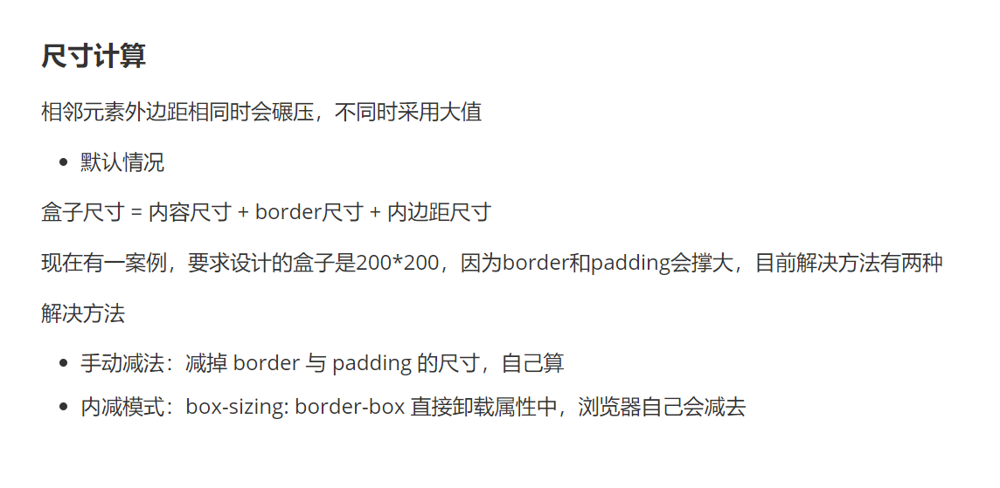

# Web开发

开始了？

开始了！


[TOC]


## 开发工具


### VS Code

**Visual Studio Code**（简称 **VS Code**）是一款由[微软](https://zh.wikipedia.org/wiki/微软)开发且跨平台的[免费](https://zh.wikipedia.org/wiki/免費軟體)[源代码编辑器](https://zh.wikipedia.org/wiki/集成开发环境)[[7\]](https://zh.wikipedia.org/wiki/Visual_S						l0pp0 tudio_Code#cite_note-TechCrunch-7)。该软件以扩展的方式支持[语法高亮](https://zh.wikipedia.org/wiki/語法高亮)、代码自动补全（又称 [IntelliSense](https://zh.wikipedia.org/w/index.php?title=IntelliSense&action=edit&redlink=1)）、[代码重构](https://zh.wikipedia.org/wiki/代码重构)功能，并且内置了[命令行](https://zh.wikipedia.org/wiki/命令行)工具和 [Git](https://zh.wikipedia.org/wiki/Git) 版本控制系统[[8\]](https://zh.wikipedia.org/wiki/Visual_Studio_Code#cite_note-8)。用户可以更改主题和键盘快捷方式实现个性化设置，也可以通过内置的[扩展程序](https://zh.wikipedia.org/wiki/插件)商店安装其他扩展以拓展软件功能。


#### 常用开发插件&设置

- 软件汉化插件：Chinese
- 打开网页插件：Open in browser
- 实时刷新插件：Live server
- 彩色缩进插件：Indent-rainbow
- 英语翻译插件：Code translate
- 格式化程序设置：Format on save
- 自动同步修改标签插件：Auto Rename Tag


## HTML5


### HTML基本骨架

```html
<html>
    <head>
        <title>网页标题</title>
    </head>
    <body>
        网页主体
    </body>
</html>
```

- html：整个网页
- head：网页头部，存放给浏览器看的代码，例如 CSS
- body：网页主体，存放给用户看的代码，例如 图片 文字
- title：网页标签

> 快速生成骨架 `! + enter/tab`


### 标签

作用：明确代码的书写位置

- 标签成对出现，中间包裹内容
- **`< >`** 里面放标签名(通常为英文字母)
- 结束标签比开始多一条  **`/`**


#### 标签类型

在HTML中总的把标签分为双标签与单标签

双标签

成对出现的标签

单标签

只有开始标签，没有结束标签

例如      `<br>` :换行     `<hr>` :水平线    


#### 浏览器标题栏标签

作用：标题栏的小图标

食用方法：`link:favicon` , 在hef中写icon路径

支持很多格式 ico svg png jpg 貌似都可以，ico和svg效果很好


#### meta标签

作用：用于提供关于 HTML 文档的元数据，这些元数据并不是直接显示在网页上，而是提供给浏览器与搜索引擎使用，同时一些属性能做到自动跳转等效果


##### content属性

本属性经常与其他属性值同用，起到提供具体元数据内容的作用

``

##### name属性

作用：提供索索内容名称


###### http-equiv属性值

本属性值用来模拟 http响应头，其中一个常见的用法就是通过refresh跳转到其他网页

```html
<meta http-equiv="refresh" conttent="5; url=https://lufangqian.top/">
```


###### keywords属性值

本属性值作用是搜索内容名称为网页关键字，搜索关键字的设置，需要搭配content属性使用，关键字之间使用逗号隔开


###### description属性值

本属性值作用是设置网站信息简述，就是浏览器搜索网站打开前标题下面的小字，同样需要搭配content使用


#### 标题标签

一般用于新闻标题、文章标题、网页区域名称、产品名称等等

标签名：`h1 ~ h6`

> 由大到小，h1标题为主标题，标题等级随着数字增大而减小

**注意事项**

- h1 标签在一个网页中建议只使用一次，用来放新闻标题或者网站的logo
- h2 ~ h6 没有使用次数的限制

> 以上两点为规范要求，并非语法要求，如要重复使用，也没啥事


#### 段落标签

一般用在新闻段落、文章段落、产品描述信息等等

标签名：**`p`**

段落标签内的文字会自动换行


#### 换行与水平线标签

换行： `<br>`

浏览器不识别代码中的Enter换行

水平线：`<hr>`

| 属性名 | 含义     | 属性值                               |
| ------ | -------- | ------------------------------------ |
| align  | 对齐方式 | 可选择 left right center ,默认center |
| size   | 粗细     | px，默认为2                          |
| color  | 颜色     | 颜色                                 |
| width  | 宽度     | 可以是确定的px，也可以是百分比数值   |


> 此标签为单标签


#### 文本格式化标签

作用：为文本添加特殊格式，以突出重点

常见的格式有：加粗、倾斜、下划线、删除线

**标签名**

加粗：`<strong>`  or  `<b>`

倾斜：`<em>`  or  `<i>`

下划线： `<ins>`  or  `<u>`

删除线：`<del>`  or  `<s>`

> 为了代码的可读性，通常使用左侧语义明显的标签，并且本标签允许嵌套


#### 图像标签

作用：在网页中插入图片

标签名：``

**`src 属性`**  用于指定图像的位置和名称，是  **``**  的必须属性

> 图片与代码文件放至同一文件夹即可使用 `./` 命令快捷添加，这种方法是 `相对路径`


###### 常见属性表

| 属性   | 作用       | 说明                               |
| ------ | ---------- | ---------------------------------- |
| alt    | 替换文本   | 图片无法显示的时候显示的文字       |
| title  | 提示文本   | 鼠标悬停在图片上面的时候现实的文字 |
| width  | 图片的宽度 | 值为数字，没有单位                 |
| height | 图片的高度 | 值为数字，没有单位                 |

> img标签 中的 alt属性 适用于可能加载失败，进行解释并提示
>
> 分别使用 width属性 与 height属性 浏览器默认是***等比缩放***


#### 超链接标签

作用：点击跳转到其他页面

标签名：**`<a href="链接">显示文字</a>`**

`target` 属性赋值 `"_blank"` 可实现新窗口跳转页面

例如：`<a href="https://lufangqian.top" target="_blank">陆方七安的导航</a>`

本示例意为在新窗口打开指向`lufangqian.top`网站的名叫陆方七安的导航的超链接

> 开发初期，不知道超链接的跳转地址，href属性值写#，表示空链接，不会跳转

a标签还可以跳转到特定位置，可以给要跳转到的位置的标签添加一个id，在a标签中给hef的值设置为#id名

```html
<a href="#top">返回顶部</a>

<!-- 在页面的顶部放置一个id为top的元素 -->
<div id="top"></div>
```

去除超链接默认样式

```css
a {
    color: inherit; /* 使用父元素的颜色 */
    text-decoration: none;
}
```


#### 音频标签

标签名：`<audio src="音频的URL"></audio>`

###### 常见属性表

| 属性                | 作用             | 特殊说明                 |
| ------------------- | ---------------- | ------------------------ |
| **src（必须属性）** | 音频URL          | 支持格式：MP3、Ogg、Wav  |
| controls            | 显示音频控制面板 |                          |
| loop                | 循环播放         |                          |
| autoplay            | 自动播放         | 浏览器一般会禁用自动播放 |

> 在HTML5中，如果属性名与属性值完全一样，则可简写为一个单词


#### 视频标签

标签名：`<video src="视频的URL"></video>`

###### 常见属性表

| 属性                | 作用             | 特殊说明                         |
| ------------------- | ---------------- | -------------------------------- |
| **src（必须属性）** | 视频URL          | 支持格式：MP4、WebM、Ogg         |
| controls            | 显示视频控制面板 |                                  |
| loop                | 循环播放         |                                  |
| muted               | 静音播放         |                                  |
| autoplay            | 自动播放         | 浏览器支持在**静音状态**自动播放 |

> 在HTML5中，如果属性名与属性值完全一样，则可简写为一个单词


### 列表标签

作用：布局内容排列整齐的区域

分类：无序、有序、定义列表


#### 无序列表

作用：布局排列整齐的不需要规定顺序的区域

标签名：`<ul>父级 <li>子级`

> ul是无序列表，只能包裹li标签；li是列表条目，可以包裹任何标签

```html
<ul>
    <li>第一项</li>
    <li>第二项</li>
    <li>第三项</li>
    …………
</ul>
```


#### 有序列表

作用：布局排列整齐的需要规定顺序的区域

标签名：`<ol>父级 <li>子级`

> ol是有序列表，只能包裹li标签；li是列表条目，可以包裹任何标签

```html
<ol>
    <li>第一项</li>
    <li>第二项</li>
    <li>第三项</li>
    …………
</ol>
```


#### 定义列表

标签名：`<dl>父级 <dt>子级-列表标题 <dd>子级-列表详情`

```html
<dl>
    <dt>列表标题</dt>
    <dd>列表详情</dd>
    …………
</dl>
```


### 无语义布局标签

作用：布局网页，划分网页区域，摆放内容

- `div` :独占一行，大盒子
- `span` :不换行，小盒子

> 两个标签都是双标签，其中包裹的内容可以是任何内容


### 表格

#### 表格标签

作用：网页中的表格与Excel表格类似，用来展示数据

标签名：`table 嵌套 tr  tr嵌套td/th`

| 标签名 | 说明       |
| ------ | ---------- |
| table  | 表格       |
| tr     | 行         |
| th     | 表头单元格 |
| td     | 内容单元格 |

> 在网页中，表格默认没有边框线，使用 border 属性可以添加边框线

```html
 <table border="1">
        <tr>
            <th>表头1</th>
            <th>表头2</th>
            <th>表头3</th>
        </tr>
        <tr>
            <td>第二行第一格</td>
            <td>第二行第二格</td>
            <td>第二行第三格</td>
        </tr>
```


#### 表格结构标签

作用：用表格结构标签把内容划分区域，让表格结构更清晰，语义更清晰

> 可以不写

| 标签名 | 含义     | 特殊说明     |
| ------ | -------- | ------------ |
| thead  | 表格头部 | 表格头部内容 |
| tbody  | 表格主体 | 主要内容区域 |
| tfoot  | 表格底部 | 汇总信息区域 |


#### 合并单元格

作用：将多个单元格合并成一个单元格，以合并同类信息

其中，跨行合并与跨列合并不同

合并时会保留**最左**、**最上**单元格中的内容

属性：

- 跨行合并，保留最上单元格，添加属性 `rowspan`
- 跨列合并，保留最左单元格，添加属性 `colspan`

> 本属性应用于<td>、<th>等子级标签


### 表单

作用：收集信息

例如：登录页面、注册页面、搜素页面

将多个标签放置在同一表单中，使用 `form` 标签

提交数据需要使用 `form` 标签中的 `action` 属性，属性值为提交数据的地址


#### input标签

input 标签 比较特殊 Type属性值不同，则功能不同

标签名：

```html
<input type="……">
```


| Type 属性值 | 说明                     |
| ----------- | ------------------------ |
| text        | 文本框，用于输入单行文本 |
| password    | 密码框                   |
| radio       | 单选框                   |
| checkbox    | 多选框                   |
| file        | 上传文件                 |


占位文本：提示信息

> 当有多个文本输入框时，占位文本可以提示输入，此属性可用于文本框与密码框

在input标签中添加属性 `placeholder`

```html
<input type="……" placeholder="提示信息">
```


##### 单选框 radio

常用属性：

| 属性名  | 作用     | 特殊说明                             |
| ------- | -------- | ------------------------------------ |
| name    | 控件名称 | 控件分组，同组只能选中一个(单选功能) |
| checked | 默认选中 | 属性名和属性值相同，简写为一个单词   |

> name属性相同将划分为一组，同组的单选框只能有一个被选中


##### 上传文件 file

使用 `multiple` 属性可以实现文件多选


##### 多选框 checkbox

多选框也叫复选框

默认选中：checked

```html
<input type="checkbox" checked>
```


#### 下拉菜单

使用例子：用户注册时选择城市时可以使用下拉菜单选择城市

标签名：`select` 嵌套 `option`, `select`是下拉菜单的整体，`option`是下拉菜单的每一项

标签名：

```html
<select>
    <option>北京</option>
    <option>上海</option>
    <option>深圳</option>
    <option>广州</option>
    <option>武汉</option>
    <option selected>下北泽</option>
</select>
```

> selected属性为默认选项


#### 文本域

作用：多行输入文本的表单控件

标签名：`textarea` 双标签

> 提示文字在双标签里，或者使用 placeholder


#### Label标签

作用：网页中，某个标签的说明文本

tips：用 `Lable` 标签绑定文字和表单控件的关系，增大表单控件的点击范围

实现此功能有两个写法

实现方法：

- 写法一

label 标签只包裹内容，不包过表单控件

这只 label 标签的 for 属性值 和 表单控件的 id 属性值相同

```html
<input type="radio" id ="man">
<label for="man">男</label>
```


- 写法二

label 标签中包含 input 标签，此时则不需要属性

```html
<label><input type="radio">男</label>
```

> 方法一中两个标签为并列的关系，方法二是label标签为父级，input为子级，属于包含关系


tips：支持 label 标签增大点击范围的表单控件有

- 文本框
- 密码框
- 上传文件
- 单选框
- 多选框
- 下拉菜单
- 文本域
- ……


#### 按钮标签

作用：与用户进行交互的重要对象，通常用于提交，选择等场景

标签名：

```html
<button type="">
    按钮
</button>
```

| Type属性值 | 说明                                             |
| ---------- | ------------------------------------------------ |
| submit     | 提交按钮，点击后可以提交数据到后台(默认选项)     |
| reset      | 重置按钮，点击后将表单控件恢复默认值             |
| button     | 普通按钮，默认没有功能，一般配合 JavaScript 使用 |


### 字符实体

作用：在网页中显示预留字符

| 显示结果 | 描述   | 实体名称 |
| -------- | ------ | -------- |
|          | 空格   | `&nbsp;` |
| <        | 小于号 | `&lt;`   |
| >        | 大于号 | `&gt;`   |


### 注释

HTML的注释方式为  **`<!--内容-->`**

VS Code 中，添加/删除注释的快捷键是 **`Ctrl + /`**


### 路径

定义：路径指的是查找文件时，从起点到终点经历的路线

分类：

- 相对路径：从当前文件位置出发查找目标文件
- 绝对路径：从盘符出发查找目标文件

#### 相对路径

从当前文件位置出发查找目标文件

- **`/`** 表示进入某个文件夹里面  
- **`.`** 表示当前文件所在文件夹
- **`./`** 为当前目录   **`../`**为上一级路径   **`../../`**为上上一级路径  以此类推

#### 绝对路径

- Windows电脑从 盘符 出发
- Mac电脑从根 目录(/) 出发


## CSS开发

### 关于CSS

定义：CSS中文名称为 **`层叠样式表(Cascading Style Sheets)`**，是一种 **`样式表`** 语言，用来描述 HTML 文档的呈现(美化内容)。

书写位置： title 标签正下方 添加 style 双标签，style 标签里面书写 CSS 代码


### CSS特性

CSS特性：化简代码/定位问题，并解决问题

- 继承性
- 层叠性
- 优先级

#### 继承性

特点：子级默认继承父级的文字控制属性

比如在body标签设置文字控制属性，body内的文字都将默认跟随body设置

如果标签有自己的样式则生效自己的样式，不继承


#### 层叠性

特点：

- 相同的属性会覆盖：后面的CSS属性会覆盖前面的CSS属性
- 不同的属性会叠加：不同的CSS属性都能生效


#### 优先级

特点：优先级也叫权重，当一个标签使用了多种选择器时，基于不同种类的选择器的匹配规则

规则：选择器指向性越强，其优先级越高优先生效

排列：

伪类选择器 < 通配符选择器 < 标签选择器 < 类选择器 < id选择器 < 行内样式 < !impotant

> 总的来说 选中标签的范围越大，优先级越低 !important最优先

举个栗子

```html
<style>
    div{
        color: red;
    }

    .box{
        color；green;
    }
</style>

<div class="box">
    此时 div标签 内容为绿色
</div>
```


##### 叠加计算规则

特点：如果是复合选择器，则需要权重叠加计算

公式：行内样式 > id选择器个数 > 类选择器个数 > 标签选择器个数

规则：

- 从左向右 一次比较选择器个数，同一级个数多的优先级高；个数相同，则向后比较
- `!important` 权重最高
- 继承权重最低


### CSS引入方式

- 内部样式表

CSS代码写在 style 标签里面

```html
<!DOCTYPE html>
<html lang="en">

<head>
    <meta charset="UTF-8">
    <meta name="viewport" content="width=device-width, initial-scale=1.0">
    <title>CSS测试场</title>
    <style>
		/*此处书写CSS代码*/
        /*选择器*/
        p{
            /*CSS属性*/
            color:red;
            font-size:30px;
            
        }
    </style>
</head>
	<body>
	<p>Hello World</p>
	</body>
</html>
```


- 外部样式表

首先，CSS 代码写在单独的 CSS 文件中（.css）

其次，在 HTML 使用 link 标签引入

```html
<link rel="stylesheet" href="CSS文件路径">
```


- 行内样式表

通常配合 JavaScript 使用

CSS 写在标签的 style 属性值里

```html
<div style="color:red;font-size:20px">这是 CSS 行内样式</div>
```


### 属性


#### 常用属性

键值对：通常，我们将属性名与属性值成对出现的属性叫键值对

| 属性名           | 说明     |
| ---------------- | -------- |
| color            | 文字颜色 |
| font-size        | 字体大小 |
| width            | 宽度     |
| height           | 高度     |
| background-color | 背景色   |
|                  |          |
|                  |          |
|                  |          |
|                  |          |


#### 字体属性

字体属性表

| 名称         | 属性名          | 说明               |
| ------------ | --------------- | ------------------ |
| 字体大小     | font-size       | 修改文字大小       |
| 字体粗细     | font-weight     | 修改文字粗细       |
| 字体倾斜     | font-style      | 使文字倾斜         |
| 行高         | line-height     | 修改行高           |
| 字体族       | font-family     | 修改字体，如宋体   |
| 字体复合属性 | font            | 复合属性           |
| 文本缩进     | text-indent     | 修改前后缩进       |
| 文本对齐     | text-align      | 修改文本对齐方式   |
| 修饰线       | text-decoration | 上中下贯穿文本的线 |
| 颜色         | color           | 修改文字颜色       |

##### 引入自定义字体

属性名：`@font-face{ }`

引入字体后无需客户端安装，自动使用引入的字体

```css
@font-face {
    font-family:bbt;/*字体名叫bbt*/
    src: url(../btt.ttf);/*相对路径引入*/
}
```


##### 字体大小

属性名：font-size

属性值：文字尺寸，PC 端网页常用单位 `px`

> 通常来说，谷歌浏览器默认字体大小为16px


##### 字体粗细

属性名：font-weight

属性值：

- **数字**

正常为400，加粗为800

- **关键字**

正常：`normal` ，加粗：`bold`


##### 字体倾斜

属性名：font-style

属性值：不倾斜 `nomal`   倾斜 `italic`


##### 行高

作用：设置多行文本的间距

属性名：line-height

属性值：

- 数字 + px
- 数字（当前标签font-size属性值的倍数）


##### 字体族

属性名：font-family

属性值：字体名

font-family属性值可以书写多个字体名，各个字体名用 逗号 隔开，执行顺序从左到右依次查找

其最后一个属性可以设置一个字体族名，其作用为 当前面的字体皆未找到，将使用通用的字体族，比如 sans-seif 为无衬线字体

```css
font-family:楷体;

font-family:Microsoft YaHei,Heiti SC,tahoma,arial,Hiragino Sans GB,"\5B8B\4F53",sans-seif;
```


##### font复合属性

复合属性：属性的间歇方式，一个属性对应多个值的写法，各个属性之间用空格隔开

font： 是否倾斜 是否加粗 字号/行高 字体（必须按顺序书写）

注意：字号和字体值必须书写也必须按顺序书写，否则 font 属性不生效

就是把上面的属性合成一行，食用方法如下

```css
/*font：是否倾斜 是否加粗 字号/行高 字体;*/
font: italic 700 30px/2 楷体; 
```


##### 文本缩进

属性名：text-indent

属性值：

- 数字 + px
- 数字 + em（1em = 当前标签的字号大小）

经常用来首行空两格，em就相当于一个字，会随字号更改，所以使用em更多


##### 文本对齐

作用：控制内容水平对齐方式

属性名：text-align

属性值：

| 属性值 | 效果           |
| ------ | -------------- |
| left   | 左对齐（默认） |
| center | 居中对齐       |
| right  | 右对齐         |

text-align本质使控制内容的对齐方式，属性要设置给内容的父级

举个栗子：让图片居中不能在 `` 标签中使用属性，需要给其父标签添加属性


##### 文本修饰线

属性名：text-decoation
属性值：

| 属性值       | 效果   |
| ------------ | ------ |
| none         | 无     |
| underline    | 下划线 |
| line-through | 删除线 |
| overline     | 上划线 |


##### 文字颜色

属性名：color

属性值：

| 表示方法       | 属性值        | 说明                            |
| -------------- | ------------- | ------------------------------- |
| 颜色关键字     | 颜色英文单词  | red、green、blue                |
| rgb表示法      | rgb(r,g,b)    | r,g,b表示红绿蓝三原色           |
| rgba表示法     | rgba(r,g,b,a) | a表示透明度，取值0-1            |
| 十六进制表示法 | #RRGGBB       | #000000，#ffcc00 简写:#000,#fc0 |


#### 背景属性


##### 背景图

属性名：background-image(bgi)

属性值：url(背景图的 URL)

在网页中，使用背景图实现 **装饰性** 的图片效果


举个栗子

```css
div{
    width: 400px;
    height: 400px;
    
    background-image: url(./images/1.png);
    
}
```

为以上例子做解释，设置 div标签 样式为宽高400px，并且将背景图设置为相对路径的1.png


> 提示：在浏览器中，背景图默认是平铺的效果，也就是容器的尺寸大就会复制几张填充满；同时，因为是背景图，div标签中有文字将显示在图片之上


##### 背景图平铺方式

属性名：background-repeat (bgr)

属性值：

| 属性值    | 效果             |
| --------- | ---------------- |
| no-repeat | 不平铺           |
| repeat    | 平铺（默认效果） |
| repeat-x  | 水平方向平铺     |
| repeat-y  | 垂直方向平铺     |

以下是对各个属性值效果的描述：

- no-repeat：只有一张图片，显示在容器的左上角不会扩展
- repeat：复制图片填满容器
- repeat-x：只有横向复制图片
- repeat-y：只有竖向复制图片


##### 背景图位置

属性名：background-position (bgp)

属性值：水平方向位置 垂直方向位置

关键字：

| 关键字 | 位置 |
| ------ | ---- |
| left   | 左侧 |
| right  | 右侧 |
| center | 居中 |
| top    | 顶部 |
| bottom | 底部 |

坐标： 数字 + px  /  关键字

注意事项：

- 数字可以与关键字混用
- 数字正负皆可
- 数字是从容器左上角计算
- 水平方向正数向右移动，负数像左侧移动；
- 垂直方向正数向下移动，负数向上移动；
- 超出容器的部分会被裁切

**特殊提醒：**

- 关键字取值方式写法，可以颠倒取值顺序
- 可以只写一个关键字，另一个方向默认居中；数字只写一个值表示水平方向，垂直方向为居中


##### 背景图缩放

属性名：background-size (bgz)

作用：设置背景图大小

常用属性值：

- 关键字

​	cover：等比例缩放背景图片以完全覆盖背景区，可能背景图部分看不见

​	contain：等比例缩放背景图片以完全装入背景区，可能背景区部分空白

- 百分比：根据容器尺寸计算图片大小，注意：100%表示图片的宽度跟容器的宽度一样，图片的高度按照图片比例等比例缩放
- 数字 + 单位（例如：px）


##### 背景图固定

属性名：background-attachment (bga)

属性值：fixed

作用：背景不会随着元素的内容滚动


##### 背景复合属性

属性名：background (bg)

属性值：背景色 背景图 背景图平铺方式 背景图位置/背景图缩放 背景图固定（空格隔开各个属性值，不区分顺序）

> 类似于字体复合属性值，就是一条写出整个背景图的属性

```css
div()
{
    width: 400px;
    height: 400px;
    
    background: pink url(./images/1.png) no-repeat right center/cover;
}
```

> 翻一下就是背景粉色，图片为1.png，不平铺，水平靠右侧，垂直居中，等比例缩放完全覆盖容器，可能有截取


#### 布局属性


------

##### 容器大小最值

**最小 `min-height` 属性**

- **定义**：指定一个元素的最小高度。即使内容较少，元素的高度也不会低于这个值。
- **语法**：
  ```css
  min-height: <length> | <percentage>;
  ```
  - `<length>`：可以使用绝对单位如`px`、`cm`等；也可以使用相对单位如`em`、`rem`。
  - `<percentage>`：相对于包含块的高度百分比。

- **示例**：
  ```css
  .container {
      min-height: 200px;
  }
  ```
  这个例子确保了`.container`类至少有200px的高度，但如果内容更多，则会自动扩展。

**应用场景**

- 确保容器有足够的空间来容纳其内容。
- 在响应式设计中，为不同屏幕尺寸提供一致的最低高度。

---

**最大`max-height` 属性**

- **定义**：指定一个元素的最大高度。如果内容超出这个高度，通常会触发滚动条（需结合`overflow`属性使用），或者内容被隐藏（取决于其他样式设置）。
- **语法**：
  ```css
  max-height: <length> | <percentage>;
  ```
  类似于`min-height`，但这里是设置最大值。

- **示例**：
  ```css
  .content-box {
      max-height: 400px;
      overflow-y: auto; /* 超出部分显示垂直滚动条 */
  }
  ```
  此示例限制了`.content-box`的高度不超过400px，超出部分可通过滚动查看。

**应用场景**

- 控制图片或文本区域的最大尺寸，防止页面布局因内容过多而破坏。
- 结合`overflow`属性实现优雅的内容溢出处理方案。

---

**组合使用**

- 使用`min-height`和`max-height`组合可以创建更灵活的高度范围：
  ```css
  .flexible-container {
      min-height: 150px;
      max-height: 500px;
      overflow-y: auto;
  }
  ```
  这样，`.flexible-container`将至少有150px高，并且最多不会超过500px，超出部分可通过滚动查看。

**注意事项**

- 当使用百分比作为`min-height`或`max-height`的值时，需要确保父元素有一个明确的高度，否则百分比可能无法正确计算。
- 在某些情况下，特别是对于表格单元格（`td`或`th`），这些属性可能不起作用或行为有所不同，因为表格布局有自己的规则。

通过合理使用`min-height`和`max-height`，可以极大地增强网页布局的灵活性和适应性，特别是在响应式设计和动态内容加载场景下。


##### 垂直对齐方式

属性名：vertical-align (va)

属性值：

| 属性值      | 适用场景                 | 效果描述                                                     |
| ----------- | ------------------------ | ------------------------------------------------------------ |
| baseline    | 默认值                   | 元素的基线与父元素的基线对齐                                 |
| top         | 行内/表格元素            | 元素顶部与行/单元格的最高元素顶部对齐                        |
| middle      | 行内/表格元素            | 元素中线与父元素的基线+0.5ex高度对齐（表格中表现为垂直居中） |
| bottom      | 行内/表格元素            | 元素底部与行/单元格的最低元素底部对齐                        |
| text-top    | 行内元素                 | 元素顶部与父元素字体的顶端对齐                               |
| text-bottom | 行内元素                 | 元素底部与父元素字体的底端对齐                               |
| sub         | 特殊文本                 | 模拟`<sub>`标签效果，将基线降低到合适位置                    |
| super       | 特殊文本                 | 模拟`<sup>`标签效果，将基线提升到合适位置                    |
| 长度值      | 精确调整（如2px, 0.5em） | 相对于基线向上（正值）或向下（负值）移动                     |
| 百分比值    | 相对行高调整             | 根据元素的line-height值计算移动距离（如50%）                 |

以下是对核心属性值的补充说明：
- **baseline**：文本类元素（如`<span>`）默认对齐方式，图片底部会与基线对齐
- **middle**：在表格单元格中可实现真正垂直居中，但在行内元素中可能受字体影响
- **top/bottom**：对齐依据是当前行框(line box)的最高/最低元素，而非容器边界
- **text-top/text-bottom**：对齐标准是父元素的字体尺寸，而非实际内容高度

###### 注意事项
1. 仅对以下元素有效：
   - 行内元素（`display: inline`）
   - 行内块元素（`display: inline-block`）
   - 表格单元格（`display: table-cell`）

2. 常见无效场景：
   - 块级元素（需改用flex/grid布局）
   - 绝对定位元素
   - 浮动元素

3. 图片对齐建议：
   ```css
   img {
     vertical-align: middle; /* 消除图片底部间隙 */
   }
   ```

4. 表格特殊行为：
   ```css
   td {
     vertical-align: middle; /* 单元格内容垂直居中 */
   }
   ```

###### 总结图示
```
[父元素]
│
├── text-top ──────┐
├── baseline ──────┤ ← 基线与父元素文字对齐
├── text-bottom ──┤
│                  ↓
│  [子元素]        → 可用长度/百分比值微调
└── line-height区域
```


#### 修饰属性


##### 过渡动画属性

属性名：transition (trs)

属性值（简写语法）：
```css
transition: <property> <duration> <timing-function> <delay>;
/*常用就是这样的*/
transition: all 1s;
```

> 本属性写于标签本身的css，不要写在类似于hover的css中

###### 详细属性分解表

| 子属性                     | 属性值示例                          | 默认值 | 作用描述                                           |
| -------------------------- | ----------------------------------- | ------ | -------------------------------------------------- |
| transition-property        | all, width, opacity                 | all    | 指定应用过渡的CSS属性（多个属性用逗号分隔）        |
| transition-duration        | 0.3s, 500ms                         | 0s     | 定义动画持续时间（必须指定至少该属性才会触发动画） |
| transition-timing-function | ease, cubic-bezier(.17,.67,.83,.67) | ease   | 控制动画速度曲线                                   |
| transition-delay           | 0.2s, 100ms                         | 0s     | 设置动画开始前的延迟时间                           |

###### 缓动函数详解表
| 函数值                | 运动曲线特征         | 典型应用场景         |
| --------------------- | -------------------- | -------------------- |
| ease                  | 先加速后减速（默认） | 通用动画效果         |
| linear                | 匀速运动             | 进度条、机械运动     |
| ease-in               | 逐渐加速             | 物体下落效果         |
| ease-out              | 逐渐减速             | 弹窗关闭效果         |
| ease-in-out           | 对称加减速           | 页面切换过渡         |
| cubic-bezier(n,n,n,n) | 自定义贝塞尔曲线     | 需要特殊节奏的动画   |
| steps(n)              | 分步跳跃变化         | 帧动画、数字切换效果 |

###### 注意事项
1. **生效前提**：
   - 元素必须具有有效可过渡属性（如尺寸/位置/颜色等）
   - 需要明确的属性值变化触发（如:hover状态切换）

2. **性能优化**：
   ```css
   /* 优先使用以下高性能属性 */
   transform: translate/scale/rotate;
   opacity: 0-1;
   filter: 简单效果;
   ```

3. **多属性控制**：
   ```css
   /* 同时控制多个属性的过渡 */
   .box {
     transition: 
       transform 0.3s ease-out,
       opacity 0.2s linear 50ms;
   }
   ```

4. **隐式动画关闭**：
   ```css
   /* 强制禁用所有过渡 */
   .no-transition {
     transition: none !important;
   }
   ```

###### 最佳实践示例
```css
/* 基础悬停效果 */
.button {
  transition: all 0.3s ease;
  background: #3498db;
}
.button:hover {
  background: #2980b9;
  transform: translateY(-2px);
}

/* 级联动画控制 */
.card {
  transition: 
    opacity 0.4s cubic-bezier(0.25, 0.46, 0.45, 0.94),
    transform 0.4s 0.1s ease-out;
}
.card.hidden {
  opacity: 0;
  transform: scale(0.9);
}
```

###### 总结图示
```
[动画时间轴]
│         ↗↘
│       ↗    ↘       ease-in-out曲线示例
│     ↗        ↘
│   ↗            ↘
├───┐              ┌───►
0  delay         duration
```


##### 透明度控制

属性名：opacity (opa)

属性值：

| 属性值      | 效果描述                     |
| ----------- | ---------------------------- |
| 0           | 完全透明（元素不可见）       |
| 0~1之间数值 | 半透明（如0.5表示50%透明度） |
| 1           | 完全不透明（默认值）         |

###### 核心特性说明
- **继承性**：不继承，但子元素会受父元素透明度影响（实际表现为叠加计算）
- **作用范围**：影响元素**及其所有子元素**的可见度
- **布局特性**：透明元素仍占据文档流空间（与`visibility: hidden`不同）
- **性能表现**：支持GPU加速，适合用于动画过渡

###### 属性值详解
- **0**：
  - 元素完全透明，但依然可交互（可点击/聚焦）
  - 常用于实现淡出效果或无障碍隐藏
  ```css
  .hidden { opacity: 0; }
  ```

- **0~1之间数值**：
  - 实现元素半透明效果
  - 叠加计算公式：`最终透明度 = 父元素opacity * 当前元素opacity`
  ```css
  .translucent { opacity: 0.7; }
  ```

- **1**：
  - 默认状态，元素完全不透明
  - 常用于重置继承的透明状态
  ```css
  .reset-opacity { opacity: 1 !important; }
  ```

###### 注意事项
1. **交互保留**：
   ```css
   /* 透明元素仍可交互 */
   .ghost-button {
     opacity: 0.5;
     pointer-events: none; /* 需额外添加该属性禁用交互 */
   }
   ```

2. **叠加特性**：
   ```html
   <!-- 父元素opacity:0.5，子元素opacity:0.6 → 实际显示0.3 -->
   <div class="parent">
     <div class="child"></div>
   </div>
   ```

3. **与RGBA的区别**：
   ```css
   /* 仅影响背景透明度（不影响子元素） */
   .bg-transparent { background: rgba(0,0,0,0.5); }
   
   /* 影响整个元素及子元素 */
   .element-transparent { opacity: 0.5; }
   ```

4. **动画优化**：
   ```css
   /* 优先使用opacity实现淡入淡出 */
   .fade-in {
     transition: opacity 0.3s ease;
     opacity: 1;
   }
   ```

###### 应用场景示例
1. 基础淡入效果：
   ```css
   .fade {
     opacity: 0;
     transition: opacity 0.4s ease-in;
   }
   .fade.active {
     opacity: 1;
   }
   ```

2. 模态框遮罩层：
   ```css
   .overlay {
     position: fixed;
     top: 0;
     left: 0;
     width: 100%;
     height: 100%;
     background: black;
     opacity: 0.6;
   }
   ```

3. 加载状态提示：
   ```css
   .loading {
     opacity: 0.8;
     transition: opacity 0.2s;
   }
   .loading:hover {
     opacity: 1;
   }
   ```

###### 总结图示
```
透明度层级
┌───────────────┐
│  父元素opa:0.6│
│  ┌───────────┐│
│  │ 子元素opa:0.5 → 实际显示0.3 │
│  └───────────┘│
└───────────────┘
```


##### 光标样式控制

属性名：cursor  

属性值：  

| 属性值                  | 适用场景       | 效果描述                                  |
| ----------------------- | -------------- | ----------------------------------------- |
| default                 | 默认状态       | 浏览器默认光标（通常为箭头）              |
| pointer                 | 可点击元素     | 手形光标（常用于链接、按钮）              |
| text                    | 文本输入区域   | I形文本选择光标                           |
| move                    | 可拖拽元素     | 十字箭头（表示可移动）                    |
| wait                    | 加载等待状态   | 旋转圆圈/沙漏（表示系统繁忙）             |
| not-allowed             | 禁止操作       | 带斜杠的圆圈（表示当前操作不可用）        |
| crosshair               | 精准定位       | 十字线光标（用于绘图、测量工具）          |
| grab                    | 可抓取元素     | 手掌张开（表示可抓取，如拖拽视图）        |
| grabbing                | 抓取中状态     | 手掌闭合（表示正在抓取）                  |
| zoom-in / zoom-out      | 缩放操作       | 放大镜+“+”/“-”号（用于图片缩放控制）      |
| col-resize / row-resize | 调整列/行宽高  | 双向水平/垂直箭头（用于表格或分割线调整） |
| cell                    | 表格单元格选择 | 单元格选择框（类似Excel的光标）           |
| help                    | 帮助信息       | 箭头+问号（表示有额外说明）               |
| progress                | 后台处理中     | 箭头+旋转圆圈（表示进程运行但可交互）     |
| url()                   | 自定义光标     | 加载外部光标文件（需提供备用值）          |

---

 

- **pointer**：  
  浏览器中点击反馈的通用标识，建议与 `:hover` 状态配合使用：  
  ```css
  button:hover {
    cursor: pointer;
  }
  ```

- **grab系列**：  
  用于拖拽交互场景，需注意旧版浏览器可能显示为 `move`：  
  ```css
  .draggable {
    cursor: grab;
  }
  .draggable:active {
    cursor: grabbing;
  }
  ```

- **not-allowed**：  
  需同步禁用元素交互性以达到最佳效果：  
  
  ```css
  button:disabled {
    cursor: not-allowed;
    opacity: 0.6;
  }
  ```
  
- **自定义光标**：  
  支持 `.cur`、`.png` 等格式，需定义备用值：  
  ```css
  .magic-cursor {
    cursor: url('wand.cur'), url('wand.png'), auto;
  }
  ```

---

###### 注意事项  
1. **浏览器兼容性**：  
   - `grab`、`zoom-in` 等新特性需在CSS中提供备用值：  
     ```css
     .modern-cursor {
       cursor: grab;
       cursor: -webkit-grab; /* 旧版Webkit内核浏览器 */
     }
     ```

2. **无障碍设计**：  
   - 避免滥用特殊光标干扰用户认知  
   - 禁用状态需同时设置 `aria-disabled="true"`  

3. **性能优化**：  
   - 自定义光标文件建议小于32x32像素  
   - 避免对大面积元素使用复杂光标  

---

###### 应用场景示例  
1. 拖拽列表项：  
   ```css
   .list-item {
     cursor: move;
     transition: transform 0.2s;
   }
   .list-item:dragging {
     cursor: grabbing;
     opacity: 0.8;
   }
   ```

2. 图片缩放控制：  
   ```css
   .zoom-control {
     cursor: zoom-in;
   }
   .zoom-control.active {
     cursor: zoom-out;
   }
   ```

3. 自定义游戏光标：  
   ```css
   .game-canvas {
     cursor: url('sword.cur'), url('sword.png'), crosshair;
   }
   ```

---

###### 总结图示  
```
[光标类型映射]
┌───────────┬───────────────┐
│  default  │      →        │ 常规操作
│  pointer  │      →        │ 点击反馈
│  text     │      →        │ 文本输入
│  move     │      →        │ 拖拽移动
└───────────┴───────────────┘
```


###### **综合案例**

```Html
css鼠标手型cursor中hand与pointer
Example：CSS鼠标手型效果 <a href="#" style="cursor:hand">CSS鼠标手型效果</a><br/>
Example：CSS鼠标手型效果 <a href="#" style="cursor:pointer">CSS鼠标手型效果</a><br/>
注：pointer也是小手鼠标，建议大家用pointer，因为它可以兼容多种浏览器。<br/>
Example：CSS鼠标由系统自动给出效果 <a href="#" style="cursor:auto">CSS鼠标由系统自动给出效果</a><br/>
Example：CSS鼠标十字型 效果 <a href="#" style="cursor:crosshair">CSS鼠标十字型 效果</a><br/>
Example：CSS鼠标I字型效果 <a href="#" style="cursor:text">CSS鼠标I字形效果</a><br/>
Example：CSS鼠标等待效果 <a href="#" style="cursor:wait">CSS鼠标等待效果</a><br/>
Example：CSS鼠标默认效果 <a href="#" style="cursor:default">CSS鼠标默认效果</a><br/>
Example：CSS鼠标向右的箭头效果 <a href="#" style="cursor:e-resize">CSS鼠标向右的箭头效果</a><br/>
Example：CSS鼠标向右上箭头效果 <a href="#" style="cursor:ne-resize">CSS鼠标向右上箭头效果</a><br/>
Example：CSS鼠标向上箭头效果 <a href="#" style="cursor:n-resize">CSS鼠标向上箭头效果</a><br/>
Example：CSS鼠标向左上箭头效果 <a href="#" style="cursor:nw-resize">CSS鼠标向左上箭头效果</a><br/>
Example：CSS鼠标向左箭头效果 <a href="#" style="cursor:w-resize">CSS鼠标向左箭头效果</a><br/>
Example：CSS鼠标向左下箭头效果 <a href="#" style="cursor:sw-resize">CSS鼠标向左下箭头效果</a><br/>
Example：CSS鼠标向下箭头效果 <a href="#" style="cursor:s-resize">CSS鼠标向下箭头效果</a><br/>
Example：CSS鼠标向右下箭头效果 <a href="#" style="cursor:se-resize">CSS鼠标向下箭头效果</a><br/>
```


##### 删除项目符号

使用 `list-style:none` 删除项目符号

```html
<style></style>
.no-bullets {
    list-style: none; /* 移除所有列表项的项目符号 */
    padding-left: 0;  /* 可选：移除默认的内边距 */
}

/* 如果你需要对ol（有序列表）也进行相同的操作 */
.no-bullets ol {
    list-style: none;
}
</style>
<ul class="no-bullets">
    <li>项目 1</li>
    <li>项目 2</li>
    <li>项目 3</li>
</ul>
```


##### 线性渐变（Linear Gradient）

- **基本语法**：
  
  ```css
  background: linear-gradient(direction, color-stop1, color-stop2, ...);
  ```
- **参数说明**：
  - **`direction`**：渐变的方向。可以是角度值（如 `45deg`）或关键字（如 `to top`, `to bottom`, `to left`, `to right`）。
  - **`color-stop`**：定义渐变中的颜色及其位置。格式为 `color position`，其中 `position` 是可选的，默认从 0% 开始。

- **常见用法**：
  - **从上到下**：
    ```css
    background: linear-gradient(to bottom, red, blue);
    ```
  - **从左到右**：
    ```css
    background: linear-gradient(to right, red, blue);
    ```
  - **带有颜色停止点**：
    ```css
    background: linear-gradient(to right, red 0%, yellow 50%, blue 100%);
    ```
  - **使用角度**：
    ```css
    background: linear-gradient(45deg, red, blue);
    ```


##### 径向渐变（Radial Gradient）

- **基本语法**：
  ```css
  background: radial-gradient(shape size at position, color-stop1, color-stop2, ...);
  ```
- **参数说明**：
  - **`shape`**：渐变的形状，可以是 `circle` 或 `ellipse`（默认为 `ellipse`）。
  - **`size`**：渐变的大小，可以是以下关键字之一：
    - `closest-side`
    - `farthest-side`
    - `closest-corner`
    - `farthest-corner`
  - **`position`**：渐变的中心点位置，默认为 `center`。
  - **`color-stop`**：定义渐变中的颜色及其位置。格式为 `color position`，其中 `position` 是可选的，默认从 0% 开始。

- **常见用法**：
  - **简单的圆形径向渐变**：
    ```css
    background: radial-gradient(circle, red, blue);
    ```
  - **椭圆形径向渐变**：
    ```css
    background: radial-gradient(ellipse, red, blue);
    ```
  - **带有颜色停止点**：
    ```css
    background: radial-gradient(circle, red 0%, yellow 50%, blue 100%);
    ```
  - **自定义渐变形状和大小**：
    ```css
    background: radial-gradient(circle farthest-corner at 20% 30%, red, blue);
    ```


**实践建议**

1. **实验不同的颜色组合**：尝试不同的颜色组合来观察效果。
2. **调整渐变方向和角度**：通过改变 `direction` 和 `angle` 参数，探索不同的渐变方向。
3. **使用颜色停止点**：利用颜色停止点来创建更复杂的渐变效果。
4. **结合其他CSS属性**：可以将渐变与其他CSS属性（如 `border-radius` 和 `box-shadow`）结合使用，以创建更加丰富的视觉效果。


### 显示模式

显示模式：标签（元素）的显示方式

作用：布局网页的时候，根据标签的显示模式选择合适的标签摆放内容


#### 块级元素

- 独占一行
- 宽度默认是父级的100%
- 添加宽高

举例：使用比较多的是 DIV标签


#### 行内元素

- 一行可以显示多个
- 设置宽高属性不生效
- 宽高尺寸由内容撑开

举例：使用比较多的是 Span标签


#### 行内块元素

- 一行可以设置多个
- 设置宽高属性也生效
- 宽高尺寸也可以由内容撑开

举例：使用比较多的是 img图片标签


#### 转换显示模式


##### **不保留空间显示**

属性名：`display`

属性值：

| 属性值       | 效果     |
| ------------ | -------- |
| block        | 块级     |
| inline-block | 行内块   |
| inline       | 行内     |
| none         | 不会显示 |

> 提示：div对齐是根据他的文本而不是背景色


##### **保留空间显示**

属性名：`visibility`

属性值：

| 值      | 描述                   |
| ------- | ---------------------- |
| visible | 默认值。元素是可见的。 |
| hidden  | 元素是不可见的。       |

**display和visibility案例：**

```html
<!DOCTYPE html>
<html>
<head>
  <style>
    .box {
      width: 200px;
      height: 100px;
      margin: 10px;
      background: lightblue;
      border: 2px solid blue;
    }

    .display-none {
      display: none; /* 完全隐藏且不占空间 */
    }

    .visibility-hidden {
      visibility: hidden; /* 隐藏但保留空间 */
    }

    /* 子元素可见性控制示例 */
    .parent {
      visibility: hidden;
      background: pink;
      padding: 20px;
    }
    .child {
      visibility: visible; /* 强制子元素可见 */
    }
  </style>
</head>
<body>
  <div class="box">正常元素</div>
  <div class="box display-none">display: none 的元素</div>
  <div class="box">display: none 的上方元素会顶上来</div>

  <div class="box visibility-hidden">visibility: hidden 的元素</div>
  <div class="box">visibility: hidden 的下方元素不会移动</div>

  <!-- 子元素可见性示例 -->
  <div class="parent">
    父元素被隐藏
    <div class="child">但子元素仍然可见</div>
  </div>
</body>
</html>
```


##### 区别

区别在于 display 不会保留隐藏标签的空间；而 visibility 则会保留标签空间，但不可交互

并且父元素隐藏，子元素不会隐藏，如需全部隐藏，则参考 opacity 属性


### 选择器

作用：查找标签，设置样式

常见的基础选择器

- 标签选择器
- 类选择器
- id选择器
- 通配符选择器


优先级：伪类选择器 < 通配符选择器 < 标签选择器 < 类选择器 < id选择器 < 行内样式 < !impotant


#### 标签选择

标签选择器：使用标签名作为选择器，选中同名标签设置的相同样式

> 相同标签名的所有标签都会受到设置的相同样式


#### 类选择器

类选择器：查找标签，差异化设置标签的显示效果

实现步骤：

- 定义类选择器：`.类名`
- 使用类选择器：`标签添加 class="类名"`

```css
.red{
    color:red;
}
```


此时，要在目标标签中添加 `class` 属性

```html
<div class="red">
    此时，css中，类名为red的选择器将触发，同时内部的设置将被应用
</div>
```

**注意：**

- 类名自定义，不要用纯数字、数字开头或中文，尽量用英文命名
- 一个类选择器可以供多个标签使用
- 一个标签可以使用多个类名，类名之间用空格隔开
- 命名时如要使用多个单词，可以使用 `-` 连接


#### id选择器

id选择器：查找标签，差异化设置标签的显示效果

场景：id选择器通常配合 JavaScript 使用，很少用来设置CSS样式

实现步骤：

- 定义 id选择器：`#id`
- 使用 id选择器：`标签添加属性 id="id名"`

 类似于类选择器，将 `.`换成`#` ， 将`class`属性 换成 `id`属性

**注意：**

一个标签不能使用多个id


#### 通配符选择器

通配符选择器：查找页面所有标签，设置相同样式

使用方法：*，不需要调用，浏览器自动查找页面所有标签，设置相同的样式

```css
*{
    color:red;
    
}
```


#### 复合选择器

作用：由两个或多个基础选择器，通过不同的方式组合而成

复合选择器有多种，以下将逐步介绍


##### 相邻兄弟选择器

相邻兄弟选择器（Adjacent sibling selector）可选择紧接在另一元素后的元素，且二者有相同父元素。

如果需要选择紧接在另一个元素后的元素，而且二者有相同的父元素，可以使用相邻兄弟选择器（Adjacent sibling selector）。

```css
div+p {
    background-color:yellow; /*选择div之后紧邻的兄弟p元素*/
}
```

**案例**

```html
<!DOCTYPE html>
<html lang="en">
<head>
  <meta charset="UTF-8">
  <meta name="viewport" content="width=device-width, initial-scale=1.0">
  <title>Document</title>
  <style>
    div+p{
      color: red;
    }
  </style>
</head>
<body>
  <div>d1</div>
  <p>2</p>
  <p>3</p>
</body>
</html>
```


##### 后续兄弟选择器

后续兄弟选择器选取所有指定元素之后的所有兄弟元素。

```css
div~p {
    background-color:yellow;
}
```

**案例**

```html
<!DOCTYPE html>
<html lang="en">
<head>
  <meta charset="UTF-8">
  <meta name="viewport" content="width=device-width, initial-scale=1.0">
  <title>Document</title>
  <style>
    div~p{
      color: red;
    }
  </style>
</head>
<body>
  <div>d1</div>
  <p>2</p>
  <p>3</p>
</body>
</html>
```


##### 后代选择器

作用：选中某元素的后代元素

使用方法：`父选择器`    `子选择器`  `{CSS属性}`

父子选择器之间用空格隔开

```html
    <!-- 后代选择器 -->
    <span>这是span标签</span>

    <div>
        <span>这是在div标签中的span标签</span>
    </div>
```

这是对应的css代码

```CSS
/* 后代选择器 */
div span{

    color: brown;
}
```

此选择器作用范围是div标签中所有的span标签，只要在div中，其内部的span标签皆会生效

最终效果为span标签中的文字“这是span标签”为默认样式

而在div标签中的span标签其文字颜色变为brown


##### 子代选择器

作用：选中某元素的子代元素(最近的子级)

使用方法：`父选择器`  `>`  `子选择器`  `{CSS属性}`

同级别的子代都会起效


##### 并集选择器

作用：选中多组标签设置相同的样式

使用方法：`选择器1` `,` `选择器2` `,`  `... ` `,` `选择器N`{CSS属性}

选择器之间用 `,` 隔开 


##### 交集选择器

作用：选中同时满足多个条件的元素

使用方法：`选择器1选择器2` `{CSS属性}`  选择器之间连写，没有任何符号

举个栗子

以下三行代码中，要求选中 p标签 且 具有类选择器box

```html
    <!-- 交集选择器 -->
    <p class="box">p标签，使用了类选择器 box</p>
    <p>这是p标签</p>
    <div class="box">这是div标签，使用了类选择器 box</div>
```

此时，我们需要选择p标签并选择box类选择器

```css
/* 交集选择器 */
p.box{

    font-size: 30px;
    color: blue;
}
```


#### 伪类选择器

作用：伪类选择器表示元素状态，选中某个元素的某个状态设置样式

使用方法：`选择器` `:伪类` `{CSS属性}`

常用伪类有

- `:hover` - 当用户将鼠标指针悬停在元素上时应用的样式
- `:focus` - 当元素获得键盘焦点时应用的样式，例如通过Tab键导航到该元素

> 个人感觉，CSS伪类选择器的功能类似于面向对象编程中基于对象状态自动调用特定方法
>
> 其允许我们针对元素的不同状态定义和应用不同的样式规则，从而在不编写额外脚本的情况下实现元素外观的动态变化

有关于超链接的四个状态

|  选择器  |             作用             |
| :------: | :--------------------------: |
|  :link   |            访问前            |
| :visited |            访问后            |
|  :hover  |           鼠标悬停           |
| :active  | 点击时(按下不动可以看到效果) |

> 如果要给超链接同时设置上表中多个状态，需要按 LVHA 的顺序书写

去除超链接默认

```css
a {
    color: inherit; /* 使用父元素的颜色 */
    text-decoration: none;
}
```


#### 属性选择器

| 选择器           | 示例            | 示例说明                                   |
| ---------------- | --------------- | ------------------------------------------ |
| attribute        | [target]        | 选择所有带有target属性元素                 |
| attribute=value  | [target=_blank] | 选择所有使用target="-blank"的元素          |
| attribute~=value | [title~=flower] | 选择标题属性**包含单词**"flower"的所有元素 |

**属性选择器**

```html
<!DOCTYPE html>
<html lang="en">

<head>
  <meta charset="UTF-8">
  <meta name="viewport" content="width=device-width, initial-scale=1.0">
  <title>Document</title>
  <style>
    /* 所有带target的元素 */
    [target] {
      color: red;
    }

    /* 选择具有特定target属性值的元素 */
    [target="_blank"] {
      font-weight: bold;
    }

    /* 选择标题属性中包含特定单词的元素 */
    [title~=flower] {
      background-color: yellow;
    }
  </style>
</head>

<body>
  <a href="https://www.example.com" target="_blank">Example 1</a>
  <a href="https://www.example2.com">Example 2</a>
  <a href="https://www.example3.com" target="_self">Example 3</a>

  <p title="flower garden">This is a flower garden.</p>
  <p title="flower pot">This is a flower pot.</p>
  <p title="garden">This is a garden.</p>
</body>

</html>
```


#### 结构伪类选择器

作用：根据元素的结构关系查找元素

| 选择器         | 说明                                     |
| -------------- | ---------------------------------------- |
| E:first-child  | 查找第一个 E 元素                        |
| E:last-child   | 查找最后一个 E 元素                      |
| E:nth-child(N) | 查找第 N 个 E 元素（第一个元素 N 值为1） |

实际使用写法为：

```css
li:first-child{
    background-color: green;
}
```

> 以上代码块为 第一个li标签的背景颜色设置为绿色

| 选择器               | 示例                    | 示例说明                                                     |
| -------------------- | ----------------------- | ------------------------------------------------------------ |
| `:first-child`       | `p:first-child`         | 指定只有当 `<p>` 元素是其父级的第一个子级的样式。            |
| `:last-child`        | `div:last-child`        | 选择父元素的最后一个子元素（例如，如果 `div` 是最后一个子元素则应用样式）。 |
| `:nth-child(n)`      | `ul li:nth-child(2)`    | 选择父元素的第 `n` 个子元素（例如，选择 `ul` 中的第二个 `li` 元素）。 |
| `:nth-last-child(n)` | `div:nth-last-child(1)` | 从父元素的最后一个子元素开始计数，选择第 `n` 个子元素。      |
| `:only-child`        | `p:only-child`          | 选择父元素中唯一的子元素（例如，如果 `p` 是唯一的子元素则应用样式）。 |
| `:empty`             | `div:empty`             | 选择没有子元素的元素（包括没有文本内容的元素）。             |
| `:not`               | `:not(p)`               | 选择所有不是 `p` 元素的元素。                                |
| `:root`              | `:root`                 | 选择文档的根元素（通常是 `html` 元素）。                     |
| `:target`            | `#example:target`       | 选择当前活动的片段标识符（即 URL 中 `#` 后面的部分）。       |
| `::before`           | `p::before`             | 在元素的内容之前插入内容（通常与 `content` 属性一起使用）。  |
| `::after`            | `p::after`              | 在元素的内容之后插入内容（通常与 `content` 属性一起使用）。  |

**案例**

```html
<!DOCTYPE html>
<html lang="en">

<head>
    <meta charset="UTF-8">
    <meta name="viewport" content="width=device-width, initial-scale=1.0">
    <title>综合伪类选择器示例</title>
    <style>
        /* 使用 :root 定义全局变量 */
        :root {
            --main-color: #007BFF;
            --highlight-color: #FFC107;
            --text-color: #333;
        }

        body {
            font-family: Arial, sans-serif;
            color: var(--text-color);
        }

        /* 选择 ul 下的第一个 li 元素 */
        ul li:first-child {
            color: var(--main-color);
            font-weight: bold;
        }

        /* 选择 ul 下的最后一个 li 元素 */
        ul li:last-child {
            color: var(--highlight-color);
            font-style: italic;
        }

        /* 选择 ul 下的偶数位置的 li 元素 */
        ul li:nth-child(even) {
            background-color: #f2f2f2;
        }

        /* 选择 ul 下除了第一个和最后一个之外的 li 元素 */
        ul li:not(:first-child):not(:last-child) {
            text-decoration: underline;
        }
    </style>
</head>

<body>
    <h1>综合伪类选择器效果展示</h1>
    <ul>
        <li>列表项 1</li>
        <li>列表项 2</li>
        <li>列表项 3</li>
        <li>列表项 4</li>
        <li>列表项 5</li>
    </ul>
</body>

</html>
```

> 此处使用了变量  **`--变量名：属性值`** 使用时使用 `var(变量名)` 算是解析出来？反正是这样用的


**：nth-child(公式)写法**

作用：根据元素结构关系查找多个元素

| 功能                   | 公式 |
| ---------------------- | ---- |
| 偶数标签               | 2n   |
| 奇数标签               | 2n+1 |
| 找到五的倍数的标签     | 5n   |
| 找到第五个及以后的标签 | n+5  |
| 找到第五个及以前的标签 | -n+5 |

同时也可以用关键字来写

| 关键字 | 含义 |
| ------ | ---- |
| ODD    | 奇数 |
| EVEN   | 偶数 |


#### 伪元素选择器

| 选择器         | 示例            | 示例说明                                                     |
| -------------- | --------------- | ------------------------------------------------------------ |
| ::first-letter | p::first-letter | 选择每一个```<P>```元素的第一个字母                          |
| ::first-line   | p::first-line   | 选择每一个```<P>```元素的第一行                              |
| ::after        | p::after        | 在每个```<p>```元素之后插入内容使用content 属性来指定要插入的内容。 |
| ::before       | p::before       | 在每个```<p>```元素之前插入内容使用content 属性来指定要插入的内容。 |

**案例1：**

```html
<!DOCTYPE html>
<html lang="en">

<head>
    <meta charset="UTF-8">
    <meta name="viewport" content="width=device-width, initial-scale=1.0">
    <title>示例 1</title>
    <style>
        p:after {
            content: " 这是段落结束啦！";
        }

        p:before {
            content: "开始啦！ ";
        }
    </style>
</head>

<body>
    <p>这是一段普通的文本。</p>
    <p>这是另一段普通的文本。</p>
</body>

</html>
```

**案例2：**

```html
<!DOCTYPE html>
<html lang="en">

<head>
    <meta charset="UTF-8">
    <meta name="viewport" content="width=device-width, initial-scale=1.0">
    <title>示例 2</title>
    <style>
      li:after {
          content: " ✔";
      }

      li:before {
          content: "👉 ";
      }
  </style>
</head>

<body>
    <ul>
        <li>苹果</li>
        <li>香蕉</li>
        <li>橙子</li>
    </ul>
</body>

</html>
```

**案例3：**

```html
<!DOCTYPE html>
<html lang="en">

<head>
    <meta charset="UTF-8">
    <meta name="viewport" content="width=device-width, initial-scale=1.0">
    <style>
        a:after {
            content: " 🔗";
        }

        a:before {
            content: "🌐 ";
        }
    </style>
    <title>示例 3</title>
</head>

<body>
    <a href="https://www.example.com">示例网站</a>
    <a href="https://www.google.com">谷歌</a>
</body>

</html>
```

> 更多案例：https://juejin.cn/post/6854573204011221000?searchId=20250304161555AB9052027619DCBA5761

> E是指定的标签或选择器，本选择器相当于给父标签添加个子级元素，在标签内部添加装饰性的元素

注意点：

- 必须设置 content:"  " 属性，否则元素不生效，content用来设置 伪元素的内容，如果没有内容，引号留空即可
- 伪元素默认是行内显示模式（也就是说，无法手动设置宽高，除非使用display转换显示模式）
- 权重和标签选择器相同


#### 焦点选择器

| 选择器 | 示例        | 示例说明               |
| ------ | ----------- | ---------------------- |
| :focus | input:focus | 选择具有焦点的输入元素 |


### 盒子模型

作用：布局网页，摆放盒子和内容，大概就是个容器


#### 组成

盒子模型的重要组成部分：

- 内容区域 - width & height
- 内边距 - padding （出现在内容与盒子边缘之间）
- 边框线 - border
- 外边距 - margin (出现在盒子外面）

> 本质上这些都是属性，在对应选择器中书写即可


#### Padding内边距

作用：设置 内容 与 盒子边缘 之间的距离

属性名： padding / padding-方向名词

以下是代码示例：

```css
div{
    /*四个方向内边距相同*/
    padding: 30px;
    
    /*单独设置一个方向内边距*/
    padding-top: 10px;
    padding-bottom: 20px;
    padding-right: 30px;
    padding-left: 40px;
    
    width: 200px;
    height: 200px;
    background-color: pink;
    
}
```


> Padding内边距属性 会撑大盒子，比如设置 padding: 20px; 盒子会向外扩展20px出来


##### 多值写法

取值写法：

| 取值个数 | 示例                         | 含义                   |
| -------- | ---------------------------- | ---------------------- |
| 一个值   | padding: 10px                | 四个方向内边距均为10px |
| 四个值   | padding: 10px 20px 40px 80px | 上右下左               |
| 三个值   | padding: 10px 40px 80px      | 上 左右 下             |
| 两个值   | padding: 10px 80px           | 上下 左右              |


#### Border边框线

##### 全方向

作用：全方向添加一个边框线

属性名：border（bd）

属性值：边框线粗细 线条样式 颜色（不区分顺序）

常用的线条样式

| 属性值 | 线条样式 |
| ------ | -------- |
| solid  | 实线     |
| dashed | 虚线     |
| dotted | 点线     |

> 此处只说明常用的三个属性值，并非只有这三个

 

```css
div{
    border: 1px solid black;
    /*三个参数分别为 边框线粗细 线条样式 颜色*/
}
```

 这段CSS代码将为盒子添加一个1px宽度 黑色 实线的盒子边框线

同时还可以单独设置单方向的边框线


去除选中边框可以使用 `outline:none;`


##### 单方向

属性名：border-方向名词（bd+方向名词首字母，例如，bdl）

属性值：边框线粗细 线条样式 颜色（不区分顺序）

方向名词表

| 属性名 | 方向 |
| ------ | ---- |
| top    | 顶部 |
| bottom | 底部 |
| right  | 右侧 |
| left   | 左侧 |


#### Margin外边距

作用：拉开两个盒子之间的距离

属性名：margin

提示：与 padding 属性值写法、含义相同

复合模式请参考padding


> Margin外边距属性 会在盒子外面扩展一片空白，不会改变盒子的大小，但是位置变了
>
> PS：简单的来说，内边距相当于快递包裹里的填充物，外边距相当于箱子外面的快递包裹袋子


##### 版心居中(重要)

如果想要盒子页面居中，即使在不同尺寸与分辨率的页面也能居中，就添加 `Margin外边距属性` 并将值设置为 `auto`


**注意！！注意！！**

**使用此方法需要盒子设置宽度，否则会跟随父级宽度，但是在某种意义上，也算是版心居中了**


#### 尺寸计算

相邻元素外边距相同时会碾压，不同时采用大值

- 默认情况

盒子尺寸 = 内容尺寸 + border尺寸 + 内边距尺寸

现在有一案例，要求设计的盒子是200*200，因为border和padding会撑大，目前解决方法有两种

解决方法

- 手动减法：减掉 border 与 padding 的尺寸，自己算
- 内减模式：box-sizing: border-box 直接卸载属性中，浏览器自己会减去




#### 清除默认样式

作用：清楚标签默认的样式，比如：默认的内边距

常用的方法是 通配符选择器

```css
*{
    margin: 0;
    pading: 0;
    box-sizing: border-box;
}
```


#### 元素溢出

作用：控制溢出元素的内容的显示方式

属性名：overflow

属性值

| 属性值 | 效果                                       |
| ------ | ------------------------------------------ |
| hidden | 溢出隐藏                                   |
| scroll | 溢出滚动（无论是否溢出，都显示滚动条位置） |
| auto   | 溢出滚动（溢出才显示滚动条位置）           |

tag: 超出 裁切 隐藏 溢出


#### :heavy_exclamation_mark: 圆角与阴影


##### 圆角

###### 基础用法

作用：设置元素的外边框为圆角

属性名：border-radius

属性值：数字+px / 百分比

多值写法：左上角 右上角 右下角 左下角

提示：属性值是圆角半径，数字越大越圆，越小越尖

> 单独写是四个角相同的圆角大小，可以通过给属性添加多个值以达到控制每个角弧度的效果
>
> 关于记忆的顺序的方法：从左上角顺时针赋值，没有取值的角与对角取值相同


###### 常见应用

正圆形状

前提是盒子本身就是正方形的，给盒子设置圆角属性值为 宽高的一半 / 50%

写法：有两种，一种是算出来设置，一种是直接设置为50%

```css
img{
    width: 200px;
    height: 200px;
    
    /*在本案例中，他俩的最终效果是一样的，百分比比的是盒子宽高*/
    border-radius: 100px;
    border-radius: 50%;
}
```

> 效果大概就是圆形头像的样子，在一个盒子中，最大值为50%，再大就没效果了


胶囊形状

前提是盒子本身是长方形，给盒子设置圆角属性值为 盒子高度的一半

写法：`Talk is cheap Show me the code`

```css
div{
    width: 200px;
    height: 80px;
    background-color: orange;
    
    border-radius: 40px;
}
```


##### 阴影效果

作用：给元素设置阴影效果

属性名：box-shadow

属性值： X轴偏移量 Y轴偏移量 模糊半径 扩散半径 颜色 内外阴影

注意：

- X轴偏移量 和 Y轴偏移量 是必须指
- 默认是外阴影，内阴影需要添加 inset 属性值

> 其实吧，他是个复合属性，义眼顶针了，对吧


#### 盒子模型问题合集


##### 外边距合并现象

场景：垂直排列的兄弟元素，上下 margin 会合并

现象：取两个 margin 中的 **较大值** 生效

> 大概就是大的margin覆盖了小的，看不到了而已


##### 外边距塌陷问题

场景：父子级的标签，当父级没有内容时，子级的添加 **上外边距** 会产生塌陷问题

现象：导致父级一起向下移动

> 大概就是父级没有内容，子级的内容继承上去了，两个盒子合成一个盒子，使用外边距会导致两个盒子一起移动，看起来就像是给大盒子设置了上外边距

解决方法：

- 取消子级margin，父级设置padding，同时设置box-sizing: border-box 就能保证整个父级标签大小不变
- 父级设置 overflow: hidden
- 父级设置 border-top
- 给父级随便写点内容


##### 内外边距问题

场景：行内元素添加 margin 和 padding，无法改变元素垂直位置

解决方法：给行内元素添加 line-height(行高) 可以改变垂直位置

> 

```css
span{
    /*无法改变垂直位置*/
    margin: 50px;
    padding: 20px;
    
    /*无法改变垂直位置*/
    line-height: 100px;
}
```


### 标准流

定义：标准流也叫文档流，指的是标签在页面中的默认排布规则

布局网页要先选择标签，标签按默认的排列规则去显示，如果工作中标准流没法完成布局效果，可以选择 **浮动** 或者**Flex布局**


### 浮动

作用：让块元素水平排列

属性值：float

属性值：

- left：左对齐，将出现在父级的最左边
- right：右对齐，将出现在父级的最右边

特点：顶对齐，具备行内块显示模式的特点，浮动后脱离标准流的控制，有可能出现重合


#### 清除浮动

场景：浮动元素会脱标，如果父级没有高度，子级无法撑开父级高度（可能导致布局错乱）

结局方法：清除浮动（清除浮动带来的影响）

方法一：

- 在父级元素内容的最后添加一个块级元素，设置 CSS 属性  `clear:both`

> 通常都将清除浮动的 CSS 的类名设置为 `clearfix` 

方法二：单伪元素法

```css
.clearfix::after{
    content:"";
    display: block;
    clear: both;
}
```


浮动的本质作用还是实现图文混排的效果


### Flex布局

Flex布局也叫弹性布局，是浏览器提倡的布局模型，非常适合结构啊布局，提供了强大的空间分布和对齐能力。

Flex模型不会产生浮动布局中的脱标现象，布局网页更简单、更灵活


#### 组成

设置方式：给父元素设置 display: flex，子元素可以自动挤压或拉伸

组成部分：

- 弹性容器
- 弹性盒子
- 主轴：默认在水平方向
- 侧轴 / 交叉轴：默认在垂直方向


#### 布局


总体属性一览

> 注意，这些属性都是写在父级，子级才生效的

| 描述                     | 属性            |
| ------------------------ | --------------- |
| 创建 flex 容器           | display: flex   |
| 主轴对齐方式             | justify-content |
| 侧轴对齐方式             | align-items     |
| 某个弹性盒子侧轴对齐方式 | align-self      |
| 修改主轴方向             | flex-direction  |
| 弹性伸缩比               | flex            |
| 弹性盒子换行             | flex-wrap       |
| 行对齐方式               | align-content   |


##### 主轴对齐方式

属性名：justify-content

| 属性值        | 效果                                                |
| ------------- | --------------------------------------------------- |
| flex-start    | 默认值，弹性盒子从起点开始依次排列                  |
| flex-end      | 弹性盒子从终点开始依次排列                          |
| center        | 弹性盒子沿主轴居中排列                              |
| space-between | 弹性盒子沿主轴均匀排列，空白间距均分在盒子 **之间** |
| space-around  | 弹性盒子沿主轴均匀排列，空白间距均分在盒子 **两侧** |
| space-evenly  | 弹性盒子沿主轴均匀排列，弹性盒子与容器之间间距相等  |


##### 行对齐方式

属性名：align-content

属性值

| 属性值        | 效果                                                |
| ------------- | --------------------------------------------------- |
| flex-start    | 默认值，弹性盒子从起点开始依次排列                  |
| flex-end      | 弹性盒子从终点开始依次排列                          |
| center        | 弹性盒子沿主轴居中排列                              |
| space-between | 弹性盒子沿主轴均匀排列，空白间距均分在盒子 **之间** |
| space-around  | 弹性盒子沿主轴均匀排列，空白间距均分在盒子 **两侧** |
| space-evenly  | 弹性盒子沿主轴均匀排列，弹性盒子与容器之间间距相等  |


##### 侧轴对齐方式

属性名：

- align-items：当前弹性容器内所有弹性盒子的侧轴对齐方式（给弹性容器设置）
- align-self：单独控制某个弹性盒子的侧轴对齐方式（给弹性盒子设置）

| 属性值     | 效果                                                         |
| ---------- | ------------------------------------------------------------ |
| stretch    | 弹性盒子沿着侧轴先被拉伸至铺满容器（弹性盒子没有设置侧轴方向尺寸则默认拉伸） |
| center     | 弹性盒子沿侧轴居中排列                                       |
| flex-start | 弹性盒子从起点开始依次排列                                   |
| flex-end   | 弹性盒子从终点开始依次排列                                   |


##### 修改主轴方向

属性名：flex-direction

> 主轴默认在水平方向，侧轴默认在垂直方向，本属性常用作垂直排列的盒子

属性值

| 属性值         | 效果                     |
| -------------- | ------------------------ |
| row            | 水平方向，从左向右(默认) |
| **column**     | **垂直方向，从上向下**   |
| row-reverse    | 水平方向，从右向左       |
| column-reverse | 垂直方向，从下向上       |


##### 弹性伸缩比

作用：控制弹性盒子在主轴方向的尺寸

属性名：flex

属性值：整数数字，表示占用父级剩余尺寸的份数

举个栗子，一整个flex布局的div盒子中有小盒子，给其中一个设置弹性伸缩比为1，那他占用的比例将是剩余尺寸1/1；另一个盒子设置弹性伸缩比为2，则第一个盒子占1/3，第二个为2/3

每个盒子的尺寸大小计算方式为：剩余尺寸 * ( 本盒子的弹性伸缩比 / 所有设置弹性伸缩比的总和 )


##### 弹性盒子换行

弹性盒子可以自动挤压或拉抻，默认情况下，所有弹性盒子都在一行显示

属性名：flex-wrap

属性值：

- wrap：换行
- nowrap：不换行（默认）


### 定位


父相子绝


#### 定位属性

position 属性用于指定一个元素在文档中的定位方式。

position 属性的五个值：

|    值    |   效果   |
| :------: | :------: |
|  static  | 静态定位 |
| relative | 相对定位 |
|  fixed   | 固定定位 |
| absolute | 绝对定位 |
|  sticky  | 粘性定位 |


**元素可以使用的顶部，底部，左侧和右侧属性定位。**然而，这些属性无法工作，除非是先设定position属性(static除外)。他们也有不同的工作方式，这取决于定位方法。

| 属性     | 说明                                                         |
| -------- | ------------------------------------------------------------ |
| position | 指定元素的定位类型。<br><br/>static HTML 元素的默认值，即没有定位，遵循正常的文档流对象。静态定位的元素不会受到 top, bottom, left, right影响。<br><br/>absolute  绝对定位的元素的位置相对于最近的已定位父元素，如果元素没有已定位的父元素，那么它的位置相对于```<html>```。absolute 定位使元素的位置与文档流无关，因此不占据空间。absolute 定位的元素和其他元素重叠。<br><br/>fixed  元素的位置相对于浏览器窗口是固定位置。即使窗口是滚动的它也不会移动：Fixed定位使元素的位置与文档流无关，因此不占据空间。Fixed定位的元素和其他元素重叠。     <br><br/>relative  相对定位元素的定位是相对其正常位置。移动相对定位元素，但它原本所占的空间不会改变。<br><br/>sticky  sticky 英文字面意思是粘，粘贴，所以可以把它称之为粘性定位。**position: sticky;** 基于用户的滚动位置来定位。粘性定位的元素是依赖于用户的滚动，在 position:relative 与 position:fixed 定位之间切换。它的行为就像 <br/><br/>position:relative; 而当页面滚动超出目标区域时，它的表现就像 position:fixed;，它会固定在目标位置。元素定位表现为在跨越特定阈值前为相对定位，之后为固定定位。这个特定阈值指的是 top, right, bottom 或 left 之一，换言之，指定 top, right, bottom 或 left 四个阈值其中之一，才可使粘性定位生效。否则其行为与相对定位相同。 |
| right    | 定义了定位元素右外边距边界与其包含块右边界之间的偏移。       |
| top      | 定义了一个定位元素的上外边距边界与其包含块上边界之间的偏移。 |
| bottom   | 定义了定位元素下外边距边界与其包含块下边界之间的偏移。       |
| left     | 定义了定位元素左外边距边界与其包含块左边界之间的偏移。       |


**案例：**

```html
<!DOCTYPE html>
<html lang="en">

<head>
    <meta charset="UTF-8">
    <meta name="viewport" content="width=device-width, initial-scale=1.0">
    <title>Position 实验</title>
    <style>
        /* 通用样式 */
        body {
            font-family: Arial, sans-serif;
            padding: 20px;
        }

        .box {
            width: 100px;
            height: 100px;
            margin: 10px;
            color: white;
        }

        /* static 定位 */
        .static {
            position: static;
            background-color: #3498db;
        }

        /* relative 定位 */
        .relative {
            position: relative;
            left: 50px;
            top: 20px;
            background-color: #2ecc71;
        }

        /* absolute 定位 */
        .parent {
            position: relative;
            width: 300px;
            height: 200px;
            border: 1px solid #ccc;
            margin: 20px;
        }

        .absolute {
            position: absolute;
            right: 20px;
            bottom: 20px;
            background-color: #e74c3c;
        }

        /* fixed 定位 */
        .fixed {
            position: fixed;
            top: 20px;
            right: 20px;
            background-color: #f39c12;
        }

    </style>
</head>

<body>
    <!-- static 定位示例 -->
    <h2>static 定位</h2>
    <p>元素默认的定位方式，按照正常的文档流进行布局。</p>
    <div class="box static">Static</div>

    <!-- relative 定位示例 -->
    <h2>relative 定位</h2>
    <p>元素相对于其正常位置进行偏移，仍占据原文档流中的空间。</p>
    <div class="box relative">Relative</div>

    <!-- absolute 定位示例 -->
    <h2>absolute 定位</h2>
    <p>元素相对于最近的已定位祖先元素进行定位，如果没有已定位的祖先元素，则相对于文档的初始包含块。</p>
    <div class="parent">
        <div class="box absolute">Absolute</div>
    </div>

    <!-- fixed 定位示例 -->
    <h2>fixed 定位</h2>
    <p>元素相对于浏览器窗口进行定位，滚动页面时元素位置不变。</p>
    <div class="box fixed">Fixed</div>


    <!-- 用于产生滚动效果 -->
    <div style="height: 1000px;"></div>
</body>

</html>
```

**粘性定位实例:**

```html
<!DOCTYPE html>
<html>
<head>
<meta charset="utf-8">
<title>sticky 定位</title>
<style>
div.sticky {
    position: -webkit-sticky;
    position: sticky;
    top: 0;
    padding: 5px;
    background-color: #cae8ca;
    border: 2px solid #4CAF50;
}
</style>
</head>

<body>
    <p>尝试滚动页面。</p>
    <p>注意: IE/Edge 15 及更早 IE 版本不支持 sticky 属性。</p>

    <div class="sticky">我是粘性定位!</div>

    <div style="padding-bottom:2000px">
        <p>滚动我</p>
        <p>来回滚动我</p>
        <p>滚动我</p>
        <p>来回滚动我</p>
        <p>滚动我</p>
        <p>来回滚动我</p>
    </div>

</body>
</html>
```


---

#### **Z-index** 

是 CSS 中用于控制元素在堆叠上下文（stacking context）中的层级顺序的属性。它决定了当多个元素重叠时，哪个元素会显示在前面或后面。理解 `z-index` 的工作原理对于创建复杂的布局和确保界面元素按预期显示非常重要。

**基本概念**

- **堆叠顺序（Stacking Order）**：页面上的每个元素都有一个默认的堆叠顺序。默认情况下，后面的元素会在视觉上覆盖前面的元素。
- **Z-index 属性**：通过设置 `z-index` 属性，可以改变元素的堆叠顺序。值越大，元素越靠前；值越小，元素越靠后。默认值为 `auto`，即元素遵循其自然堆叠顺序。

css

深色版本


```
.element {
    z-index: 1; /* 设置元素的堆叠层级 */
}
```


**使用方法**

- **数值范围**：`z-index` 可以接受正整数、负整数和 `auto`。较大的正值会使元素显示在前面，而较大的负值会使元素显示在后面。

  css

  深色版本

  

  ```
  .front {
      z-index: 10;
  }
  
  .back {
      z-index: -1;
  }
  ```

- **必须结合定位使用**：为了使 `z-index` 生效，元素必须具有以下任一定位属性：

  - `position: relative;`
  - `position: absolute;`
  - `position: fixed;`
  - `position: sticky;`

  css

  深色版本

  

  ```
  .element {
      position: relative;
      z-index: 1;
  }
  ```


**堆叠上下文（Stacking Context）**

- **堆叠上下文** 是指一组元素的堆叠顺序被独立管理的情况。一个新的堆叠上下文可以通过以下方式创建：
  - 根元素 (`<html>`)
  - `position` 值为 `absolute` 或 `relative` 且 `z-index` 不是 `auto`
  - `position` 值为 `fixed` 或 `sticky`
  - 元素具有 `opacity` 小于 1
  - 元素具有 `transform` 不是 `none`
  - 等等...
- 在同一个堆叠上下文中，`z-index` 的值决定元素的显示顺序。而在不同的堆叠上下文中，子元素的 `z-index` 只在其父级堆叠上下文中有效。


------


#### **绝对定位（Absolute Positioning）**

- **脱离文档流**：元素不再占据原始空间，后续元素会填补其位置。

- **定位基准**：相对于**最近的已定位祖先元素**（即 `position` 属性非 `static` 的元素）。若无此类祖先，则相对于 `<body>`。

- **定位方式**：通过 `top`, `right`, `bottom`, `left` 指定偏移量。

- **应用场景**：弹出层、悬浮菜单、需要精确覆盖其他元素的场景。

- **示例**：
  ```css
  .parent {
    position: relative; /* 创建定位上下文 */
  }
  .child {
    position: absolute;
    top: 20px;
    left: 30px;
  }
  ```

---

#### **相对定位（Relative Positioning）**
- **保留文档流**：元素仍占据原始空间，周围元素布局不受影响。
- **定位基准**：相对于**自身原始位置**进行偏移。
- **定位方式**：通过 `top`, `right` 等属性微调位置（如 `left: 20px` 向右移动20像素）。
- **应用场景**：微调元素位置、作为绝对定位子元素的定位基准，子级绝对定位，父级相对定位（子绝对父相对）
- **示例**：
  ```css
  .box {
    position: relative;
    top: 10px; /* 从原位置向下移动10px */
    left: 20px; /* 从原位置向右移动20px */
  }
  ```


#### **固定定位（Fixed Positioning）**

- **脱离文档流**：元素不再占据原始空间，后续元素会填补其位置。

- **定位基准**：相对于**浏览器窗口**，不随页面滚动而移动。

- **定位方式**：通过 `top`, `right`, `bottom`, `left` 指定偏移量来确定元素在视口中的具体位置。

- **应用场景**：创建固定的导航栏、返回顶部按钮、悬浮广告等需要在页面滚动时保持可见的界面元素。

- **示例**：

  ```css
  .fixed-element {
    position: fixed;
    bottom: 0; /* 固定在视窗底部 */
    right: 0; /* 固定在视窗右侧 */
    padding: 10px; /* 可选：为元素添加内边距 */
    background-color: white; /* 可选：设置背景颜色 */
    border: 1px solid #ccc; /* 可选：设置边框 */
  }
  ```

---

这种格式清晰地展示了固定定位的关键点和应用实例，有助于理解和记忆。固定定位是网页设计中非常实用的一种布局技术，特别适合用于实现那些需要持续对用户可见的UI组件。


---


**关键区别总结**

| 特性           | 绝对定位 (`absolute`)            | 相对定位 (`relative`)    |
| -------------- | -------------------------------- | ------------------------ |
| **文档流**     | 脱离文档流，不占空间             | 保留文档流，占据原空间   |
| **定位基准**   | 最近的已定位祖先元素或 `<body>`  | 自身原始位置             |
| **常见用途**   | 覆盖元素、模态框、精准定位       | 微调位置、创建定位上下文 |
| **父元素要求** | 需要父元素设置非 `static` 的定位 | 无特殊要求               |

---

**注意事项**

1. **层叠顺序**：定位元素可通过 `z-index` 控制堆叠层级，默认是0，其值越大越靠上。
2. **父容器限制**：绝对定位元素需父元素设置 `position: relative`（或其他非 `static` 值）以限制其定位范围。
3. **布局影响**：绝对定位可能导致内容重叠，需谨慎处理响应式布局中的尺寸问题。


#### 粘性定位（Sticky Positioning）

**定义**：
- **粘性定位** (`position: sticky;`) 是一种特殊的定位方式，它结合了相对定位和固定定位的优点。

**特性**：
- 元素默认按照文档流进行布局（相对定位）。
- 当页面滚动到某个预设的阈值时，元素会“固定”在指定位置（固定定位）。

**语法**：
```css
.sticky-element {
    position: sticky;
    top: 10px; /* 阈值，当元素距离视窗顶部10px时变为固定定位 */
}
```

**关键属性**：
- `position: sticky;`：声明元素使用粘性定位。
- `top`, `bottom`, `left`, `right`：定义元素变为固定定位的阈值。最常用的是`top`。

**示例**：
```html
<style>
    .sticky {
        position: sticky;
        top: 10px;
        background-color: #f1f1f1;
        padding: 10px;
        border: 2px solid #ddd;
    }
</style>

<div style="height: 1500px;">
    <div class="sticky">我是粘性定位的元素</div>
    <p>这里是一些页面内容。</p>
</div>
```

**应用场景**：
- **导航栏**：让导航栏在用户滚动页面时固定在屏幕顶部，方便用户操作。
- **侧边栏**：让侧边栏在用户滚动页面时固定在屏幕一侧，便于访问相关内容。
- **目录**：在长篇文章中，使目录部分固定在屏幕一侧，方便用户快速跳转。

**注意事项**：
- 粘性定位元素需要有一个具有滚动机制的父级容器，否则它的粘性效果不会生效。
- 在一些较老的浏览器版本中可能不支持`position: sticky;`，因此在实际项目中使用时需要注意兼容性问题。

---

通过合理利用粘性定位，你可以创建出既美观又实用的网页布局，提升用户的交互体验。希望这份笔记能帮助你更好地理解并应用粘性定位。


### 字体图标

在网页设计中，字体图标是一种使用字体文件来显示图标的特殊技术。它们实际上是基于矢量的图形，可以无损地缩放到任意大小，并且可以通过CSS轻松调整其样式。以下是关于字体图标的一些关键点和应用示例。

---

#### **字体图标（Icon Fonts）**

- **矢量图形**：字体图标是基于矢量的，这意味着它们可以无损地缩放到任意大小，非常适合响应式设计。

- **易于修改**：由于字体图标本质上是文本字符，因此可以通过CSS轻松调整其颜色、大小、阴影等属性，就像操作普通文本一样简单。

- **轻量化**：相比图片图标，字体图标通常具有更小的文件大小，并且只需加载一次即可在整个网站中复用，有助于提高网页加载速度。

- **兼容性好**：字体图标支持所有现代浏览器，包括移动设备上的浏览器，同时在不同操作系统上也有一致的表现。

- **常见字体图标库**：
  - **Font Awesome**
  - **Material Icons**
  - **Ionicons**

---

#### **阿里巴巴 Iconfont 使用指南**

**注册并登录**

1. 访问 [Iconfont](https://www.iconfont.cn/) 并注册一个账号（如果还没有的话），然后登录。
2. 搜索和收藏图标，并将它们添加到您的项目中。

**创建项目并管理图标**

1. 在项目页面中，点击“下载至本地”，选择合适的格式（如 `Symbol` 或 `Font class`）进行下载。
2. 将下载的文件解压，并引入到您的项目中。

**下载为 Symbol（SVG Sprite）**

```html
<head>
  <script src="./path/to/iconfont.js"></script>
  <style>
    .icon {
      width: 1em;
      height: 1em;
      vertical-align: -0.15em;
      fill: currentColor;
      overflow: hidden;
    }

    .custom-icon {
      font-size: 200px;
      color: brown;
    }
  </style>
</head>
<body>
  <!-- 使用 Iconfont 图标 -->
  <svg class="icon custom-icon" aria-hidden="true">
    <use xlink:href="#icon-kuandai"></use>
  </svg>
</body>
```

**下载为 Font class**

```html
<head>
  <link rel="stylesheet" href="./path/to/iconfont.css">
  <style>
    .custom-icon {
      font-size: 200px;
      color: brown;
    }
  </style>
</head>
<body>
  <!-- 使用 Iconfont 图标 -->
  <i class="iconfont icon-kuandai custom-icon"></i>
</body>
```


##### 注意

建议根据随下载的指导文档或参考以下代码

```html
<!DOCTYPE html>
<html lang="en">

<head>
    <meta charset="UTF-8">
    <title>Icon Example</title>
    <style>
        @font-face {
            font-family: 'iconfont';
            src: url('./icon/iconfont.ttf'),
                url('./icon/iconfont.woff2'),
                url('./icon/iconfont.woff');
        }

        .iconfont {
            font-family: "iconfont" !important;
            font-size: 16px;
            font-style: normal;
            -webkit-font-smoothing: antialiased;
            -moz-osx-font-smoothing: grayscale;
        }

        .webpaper {
            font-size: 200px;
            /* color:cyan; */
        }
    </style>
</head>

<body>
    <span class="iconfont webpaper">&#xe991;</span>
</body>

</html>
```


#### **总结**

字体图标极大地简化了网页设计中的图标管理，使得开发者能够更加高效地创建美观且功能强大的用户界面。无论是简单的导航栏图标还是复杂的交互元素，字体图标都是一个非常实用的选择。

- **Font Awesome** 提供了丰富的图标集和便捷的集成方式，适合快速开发和原型设计。
- **阿里巴巴 Iconfont** 提供了更多的自定义选项和灵活的集成方式，特别适合国内开发者使用。


### 动画属性


#### transform属性

在填写函数的值时，移动距离单位为：xp；旋转角度单位为：deg；

`transform` 属性的基本语法如下：

```css
element {
    transform: <transform-function> [<transform-function>]* | none;
}
```


#### 平面转换

其中 `<transform-function>` 可以是以下几种变换函数之一或多个组合：

- **`translate()`**：移动元素
- **`rotate()`**：旋转元素
- **`scale()`**：缩放元素
- **`skew()`**：倾斜元素
- **`matrix()`**：使用矩阵定义变换（高级用法）


#### 立体转换

在CSS中，`transform`属性不仅支持二维变换（如平移、旋转和缩放），还支持三维变换。通过三维变换，可以创建更加复杂和动态的效果。此外，视距（perspective）是三维变换中的一个重要概念，它决定了三维物体看起来有多“深”或“远”。


- **基本语法**：
  
  ```css
  transform: translate3d(tx, ty, tz) | rotate3d(x, y, z, angle) | scale3d(sx, sy, sz);
  ```
  
- **常用函数**：
  - **`translate3d(tx, ty, tz)`**：在三维空间中移动元素。
  - **`rotate3d(x, y, z, angle)`**：沿指定轴旋转元素。
  - **`scale3d(sx, sy, sz)`**：在三维空间中缩放元素。
  
  

#### 视距（Perspective）

- **作用**：设置观察者与屏幕之间的距离，影响三维变换的透视效果。
- **语法**：
  ```css
  parent-element {
      perspective: value;
  }
  ```
  - **`value`**：以像素为单位的数值，表示视距。较小的值会使透视效果更明显，较大的值会使透视效果减弱。

- **应用位置**：通常应用于包含三维变换元素的父容器上。


**其他重要属性**

- **`transform-style: preserve-3d`**：启用三维变换，使得子元素能够在三维空间中正确渲染。
- **`transition`**：用于平滑地过渡变换效果。


**示例代码**

立体正方体

```html
<!DOCTYPE html>
<html lang="zh-CN">

<head>
    <meta charset="UTF-8">
    <meta name="viewport" content="width=device-width, initial-scale=1.0">
    <title>3D正方形</title>
    <style>
        .container {
            perspective: 1000px;
            width: 200px;
            height: 200px;
            margin: 100px auto;
        }

        .cube {
            width: 200px;
            height: 200px;
            position: relative;
            transform-style: preserve-3d;
            transition: transform 20s ease-in-out; 
        }

        .face {
            position: absolute;
            width: 200px;
            height: 200px;
            background-color: rgba(255, 0, 0, 0.7);
            border: 2px solid black;
        }

        .front {
            transform: translateZ(100px);
        }

        .back {
            transform: rotateY(180deg) translateZ(100px);
        }

        .left {
            transform: rotateY(-90deg) translateZ(100px);
        }

        .right {
            transform: rotateY(90deg) translateZ(100px);
        }

        .top {
            transform: rotateX(90deg) translateZ(100px);
        }

        .bottom {
            transform: rotateX(-90deg) translateZ(100px);
        }

        /* .container:hover .cube {
            transform: rotateX(720deg) rotateY(720deg);
            
        } */
    </style>
</head>

<body>

    <div class="container">
        <div class="cube">
            <div class="face front">Front</div>
            <div class="face back">Back</div>
            <div class="face left">Left</div>
            <div class="face right">Right</div>
            <div class="face top">Top</div>
            <div class="face bottom">Bottom</div>
        </div>
    </div>

</body>

</html>
```


### 函数


#### 常用属性总览表

| 变换类型     | 函数名称        | 参数格式                     | 描述                                                         | 示例                                                         |
| ------------ | --------------- | ---------------------------- | ------------------------------------------------------------ | ------------------------------------------------------------ |
| **二维变换** |                 |                              |                                                              |                                                              |
| 移动         | `translate()`   | `translate(tx, ty)`          | 在 X 轴和 Y 轴上移动元素。                                   | `transform: translate(50px, 100px);`                         |
|              | `translateX()`  | `translateX(tx)`             | 仅在 X 轴上移动元素。                                        | `transform: translateX(50px);`                               |
|              | `translateY()`  | `translateY(ty)`             | 仅在 Y 轴上移动元素。                                        | `transform: translateY(100px);`                              |
| 旋转         | `rotate()`      | `rotate(angle)`              | 顺时针旋转元素，单位可以是度数（deg）、弧度（rad）、梯度（grad）或圈数（turn）。 | `transform: rotate(45deg);`                                  |
| 缩放         | `scale()`       | `scale(sx, sy)`              | 在 X 轴和 Y 轴上缩放元素。                                   | `transform: scale(2, 0.5);`                                  |
|              | `scaleX()`      | `scaleX(sx)`                 | 仅在 X 轴上缩放元素。                                        | `transform: scaleX(2);`                                      |
|              | `scaleY()`      | `scaleY(sy)`                 | 仅在 Y 轴上缩放元素。                                        | `transform: scaleY(0.5);`                                    |
| 倾斜         | `skew()`        | `skew(ax, ay)`               | 在 X 轴和 Y 轴上倾斜元素。                                   | `transform: skew(20deg, 10deg);`                             |
|              | `skewX()`       | `skewX(ax)`                  | 仅在 X 轴上倾斜元素。                                        | `transform: skewX(20deg);`                                   |
|              | `skewY()`       | `skewY(ay)`                  | 仅在 Y 轴上倾斜元素。                                        | `transform: skewY(10deg);`                                   |
| 矩阵变换     | `matrix()`      | `matrix(a, b, c, d, tx, ty)` | 使用矩阵定义复杂的变换。                                     | `transform: matrix(1, 0, 0, 1, 50, 100);`                    |
| **三维变换** |                 |                              |                                                              |                                                              |
| 移动         | `translate3d()` | `translate3d(tx, ty, tz)`    | 在 X 轴、Y 轴和 Z 轴上移动元素。                             | `transform: translate3d(50px, 100px, 20px);`                 |
|              | `translateZ()`  | `translateZ(tz)`             | 仅在 Z 轴上移动元素。                                        | `transform: translateZ(20px);`                               |
| 旋转         | `rotate3d()`    | `rotate3d(x, y, z, angle)`   | 沿指定轴旋转元素。                                           | `transform: rotate3d(1, 1, 0, 45deg);`                       |
|              | `rotateX()`     | `rotateX(angle)`             | 沿 X 轴旋转元素。                                            | `transform: rotateX(45deg);`                                 |
|              | `rotateY()`     | `rotateY(angle)`             | 沿 Y 轴旋转元素。                                            | `transform: rotateY(45deg);`                                 |
|              | `rotateZ()`     | `rotateZ(angle)`             | 沿 Z 轴旋转元素。                                            | `transform: rotateZ(45deg);`                                 |
| 缩放         | `scale3d()`     | `scale3d(sx, sy, sz)`        | 在 X 轴、Y 轴和 Z 轴上缩放元素。                             | `transform: scale3d(2, 2, 2);`                               |
|              | `scaleZ()`      | `scaleZ(sz)`                 | 仅在 Z 轴上缩放元素。                                        | `transform: scaleZ(2);`                                      |
| 矩阵变换     | `matrix3d()`    | `matrix3d(...)`              | 使用 4x4 矩阵定义复杂的三维变换。                            | `transform: matrix3d(1, 0, 0, 0, 0, 1, 0, 0, 0, 0, 1, 0, 50, 100, 20, 1);` |

**说明**

- **`translate()`**：用于移动元素的位置。可以指定一个或两个参数来分别表示在 X 轴和 Y 轴上的移动距离。
- **`rotate()`**：用于旋转元素。接受一个角度值作为参数。
- **`scale()`**：用于缩放元素。可以指定一个或两个参数来分别表示在 X 轴和 Y 轴上的缩放比例。
- **`skew()`**：用于倾斜元素。可以指定一个或两个参数来分别表示在 X 轴和 Y 轴上的倾斜角度。
- **`matrix()`**：使用矩阵定义复杂的变换。这是一个高级用法，通常不直接使用。
- **`translate3d()`**：用于在三维空间中移动元素。接受三个参数，分别表示在 X 轴、Y 轴和 Z 轴上的移动距离。
- **`rotate3d()`**：用于在三维空间中旋转元素。接受四个参数：前三个参数表示旋转轴的方向向量，最后一个参数表示旋转的角度。
- **`scale3d()`**：用于在三维空间中缩放元素。接受三个参数，分别表示在 X 轴、Y 轴和 Z 轴上的缩放比例。


#### 二维变换函数


##### 平移`translate()`

用于移动元素的位置。可以指定一个或两个参数来分别表示在 X 轴和 Y 轴上的移动距离。

```css
/* 移动元素 50px 水平方向和 100px 垂直方向 */
element {
    transform: translate(50px, 100px);
}

/* 或者单独移动 X 轴或 Y 轴 */
element {
    transform: translateX(50px); /* 仅水平移动 */
    transform: translateY(100px); /* 仅垂直移动 */
}
```


##### 旋转 `rotate()`

用于旋转元素。接受一个角度值（度数、弧度、梯度或圈数）作为参数。

```css
/* 顺时针旋转 45 度 */
element {
    transform: rotate(45deg);
}
```


##### 缩放 `scale()`

用于缩放元素。可以指定一个或两个参数来分别表示在 X 轴和 Y 轴上的缩放比例。

```css
/* 缩放元素到原来的 2 倍 */
element {
    transform: scale(2);
}

/* 分别缩放 X 轴和 Y 轴 */
element {
    transform: scaleX(2); /* 仅水平缩放 */
    transform: scaleY(0.5); /* 仅垂直缩放 */
}
```


##### 倾斜 `skew()`

用于倾斜元素。可以指定一个或两个参数来分别表示在 X 轴和 Y 轴上的倾斜角度。

```css
/* 倾斜元素 20 度沿 X 轴和 10 度沿 Y 轴 */
element {
    transform: skew(20deg, 10deg);
}

/* 或者单独倾斜 X 轴或 Y 轴 */
element {
    transform: skewX(20deg); /* 仅水平倾斜 */
    transform: skewY(10deg); /* 仅垂直倾斜 */
}
```


##### 矩阵变换 `matrix()`

用于通过矩阵定义复杂的变换。这是一个高级用法，通常不直接使用，而是通过组合其他变换函数实现相同的效果。

```css
/* 等同于 translate(50px, 100px) 和 rotate(45deg) 的组合 */
element {
    transform: matrix(0.7071067811865476, 0.7071067811865475, -0.7071067811865475, 0.7071067811865476, 50, 100);
}
```

#### 三维变换函数

除了二维变换，`transform` 还支持三维变换。要启用三维变换，你需要设置 `transform-style: preserve-3d;` 并使用适当的三维变换函数。

##### 三维移动`translate3d()`

用于在三维空间中移动元素。接受三个参数，分别表示在 X 轴、Y 轴和 Z 轴上的移动距离。

```css
/* 移动元素 50px 水平方向、100px 垂直方向和 20px 深度方向 */
element {
    transform: translate3d(50px, 100px, 20px);
}

/* 或者单独移动某个轴 */
element {
    transform: translateZ(20px); /* 仅深度移动 */
}
```

##### 三维旋转 `rotate3d()`

用于在三维空间中旋转元素。接受四个参数：前三个参数表示旋转轴的方向向量，最后一个参数表示旋转的角度。

```css
/* 沿 X 轴旋转 45 度 */
element {
    transform: rotateX(45deg);
}

/* 沿 Y 轴旋转 45 度 */
element {
    transform: rotateY(45deg);
}

/* 沿 Z 轴旋转 45 度 */
element {
    transform: rotateZ(45deg);
}

/* 使用 rotate3d 定义任意旋转轴 */
element {
    transform: rotate3d(1, 1, 0, 45deg); /* 沿 (1, 1, 0) 方向的 45 度旋转 */
}
```

##### 三维缩放 `scale3d()`

用于在三维空间中缩放元素。接受三个参数，分别表示在 X 轴、Y 轴和 Z 轴上的缩放比例。

```css
/* 缩放元素到原来的 2 倍 */
element {
    transform: scale3d(2, 2, 2);
}

/* 或者单独缩放某个轴 */
element {
    transform: scaleZ(2); /* 仅深度缩放 */
}
```


#### 示例代码

以下是一个简单的示例，展示了如何使用 `transform` 实现二维和三维变换：

```html
<!DOCTYPE html>
<html lang="zh-CN">
<head>
    <meta charset="UTF-8">
    <meta name="viewport" content="width=device-width, initial-scale=1.0">
    <title>Transform 示例</title>
    <style>
        .box {
            width: 200px;
            height: 200px;
            background-color: lightblue;
            margin: 50px;
            transition: transform 0.5s ease-in-out;
        }

        /* 二维变换 */
        .translate-box:hover {
            transform: translate(50px, 100px);
        }

        .rotate-box:hover {
            transform: rotate(45deg);
        }

        .scale-box:hover {
            transform: scale(1.5);
        }

        .skew-box:hover {
            transform: skew(20deg, 10deg);
        }

        /* 三维变换 */
        .perspective-container {
            perspective: 1000px; /* 设置透视距离 */
        }

        .rotate3d-box {
            transform: rotateX(45deg);
            transform-style: preserve-3d; /* 启用三维变换 */
        }
    </style>
</head>
<body>

<div class="box translate-box">移动</div>
<div class="box rotate-box">旋转</div>
<div class="box scale-box">缩放</div>
<div class="box skew-box">倾斜</div>

<div class="perspective-container">
    <div class="box rotate3d-box">三维旋转</div>
</div>

</body>
</html>
```


### 常用解决方案

就是常用效果的解决方案，例如居中等


#### 元素居中对齐

要水平居中对齐一个元素(如 ```<div>```), 可以使用 margin: auto;或margin:0 auto。

设置到元素的宽度将防止它溢出到容器的边缘。

元素通过指定宽度，并将两边的空外边距平均分配：

```css
.center {
    margin: auto;
    width: 50%;
    border: 3px solid green;
    padding: 10px;
}
```

#### 文本居中对齐

如果仅仅是为了文本在元素内居中对齐，可以使用 text-align: center;

```css
.center {
    text-align: center;
    border: 3px solid green;
}
```

#### 左右对齐 - 使用定位方式

我们可以使用 position: absolute; 属性来对齐元素:

```css
.right {
    position: absolute;
    right: 0px;
    width: 300px;
    border: 3px solid #73AD21;
    padding: 10px;
}
```

注释：绝对定位元素会被从正常流中删除，并且能够交叠元素。

#### 左右对齐 - 使用 float 方式

我们也可以使用 float 属性来对齐元素:

```css
.right {
    float: right;
    width: 300px;
    border: 3px solid #73AD21;
    padding: 10px;
}
```

当像这样对齐元素时，对 ```<body>``` 元素的外边距和内边距进行预定义是一个好主意。这样可以避免在不同的浏览器中出现可见的差异。

#### 文本垂直居中对齐 - 使用 padding

CSS 中有很多方式可以实现垂直居中对齐。 一个简单的方式就是头部底部使用 padding:

```css
.center {
    padding: 70px 0;
    border: 3px solid green;
}
```

如果要水平和垂直都居中，可以使用 padding 和 text-align: center:

#### 文本垂直居中 - 使用 line-height

line-height和height保持一致即可；

```css
.center {
    line-height: 200px;
    height: 200px;
    border: 3px solid green;
    text-align: center;
}
/* 如果文本有多行，添加以下代码: */
.center p {
    line-height: 1.5;
    display: inline-block;
    vertical-align: middle;
}
```

