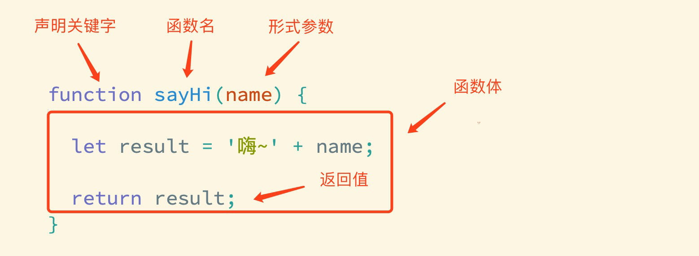

# Web开发

开始了？

开始了！


[TOC]


## 基础知识

### 开发方向

前端可以做

网页  小程序  数据可视化  服务器 客户端

### 镇宅老祖


图灵机 人工智能之父


冯诺依曼体系

现代计算机架构 采用二进制

现代计算机之父


### 计算机组成

关于 **约翰-冯-诺伊曼**

其提出了计算机的 **存储程序"概念和硬件五大组成部分**

后人总结计算机由 **硬件 与 软件** 组成

#### 硬件

其中**硬件**分为 **五** 个部分

 **运算器 控制器 存储器 输入设备 输出设备**

而 **存储器** 可以分为 **内存储器** 与 **外存储器** 

**内存储器**特点为**速度快 存储正在使用的数据**

常见的为 **RAM随机存储器(内存条) ROM只读存储器(BIOS) Cache高速缓存(cpu三级缓存)**


**外存储器**特点为**即使断电也能够长期保存数据**

例如硬盘 磁带 光盘 U盘


#### 软件

其中**软件**分为 **两** 个部分

 **系统软件 应用软件**


### 软件架构

Client客户端 Browser浏览器 Server服务端

#### C/S架构

cs架构需要安装与更新 跨平台较差需要根据平台提供对应的安装包

但是其性能更好 安全性更高

#### B/S架构

比较传统的浏览器应用开发


### 浏览器内核

内核是浏览器的核心，用于处理浏览器的各种资源，起到渲染资源的作用

**当前主流浏览器内核及对应浏览器：**  
1. **Blink**（Chrome、Edge、Opera、360、QQ浏览器）  
2. **Gecko**（Firefox）  
3. **WebKit**（Safari、iOS/iPadOS默认）  
4. **Trident**（IE，已淘汰）  
5. **Presto**（Opera旧版，已转向Blink）  

**备注**：Blink 和 WebKit 占据当前市场主导地位。


### 关于HTML

**HTML**（超文本标记语言）是构建网页结构的基础语言。
 它通过**标签**（如 `<h1>标题</h1>`、`<p>段落</p>`）定义内容类型，浏览器根据这些标签将文字、图片、链接等内容组织成网页。
 简单来说，HTML 就是网页的“骨架”。


### 开发工具


#### VS Code

**Visual Studio Code**（简称 **VS Code**）是一款由[微软](https://zh.wikipedia.org/wiki/微软)开发且跨平台的[免费](https://zh.wikipedia.org/wiki/免費軟體)[源代码编辑器](https://zh.wikipedia.org/wiki/集成开发环境)[[7\]](https://zh.wikipedia.org/wiki/Visual_S						l0pp0 tudio_Code#cite_note-TechCrunch-7)。该软件以扩展的方式支持[语法高亮](https://zh.wikipedia.org/wiki/語法高亮)、代码自动补全（又称 [IntelliSense](https://zh.wikipedia.org/w/index.php?title=IntelliSense&action=edit&redlink=1)）、[代码重构](https://zh.wikipedia.org/wiki/代码重构)功能，并且内置了[命令行](https://zh.wikipedia.org/wiki/命令行)工具和 [Git](https://zh.wikipedia.org/wiki/Git) 版本控制系统[[8\]](https://zh.wikipedia.org/wiki/Visual_Studio_Code#cite_note-8)。用户可以更改主题和键盘快捷方式实现个性化设置，也可以通过内置的[扩展程序](https://zh.wikipedia.org/wiki/插件)商店安装其他扩展以拓展软件功能。


#### 常用开发插件&设置

- 软件汉化插件：Chinese
- 打开网页插件：Open in browser
- 实时刷新插件：Live server
- 彩色缩进插件：Indent-rainbow
- 英语翻译插件：Code translate
- 格式化程序设置：Format on save
- 自动同步修改标签插件：Auto Rename Tag


关于Live server这一插件

当你的html结构不标准时（缺少html body head等结构标签）会导致无法自动刷新，插件会弹出警告

因为live-server 要在你代码得基础上，加一段js代码（websocket功能）以实现热更新，缺失标签，它不知道加在哪里了

所以无法自动刷新


## HTML5


### H5兼容性问题

---

#### **1. 添加元信息，确保浏览器最优渲染**
##### **1.1 设置IE使用最新文档模式**
- **代码**：
  ```html
  <meta http-equiv="X-UA-Compatible" content="IE=Edge">
  ```
- **作用**：  
  强制IE浏览器（如IE8/9/10/11）使用最新版本的文档模式进行渲染，避免因旧版模式导致的兼容性问题（如HTML/CSS解析差异）。

##### **1.2 优先使用 WebKit 内核（针对双核浏览器）**
- **代码**：
  
  ```html
  <meta name="renderer" content="webkit">
  ```
- **作用**：  
  指示双核浏览器（如360、QQ浏览器）优先采用WebKit内核（Chromium）进行页面渲染，提升HTML5/CSS3支持度和渲染效果。

---

#### **2. 使用 `html5shiv` 兼容低版本浏览器**
- **代码**：
  ```html
  <!--[if lt IE 9]>
  <script src="../sources/js/html5shiv.js"></script>
  <![endif]-->
  ```
- **作用**：  
  - **兼容HTML5语义标签**：让IE9及以下版本识别 `<header>`、`<footer>`、`<article>` 等HTML5标签。  
  - **样式支持**：通过JavaScript动态创建标签，使其可被CSS样式控制。  
- **适用场景**：  
  针对仍需支持IE8及以下版本的项目，确保HTML5结构在旧版浏览器中正常显示。

---

#### **3. 条件注释的运算符**
- **常见运算符**：
  | 运算符 | 含义     | 示例                  |
  | ------ | -------- | --------------------- |
  | `lt`   | 小于     | `<!--[if lt IE 9]>`   |
  | `lte`  | 小于等于 | `<!--[if lte IE 8]>`  |
  | `gt`   | 大于     | `<!--[if gt IE 7]>`   |
  | `gte`  | 大于等于 | `<!--[if gte IE 10]>` |
  | `!`    | 逻辑非   | `<!--[if !IE]>`       |
- **作用**：  
  针对IE不同版本加载特定代码（如脚本、样式），实现精细化兼容性处理。

---

##### **总结**
1. **渲染优化**：通过 `meta` 标签强制浏览器使用最优内核（如IE最新模式、WebKit），提升HTML5/CSS3兼容性。  
2. **HTML5标签兼容**：`html5shiv` 解决IE9及以下版本不支持HTML5语义标签的问题。  
3. **条件注释**：利用IE特有语法，按版本加载特定资源，实现差异化兼容策略。  
4. **适用性**：适用于需兼容旧版浏览器（如IE8/9）的项目，确保现代网页在老旧环境中稳定运行。


### HTML基本骨架

```html
<html>
    <head>
        <title>网页标题</title>
    </head>
    <body>
        网页主体
    </body>
</html>
```

- html：整个网页
- head：网页头部，存放给浏览器看的代码，例如 CSS
- body：网页主体，存放给用户看的代码，例如 图片 文字
- title：网页标签

> 快速生成骨架 `! + enter/tab`

冷知识：

- `<head>` 中只能包含：`<title>`、`<meta>`、`<link>`、`<style>`、`<script>`（不包含 HTML 内容）等。
- `<body>` 中包含页面的结构和内容（如 `<div>`、`<p>`、`<form>` 等）。

如果将body的标签写到了head中，浏览器会自动将其调整至body

关于<!DOCTYPE html>此标签时H5的文档说明，将执行H5的执行标准


### 常用标签

作用：明确代码的书写位置

- 标签成对出现，中间包裹内容
- **`< >`** 里面放标签名(通常为英文字母)
- 结束标签比开始多一条  **`/`**


#### 全局标签属性

标签属性的作用是给标签提供一些附加信息

**注意！！！！！！！！！！重复写同一个属性，后写的属性将覆盖前面的同一属性**

每个标签都有属性 常见的为 class 与 id，经常被用在设置css样式与js行为中


还有三个较为常见且大部分标签皆可使用的属性

**title**(鼠标悬浮文字提示)    **lang**(给指定标签设置语言)   **dir**(内容显示方向，值为**ltr rtl**)


有一些标签有其特殊的属性

例如资源引用相关

- `src`

  （Source）：指定外部资源的路径，用于加载图片、脚本、视频等。

  - 用途：浏览器会直接加载该资源。
  - 示例：``、`<script src="script.js"></script>`

- `href`

  （Hypertext Reference）：指定超链接的目标地址。

  - 用途：点击后跳转到其他页面或资源。
  - 示例：`<a href="https://example.com">点击访问</a>`

表单元素相关（如 `<input>`、`<textarea>`）常用属性：

- - **`name`**：提交表单时字段的名称（服务器端用于接收数据）。
  - **`value`**：输入框的默认值或用户输入的内容。
  - **`placeholder`**：输入框的提示文字（未输入时显示）。
  - **`required`**：表示该字段为必填项。


#### 新增全局属性

---

##### **1. `contenteditable`**
- **功能**：控制元素是否可被用户编辑。
- **可选值**：
  - `true`：元素内容可编辑。
  - `false`：元素内容不可编辑。

---

##### **2. `draggable`**
- **功能**：定义元素是否可拖动。
- **可选值**：
  - `true`：元素可拖动。
  - `false`：元素不可拖动。

---

##### **3. `hidden`**
- **功能**：隐藏元素（元素仍存在于DOM中）。
- **说明**：设置该属性后，元素在页面上不可见。

---

##### **4. `spellcheck`**
- **功能**：启用或禁用拼写/语法检查。
- **可选值**：
  - `true`：开启检查（如文本输入框的拼写提示）。
  - `false`：关闭检查。

---

##### **5. `contextmenu`**
- **功能**：指定元素的自定义右键菜单。
- **说明**：通过绑定菜单ID，用户右键点击元素时触发该菜单。

---

##### **6. `data-*`**
- **功能**：存储自定义数据（私有数据）。
- **说明**：允许开发者通过属性名（如 `data-user-id`）在HTML元素中嵌入非标准数据，便于JavaScript读取和操作。

**自定义属性：`data-\*`**

- `data-*`

  ：自定义属性，用于存储页面或应用程序的私有数据。

  - 用途：通过 JavaScript 读取或操作这些数据。

  - 示例：

    ```html
    <div data-user-id="123">用户信息</div>
    <script>
      const userId = document.querySelector('[data-user-id]').dataset.userId;
      console.log(userId); // 输出 "123"
    </script>
    ```


#### 标签类型

在HTML中总是的把标签分为双标签与单标签

双标签

成对出现的标签

单标签

只有开始标签，没有结束标签

例如      `<br>` :换行     `<hr>` :水平线    


#### 浏览器标题栏标签

作用：标题栏的小图标

食用方法：`link:favicon` , 在hef中写icon路径

支持很多格式 ico svg png jpg 貌似都可以，ico和svg效果很好


#### 语义化标签

简单来说

头部用 **header**

页脚用 **footer**

导航用 **nav**

侧边栏用 **aside**

独立成段类似文章 帖子 评论用 **article**

文章中的各个次级段落用 **section**

解释一下 一个**article**中有多个**section**，甚至由**section**组成

**section**强调分段或分块或分成自然段

**article**比section**更加强调独立性**，一块内容是独立的、完整的，应当使用**article**

***大概article是文章 section是章节***


| **标签名称**   | **用途描述**                                         | **示例用法**                                                 | **优点/特点**                                        |
| -------------- | ---------------------------------------------------- | ------------------------------------------------------------ | ---------------------------------------------------- |
| `<header>`     | 定义文档或节的页眉，通常包含标题、导航等。           | ```html<br><header><h1>网站标题</h1><nav>导航链接</nav></header>``` | 提高页面结构清晰度，增强SEO和可访问性。              |
| `<footer>`     | 定义文档或节的页脚，通常包含版权信息、联系方式等。   | ```html<br><footer>© 2025 公司名称</footer>```               | 明确页面底部内容，便于屏幕阅读器解析。               |
| `<nav>`        | 定义导航链接部分，如主导航菜单。                     | ```html<br><nav><a href="#home">首页</a></nav>```            | 标识核心导航区域，提升用户体验和SEO。                |
| `<section>`    | 定义文档中的独立区域，通常带有标题。                 | ```html<br><section><h2>章节标题</h2><p>章节内容</p></section>``` | 结构化内容分段，便于组织和样式设计。                 |
| `<article>`    | 定义独立、完整的内容块（如博客文章、新闻）。         | ```html<br><article><h2>文章标题</h2><p>文章内容</p></article>``` | 独立内容模块化，利于内容重用和SEO优化。              |
| `<aside>`      | 定义与主内容相关但不直接关联的辅助内容（如侧边栏）。 | ```html<br><aside><h3>相关链接</h3><ul>链接列表</ul></aside>``` | 区分主次内容，提升页面可读性和可访问性。             |
| `<main>`       | 定义文档的主要内容区域（页面只能有一个）。           | ```html<br><main><article>核心内容</article></main>```       | 标识核心内容，便于屏幕阅读器和搜索引擎快速定位重点。 |
| `<figure>`     | 定义独立的流内容（如图片、图表、代码片段）。         | ```html<br><figure><figcaption>图片说明</figcaption></figure>``` | 将视觉元素与其描述绑定，提升内容的语义化。           |
| `<figcaption>` | 为`<figure>`元素提供标题或描述。                     | ```html<br><figcaption>图1: 示例图片</figcaption>```         | 增强`<figure>`内容的可访问性和上下文信息。           |
| `<mark>`       | 高亮显示文本内容（默认黄色背景）。                   | ```html<br><mark>关键词</mark>```                            | 突出显示重要信息，适用于搜索结果高亮。               |
| `<time>`       | 定义日期或时间（通过`datetime`属性机器可读）。       | ```html<br><time datetime="2025-05-09">2025年5月9日</time>``` | 提供结构化的日期时间数据，便于机器解析。             |
| `<details>`    | 定义可折叠的用户可切换内容块（如FAQ）。              | ```html<br><details><summary>点击展开</summary>详细内容</details>``` | 实现交互式内容折叠，减少页面冗余。                   |
| `<summary>`    | 为`<details>`元素提供标题或摘要。                    | ```html<br><summary>标题</summary>```                        | 与`<details>`配合使用，提升用户交互体验。            |
| `<dialog>`     | 定义对话框或模态窗口（如弹窗）。                     | ```html<br><dialog open>这是一个对话框</dialog>```           | 简化对话框实现，支持原生交互功能。                   |
| `<progress>`   | 表示任务的进度（如文件上传进度）。                   | ```html<br><progress value="70" max="100">70%</progress>```  | 可视化进度状态，提升用户反馈体验。                   |
| `<meter>`      | 表示标量值或分数（如磁盘使用率）。                   | ```html<br><meter value="0.6" min="0" max="1">60%</meter>``` | 直观展示数值范围，适用于数据可视化场景。             |

---


#### meta标签

作用：用于提供关于 HTML 文档的元数据，这些元数据并不是直接显示在网页上，而是提供给浏览器与搜索引擎使用，同时一些属性能做到自动跳转等效果


##### content属性

本属性经常与其他属性值同用，起到提供具体元数据内容的作用


##### name属性

作用：提供搜索内容名称


##### **http-equiv属性值**

本属性值用来模拟 http响应头，其中一个常见的用法就是通过refresh跳转到其他网页

```html
<meta http-equiv="refresh" conttent="5; url=https://lufangqian.top/">
```


##### keywords属性值

本属性值作用是搜索内容名称为网页关键字，搜索关键字的设置，需要搭配content属性使用，关键字之间使用逗号隔开


##### description属性值

本属性值作用是设置网站信息简述，就是浏览器搜索网站打开前标题下面的小字，同样需要搭配content使用


#### 标题标签

一般用于新闻标题、文章标题、网页区域名称、产品名称等等

标签名：`h1 ~ h6`

> 由大到小，h1标题为主标题，标题等级随着数字增大而减小

**注意事项**

- h1 标签在一个网页中建议只使用一次，用来放新闻标题或者网站的logo
- h2 ~ h6 没有使用次数的限制

> 以上两点为规范要求，并非语法要求，如要重复使用，也没啥事

注意，**标题标签之间不可嵌套**


#### 段落标签

一般用在新闻段落、文章段落、产品描述信息等等

标签名：**`p`**

段落标签内的文字会自动换行


#### 换行与水平线标签

换行： `<br>`

浏览器不识别代码中的Enter换行

水平线：`<hr>`

| 属性名 | 含义     | 属性值                               |
| ------ | -------- | ------------------------------------ |
| align  | 对齐方式 | 可选择 left right center ,默认center |
| size   | 粗细     | px，默认为2                          |
| color  | 颜色     | 颜色                                 |
| width  | 宽度     | 可以是确定的px，也可以是百分比数值   |


> 此标签为单标签


#### 原文格式显示标签

作用：让文本按照源码中的格式显示，在源码中的空格换行不会被忽略

标签名：`<pre>原文格式内容</pre>`

```html
<pre>

    /*
 *                        _oo0oo_
 *                       o8888888o
 *                       88" . "88
 *                       (| -_- |)
 *                       0\  =  /0
 *                     ___/`---'\___
 *                   .' \\|     |// '.
 *                  / \\|||  :  |||// \
 *                 / _||||| -:- |||||- \
 *                |   | \\\  - /// |   |
 *                | \_|  ''\---/''  |_/ |
 *                \  .-\__  '-'  ___/-. /
 *              ___'. .'  /--.--\  `. .'___
 *           ."" '<  `.___\_<|>_/___.' >' "".
 *          | | :  `- \`.;`\ _ /`;.`/ - ` : | |
 *          \  \ `_.   \_ __\ /__ _/   .-` /  /
 *      =====`-.____`.___ \_____/___.-`___.-'=====
 *                        `=---='
 * 
 * 
 *      ~~~~~~~~~~~~~~~~~~~~~~~~~~~~~~~~~~~~~~~~~~~
 * 
 *            佛祖保佑       永不宕机     永无BUG
 */

  </pre>
```


#### 文本标签

作用：为文本添加特殊格式，以突出重点

常见的格式有：加粗、倾斜、下划线、删除线

**标签名**

加粗：`<strong>`  or  `<b>`

倾斜：`<em>`  or  `<i>`

下划线： `<ins>`  or  `<u>`

删除线：`<del>`  or  `<s>`

高亮标记：`<mark>被标记内容</mark>`

文本标记：

> 为了代码的可读性，通常使用左侧语义明显的标签，并且本标签允许嵌套


##### 文本注音

标签名: `<ruby>` 与 `<rt>`

```html
<ruby>
  <span>彳亍</span>
  <rt>xing</rt>
</ruby>
```

**注意！一定是内容在上，rt注音标签在下**


#### 图像标签

作用：在网页中插入图片

标签名：``

**`src 属性`**  用于指定图像的位置和名称，是  **``**  的必须属性

> 图片与代码文件放至同一文件夹即可使用 `./` 命令快捷添加，这种方法是 `相对路径`


##### 常见属性表

| 属性   | 作用       | 说明                               |
| ------ | ---------- | ---------------------------------- |
| alt    | 替换文本   | 图片无法显示的时候显示的文字       |
| title  | 提示文本   | 鼠标悬停在图片上面的时候现实的文字 |
| width  | 图片的宽度 | 值为数字，没有单位                 |
| height | 图片的高度 | 值为数字，没有单位                 |

> img标签 中的 alt属性 适用于可能加载失败，进行解释并提示
>
> 分别使用 width属性 与 height属性 浏览器默认是***等比缩放***


##### 常见图片格式

jpg 有损压缩，不支持透明背景，动图

png 无损压缩，支持的色彩更加丰富，支持透明背景，不支持动图

bmp 不压缩，质量高，占用空间大

gif 动图，质量差色彩少，支持简单透明背景，是动图

base64 图片转码成文字，小图片优化性能

WebP 动图相比 GIF 支持 24 位真彩色、逐像素透明和更小文件体积，能呈现更高质量的动态效果


#### 超链接标签

作用：点击跳转到其他页面

标签名：**`<a href="链接">显示文字</a>`**

`target` 属性赋值 `"_blank"` 可实现新窗口跳转页面，默认`"_self"`直接在本页面刷新网页 

 `download` 属性强制触发文件下载，设置其**属性值**则为设置**默认下载文件名**

同时a标签可以触发js代码

例如：`<a href="Javascript:alert('冒号后面写代码');" target="_blank">陆方七安的导航</a>`

> 开发初期，不知道超链接的跳转地址，href属性值写#，表示空链接，不会跳转


##### 锚点标签

a标签还可以跳转到特定位置，可以给要跳转到的位置的标签添加一个 **id属性** ，在a标签中给href的值设置为#+id

也可以使用空的a标签，为其设置**name属性**，其他a标签绑定name值也可以同样跳转

关于看其他页面的锚点，href设置好文件路径后直接添加 **#+锚点值**

```html
<a href="#top">返回顶部</a>

<!-- 在页面的顶部放置一个id为top的元素 -->
<div id="top"></div>
```


##### 唤起应用

常用在移动端，可唤起软件应用服务，在 **a标签** 的 **href** 中设置

例如：`<a href="tel:10010">给10010打电话</a>`

打电话

tel:10010

发邮件

mailto:mr.wang.vn@gmail.com

发短信

sms:10086


去除超链接默认样式

```css
a {
    color: inherit; /* 使用父元素的颜色 */
    text-decoration: none;
}
```


#### 音频标签

标签名：`<audio src="音频的URL"></audio>`

##### 常见属性表

| 属性                | 作用             | 特殊说明                                                     |
| ------------------- | ---------------- | ------------------------------------------------------------ |
| **src（必须属性）** | 音频URL          | 支持格式：MP3、Ogg、Wav                                      |
| controls            | 显示音频控制面板 |                                                              |
| loop                | 循环播放         |                                                              |
| autoplay            | 自动播放         | 浏览器一般会禁用自动播放                                     |
| preload             | 音频预加载       | auto自动 none不加载  metadata加载元数据（如果使用autoplay 此属性将被忽略） |

> 在HTML5中，如果属性名与属性值完全一样，则可简写为一个单词


#### 视频标签

标签名：`<video src="视频的URL"></video>`

##### 常见属性表

| 属性                | 作用             | 特殊说明                                |
| ------------------- | ---------------- | --------------------------------------- |
| **src（必须属性）** | 视频URL          | 支持格式：MP4、WebM、Ogg                |
| controls            | 显示视频控制面板 |                                         |
| loop                | 循环播放         |                                         |
| muted               | 静音播放         |                                         |
| autoplay            | 自动播放         | 浏览器支持在**静音状态**自动播放        |
| poster              | 设置视频封面     | 设置好地址就OK                          |
| preload             | 视频预加载       | auto自动 none不加载  metadata加载元数据 |

> 在HTML5中，如果属性名与属性值完全一样，则可简写为一个单词

拓展：**关于媒体参与度**

##### **媒体参与度（MEI）简介**

1. **定义**  
   - **媒体参与度**（Media Engagement Index, MEI）是 Chrome 浏览器衡量用户在特定网站上与媒体内容（如视频、音频）互动程度的指标。  
   - 值范围为 **0-100**，值越高表示用户互动越频繁和深入。

2. **计算依据**  
   - **互动频率**：播放媒体的次数。  
   - **互动时长**：每次播放的持续时间。  
   - **互动质量**：是否主动播放（非自动播放）、是否全屏观看等。

3. **应用场景**  
   - **自动播放策略**：MEI 高的网站更易被允许自动播放媒体，提升用户体验。  
   - **用户行为分析**：帮助开发者优化媒体内容和交互设计。

4. **查看与管理**  
   - 在 Chrome 地址栏输入 `chrome://media-engagement/`，可查看各网站的 MEI 值。  
   - 支持重置特定网站的 MEI 或查看详细互动记录。


#### 状态标签

#####  meter标签

- **语义**：  
  
  - 表示**已知范围内的标量测量值**（如电量、磁盘使用量），类似仪表盘。  
  - 属于**双标签**（需闭合标签）。  
  
- **常用属性**：  
  
  | 属性      | 作用                               |
  | --------- | ---------------------------------- |
  | `min`     | 设置最小值                         |
  | `max`     | 设置最大值                         |
  | `low`     | 设置低阈值                         |
  | `high`    | 设置高阈值                         |
  | `optimum` | **标记最优值**（如资源的理想状态） |
  | `value`   | 当前测量值                         |
  
- **特点**：  
  
  - 通过 `low`/`high`/`optimum` 细化范围，适合展示**静态测量值**（如系统资源状态）。  

***注意，当同时使用low与high两种属性时，标签只有两种状态，默认以黄色与绿色展示***

***当同时使用low、high与optimum三种属性时，标签有三种状态，默认以红黄绿三色展示***


---

##### progress标签

- **语义**：  
  - 表示**任务完成的进度**（如文件上传、加载进度），类似进度条。  
  - 属于**双标签**（需闭合标签）。  

- **常用属性**：  
  | 属性    | 作用       |
  | ------- | ---------- |
  | `max`   | 目标总值   |
  | `value` | 当前完成值 |

- **特点**：  
  - 仅关注 `max` 和 `value`，适合展示**动态任务进度**（如下载进度、表单提交状态）。  

---

##### **关键区别**  
| **特性**       | `<meter>`                         | `<progress>`                  |
| -------------- | --------------------------------- | ----------------------------- |
| **用途**       | 表示静态测量值（如资源状态）      | 表示动态任务进度              |
| **属性复杂度** | 更丰富（含 `optimum` 等细化属性） | 较简单（仅 `max` 和 `value`） |
| **视觉效果**   | 类似仪表盘                        | 类似进度条                    |

---


#### **框架标签**

**作用**  

在当前页面中嵌入另一个 HTML 文档（如网页、视频、地图等），实现内容复用或外部资源整合。

**标签名**  

**`<iframe src="链接" width="像素值" height="像素值"></iframe>`**  

**核心属性**  

| **属性**         | **作用**                                               |
| ---------------- | ------------------------------------------------------ |
| `src`            | 指定嵌入内容的 URL（如 `https://www.toutiao.com`）。   |
| `width`/`height` | 设置框架的尺寸（如 `width="900"` 和 `height="300"`）。 |
| `name`           | 为框架命名，可用于表单提交或链接目标。                 |
| `sandbox`        | 限制框架内容的功能（如禁用脚本、表单提交等）。         |
| `allow`          | 指定允许使用的功能（如摄像头、麦克风）。               |

---

##### 举个栗子

```html
<iframe src="https://www.toutiao.com" width="900" height="300"></iframe>
```
- **效果**：在网页中嵌入头条网站的内容，尺寸为 900x300 像素。


### 列表标签

作用：布局内容排列整齐的区域

分类：无序、有序、定义列表


#### 无序列表

作用：布局排列整齐的不需要规定顺序的区域

标签名：`<ul>父级 <li>子级`

> ul是无序列表，只能包裹li标签；li是列表条目，可以包裹任何标签

```html
<ul>
    <li>第一项</li>
    <li>第二项</li>
    <li>第三项</li>
    …………
</ul>
```


#### 有序列表

作用：布局排列整齐的需要规定顺序的区域

标签名：`<ol>父级 <li>子级`

> ol是有序列表，只能包裹li标签；li是列表条目，可以包裹任何标签

```html
<ol>
    <li>第一项</li>
    <li>第二项</li>
    <li>第三项</li>
    …………
</ol>
```


#### 定义列表

标签名：`<dl>父级 <dt>子级-列表标题 <dd>子级-列表详情`

```html
<dl>
    <dt>列表标题</dt>
    <dd>列表详情</dd>
    …………
</dl>
```


#### 特殊列表标签


##### 输入联想标签

标签名：**datalist**

- **语义**：为输入框提供关键字提示（如搜索建议）。  
- **类型**：双标签（需闭合）。  
- **示例**：
  
  ```html
  <input type="text" list="mydata">
  <datalist id="mydata">
    <option value="周冬雨"></option>
    <option value="周杰伦"></option>
  </datalist>
  ```
- **功能**：用户输入时，自动匹配 `<option>` 中的值提供提示。  
- **应用场景**：搜索框、表单输入等需要联想提示的场景。  

> 此标签需要与表单搭配使用


##### **可折叠列表标签**

标签名：**details** 与 **summary**

- **语义**：
  
  - `<details>`：包裹可折叠的详细信息。  
  - `<summary>`：定义折叠内容的标题或问题。  
- **类型**：双标签（需闭合）。  
- **示例**：
  
  ```html
  <details>
    <summary>这是明面上的问题？</summary>
    <p>这是折叠起来的答案</p>
  </details>
  ```
- **功能**：点击 `<summary>` 可展开/收起 `<details>` 中的内容。  
- **应用场景**：FAQ（常见问题解答）、术语解释等需要隐藏/显示内容的场景。  


| **标签**     | **核心功能**                 | **典型场景**          |
| ------------ | ---------------------------- | --------------------- |
| `<datalist>` | 输入框的关键词提示           | 搜索框、表单输入      |
| `<details>`  | 可折叠的详细信息展示         | FAQ、术语解释         |
| `<summary>`  | 作为 `<details>` 的标题/问题 | 配合 `<details>` 使用 |


### 无语义布局标签

作用：布局网页，划分网页区域，摆放内容

- `div` :独占一行，大盒子
- `span` :不换行，小盒子

> 两个标签都是双标签，其中包裹的内容可以是任何内容


### 表格

#### 表格标签

作用：网页中的表格与Excel表格类似，用来展示数据

标签名：`table 嵌套 tr  tr嵌套td/th`

| 标签名  | 说明       |
| ------- | ---------- |
| table   | 表格       |
| tr      | 行         |
| th      | 表头单元格 |
| td      | 内容单元格 |
| caption | 表格标题   |

> 在网页中，表格默认没有边框线，使用 border 属性可以添加边框线

```html
<table border="1">
    <caption>表格标题</caption>
    <thead>
      <tr>
        <th>表头1</th>
        <th>表头2</th>
        <th>表头3</th>
      </tr>
    </thead>

    <tbody>
      <tr>
        <td>第二行第一格</td>
        <td>第二行第二格</td>
        <td>第二行第三格</td>
      </tr>
      <tr>
        <td>第三行第一格</td>
        <td>第三行第二格</td>
        <td>第三行第三格</td>
      </tr>
      <tr>
        <td>第四行第一格</td>
        <td>第四行第二格</td>
        <td>第四行第三格</td>
      </tr>
    </tbody>

    <tfoot>
      <tr>
        <td>脚注行第一格</td>
        <td>脚注行第二格</td>
        <td>脚注行第三格</td>
      </tr>
    </tfoot>

  </table>
```


#### 表格结构标签

作用：用表格结构标签把内容划分区域，让表格结构更清晰，语义更清晰

> 可以不写

| 标签名 | 含义     | 特殊说明     |
| ------ | -------- | ------------ |
| thead  | 表格头部 | 表格头部内容 |
| tbody  | 表格主体 | 主要内容区域 |
| tfoot  | 表格底部 | 汇总信息区域 |


#### 合并单元格

作用：将多个单元格合并成一个单元格，以合并同类信息

其中，跨行合并与跨列合并不同

合并时会保留**最左**、**最上**单元格中的内容

属性：

- 跨行合并，保留最上单元格，添加属性 `rowspan`
- 跨列合并，保留最左单元格，添加属性 `colspan`

> 本属性应用于<td>、<th>等子级标签

```html
<table border="1">
    <caption>表格标题</caption>
    <thead>
      <tr>
        <th colspan="3">表头1</th>
        <!-- <th>表头2</th>
        <th>表头3</th> -->
      </tr>
    </thead>

    <tbody>
      <tr>
        <td rowspan="3">第二行第一格</td>
        <td>第二行第二格</td>
        <td>第二行第三格</td>
      </tr>
      <tr>
        <!-- <td>第三行第一格</td> -->
        <td>第三行第二格</td>
        <td>第三行第三格</td>
      </tr>
      <tr>
        <!-- <td>第四行第一格</td> -->
        <td>第四行第二格</td>
        <td>第四行第三格</td>
      </tr>
    </tbody>

    <tfoot>
      <tr>
        <td>脚注行第一格</td>
        <td>脚注行第二格</td>
        <td>脚注行第三格</td>
      </tr>
    </tfoot>

  </table>

```


### 表单

作用：收集信息

例如：登录页面、注册页面、搜素页面

将多个标签放置在同一表单中，使用 `form` 标签

提交数据需要使用 `form` 标签中的 `action` 属性，属性值为提交数据的地址


#### input标签

input 标签 比较特殊 Type属性值不同，则功能不同

标签名：

```html
<input type="……">
```

通过给 **input** 标签添加 **disabled** 来实现禁用标签


| Type 属性值 | 说明                     |
| ----------- | ------------------------ |
| text        | 文本框，用于输入单行文本 |
| password    | 密码框                   |
| radio       | 单选框                   |
| checkbox    | 多选框                   |
| file        | 上传文件                 |


占位文本：提示信息

> 当有多个文本输入框时，占位文本可以提示输入，此属性可用于文本框与密码框

在input标签中添加属性 `placeholder`，此属性只可作用于**文字输入类控件**上

```html
<input type="……" placeholder="提示信息">
```

在input标签中添加属性 `onclik`  

```html
<input type="……" oncli="提示信息">
```

清除选中时的边框

```css
input:focus {
    outline: none; /* 移除默认的聚焦边框 */
}
```


##### 单选框 radio

常用属性：

| 属性名  | 作用       | 特殊说明                             |
| ------- | ---------- | ------------------------------------ |
| name    | 控件名称   | 控件分组，同组只能选中一个(单选功能) |
| checked | 默认选中   | 属性名和属性值相同，简写为一个单词   |
| value   | 设置按钮值 | 为单选框设置值，在提交时传输设置的值 |

> name属性相同将划分为一组，同组的单选框只能有一个被选中

```html
<input type="radio" name="gender" value="male">男
<input type="radio" name="gender" value="female">女
```


##### 隐藏域 hidden

发送请求时会带上隐藏域中的信息，是较为常见的反扒手段

```html
<!-- 隐藏域 -->
<input type="hidden" name="from" value="toutiao">
```


##### 上传文件 file

使用 `multiple` 属性可以实现文件多选


##### 多选框 checkbox

多选框也叫复选框

默认选中：checked

```html
<input type="checkbox" checked>
```


##### 新增input组件

| 属性名         | 功能描述                                                     |
| -------------- | ------------------------------------------------------------ |
| email          | 邮箱类型的输入框，表单提交时会验证格式，输入为空则不验证格式。 |
| url            | URL 类型的输入框，表单提交时会验证格式，输入为空则不验证格式。 |
| number         | 数字类型的输入框，表单提交时会验证格式，输入为空则不验证格式。 |
| search         | 搜索类型的输入框，表单提交时不会验证格式。                   |
| tel            | 电话类型的输入框，表单提交时不会验证格式，在移动端使用时，会唤起数字键盘。 |
| range          | 范围选择框，默认值为 50，表单提交时不会验证格式。            |
| color          | 颜色选择框，默认值为黑色，表单提交时不会验证格式。           |
| date           | 日期选择框，默认值为空，表单提交时不会验证格式。             |
| month          | 月份选择框，默认值为空，表单提交时不会验证格式。             |
| week           | 周选择框，默认值为空，表单提交时不会验证格式。               |
| time           | 时间选择框，默认值为空，表单提交时不会验证格式。             |
| datetime-local | 日期+时间选择框，默认值为空，表单提交时不会验证格式。        |

---

**form新增**

| 属性名     | 功能描述                                                     |
| ---------- | ------------------------------------------------------------ |
| novalidate | 如果给 `form` 标签设置了该属性，表单提交的时候不再进行验证。 |


#### 下拉菜单控件

使用例子：用户注册时选择城市时可以使用下拉菜单选择城市

标签名：`select` 嵌套 `option`, `select`是下拉菜单的整体，`option`是下拉菜单的每一项

标签名：

```html
<select>
    <option>北京</option>
    <option>上海</option>
    <option>深圳</option>
    <option>广州</option>
    <option>武汉</option>
    <option selected>下北泽</option>
</select>
```

> selected属性为默认选项


#### 文本域控件

作用：多行输入文本的表单控件

标签名：`textarea` 双标签

属性有 **cols列数(宽)**  与  **rows行数(高)**

> 提示文字在双标签里，或者使用 placeholder


#### Label标签控件

作用：网页中，某个标签的说明文本

tips：用 `Lable` 标签绑定文字和表单控件的关系，增大表单控件的点击范围

实现此功能有两个写法

实现方法：

- 写法一

label 标签只包裹内容，不包过表单控件

这只 label 标签的 for 属性值 和 表单控件的 id 属性值相同

```html
<input type="radio" id ="man">
<label for="man">男</label>
```


- 写法二

label 标签中包含 input 标签，此时则不需要属性

```html
<label><input type="radio">男</label>
```

> 方法一中两个标签为并列的关系，方法二是label标签为父级，input为子级，属于包含关系


tips：支持 label 标签增大点击范围的表单控件有

- 文本框
- 密码框
- 上传文件
- 单选框
- 多选框
- 下拉菜单
- 文本域
- ……


#### 按钮标签控件

作用：与用户进行交互的重要对象，通常用于提交，选择等场景

标签名：

```html
<button type="">
    按钮
</button>
```

| Type属性值 | 说明                                             |
| ---------- | ------------------------------------------------ |
| submit     | 提交按钮，点击后可以提交数据到后台(默认选项)     |
| reset      | 重置按钮，点击后将表单控件恢复默认值             |
| button     | 普通按钮，默认没有功能，一般配合 JavaScript 使用 |


#### 逻辑分组控件


##### fieldset 分组

**功能**：将表单中的控件逻辑分组，通过视觉边框（默认样式）增强表单结构的清晰度。

核心属性：

- `disabled`：禁用 `<fieldset>` 内所有子控件。
- `form`：指定所属表单（用于不在 `<form>` 内部的 `<fieldset>`）。
- `name`：为分组命名，便于 JavaScript 操作。

- **适用场景**：适用于需要将相关表单元素（如输入框、单选按钮等）分组展示的场景。


##### legend 标题

- **功能**：为 `<fieldset>` 分组提供标题或描述，提升表单的可读性和可访问性。
- 使用规则：
  - **必须是 `<fieldset>` 的第一个子元素**。
  - 属于 `<fieldset>` 的一部分，不能单独使用。
- **作用**：帮助用户（包括屏幕阅读器用户）快速理解分组内容的用途。

食用方法：

```html
<form>
  <fieldset>
    <legend>个人信息</legend>
    <label for="name">姓名:</label>
    <input type="text" id="name" name="name"><br><br>
    <label for="email">邮箱:</label>
    <input type="email" id="email" name="email">
  </fieldset>
</form>
```


#### 表单常用属性

title悬浮提示

placeholder占位提示

required必填项

autofocus自动获取焦点

autocomplete=“on/off”自动填充历史输入记录(前提是浏览器保存并填写地址功能开启)

pattern正则表达式

| **属性名**       | **功能描述**                                                 |
| ---------------- | ------------------------------------------------------------ |
| **placeholder**  | 提示文字（注意：不是默认值，`value` 是默认值），适用于**文字输入类**的表单控件。 |
| **required**     | 表示该输入项必填，适用于**除按钮外**其他表单控件。           |
| **autofocus**    | 自动获取焦点，适用于所有表单控件。                           |
| **autocomplete** | 自动完成，可以设置为 `on` 或 `off`，适用于**文字输入类**的表单控件。<br>**注意**：密码输入框、多行输入框不可用。 |
| **pattern**      | 填写正则表达式，适用于文本输入类表单控件。<br>**注意**：多行输入不可用，且空的输入框不会验证，往往与 `required` 配合。 |


### 字符实体

作用：在网页中显示预留字符


| **实体名称** | **实体编号** | **字符** | **说明**                       |
| ------------ | ------------ | -------- | ------------------------------ |
| `&amp;`      | `&#38;`      | `&`      | 和号（必须转义的字符）         |
| `&lt;`       | `&#60;`      | `<`      | 小于号（HTML 标签的开始符号）  |
| `&gt;`       | `&#62;`      | `>`      | 大于号（HTML 标签的结束符号）  |
| `&quot;`     | `&#34;`      | `"`      | 双引号（属性值分隔符）         |
| `&apos;`     | `&#39;`      | `'`      | 单引号（HTML5 支持）           |
| `&nbsp;`     | `&#160;`     | ` `      | 非间断空格（多个连续空格显示） |
| `&copy;`     | `&#169;`     | `©`      | 版权符号                       |
| `&reg;`      | `&#174;`     | `®`      | 注册商标符号                   |
| `&trade;`    | `&#8482;`    | `™`      | 商标符号                       |
| `&euro;`     | `&#8364;`    | `€`      | 欧元符号                       |
| `&yen;`      | `&#165;`     | `¥`      | 日元符号                       |
| `&pound;`    | `&#163;`     | `£`      | 英镑符号                       |
| `&deg;`      | `&#176;`     | `°`      | 度数符号（如 30°C）            |
| `&times;`    | `&#215;`     | `×`      | 乘号                           |
| `&divide;`   | `&#247;`     | `÷`      | 除号                           |
| `&ndash;`    | `&#8211;`    | `–`      | 短破折号（en dash）            |
| `&mdash;`    | `&#8212;`    | `—`      | 长破折号（em dash）            |
| `&hellip;`   | `&#8230;`    | `…`      | 省略号（三个点）               |
| `&laquo;`    | `&#171;`     | `«`      | 左引号（法语等语言）           |
| `&raquo;`    | `&#187;`     | `»`      | 右引号（法语等语言）           |
| `&lsquo;`    | `&#8216;`    | `‘`      | 左单引号                       |
| `&rsquo;`    | `&#8217;`    | `’`      | 右单引号                       |
| `&ldquo;`    | `&#8220;`    | `“`      | 左双引号                       |
| `&rdquo;`    | `&#8221;`    | `”`      | 右双引号                       |


### 注释

HTML的注释方式为  **`<!--内容-->`**

VS Code 中，添加/删除注释的快捷键是 **`Ctrl + /`**


### 路径

定义：路径指的是查找文件时，从起点到终点经历的路线

分类：

- 相对路径：从当前文件位置出发查找目标文件
- 绝对路径：从盘符出发查找目标文件

#### 相对路径

从当前文件位置出发查找目标文件

- **`/`** 表示进入某个文件夹里面  
- **`.`** 表示当前文件所在文件夹
- **`./`** 为当前目录   **`../`**为上一级路径   **`../../`**为上上一级路径  以此类推

#### 绝对路径

从电脑文件的根目录出发查找文件

- Windows电脑从 盘符 出发
- Mac电脑从根 目录(/) 出发


## CSS开发

### 关于CSS

定义：CSS中文名称为 **`层叠样式表(Cascading Style Sheets)`**，是一种 **`样式表`** 语言，用来描述 HTML 文档的呈现(美化内容)。

书写位置： title 标签正下方 添加 style 双标签，style 标签里面书写 CSS 代码


### CSS特性

CSS特性：化简代码/定位问题，并解决问题

- 继承性
- 层叠性
- 优先级

#### 继承性

特点：子级默认继承父级的文字控制属性

比如在body标签设置文字控制属性，body内的文字都将默认跟随body设置

如果标签有自己的样式则生效自己的样式，不继承


#### 层叠性

特点：

- 相同的属性会覆盖：后面的CSS属性会覆盖前面的CSS属性
- 不同的属性会叠加：不同的CSS属性都能生效


#### 优先级

特点：优先级也叫权重，当一个标签使用了多种选择器时，基于不同种类的选择器的匹配规则

规则：选择器指向性越强，其优先级越高优先生效

排列：

!important > 内联样式 > ID > 类 = 属性选择器 = 伪类 > 标签 > 通配符/伪元素

> 总的来说 选中标签的范围越大，优先级越低 !important最优先

举个栗子

```html
<style>
    div{
        color: red;
    }

    .box{
        color；green;
    }
</style>

<div class="box">
    此时 div标签 内容为绿色
</div>
```


##### 叠加计算规则

特点：如果是复合选择器，则需要权重叠加计算

公式：!important > 行内 > ID > 类 = 属性选择器 = 伪类 > 标签/伪元素 > 通配符 > 继承

- 从左向右 一次比较选择器个数，同一级个数多的优先级高；个数相同，则向后比较
- `!important` 权重最高
- 继承权重最低


### CSS引入方式

- 内部样式表

CSS代码写在 style 标签里面

```html
<!DOCTYPE html>
<html lang="en">

<head>
    <meta charset="UTF-8">
    <meta name="viewport" content="width=device-width, initial-scale=1.0">
    <title>CSS测试场</title>
    <style>
		/*此处书写CSS代码*/
        /*选择器*/
        p{
            /*CSS属性*/
            color:red;
            font-size:30px;
            
        }
    </style>
</head>
	<body>
	<p>Hello World</p>
	</body>
</html>
```


- 外部样式表

首先，CSS 代码写在单独的 CSS 文件中（.css）

其次，在 HTML 使用 link 标签引入

```html
<link rel="stylesheet" href="CSS文件路径">
```


- 行内样式表

通常配合 JavaScript 使用

CSS 写在标签的 style 属性值里

```html
<div style="color:red;font-size:20px">这是 CSS 行内样式</div>
```


### 单位与颜色

---

#### 单位详解

##### **绝对长度单位**

绝对单位的大小固定，与屏幕分辨率或字体大小无关，适用于需要精确控制尺寸的场景（如图标、像素级调整）。

| 单位 | 含义           | 常见用途     |
| ---- | -------------- | ------------ |
| `px` | 像素           | 最常用单位   |
| `pt` | 点（印刷单位） | 打印样式     |
| `pc` | 派卡（12pt）   | 旧版印刷设计 |
| `mm` | 毫米           | 精确物理尺寸 |
| `cm` | 厘米           | 精确物理尺寸 |
| `in` | 英寸（2.54cm） | 精确物理尺寸 |

**示例**：

```css
.box {
  width: 200px; /* 固定宽度 */
  height: 1in;  /* 1英寸 */
}
```

##### **相对长度单位**

相对单位基于上下文或视口动态调整，适用于响应式设计和自适应布局。

| 单位   | 含义                                           | 适用场景               |
| ------ | ---------------------------------------------- | ---------------------- |
| `em`   | 基于当前元素的字体大小（父元素字体大小为基准） | 文字排版、动态缩放     |
| `rem`  | 基于根元素（`<html>`）的字体大小               | 全局样式、响应式设计   |
| `vw`   | 视口宽度的 1%（1vw = 视口宽度的 1%）           | 全屏布局、视口比例计算 |
| `vh`   | 视口高度的 1%（1vh = 视口高度的 1%）           | 全屏布局、视口比例计算 |
| `vmin` | 视口较小尺寸（宽度或高度）的 1%                | 适配不同设备方向       |
| `vmax` | 视口较大尺寸（宽度或高度）的 1%                | 适配不同设备方向       |
| `ch`   | 基于字符“0”的宽度                              | 对齐文本内容           |
| `lh`   | 基于当前元素的 `line-height`                   | 控制行间距             |

**示例**：

```css
/* 基于根元素字体大小的 rem 单位 */
html {
  font-size: 16px;
}


.box {
  width: 10rem; /* 160px */
}

/* 基于视口宽度的 vw 单位 */
.full-screen {
  width: 100vw; /* 占满视口宽度 */
  height: 50vh; /* 占视口高度的一半 */
}
```

##### **百分比单位（`%`）**

百分比单位基于父元素的尺寸或字体大小，常用于布局和弹性设计。

**示例**：

```css
.parent {
  width: 500px;
}
.child {
  width: 50%; /* 250px */
}
```

##### 角度单位（deg）

- **定义**：`deg`（度）是 CSS 中用于表示角度的单位，一个完整的圆为 **360°**。


#### 颜色

##### **颜色名称**

CSS 支持 140+ 预定义颜色名称，适合简单场景。

**示例**：

```css
.text {
  color: red;     /* 红色 */
  background: blue; /* 蓝色 */
}
```

##### **十六进制颜色值（Hex）**

以 `#` 开头，后跟 3 位或 6 位十六进制数字（每两位表示 RGB 通道）。

| 格式      | 含义                   | 示例              |
| --------- | ---------------------- | ----------------- |
| `#RGB`    | 3 位简写（每两位重复） | `#f00`（红色）    |
| `#RRGGBB` | 6 位完整表示           | `#ff0000`（红色） |

**示例**：

```css
.box {
  background-color: #00ff00; /* 绿色 */
  color: #f60;              /* 橘色 */
}
```

##### **RGB/RGBA 颜色**

通过红（Red）、绿（Green）、蓝（Blue）三原色组合表示颜色，`RGBA` 增加了透明度（Alpha）通道。

**语法**：

- `rgb(red, green, blue)`：取值范围 0-255 或 0%-100%
- `rgba(red, green, blue, alpha)`：`alpha` 为 0（完全透明）到 1（完全不透明）

**示例**：

```css
/* 红色 */
.box1 {
  background-color: rgb(255, 0, 0);
}

/* 半透明红色 */
.box2 {
  background-color: rgba(255, 0, 0, 0.5);
}
```

##### **HSL/HSLA 颜色**

通过色相（Hue）、饱和度（Saturation）、亮度（Lightness）表示颜色，`HSLA` 增加了透明度。

**语法**：

- `hsl(hue, saturation, lightness)`：`hue` 为 0-360（色盘角度），`saturation` 和 `lightness` 为 0%-100%
- `hsla(hue, saturation, lightness, alpha)`：`alpha` 为 0-1

**示例**：

```css
/* 绿色（色相 120°，饱和度 65%，亮度 75%） */
.box {
  background-color: hsl(120, 65%, 75%);
}

/* 半透明绿色 */
.box {
  background-color: hsla(120, 65%, 75%, 0.5);
}
```

##### **颜色透明度（Alpha 通道）**

- `RGBA` 和 `HSLA` 支持透明度设置，常用于叠加效果、渐变或半透明背景。

**示例**：

```css
.overlay {
  background-color: rgba(0, 0, 0, 0.3); /* 30% 黑色半透明 */
}
```

---

#### 相互配合

##### **动态颜色与响应式设计**

- 使用 `rem` 或 `vw/vh` 控制颜色元素的尺寸，结合透明度实现视觉层次。

- 示例：

  ```css
  .circle {
    width: 10rem;
    height: 10rem;
    background-color: rgba(0, 128, 255, 0.7); /* 蓝色半透明 */
    border-radius: 50%;
  }
  ```

##### **移动端适配**

- 使用 `rem` 和 `vw/vh` 适配不同屏幕尺寸，结合 `HSL` 调整颜色亮度。

- 示例：

  ```css
  html {
    font-size: 16px; /* 根字体大小 */
  }
  .button {
    width: 20vw; /* 占视口宽度的 20% */
    padding: 1rem 2rem;
    background-color: hsl(200, 70%, 50%); /* 高饱和度蓝色 */
  }
  ```


### 属性


#### 常用属性

键值对：通常，我们将属性名与属性值成对出现的属性叫键值对

| 属性名           | 说明     |
| ---------------- | -------- |
| color            | 文字颜色 |
| font-size        | 字体大小 |
| width            | 宽度     |
| height           | 高度     |
| background-color | 背景色   |
|                  |          |
|                  |          |
|                  |          |
|                  |          |


#### 字体属性

字体属性表

| 名称         | 属性名          | 说明               |
| ------------ | --------------- | ------------------ |
| 字体大小     | font-size       | 修改文字大小       |
| 字体粗细     | font-weight     | 修改文字粗细       |
| 字体倾斜     | font-style      | 使文字倾斜         |
| 行高         | line-height     | 修改行高           |
| 字体族       | font-family     | 修改字体，如宋体   |
| 字体复合属性 | font            | 复合属性           |
| 文本缩进     | text-indent     | 修改前后缩进       |
| 文本对齐     | text-align      | 修改文本对齐方式   |
| 修饰线       | text-decoration | 上中下贯穿文本的线 |
| 颜色         | color           | 修改文字颜色       |

##### 引入自定义字体

属性名：`@font-face{ }`

引入字体后无需客户端安装，自动使用引入的字体

```css
@font-face {
    font-family:bbt;/*字体名叫bbt*/
    src: url(../btt.ttf);/*相对路径引入*/
}
```


##### 字体大小

属性名：font-size

属性值：文字尺寸，PC 端网页常用单位 `px`

> 通常来说，谷歌浏览器默认字体大小为16px


##### 字体粗细

属性名：font-weight

属性值：

- **数字**

正常为400，加粗为800

- **关键字**

正常：`normal` ，加粗：`bold`


##### 字体倾斜

属性名：font-style

属性值：不倾斜 `nomal`   倾斜 `italic`


##### 行高

作用：设置多行文本的间距

属性名：line-height

属性值：

- 数字 + px
- 数字（当前标签font-size属性值的倍数）


##### 字体族

属性名：font-family

属性值：字体名

font-family属性值可以书写多个字体名，各个字体名用 逗号 隔开，执行顺序从左到右依次查找

其最后一个属性可以设置一个字体族名，其作用为 当前面的字体皆未找到，将使用通用的字体族，比如 sans-seif 为无衬线字体

```css
font-family:楷体;

font-family:Microsoft YaHei,Heiti SC,tahoma,arial,Hiragino Sans GB,"\5B8B\4F53",sans-seif;
```


##### Web字体

通过 `@font-face` 规则，我们可以指定字体的具体地址，让浏览器自动下载该字体，从而不依赖用户电脑上的字体。

##### 语法（简写方式）
```css
@font-face {
    font-family: "情书字体";
    src: url('./方正手迹.ttf');
}
```

**语法**（高兼容性写法）

为了确保在不同浏览器中的兼容性，可以使用以下更详细的写法：
```css
@font-face {
    font-family: "atguigu";
    font-display: swap;
    src: url('webfont.eot'); /* IE9 */
    src: url('webfont.eot?#iefix') format('embedded-opentype'), /* IE6-IE8 */
         url('webfont.woff2') format('woff2'), /* chrome、firefox */
         url('webfont.woff') format('woff'), /* chrome、firefox */
         url('webfont.ttf') format('truetype'), /* chrome、firefox、opera、Safari、Android */
         url('webfont.svg#webfont') format('svg'); /* iOS 4.1- */
}
```

**定制字体**

由于中文的字体文件通常较大，直接使用完整的字体文件可能不切实际。因此，通常会针对特定的文字进行单独定制。

**工具推荐**

可使用阿里 Web 字体定制工具：[https://www.iconfont.cn/webfont](https://www.iconfont.cn/webfont) 来实现字体的定制和优化。

---

**笔记总结**

- **基本用法**：利用 `@font-face` 规则指定字体文件路径，使浏览器能够自动下载并应用字体。
- **高兼容性写法**：提供多种格式的字体文件以适应不同浏览器的需求。
- **定制字体**：针对中文等大字体文件，采用定制化方案，提高加载效率和用户体验。


##### 字体风格

属性名：font-style

属性值：

- normal：正常（默认）
- italic：字体自带斜体效果
- oblique：强制实现斜体效果


##### font复合属性

复合属性：属性的间歇方式，一个属性对应多个值的写法，各个属性之间用空格隔开

font： 是否倾斜 是否加粗 字号/行高 字体（必须按顺序书写）

注意：字号和字体值必须书写也必须按顺序书写，否则 font 属性不生效

就是把上面的属性合成一行，食用方法如下

```css
/*font：是否倾斜 是否加粗 字号/行高 字体;*/
font: italic 700 30px/2 楷体; 
```


##### 文本缩进

属性名：text-indent

属性值：

- 数字 + px
- 数字 + em（1em = 当前标签的字号大小）

经常用来首行空两格，em就相当于一个字，会随字号更改，所以使用em更多


##### 文本对齐

作用：控制内容水平对齐方式

属性名：text-align

属性值：

| 属性值 | 效果           |
| ------ | -------------- |
| left   | 左对齐（默认） |
| center | 居中对齐       |
| right  | 右对齐         |

text-align本质使控制内容的对齐方式，属性要设置给内容的父级

举个栗子：让图片居中不能在 `` 标签中使用属性，需要给其父标签添加属性


##### 文本基线对齐

---

**属性名**

- **`vertical-align`**  
  用于控制元素的垂直对齐方式。

**作用**

- **适用对象**：  
  - 内联元素（inline）  
  - 表格单元格（table-cell）  
- **功能**：  
  调整同一行元素之间或表格单元格内文字的垂直对齐方式。

---

**常用值**

| 值         | 对齐方式                                                     |
| ---------- | ------------------------------------------------------------ |
| `baseline` | 默认值，元素基线与父元素基线对齐（通常为文本底部）。         |
| `top`      | 元素顶部与所在行顶部对齐。                                   |
| `middle`   | 元素中部与父元素基线加字母 `x` 高度的一半对齐（实现居中效果）。 |
| `bottom`   | 元素底部与所在行底部对齐。                                   |

---

**特别注意**

- **不适用于块级元素**（如 `div`、`p` 等）。  
  - 若需调整块级元素垂直对齐，需改用其他方法（如 Flexbox 或 Grid）。

---

**关键解读**

- **基线对齐（baseline）**：  
  文本默认对齐方式，可能因字体差异导致视觉不对齐。  
- **顶部/底部对齐（top/bottom）**：  
  适用于统一元素在行内的垂直位置（如图标与文字对齐）。  
- **中间对齐（middle）**：  
  通过计算父元素基线和字母 `x` 高度实现视觉居中，常用于图标与文字垂直居中。  

---


##### 文本修饰线

属性名：text-decoration
属性值：

| 属性值       | 效果   |
| ------------ | ------ |
| none         | 无     |
| underline    | 下划线 |
| line-through | 删除线 |
| overline     | 上划线 |
| dotted       | 虚线   |
| wavy         | 波浪线 |

```css
text-decoration: text-decoration-line || text-decoration-style || text-decoration-color;
```

子属性及其含义

1. **`text-decoration-line`**：设置文本装饰线的位置。
   - `none`：指定文字无装饰（默认值）。
   - `underline`：指定文字的装饰是下划线。
   - `overline`：指定文字的装饰是上划线。
   - `line-through`：指定文字的装饰是贯穿线。

2. **`text-decoration-style`**：设置文本装饰线条的形状。
   - `solid`：实线（默认）。
   - `double`：双线。
   - `dotted`：点状线条。
   - `dashed`：虚线。
   - `wavy`：波浪线。

3. **`text-decoration-color`**：设置文本装饰线条的颜色。

---

笔记总结

- **`text-decoration` 复合属性**：允许同时控制文本的装饰线位置、形状和颜色。
- **子属性功能**：
  - `text-decoration-line` 控制装饰线的位置。
  - `text-decoration-style` 控制装饰线的形状。
  - `text-decoration-color` 控制装饰线的颜色。


##### 文字颜色

属性名：color

属性值：

| 表示方法       | 属性值        | 说明                            |
| -------------- | ------------- | ------------------------------- |
| 颜色关键字     | 颜色英文单词  | red、green、blue                |
| rgb表示法      | rgb(r,g,b)    | r,g,b表示红绿蓝三原色           |
| rgba表示法     | rgba(r,g,b,a) | a表示透明度，取值0-1            |
| 十六进制表示法 | #RRGGBB       | #000000，#ffcc00 简写:#000,#fc0 |


##### 文本阴影

- **在 CSS3 中，我们可以使用 `text-shadow` 属性给文本添加阴影。**
- **语法：**

  ```css
  text-shadow: h-shadow v-shadow blur color;
  ```

| 值       | 描述                               |
| -------- | ---------------------------------- |
| h-shadow | 必需写，水平阴影的位置。允许负值。 |
| v-shadow | 必需写，垂直阴影的位置。允许负值。 |
| blur     | 可选，模糊的距离。                 |
| color    | 可选，阴影的颜色                   |

- **默认值：** `text-shadow: none` 表示没有阴影。

（内容已按原始图片信息完整提取并结构化呈现）

##### 文本间距

**作用**：控制字符（字母、汉字、符号）之间的间距  
**属性名**：`letter-spacing`  
**属性值**：

| 属性值             | 效果                               |
| ------------------ | ---------------------------------- |
| `normal`           | 默认值，根据字体自动调整间距       |
| `数值`（如 `2px`） | 增加字符间距（正数）或减少（负数） |

**本质**：直接作用于文本中的每个字符（包括字母、汉字、符号），调整它们之间的间距。  
**示例**：
```html
<p class="wide">WIDE LETTER SPACING</p>
<p class="tight">TIGHT LETTER SPACING</p>
```
```css
.wide {
  letter-spacing: 3px; /* 字符间距变宽 */
}
.tight {
  letter-spacing: -1px; /* 字符间距变窄 */
}
```

---


##### 文本换行

- 在 CSS3 中，我们可以使用 `white-space` 属性设置文本换行方式。
- 常用值如下：

| 值       | 含义                                                         |
| -------- | ------------------------------------------------------------ |
| normal   | 文本超出边界自动换行，文本中的换行被浏览器识别为一个空格。（默认值） |
| pre      | 原样输出，与 `<pre>` 标签的效果相同。                        |
| pre-wrap | 在 `pre` 效果的基础上，超出元素边界自动换行。                |
| pre-line | 在 `pre` 效果的基础上，超出元素边界自动换行，且只识别文本中的换行，空格会忽略。 |
| nowrap   | 强制不换行                                                   |

**笔记重点**

- `normal`：默认值，文本超出边界自动换行，换行符被视为空格。
- `pre`：保持原始格式，类似于 `<pre>` 标签。
- `pre-wrap`：在 `pre` 的基础上，允许文本在边界处自动换行。
- `pre-line`：在 `pre` 的基础上，自动换行并忽略多余的空格。  
- `nowrap`：文本不会换行，可能会导致溢出容器。


##### 文本溢出

属性名：`text-overflow` 

在 CSS3 中，我们可以使用 `text-overflow` 属性来设置文本内容溢出时的呈现模式。

**常用值及其含义**

| 值         | 含义                                                    |
| ---------- | ------------------------------------------------------- |
| `clip`     | 当内联内容溢出时，将溢出部分裁切掉。（默认值）          |
| `ellipsis` | 当内联内容溢出块容器时，将溢出部分替换为省略号（...）。 |

**注意事项**

要使得 `text-overflow` 属性生效，需要满足以下条件：
- 块容器必须显式定义 `overflow` 属性为非 `visible` 值。
- `white-space` 属性应设置为 `nowrap`。

---

**笔记总结**

1. **`text-overflow` 属性**：用于控制文本溢出时的显示方式。
2. **常用值**：
   - `clip`：裁剪溢出的内容。
   - `ellipsis`：用省略号表示溢出的内容。
3. **生效条件**：
   - 需要配合 `overflow` 和 `white-space` 属性使用。


##### 单词间距

**作用**：控制单词（由空格分隔的文本块）之间的间距  
**属性名**：`word-spacing`  
**属性值**：

| 属性值             | 效果                         |
| ------------------ | ---------------------------- |
| `normal`           | 默认值，根据字体自动调整间距 |
| `auto`             | 浏览器自动计算单词间距       |
| `数值`（如 `2px`） | 增加或减少单词间距           |

**本质**：仅作用于由空格分隔的单词（如英文句子中的单词），不影响字符间距。  
**示例**：
```html
<p class="wide-words">This is a wide word spacing example.</p>
<p class="tight-words">This is a tight word spacing example.</p>
```
```css
.wide-words {
  word-spacing: 5px; /* 单词间距变宽 */
}
.tight-words {
  word-spacing: -2px; /* 单词间距变窄 */
}
```


---

#### 列表属性

| **CSS 属性名**          | **功能**           | **属性值**                                                   |
| ----------------------- | ------------------ | ------------------------------------------------------------ |
| **list-style-type**     | 设置列表符号       | - `none`：不显示标识<br>- `square`：实心方块<br>- `disc`：圆形<br>- `decimal`：数字<br>- `lower-roman`：小写罗马字<br>- `upper-roman`：大写罗马字<br>- `lower-alpha`：小写字母<br>- `upper-alpha`：大写字母 |
| **list-style-position** | 设置列表符号的位置 | - `inside`：在 `li` 内部<br>- `outside`：在 `li` 外部        |
| **list-style-image**    | 自定义列表符号     | `url(图片地址)`                                              |
| **list-style**          | 复合属性（简写）   | 同时设置 `list-style-type`、`list-style-position`、`list-style-image`（无顺序要求） |

---

**解释**

1. **`list-style-type`**  
   - 控制列表项符号类型（如 `disc`、`decimal` 等），`none` 可隐藏符号。
2. **`list-style-position`**  
   - `inside`：符号嵌入文本行内；`outside`：符号独立于文本左侧。
3. **`list-style-image`**  
   
   - 通过 URL 替换默认符号为自定义图片（需确保图片路径有效）。
4. **`list-style`**  
   
   - 简写属性，支持同时设置三种属性，顺序无关，如：  
     ```css
     list-style: square inside url(icon.png);
     ```


#### 表格属性

| **CSS 属性名**      | **功能**                        | **属性值**                                                   |
| ------------------- | ------------------------------- | ------------------------------------------------------------ |
| **table-layout**    | 设置列宽度                      | - `auto`：自动，列宽根据内容计算（默认值）。<br>- `fixed`：固定列宽，平均分配。 |
| **border-spacing**  | 单元格间距                      | - CSS 长度值（如 `10px`）。<br>- **生效前提**：单元格边框不合并。 |
| **border-collapse** | 合并单元格边框                  | - `collapse`：合并。<br>- `separate`：不合并（默认值）。     |
| **empty-cells**     | 控制空单元格显示                | - `show`：显示（默认值）。<br>- `hide`：隐藏。<br>- **生效前提**：单元格不合并。 |
| **caption-side**    | 设置表格标题（`<caption>`）位置 | - `top`：标题在表格上方（默认值）。<br>- `bottom`：标题在表格下方。 |

**关键解释**

- **`table-layout`**  
  - `auto`：列宽根据内容动态调整。  
  - `fixed`：列宽固定，所有列宽度平均分配。  

- **`border-spacing`**  
  - 定义单元格之间的间距（如 `border-spacing: 5px 10px;`）。  
  - **注意**：仅在 `border-collapse: separate;` 时生效。  

- **`border-collapse`**  
  - `collapse`：合并相邻单元格边框（如 Excel 表格效果）。  
  - `separate`：保留独立边框（默认行为）。  

- **`empty-cells`**  
  - `show`：显示空单元格的边框和背景（默认）。  
  - `hide`：隐藏空单元格的边框和背景。  
  - **注意**：仅在 `border-collapse: separate;` 时生效。  

- **`caption-side`**  
  - `top`：表格标题位于表格上方（默认）。  
  - `bottom`：表格标题位于表格下方。  


#### 背景属性


##### 背景图

属性名：background-image(bgi)

属性值：url(背景图的 URL)

在网页中，使用背景图实现 **装饰性** 的图片效果


举个栗子

```css
div{
    width: 400px;
    height: 400px;
    
    background-image: url(./images/1.png);
    
}
```

为以上例子做解释，设置 div标签 样式为宽高400px，并且将背景图设置为相对路径的1.png


> 提示：在浏览器中，背景图默认是平铺的效果，也就是容器的尺寸大就会复制几张填充满；同时，因为是背景图，div标签中有文字将显示在图片之上


##### 多背景图

- **CSS3 允许元素设置多个背景图片**

```css
/* 添加多个背景图 */
background: 
    url(../images/bg-lt.png) no-repeat,
    url(../images/bg-rt.png) no-repeat right top,
    url(../images/bg-lb.png) no-repeat left bottom,
    url(../images/bg-rb.png) no-repeat right bottom;
```


> 图片由上下左右四张不同方向的飘花组成，通过复合属性background与逗号隔开并定位实现的效果


##### 背景图平铺方式

属性名：background-repeat (bgr)

属性值：

| 属性值    | 效果             |
| --------- | ---------------- |
| no-repeat | 不平铺           |
| repeat    | 平铺（默认效果） |
| repeat-x  | 水平方向平铺     |
| repeat-y  | 垂直方向平铺     |

以下是对各个属性值效果的描述：

- no-repeat：只有一张图片，显示在容器的左上角不会扩展

- repeat：复制图片填满容器

- repeat-x：只有横向复制图片

- repeat-y：只有竖向复制图片

  


##### 背景图位置

属性名：background-position (bgp)

属性值：水平方向位置 垂直方向位置

关键字：

| 关键字 | 位置 |
| ------ | ---- |
| left   | 左侧 |
| right  | 右侧 |
| center | 居中 |
| top    | 顶部 |
| bottom | 底部 |

坐标： 数字 + px  /  关键字

注意事项：

- 数字可以与关键字混用
- 数字正负皆可
- 数字是从容器左上角计算
- 水平方向正数向右移动，负数像左侧移动；
- 垂直方向正数向下移动，负数向上移动；
- 超出容器的部分会被裁切

**特殊提醒：**

- 关键字取值方式写法，可以颠倒取值顺序
- 可以只写一个关键字，另一个方向默认居中；数字只写一个值表示水平方向，垂直方向为居中


##### 背景图缩放

属性名：background-size (bgz)

作用：设置背景图大小

常用属性值：

- 关键字

​	cover：等比例缩放背景图片以完全覆盖背景区，可能背景图部分看不见

​	contain：等比例缩放背景图片以完全装入背景区，可能背景区部分空白

- 百分比：根据容器尺寸计算图片大小，注意：100%表示图片的宽度跟容器的宽度一样，图片的高度按照图片比例等比例缩放
- 数字 + 单位（例如：px）


##### 背景图固定

属性名：background-attachment (bga)

属性值：fixed

作用：背景不会随着元素的内容滚动


##### 背景图渲染起点

- **属性名：**background-origin
- **作用：** 设置背景图的原点。
- **语法：**
  1. `padding-box`：从 padding 区域开始显示背景图像。-- 默认值
  2. `border-box`：从 border 区域开始显示背景图像。
  3. `content-box`：从 content 区域开始显示背景图像。


##### 背景图裁切模式

- **属性名：**background-clip
- **作用：** 设置背景图的向外裁剪的区域。
- **语法：**
  1. `border-box`：从 border 区域开始向外裁剪背景。-- 默认值
  2. `padding-box`：从 padding 区域开始向外裁剪背景。
  3. `content-box`：从 content 区域开始向外裁剪背景。
  4. `text`：背景图只呈现在文字上。

- **注意：** 若值为 `text`，那么 `background-clip` 要加上 `-webkit-` 前缀。


##### 背景复合属性

属性名：background (bg)

属性值：背景色 背景图 背景图平铺方式 背景图位置/背景图缩放 背景图固定（空格隔开各个属性值，不区分顺序）

> 类似于字体复合属性值，就是一条写出整个背景图的属性

```css
div()
{
    width: 400px;
    height: 400px;
    
    background: pink url(./images/1.png) no-repeat right center/cover;
}
```

> 翻一下就是背景粉色，图片为1.png，不平铺，水平靠右侧，垂直居中，等比例缩放完全覆盖容器，可能有截取


#### 布局属性

------

##### 容器大小最值

**最小 `min-height` 属性**

- **定义**：指定一个元素的最小高度。即使内容较少，元素的高度也不会低于这个值。
- **语法**：
  ```css
  min-height: <length> | <percentage>;
  ```
  - `<length>`：可以使用绝对单位如`px`、`cm`等；也可以使用相对单位如`em`、`rem`。
  - `<percentage>`：相对于包含块的高度百分比。

- **示例**：
  ```css
  .container {
      min-height: 200px;
  }
  ```
  这个例子确保了`.container`类至少有200px的高度，但如果内容更多，则会自动扩展。

**应用场景**

- 确保容器有足够的空间来容纳其内容。
- 在响应式设计中，为不同屏幕尺寸提供一致的最低高度。

---

**最大`max-height` 属性**

- **定义**：指定一个元素的最大高度。如果内容超出这个高度，通常会触发滚动条（需结合`overflow`属性使用），或者内容被隐藏（取决于其他样式设置）。
- **语法**：
  ```css
  max-height: <length> | <percentage>;
  ```
  类似于`min-height`，但这里是设置最大值。

- **示例**：
  ```css
  .content-box {
      max-height: 400px;
      overflow-y: auto; /* 超出部分显示垂直滚动条 */
  }
  ```
  此示例限制了`.content-box`的高度不超过400px，超出部分可通过滚动查看。

**应用场景**

- 控制图片或文本区域的最大尺寸，防止页面布局因内容过多而破坏。
- 结合`overflow`属性实现优雅的内容溢出处理方案。

---

**组合使用**

- 使用`min-height`和`max-height`组合可以创建更灵活的高度范围：
  ```css
  .flexible-container {
      min-height: 150px;
      max-height: 500px;
      overflow-y: auto;
  }
  ```
  这样，`.flexible-container`将至少有150px高，并且最多不会超过500px，超出部分可通过滚动查看。

**注意事项**

- 当使用百分比作为`min-height`或`max-height`的值时，需要确保父元素有一个明确的高度，否则百分比可能无法正确计算。
- 在某些情况下，特别是对于表格单元格（`td`或`th`），这些属性可能不起作用或行为有所不同，因为表格布局有自己的规则。

通过合理使用`min-height`和`max-height`，可以极大地增强网页布局的灵活性和适应性，特别是在响应式设计和动态内容加载场景下。


##### 垂直对齐方式

属性名：vertical-align (va)

属性值：

| 属性值      | 适用场景                 | 效果描述                                                     |
| ----------- | ------------------------ | ------------------------------------------------------------ |
| baseline    | 默认值                   | 元素的基线与父元素的基线对齐                                 |
| top         | 行内/表格元素            | 元素顶部与行/单元格的最高元素顶部对齐                        |
| middle      | 行内/表格元素            | 元素中线与父元素的基线+0.5ex高度对齐（表格中表现为垂直居中） |
| bottom      | 行内/表格元素            | 元素底部与行/单元格的最低元素底部对齐                        |
| text-top    | 行内元素                 | 元素顶部与父元素字体的顶端对齐                               |
| text-bottom | 行内元素                 | 元素底部与父元素字体的底端对齐                               |
| sub         | 特殊文本                 | 模拟`<sub>`标签效果，将基线降低到合适位置                    |
| super       | 特殊文本                 | 模拟`<sup>`标签效果，将基线提升到合适位置                    |
| 长度值      | 精确调整（如2px, 0.5em） | 相对于基线向上（正值）或向下（负值）移动                     |
| 百分比值    | 相对行高调整             | 根据元素的line-height值计算移动距离（如50%）                 |

以下是对核心属性值的补充说明：
- **baseline**：文本类元素（如`<span>`）默认对齐方式，图片底部会与基线对齐
- **middle**：在表格单元格中可实现真正垂直居中，但在行内元素中可能受字体影响
- **top/bottom**：对齐依据是当前行框(line box)的最高/最低元素，而非容器边界
- **text-top/text-bottom**：对齐标准是父元素的字体尺寸，而非实际内容高度

###### 注意事项
1. 仅对以下元素有效：
   - 行内元素（`display: inline`）
   - 行内块元素（`display: inline-block`）
   - 表格单元格（`display: table-cell`）

2. 常见无效场景：
   - 块级元素（需改用flex/grid布局）
   - 绝对定位元素
   - 浮动元素

3. 图片对齐建议：
   ```css
   img {
     vertical-align: middle; /* 消除图片底部间隙 */
   }
   ```

4. 表格特殊行为：
   ```css
   td {
     vertical-align: middle; /* 单元格内容垂直居中 */
   }
   ```

###### 总结图示
```
[父元素]
│
├── text-top ──────┐
├── baseline ──────┤ ← 基线与父元素文字对齐
├── text-bottom ──┤
│                  ↓
│  [子元素]        → 可用长度/百分比值微调
└── line-height区域
```


#### 修饰属性


##### 元素模糊

**`filter`** 属性将模糊或颜色偏移等图形效果应用于元素。滤镜通常用于调整图像、背景和边框的渲染。

有几个[函数](https://developer.mozilla.org/zh-CN/docs/Web/CSS/filter#函数)（例如 `blur()` 和 `contrast()`）可以帮助你实现预定义的效果。

```css
/* <filter-function> 值 */
filter: blur(5px);
filter: brightness(0.4);
filter: contrast(200%);
filter: drop-shadow(16px 16px 20px blue);
filter: grayscale(50%);
filter: hue-rotate(90deg);
filter: invert(75%);
filter: opacity(25%);
filter: saturate(30%);
filter: sepia(60%);

/* URL */
filter: url("filters.svg#filter-id");

/* 多个滤镜 */
filter: contrast(175%) brightness(3%);
filter: drop-shadow(3px 3px red) sepia(100%) drop-shadow(-3px -3px blue);

/* 不使用滤镜 */
filter: none;

/* 全局值 */
filter: inherit;
filter: initial;
filter: revert;
filter: revert-layer;
filter: unset;
```


##### 透明度控制

属性名：opacity (opa)

属性值：

| 属性值      | 效果描述                     |
| ----------- | ---------------------------- |
| 0           | 完全透明（元素不可见）       |
| 0~1之间数值 | 半透明（如0.5表示50%透明度） |
| 1           | 完全不透明（默认值）         |

###### 核心特性说明
- **继承性**：不继承，但子元素会受父元素透明度影响（实际表现为叠加计算）
- **作用范围**：影响元素**及其所有子元素**的可见度
- **布局特性**：透明元素仍占据文档流空间（与`visibility: hidden`不同）
- **性能表现**：支持GPU加速，适合用于动画过渡

###### 属性值详解
- **0**：
  - 元素完全透明，但依然可交互（可点击/聚焦）
  - 常用于实现淡出效果或无障碍隐藏
  ```css
  .hidden { opacity: 0; }
  ```

- **0~1之间数值**：
  - 实现元素半透明效果
  - 叠加计算公式：`最终透明度 = 父元素opacity * 当前元素opacity`
  ```css
  .translucent { opacity: 0.7; }
  ```

- **1**：
  - 默认状态，元素完全不透明
  - 常用于重置继承的透明状态
  ```css
  .reset-opacity { opacity: 1 !important; }
  ```

###### 注意事项
1. **交互保留**：
   ```css
   /* 透明元素仍可交互 */
   .ghost-button {
     opacity: 0.5;
     pointer-events: none; /* 需额外添加该属性禁用交互 */
   }
   ```

2. **叠加特性**：
   ```html
   <!-- 父元素opacity:0.5，子元素opacity:0.6 → 实际显示0.3 -->
   <div class="parent">
     <div class="child"></div>
   </div>
   ```

3. **与RGBA的区别**：
   ```css
   /* 仅影响背景透明度（不影响子元素） */
   .bg-transparent { background: rgba(0,0,0,0.5); }
   
   /* 影响整个元素及子元素 */
   .element-transparent { opacity: 0.5; }
   ```

4. **动画优化**：
   ```css
   /* 优先使用opacity实现淡入淡出 */
   .fade-in {
     transition: opacity 0.3s ease;
     opacity: 1;
   }
   ```

###### 应用场景示例
1. 基础淡入效果：
   ```css
   .fade {
     opacity: 0;
     transition: opacity 0.4s ease-in;
   }
   .fade.active {
     opacity: 1;
   }
   ```

2. 模态框遮罩层：
   ```css
   .overlay {
     position: fixed;
     top: 0;
     left: 0;
     width: 100%;
     height: 100%;
     background: black;
     opacity: 0.6;
   }
   ```

3. 加载状态提示：
   ```css
   .loading {
     opacity: 0.8;
     transition: opacity 0.2s;
   }
   .loading:hover {
     opacity: 1;
   }
   ```

###### 总结图示
```
透明度层级
┌───────────────┐
│  父元素opa:0.6│
│  ┌───────────┐│
│  │ 子元素opa:0.5 → 实际显示0.3 │
│  └───────────┘│
└───────────────┘
```


##### 光标样式控制

属性名：cursor  

属性值：  

| 属性值                  | 适用场景       | 效果描述                                  |
| ----------------------- | -------------- | ----------------------------------------- |
| default                 | 默认状态       | 浏览器默认光标（通常为箭头）              |
| pointer                 | 可点击元素     | 手形光标（常用于链接、按钮）              |
| text                    | 文本输入区域   | I形文本选择光标                           |
| move                    | 可拖拽元素     | 十字箭头（表示可移动）                    |
| wait                    | 加载等待状态   | 旋转圆圈/沙漏（表示系统繁忙）             |
| not-allowed             | 禁止操作       | 带斜杠的圆圈（表示当前操作不可用）        |
| crosshair               | 精准定位       | 十字线光标（用于绘图、测量工具）          |
| grab                    | 可抓取元素     | 手掌张开（表示可抓取，如拖拽视图）        |
| grabbing                | 抓取中状态     | 手掌闭合（表示正在抓取）                  |
| zoom-in / zoom-out      | 缩放操作       | 放大镜+“+”/“-”号（用于图片缩放控制）      |
| col-resize / row-resize | 调整列/行宽高  | 双向水平/垂直箭头（用于表格或分割线调整） |
| cell                    | 表格单元格选择 | 单元格选择框（类似Excel的光标）           |
| help                    | 帮助信息       | 箭头+问号（表示有额外说明）               |
| progress                | 后台处理中     | 箭头+旋转圆圈（表示进程运行但可交互）     |
| url()                   | 自定义光标     | 加载外部光标文件（需提供备用值）          |

---

 

- **pointer**：  
  浏览器中点击反馈的通用标识，建议与 `:hover` 状态配合使用：  
  ```css
  button:hover {
    cursor: pointer;
  }
  ```

- **grab系列**：  
  用于拖拽交互场景，需注意旧版浏览器可能显示为 `move`：  
  ```css
  .draggable {
    cursor: grab;
  }
  .draggable:active {
    cursor: grabbing;
  }
  ```

- **not-allowed**：  
  需同步禁用元素交互性以达到最佳效果：  
  
  ```css
  button:disabled {
    cursor: not-allowed;
    opacity: 0.6;
  }
  ```
  
- **自定义光标**：  
  支持 `.cur`、`.png` 等格式，需定义备用值：  
  ```css
  .magic-cursor {
    cursor: url('wand.cur'), url('wand.png'), auto;
  }
  ```

---

###### 注意事项  
1. **浏览器兼容性**：  
   - `grab`、`zoom-in` 等新特性需在CSS中提供备用值：  
     ```css
     .modern-cursor {
       cursor: grab;
       cursor: -webkit-grab; /* 旧版Webkit内核浏览器 */
     }
     ```

2. **无障碍设计**：  
   - 避免滥用特殊光标干扰用户认知  
   - 禁用状态需同时设置 `aria-disabled="true"`  

3. **性能优化**：  
   - 自定义光标文件建议小于32x32像素  
   - 避免对大面积元素使用复杂光标  

---

###### 应用场景示例  
1. 拖拽列表项：  
   ```css
   .list-item {
     cursor: move;
     transition: transform 0.2s;
   }
   .list-item:dragging {
     cursor: grabbing;
     opacity: 0.8;
   }
   ```

2. 图片缩放控制：  
   ```css
   .zoom-control {
     cursor: zoom-in;
   }
   .zoom-control.active {
     cursor: zoom-out;
   }
   ```

3. 自定义游戏光标：  
   ```css
   .game-canvas {
     cursor: url('sword.cur'), url('sword.png'), crosshair;
   }
   ```

---

###### 总结图示  
```
[光标类型映射]
┌───────────┬───────────────┐
│  default  │      →        │ 常规操作
│  pointer  │      →        │ 点击反馈
│  text     │      →        │ 文本输入
│  move     │      →        │ 拖拽移动
└───────────┴───────────────┘
```


###### **综合案例**

```Html
css鼠标手型cursor中hand与pointer
Example：CSS鼠标手型效果 <a href="#" style="cursor:hand">CSS鼠标手型效果</a><br/>
Example：CSS鼠标手型效果 <a href="#" style="cursor:pointer">CSS鼠标手型效果</a><br/>
注：pointer也是小手鼠标，建议大家用pointer，因为它可以兼容多种浏览器。<br/>
Example：CSS鼠标由系统自动给出效果 <a href="#" style="cursor:auto">CSS鼠标由系统自动给出效果</a><br/>
Example：CSS鼠标十字型 效果 <a href="#" style="cursor:crosshair">CSS鼠标十字型 效果</a><br/>
Example：CSS鼠标I字型效果 <a href="#" style="cursor:text">CSS鼠标I字形效果</a><br/>
Example：CSS鼠标等待效果 <a href="#" style="cursor:wait">CSS鼠标等待效果</a><br/>
Example：CSS鼠标默认效果 <a href="#" style="cursor:default">CSS鼠标默认效果</a><br/>
Example：CSS鼠标向右的箭头效果 <a href="#" style="cursor:e-resize">CSS鼠标向右的箭头效果</a><br/>
Example：CSS鼠标向右上箭头效果 <a href="#" style="cursor:ne-resize">CSS鼠标向右上箭头效果</a><br/>
Example：CSS鼠标向上箭头效果 <a href="#" style="cursor:n-resize">CSS鼠标向上箭头效果</a><br/>
Example：CSS鼠标向左上箭头效果 <a href="#" style="cursor:nw-resize">CSS鼠标向左上箭头效果</a><br/>
Example：CSS鼠标向左箭头效果 <a href="#" style="cursor:w-resize">CSS鼠标向左箭头效果</a><br/>
Example：CSS鼠标向左下箭头效果 <a href="#" style="cursor:sw-resize">CSS鼠标向左下箭头效果</a><br/>
Example：CSS鼠标向下箭头效果 <a href="#" style="cursor:s-resize">CSS鼠标向下箭头效果</a><br/>
Example：CSS鼠标向右下箭头效果 <a href="#" style="cursor:se-resize">CSS鼠标向下箭头效果</a><br/>
```


##### 删除项目符号

使用 `list-style:none` 删除项目符号

```html
<style></style>
.no-bullets {
    list-style: none; /* 移除所有列表项的项目符号 */
    padding-left: 0;  /* 可选：移除默认的内边距 */
}

/* 如果你需要对ol（有序列表）也进行相同的操作 */
.no-bullets ol {
    list-style: none;
}
</style>
<ul class="no-bullets">
    <li>项目 1</li>
    <li>项目 2</li>
    <li>项目 3</li>
</ul>
```


##### 线性渐变

**`linear-gradient`**

- **基本语法**：
  
  ```css
  background: linear-gradient(direction, color-stop1, color-stop2, ...);
  ```
- **参数说明**：
  - **`direction`**：渐变的方向。可以是角度值（如 `45deg`）或关键字（如 `to top`, `to bottom`, `to left`, `to right`）。
  - **`color-stop`**：定义渐变中的颜色及其位置。格式为 `color position`，其中 `position` 是可选的，默认从 0% 开始。

- **常见用法**：
  - **从上到下**：
    ```css
    background: linear-gradient(to bottom, red, blue);
    ```
  - **从左到右**：
    ```css
    background: linear-gradient(to right, red, blue);
    ```
  - **带有颜色停止点**：
    ```css
    background: linear-gradient(to right, red 0%, yellow 50%, blue 100%);
    ```
  - **使用角度**：
    ```css
    background: linear-gradient(45deg, red, blue);
    ```


**repeating-linear-gradient() 函数用于重复线性渐变：**

```html
<!DOCTYPE html>
<html>
<head>
<meta charset="utf-8">
<title>重复渐变</title>
<style>
#grad1 {
  height: 200px;
  background-color: red; /* 浏览器不支持的时候显示 */
  background-image: repeating-linear-gradient(red, yellow 10%, green 20%);
    /* 这样在同一个大小的父元素重复的会更多 */
  background-image: repeating-linear-gradient(red, yellow 1%, green 5%);
}

#grad2 {
  height: 200px;
  background-color: red; /* 浏览器不支持的时候显示 */
  background-image: repeating-linear-gradient(45deg,red,yellow 7%,green 10%);
}

#grad3 {
  height: 200px;
  background-color: red; /* 浏览器不支持的时候显示 */
  background-image: repeating-linear-gradient(190deg,red,yellow 7%,green 10%);
}

#grad4 {
  height: 200px;
  background-color: red; /* 浏览器不支持的时候显示 */
  background-image: repeating-linear-gradient(90deg,red,yellow 7%,green 10%);
}
</style>
</head>
<body>

<h1>重复的线性渐变</h1>

<div id="grad1"></div>

<p>45deg:</p>
<div id="grad2"></div>

<p>190deg:</p>
<div id="grad3"></div>

<p>90deg:</p>
<div id="grad4"></div>

<p><strong>注意:</strong> Internet Explorer 9 及更早版本的 IE 浏览器不支持线性渐变。</p>

</body>
</html>
```

**通过修改每个首颜色和尾颜色的百分比而修改重复单位的基本大小**


##### 径向渐变

径向渐变由它的中心定义。

**`radial-gradient`**

为了创建一个径向渐变，你也必须至少定义两种颜色结点。颜色结点即你想要呈现平稳过渡的颜色。同时，你也可以指定渐变的中心、形状（圆形或椭圆形）、大小。默认情况下，渐变的中心是 center（表示在中心点），渐变的形状是 ellipse（表示椭圆形），渐变的大小是 farthest-corner（表示到最远的角落）。

**语法:**

background-image: radial-gradient(shape size at position, start-color, ..., last-color);

形状:ellipse（椭圆）/circle（圆形）

大小(半径)：属性值可用像素或关键字表示(圆形演示)

​        closest-side:圆心到距离最近的边

​        farthest-side:圆心到距离最远的边

​        closest-corner：圆心到距离最近的角

​        farthest-corner：圆心到距离最远的角

发散方向：属性值可以为(at)left、right、top、bottom、center(可组合使用),像素百分比

起始颜色......

终止颜色......

**颜色结点均匀分布（默认情况下）**

颜色结点均匀分布的径向渐变：

```css
#grad { background-image: radial-gradient(red, yellow, green); }
```

**颜色结点不均匀分布**

颜色结点不均匀分布的径向渐变：

```css
#grad { background-image: radial-gradient(red 5%, yellow 15%, green 60%); }
```

**设置形状**

shape 参数定义了形状。它可以是值 circle 或 ellipse。其中，circle 表示圆形，ellipse 表示椭圆形。默认值是 ellipse。

形状为圆形的径向渐变：

```css
#grad { background-image: radial-gradient(circle at 100%, red, yellow, green); }
```


**不同尺寸大小关键字的使用**

size 参数定义了渐变的大小。它可以是以下四个值：

​	closest-side:圆心到距离最近的边

​    farthest-side:圆心到距离最远的边

​    closest-corner：圆心到距离最近的角

​    farthest-corner：圆心到距离最远的角

```html
<!DOCTYPE html>
<html>
<head>
<meta charset="utf-8">
<title>径向渐变尺寸</title>
<style>
#grad1 {
  height: 150px;
  width: 150px;
  background-color: red; /* 浏览器不支持的时候显示 */
  background-image: radial-gradient(closest-side at 60% 55%, red, yellow, black);
}

#grad2 {
  height: 150px;
  width: 150px;
  background-color: red; /* 浏览器不支持的时候显示 */
  background-image: radial-gradient(farthest-side at 60% 55%, red, yellow, black);
}

#grad3 {
  height: 150px;
  width: 150px;
  background-color: red; /* 浏览器不支持的时候显示 */
  background-image: radial-gradient(closest-corner at 60% 55%, red, yellow, black);
}

#grad4 {
  height: 150px;
  width: 150px;
  background-color: red; /* 浏览器不支持的时候显示 */
  background-image: radial-gradient(farthest-corner at 60% 55%, red, yellow, black);
}
</style>
</head>
<body>
<h3>径向渐变 - 不同尺寸大小关键字的使用</h3>
<p><strong>closest-side：</strong></p>
<div id="grad1"></div>
<p><strong>farthest-side：</strong></p>
<div id="grad2"></div>
<p><strong>closest-corner：</strong></p>
<div id="grad3"></div>

<p><strong>farthest-corner（默认）：</strong></p>
<div id="grad4"></div>

<p><strong>注意：</strong> Internet Explorer 9 及之前的版本不支持渐变。</p>

</body>
</html>
```


**重复径向渐变**

repeating-radial-gradient() 函数用于重复径向渐变：

```css
#grad1 {height: 200px;background-image: repeating-radial-gradient(red, yellow 10%, green 15%);}
```


##### 字体霓虹灯

```html
<!DOCTYPE html>
<html lang="zh">

<head>
    <meta charset="UTF-8">
    <meta name="viewport" content="width=device-width, initial-scale=1.0">
    <title>霓虹灯文本效果</title>
    <style>
        body {
            background-color: #000; /* 背景颜色设置为黑色 */
            height: 100vh; /* 高度设置为视口高度的100% */
            margin: 0; /* 消除默认的外边距 */
            display: flex;
            justify-content: center;
            align-items: center;
        }

        .neon-text {
            font-size: 72px; /* 字体大小设置为72像素 */
            background: linear-gradient(45deg, #ff00cc, #3333ff); /* 使用线性渐变背景 */
            background-clip: text; /* 将背景剪裁应用于文本 */
            color: transparent; /* 文本颜色设置为透明 */
            text-shadow: 0 0 10px rgba(255, 0, 204, 0.7), 0 0 20px rgba(255, 0, 204, 0.7), 0 0 30px rgba(255, 0, 204, 0.7); /* 添加多重阴影以模拟霓虹效果 */
        }
    </style>
</head>

<body>
    <!-- 应用霓虹灯文本效果 -->
    <span class="neon-text">你好，世界！</span>
</body>

</html>
```


### 显示模式

显示模式：标签（元素）的显示方式

作用：布局网页的时候，根据标签的显示模式选择合适的标签摆放内容


#### 块级元素

- 独占一行
- 宽度默认是父级的100%
- 添加宽高

举例：使用比较多的是 DIV标签

- `<div>`
- `<p>`
- `<h1>` 到 `<h6>`
- `<ul>`, `<ol>`, `<li>`
- `<section>`, `<article>`, `<header>`, `<footer>`, `<nav>`, `<aside>`
- `<form>`
- `<table>`
- `<hr>`, `<pre>`, `<blockquote>`

以上都是块级元素


#### 行内元素

- 一行可以显示多个
- 设置宽高属性不生效
- 宽高尺寸由内容撑开

举例：使用比较多的是 Span标签


#### 行内块元素

- 一行可以设置多个
- 设置宽高属性也生效
- 宽高尺寸也可以由内容撑开

举例：使用比较多的是 img图片标签


总的来说

块级元素默认占满父容器宽度 可自行设定宽高属性 可包含行内元素与块级元素

行内元素由内容撑开 设置宽高属性不生效 只能包含行内元素


#### 转换显示模式


##### **不保留空间显示**

属性名：`display`

属性值：

| 属性值       | 效果     |
| ------------ | -------- |
| block        | 块级     |
| inline-block | 行内块   |
| inline       | 行内     |
| none         | 不会显示 |

> 提示：div对齐是根据他的文本而不是背景色


##### **保留空间显示**

属性名：`visibility`

属性值：

| 值      | 描述                   |
| ------- | ---------------------- |
| visible | 默认值。元素是可见的。 |
| hidden  | 元素是不可见的。       |

**display和visibility案例：**

```html
<!DOCTYPE html>
<html>
<head>
  <style>
    .box {
      width: 200px;
      height: 100px;
      margin: 10px;
      background: lightblue;
      border: 2px solid blue;
    }

    .display-none {
      display: none; /* 完全隐藏且不占空间 */
    }

    .visibility-hidden {
      visibility: hidden; /* 隐藏但保留空间 */
    }

    /* 子元素可见性控制示例 */
    .parent {
      visibility: hidden;
      background: pink;
      padding: 20px;
    }
    .child {
      visibility: visible; /* 强制子元素可见 */
    }
  </style>
</head>
<body>
  <div class="box">正常元素</div>
  <div class="box display-none">display: none 的元素</div>
  <div class="box">display: none 的上方元素会顶上来</div>

  <div class="box visibility-hidden">visibility: hidden 的元素</div>
  <div class="box">visibility: hidden 的下方元素不会移动</div>

  <!-- 子元素可见性示例 -->
  <div class="parent">
    父元素被隐藏
    <div class="child">但子元素仍然可见</div>
  </div>
</body>
</html>
```


##### 区别

区别在于 display 不会保留隐藏标签的空间；而 visibility 则会保留标签空间，但不可交互

并且父元素隐藏，子元素不会隐藏，如需全部隐藏，则参考 opacity 属性


### 选择器

作用：查找标签，设置样式

常见的基础选择器

- 标签选择器
- 类选择器
- id选择器
- 通配符选择器


优先级：伪类选择器 < 通配符选择器 < 标签选择器 < 类选择器 < id选择器 < 行内样式 < !impotant


注意！！！！当一个标签同时有多个类名(class)时，其生效的顺序是根据两个类选择器编写顺序的先后来决定的

例如:

```txt
.n1 {
	color: blue;
}
.n2 {
	color: red;
}

class="n2 n1"
//此时，字体颜色应为红色 
```


#### 标签选择

标签选择器：使用标签名作为选择器，选中同名标签设置的相同样式

> 相同标签名的所有标签都会受到设置的相同样式


#### 类选择器

类选择器：查找标签，差异化设置标签的显示效果

实现步骤：

- 定义类选择器：`.类名`
- 使用类选择器：`标签添加 class="类名"`

```css
.red{
    color:red;
}
```


此时，要在目标标签中添加 `class` 属性

```html
<div class="red">
    此时，css中，类名为red的选择器将触发，同时内部的设置将被应用
</div>
```

**注意：**

- 类名自定义，不要用纯数字、数字开头或中文，尽量用英文命名
- 一个类选择器可以供多个标签使用
- 一个标签可以使用多个类名，类名之间用空格隔开
- 命名时如要使用多个单词，可以使用 `-` 连接


#### id选择器

id选择器：查找标签，差异化设置标签的显示效果

场景：id选择器通常配合 JavaScript 使用，很少用来设置CSS样式

实现步骤：

- 定义 id选择器：`#id`
- 使用 id选择器：`标签添加属性 id="id名"`

 类似于类选择器，将 `.`换成`#` ， 将`class`属性 换成 `id`属性

**注意：**

一个标签不能使用多个id


#### 通配符选择器

通配符选择器：查找页面所有标签，设置相同样式

使用方法：*，不需要调用，浏览器自动查找页面所有标签，设置相同的样式

```css
*{
    color:red;
    
}
```


#### 复合选择器

作用：由两个或多个基础选择器，通过不同的方式组合而成

复合选择器有多种，以下将逐步介绍


##### 相邻兄弟选择器

标签：**div+p**

相邻兄弟选择器（Adjacent sibling selector）可选择紧接在另一元素后的元素，且二者有相同父元素。

如果需要选择紧接在另一个元素后的元素，而且二者有相同的父元素，可以使用相邻兄弟选择器（Adjacent sibling selector）。

紧紧相邻的兄弟，但是只向下看

```css
div+p {
    background-color:yellow; /*选择div之后紧邻的兄弟p元素*/
}
```

**案例**

```html
<!DOCTYPE html>
<html lang="en">
<head>
  <meta charset="UTF-8">
  <meta name="viewport" content="width=device-width, initial-scale=1.0">
  <title>Document</title>
  <style>
    div+p{
      color: red;
    }
  </style>
</head>
<body>
  <p>4</p>
  <div>d1</div>
  <p>2</p>
  <p>3</p>
</body>
</html>
//此时只有2变成红色
```


##### 后续兄弟选择器

后续兄弟选择器选取指定元素之后的所有兄弟元素。

```css
div~p {
    background-color:yellow;
}
```

**案例**

```html
<!DOCTYPE html>
<html lang="en">
<head>
  <meta charset="UTF-8">
  <meta name="viewport" content="width=device-width, initial-scale=1.0">
  <title>Document</title>
  <style>
    div~p{
      color: red;
    }
  </style>
</head>
<body>
  <div>d1</div>
  <p>2</p>
  <p>3</p>
</body>
</html>
```


##### 后代选择器

作用：选中某元素的后代元素

使用方法：`父选择器`    `子选择器`  `{CSS属性}`

父子选择器之间用空格隔开

```html
    <!-- 后代选择器 -->
    <span>这是span标签</span>

    <div>
        <span>这是在div标签中的span标签</span>
    </div>
```

这是对应的css代码

```CSS
/* 后代选择器 */
div span{

    color: brown;
}
```

此选择器作用范围是div标签中所有的span标签，只要在div中，其内部的span标签皆会生效

最终效果为span标签中的文字“这是span标签”为默认样式

而在div标签中的span标签其文字颜色变为brown


##### 子代选择器

作用：选中某元素的子代元素(最近的子级)

使用方法：`父选择器`  `>`  `子选择器`  `{CSS属性}`

同级别的子代都会起效


##### 并集选择器

作用：选中多组标签设置相同的样式

使用方法：`选择器1` `,` `选择器2` `,`  `... ` `,` `选择器N`{CSS属性}

选择器之间用 `,` 隔开 


##### 交集选择器

作用：选中同时满足多个条件的元素

使用方法：`选择器1选择器2` `{CSS属性}`  选择器之间连写，没有任何符号

举个栗子

以下三行代码中，要求选中 p标签 且 具有类选择器box

```html
    <!-- 交集选择器 -->
    <p class="box">p标签，使用了类选择器 box</p>
    <p>这是p标签</p>
    <div class="box">这是div标签，使用了类选择器 box</div>
```

此时，我们需要选择p标签并选择box类选择器

```css
/* 交集选择器 */
p.box{

    font-size: 30px;
    color: blue;
}
```


#### 属性选择器

| 选择器           | 示例            | 示例说明                                   |
| ---------------- | --------------- | ------------------------------------------ |
| attribute        | [target]        | 选择所有带有target属性元素                 |
| attribute=value  | [target=_blank] | 选择所有使用target="-blank"的元素          |
| attribute~=value | [title~=flower] | 选择标题属性**包含单词**"flower"的所有元素 |

**属性选择器**

```html
<!DOCTYPE html>
<html lang="en">

<head>
  <meta charset="UTF-8">
  <meta name="viewport" content="width=device-width, initial-scale=1.0">
  <title>Document</title>
  <style>
    /* 所有带target的元素 */
    [target] {
      color: red;
    }

    /* 选择具有特定target属性值的元素 */
    [target="_blank"] {
      font-weight: bold;
    }

    /* 选择标题属性中包含特定单词的元素 */
    [title~=flower] {
      background-color: yellow;
    }
  </style>
</head>

<body>
  <a href="https://www.example.com" target="_blank">Example 1</a>
  <a href="https://www.example2.com">Example 2</a>
  <a href="https://www.example3.com" target="_self">Example 3</a>

  <p title="flower garden">This is a flower garden.</p>
  <p title="flower pot">This is a flower pot.</p>
  <p title="garden">This is a garden.</p>
</body>

</html>
```


#### 伪类选择器

作用：伪类选择器表示元素状态，选中某个元素的某个状态设置样式

使用方法：`选择器` `:伪类` `{CSS属性}`

常用伪类有

- `:hover` - 当用户将鼠标指针悬停在元素上时应用的样式
- `:focus` - 当元素获得键盘焦点时应用的样式，例如通过Tab键导航到该元素

> 个人感觉，CSS伪类选择器的功能类似于面向对象编程中基于对象状态自动调用特定方法
>
> 其允许我们针对元素的不同状态定义和应用不同的样式规则，从而在不编写额外脚本的情况下实现元素外观的动态变化

##### 动态伪类选择器

有关于超链接的四个状态

|  选择器  |             作用             |
| :------: | :--------------------------: |
|  :link   |            访问前            |
| :visited |            访问后            |
|  :hover  |           鼠标悬停           |
| :active  | 点击时(按下不动可以看到效果) |
|  :focus  |       获取焦点时被选中       |

> 如果要给超链接同时设置上表中多个状态，需要按 LVHA 的顺序书写

去除超链接默认

```css
a {
    color: inherit; /* 使用父元素的颜色 */
    text-decoration: none;
}
```


##### 结构伪类选择器

作用：根据元素的结构关系查找元素

| 选择器         | 说明                                     |
| -------------- | ---------------------------------------- |
| E:first-child  | 查找第一个 E 元素                        |
| E:last-child   | 查找最后一个 E 元素                      |
| E:nth-child(N) | 查找第 N 个 E 元素（第一个元素 N 值为1） |

实际使用写法为：

```css
li:first-child{
    background-color: green;
}
```

> 以上代码块为 第一个li标签的背景颜色设置为绿色

| 选择器               | 示例                    | 示例说明                                                     |
| -------------------- | ----------------------- | ------------------------------------------------------------ |
| `:first-child`       | `p:first-child`         | 指定只有当 `<p>` 元素是其父级的第一个子级的样式。            |
| `:last-child`        | `div:last-child`        | 选择父元素的最后一个子元素（例如，如果 `div` 是最后一个子元素则应用样式）。 |
| `:nth-child(n)`      | `ul li:nth-child(2)`    | 选择父元素的第 `n` 个子元素（例如，选择 `ul` 中的第二个 `li` 元素）。 |
| `:nth-last-child(n)` | `div:nth-last-child(1)` | 从父元素的最后一个子元素开始计数，选择第 `n` 个子元素。      |
| `:only-child`        | `p:only-child`          | 选择父元素中唯一的子元素（例如，如果 `p` 是唯一的子元素则应用样式）。 |
| `:empty`             | `div:empty`             | 选择没有子元素的元素（包括没有文本内容的元素）。             |
| `:not`               | `:not(p)`               | 选择所有不是 `p` 元素的元素。                                |
| `:root`              | `:root`                 | 选择文档的根元素（通常是 `html` 元素）。                     |
| `:target`            | `#example:target`       | 选择当前活动的片段标识符（即 URL 中 `#` 后面的部分）。       |
| `::before`           | `p::before`             | 在元素的内容之前插入内容（通常与 `content` 属性一起使用）。  |
| `::after`            | `p::after`              | 在元素的内容之后插入内容（通常与 `content` 属性一起使用）。  |

**案例**

```html
<!DOCTYPE html>
<html lang="en">

<head>
    <meta charset="UTF-8">
    <meta name="viewport" content="width=device-width, initial-scale=1.0">
    <title>综合伪类选择器示例</title>
    <style>
        /* 使用 :root 定义全局变量 */
        :root {
            --main-color: #007BFF;
            --highlight-color: #FFC107;
            --text-color: #333;
        }

        body {
            font-family: Arial, sans-serif;
            color: var(--text-color);
        }

        /* 选择 ul 下的第一个 li 元素 */
        ul li:first-child {
            color: var(--main-color);
            font-weight: bold;
        }

        /* 选择 ul 下的最后一个 li 元素 */
        ul li:last-child {
            color: var(--highlight-color);
            font-style: italic;
        }

        /* 选择 ul 下的偶数位置的 li 元素 */
        ul li:nth-child(even) {
            background-color: #f2f2f2;
        }

        /* 选择 ul 下除了第一个和最后一个之外的 li 元素 */
        ul li:not(:first-child):not(:last-child) {
            text-decoration: underline;
        }
    </style>
</head>

<body>
    <h1>综合伪类选择器效果展示</h1>
    <ul>
        <li>列表项 1</li>
        <li>列表项 2</li>
        <li>列表项 3</li>
        <li>列表项 4</li>
        <li>列表项 5</li>
    </ul>
</body>

</html>
```

> 此处使用了变量  **`--变量名：属性值`** 使用时使用 `var(变量名)` 算是解析出来？反正是这样用的


**：nth-child(公式)写法**

作用：根据元素结构关系查找多个元素

**！！**括号内的公式必须是以 **an+b(a,b为自定义数)**

| 功能                   | 公式 |
| ---------------------- | ---- |
| 偶数标签               | 2n   |
| 奇数标签               | 2n+1 |
| 找到五的倍数的标签     | 5n   |
| 找到第五个及以后的标签 | n+5  |
| 找到第五个及以前的标签 | -n+5 |

同时也可以用关键字来写

| 关键字 | 含义 |
| ------ | ---- |
| ODD    | 奇数 |
| EVEN   | 偶数 |


- 


##### 否定选择器

| 选择器   | 示例          | 示例说明            |
| -------- | ------------- | ------------------- |
| E:not(F) | p:not(:empty) | 选中所有非空的p标签 |


##### UI伪类选择器

值为  **:checked**

效果：当标签状态为checked时选择器触发，多用在单选框复选框等场景

和focus焦点选择器的区别是，焦点选择器的样式只要焦点还在组件的身上就会一直生效，UI伪类选择器会判断其状态，只有处于checked状态才生效

值为：**:disabled**

效果：当标签不可用时触发此伪类选择器

值为：**:enabled**

效果：当标签可用时触发此伪类选择器


##### 目标伪类选择器

值为 **:target**

效果：通常与锚点链接(超链接标签)，通过按下锚点链接后，通过地址栏中的数据判断目标标签，并且将其选中


##### 语言伪类选择器

值为 **:lang(语言类型)**

效果：检查所有标签的lang值，将所有lang值与选择器目标相同的标签选中


#### 伪元素选择器

| 选择器         | 示例               | 示例说明                                                     |
| -------------- | ------------------ | ------------------------------------------------------------ |
| ::first-letter | p::first-letter    | 选择每一个```<P>```元素的第一个字母                          |
| ::first-line   | p::first-line      | 选择每一个```<P>```元素的第一行                              |
| ::after        | p::after           | 在每个```<p>```元素之后插入内容使用content 属性来指定要插入的内容。 |
| ::before       | p::before          | 在每个```<p>```元素之前插入内容使用content 属性来指定要插入的内容。 |
| ::placeholder  | input::placeholder | 选择每个```<input>```元素的placeholder伪元素                 |
| ::selection    | div::selection     | 选择div中被鼠标选择的文字                                    |

**案例1：**

```html
<!DOCTYPE html>
<html lang="en">
 
<head>
    <meta charset="UTF-8">
    <meta name="viewport" content="width=device-width, initial-scale=1.0">
    <title>示例 1</title>
    <style>
        p:after {
            content: " 这是段落结束啦！";
        }

        p:before {
            content: "开始啦！ ";
        }
    </style>
</head>

<body>
    <p>这是一段普通的文本。</p>
    <p>这是另一段普通的文本。</p>
</body>

</html>
```

**案例2：**

```html
<!DOCTYPE html>
<html lang="en">

<head>
    <meta charset="UTF-8">
    <meta name="viewport" content="width=device-width, initial-scale=1.0">
    <title>示例 2</title>
    <style>
      li:after {
          content: " ✔";
      }

      li:before {
          content: "👉 ";
      }
  </style>
</head>

<body>
    <ul>
        <li>苹果</li>
        <li>香蕉</li>
        <li>橙子</li>
    </ul>
</body>

</html>
```

**案例3：**

```html
<!DOCTYPE html>
<html lang="en">

<head>
    <meta charset="UTF-8">
    <meta name="viewport" content="width=device-width, initial-scale=1.0">
    <style>
        a:after {
            content: " 🔗";
        }

        a:before {
            content: "🌐 ";
        }
    </style>
    <title>示例 3</title>
</head>

<body>
    <a href="https://www.example.com">示例网站</a>
    <a href="https://www.google.com">谷歌</a>
</body>

</html>
```

> 更多案例：https://juejin.cn/post/6854573204011221000?searchId=20250304161555AB9052027619DCBA5761

> E是指定的标签或选择器，本选择器相当于给父标签添加个子级元素，在标签内部添加装饰性的元素

注意点：

- 必须设置 content:"  " 属性，否则元素不生效，content用来设置 伪元素的内容，如果没有内容，引号留空即可
- 伪元素默认是行内显示模式（也就是说，无法手动设置宽高，除非使用display转换显示模式）
- 权重和标签选择器相同


### 盒子模型

作用：布局网页，摆放盒子和内容，大概就是个容器


#### 组成

盒子模型的重要组成部分：

- 内容区域 - width & height
- 内边距 - padding （出现在内容与盒子边缘之间）
- 边框线 - border
- 外边距 - margin (出现在盒子外面）

> 本质上这些都是属性，在对应选择器中书写即可


#### Padding内边距

作用：设置 内容 与 盒子边缘 之间的距离

属性名： padding / padding-方向名词

以下是代码示例：

```css
div{
    /*四个方向内边距相同*/
    padding: 30px;
    
    /*单独设置一个方向内边距*/
    padding-top: 10px;
    padding-bottom: 20px;
    padding-right: 30px;
    padding-left: 40px;
    
    width: 200px;
    height: 200px;
    background-color: pink;
    
}
```


> Padding内边距属性 会撑大盒子，比如设置 padding: 20px; 盒子会向外扩展20px出来


##### 多值写法

取值写法：

| 取值个数 | 示例                         | 含义                   |
| -------- | ---------------------------- | ---------------------- |
| 一个值   | padding: 10px                | 四个方向内边距均为10px |
| 四个值   | padding: 10px 20px 40px 80px | 上右下左               |
| 三个值   | padding: 10px 40px 80px      | 上 左右 下             |
| 两个值   | padding: 10px 80px           | 上下 左右              |


#### Border边框线

##### 全方向

作用：全方向添加一个边框线

属性名：border（bd）

属性值：边框线粗细 线条样式 颜色（不区分顺序）

常用的线条样式

| 属性值 | 线条样式 |
| ------ | -------- |
| solid  | 实线     |
| dashed | 虚线     |
| dotted | 点线     |

> 此处只说明常用的三个属性值，并非只有这三个

 

```css
div{
    border: 1px solid black;
    /*三个参数分别为 边框线粗细 线条样式 颜色*/
}
```

 这段CSS代码将为盒子添加一个1px宽度 黑色 实线的盒子边框线

同时还可以单独设置单方向的边框线


去除选中边框可以使用 `outline:none;`


##### 单方向

属性名：border-方向名词（bd+方向名词首字母，例如，bdl）

属性值：边框线粗细 线条样式 颜色（不区分顺序）

方向名词表

| 属性名 | 方向 |
| ------ | ---- |
| top    | 顶部 |
| bottom | 底部 |
| right  | 右侧 |
| left   | 左侧 |


#### Margin外边距

作用：拉开两个盒子之间的距离

属性名：margin

提示：与 padding 属性值写法、含义相同

复合模式请参考padding


> Margin外边距属性 会在盒子外面扩展一片空白，不会改变盒子的大小，但是位置变了
>
> PS：简单的来说，内边距相当于快递包裹里的填充物，外边距相当于箱子外面的快递包裹袋子


##### 版心居中(重要)

如果想要盒子页面居中，即使在不同尺寸与分辨率的页面也能居中，就添加 `Margin外边距属性` 并将值设置为 `auto`


**注意！！注意！！**

**使用此方法需要盒子设置宽度，否则会跟随父级宽度，但是在某种意义上，也算是版心居中了**


#### 尺寸计算

相邻元素外边距相同时会碾压，不同时采用大值

- 默认情况

盒子尺寸 = 内容尺寸 + border尺寸 + 内边距尺寸

现在有一案例，要求设计的盒子是200*200，因为border和padding会撑大，目前解决方法有两种

解决方法

- 手动减法：减掉 border 与 padding 的尺寸，自己算
- 内减模式：box-sizing: border-box 直接卸载属性中，浏览器自己会减去


#### 调整盒子大小

##### `resize` 调整盒子大小

**功能介绍**

使用 `resize` 属性可以控制是否允许用户调整元素的尺寸。

**常用值及其含义**

| 值           | 含义                               |
| ------------ | ---------------------------------- |
| `none`       | 不允许用户调整元素大小。（默认值） |
| `both`       | 用户可以调节元素的宽度和高度。     |
| `horizontal` | 用户可以调节元素的宽度。           |
| `vertical`   | 用户可以调节元素的高度。           |

---

**笔记总结**

- **`resize` 属性**：用于控制用户是否能够调整元素的尺寸。
- **常用值**：
  - `none`：禁止调整，为默认设置。
  - `both`：允许同时调整宽度和高度。
  - `horizontal`：仅允许调整宽度。
  - `vertical`：仅允许调整高度。


#### 清除默认样式

作用：清楚标签默认的样式，比如：默认的内边距

常用的方法是 通配符选择器

```css
*{
    margin: 0;
    pading: 0;
    box-sizing: border-box;
}
```


#### 元素溢出

作用：控制溢出元素的内容的显示方式

属性名：overflow

属性值

| 属性值 | 效果                                       |
| ------ | ------------------------------------------ |
| hidden | 溢出隐藏                                   |
| scroll | 溢出滚动（无论是否溢出，都显示滚动条位置） |
| auto   | 溢出滚动（溢出才显示滚动条位置）           |

tag: 超出 裁切 隐藏 溢出


#### :heavy_exclamation_mark: 圆角与阴影


##### 圆角

###### 基础用法

作用：设置元素的外边框为圆角

属性名：border-radius

属性值：数字+px / 百分比

多值写法：左上角 右上角 右下角 左下角

提示：属性值是圆角半径，数字越大越圆，越小越尖

> 单独写是四个角相同的圆角大小，可以通过给属性添加多个值以达到控制每个角弧度的效果
>
> 关于记忆的顺序的方法：从左上角顺时针赋值，没有取值的角与对角取值相同


###### 常见应用

正圆形状

前提是盒子本身就是正方形的，给盒子设置圆角属性值为 宽高的一半 / 50%

写法：有两种，一种是算出来设置，一种是直接设置为50%

```css
img{
    width: 200px;
    height: 200px;
    
    /*在本案例中，他俩的最终效果是一样的，百分比比的是盒子宽高*/
    border-radius: 100px;
    border-radius: 50%;
}
```

> 效果大概就是圆形头像的样子，在一个盒子中，最大值为50%，再大就没效果了


胶囊形状

前提是盒子本身是长方形，给盒子设置圆角属性值为 盒子高度的一半

写法：`Talk is cheap Show me the code`

```css
div{
    width: 200px;
    height: 80px;
    background-color: orange;
    
    border-radius: 40px;
}
```


##### 阴影效果

作用：给元素设置阴影效果

属性名：box-shadow

属性值： X轴偏移量 Y轴偏移量 模糊半径 扩散半径 颜色 内外阴影

注意：

- X轴偏移量 和 Y轴偏移量 是必须指
- 默认是外阴影，内阴影需要添加 inset 属性值

> 其实吧，他是个复合属性，义眼顶针了，对吧

```css
/* 写六个值，含义：水平位置 垂直位置 模糊程度 外延值 阴影颜色 内阴影 */
box-shadow: 10px 10px 20px 10px blue inset;
```


##### **边框外轮廓（了解）**

- **outline-width**: 外轮廓的宽度。
- **outline-color**: 外轮廓的颜色。
- **outline-style**: 外轮廓的风格。
  - `none`: 无轮廓
  - `dotted`: 点状轮廓
  - `dashed`: 虚线轮廓
  - `solid`: 实线轮廓
  - `double`: 双线轮廓

- **outline-offset**: 设置外轮廓与边框的距离，正负值都可以设置。

  注意：`outline-offset` 不是 `outline` 的子属性，是一个独立的属性。

- **outline 复合属性**
  
  ```css
  outline: 50px solid blue;
  ```


#### 盒子模型问题合集


##### 外边距合并现象

场景：垂直排列的兄弟元素，上下 margin 会合并

现象：取两个 margin 中的 **较大值** 生效

> 大概就是大的margin覆盖了小的，看不到了而已


##### 外边距塌陷问题

场景：父子级的标签，当父级没有内容时，子级的添加 **上外边距** 会产生塌陷问题

现象：导致父级一起向下移动

> 大概就是父级没有内容，子级的内容继承上去了，两个盒子合成一个盒子，使用外边距会导致两个盒子一起移动，看起来就像是给大盒子设置了上外边距

解决方法：

- 取消子级margin，父级设置padding，同时设置box-sizing: border-box 就能保证整个父级标签大小不变
- 父级设置 overflow: hidden
- 父级设置 border-top
- 给父级随便写点内容


##### 内外边距问题

场景：行内元素添加 margin 和 padding，无法改变元素垂直位置

解决方法：给行内元素添加 line-height(行高) 可以改变垂直位置

> 

```css
span{
    /*无法改变垂直位置*/
    margin: 50px;
    padding: 20px;
    
    /*无法改变垂直位置*/
    line-height: 100px;
}
```


### 标准流

定义：标准流也叫文档流，指的是标签在页面中的默认排布规则

布局网页要先选择标签，标签按默认的排列规则去显示，如果工作中标准流没法完成布局效果，可以选择 **浮动** 或者**Flex布局**


### 浮动

作用：让块元素水平排列

属性值：float

属性值：

- left：左对齐，将出现在父级的最左边
- right：右对齐，将出现在父级的最右边

特点：顶对齐，具备行内块显示模式的特点，浮动后脱离标准流的控制，有可能出现重合


#### 清除浮动

场景：浮动元素会脱标，如果父级没有高度，子级无法撑开父级高度（可能导致布局错乱）

结局方法：清除浮动（清除浮动带来的影响）

方法一：

- 在父级元素内容的最后添加一个块级元素，设置 CSS 属性  `clear:both`

> 通常都将清除浮动的 CSS 的类名设置为 `clearfix` 

方法二：单伪元素法

```css
.clearfix::after{
    content:"";
    display: block;
    clear: both;
}
```

| 属性  | 说明                                                         |
| ----- | ------------------------------------------------------------ |
| clear | 指定不允许元素周围有浮动元素。left：在左侧不允许浮动元素。right：在右侧不允许浮动元素。both： 在左右两侧均不允许浮动元素。None  默认值。允许浮动元素出现在两侧。 |

元素盒子的边不能和前面的浮动元素相邻，那么就是自己下移。


浮动的本质作用还是实现图文混排的效果


### 媒体查询

属性名：**@media{}**

| 值     | 含义                                             |
| ------ | ------------------------------------------------ |
| all    | 检测所有设备                                     |
| screen | 检测电子屏幕，包括：电脑屏幕、平板屏幕、手机屏幕 |
| print  | 检测打印机                                       |

```css
/*这句话的意思是检测屏幕为小于768px的情况*/
/*注意：使用关键字必须加括号，不能用> < = 等符号*/
@media screen and (max-width: 768px)
```


---

#### **媒体特性表**
| **特性值**         | **检测目标**     | **说明**                                                     |
| ------------------ | ---------------- | ------------------------------------------------------------ |
| `width`            | 视口宽度         | 用于响应式设计，动态调整布局。                               |
| `max-width`        | 视口最大宽度     | 当视口宽度小于等于设定值时触发样式。                         |
| `min-width`        | 视口最小宽度     | 当视口宽度大于等于设定值时触发样式。                         |
| `height`           | 视口高度         | 根据视口高度调整内容显示（如高度敏感布局）。                 |
| `max-height`       | 视口最大高度     | 当视口高度小于等于设定值时触发样式。                         |
| `min-height`       | 视口最小高度     | 当视口高度大于等于设定值时触发样式。                         |
| `device-width`     | 设备屏幕宽度     | 检测设备实际物理屏幕宽度（常用于适配特定设备）。             |
| `max-device-width` | 设备屏幕最大宽度 | 当设备宽度小于等于设定值时触发样式。                         |
| `min-device-width` | 设备屏幕最小宽度 | 当设备宽度大于等于设定值时触发样式。                         |
| `orientation`      | 屏幕方向         | 区分设备横屏或竖屏模式，支持 `portrait`（纵向）和 `landscape`（横向）。 |

---

**`orientation` 特性详解**

- **`portrait`（纵向）**：  
  视口高度 ≥ 宽度（如手机竖屏）。  
- **`landscape`（横向）**：  
  视口宽度 > 高度（如手机横屏或桌面浏览器）。

---

**应用场景**

| **特性**                           | **典型用途**                                           |
| ---------------------------------- | ------------------------------------------------------ |
| `width / max-width / min-width`    | 响应式布局（如移动端适配、断点设计）。                 |
| `height / max-height / min-height` | 高度敏感内容（如全屏轮播图、固定高度卡片）。           |
| `device-width` 系列                | 针对设备尺寸优化样式（如平板、手机特定适配）。         |
| `orientation`                      | 横竖屏切换时调整布局（如横屏显示双栏，竖屏显示单栏）。 |

---

**总结建议**

- **核心作用**：通过检测视口/设备尺寸及方向，实现网页的自适应布局。  
- **实践技巧**：  
  - 结合 `@media` 查询和 CSS 变量（`var()`）动态管理样式。  
  - 使用 `max-width` 和 `min-width` 设置断点（如 `768px`、`1024px`）。  
  - 注意 `width` 与 `device-width` 的区别（前者是视口，后者是物理屏幕）。  

---

**参考资料**：[MDN Web Docs - @media](https://developer.mozilla.org/zh-CN/docs/Web/CSS/@media)（可补充详细规则和兼容性说明）。


#### 运算符

| **值**      | **含义** |
| ----------- | -------- |
| `and`       | 并且     |
| `,` 或 `or` | 或       |
| `not`       | 否定     |
| `only`      | 肯定     |

- **`and`**：用于组合多个条件，所有条件都必须为真时才生效。
- **`,` 或 `or`**：用于组合多个条件，只要有一个条件为真即可生效。
- **`not`**：用于否定一个条件，当指定条件不满足时生效。
- **`only`**：确保样式仅在特定条件下应用，常用于避免样式被更广泛的媒体查询覆盖。

这些运算符通常与媒体查询（`@media`）结合使用，以实现复杂的响应式设计和设备适配。


#### 常用阈值

在实际开发中，通常会将屏幕划分成几个区间，例如：

- **超小屏幕**：宽度小于等于 `768px`
- **中等屏幕**：宽度大于 `768px` 且小于等于 `992px`
- **大屏幕**：宽度大于 `992px` 且小于等于 `1200px`
- **超大屏幕**：宽度大于 `1200px`

我们通常用三种方法引入：

##### link-media引入
通过 `<link>` 标签结合具体的媒体查询来引入外部样式表。示例代码如下：

```html
<link rel="stylesheet" media="具体的媒体查询" href="mystylesheet.css">
```

##### 单个CSS文件
使用 `@media` 规则在 CSS 文件中直接编写媒体查询。示例代码如下：

```css
/* 超小屏幕 */
@media screen and (max-width: 768px) {
    /* CSS Code */
}

/* 中等屏幕 */
@media screen and (min-width: 768px) and (max-width: 992px) {
    /* CSS Code */
}

/* 大屏幕 */
@media screen and (min-width: 992px) and (max-width: 1200px) {
    /* CSS Code */
}

/* 超大屏幕 */
@media screen and (min-width: 1200px) {
    /* CSS Code */
}
```

##### **多个CSS文件**

使用多个css文件分别规定不同的media阈值尺寸，分别link进HTML文件中


**总结**

- **常用阈值**：根据屏幕宽度的不同，将设备划分为超小屏幕、中等屏幕、大屏幕和超大屏幕。
- **结合外部样式的方法**：
  - 使用 `<link>` 标签结合媒体查询引入外部样式表。
  - 在 CSS 文件中直接使用 `@media` 规则编写媒体查询，实现响应式设计。


### 多列布局

定义：实现类似于报纸样式的多列效果

> 给图片设置100%宽度可以正常在每列中显示

##### 列数与列宽控制

- **column-count**: 指定元素内容应被分隔成的列数，其值为一个正整数。例如，`column-count: 3;` 表示将内容分为三列。
- **column-width**: 设置每列的理想宽度，实际宽度可能会根据可用空间和`column-count`的值进行调整。值为长度单位，如`column-width: 150px;`。

##### 复合属性：columns

- **columns**: 这是一个复合属性，可以同时设置`column-width`和`column-count`。它允许更简洁地定义列布局，例如`columns: 150px 3;`表示列宽为150px，列数为3。如果只提供一个值，则被视为`column-width`，列数会自动计算。

##### 列间距

- **column-gap**: 定义列之间的空白距离，即边距。值为长度单位，如`column-gap: 20px;`。

##### 列间边框样式

- **column-rule-style**: 设置列与列之间边框的样式，其可选值与`border-style`相同，如`solid`, `dashed`, `dotted`等。
- **column-rule-width**: 设置列间边框的宽度，值为长度单位。
- **column-rule-color**: 设置列间边框的颜色，值为颜色值，如`#ff0000`或`red`。

##### 复合属性：column-rule

- **column-rule**: 这是一个复合属性，用于一次性设置`column-rule-width`, `column-rule-style`, 和`column-rule-color`。例如，`column-rule: 2px solid red;`。

##### 跨列设置

- **column-span**: 控制元素是否跨越多列显示。接受两个值：
  - `none`: 元素不跨列，这是默认值。
  - `all`: 元素跨越所有列，常用于标题等需要突出显示的内容。


### Flex布局

Flex布局也叫弹性布局，是浏览器提倡的布局模型，非常适合结构啊布局，提供了强大的空间分布和对齐能力。

Flex模型不会产生浮动布局中的脱标现象，布局网页更简单、更灵活


#### 组成

设置方式：给父元素设置 display: flex，子元素可以自动挤压或拉伸

组成部分：

- 弹性容器
- 弹性盒子
- 主轴：默认在水平方向
- 侧轴 / 交叉轴：默认在垂直方向


#### 布局


总体属性一览

> 注意，这些属性都是写在父级，子级才生效的

| 描述                     | 属性            |
| ------------------------ | --------------- |
| 创建 flex 容器           | display: flex   |
| 主轴对齐方式             | justify-content |
| 侧轴对齐方式             | align-items     |
| 某个弹性盒子侧轴对齐方式 | align-self      |
| 修改主轴方向             | flex-direction  |
| 弹性伸缩比               | flex            |
| 弹性盒子换行             | flex-wrap       |
| 行对齐方式               | align-content   |


##### 主轴对齐方式

属性名：justify-content

| 属性值        | 效果                                                |
| ------------- | --------------------------------------------------- |
| flex-start    | 默认值，弹性盒子从起点开始依次排列                  |
| flex-end      | 弹性盒子从终点开始依次排列                          |
| center        | 弹性盒子沿主轴居中排列                              |
| space-between | 弹性盒子沿主轴均匀排列，空白间距均分在盒子 **之间** |
| space-around  | 弹性盒子沿主轴均匀排列，空白间距均分在盒子 **两侧** |
| space-evenly  | 弹性盒子沿主轴均匀排列，弹性盒子与容器之间间距相等  |


##### 行对齐方式

属性名：align-content

属性值

| 属性值        | 效果                                                |
| ------------- | --------------------------------------------------- |
| flex-start    | 默认值，弹性盒子从起点开始依次排列                  |
| flex-end      | 弹性盒子从终点开始依次排列                          |
| center        | 弹性盒子沿主轴居中排列                              |
| space-between | 弹性盒子沿主轴均匀排列，空白间距均分在盒子 **之间** |
| space-around  | 弹性盒子沿主轴均匀排列，空白间距均分在盒子 **两侧** |
| space-evenly  | 弹性盒子沿主轴均匀排列，弹性盒子与容器之间间距相等  |


##### 侧轴对齐方式

属性名：

- align-items：当前弹性容器内所有弹性盒子的侧轴对齐方式（给弹性容器设置）
- align-self：单独控制某个弹性盒子的侧轴对齐方式（给弹性盒子设置）

| 属性值     | 效果                                                         |
| ---------- | ------------------------------------------------------------ |
| stretch    | 弹性盒子沿着侧轴先被拉伸至铺满容器（弹性盒子没有设置侧轴方向尺寸则默认拉伸） |
| center     | 弹性盒子沿侧轴居中排列                                       |
| flex-start | 弹性盒子从起点开始依次排列                                   |
| flex-end   | 弹性盒子从终点开始依次排列                                   |
| baseline   | 基线对齐，内部文字基线对齐                                   |


##### 修改主轴方向

属性名：flex-direction

> 主轴默认在水平方向，侧轴默认在垂直方向，本属性常用作垂直排列的盒子

属性值

| 属性值         | 效果                     |
| -------------- | ------------------------ |
| row            | 水平方向，从左向右(默认) |
| **column**     | **垂直方向，从上向下**   |
| row-reverse    | 水平方向，从右向左       |
| column-reverse | 垂直方向，从下向上       |


##### 弹性伸缩比

作用：控制弹性盒子在主轴方向的尺寸

属性名：flex

属性值：整数数字，表示占用父级剩余尺寸的份数

举个栗子，一整个flex布局的div盒子中有小盒子，给其中一个设置弹性伸缩比为1，那他占用的比例将是剩余尺寸1/1；另一个盒子设置弹性伸缩比为2，则第一个盒子占1/3，第二个为2/3

每个盒子的尺寸大小计算方式为：剩余尺寸 * ( 本盒子的弹性伸缩比 / 所有设置弹性伸缩比的总和 )


##### 弹性盒子换行

弹性盒子可以自动挤压或拉抻，默认情况下，所有弹性盒子都在一行显示

属性名：flex-wrap

属性值：

- wrap：换行（从上向下换行）
- nowrap：不换行（默认）
- warp-reverse：向上换行（从下向上换行）


##### 间隔弹性盒子间距

属性名：gap

属性值：px

直接设置即可


##### 尺寸与收缩设计

---


**`flex-grow`剩余空间比例分配**

**作用**  

`flex-grow` 定义了弹性项目在容器有 **剩余空间** 时的 **扩展比例**。  

- **默认值**：`0`（不扩展）。  
- **取值**：非负数字（如 `1`、`2` 等）。  

**工作原理**  

- 当容器的总空间 **大于** 所有弹性项目的 `flex-basis` 之和时，剩余空间会按照 `flex-grow` 的比例分配给各个项目。  
- **分配规则**：  
  - 如果所有项目的 `flex-grow` 相同，则平均分配剩余空间。  
  - 如果不同，则按比例分配（例如：`flex-grow: 1` 和 `flex-grow: 2`，后者获得两倍的剩余空间）。  

```css
.item1 { flex-grow: 1; }  /* 占用 1 份剩余空间 */
.item2 { flex-grow: 2; }  /* 占用 2 份剩余空间 */
```
- 若容器宽度为 `600px`，两个项目的 `flex-basis` 总和为 `400px`，剩余 `200px`：  
  - `.item1` 得到 `200 * (1/3) ≈ 66.67px`  
  - `.item2` 得到 `200 * (2/3) ≈ 133.33px`  

---

**`flex-shrink`是否按比例收缩**

**作用**  

`flex-shrink` 定义了弹性项目在容器空间 **不足** 时的 **收缩比例**。  

- **默认值**：`1`（允许收缩）。  
- **取值**：非负数字（如 `0`、`1`、`2` 等）。  

**工作原理**  

- 当容器的总空间 **小于** 所有弹性项目的 `flex-basis` 之和时，项目会按 `flex-shrink` 的比例 **缩小**。  
- **收缩规则**：  
  - 如果所有项目的 `flex-shrink` 相同，则按 `flex-basis` 的比例收缩。  
  - 如果不同，则按 `flex-shrink * flex-basis` 的比例分配收缩量。  

**用人话说：三个盒子分别为200/300/200，收缩时按照 *七分之二* *七分之三* *七分之二* 这样按比例收缩**

**示例**  

```css
.item1 { flex-shrink: 1; }  /* 允许收缩 */
.item2 { flex-shrink: 0; }  /* 不允许收缩 */
```
- 若容器宽度为 `400px`，两个项目的 `flex-basis` 总和为 `600px`，需要收缩 `200px`：  
  - `.item1` 会缩小，`.item2` 保持原大小（因为 `flex-shrink: 0`）。  

---

**`flex-basis`初始大小**

**作用**  

`flex-basis` 定义了弹性项目在 **分配剩余空间前** 的 **初始大小**。  
- **默认值**：`auto`（根据内容自动调整）。  
- **取值**：长度值（如 `200px`、`50%`）或 `auto`。  

**工作原理**  

- `flex-basis` 是项目的基础尺寸，优先级高于 `width` 或 `height`，但低于 `min-width`/`max-width`。  
- **关键场景**：  
  - 如果 `flex-basis` 为 `auto`，项目大小由内容决定。  
  - 如果 `flex-basis` 为具体值（如 `200px`），项目会先占据该大小，再根据 `flex-grow` 和 `flex-shrink` 调整。  

**示例**  

```css
.item1 { flex-basis: 100px; }  /* 初始宽度为 100px */
.item2 { flex-basis: 200px; }  /* 初始宽度为 200px */
```
- 若容器宽度为 `400px`，两个项目的 `flex-basis` 总和为 `300px`，剩余 `100px`：  
  - 若两者的 `flex-grow` 相同，则均分剩余空间。  

 

**复合写法**：`flex: <flex-grow> <flex-shrink> <flex-basis>`  

| 属性          | 控制方向 | 默认值 | 作用场景           |
| ------------- | -------- | ------ | ------------------ |
| `flex-grow`   | 扩展比例 | `0`    | 空间充足时拉伸项目 |
| `flex-shrink` | 收缩比例 | `1`    | 空间不足时缩小项目 |
| `flex-basis`  | 初始大小 | `auto` | 定义项目的基础尺寸 |


#### 项目样式属性

以下6个属性设置在项目上。

order

flex-grow

flex-shrink

flex-basis

Flex

align-self

##### order属性

order属性定义项目的排列顺序。数值越小，排列越靠前，默认为0。

.item {  order: integer;}


##### flex-grow属性

flex-grow属性定义项目的放大比例，默认为0，即如果存在剩余空间，也不放大。

.item {  flex-grow: number; /* default 0 */}


如果所有项目的flex-grow属性都为1，则它们将等分剩余空间（如果有的话）。如果一个项目的flex-grow属性为2，其他项目都为1，则前者占据的剩余空间将比其他项多一倍。


##### flex-shrink属性

flex-shrink属性定义了项目的缩小比例，默认为1，即如果空间不足，该项目将缩小。

.item {  flex-shrink: number; /* default 1 */}


如果所有项目的flex-shrink属性都为1，当空间不足时，都将等比例缩小。如果一个项目的flex-shrink属性为0，其他项目都为1，则空间不足时，前者不缩小。

负值对该属性无效。


##### flex-basis属性

flex-basis属性定义了在分配多余空间之前，项目占据的主轴空间（main size）。

其名为主轴基准长度，将通过主轴方向来覆盖高或宽的值

浏览器根据这个属性，计算主轴是否有多余空间。它的默认值为auto，即项目的本来大小。

.item {  flex-basis: length | auto; /* default auto */}

它可以设为跟width或height属性一样的值（比如350px），则项目将占据固定空间。


##### flex属性

flex属性是flex-grow, flex-shrink 和 flex-basis的简写，默认值为0 1 auto。后两个属性可选。


```css
.item {  			是否可拉伸			是否可压缩  			zhuz
    flex: none | [ <'flex-grow'> <'flex-shrink'>? || <'flex-basis'> ]
}
```

该属性有两个快捷值：auto (1 1 auto) 和 none (0 0 auto)。

建议优先使用这个属性，而不是单独写三个分离的属性，因为浏览器会推算相关值。

:hamburger:


##### align-self属性

align-self属性允许单个项目有与其他项目不一样的对齐方式，可覆盖align-items属性。默认值为auto，表示继承父元素的align-items属性，如果没有父元素，则等同于stretch。

.item {  align-self: auto | flex-start | flex-end | center | baseline | stretch;}


该属性可能取6个值，除了auto，其他都与align-items属性完全一致。  


### Grid布局

Grid布局也叫网格布局，是目前唯一一种CSS二维布局方案，允许开发者通过行和列的方式来创建复杂的网页布局。与Flex布局不同，Grid布局同时控制水平和垂直方向，适合构建复杂的网格结构，尤其适用于页面级的整体布局。

Grid布局不会产生浮动布局中的脱标现象，布局网页更简单、更灵活，尤其适合响应式设计和复杂布局场景。

---

#### 组成

设置方式：给父元素设置 `display: grid` 或 `inline-grid`，子元素自动成为网格项目。

组成部分：
- **网格容器**：通过 `display: grid` 定义，是布局的起点。
- **网格项目**：网格容器的直接子元素。
- **网格线**：划分行和列的线，用于定位项目。
- **网格轨道**：相邻两条网格线之间的空间（行轨道或列轨道）。
- **网格单元格**：单个行和列交叉形成的最小单位。
- **网格区域**：由多个单元格组成的矩形区域。

---

#### 布局

##### 网格容器属性

| 描述         | 属性                    |
| ------------ | ----------------------- |
| 创建网格容器 | `display: grid`         |
| 定义列宽     | `grid-template-columns` |
| 定义行高     | `grid-template-rows`    |
| 设置行列间距 | `gap` / `grid-gap`      |
| 自动填充网格 | `grid-auto-flow`        |
| 定义命名区域 | `grid-template-areas`   |

---

##### 定义网格行列

- **`grid-template-columns` 和 `grid-template-rows`**  
  用于显式定义网格的列宽和行高。支持多种单位（`px`, `fr`, `auto`, `minmax()` 等）和函数（`repeat()`）。

  **示例**：
  
  ```css
  .container {
    display: grid;
    grid-template-columns: 100px 200px 1fr; /* 三列：固定宽度、固定宽度、剩余空间 */
    grid-template-rows: auto 100px 2fr;    /* 三行：自动高度、固定高度、剩余空间的2份 */
  }
  ```
  
- **`repeat()` 函数**  
  简化重复的行列定义。支持 `auto-fill` 和 `auto-fit` 自动填充容器。

  **示例**：
  
  ```css
  grid-template-columns: repeat(auto-fill, minmax(200px, 1fr));
  ```
  
- **`fr` 单位**  
  表示剩余空间的比例分配，是Grid布局的核心特性之一。

---

##### 网格间距

- **`gap` 属性**  
  同时设置行间距和列间距的简写属性（替代 `grid-row-gap` 和 `grid-column-gap`）。

  **示例**：
  ```css
  .container {
    gap: 10px 20px; /* 行间距 10px，列间距 20px */
  }
  ```

---

##### 网格项目定位

- **`grid-column` 和 `grid-row`**  
  通过指定网格线的位置，定义项目占据的行列范围。

  **示例**：
  ```css
  .item {
    grid-column: 1 / 3;   /* 从第1列线到第3列线，跨越2列 */
    grid-row: 2 / 4;      /* 从第2行线到第4行线，跨越2行 */
  }
  ```

- **`grid-area`**  
  简写属性，合并 `grid-column` 和 `grid-row` 的定义。

  **示例**：
  ```css
  .item {
    grid-area: 2 / 1 / 4 / 3; /* 行起始/列起始/行结束/列结束 */
  }
  ```

---

##### 命名网格区域

- **`grid-template-areas`**  
  通过命名区域实现更直观的布局定义，增强语义化。

  **示例**：
  ```css
  .container {
    display: grid;
    grid-template-areas:
      "header header"
      "sidebar main"
      "footer footer";
  }
  
  .header { grid-area: header; }
  .sidebar { grid-area: sidebar; }
  .main { grid-area: main; }
  .footer { grid-area: footer; }
  ```

---

##### 对齐方式

- **主轴对齐（水平方向）**  
  使用 `justify-items` 控制项目在单元格内的水平对齐，`justify-content` 控制整个网格在容器中的水平对齐。

  **属性值**：
  | 属性值    | 效果                   |
  | --------- | ---------------------- |
  | `start`   | 靠左对齐               |
  | `end`     | 靠右对齐               |
  | `center`  | 居中对齐               |
  | `stretch` | 拉伸填充单元格（默认） |

- **侧轴对齐（垂直方向）**  
  使用 `align-items` 控制项目在单元格内的垂直对齐，`align-content` 控制整个网格在容器中的垂直对齐。

  **属性值**：
  | 属性值    | 效果                   |
  | --------- | ---------------------- |
  | `start`   | 靠顶对齐               |
  | `end`     | 靠底对齐               |
  | `center`  | 居中对齐               |
  | `stretch` | 拉伸填充单元格（默认） |

- **复合属性 `place-items`**  
  同时设置 `align-items` 和 `justify-items`。

  **示例**：
  ```css
  .container {
    place-items: center; /* 水平和垂直居中 */
  }
  ```

---

##### 自动布局（隐式网格）

- **`grid-auto-flow`**  
  控制未显式放置的项目的排列方向。默认值为 `row`（按行填充），可设置为 `column`（按列填充）或 `dense`（紧凑填充）。

  **示例**：
  ```css
  .container {
    grid-auto-flow: column; /* 按列排列未指定位置的项目 */
  }
  ```

- **`grid-auto-columns` 和 `grid-auto-rows`**  
  定义隐式生成的列宽和行高。

  **示例**：
  ```css
  .container {
    grid-auto-rows: 100px; /* 所有自动生成的行高为100px */
  }
  ```

---

##### 响应式布局

Grid布局天然支持响应式设计，通过媒体查询和 `auto-fill`/`auto-fit` 实现动态调整。

**示例**：
```css
.container {
  grid-template-columns: repeat(auto-fill, minmax(200px, 1fr));
}

@media (max-width: 600px) {
  .container {
    grid-template-columns: 1fr; /* 移动端单列布局 */
  }
}
```

---

#### 优势与适用场景

- **优点**：
  - **二维布局**：同时控制行和列，适合复杂页面布局。
  - **简化HTML结构**：减少嵌套的 `div` 元素。
  - **响应式设计**：通过 `fr` 和 `auto-fill` 实现灵活的自适应布局。
  - **精确控制**：通过网格线和区域命名实现精准定位。

- **缺点**：
  - **属性较多**：学习曲线较陡。
  - **兼容性**：部分旧版浏览器支持有限。

---

#### 示例代码

**经典三栏布局**：
```css
.container {
  display: grid;
  grid-template-columns: 200px 1fr 200px;
  grid-template-rows: auto 1fr auto;
  height: 100vh;
  gap: 10px;
}

.header { grid-area: 1 / 1 / 2 / 4; }
.sidebar { grid-area: 2 / 1 / 3 / 2; }
.main { grid-area: 2 / 2 / 3 / 3; }
.ads { grid-area: 2 / 3 / 3 / 4; }
.footer { grid-area: 3 / 1 / 4 / 4; }
```

**响应式图片墙**：
```css
.gallery {
  display: grid;
  grid-template-columns: repeat(auto-fill, minmax(250px, 1fr));
  gap: 15px;
}

@media (max-width: 600px) {
  .gallery {
    grid-template-columns: 1fr; /* 移动端单列 */
  }
}
```

---

#### 总结

Grid布局是CSS中最强大的布局工具，适合处理复杂的二维布局需求。通过显式定义行列、命名区域和精确控制项目位置，开发者可以高效实现响应式设计和复杂的页面结构。掌握Grid布局的核心属性（如 `grid-template-columns`、`grid-template-areas`、`gap` 等）是构建现代网页布局的关键。


### 定位


父相子绝


#### 定位属性

position 属性用于指定一个元素在文档中的定位方式。

position 属性的五个值：

|    值    |   效果   |
| :------: | :------: |
|  static  | 静态定位 |
| relative | 相对定位 |
|  fixed   | 固定定位 |
| absolute | 绝对定位 |
|  sticky  | 粘性定位 |


**元素可以使用的顶部，底部，左侧和右侧属性定位。**然而，这些属性无法工作，除非是先设定position属性(static除外)。他们也有不同的工作方式，这取决于定位方法。

| 属性     | 说明                                                         |
| -------- | ------------------------------------------------------------ |
| position | 指定元素的定位类型。<br><br/>static HTML 元素的默认值，即没有定位，遵循正常的文档流对象。静态定位的元素不会受到 top, bottom, left, right影响。<br><br/>absolute  绝对定位的元素的位置相对于最近的已定位父元素，如果元素没有已定位的父元素，那么它的位置相对于```<html>```。absolute 定位使元素的位置与文档流无关，因此不占据空间。absolute 定位的元素和其他元素重叠。<br><br/>fixed  元素的位置相对于浏览器窗口是固定位置。即使窗口是滚动的它也不会移动：Fixed定位使元素的位置与文档流无关，因此不占据空间。Fixed定位的元素和其他元素重叠。     <br><br/>relative  相对定位元素的定位是相对其正常位置。移动相对定位元素，但它原本所占的空间不会改变。<br><br/>sticky  sticky 英文字面意思是粘，粘贴，所以可以把它称之为粘性定位。**position: sticky;** 基于用户的滚动位置来定位。粘性定位的元素是依赖于用户的滚动，在 position:relative 与 position:fixed 定位之间切换。它的行为就像 <br/><br/>position:relative; 而当页面滚动超出目标区域时，它的表现就像 position:fixed;，它会固定在目标位置。元素定位表现为在跨越特定阈值前为相对定位，之后为固定定位。这个特定阈值指的是 top, right, bottom 或 left 之一，换言之，指定 top, right, bottom 或 left 四个阈值其中之一，才可使粘性定位生效。否则其行为与相对定位相同。 |
| right    | 定义了定位元素右外边距边界与其包含块右边界之间的偏移。       |
| top      | 定义了一个定位元素的上外边距边界与其包含块上边界之间的偏移。 |
| bottom   | 定义了定位元素下外边距边界与其包含块下边界之间的偏移。       |
| left     | 定义了定位元素左外边距边界与其包含块左边界之间的偏移。       |


**案例：**

```html
<!DOCTYPE html>
<html lang="en">

<head>
    <meta charset="UTF-8">
    <meta name="viewport" content="width=device-width, initial-scale=1.0">
    <title>Position 实验</title>
    <style>
        /* 通用样式 */
        body {
            font-family: Arial, sans-serif;
            padding: 20px;
        }

        .box {
            width: 100px;
            height: 100px;
            margin: 10px;
            color: white;
        }

        /* static 定位 */
        .static {
            position: static;
            background-color: #3498db;
        }

        /* relative 定位 */
        .relative {
            position: relative;
            left: 50px;
            top: 20px;
            background-color: #2ecc71;
        }

        /* absolute 定位 */
        .parent {
            position: relative;
            width: 300px;
            height: 200px;
            border: 1px solid #ccc;
            margin: 20px;
        }

        .absolute {
            position: absolute;
            right: 20px;
            bottom: 20px;
            background-color: #e74c3c;
        }

        /* fixed 定位 */
        .fixed {
            position: fixed;
            top: 20px;
            right: 20px;
            background-color: #f39c12;
        }

    </style>
</head>

<body>
    <!-- static 定位示例 -->
    <h2>static 定位</h2>
    <p>元素默认的定位方式，按照正常的文档流进行布局。</p>
    <div class="box static">Static</div>

    <!-- relative 定位示例 -->
    <h2>relative 定位</h2>
    <p>元素相对于其正常位置进行偏移，仍占据原文档流中的空间。</p>
    <div class="box relative">Relative</div>

    <!-- absolute 定位示例 -->
    <h2>absolute 定位</h2>
    <p>元素相对于最近的已定位祖先元素进行定位，如果没有已定位的祖先元素，则相对于文档的初始包含块。</p>
    <div class="parent">
        <div class="box absolute">Absolute</div>
    </div>

    <!-- fixed 定位示例 -->
    <h2>fixed 定位</h2>
    <p>元素相对于浏览器窗口进行定位，滚动页面时元素位置不变。</p>
    <div class="box fixed">Fixed</div>


    <!-- 用于产生滚动效果 -->
    <div style="height: 1000px;"></div>
</body>

</html>
```

**粘性定位实例:**

```html
<!DOCTYPE html>
<html>
<head>
<meta charset="utf-8">
<title>sticky 定位</title>
<style>
div.sticky {
    position: -webkit-sticky;
    position: sticky;
    top: 0;
    padding: 5px;
    background-color: #cae8ca;
    border: 2px solid #4CAF50;
}
</style>
</head>

<body>
    <p>尝试滚动页面。</p>
    <p>注意: IE/Edge 15 及更早 IE 版本不支持 sticky 属性。</p>

    <div class="sticky">我是粘性定位!</div>

    <div style="padding-bottom:2000px">
        <p>滚动我</p>
        <p>来回滚动我</p>
        <p>滚动我</p>
        <p>来回滚动我</p>
        <p>滚动我</p>
        <p>来回滚动我</p>
    </div>

</body>
</html>
```


---

#### **Z-index** 

是 CSS 中用于控制元素在堆叠上下文（stacking context）中的层级顺序的属性。它决定了当多个元素重叠时，哪个元素会显示在前面或后面。理解 `z-index` 的工作原理对于创建复杂的布局和确保界面元素按预期显示非常重要。

**基本概念**

- **堆叠顺序（Stacking Order）**：页面上的每个元素都有一个默认的堆叠顺序。默认情况下，后面的元素会在视觉上覆盖前面的元素。
- **Z-index 属性**：通过设置 `z-index` 属性，可以改变元素的堆叠顺序。值越大，元素越靠前；值越小，元素越靠后。默认值为 `auto`，即元素遵循其自然堆叠顺序。

css

深色版本


```
.element {
    z-index: 1; /* 设置元素的堆叠层级 */
}
```


**使用方法**

- **数值范围**：`z-index` 可以接受正整数、负整数和 `auto`。较大的正值会使元素显示在前面，而较大的负值会使元素显示在后面。

  css

  深色版本

  

  ```
  .front {
      z-index: 10;
  }
  
  .back {
      z-index: -1;
  }
  ```

- **必须结合定位使用**：为了使 `z-index` 生效，元素必须具有以下任一定位属性：

  - `position: relative;`
  - `position: absolute;`
  - `position: fixed;`
  - `position: sticky;`

  css

  深色版本

  

  ```
  .element {
      position: relative;
      z-index: 1;
  }
  ```


**堆叠上下文（Stacking Context）**

- **堆叠上下文** 是指一组元素的堆叠顺序被独立管理的情况。一个新的堆叠上下文可以通过以下方式创建：
  - 根元素 (`<html>`)
  - `position` 值为 `absolute` 或 `relative` 且 `z-index` 不是 `auto`
  - `position` 值为 `fixed` 或 `sticky`
  - 元素具有 `opacity` 小于 1
  - 元素具有 `transform` 不是 `none`
  - 等等...
- 在同一个堆叠上下文中，`z-index` 的值决定元素的显示顺序。而在不同的堆叠上下文中，子元素的 `z-index` 只在其父级堆叠上下文中有效。


------


#### **绝对定位（Absolute Positioning）**

- **脱离文档流**：元素不再占据原始空间，后续元素会填补其位置。

- **定位基准**：相对于**最近的已定位祖先元素**（即 `position` 属性非 `static` 的元素）。若无此类祖先，则相对于 `<body>`。

- **定位方式**：通过 `top`, `right`, `bottom`, `left` 指定偏移量。

- **应用场景**：弹出层、悬浮菜单、需要精确覆盖其他元素的场景。

- **示例**：
  ```css
  .parent {
    position: relative; /* 创建定位上下文 */
  }
  .child {
    position: absolute;
    top: 20px;
    left: 30px;
  }
  ```

---

#### **相对定位（Relative Positioning）**
- **保留文档流**：元素仍占据原始空间，周围元素布局不受影响。
- **定位基准**：相对于**自身原始位置**进行偏移。
- **定位方式**：通过 `top`, `right` 等属性微调位置（如 `left: 20px` 向右移动20像素）。
- **应用场景**：微调元素位置、作为绝对定位子元素的定位基准，子级绝对定位，父级相对定位（子绝对父相对）
- **示例**：
  ```css
  .box {
    position: relative;
    top: 10px; /* 从原位置向下移动10px */
    left: 20px; /* 从原位置向右移动20px */
  }
  ```


#### **固定定位（Fixed Positioning）**

- **脱离文档流**：元素不再占据原始空间，后续元素会填补其位置。

- **定位基准**：相对于**浏览器窗口**，不随页面滚动而移动。

- **定位方式**：通过 `top`, `right`, `bottom`, `left` 指定偏移量来确定元素在视口中的具体位置。

- **应用场景**：创建固定的导航栏、返回顶部按钮、悬浮广告等需要在页面滚动时保持可见的界面元素。

- **示例**：

  ```css
  .fixed-element {
    position: fixed;
    bottom: 0; /* 固定在视窗底部 */
    right: 0; /* 固定在视窗右侧 */
    padding: 10px; /* 可选：为元素添加内边距 */
    background-color: white; /* 可选：设置背景颜色 */
    border: 1px solid #ccc; /* 可选：设置边框 */
  }
  ```

---

这种格式清晰地展示了固定定位的关键点和应用实例，有助于理解和记忆。固定定位是网页设计中非常实用的一种布局技术，特别适合用于实现那些需要持续对用户可见的UI组件。


---


**关键区别总结**

| 特性           | 绝对定位 (`absolute`)            | 相对定位 (`relative`)    |
| -------------- | -------------------------------- | ------------------------ |
| **文档流**     | 脱离文档流，不占空间             | 保留文档流，占据原空间   |
| **定位基准**   | 最近的已定位祖先元素或 `<body>`  | 自身原始位置             |
| **常见用途**   | 覆盖元素、模态框、精准定位       | 微调位置、创建定位上下文 |
| **父元素要求** | 需要父元素设置非 `static` 的定位 | 无特殊要求               |

---

**注意事项**

1. **层叠顺序**：定位元素可通过 `z-index` 控制堆叠层级，默认是0，其值越大越靠上。
2. **父容器限制**：绝对定位元素需父元素设置 `position: relative`（或其他非 `static` 值）以限制其定位范围。
3. **布局影响**：绝对定位可能导致内容重叠，需谨慎处理响应式布局中的尺寸问题。


#### 粘性定位（Sticky Positioning）

**定义**：
- **粘性定位** (`position: sticky;`) 是一种特殊的定位方式，它结合了相对定位和固定定位的优点。

**特性**：
- 元素默认按照文档流进行布局（相对定位）。
- 当页面滚动到某个预设的阈值时，元素会“固定”在指定位置（固定定位）。

**语法**：
```css
.sticky-element {
    position: sticky;
    top: 10px; /* 阈值，当元素距离视窗顶部10px时变为固定定位 */
}
```

**关键属性**：
- `position: sticky;`：声明元素使用粘性定位。
- `top`, `bottom`, `left`, `right`：定义元素变为固定定位的阈值。最常用的是`top`。

**示例**：
```html
<style>
    .sticky {
        position: sticky;
        top: 10px;
        background-color: #f1f1f1;
        padding: 10px;
        border: 2px solid #ddd;
    }
</style>

<div style="height: 1500px;">
    <div class="sticky">我是粘性定位的元素</div>
    <p>这里是一些页面内容。</p>
</div>
```

**应用场景**：

- **导航栏**：让导航栏在用户滚动页面时固定在屏幕顶部，方便用户操作。
- **侧边栏**：让侧边栏在用户滚动页面时固定在屏幕一侧，便于访问相关内容。
- **目录**：在长篇文章中，使目录部分固定在屏幕一侧，方便用户快速跳转。

**注意事项**：
- 粘性定位元素需要有一个具有滚动机制的父级容器，否则它的粘性效果不会生效。
- 在一些较老的浏览器版本中可能不支持`position: sticky;`，因此在实际项目中使用时需要注意兼容性问题。
- 当固定的标签滚动超过父元素时，固定将失效


### 字体图标

在网页设计中，字体图标是一种使用字体文件来显示图标的特殊技术。它们实际上是基于矢量的图形，可以无损地缩放到任意大小，并且可以通过CSS轻松调整其样式。以下是关于字体图标的一些关键点和应用示例。

---

#### **字体图标（Icon Fonts）**

- **矢量图形**：字体图标是基于矢量的，这意味着它们可以无损地缩放到任意大小，非常适合响应式设计。

- **易于修改**：由于字体图标本质上是文本字符，因此可以通过CSS轻松调整其颜色、大小、阴影等属性，就像操作普通文本一样简单。

- **轻量化**：相比图片图标，字体图标通常具有更小的文件大小，并且只需加载一次即可在整个网站中复用，有助于提高网页加载速度。

- **兼容性好**：字体图标支持所有现代浏览器，包括移动设备上的浏览器，同时在不同操作系统上也有一致的表现。

- **常见字体图标库**：
  - **Font Awesome**
  - **Material Icons**
  - **Ionicons**

---

#### **阿里巴巴 Iconfont 使用指南**

**注册并登录**

1. 访问 [Iconfont](https://www.iconfont.cn/) 并注册一个账号（如果还没有的话），然后登录。
2. 搜索和收藏图标，并将它们添加到您的项目中。

**创建项目并管理图标**

1. 在项目页面中，点击“下载至本地”，选择合适的格式（如 `Symbol` 或 `Font class`）进行下载。
2. 将下载的文件解压，并引入到您的项目中。

**下载为 Symbol（SVG Sprite）**

```html
<head>
  <script src="./path/to/iconfont.js"></script>
  <style>
    .icon {
      width: 1em;
      height: 1em;
      vertical-align: -0.15em;
      fill: currentColor;
      overflow: hidden;
    }

    .custom-icon {
      font-size: 200px;
      color: brown;
    }
  </style>
</head>
<body>
  <!-- 使用 Iconfont 图标 -->
  <svg class="icon custom-icon" aria-hidden="true">
    <use xlink:href="#icon-kuandai"></use>
  </svg>
</body>
```

**下载为 Font class**

```html
<head>
  <link rel="stylesheet" href="./path/to/iconfont.css">
  <style>
    .custom-icon {
      font-size: 200px;
      color: brown;
    }
  </style>
</head>
<body>
  <!-- 使用 Iconfont 图标 -->
  <i class="iconfont icon-kuandai custom-icon"></i>
</body>
```


##### 注意

建议根据随下载的指导文档或参考以下代码

```html
<!DOCTYPE html>
<html lang="en">

<head>
    <meta charset="UTF-8">
    <title>Icon Example</title>
    <style>
        @font-face {
            font-family: 'iconfont';
            src: url('./icon/iconfont.ttf'),
                url('./icon/iconfont.woff2'),
                url('./icon/iconfont.woff');
        }

        .iconfont {
            font-family: "iconfont" !important;
            font-size: 16px;
            font-style: normal;
            -webkit-font-smoothing: antialiased;
            -moz-osx-font-smoothing: grayscale;
        }

        .webpaper {
            font-size: 200px;
            /* color:cyan; */
        }
    </style>
</head>

<body>
    <span class="iconfont webpaper">&#xe991;</span>
</body>

</html>
```


#### **总结**

字体图标极大地简化了网页设计中的图标管理，使得开发者能够更加高效地创建美观且功能强大的用户界面。无论是简单的导航栏图标还是复杂的交互元素，字体图标都是一个非常实用的选择。

- **Font Awesome** 提供了丰富的图标集和便捷的集成方式，适合快速开发和原型设计。
- **阿里巴巴 Iconfont** 提供了更多的自定义选项和灵活的集成方式，特别适合国内开发者使用。


### 动画属性


#### transform属性

在填写函数的值时，移动距离单位为：xp；旋转角度单位为：deg；

`transform` 属性的基本语法如下：

```css
element {
    transform: <transform-function> [<transform-function>]* | none;
}
```


#### 平面转换

其中 `<transform-function>` 可以是以下几种变换函数之一或多个组合：

- **`translate()`**：移动元素
- **`rotate()`**：旋转元素
- **`scale()`**：缩放元素
- **`skew()`**：倾斜元素
- **`matrix()`**：使用矩阵定义变换（高级用法）
- **`origin`**：调整变换原点（设置锚点以它作为中心轴）


#### 立体转换

在CSS中，`transform`属性不仅支持二维变换（如平移、旋转和缩放），还支持三维变换。通过三维变换，可以创建更加复杂和动态的效果。此外，视距（perspective）是三维变换中的一个重要概念，它决定了三维物体看起来有多“深”或“远”。


- **基本语法**：
  
  ```css
  transform: translate3d(tx, ty, tz) | rotate3d(x, y, z, angle) | scale3d(sx, sy, sz);
  ```
  
- **常用函数**：
  - **`translate3d(tx, ty, tz)`**：在三维空间中移动元素。
  - **`rotate3d(x, y, z, angle)`**：沿指定轴旋转元素。
  - **`scale3d(sx, sy, sz)`**：在三维空间中缩放元素。
  
  
  
  
  
  关于XYZ轴的变换，请看以下两张GIF
  
  
  
  


#### 视距（Perspective）

- **作用**：设置观察者与屏幕之间的距离，影响三维变换的透视效果。
- **语法**：
  ```css
  parent-element {
      perspective: value;
  }
  ```
  - **`value`**：以像素为单位的数值，表示视距。较小的值会使透视效果更明显，较大的值会使透视效果减弱。

- **应用位置**：通常应用于包含三维变换元素的父容器上。


**其他重要属性**

- **`transform-style: preserve-3d`**：启用三维变换，使得子元素能够在三维空间中正确渲染。
- **`transition`**：用于平滑地过渡变换效果。


**示例代码**

立体正方体

```html
<!DOCTYPE html>
<html lang="zh-CN">

<head>
    <meta charset="UTF-8">
    <meta name="viewport" content="width=device-width, initial-scale=1.0">
    <title>3D正方形</title>
    <style>
        .container {
            perspective: 1000px;
            width: 200px;
            height: 200px;
            margin: 100px auto;
        }

        .cube {
            width: 200px;
            height: 200px;
            position: relative;
            transform-style: preserve-3d;
            transition: transform 20s ease-in-out; 
        }

        .face {
            position: absolute;
            width: 200px;
            height: 200px;
            background-color: rgba(255, 0, 0, 0.7);
            border: 2px solid black;
        }

        .front {
            transform: translateZ(100px);
        }

        .back {
            transform: rotateY(180deg) translateZ(100px);
        }

        .left {
            transform: rotateY(-90deg) translateZ(100px);
        }

        .right {
            transform: rotateY(90deg) translateZ(100px);
        }

        .top {
            transform: rotateX(90deg) translateZ(100px);
        }

        .bottom {
            transform: rotateX(-90deg) translateZ(100px);
        }

        /* .container:hover .cube {
            transform: rotateX(720deg) rotateY(720deg);
            
        } */
    </style>
</head>

<body>

    <div class="container">
        <div class="cube">
            <div class="face front">Front</div>
            <div class="face back">Back</div>
            <div class="face left">Left</div>
            <div class="face right">Right</div>
            <div class="face top">Top</div>
            <div class="face bottom">Bottom</div>
        </div>
    </div>

</body>

</html>
```


#### 动画

CSS 动画是一种强大的工具，允许你为网页元素添加动态效果。通过 `@keyframes` 规则定义动画序列，并使用 `animation` 属性应用这些动画，可以创建出丰富多样的视觉效果。


##### **关键帧**

**属性名：`@keyframes`**

- **中文**: 关键帧
- **英文**: Keyframes
- **描述**: 定义动画序列中的关键状态。

**基本语法**：

```css
@keyframes 动画名称 {
  百分比或关键字 {
    /* 样式属性 */
  }
}
```

- **百分比**: 表示动画的时间点，0% 表示动画开始，100% 表示动画结束。
- **关键字**: 可以使用 `from` 和 `to` 作为 0% 和 100% 的别名。


**示例**：

```css
@keyframes slidein {
  from {
    margin-left: 100%;
    width: 300%;
  }
  to {
    margin-left: 0%;
    width: 100%;
  }
}
```


**定义关键帧**

- 使用百分比或关键字来表示动画的时间点。
- 在每个时间点上定义元素的样式属性。

**百分比和关键字**

- **百分比**: 例如 `0%`, `50%`, `100%` 等，表示动画在该时间点的状态。
- **关键字**: `from` 和 `to` 分别等同于 `0%` 和 `100%`。

**示例**：

```css
@keyframes slidein {
  0% {
    margin-left: 100%;
    width: 300%;
  }
  50% {
    margin-left: 50%;
    width: 200%;
  }
  100% {
    margin-left: 0%;
    width: 100%;
  }
}
```


**多组关键帧**

- 可以在不同的时间点上定义多个关键帧，浏览器会自动计算中间状态。

**示例**：

```css
@keyframes colorchange {
  0% { background-color: red; }
  50% { background-color: yellow; }
  100% { background-color: green; }
}
```


**应用关键帧**

定义好关键帧后，需要使用 `animation` 属性将它们应用到具体的元素上。

**示例**：

```css
div {
  width: 100px;
  height: 100px;
  background-color: #3498db;

  animation-name: slidein;           /* 动画名称 */
  animation-duration: 3s;            /* 动画持续时间 */
  animation-timing-function: ease-in-out; /* 动画计时函数 */
  animation-delay: 1s;               /* 动画延迟 */
  animation-iteration-count: infinite; /* 动画迭代次数 */
  animation-direction: alternate;    /* 动画方向 */
  animation-fill-mode: forwards;     /* 动画填充模式 */
  animation-play-state: running;     /* 动画播放状态 */
}
```


**其他用法**

**多组动画**

- 可以为同一个元素应用多个动画，并用逗号分隔。

**示例**：

```css
div {
  animation: slidein 3s ease-in-out 1s infinite alternate,
             fadeout 2s linear 0s infinite;
}
```


**局部动画**

- 可以仅对某些属性应用动画，而不是整个元素。

**示例**：

```css
@keyframes changecolor {
  0% { background-color: red; }
  100% { background-color: blue; }
}

div {
  width: 100px;
  height: 100px;
  background-color: red;

  animation: changecolor 2s ease-in-out;
}
```


**动画顺序**

- 使用多个关键帧来创建复杂的动画顺序。

**示例**：

```css
@keyframes complexanimation {
  0% { transform: translateX(0); }
  50% { transform: translateX(100px) rotate(360deg); }
  100% { transform: translateX(0) rotate(720deg); }
}

div {
  width: 100px;
  height: 100px;
  background-color: #3498db;

  animation: complexanimation 4s ease-in-out infinite;
}
```


##### 动画复合属性

**属性名：`animation`** 

- **中文**: 动画复合属性
- **英文**: Animation Shorthand Property
- **描述**: 允许在一个声明中设置多个与动画相关的属性。

```css
animation: 动画名称 动画时长 速度曲线 延迟时间 重复次数 动画方向 执行完毕时状态;
```


子属性合并到一个 `animation` 属性中：

```css
div {
  animation: slidein 3s ease-in-out 1s infinite alternate forwards paused;
}
```

等同于以下分开定义的形式：

```css
div {
  animation-name: slidein;           /* 动画名称 */
  animation-duration: 3s;            /* 动画持续时间 */
  animation-timing-function: ease-in-out; /* 动画计时函数 */
  animation-delay: 1s;               /* 动画延迟 */
  animation-iteration-count: infinite; /* 动画迭代次数 */
  animation-direction: alternate;    /* 动画方向 */
  animation-fill-mode: forwards;     /* 动画填充模式 */
  animation-play-state: paused;      /* 动画播放状态 */
}
```


##### 复合子属性详解

1. **`animation-name`**
   - **中文**: 动画名称

   - **英文**: Animation Name

   - **描述**: 指定要应用的动画序列的名称（由 `@keyframes` 定义）。

   - **示例**:

     ```css
     animation-name: slidein;
     ```

   

2. **`animation-duration`**

   - **中文**: 动画持续时间
   - **英文**: Animation Duration
   - **描述**: 定义动画完成一个周期所需的时间长度，单位为秒（s）或毫秒（ms）。
   - **示例**:
     ```css
     animation-duration: 3s; /* 3秒 */
     ```

   

3. **`animation-timing-function`**

   - **中文**: 动画计时函数
   - **英文**: Animation Timing Function
   - **描述**: 定义动画的速度曲线，控制动画在不同时间段内的播放速度。
   - **常见值**:
     
     - `linear`: 匀速
     - `ease`: 缓入缓出（默认）
     - `ease-in`: 缓入
     - `ease-out`: 缓出
     - `ease-in-out`: 缓入缓出
   - **示例**:
     
     ```css
     animation-timing-function: ease-in-out; /* 缓入缓出 */
     ```

   

4. **`animation-delay`**
   - **中文**: 动画延迟
   - **英文**: Animation Delay
   - **描述**: 设置动画开始之前的延迟时间，单位为秒（s）或毫秒（ms）。
   - **示例**:
     ```css
     animation-delay: 1s; /* 延迟1秒 */
     ```

   

5. **`animation-iteration-count`**
   - **中文**: 动画迭代次数
   - **英文**: Animation Iteration Count
   - **描述**: 确定动画播放的次数。可以是一个具体的数字或 `infinite` 表示无限循环。
   - **示例**:
     ```css
     animation-iteration-count: infinite; /* 无限循环 */
     ```
     
     

6. **`animation-direction`**
   - **中文**: 动画方向
   - **英文**: Animation Direction
   - **描述**: 定义是否以及如何在每次循环后反向播放动画。
   - **常见值**:
     - `normal`: 正常方向
     - `reverse`: 反向
     - `alternate`: 正反交替
     - `alternate-reverse`: 反正交替
   - **示例**:
     ```css
     animation-direction: alternate; /* 正反交替 */
     ```

   

7. **`animation-fill-mode`**
   - **中文**: 动画填充模式
   - **英文**: Animation Fill Mode
   - **描述**: 规定动画在播放之前或之后是否应用样式。
   - **常见值**:
     - `none`: 不应用任何样式
     - `forwards`: 保持结束状态
     - `backwards`: 应用初始状态
     - `both`: 同时应用初始和结束状态
   - **示例**:
     ```css
     animation-fill-mode: forwards; /* 保持结束状态 */
     ```

   

8. **`animation-play-state`**

   - **中文**: 动画播放状态
   - **英文**: Animation Play State
   - **描述**: 决定动画当前是运行还是暂停。
   - **常见值**:
     - `running`: 运行
     - `paused`: 暂停
   - **示例**:
     ```css
     animation-play-state: paused; /* 暂停 */
     ```

   

#### 过渡动画

属性名：transition (trs)

属性值（简写语法）：

```css
transition: <property> <duration> <timing-function> <delay>;
/*常用就是这样的*/
transition: all 1s;
```

> 本属性写于标签本身的css，不要写在类似于hover的css中

###### 详细属性分解表

| 子属性                     | 属性值示例                          | 默认值 | 作用描述                                           |
| -------------------------- | ----------------------------------- | ------ | -------------------------------------------------- |
| transition-property        | all, width, opacity                 | all    | 指定应用过渡的CSS属性（多个属性用逗号分隔）        |
| transition-duration        | 0.3s, 500ms                         | 0s     | 定义动画持续时间（必须指定至少该属性才会触发动画） |
| transition-timing-function | ease, cubic-bezier(.17,.67,.83,.67) | ease   | 控制动画速度曲线                                   |
| transition-delay           | 0.2s, 100ms                         | 0s     | 设置动画开始前的延迟时间                           |

###### 缓动函数详解表

| 函数值                    | 运动曲线特征         | 典型应用场景         |
| ------------------------- | -------------------- | -------------------- |
| ease                      | 先加速后减速（默认） | 通用动画效果         |
| linear                    | 匀速运动             | 进度条、机械运动     |
| ease-in                   | 逐渐加速             | 物体下落效果         |
| ease-out                  | 逐渐减速             | 弹窗关闭效果         |
| ease-in-out               | 对称加减速           | 页面切换过渡         |
| **cubic-bezier(n,n,n,n)** | **自定义贝塞尔曲线** | 需要特殊节奏的动画   |
| steps(n)                  | 分步跳跃变化         | 帧动画、数字切换效果 |

###### 注意事项

1. **生效前提**：

   - 元素必须具有有效可过渡属性（如尺寸/位置/颜色等）
   - 需要明确的属性值变化触发（如:hover状态切换）

2. **性能优化**：

   ```css
   /* 优先使用以下高性能属性 */
   transform: translate/scale/rotate;
   opacity: 0-1;
   filter: 简单效果;
   ```

3. **多属性控制**：

   ```css
   /* 同时控制多个属性的过渡 */
   .box {
     transition: 
       transform 0.3s ease-out,
       opacity 0.2s linear 50ms;
   }
   ```

4. **隐式动画关闭**：

   ```css
   /* 强制禁用所有过渡 */
   .no-transition {
     transition: none !important;
   }
   ```

###### 最佳实践示例

```css
/* 基础悬停效果 */
.button {
  transition: all 0.3s ease;
  background: #3498db;
}
.button:hover {
  background: #2980b9;
  transform: translateY(-2px);
}

/* 级联动画控制 */
.card {
  transition: 
    opacity 0.4s cubic-bezier(0.25, 0.46, 0.45, 0.94),
    transform 0.4s 0.1s ease-out;
}
.card.hidden {
  opacity: 0;
  transform: scale(0.9);
}
```

###### 总结图示

```
[动画时间轴]
│         ↗↘
│       ↗    ↘       ease-in-out曲线示例
│     ↗        ↘
│   ↗            ↘
├───┐              ┌───►
0  delay         duration
```


### 函数


---

#### 变量var()

- **作用**：`var(--name)` 用于引用 CSS 自定义变量（Custom Properties），实现样式值的复用和动态管理。
- **定义变量**：
  ```css
  :root {
    --main-color: #3498db;  /* 全局变量，作用域为整个文档 */
    --padding: 10px;
  }
  ```
- **使用变量**：
  ```css
  .button {
    background-color: var(--main-color);  /* 引用变量 */
    padding: var(--padding);
  }
  ```
- **备用值**（可选）：
  ```css
  color: var(--text-color, black);  /* 如果 --text-color 未定义，使用 black */
  ```
- **作用域**：
  - **全局变量**：在 `:root` 中定义，可在整个文档中使用。
  - **局部变量**：在某个选择器内定义，仅在该选择器及其子元素中有效。


------


####  动态计算calc()

- **作用**：`calc(expression)` 允许在 CSS 中执行数学运算（加减乘除），支持混合单位（如 `%`、`px`、`rem` 等）。
- **语法**：
  ```css
  width: calc(100% - 50px);  /* 计算宽度 */
  margin: calc(var(--padding) * 2);  /* 结合变量使用 */
  ```
- **运算符规则**：
  - `+` 和 `-` 两侧必须有空格（如 `100% - 50px`）。
  - `*` 和 `/` 不强制要求空格（如 `2 * var(--gap)`）。
- **典型场景**：
  - 响应式布局：`width: calc(100vw - 200px);`（视口宽度减去固定值）。
  - 动态间距：`padding: calc(var(--base-gap) + 10px);`。
  - 等分布局：`grid-template-columns: repeat(auto-fit, minmax(calc(25% - 10px), 1fr));`。

---

**结合 `:root` 的最佳实践**

- **全局样式管理**：在 `:root` 中定义常用变量（如颜色、间距、字体等），方便统一修改和维护。
  ```css
  :root {
    --primary-color: #e74c3c;
    --secondary-color: #3498db;
    --font-size-base: 16px;
  }
  ```
- **动态计算示例**：
  ```css
  .container {
    width: calc(100% - 2 * var(--padding));  /* 结合变量和 calc */
  }
  ```

---

**4. 使用场景对比**

| **功能**     | **`var()`**                     | **`calc()`**                 |
| ------------ | ------------------------------- | ---------------------------- |
| **目的**     | 复用和管理样式值                | 动态计算数值（如尺寸、间距） |
| **典型用途** | 颜色、字体、间距等变量          | 响应式布局、动态尺寸调整     |
| **语法示例** | `color: var(--main-color);`     | `width: calc(100% - 20px);`  |
| **混合使用** | `var(--gap) * 2` 在 `calc()` 中 | `calc(var(--base) + 10px)`   |

---


#### 常用属性总览表

| 变换类型     | 函数名称        | 参数格式                     | 描述                                                         | 示例                                                         |
| ------------ | --------------- | ---------------------------- | ------------------------------------------------------------ | ------------------------------------------------------------ |
| **二维变换** |                 |                              |                                                              |                                                              |
| 移动         | `translate()`   | `translate(tx, ty)`          | 在 X 轴和 Y 轴上移动元素。                                   | `transform: translate(50px, 100px);`                         |
|              | `translateX()`  | `translateX(tx)`             | 仅在 X 轴上移动元素。                                        | `transform: translateX(50px);`                               |
|              | `translateY()`  | `translateY(ty)`             | 仅在 Y 轴上移动元素。                                        | `transform: translateY(100px);`                              |
| 旋转         | `rotate()`      | `rotate(angle)`              | 顺时针旋转元素，单位可以是度数（deg）、弧度（rad）、梯度（grad）或圈数（turn）。 | `transform: rotate(45deg);`                                  |
| 缩放         | `scale()`       | `scale(sx, sy)`              | 在 X 轴和 Y 轴上缩放元素。                                   | `transform: scale(2, 0.5);`                                  |
|              | `scaleX()`      | `scaleX(sx)`                 | 仅在 X 轴上缩放元素。                                        | `transform: scaleX(2);`                                      |
|              | `scaleY()`      | `scaleY(sy)`                 | 仅在 Y 轴上缩放元素。                                        | `transform: scaleY(0.5);`                                    |
| 倾斜         | `skew()`        | `skew(ax, ay)`               | 在 X 轴和 Y 轴上倾斜元素。                                   | `transform: skew(20deg, 10deg);`                             |
|              | `skewX()`       | `skewX(ax)`                  | 仅在 X 轴上倾斜元素。                                        | `transform: skewX(20deg);`                                   |
|              | `skewY()`       | `skewY(ay)`                  | 仅在 Y 轴上倾斜元素。                                        | `transform: skewY(10deg);`                                   |
| 矩阵变换     | `matrix()`      | `matrix(a, b, c, d, tx, ty)` | 使用矩阵定义复杂的变换。                                     | `transform: matrix(1, 0, 0, 1, 50, 100);`                    |
| **三维变换** |                 |                              |                                                              |                                                              |
| 移动         | `translate3d()` | `translate3d(tx, ty, tz)`    | 在 X 轴、Y 轴和 Z 轴上移动元素。                             | `transform: translate3d(50px, 100px, 20px);`                 |
|              | `translateZ()`  | `translateZ(tz)`             | 仅在 Z 轴上移动元素。                                        | `transform: translateZ(20px);`                               |
| 旋转         | `rotate3d()`    | `rotate3d(x, y, z, angle)`   | 沿指定轴旋转元素。                                           | `transform: rotate3d(1, 1, 0, 45deg);`                       |
|              | `rotateX()`     | `rotateX(angle)`             | 沿 X 轴旋转元素。                                            | `transform: rotateX(45deg);`                                 |
|              | `rotateY()`     | `rotateY(angle)`             | 沿 Y 轴旋转元素。                                            | `transform: rotateY(45deg);`                                 |
|              | `rotateZ()`     | `rotateZ(angle)`             | 沿 Z 轴旋转元素。                                            | `transform: rotateZ(45deg);`                                 |
| 缩放         | `scale3d()`     | `scale3d(sx, sy, sz)`        | 在 X 轴、Y 轴和 Z 轴上缩放元素。                             | `transform: scale3d(2, 2, 2);`                               |
|              | `scaleZ()`      | `scaleZ(sz)`                 | 仅在 Z 轴上缩放元素。                                        | `transform: scaleZ(2);`                                      |
| 矩阵变换     | `matrix3d()`    | `matrix3d(...)`              | 使用 4x4 矩阵定义复杂的三维变换。                            | `transform: matrix3d(1, 0, 0, 0, 0, 1, 0, 0, 0, 0, 1, 0, 50, 100, 20, 1);` |

**说明**

- **`translate()`**：用于移动元素的位置。可以指定一个或两个参数来分别表示在 X 轴和 Y 轴上的移动距离。
- **`rotate()`**：用于旋转元素。接受一个角度值作为参数。
- **`scale()`**：用于缩放元素。可以指定一个或两个参数来分别表示在 X 轴和 Y 轴上的缩放比例。
- **`skew()`**：用于倾斜元素。可以指定一个或两个参数来分别表示在 X 轴和 Y 轴上的倾斜角度。
- **`matrix()`**：使用矩阵定义复杂的变换。这是一个高级用法，通常不直接使用。
- **`translate3d()`**：用于在三维空间中移动元素。接受三个参数，分别表示在 X 轴、Y 轴和 Z 轴上的移动距离。
- **`rotate3d()`**：用于在三维空间中旋转元素。接受四个参数：前三个参数表示旋转轴的方向向量，最后一个参数表示旋转的角度。
- **`scale3d()`**：用于在三维空间中缩放元素。接受三个参数，分别表示在 X 轴、Y 轴和 Z 轴上的缩放比例。


#### 二维变换函数


##### 平移`translate()`

用于移动元素的位置。可以指定一个或两个参数来分别表示在 X 轴和 Y 轴上的移动距离。

```css
/* 移动元素 50px 水平方向和 100px 垂直方向 */
element {
    transform: translate(50px, 100px);
}

/* 或者单独移动 X 轴或 Y 轴 */
element {
    transform: translateX(50px); /* 仅水平移动 */
    transform: translateY(100px); /* 仅垂直移动 */
}
```


##### 旋转 `rotate()`

用于旋转元素。接受一个角度值（度数、弧度、梯度或圈数）作为参数。

```css
/* 顺时针旋转 45 度 */
element {
    transform: rotate(45deg);
}
```


##### 缩放 `scale()`

用于缩放元素。可以指定一个或两个参数来分别表示在 X 轴和 Y 轴上的缩放比例。

```css
/* 缩放元素到原来的 2 倍 */
element {
    transform: scale(2);
}

/* 分别缩放 X 轴和 Y 轴 */
element {
    transform: scaleX(2); /* 仅水平缩放 */
    transform: scaleY(0.5); /* 仅垂直缩放 */
}
```


##### 倾斜 `skew()`

用于倾斜元素。可以指定一个或两个参数来分别表示在 X 轴和 Y 轴上的倾斜角度。

```css
/* 倾斜元素 20 度沿 X 轴和 10 度沿 Y 轴 */
element {
    transform: skew(20deg, 10deg);
}

/* 或者单独倾斜 X 轴或 Y 轴 */
element {
    transform: skewX(20deg); /* 仅水平倾斜 */
    transform: skewY(10deg); /* 仅垂直倾斜 */
}
```


##### 矩阵变换 `matrix()`

用于通过矩阵定义复杂的变换。这是一个高级用法，通常不直接使用，而是通过组合其他变换函数实现相同的效果。

```css
/* 等同于 translate(50px, 100px) 和 rotate(45deg) 的组合 */
element {
    transform: matrix(0.7071067811865476, 0.7071067811865475, -0.7071067811865475, 0.7071067811865476, 50, 100);
}
```


##### 变换原点

**关键点**

- **默认变换原点**：元素进行变换时，默认的原点是元素的中心。可以通过 `transform-origin` 属性来设置变换的原点。
- **变换原点对位移的影响**：修改变换原点对位移没有影响，但对旋转和缩放会产生影响。
- **坐标值的指定**：
  - 如果提供两个值，第一个用于横坐标（X轴），第二个用于纵坐标（Y轴）。
  - 如果只提供一个值：
    - 若是像素值，表示横坐标，纵坐标默认取50%。
    - 若是关键词，则另一个坐标也默认取50%。

**示例**

1. `transform-origin: 50% 50%;` 
   - 设置变换原点在元素的中心位置，百分比相对于元素自身计算。这是默认值。
2. `transform-origin: left top;`
   - 设置变换原点在元素的左上角。
3. `transform-origin: 50px 50px;`
   - 设置变换原点距离元素左上角50px 50px的位置。
4. `transform-origin: 0;`
   - 只写一个值的时候，第二个值默认为50%，即横坐标为0，纵坐标为50%。


#### 三维变换函数

除了二维变换，`transform` 还支持三维变换。要启用三维变换，你需要

1. 为父级设置 `transform-style: preserve-3d;` 
2. 为父级添加景深`perspective: xxxpx`
3. 为子元素设置**transform**并使用特定函数


##### 透视点位置（摄像机位置）

**定义**：

- 所谓透视点位置，就是观察者位置，默认的透视点在元素的中心。

**设置方法**：

- 使用 `perspective-origin` 设置观察者位置（透视点的位置）。例如：

```css
/* 相对坐标轴往右偏移400px，往下偏移300px（相当于人蹲下300像素，然后向右移动400像素看元素）*/
perspective-origin: 400px 300px;
```

**注意事项**：

- 通常情况下，我们不需要调整透视点位置


##### 背部可见

backface-visibility: hidden背部不可见，类似于背面透明，默认背面可见


##### 三维移动`translate3d()`

用于在三维空间中移动元素。接受三个参数，分别表示在 X 轴、Y 轴和 Z 轴上的移动距离。

```css
/* 移动元素 50px 水平方向、100px 垂直方向和 20px 深度方向 */
element {
    transform: translate3d(50px, 100px, 20px);
}

/* 或者单独移动某个轴 */
element {
    transform: translateZ(20px); /* 仅深度移动 */
}
```

##### 三维旋转 `rotate3d()`

用于在三维空间中旋转元素。接受四个参数：前三个参数表示旋转轴的方向向量，最后一个参数表示旋转的角度。

```css
/* 沿 X 轴旋转 45 度 */
element {
    transform: rotateX(45deg);
}

/* 沿 Y 轴旋转 45 度 */
element {
    transform: rotateY(45deg);
}

/* 沿 Z 轴旋转 45 度 */
element {
    transform: rotateZ(45deg);
}

/* 使用 rotate3d 定义任意旋转轴 */
element {
    transform: rotate3d(1, 1, 0, 45deg); /* 沿 (1, 1, 0) 方向的 45 度旋转 */
}
```

##### 三维缩放 `scale3d()`

用于在三维空间中缩放元素。接受三个参数，分别表示在 X 轴、Y 轴和 Z 轴上的缩放比例。

```css
/* 缩放元素到原来的 2 倍 */
element {
    transform: scale3d(2, 2, 2);
}

/* 或者单独缩放某个轴 */
element {
    transform: scaleZ(2); /* 仅深度缩放 */
}
```


#### 示例代码

以下是一个简单的示例，展示了如何使用 `transform` 实现二维和三维变换：

```html
<!DOCTYPE html>
<html lang="zh-CN">
<head>
    <meta charset="UTF-8">
    <meta name="viewport" content="width=device-width, initial-scale=1.0">
    <title>Transform 示例</title>
    <style>
        .box {
            width: 200px;
            height: 200px;
            background-color: lightblue;
            margin: 50px;
            transition: transform 0.5s ease-in-out;
        }

        /* 二维变换 */
        .translate-box:hover {
            transform: translate(50px, 100px);
        }

        .rotate-box:hover {
            transform: rotate(45deg);
        }

        .scale-box:hover {
            transform: scale(1.5);
        }

        .skew-box:hover {
            transform: skew(20deg, 10deg);
        }

        /* 三维变换 */
        .perspective-container {
            perspective: 1000px; /* 设置透视距离 */
        }

        .rotate3d-box {
            transform: rotateX(45deg);
            transform-style: preserve-3d; /* 启用三维变换 */
        }
    </style>
</head>
<body>

<div class="box translate-box">移动</div>
<div class="box rotate-box">旋转</div>
<div class="box scale-box">缩放</div>
<div class="box skew-box">倾斜</div>

<div class="perspective-container">
    <div class="box rotate3d-box">三维旋转</div>
</div>

</body>
</html>
```


### 常用解决方案

就是常用效果的解决方案，例如居中等


#### 常用布局命名

1. **顶部导航条**  
   - 英文术语：`topbar`

2. **页头**  
   - 英文术语：`header`、`page-header`

3. **导航**  
   - 英文术语：`nav`、`navigator`、`navbar`

4. **搜索框**  
   - 英文术语：`search`、`search-box`

5. **横幅、广告、宣传图**  
   - 英文术语：`banner`

6. **主要内容**  
   - 英文术语：`content`、`main`

7. **侧边栏**  
   - 英文术语：`aside`、`sidebar`

8. **页脚**  
   - 英文术语：`footer`、`page-footer`


#### Flex水平垂直居中

```css
.center {
  display: flex;
  justify-content: center;
  align-items: center;
}
```


#### 元素居中对齐

要水平居中对齐一个元素(如 ```<div>```), 可以使用 margin: auto;或margin:0 auto。

设置到元素的宽度将防止它溢出到容器的边缘。

元素通过指定宽度，并将两边的空外边距平均分配：

```css
.center {
    margin: auto;
    width: 50%;
    border: 3px solid green;
    padding: 10px;
}
```

#### 文本居中对齐

如果仅仅是为了文本在元素内居中对齐，可以使用 text-align: center;

```css
.center {
    text-align: center;
    border: 3px solid green;
}
```

#### 左右对齐 - 使用定位方式

我们可以使用 position: absolute; 属性来对齐元素:

```css
.right {
    position: absolute;
    right: 0px;
    width: 300px;
    border: 3px solid #73AD21;
    padding: 10px;
}
```

注释：绝对定位元素会被从正常流中删除，并且能够交叠元素。

#### 左右对齐 - 使用 float 方式

我们也可以使用 float 属性来对齐元素:

```css
.right {
    float: right;
    width: 300px;
    border: 3px solid #73AD21;
    padding: 10px;
}
```

当像这样对齐元素时，对 ```<body>``` 元素的外边距和内边距进行预定义是一个好主意。这样可以避免在不同的浏览器中出现可见的差异。

#### 文本垂直居中对齐 - 使用 padding

CSS 中有很多方式可以实现垂直居中对齐。 一个简单的方式就是头部底部使用 padding:

```css
.center {
    padding: 70px 0;
    border: 3px solid green;
}
```

如果要水平和垂直都居中，可以使用 padding 和 text-align: center:

#### 文本垂直居中 - 使用 line-height

line-height和height保持一致即可；

```css
.center {
    line-height: 200px;
    height: 200px;
    border: 3px solid green;
    text-align: center;
}
/* 如果文本有多行，添加以下代码: */
.center p {
    line-height: 1.5;
    display: inline-block;
    vertical-align: middle;
}
```

#### 使用纯CSS隐藏滚动条

##### 概述
在某些设计场景中，隐藏滚动条可以提升页面的美观度和用户体验。通过纯CSS实现隐藏滚动条的方法不仅简单有效，而且能确保内容仍然可以滚动。以下是详细的操作步骤和注意事项。

---

##### 1. 隐藏整个页面的滚动条

##### 目标：
隐藏整个页面的垂直滚动条，但允许用户继续滚动页面。

##### CSS代码示例：
```css
/* 隐藏整个页面的滚动条 */
html {
    overflow: hidden; /* 防止默认滚动条出现 */
}

body {
    overflow-y: scroll; /* 允许页面内容垂直滚动 */
    height: 100vh; /* 设置视口高度为100% */
}

/* 针对WebKit浏览器（如Chrome, Safari） */
body::-webkit-scrollbar {
    display: none; /* 隐藏滚动条 */
}

/* 针对IE和Edge */
body {
    -ms-overflow-style: none; 
}

/* 针对Firefox */
body {
    scrollbar-width: none; 
}
```

##### 注意事项：
- `overflow: hidden` 在 `html` 标签上防止了默认滚动条的出现。
- `overflow-y: scroll` 在 `body` 标签上确保即使内容没有超出视口高度时也会显示滚动条，从而避免滚动条突然出现或消失的问题。
- 使用伪类选择器 `::-webkit-scrollbar` 和特定属性 `-ms-overflow-style` 及 `scrollbar-width` 来针对不同浏览器隐藏滚动条。

---

##### 2. 隐藏特定容器的滚动条

##### 目标：
隐藏某个特定容器的滚动条，但允许该容器内的内容滚动。

##### CSS代码示例：
```css
/* 容器样式 */
.container {
    width: 100%; /* 根据需要设置宽度 */
    height: 300px; /* 根据需要设置高度 */
    overflow: auto; /* 允许内容超出时出现滚动条 */
    border: 1px solid #ccc; /* 可选：添加边框以便于查看效果 */
}

/* 针对WebKit浏览器（如Chrome, Safari） */
.container::-webkit-scrollbar {
    display: none; /* 隐藏滚动条 */
}

/* 针对IE和Edge */
.container {
    -ms-overflow-style: none;
}

/* 针对Firefox */
.container {
    scrollbar-width: none;
}
```

##### 示例HTML结构：
```html
<div class="container">
    <p>这里是容器的内容。</p>
    <!-- 添加更多内容以触发滚动 -->
    <p>更多内容...</p>
    <p>更多内容...</p>
    <p>更多内容...</p>
    <p>更多内容...</p>
    <p>更多内容...</p>
    <p>更多内容...</p>
    <p>更多内容...</p>
    <p>更多内容...</p>
    <p>更多内容...</p>
</div>
```

##### 注意事项：
- `overflow: auto` 确保当内容超出容器的高度时会出现滚动条，但在不需要滚动时不会显示滚动条。
- 使用伪类选择器 `::-webkit-scrollbar` 和特定属性 `-ms-overflow-style` 及 `scrollbar-width` 来针对不同浏览器隐藏滚动条。

---

##### 3. 浏览器兼容性

| 浏览器         | 属性/伪类                                |
| -------------- | ---------------------------------------- |
| Chrome, Safari | `::-webkit-scrollbar { display: none; }` |
| Firefox        | `scrollbar-width: none;`                 |
| IE, Edge       | `-ms-overflow-style: none;`              |

##### 注意事项：
- **WebKit浏览器**（如Chrome和Safari）使用 `::-webkit-scrollbar` 伪类来控制滚动条的外观和行为。
- **Firefox** 使用 `scrollbar-width` 属性来控制滚动条的宽度。
- **IE和Edge** 使用 `-ms-overflow-style` 属性来控制滚动条的样式。

---

##### 4. 提升用户体验的建议

- **提示可滚动区域**：虽然滚动条被隐藏，但为了确保用户知道页面或容器是可以滚动的，可以通过阴影、渐变或其他视觉提示来暗示更多的内容存在。
  
- **测试跨浏览器兼容性**：由于不同浏览器对滚动条的支持和样式略有不同，务必在多种浏览器环境中进行测试，以确保一致的用户体验。

- **保持可访问性**：确保所有交互元素对于使用辅助技术（如屏幕阅读器）的用户来说仍然是可访问的。

---

##### 总结

通过上述方法，你可以有效地隐藏滚动条，同时确保内容仍然可以滚动。这种方法适用于现代浏览器，并且提供了良好的用户体验。选择适合你项目需求的具体实现方式，并始终关注用户体验和跨浏览器兼容性。


#### translate水平垂直居中

```css
.parent {
    position: relative; /* 父容器需要设置为相对定位 */
    width: 100%; /* 根据你的设计需求设定宽度 */
    height: 500px; /* 根据你的设计需求设定高度，这里仅为示例 */
    /* 其他样式属性 */
}

.child {
    position: absolute; /* 子元素使用绝对定位 */
    top: 50%; /* 将子元素的上边缘移动到父容器垂直方向50%的位置 */
    left: 50%; /* 将子元素的左边缘移动到父容器水平方向50%的位置 */
    transform: translate(-50%, -50%); /* 使用transform平移，使元素中心点与父容器中心点对齐 */
    /* 其他样式属性 */
}
```


## JavaScript


### 执行机制


JavaScript 语言的一大特点就是**单线程**，也就是说，**同一个时间只能做一件事**。

这是因为 JavaScript 这门脚本语言诞生的使命所致——JavaScript 是为处理页面中用户的交互，以及操作 DOM 而诞生的。比如我们对某个 DOM 元素进行添加和删除操作，不能同时进行。应该先进行添加，之后再删除。

单线程就意味着，所有任务需要排队，前一个任务结束，才会执行后一个任务。这样所导致的问题是：如果 JS 执行的时间过长，这样就会造成页面的渲染不连贯，导致页面渲染加载阻塞的感觉。


为了解决这个问题，利用多核 CPU 的计算能力，HTML5 提出 Web Worker 标准，允许 JavaScript 脚本创建多个线程。于是，JS 中出现了**同步和异步**。


#### 同步

前一个任务结束后再执行后一个任务，程序的执行顺序与任务的排列顺序是一致的、同步的。比如做饭的同步做法：我们要烧水煮饭，等水开了（10分钟之后），再去切菜，炒菜。

#### 异步

你在做一件事情时，因为这件事情会花费很长时间，在做这件事的同时，你还可以去处理其他事情。比如做饭的异步做法，我们在烧水的同时，利用这10分钟，去切菜，炒菜。


#### 执行栈

同步任务都在主线程上执行，形成一个**执行栈**，任务只能在执行栈中被执行，同步任务执行完成后，事件循环将任务队列中的任务推入执行栈。


#### **任务队列**

##### 定义

任务队列是 JavaScript 运行时环境中用于存储待执行异步任务的数据结构，它遵循先进先出（FIFO）原则，是事件循环机制的核心组成部分。

**基本特性**

- **存储功能**：临时保存已准备就绪的异步任务回调函数
- **队列结构**：严格按照先进先出顺序处理任务
- **等待机制**：队列中的任务等待执行栈清空后才能被执行
- **多队列体系**：现代JavaScript运行时包含多种 specialized 的任务队列


##### 组成

**宏任务队列（Macro Task Queue）**

- 存储：`setTimeout`、`setInterval`、I/O操作、UI事件等回调
- 特性：每次事件循环只处理一个宏任务

**微任务队列（Micro Task Queue）**

- 存储：`Promise.then/catch/finally`、`MutationObserver`等回调
- 特性：在每个宏任务结束后立即清空整个微任务队列


##### 宏任务特征

- **外部触发**：大多由浏览器/Node.js 环境触发
- **用户交互**：事件监听、定时器
- **I/O 操作**：文件、网络等异步操作

##### 微任务特征

- **内部产生**：大多由 JavaScript 代码本身产生
- **Promise 链**：异步操作的结果处理
- **高优先级**：在当前任务结束后立即执行


JS 的异步是通过回调函数实现的。

一般而言，异步任务有以下三种类型：

1. 普通事件，如 click、resize 等  
2. 资源加载，如 load、error 等  
3. 定时器，包括 setInterval、setTimeout 等  

异步任务相关添加到**任务队列**中（任务队列也称为消息队列）。


#### 事件循环

##### 定义

**事件循环是 JavaScript 运行时环境中负责协调和执行代码的无限循环机制，它通过监控执行栈和任务队列的状态，按照特定优先级规则调度异步任务的执行，从而实现单线程环境下的非阻塞并发操作。**


##### 基本工作机制

事件循环持续执行以下步骤：

1. **检查执行栈**：如果执行栈为空，进入下一步
2. **处理微任务**：清空微任务队列中的所有任务（包括新产生的）
3. **检查渲染**：判断是否需要执行页面渲染（浏览器环境）
4. **处理宏任务**：从宏任务队列中取出一个任务推入执行栈执行
5. **重复循环**：回到步骤1，持续监控


##### 关键特性

- **无限循环**：只要 JavaScript 环境运行，事件循环就不会停止
- **单线程协调**：在单线程环境中管理多个异步操作
- **非阻塞设计**：通过任务队列避免长时间操作阻塞主线程
- **优先级机制**：微任务优先于宏任务执行

##### 组成部分

```
事件循环 = 执行栈监控 + 任务队列管理 + 优先级调度
```


#### !!!执行流程!!!

##### 流程步骤

```txt
1. 初始状态：执行栈为空，任务队列中有整个js脚本（作为第一个宏任务）
2. 事件循环将整个脚本推入执行栈执行
3. 执行过程中：
   - 产生的宏任务 → 放入宏任务队列
   - 产生的微任务 → 放入微任务队列  
   - 渲染需求 → 记录在渲染队列
4. 当前宏任务执行完毕
5. 执行所有微任务（包括新产生的微任务）
6. 浏览器决定是否执行渲染
7. 从宏任务队列取下一个宏任务，重复流程
```

##### 关键点

✅ **初始状态正确**：确实整个脚本是第一个宏任务  
✅ **任务分类正确**：宏任务、微任务、渲染任务各司其职  
✅ **执行顺序正确**：宏任务 → 微任务（全部）→ 渲染 → 下一个宏任务  
✅ **微任务处理正确**：执行过程中新产生的微任务也会在当前批次处理  

```javascript
console.log('脚本开始'); // 第一个宏任务的同步代码

// 宏任务
setTimeout(() => console.log('宏任务1'));

// 微任务  
Promise.resolve().then(() => {
    console.log('微任务1');
    // 微任务中产生新微任务
    Promise.resolve().then(() => console.log('微任务2'));
});

console.log('脚本结束'); // 第一个宏任务的同步代码

// 执行结果：
// 脚本开始
// 脚本结束
// 微任务1
// 微任务2  ← 新产生的微任务也在当前批次执行
// 宏任务1
```


#### 定时器工作机制

##### 🕒 计时起点

- **立即开始计时**：从 `setTimeout/setInterval` 语句**同步执行时**立即开始倒计时
- **独立于JS线程**：计时由浏览器/Node.js环境API独立管理，不阻塞JS主线程

##### 🔄 执行流程

```
setTimeout(fn, delay) 同步执行
    ↓
立即开始 delay 毫秒倒计时（环境API负责）
    ↓
倒计时结束 → 将 fn 放入任务队列
    ↓
事件循环检查执行栈是否为空
    ↓
执行栈为空 → 将 fn 从任务队列移入执行栈执行
```

##### ⚠️ 重要特性

1. **计时准确，执行可能延迟**
   - 计时开始时间精确
   - 但回调执行时间受执行栈任务影响可能延后

2. **最小延迟限制**
   - 即使设置0ms，实际延迟至少4ms（浏览器规范）

3. **单线程限制**
   - 所有回调最终都在执行栈中顺序执行
   - 不存在真正的并行执行

##### 💡 适用场景

- ✅ 适合处理不要求精确时间的延迟任务
- ❌ 不适合高精度计时需求

**示例验证**

```javascript
console.log('开始');
setTimeout(() => console.log('定时器'), 1000);
// 即使这里有耗时同步任务，定时器也是从"现在"开始计时的
```

##### 总结

用人话来说就是：在声明定时器的声明语句在执行栈执行的那一刻，浏览器会交给专门计时的线程让其去计时，然后将定时器的回调函数放到任务队列中，任务队列就是一个仓库，执行只有在执行栈中才能执行，如果执行栈阻塞，即使到时间将回调任务塞到执行栈中也会因为执行栈阻塞而延迟执行，因此不建议用定时器执行高精度计时的需求


### 垃圾回收机制

#### 定义
- **GC**：Garbage Collection，自动回收程序不再使用的内存空间
- **垃圾**：程序不再需要的内存或之前用过以后不会再用的内存
- **特点**：JS引擎自动执行，对开发者相对无感

```javascript
let obj = {name: "obj"};  // 分配内存
obj = null;               // 原对象成为垃圾，需要回收
```


#### 回收策略

##### 标记清除算法

**流程：**

1. **标记阶段**：从根对象出发，标记所有可达对象
2. **清除阶段**：回收所有未标记的对象

**根对象包括：**
- 全局对象（window）
- 当前执行上下文中的变量
- DOM树

**缺点：**
- 内存碎片化
- 分配速度较慢


##### 引用计数算法
**原理：** 跟踪每个对象的引用次数，引用为0时立即回收

**问题：**
- 无法处理循环引用
- 计数器占用空间大


#### V8引擎回收

##### 分代式垃圾回收
将堆内存分为两个区域：

**新生代**

- **特点**：新产生的对象，容量小（1-8M）
- **算法**：Scavenge算法（Cheney算法）
- **过程**：
  1. 使用区 → 标记活动对象
  2. 复制到空闲区 → 排序整理
  3. 角色互换 → 使用区↔空闲区
- **晋升条件**：
  - 经历多次GC仍存活
  - 空闲区占用超过25%

**老生代**

- **特点**：存活时间长的对象，容量大
- **算法**：标记清除 + 标记整理
- **优化**：解决内存碎片问题


#### 性能优化策略

##### 并行回收

- 主线程执行GC时，开启多个辅助线程同时回收
- 主要用于新生代

##### 增量标记
- 将标记过程分成多个小步骤
- 与JS执行交替进行，减少卡顿
- **三色标记法**：
  - 白色：未标记
  - 灰色：自身标记，引用未标记
  - 黑色：自身和引用都已标记

##### 写屏障机制
- 黑色对象引用白色对象时，强制将白色改为灰色
- 保证增量标记的正确性

##### 惰性清理
- 标记完成后不立即清理
- 按需分批清理，减少单次暂停时间

##### 并发回收
- 辅助线程在后台执行GC
- 主线程继续执行JS，完全无阻塞


#### ❗参考文章

```txt
https://juejin.cn/post/6981588276356317214?searchId=20251009093548BAF5BA141C1496307A9A
```


#### 内存结构

```txt
Global Environment (全局环境)
├── Global Object (全局对象) → window
│   ├── var 声明的变量
│   ├── 内置属性 (document, console, etc.)
│   └── ...
├── Global Environment Record (全局环境记录)
│   ├── Declarative Environment Record (声明式环境记录)
│   │   ├── let 声明的变量
│   │   ├── const 声明的变量  
│   │   └── class 声明的类
│   └── Object Environment Record (对象环境记录)
│       └── var 声明的变量 (与window对象共享)
└── Outer Environment Reference → null
```


### 引入方式

JavaScript 程序不能独立运行，它需要被嵌入 HTML 中，然后浏览器才能执行 JavaScript 代码。通过 `script` 标签将 JavaScript 代码引入到 HTML 中，有两种方式：


#### 内部方式

通过 `script` 标签包裹 JavaScript 代码

```html
<!DOCTYPE html>
<html lang="en">
<head>
  <meta charset="UTF-8">
  <title>JavaScript 基础 - 引入方式</title>
</head>
<body>
  <!-- 内联形式：通过 script 标签包裹 JavaScript 代码 -->
  <script>
    alert('这是内部引用！')
  </script>
</body>
</html>
```


#### 外部方式

一般将 JavaScript 代码写在独立的以 .js 结尾的文件中，然后通过 `script` 标签的 `src` 属性引入

```javascript
// demo.js
document.write('这是独立文件外部引入！')
```

```html
<!DOCTYPE html>
<html lang="en">
<head>
  <meta charset="UTF-8">
  <title>JavaScript 基础 - 引入方式</title>
</head>
<body>
  <!-- 外部形式：通过 script 的 src 属性引入独立的 .js 文件 -->
  <script src="demo.js"></script>
</body>
</html>
```


如果 script 标签使用 src 属性引入了某 .js 文件，那么 标签的代码会被忽略！！！如下代码所示：

```html
<!DOCTYPE html>
<html lang="en">
<head>
  <meta charset="UTF-8">
  <title>JavaScript 基础 - 引入方式</title>
</head>
<body>
  <!-- 外部形式：通过 script 的 src 属性引入独立的 .js 文件 -->
  <script src="demo.js">
    // 此处的代码会被忽略掉！！！！
  	alert(666);  
  </script>
</body>
</html>
```


#### 行内方式

**代码写在标签内部**

**语法：**

- 注意：此处作为了解即可，但是后面 Vue 框架会用这种模式。

**示例代码：**

```html
<body>
    <button onclick="alert('逗你玩~~~')">点击我月薪过万</button>
</body>
```

---


###  注释和结束符

通过注释可以屏蔽代码被执行或者添加备注信息，JavaScript 支持两种形式注释语法：

#### 单行注释

使用 `// ` 注释单行代码

```html
<!DOCTYPE html>
<html lang="en">
<head>
  <meta charset="UTF-8">
  <title>JavaScript 基础 - 注释</title>
</head>
<body>
  
  <script>
    // 这种是单行注释的语法
    // 一次只能注释一行
    // 可以重复注释
    document.write('单行注释！');
  </script>
</body>
</html>
```

#### 多行注释

使用 `/* */` 注释多行代码

```html
<!DOCTYPE html>
<html lang="en">
<head>
  <meta charset="UTF-8">
  <title>JavaScript 基础 - 注释</title>
</head>
<body>
  
  <script>
    /* 这种的是多行注释的语法 */
    /*
    	更常见的多行注释是这种写法
    	在些可以任意换行
    	多少行都可以
      */
    document.write('多行注释！')
  </script>
</body>
</html>
```

**注：编辑器中单行注释的快捷键为 `ctrl + /`**


#### 结束符

在 JavaScript 中 `;` 代表一段代码的结束，多数情况下可以省略 `;` 使用回车（enter）替代。

```html
<!DOCTYPE html>
<html lang="en">
<head>
  <meta charset="UTF-8">
  <title>JavaScript 基础 - 结束符</title>
</head>
<body>
  
  <script> 
    alert(1);
    alert(2);
    alert(1)
    alert(2)
  </script>
</body>
</html>
```

实际开发中有许多人主张书写 JavaScript 代码时省略结束符 `;`


### 输入和输出

输出和输入也可理解为人和计算机的交互，用户通过键盘、鼠标等向计算机输入信息，计算机处理后再展示结果给用户，这便是一次输入和输出的过程。

举例说明：如按键盘上的方向键，向上/下键可以滚动页面，按向上/下键这个动作叫作输入，页面发生了滚动了这便叫输出。

#### 输出

JavaScript 可以接收用户的输入，然后再将输入的结果输出：

`alert()`、`document.wirte()`

以数字为例，向 `alert()` 或 `document.write()`输入任意数字，他都会以弹窗形式展示（输出）给用户。

####  输入

向 `prompt()` 输入任意内容会以弹窗形式出现在浏览器中，一般提示用户输入一些内容。

```html
<!DOCTYPE html>
<html lang="en">
<head>
  <meta charset="UTF-8">
  <title>JavaScript 基础 - 输入输出</title>
</head>
<body>
  
  <script> 
    // 1. 输入的任意数字，都会以弹窗形式展示
    document.write('要输出的内容')
    alert('要输出的内容');

    // 2. 以弹窗形式提示用户输入姓名，注意这里的文字使用英文的引号
    prompt('请输入您的姓名:')
  </script>
</body>
</html>
```


### 字面量

字面量就是源代码中直接写出的、编译器能直接识别并转化为对应数据类型的值

大概就是可以直接呗编译器理解的值

例如

```js
123
"Hello"
true
false
```


### 模板字符串

模板字符串是用反引号（`` ` ``）包围的字符串，允许嵌入表达式。它们提供了一种更简洁、更强大的方式来构建动态字符串，尤其是在需要插入变量或执行简单计算时。


| 特性           | 描述                                                         | 示例                                                         |
| -------------- | ------------------------------------------------------------ | ------------------------------------------------------------ |
| **基本语法**   | 使用反引号（`` ` ``）定义模板字符串。                        | `` `这是一个模板字符串` ``                                   |
| **变量插值**   | 使用 `${}` 语法在字符串中嵌入变量或表达式。                  | `` `姓名: ${name}, 年龄: ${age}` ``                          |
| **多行支持**   | 自然支持多行文本，不需要额外的换行符或转义字符。             | `` `这是第一行<br>这是第二行` ``                             |
| **表达式嵌入** | 可以在 `${}` 中嵌入任意有效的JavaScript表达式，包括函数调用和运算符。 | `` `结果: ${2 + 3}, 函数结果: ${myFunction()}` ``            |
| **嵌套模板**   | 可以在一个模板字符串中嵌套另一个模板字符串。                 | `` `外部模板: ${`内部模板: ${value}`} ` ``                   |
| **标签模板**   | 可以为模板字符串添加标签，以便对生成的字符串进行进一步处理。 | `` taggedTemplate`Hello ${name}!` ``                         |
| **HTML转义**   | 不自动转义HTML内容，因此需要手动处理以防止XSS攻击。          | `` `<div>${userInput}</div>` `` （注意：需确保 `userInput` 安全） |


#### 示例代码

#### 基本语法

```javascript
let message = `这是一个模板字符串`;
console.log(message); // 输出: 这是一个模板字符串
```

#### 变量插值

```javascript
let name = "Alice";
let age = 30;
let message = `姓名: ${name}, 年龄: ${age}`;
console.log(message); // 输出: 姓名: Alice, 年龄: 30
```

#### 多行支持

```javascript
let multiLine = `这是第一行
这是第二行`;
console.log(multiLine);
// 输出:
// 这是第一行
// 这是第二行
```

#### 表达式嵌入

```javascript
let a = 5;
let b = 10;
let result = `两数之和: ${a + b}`;
console.log(result); // 输出: 两数之和: 15

function add(x, y) {
    return x + y;
}

let expressionResult = `函数结果: ${add(3, 4)}`;
console.log(expressionResult); // 输出: 函数结果: 7
```

#### 嵌套模板

```javascript
let value = "嵌套内容";
let nestedTemplate = `外部模板: ${`内部模板: ${value}`} `;
console.log(nestedTemplate); // 输出: 外部模板: 内部模板: 嵌套内容
```

#### 标签模板

```javascript
function taggedTemplate(strings, ...values) {
    return strings.map((str, i) => `${str}${values[i] || ''}`).join('');
}

let name = "Alice";
let greeting = taggedTemplate`Hello ${name}!`;
console.log(greeting); // 输出: Hello Alice!
```

#### 总结

通过上述表格和示例，你可以看到JavaScript模板字符串的强大功能和灵活性。它们不仅简化了字符串拼接的操作，还提供了多行支持、表达式嵌入等高级功能，使得代码更加简洁和易读。

希望这个表格对你有帮助！如果你有任何其他问题或需要进一步的解释，请随时告诉我。


### 基础概念


#### 变量

> 理解变量是计算机存储数据的“容器”，掌握变量的声明方式

变量是计算机中用来存储数据的“容器”，它可以让计算机变得有记忆，通俗的理解变量就是使用【某个符号】来代表【某个具体的数值】（数据）

```html
<script>
  // x 符号代表了 5 这个数值
  let x = 5
  // y 符号代表了 6 这个数值
  let y = 6
    
  //举例： 在 JavaScript 中使用变量可以将某个数据（数值）记录下来！

  // 将用户输入的内容保存在 num 这个变量（容器）中
  let num = prompt('请输入一数字!')

  // 通过 num 变量（容器）将用户输入的内容输出出来
  alert(num)
  document.write(num)
</script>
```


#### 声明

声明(定义)变量有两部分构成：声明关键字、变量名（标识）

```html
<!DOCTYPE html>
<html lang="en">
<head>
  <meta charset="UTF-8">
  <title>JavaScript 基础 - 声明和赋值</title>
</head>
<body>
  
  <script> 
    // let 变量名
    // 声明(定义)变量有两部分构成：声明关键字、变量名（标识）
    // let 即关键字，所谓关键字是系统提供的专门用来声明（定义）变量的词语
    // age 即变量的名称，也叫标识符
    let age
  </script>
</body>
</html>
```

关键字是 JavaScript 中内置的一些英文词汇（单词或缩写），它们代表某些特定的含义，如 `let` 的含义是声明变量的，看到 `let`  后就可想到这行代码的意思是在声明变量，如 `let age;` 

`let` 和 `var` 都是 JavaScript 中的声明变量的关键字，推荐使用 `let` 声明变量！！！

二者的区别在于 let 声明局部变量，不可重复声明，作用域在局部，先使用后声明会报错；var声明全局变量，变量可重复声明，二次声明的值将覆盖原值，如果声明在函数，则作用域在函数全局，如果声明在全局作用域时才会作用在全局，并且var的声明在编译阶段会提升至所在作用域的全局位置，但是注意其赋值行为不会被提升，所以可以先使用，后声明；


```js
//报错
i = 1
console.log(i)
let i

//输出100
j = 100
console.log(j)
var j
```


#### 赋值

声明（定义）变量相当于创造了一个空的“容器”，通过赋值向这个容器中添加数据。

```html
<!DOCTYPE html>
<html lang="en">
<head>
  <meta charset="UTF-8">
  <title>JavaScript 基础 - 声明和赋值</title>
</head>
<body>
  
  <script> 
    // 声明(定义)变量有两部分构成：声明关键字、变量名（标识）
    // let 即关键字，所谓关键字是系统提供的专门用来声明（定义）变量的词语
    // age 即变量的名称，也叫标识符
    let age
    // 赋值，将 18 这个数据存入了 age 这个“容器”中
    age = 18
    // 这样 age 的值就成了 18
    document.write(age)
    
    // 也可以声明和赋值同时进行
    let str = 'hello world!'
    alert(str);
  </script>
</body>
</html>
```


#### 关键字

JavaScript 使用专门的关键字 `let` 和 `var` 来声明（定义）变量，在使用时需要注意一些细节：

以下是使用 `let` 时的注意事项：

1. 允许声明和赋值同时进行
2. 不允许重复声明
3. 允许同时声明多个变量并赋值
4. JavaScript 中内置的一些关键字不能被当做变量名

以下是使用 `var` 时的注意事项：

2. 允许声明和赋值同时进行
3. 允许重复声明
4. 允许同时声明多个变量并赋值

大部分情况使用 `let` 和 `var` 区别不大，但是 `let` 相较 `var` 更严谨，因此推荐使用 `let`，后期会更进一步介绍二者间的区别。

#### 变量名命名规则

关于变量的名称（标识符）有一系列的规则需要遵守：

1. 只能是字母、数字、下划线、$，且不能能数字开头
2. 字母区分大小写，如 Age 和 age 是不同的变量
3. JavaScript 内部已占用于单词（关键字或保留字）不允许使用
4. 尽量保证变量具有一定的语义，见字知义

注：所谓关键字是指 JavaScript 内部使用的词语，如 `let` 和`var`，保留字是指 JavaScript 内部目前没有使用的词语，但是将来可能会使用词语。

```html
<!DOCTYPE html>
<html lang="en">
<head>
  <meta charset="UTF-8">
  <title>JavaScript 基础 - 变量名命名规则</title>
</head>
<body>
  
  <script> 
    let age = 18 // 正确
    let age1 = 18 // 正确
    let _age = 18 // 正确

    // let 1age = 18; // 错误，不可以数字开头
    let $age = 18 // 正确
    let Age = 24 // 正确，它与小写的 age 是不同的变量
    // let let = 18; // 错误，let 是关键字
    let int = 123 // 不推荐，int 是保留字
  </script>
</body>
</html>
```

#### 常量

概念：使用 const 声明的变量称为“常量”。

使用场景：当某个变量永远不会改变的时候，就可以使用 const 来声明，而不是let。

命名规范：和变量一致

~~~javascript
const PI = 3.14
~~~

>注意： 常量不允许重新赋值,声明的时候必须赋值（初始化）

引用类型可以修改里面的值


### 作用域

定义：指的是程序中变量、函数、对象的可访问性和生命周期


通常来说，一段程序代码中所用到的名字并不总是有效和可用的，而限定这个名字的可用性的代码范围就是这个名字的作用域。

作用域的使用提高了程序逻辑的局部性，增强了程序的可靠性，减少了名字冲突。

#### 全局作用域

作用于所有代码执行的环境(整个 script 标签内部)或者一个独立的 js 文件

处于全局作用域内的变量，称为全局变量

#### 局部作用域

局部作用域基本上可以分为：函数作用域与块级作用域


##### 函数作用域

作用于函数内的代码环境，就是函数作用域。 

处于局部作用域内的变量称为局部变量

>如果函数内部，变量没有声明，直接赋值，也当全局变量看，但是强烈不推荐
>
>但是有一种情况，函数内部的形参可以看做是局部变量。


##### 块级作用域

在 `{}` (如 `if`, `for`, `while`) 内部。使用 `let` / `const` 声明的变量属于此作用域。


#### **作用域链**

**定义**：作用域链是一种底层的变量查找机制

- 当访问一个变量时，JS引擎会从当前作用域开始查找。
- 如果找不到，则向外层（父级）作用域查找，直到全局作用域。
- 这种逐级向上查找的链条关系，就是作用域链。


### 数据类型

> 计算机世界中的万事成物都是数据。

计算机程序可以处理大量的数据，为了方便数据的管理，将数据分成了不同的类型：

注：通过 typeof 关键字检测数据类型

```html
<!DOCTYPE html>
<html lang="en">
<head>
  <meta charset="UTF-8">
  <title>JavaScript 基础 - 数据类型</title>
</head>
<body>
  
  <script> 
    // 检测 1 是什么类型数据，结果为 number
    document.write(typeof 1)
  </script>
</body>
</html>
```


#### 数值类型

即我们数学中学习到的数字，可以是整数、小数、正数、负数

```html
<!DOCTYPE html>
<html lang="en">
<head>
  <meta charset="UTF-8">
  <title>JavaScript 基础 - 数据类型</title>
</head>
<body>
  
  <script> 
    let score = 100 // 正整数
    let price = 12.345 // 小数
    let temperature = -40 // 负数

    document.write(typeof score) // 结果为 number
    document.write(typeof price) // 结果为 number
    document.write(typeof temperature) // 结果为 number
  </script>
</body>
</html>
```

JavaScript 中的数值类型与数学中的数字是一样的，分为正数、负数、小数等。


#### 字符串类型

通过单引号（ `''`） 、双引号（ `""`）或反引号包裹的数据都叫字符串，单引号和双引号没有本质上的区别，推荐使用单引号。

注意事项：

1. 无论单引号或是双引号必须成对使用
2. 单引号/双引号可以互相嵌套，但是不以自已嵌套自已
3. 必要时可以使用转义符 `\`，输出单引号或双引号

```html
<!DOCTYPE html>
<html lang="en">
<head>
  <meta charset="UTF-8">
  <title>JavaScript 基础 - 数据类型</title>
</head>
<body>
  
  <script> 
    let user_name = '小明' // 使用单引号
    let gender = "男" // 使用双引号
    let str = '123' // 看上去是数字，但是用引号包裹了就成了字符串了
    let str1 = '' // 这种情况叫空字符串
		
    documeent.write(typeof user_name) // 结果为 string
    documeent.write(typeof gender) // 结果为 string
    documeent.write(typeof str) // 结果为 string
  </script>
</body>
</html>
```


#### 布尔类型

表示肯定或否定时在计算机中对应的是布尔类型数据，它有两个固定的值 `true` 和 `false`，表示肯定的数据用 `true`，表示否定的数据用 `false`。

```html
<!DOCTYPE html>
<html lang="en">
<head>
  <meta charset="UTF-8">
  <title>JavaScript 基础 - 数据类型</title>
</head>
<body>
  
  <script> 
    //  pink老师帅不帅？回答 是 或 否
    let isCool = true // 是的，摔死了！  
    isCool = false // 不，套马杆的汉子！

    document.write(typeof isCool) // 结果为 boolean
  </script>
</body>
</html>
```


#### undefined

未定义是比较特殊的类型，只有一个值 undefined，只声明变量，不赋值的情况下，变量的默认值为 undefined，一般很少【直接】为某个变量赋值为 undefined。

```html
<!DOCTYPE html>
<html lang="en">
<head>
  <meta charset="UTF-8">
  <title>JavaScript 基础 - 数据类型</title>
</head>
<body>
  
  <script> 
    // 只声明了变量，并末赋值
    let tmp;
    document.write(typeof tmp) // 结果为 undefined
  </script>
</body>
</html>
```

**注：JavaScript 中变量的值决定了变量的数据类型。**


#### 基本数据类型

定义：基本数据类型又叫 **值类型** 或 **简单数据类型**

其在存储时变量中存储的时值的本身，因此叫做值类型

代表类型有：string number Boolean undefined null

所以在进行类似于调用函数传参的时候，其复制的是本身，此类值存储在栈中


#### 引用数据类型

定义：引用数据类型是复杂数据类型，在存储时变量中存储的仅仅是地址（引用），因此做引用数据类型

也就是说栈中存放的是对应堆中数据的地址

代表类型有：对象 函数 数组


堆栈空间分配区别：

栈：由操作系统自动分配释放存放函数的参数值、局部变量的值等。其操作方式类似于数据结构中的栈；
简单数据类型存放到栈里面

堆：存储复杂类型(对象)，一般由程序员分配释放，若程序员不释放，由垃圾回收机制回收。
引用数据类型存放到堆里面


#### 基础包装类型

**基础包装类型**是JavaScript中用于操作基本类型值（String、Number、Boolean）的特殊引用类型。它们是ECMAScript提供的机制，使基本类型能够拥有方法和属性。

##### 核心概念

- **基本类型没有方法**：原始值（如字符串、数字、布尔值）本身没有属性和方法
- **自动装箱**：当访问基本类型的方法时，JavaScript会自动创建临时包装对象
- **临时性**：包装对象在操作完成后立即销毁

```javascript
// 基本类型
var str = "Hello";

// JavaScript自动创建临时String包装对象
console.log(str.length);  // 5 (自动装箱)
console.log(str.toUpperCase()); // "HELLO"
```

##### 三种基础包装类型

| 类型    | 基本类型  | 作用       |
| ------- | --------- | ---------- |
| String  | "string"  | 操作字符串 |
| Number  | "number"  | 操作数字   |
| Boolean | "boolean" | 操作布尔值 |

##### 关键特点

1. **自动装箱机制**：

   ```javascript
   var str = "Hello";
   str.length; // 等价于 new String("Hello").length
   ```

2. **临时性**：

   ```javascript
   var str = "Hello";
   str.color = "red";
   console.log(str.color); // undefined (包装对象已销毁)
   ```

3. **与new创建的区别**：

   ```javascript
   var str1 = "Hello"; // 基本类型
   var str2 = new String("Hello"); // 包装对象
   
   console.log(typeof str1); // "string"
   console.log(typeof str2); // "object"
   ```

4. **不推荐使用new创建**：

   ```javascript
   var bool1 = new Boolean(false);
   if (bool1) { // 结果为true！因为对象被视为真值
     console.log("This will run");
   }
   ```

##### 重要提示

- 基础包装类型是**自动**创建的，不需要手动使用`new`关键字
- 不能通过基本类型动态添加属性或方法（因为包装对象是临时的）
- 仅在需要操作基本类型时，JavaScript才会自动进行装箱
- 不要使用`new`创建包装对象，这会导致类型混淆和逻辑错误

> 💡 **简单理解**：基础包装类型是JavaScript内部机制，让你能像操作对象一样使用基本类型，但你不需要手动创建它们。


### 类型转换

> 理解弱类型语言的特征，掌握显式类型转换的方法

在 JavaScript 中数据被分成了不同的类型，如数值、字符串、布尔值、undefined，在实际编程的过程中，不同数据类型之间存在着转换的关系。

#### 隐式转换

某些运算符被执行时，系统内部自动将数据类型进行转换，这种转换称为隐式转换。

```html
<!DOCTYPE html>
<html lang="en">
<head>
  <meta charset="UTF-8">
  <title>JavaScript 基础 - 隐式转换</title>
</head>
<body>
  <script> 
    let num = 13 // 数值
    let num2 = '2' // 字符串

    // 结果为 132
    // 原因是将数值 num 转换成了字符串，相当于 '13'
    // 然后 + 将两个字符串拼接到了一起
    console.log(num + num2)

    // 结果为 11
    // 原因是将字符串 num2 转换成了数值，相当于 2
    // 然后数值 13 减去 数值 2
    console.log(num - num2)

    let a = prompt('请输入一个数字')
    let b = prompt('请再输入一个数字')

    alert(a + b);
  </script>
</body>
</html>
```

注：数据类型的隐式转换是 JavaScript 的特征，后续学习中还会遇到，目前先需要理解什么是隐式转换。

补充介绍模板字符串的拼接的使用

#### 显式转换

编写程序时过度依靠系统内部的隐式转换是不严禁的，因为隐式转换规律并不清晰，大多是靠经验总结的规律。为了避免因隐式转换带来的问题，通常根逻辑需要对数据进行显示转换。


**转化字符串**

属性值：`对象.to数据类型()`

使用方法

```javascript
arr.toString()
```

这就转化了


##### Number

通过 `Number` 显示转换成数值类型，还可以在数值前加上 + 进行转换，当转换失败时结果为 `NaN`（Not a Number）即不是一个数字。

```html
<!DOCTYPE html>
<html lang="en">
<head>
  <meta charset="UTF-8">
  <title>JavaScript 基础 - 隐式转换</title>
</head>
<body>
  <script>
    let t = '12'
    let f = 8

    // 显式将字符串 12 转换成数值 12
    t = Number(t)

    // 检测转换后的类型
    // console.log(typeof t);
    console.log(t + f) // 结果为 20

    // 并不是所有的值都可以被转成数值类型
    let str = 'hello'
    // 将 hello 转成数值是不现实的，当无法转换成
    // 数值时，得到的结果为 NaN （Not a Number）
    console.log(Number(str))
  </script>
</body>
</html>
```

**parselnt只保留整数**

**parseFloat可以保留小数**


### 运算符


#### 运算顺序

| **运算符**      | **优先级** | **示例**                                              | **结合性**                        |
| --------------- | ---------- | ----------------------------------------------------- | --------------------------------- |
| `()`            | 19         | `(1 + 2) * 3` → `9`                                   | 无                                |
| `**`            | 14         | `2 ** 3 ** 2` → `512`                                 | 右到左                            |
| `* / %`         | 13         | `8 / 4 * 2` → `(8 / 4) * 2 = 4`                       | 左到右                            |
| `+ -`           | 12         | `3 + 4 - 2` → `(3 + 4) - 2 = 5`                       | 左到右                            |
| `< <= > >=`     | 10         | `5 > 3 && 2 < 4` → `(true) && (true) = true`          | 左到右                            |
| `== === != !==` | 9          | `5 == "5" && 5 === "5"` → `(true) && (false) = false` | 左到右                            |
| `&&`            | 5          | `true && false                                        |                                   |
| `               |            | `                                                     | 4                                 |
| `?:`            | 3          | `a > 5 ? 10 : 20` → 先比较 `a > 5`，再决定返回值      | 右到左                            |
| `= += -=`       | 2          | `a = b = 5` → `b = 5` 先执行，再 `a = 5`              | 右到左**3. 常见运算符优先级对比** |


#### 算术运算符

数字是用来计算的，比如：乘法 * 、除法 / 、加法 + 、减法 - 等等，所以经常和算术运算符一起。

算术运算符：也叫数学运算符，主要包括加、减、乘、除、取余（求模）等

| 运算符 | 作用                                                 |
| ------ | ---------------------------------------------------- |
| +      | 求和                                                 |
| -      | 求差                                                 |
| *      | 求积                                                 |
| /      | 求商                                                 |
| **%**  | 取模（取余数），开发中经常用于作为某个数字是否被整除 |

> 注意：在计算失败时，显示的结果是 NaN （not a number）

```javascript
// 算术运算符
console.log(1 + 2 * 3 / 2) //  4 
let num = 10
console.log(num + 10)  // 20
console.log(num + num)  // 20

// 1. 取模(取余数)  使用场景：  用来判断某个数是否能够被整除
console.log(4 % 2) //  0  
console.log(6 % 3) //  0
console.log(5 % 3) //  2
console.log(3 % 5) //  3

// 2. 注意事项 : 如果我们计算失败，则返回的结果是 NaN (not a number)
console.log('pink老师' - 2)
console.log('pink老师' * 2)
console.log('pink老师' + 2)   // pink老师2
```


#### 赋值运算符

赋值运算符：对变量进行赋值的运算符

 =     将等号右边的值赋予给左边, 要求左边必须是一个容器

| 运算符 | 作用     |
| ------ | -------- |
| +=     | 加法赋值 |
| -+     | 减法赋值 |
| *=     | 乘法赋值 |
| /=     | 除法赋值 |
| %=     | 取余赋值 |

```javascript
<script>
let num = 1
// num = num + 1
// 采取赋值运算符
// num += 1
num += 3
console.log(num)
</script>
```

#### 自增/自减运算符

| 符号 | 作用 | 说明                       |
| ---- | ---- | -------------------------- |
| ++   | 自增 | 变量自身的值加1，例如: x++ |
| --   | 自减 | 变量自身的值减1，例如: x-- |

1. ++在前和++在后在单独使用时二者并没有差别，而且一般开发中我们都是独立使用
2. ++在后（后缀式）我们会使用更多

> 注意：
>
> 1. 只有变量能够使用自增和自减运算符
> 2. ++、-- 可以在变量前面也可以在变量后面，比如: x++  或者  ++x 

```javascript
<script>
    // let num = 10
    // num = num + 1
    // num += 1
    // // 1. 前置自增
    // let i = 1
    // ++i
    // console.log(i)

    // let i = 1
    // console.log(++i + 1)
    // 2. 后置自增
    // let i = 1
    // i++
    // console.log(i)
    // let i = 1
    // console.log(i++ + 1)

    // 了解 
    let i = 1
    console.log(i++ + ++i + i)
  </script>
```

#### 比较运算符

使用场景：比较两个数据大小、是否相等，根据比较结果返回一个布尔值（true / false）

| 运算符 | 作用                                   |
| ------ | -------------------------------------- |
| >      | 左边是否大于右边                       |
| <      | 左边是否小于右边                       |
| >=     | 左边是否大于或等于右边                 |
| <=     | 左边是否小于或等于右边                 |
| ===    | 左右两边是否`类型`和`值`都相等（重点） |
| ==     | 左右两边`值`是否相等                   |
| !=     | 左右值不相等                           |
| !==    | 左右两边是否不全等                     |

```javascript
<script>
  console.log(3 > 5)
  console.log(3 >= 3)
  console.log(2 == 2)
  // 比较运算符有隐式转换 把'2' 转换为 2  双等号 只判断值
  console.log(2 == '2')  // true
  // console.log(undefined === null)
  // === 全等 判断 值 和 数据类型都一样才行
  // 以后判断是否相等 请用 ===  
  console.log(2 === '2')
  console.log(NaN === NaN) // NaN 不等于任何人，包括他自己
  console.log(2 !== '2')  // true  
  console.log(2 != '2') // false 
  console.log('-------------------------')
  console.log('a' < 'b') // true
  console.log('aa' < 'ab') // true
  console.log('aa' < 'aac') // true
  console.log('-------------------------')
</script>
```

> NaN不等于任何人，包括他自己


#### 逻辑运算符

使用场景：可以把多个布尔值放到一起运算，最终返回一个布尔值

注意顺序 **非与或**

**非与或**！！！

| 符号 | 名称   | 日常读法 | 特点                       | 口诀           |
| ---- | ------ | -------- | -------------------------- | -------------- |
| &&   | 逻辑与 | 并且     | 符号两边有一个假的结果为假 | 一假则假       |
| \|\| | 逻辑或 | 或者     | 符号两边有一个真的结果为真 | 一真则真       |
| !    | 逻辑非 | 取反     | true变false  false变true   | 真变假，假变真 |

| A     | B     | A && B | A \|\| B | !A    |
| ----- | ----- | ------ | -------- | ----- |
| false | false | false  | false    | true  |
| false | true  | false  | true     | true  |
| true  | false | false  | true     | false |
| true  | true  | true   | true     | false |

```javascript
<script>
    // 逻辑与 一假则假
    console.log(true && true)
    console.log(false && true)
    console.log(3 < 5 && 3 > 2)
    console.log(3 < 5 && 3 < 2)
    console.log('-----------------')
    // 逻辑或 一真则真
    console.log(true || true)
    console.log(false || true)
    console.log(false || false)
    console.log('-----------------')
    // 逻辑非  取反
    console.log(!true)
    console.log(!false)

    console.log('-----------------')

    let num = 6
    console.log(num > 5 && num < 10)
    console.log('-----------------')
  </script>
```

注意**短路**行为，&&与：如果左边是假的，不看后面就是假的；||或：如果左边是真的，就不看后面，就是真的

注意返回值，&&与：两边都是真时，运算结果返回&&后一值；||或：当第一个值为真时，运算结果返回||前一值


#### 展开运算符

##### 基本概念

**展开运算符**使用三个点 `...` 语法，用于将可迭代对象（如数组、字符串）或对象"展开"为单个元素。

```javascript
// 数组展开
const arr = [1, 2, 3];
console.log(...arr); // 1 2 3

// 对象展开
const obj = {a: 1, b: 2};
const newObj = {...obj, c: 3}; // {a: 1, b: 2, c: 3}
```


##### 数组操作

```javascript
// 数组合并
const arr1 = [1, 2];
const arr2 = [3, 4];
const combined = [...arr1, ...arr2]; // [1, 2, 3, 4]

// 数组复制
const original = [1, 2, 3];
const copy = [...original]; // 浅拷贝

// 函数参数传递
const numbers = [1, 2, 3];
Math.max(...numbers); // 相当于 Math.max(1, 2, 3)
```

##### 对象操作

```javascript
// 对象合并
const obj1 = {a: 1, b: 2};
const obj2 = {c: 3, d: 4};
const merged = {...obj1, ...obj2}; // {a: 1, b: 2, c: 3, d: 4}

// 对象复制
const originalObj = {x: 1, y: 2};
const copyObj = {...originalObj}; // 浅拷贝

// 对象更新
const user = {name: "John", age: 30};
const updatedUser = {...user, age: 31}; // {name: "John", age: 31}
```

##### 字符串展开

```javascript
const str = "hello";
const chars = [...str]; // ['h', 'e', 'l', 'l', 'o']
```

##### 与剩余参数的区别

| 特性 | 展开运算符           | 剩余参数             |
| ---- | -------------------- | -------------------- |
| 位置 | 函数调用/数组字面量  | 函数参数定义         |
| 作用 | 将集合展开为单个元素 | 将单个元素收集为集合 |
| 示例 | `...array`           | `function(...args)`  |

```javascript
// 展开运算符（在函数调用中）
const numbers = [1, 2, 3];
sum(...numbers); // 展开

// 剩余参数（在函数定义中）
function sum(...args) { // 收集
    return args.reduce((a, b) => a + b, 0);
}
```

##### 注意事项

1. **浅拷贝**：展开运算符只进行一层拷贝

```javascript
const nested = [{a: 1}, {b: 2}];
const shallowCopy = [...nested];
shallowCopy[0].a = 99; // 会影响原数组的嵌套对象
```

2. **对象展开顺序**：后面的属性会覆盖前面的

```javascript
const obj1 = {a: 1, b: 2};
const obj2 = {b: 3, c: 4};
const result = {...obj1, ...obj2}; // {a: 1, b: 3, c: 4}
```

3. **仅适用于可迭代对象**

```javascript
// 数组、字符串、Map、Set 等可迭代对象可以使用
// 普通对象在数组上下文中不可迭代
```


### 语句

**定义**:构成程序执行指令的语法单元。它是一个完整的指令，表示程序要执行的操作

> 表达式的定义:由一个或多个常量、变量、运算符和函数调用组成的组合，它在执行后会计算出一个值


#### ！表达式与语句的区别

**表达式是生成值的代码片段，语句是执行操作的完整指令**


#### 分支语句

分支语句可以根据条件判定真假，来选择性的执行想要的代码

分支语句包含：

1. if分支语句（重点）
2. 三元运算符
3. switch语句

#### if 分支语句

语法：

~~~javascript
if(条件表达式) {
  // 满足条件要执行的语句
}
~~~

小括号内的条件结果是布尔值，为 true 时，进入大括号里执行代码；为false，则不执行大括号里面代码

小括号内的结果若不是布尔类型时，会发生类型转换为布尔值，类似Boolean()

如果大括号只有一个语句，大括号可以省略，但是，俺们不提倡这么做~

~~~javascript
<script>
    // 单分支语句
    // if (false) {
    //   console.log('执行语句')
    // }
    // if (3 > 5) {
    //   console.log('执行语句')
    // }
    // if (2 === '2') {
    //   console.log('执行语句')
    // }
    //  1. 除了0 所有的数字都为真
    //   if (0) {
    //     console.log('执行语句')
    //   }
    // 2.除了 '' 所有的字符串都为真 true
    // if ('pink老师') {
    //   console.log('执行语句')
    // }
    // if ('') {
    //   console.log('执行语句')
    // }
    // // if ('') console.log('执行语句')

    // 1. 用户输入
    let score = +prompt('请输入成绩')
    // 2. 进行判断输出
    if (score >= 700) {
      alert('恭喜考入黑马程序员')
    }
    console.log('-----------------')

  </script>
~~~

#### if双分支语句

如果有两个条件的时候，可以使用 if else 双分支语句

~~~javascript
if (条件表达式){
  // 满足条件要执行的语句
} else {
  // 不满足条件要执行的语句
}
~~~

例如：

~~~javascript
 <script>
    // 1. 用户输入
    let uname = prompt('请输入用户名:')
    let pwd = prompt('请输入密码:')
    // 2. 判断输出
    if (uname === 'pink' && pwd === '123456') {
      alert('恭喜登录成功')
    } else {
      alert('用户名或者密码错误')
    }
  </script>
~~~

#### if 多分支语句

使用场景： 适合于有多个条件的时候

~~~javascript
 <script>
    // 1. 用户输入
    let score = +prompt('请输入成绩：')
    // 2. 判断输出
    if (score >= 90) {
      alert('成绩优秀，宝贝，你是我的骄傲')
    } else if (score >= 70) {
      alert('成绩良好，宝贝，你要加油哦~~')
    } else if (score >= 60) {
      alert('成绩及格，宝贝，你很危险~')
    } else {
      alert('成绩不及格，宝贝，我不想和你说话，我只想用鞭子和你说话~')
    }
  </script>
~~~

#### 三元运算符（三元表达式）

**使用场景**： 一些简单的双分支，可以使用  三元运算符（三元表达式），写起来比 if  else双分支 更简单

**符号**：? 与 : 配合使用

语法：

~~~javascript
条件 ? 表达式1 ： 表达式2
~~~

例如：

~~~javascript
// 三元运算符（三元表达式）
// 1. 语法格式
// 条件 ? 表达式1 : 表达式2 

// 2. 执行过程 
// 2.1 如果条件为真，则执行表达式1
// 2.2 如果条件为假，则执行表达式2

// 3. 验证
// 5 > 3 ? '真的' : '假的'
console.log(5 < 3 ? '真的' : '假的')

// let age = 18 
// age = age + 1
//  age++

// 1. 用户输入 
let num = prompt('请您输入一个数字:')
// 2. 判断输出- 小于10才补0
// num = num < 10 ? 0 + num : num
num = num >= 10 ? num : 0 + num
alert(num)
~~~

#### switch语句

使用场景： 适合于有多个条件的时候，也属于分支语句，大部分情况下和 if多分支语句 功能相同

注意：

1. switch case语句一般用于等值判断, if适合于区间判断
2. switchcase一般需要配合break关键字使用 没有break会造成case穿透
3. if 多分支语句开发要比switch更重要，使用也更多

例如：

~~~javascript
// switch分支语句
// 1. 语法
// switch (表达式) {
//   case 值1:
//     代码1
//     break

//   case 值2:
//     代码2
//     break
//   ...
//   default:
//     代码n
// }

<script>
  switch (2) {
    case 1:
    console.log('您选择的是1')
    break  // 退出switch
    case 2:
    console.log('您选择的是2')
    break  // 退出switch
    case 3:
    console.log('您选择的是3')
    break  // 退出switch
    default:
    console.log('没有符合条件的')
  }
</script>
~~~

#### 断点调试

**作用：**学习时可以帮助更好的理解代码运行，工作时可以更快找到bug

浏览器打开调试界面

1. 按F12打开开发者工具
2. 点到源代码一栏 （ sources ）
3. 选择代码文件

**断点：**在某句代码上加的标记就叫断点，当程序执行到这句有标记的代码时会暂停下来


#### 循环语句

使用场景：重复执行 指定的一段代码，比如我们想要输出10次 '我学的很棒'

学习路径：

1.while循环

2.for 循环（重点）


二者的区别不大，只不过有不同的使用场景

通常明确循环次数使用for循环

不明确循环次数使用while循环


#### while循环

while :  在…. 期间， 所以 while循环 就是在满足条件期间，重复执行某些代码。

**语法：**

~~~javascript
while (条件表达式) {
   // 循环体    
}
~~~

例如：

~~~javascript
// while循环: 重复执行代码

// 1. 需求: 利用循环重复打印3次 '月薪过万不是梦，毕业时候见英雄'
let i = 1
while (i <= 3) {
  document.write('月薪过万不是梦，毕业时候见英雄~<br>')
  i++   // 这里千万不要忘了变量自增否则造成死循环
}
~~~

循环三要素：

1.初始值 （经常用变量）

2.终止条件

3.变量的变化量

例如：

~~~javascript
<script>
  // // 1. 变量的起始值
  // let i = 1
  // // 2. 终止条件
  // while (i <= 3) {
  //   document.write('我要循环三次 <br>')
  //   // 3. 变量的变化量
  //   i++
  // }
  // 1. 变量的起始值
  let end = +prompt('请输入次数:')
let i = 1
// 2. 终止条件
while (i <= end) {
  document.write('我要循环三次 <br>')
  // 3. 变量的变化量
  i++
}

</script>
~~~

#### 中止循环

`break`   中止整个循环，一般用于结果已经得到, 后续的循环不需要的时候可以使用（提高效率）  

`continue`  中止本次循环，一般用于排除或者跳过某一个选项的时候

~~~javascript
<script>
    // let i = 1
    // while (i <= 5) {
    //   console.log(i)
    //   if (i === 3) {
    //     break  // 退出循环
    //   }
    //   i++

    // }


    let i = 1
    while (i <= 5) {
      if (i === 3) {
        i++
        continue
      }
      console.log(i)
      i++

    }
  </script>
~~~

#### 无限循环

1.while(true) 来构造“无限”循环，需要使用break退出循环。（常用）

2.for(;;) 也可以来构造“无限”循环，同样需要使用break退出循环。

~~~javascript
// 无限循环  
// 需求： 页面会一直弹窗询问你爱我吗？
// (1). 如果用户输入的是 '爱'，则退出弹窗
// (2). 否则一直弹窗询问

// 1. while(true) 无限循环
// while (true) {
//   let love = prompt('你爱我吗?')
//   if (love === '爱') {
//     break
//   }
// }

// 2. for(;;) 无限循环
for (; ;) {
  let love = prompt('你爱我吗?')
  if (love === '爱') {
    break
  }
}
~~~


#### for 语句

> 掌握 for 循环语句，让程序具备重复执行能力

`for` 是 JavaScript 提供的另一种循环控制的话句，它和 `while` 只是语法上存在差异。

1. 实现循环的 3 要素

```html
<script>
  // 1. 语法格式
  // for(起始值; 终止条件; 变化量) {
  //   // 要重复执行的代码
  // }

  // 2. 示例：在网页中输入标题标签
  // 起始值为 1
  // 变化量 i++
  // 终止条件 i <= 6
  for(let i = 1; i <= 6; i++) {
    document.write(`<h${i}>循环控制，即重复执行<h${i}>`)
  }
</script>
```

2. 变化量和死循环，`for` 循环和 `while` 一样，如果不合理设置增量和终止条件，便会产生死循环。


3. 跳出和终止循环

```html
<script>
    // 1. continue 
    for (let i = 1; i <= 5; i++) {
        if (i === 3) {
            continue  // 结束本次循环，继续下一次循环
        }
        console.log(i)
    }
    // 2. break
    for (let i = 1; i <= 5; i++) {
        if (i === 3) {
            break  // 退出结束整个循环
        }
        console.log(i)
    }
</script>
```

结论：

- `JavaScript` 提供了多种语句来实现循环控制，但无论使用哪种语句都离不开循环的3个特征，即起始值、变化量、终止条件，做为初学者应着重体会这3个特征，不必过多纠结三种语句的区别。
- 起始值、变化量、终止条件，由开发者根据逻辑需要进行设计，规避死循环的发生。
- 当如果明确了循环的次数的时候推荐使用`for`循环,当不明确循环的次数的时候推荐使用`while`循环

>注意：`for` 的语法结构更简洁，故 `for` 循环的使用频次会更多。


#### for...in循环

`for...in` 是一种用于遍历对象属性的循环结构，它可以访问对象的所有可枚举属性，包括从原型链继承来的属性。虽然主要用于对象，但也可以应用于数组，不过在数组上使用时需谨慎。


**使用方法**

```javascript
for (variable in object) {
    // 执行代码块
}
```

- **variable**：每次迭代时，变量会被赋予对象的一个属性名（作为字符串）。
- **object**：要迭代的对象。


**原理**

1. **遍历对象属性**：`for...in` 循环会遍历指定对象的所有可枚举属性，包括自身属性和继承自原型链的属性。
2. **按顺序遍历**：尽管标准没有规定遍历顺序，但在大多数情况下，属性会按照它们被添加到对象中的顺序进行遍历。
3. **属性类型**：只遍历对象的可枚举属性（不包括不可枚举属性，例如内置对象的一些内部属性）。


**示例**

**遍历对象**

```javascript
let obj = {
    name: 'Alice',
    age: 25,
    city: 'New York'
};

for (let key in obj) {
    console.log(key + ": " + obj[key]);
}
```

输出：
```
name: Alice
age: 25
city: New York
```


**使用 `hasOwnProperty` 过滤原型链属性**

为了仅遍历对象自身的属性，可以使用 `hasOwnProperty` 方法：

```javascript
let obj = {
    name: 'Bob'
};
Object.prototype.age = 30; // 添加到原型链

for (let key in obj) {
    if (obj.hasOwnProperty(key)) {
        console.log(key + ": " + obj[key]);
    }
}
```

输出：
```
name: Bob
```


**遍历数组（不推荐）**

虽然可以用于数组，但不推荐，因为它不会保证属性的顺序，并且会遍历所有可枚举属性，包括非索引属性。

```javascript
let arr = ['apple', 'banana', 'cherry'];
arr.extra = 'watermelon';

for (let index in arr) {
    console.log(index + ": " + arr[index]);
}
```

输出：
```
0: apple
1: banana
2: cherry
extra: watermelon
```


**注意事项**

1. **不可靠的遍历顺序**：在某些JavaScript引擎中，`for...in` 可能不会按照属性定义的顺序遍历，尤其是在处理数字索引的数组时。

2. **遍历原型链上的属性**：默认情况下，`for...in` 会遍历对象及其原型链上的所有可枚举属性。如果只想遍历对象自身的属性，应该使用 `hasOwnProperty` 方法。

3. **不适合用于数组遍历**：由于上述原因，建议使用 `for` 循环或 `Array.prototype.forEach` 来遍历数组。

4. **性能问题**：相比于其他循环方式（如 `for` 循环），`for...in` 在某些情况下可能较慢，因为它需要检查原型链上的所有可枚举属性。


**实际案例**

**遍历对象属性并过滤原型链属性**

```javascript
let person = {
    firstName: 'John',
    lastName: 'Doe',
    occupation: 'Developer'
};

// 向 Object.prototype 添加一个属性
Object.prototype.species = 'Homo Sapiens';

for (let prop in person) {
    if (person.hasOwnProperty(prop)) {
        console.log(`${prop}: ${person[prop]}`);
    }
}
```

输出：
```
firstName: John
lastName: Doe
occupation: Developer
```

**动态属性名访问**

```javascript
let data = {
    temperature: 25,
    humidity: 60,
    pressure: 1013
};

let properties = ['temperature', 'humidity', 'pressure'];

properties.forEach(function(prop) {
    console.log(`${prop}: ${data[prop]}`);
});
```

输出：
```
temperature: 25
humidity: 60
pressure: 1013
```


**何时使用** `for...in`

- **遍历对象的所有可枚举属性**：当您需要遍历对象的所有属性时，`for...in` 是一个合适的选择。
- **过滤原型链属性**：使用 `hasOwnProperty` 方法来确保只遍历对象自身的属性。

**不适合使用的场景**

- **数组遍历**：由于遍历顺序的不确定性及对原型链属性的影响，建议使用 `for` 循环或 `Array.prototype.forEach` 来遍历数组。
- **性能敏感的场景**：如果性能是关键因素，考虑使用其他更高效的循环机制。

通过理解 `for...in` 的特性和适用场景，您可以编写出更加灵活和可靠的JavaScript代码。希望这份笔记能够帮助您更好地掌握这一重要的循环结构。


#### 倒三角

~~~javascript
 // 外层打印几行
for (let i = 1; i <= 5; i++) {
    // 里层打印几个星星
    for (let j = 1; j <= i; j++) {
        document.write('★')
    }
    document.write('<br>')
}
~~~

 

#### 九九乘法表

样式css

~~~css
div {
    display: inline-block;
    width: 100px;
    padding: 5px 10px;
    border: 1px solid pink;
    margin: 2px;
    border-radius: 5px;
    box-shadow: 2px 2px 2px rgba(255, 192, 203, .4);
    background-color: rgba(255, 192, 203, .1);
    text-align: center;
    color: hotpink;
}
~~~

javascript 

~~~javascript
 // 外层打印几行
for (let i = 1; i <= 9; i++) {
    // 里层打印几个星星
    for (let j = 1; j <= i; j++) {
        // 只需要吧 ★ 换成  1 x 1 = 1   
        document.write(`
		<div> ${j} x ${i} = ${j * i} </div>
     `)
    }
    document.write('<br>')
}
~~~


### 数组


#### 数组的基本使用

**定义数组和数组单元**

```html
<script>
  // 1. 语法，使用 [] 来定义一个空数组
  // 定义一个空数组，然后赋值给变量 classes
  // let classes = [];

  // 2. 定义非空数组
  let classes = ['小明', '小刚', '小红', '小丽', '小米']
</script>
```

通过 `[]` 定义数组，数据中可以存放真正的数据，如小明、小刚、小红等这些都是数组中的数据，我们这些数据称为数组单元，数组单元之间使用英文逗号分隔。


**访问数组和数组索引**

使用数组存放数据并不是最终目的，关键是能够随时的访问到数组中的数据（单元）。其实 JavaScript 为数组中的每一个数据单元都编了号，通过数据单元在数组中的编号便可以轻松访问到数组中的数据单元了。

我们将数据单元在数组中的编号称为索引值，也有人称其为下标。

索引值实际是按着数据单元在数组中的位置依次排列的，注意是从` 0` 开始的，如下图所示：


观察上图可以数据单元【小明】对应的索引值为【0】，数据单元【小红】对应的索引值为【2】

```html
<script>
  let classes = ['小明', '小刚', '小红', '小丽', '小米']
  
  // 1. 访问数组，语法格式为：变量名[索引值]
  document.write(classes[0]) // 结果为：小明
  document.write(classes[1]) // 结果为：小刚
  document.write(classes[4]) // 结果为：小米
  
  // 2. 通过索引值还可以为数组单重新赋值
  document.write(classes[3]) // 结果为：小丽
  // 重新为索引值为 3 的单元赋值
  classes[3] = '小小丽'
  document.wirte(classes[3]); // 结果为： 小小丽
</script>
```


#### 数据单元值类型

数组做为数据的集合，它的单元值可以是任意数据类型

```html
<script>
  // 6. 数组单值类型可以是任意数据类型

  // a) 数组单元值的类型为字符类型
  let list = ['HTML', 'CSS', 'JavaScript']
  // b) 数组单元值的类型为数值类型
  let scores = [78, 84, 70, 62, 75]
  // c) 混合多种类型
  let mixin = [true, 1, false, 'hello']
</script>
```

#### 数组长度属性

重申一次，数组在 JavaScript 中并不是新的数据类型，它属于对象类型。

```html
<script>
  // 定义一个数组
  let arr = ['html', 'css', 'javascript']
  // 数组对应着一个 length 属性，它的含义是获取数组的长度
  console.log(arr.length) // 3
</script>
```


#### 操作数组

数组做为对象数据类型，不但有 `length` 属性可以使用，还提供了许多方法：

1. push 动态向数组的尾部添加一个单元
2. unshit 动态向数组头部添加一个单元
3. pop 删除最后一个单元
4. shift 删除第一个单元
5. splice 动态删除添加任意单元

使用以上4个方法时，都是直接在原数组上进行操作，即成功调任何一个方法，原数组都跟着发生相应的改变。并且在添加或删除单元时 `length` 并不会发生错乱。

```html
<script>
  // 定义一个数组
  let arr = ['html', 'css', 'javascript']

  // 1. push 动态向数组的尾部添加一个单元
  arr.push('Nodejs')
  console.log(arr)
  arr.push('Vue')

  // 2. unshit 动态向数组头部添加一个单元
  arr.unshift('VS Code')
  console.log(arr)

  // 3. splice 动态删除任意单元
  arr.splice(2, 1) // 从索引值为2的位置开始删除1个单元
  console.log(arr)
    //splice 动态添加元素
  arr.splice(2,0,123) //从索引值为2的位置添加一个123元素，索引值为2的元素就是123

  // 4. pop 删除最后一个单元
  arr.pop()
  console.log(arr)

  // 5. shift 删除第一个单元
  arr.shift()
  console.log(arr)
</script>
```


#### for...of 方法

---

**定义**  

`for...of` 是 ES6 引入的循环语法，用于遍历 **可迭代对象**（如数组、字符串、Set、Map 等），直接获取元素的**值**，而非索引或键名。它不会遍历原型链上的属性。

---

**使用方法**  

- **适用对象**：数组、字符串、Set、Map 等可迭代对象。  
- **特点**：  
  - 可与 `break`、`continue` 配合使用，提前终止或跳过循环。  
  - 无法直接获取索引，需结合 `.entries()` 方法。  

---

**返回值**  

- `for...of` 本身无返回值，但每次迭代会将当前元素的值赋给变量，供循环体内使用。  

---

**语法**  

```javascript
for (const variable of iterable) {
  // 循环体
}
```

- `variable`：存储当前元素的变量（可使用 `let` 或 `const`）。  
- `iterable`：可迭代对象（如数组、字符串、Map 等）。  

---

**示例**  

**遍历数组**  

```javascript
const arr = [1, 2, 3];
for (const num of arr) {
  console.log(num); // 输出：1, 2, 3
}
```

**遍历字符串**  

```javascript
const str = "Hello";
for (const char of str) {
  console.log(char); // 输出：H, e, l, l, o
}
```

**遍历 Map**  

```javascript
const map = new Map([["a", 1], ["b", 2]]);
for (const [key, value] of map) {
  console.log(key, value); // 输出：a 1, b 2
}
```

**获取索引与值**  

```javascript
const arr = ["a", "b", "c"];
for (const [index, value] of arr.entries()) {
  console.log(index, value); // 输出：0 a, 1 b, 2 c
}
```

---

**注意**：  

- 不能用于普通对象
- 与 `forEach` 的区别：`for...of` 支持 `break`，而 `forEach` 不支持。


---


#### map() 方法

##### 定义

**map()** 方法创建一个新数组，其结果是该数组中的每个元素调用提供的函数后的返回值。

##### 语法

```javascript
const newArray = arr.map(callback(currentValue[, index[, array]]) {
  // 返回新元素
}[, thisArg]);

//也可以用箭头函数
fruits.map((fruit, index) => {
    return `${index + 1}. ${fruit}`;
})
```

##### 参数说明

- **callback**：处理每个元素的函数
  - `currentValue`：当前处理的元素
  - `index`（可选）：当前元素的索引
  - `array`（可选）：正在遍历的数组
- **thisArg**（可选）：执行 callback 时使用的 this 值

##### 原理

```javascript
原数组: [1, 2, 3, 4]
    ↓ map(元素 => 元素 * 2)
新数组: [2, 4, 6, 8]
```

##### 示例

基本用法

```javascript
const numbers = [1, 2, 3, 4];

// 每个元素乘以2
const doubled = numbers.map(num => num * 2);
console.log(doubled); // [2, 4, 6, 8]

// 转换为字符串
const strings = numbers.map(num => num.toString());
console.log(strings); // ['1', '2', '3', '4']
```

使用索引参数

```javascript
const fruits = ['apple', 'banana', 'orange'];

const indexedFruits = fruits.map((fruit, index) => {
    return `${index + 1}. ${fruit}`;
});
console.log(indexedFruits); // ['1. apple', '2. banana', '3. orange']
```

处理对象数组

```javascript
const users = [
    { name: '张三', age: 25 },
    { name: '李四', age: 30 },
    { name: '王五', age: 28 }
];

// 提取姓名数组
const names = users.map(user => user.name);
console.log(names); // ['张三', '李四', '王五']

// 添加新属性
const usersWithId = users.map((user, index) => {
    return { id: index + 1, ...user };
});
console.log(usersWithId);
// [{id: 1, name: '张三', age: 25}, ...]
```

---

#### join() 方法

##### 定义

**join()** 方法将一个数组的所有元素连接成一个字符串并返回这个字符串。

##### 语法

```javascript
const str = arr.join([separator]);
```

##### 参数说明

- **separator**（可选）：指定一个字符串来分隔数组的每个元素
  - 如果省略，默认使用逗号 `,`
  - 如果是空字符串 `''`，所有元素之间没有分隔符

##### 工作原理

```javascript
数组: ['a', 'b', 'c']
    ↓ join('-')
字符串: 'a-b-c'
```

##### 代码示例

基本用法

```javascript
const elements = ['Fire', 'Air', 'Water'];

// 默认分隔符（逗号）
console.log(elements.join());      // 'Fire,Air,Water'

// 自定义分隔符
console.log(elements.join(''));    // 'FireAirWater'
console.log(elements.join('-'));   // 'Fire-Air-Water'
console.log(elements.join(' | ')); // 'Fire | Air | Water'
```

实用场景

```javascript
// 路径拼接
const pathParts = ['home', 'user', 'documents', 'file.txt'];
const fullPath = pathParts.join('/');
console.log(fullPath); // 'home/user/documents/file.txt'

// CSV格式
const data = ['John', 'Doe', 30, 'Developer'];
const csvLine = data.join(',');
console.log(csvLine); // 'John,Doe,30,Developer'

// 句子生成
const words = ['Hello', 'world', '!'];
const sentence = words.join(' ');
console.log(sentence); // 'Hello world !'
```

---

##### 常用示例

##### 常见组合模式

```javascript
const numbers = [1, 2, 3, 4, 5];

// map处理后join连接
const result = numbers
    .map(num => num * 2)        // [2, 4, 6, 8, 10]
    .join(' → ');               // '2 → 4 → 6 → 8 → 10'

console.log(result);
```

##### 实际应用示例

```javascript
const products = [
    { name: '手机', price: 2999 },
    { name: '笔记本', price: 5999 },
    { name: '耳机', price: 399 }
];

// 生成价格列表字符串
const priceList = products
    .map(product => `${product.name}: ¥${product.price}`)
    .join('\n');  // 换行分隔

console.log(priceList);
// 手机: ¥2999
// 笔记本: ¥5999
// 耳机: ¥399

// 生成HTML列表
const htmlList = products
    .map(product => `<li>${product.name} - ¥${product.price}</li>`)
    .join('');  // 无分隔符连接

console.log(`<ul>${htmlList}</ul>`);
// <ul><li>手机 - ¥2999</li><li>笔记本 - ¥5999</li><li>耳机 - ¥399</li></ul>
```

---


#### forEach() 方法

##### 定义

**forEach()** 方法对数组中的每个元素执行指定的函数，不返回新数组。

##### 语法

```javascript
arr.forEach(callback(currentValue[, index[, array]]) {
  // 执行操作
}[, thisArg]);
```

##### 参数说明

- **callback**：处理每个元素的函数
  - `currentValue`：当前处理的元素
  - `index`（可选）：当前元素的索引
  - `array`（可选）：正在遍历的数组
- **thisArg**（可选）：执行 callback 时使用的 this 值

##### 原理

```javascript
原数组: [1, 2, 3, 4]
    ↓ forEach(元素 => console.log(元素))
输出: 1, 2, 3, 4
```

##### 示例

基本用法

```javascript
const numbers = [1, 2, 3, 4];

// 打印每个元素
numbers.forEach(num => console.log(num));
// 输出: 1, 2, 3, 4
```

使用索引参数

```javascript
const fruits = ['apple', 'banana', 'orange'];

// 打印带索引的水果
fruits.forEach((fruit, index) => {
  console.log(`${index + 1}. ${fruit}`);
});
// 输出: 1. apple, 2. banana, 3. orange
```

处理对象数组

```javascript
const users = [
  { name: '张三', age: 25 },
  { name: '李四', age: 30 },
  { name: '王五', age: 28 }
];

// 打印每个用户的姓名
users.forEach(user => console.log(user.name));
// 输出: 张三, 李四, 王五
```

---

#### filter() 方法

##### 定义

**filter()** 方法创建一个新数组，包含通过测试的所有元素。

##### 语法

```javascript
const newArray = arr.filter(callback(element[, index[, array]]) {
  return true/false; // 返回true表示保留元素
}[, thisArg]);
```

##### 参数说明

- **callback**：测试函数
  - `element`：当前处理的元素
  - `index`（可选）：当前元素的索引
  - `array`（可选）：正在遍历的数组
- **thisArg**（可选）：执行 callback 时使用的 this 值

##### 原理

```javascript
原数组: [1, 2, 3, 4, 5]
    ↓ filter(元素 => 元素 > 2)
新数组: [3, 4, 5]
```

##### 示例

基本用法

```javascript
const numbers = [1, 2, 3, 4, 5];

// 过滤出大于2的数字
const filtered = numbers.filter(num => num > 2);
console.log(filtered); // [3, 4, 5]
```

筛选字符串

```javascript
const fruits = ['apple', 'banana', 'orange', 'grape'];

// 过滤出以'a'开头的水果
const startsWithA = fruits.filter(fruit => fruit.startsWith('a'));
console.log(startsWithA); // ['apple']
```

处理对象数组

```javascript
const users = [
  { name: '张三', age: 25 },
  { name: '李四', age: 30 },
  { name: '王五', age: 28 }
];

// 过滤出年龄大于27的用户
const adults = users.filter(user => user.age > 27);
console.log(adults);
// [{name: '李四', age: 30}, {name: '王五', age: 28}]
```

---


#### reduce() 方法

##### 定义

**reduce()** 方法对数组中的每个元素执行一个由您提供的reducer函数，将其结果汇总为单个值。

##### 语法

```javascript
const result = arr.reduce(callback(accumulator, currentValue[, index[, array]]) {
  return 累加结果;
}, initialValue);
```

##### 参数说明

- **callback**：累加器函数
  - `accumulator`：累积器，上一次回调的返回值
  - `currentValue`：当前处理的元素
  - `index`（可选）：当前元素的索引
  - `array`（可选）：正在遍历的数组
- **initialValue**（可选）：初始值，如果省略，则使用数组的第一个元素作为初始值

##### 原理

```javascript
原数组: [1, 2, 3, 4]
    ↓ reduce((acc, curr) => acc + curr, 0)
累加结果: 10
```

##### 示例

基本用法（求和）

```javascript
const numbers = [1, 2, 3, 4];

// 求和
const sum = numbers.reduce((acc, curr) => acc + curr, 0);
console.log(sum); // 10
```

计算乘积

```javascript
const numbers = [1, 2, 3, 4];

// 计算乘积
const product = numbers.reduce((acc, curr) => acc * curr, 1);
console.log(product); // 24
```

处理对象数组

```javascript
const users = [
  { name: '张三', age: 25 },
  { name: '李四', age: 30 },
  { name: '王五', age: 28 }
];

// 计算平均年龄
const averageAge = users.reduce((acc, user, index, array) => {
  acc += user.age;
  if (index === array.length - 1) {
    return acc / array.length;
  }
  return acc;
}, 0);
console.log(averageAge); // 27.666...
```

字符串连接

```javascript
const fruits = ['apple', 'banana', 'orange'];

// 连接字符串
const sentence = fruits.reduce((acc, fruit) => {
  return acc ? `${acc}, ${fruit}` : fruit;
}, '');
console.log(sentence); // 'apple, banana, orange'
```

| 方法    | 作用     | 说明                                                         | 返回值类型 |
| ------- | -------- | ------------------------------------------------------------ | ---------- |
| forEach | 遍历数组 | 不返回数组，经常用于查找遍历数组元素                         | undefined  |
| filter  | 过滤数组 | 返回新数组，返回的是筛选满足条件的数组元素                   | Array      |
| map     | 迭代数组 | 返回新数组，返回的是处理之后的数组元素，想要使用返回的新数组 | Array      |
| reduce  | 累计器   | 返回累计处理的结果，经常用于求和等                           | 任意类型   |


#### find查找元素

- **定义**：查找数组中第一个满足测试条件的元素，并返回该元素的值；如果没有找到符合条件的元素，则返回 `undefined`。

- **语法**：`array.find(callback(element[, index[, array]])[, thisArg])`

- **原理**：`find` 方法对数组中的每个元素依次执行回调函数，直到找到一个使回调函数返回 `true` 的元素。一旦找到，立即返回该元素的值并停止遍历；如果所有元素都不满足条件，则返回 `undefined`。

- **示例**：

  ```javascript
  const arr = [5, 12, 8, 130, 44];
  const found = arr.find(element => element > 10);
  console.log(found); // 输出: 12
  ```

#### every全部符合

- **定义**：检测数组中的所有元素是否都满足指定条件。如果所有元素都通过检测（即回调函数都返回 `true`），则返回 `true`；否则返回 `false`。

- **语法**：`array.every(callback(element[, index[, array]])[, thisArg])`

- **原理**：`every` 方法对数组中的每个元素执行回调函数。如果所有回调函数都返回 `true`，则 `every` 返回 `true`；如果有一个回调函数返回 `false`，则 `every` 立即返回 `false` 并停止遍历。

- **示例**：

  ```javascript
  const arr = [1, 30, 39, 29, 10, 13];
  const allOver18 = arr.every(element => element > 18);
  console.log(allOver18); // 输出: false
  ```

#### some有一符合

- **定义**：检测数组中是否有至少一个元素满足指定条件。如果有任意元素满足条件（即回调函数返回 `true`），则返回 `true`；否则返回 `false`。

- **语法**：`array.some(callback(element[, index[, array]])[, thisArg])`

- **原理**：`some` 方法对数组中的每个元素执行回调函数。如果有一个回调函数返回 `true`，则 `some` 立即返回 `true` 并停止遍历；如果所有回调函数都返回 `false`，则返回 `false`。

- **示例**：

  ```javascript
  const arr = [1, 2, 3, 4, 5];
  const hasEven = arr.some(element => element % 2 === 0);
  console.log(hasEven); // 输出: true
  ```

#### concat合并数组

- **定义**：合并两个或多个数组，返回一个新数组，而不改变原数组。

- **语法**：`array.concat(value1[, value2[, ...[, valueN]]])`

- **原理**：`concat` 方法创建一个新数组，包含原数组的所有元素，后跟参数中的值或数组。如果参数是数组，则将其元素展开并添加到新数组中；如果参数是非数组值，则直接添加。原数组保持不变。

- **示例**：

  ```javascript
  const arr1 = [1, 2, 3];
  const arr2 = [4, 5, 6];
  const newArr = arr1.concat(arr2);
  console.log(newArr); // 输出: [1, 2, 3, 4, 5, 6]
  ```

#### sort元素排序

- **定义**：对数组的元素进行排序，并返回排序后的数组。默认排序顺序是根据字符串Unicode码点，但可通过比较函数自定义排序规则。

- **语法**：`array.sort([compareFunction])`

- **原理**：`sort` 方法在原地对数组进行排序（即修改原数组），但返回排序后的数组。如果没有提供比较函数，元素会被转换为字符串并比较它们的UTF-16代码单元值序列。如果提供比较函数，则根据其返回值（负数、零或正数）决定元素的相对顺序。

- **示例**：

  ```javascript
  const arr = [3, 1, 4, 1, 5, 9];
  arr.sort(); // 默认排序
  console.log(arr); // 输出: [1, 1, 3, 4, 5, 9]
  
  // 使用比较函数进行数字排序
  arr.sort((a, b) => a - b);
  console.log(arr); // 输出: [1, 1, 3, 4, 5, 9]
  ```

#### splice元素截取

- **定义**：通过删除或替换现有元素，或添加新元素来修改数组，并返回被删除的元素组成的数组。

- **语法**：`array.splice(start[, deleteCount[, item1[, item2[, ...]]]])`

- **原理**：`splice` 方法从 `start` 索引开始，删除 `deleteCount` 个元素，然后插入新元素（如果有）。它直接修改原数组，并返回被删除的元素数组。如果只删除不插入，可省略 `item` 参数；如果只插入不删除，可设置 `deleteCount` 为 0。

- **示例**：

  ```javascript
  const arr = [1, 2, 3, 4, 5];
  const removed = arr.splice(2, 1, 'a', 'b');
  console.log(arr); // 输出: [1, 2, 'a', 'b', 4, 5]
  console.log(removed); // 输出: [3]
  ```

#### reverse数组反转

- **定义**：反转数组中元素的顺序，并返回反转后的数组。

- **语法**：`array.reverse()`

- **原理**：`reverse` 方法在原地反转数组（即修改原数组），第一个元素变成最后一个，最后一个变成第一个，依此类推。返回反转后的数组。

- **示例**：

  ```javascript
  const arr = [1, 2, 3, 4, 5];
  arr.reverse();
  console.log(arr); // 输出: [5, 4, 3, 2, 1]
  ```

#### findIndex查找索引

- **定义**：查找数组中第一个满足测试条件的元素的索引，并返回该索引；如果没有找到符合条件的元素，则返回 `-1`。

- **语法**：`array.findIndex(callback(element[, index[, array]])[, thisArg])`

- **原理**：`findIndex` 方法对数组中的每个元素依次执行回调函数，直到找到一个使回调函数返回 `true` 的元素。一旦找到，立即返回该元素的索引并停止遍历；如果所有元素都不满足条件，则返回 `-1`。

- **示例**：

  ```javascript
  const arr = [5, 12, 8, 130, 44];
  const index = arr.findIndex(element => element > 10);
  console.log(index); // 输出: 1
  ```


#### 小节图


### 定时器

#### 设定定时器

##### **`setTimeout()`**

- **用途**：在指定时间后**执行一次**代码。

- **语法**：

  ```javascript
  setTimeout(函数, 延迟时间[毫秒], [参数1, 参数2...]);
  ```

- **示例**：

  ```javascript
  setTimeout(() => console.log("1秒后执行"), 1000);
  ```

##### **`setInterval()`**

- **用途**：**重复执行**代码，按固定时间间隔。

- **语法**：

  ```javascript
  setInterval(函数, 间隔时间[毫秒], [参数1, 参数2...]);
  ```

- **示例**：

  ```javascript
  setInterval(() => console.log("每2秒执行一次"), 2000);
  ```

注意：第一个参数必须是一个函数，而不是函数引用，也就是说

这是正确的✔

```js
setInterval(()=>{updateTime("header-time")}, 1000);
```

这是错误的❌

```js
setInterval(updateTime("header-time"), 1000);
```


#### **清除定时器**

- **`clearTimeout(timeoutID)`**：取消 `setTimeout` 定时器。

- **`clearInterval(intervalID)`**：取消 `setInterval` 定时器。

- **示例**：

  ```javascript
  let timer = setTimeout(...);
  clearTimeout(timer); // 取消单次定时器
  
  let interval = setInterval(...);
  clearInterval(interval); // 取消循环定时器
  ```

---

### 定时器工作机制

#### 🕒 计时起点

- **立即开始计时**：从 `setTimeout/setInterval` 语句**同步执行时**立即开始倒计时
- **独立于JS线程**：计时由浏览器/Node.js环境API独立管理，不阻塞JS主线程

#### 🔄 执行流程

```
setTimeout(fn, delay) 同步执行
    ↓
立即开始 delay 毫秒倒计时（环境API负责）
    ↓
倒计时结束 → 将 fn 放入任务队列
    ↓
事件循环检查执行栈是否为空
    ↓
执行栈为空 → 将 fn 从任务队列移入执行栈执行
```

#### ⚠️ 重要特性

1. **计时准确，执行可能延迟**
   - 计时开始时间精确
   - 但回调执行时间受执行栈任务影响可能延后

2. **最小延迟限制**
   - 即使设置0ms，实际延迟至少4ms（浏览器规范）

3. **单线程限制**
   - 所有回调最终都在执行栈中顺序执行
   - 不存在真正的并行执行

#### 💡 适用场景

- ✅ 适合处理不要求精确时间的延迟任务
- ❌ 不适合高精度计时需求

**示例验证**

```javascript
console.log('开始');
setTimeout(() => console.log('定时器'), 1000);
// 即使这里有耗时同步任务，定时器也是从"现在"开始计时的
```


### 函数

> 理解函数的封装特性，掌握函数的语法规则

#### 声明和调用

函数可以把具有相同或相似逻辑的代码“包裹”起来，通过函数调用执行这些被“包裹”的代码逻辑，这么做的优势是有利于精简代码方便复用。

##### 声明（定义）

声明（定义）一个完整函数包括关键字、函数名、形式参数、函数体、返回值5个部分



##### 调用

声明（定义）的函数必须调用才会真正被执行，使用 `()` 调用函数。

```html
<!DOCTYPE html>
<html lang="en">
<head>
  <meta charset="UTF-8">
  <title>JavaScript 基础 - 声明和调用</title>
</head>
<body>
  <script>
    // 声明（定义）了最简单的函数，既没有形式参数，也没有返回值
    function sayHi() {
      console.log('嗨~')
    }
    // 函数调用，这些函数体内的代码逻辑会被执行
    // 函数名()
        
    sayHi()
    // 可以重复被调用，多少次都可以
    sayHi()
  </script>
</body>
</html>
```

> 注：函数名的命名规则与变量是一致的，并且尽量保证函数名的语义。

小案例： 小星星

~~~javascript
<script>
        // 函数声明
        function sayHi() {
            // document.write('hai~')
            document.write(`*<br>`)
            document.write(`**<br>`)
            document.write(`***<br>`)
            document.write(`****<br>`)
            document.write(`*****<br>`)
            document.write(`******<br>`)
            document.write(`*******<br>`)
            document.write(`********<br>`)
            document.write(`*********<br>`)
        }
        // 函数调用
        sayHi()
        sayHi()
        sayHi()
        sayHi()
        sayHi()
    </script>
~~~

####  参数

通过向函数传递参数，可以让函数更加灵活多变，参数可以理解成是一个变量。

声明（定义）一个功能为打招呼的函数

- 传入数据列表
- 声明这个函数需要传入几个数据
- 多个数据用逗号隔开

```html
<!DOCTYPE html>
<html lang="en">
<head>
  <meta charset="UTF-8">
  <title>JavaScript 基础 - 函数参数</title>
</head>
<body>

  <script>
    // 声明（定义）一个功能为打招呼的函数
    // function sayHi() {
    //   console.log('嗨~')
    // }
    // 调用函数
    // sayHi()
	

    // 这个函数似乎没有什么价值，除非能够向不同的人打招呼
    // 这就需要借助参数来实现了
    function sayHi(name) {
      // 参数 name 可以被理解成是一个变量
      console.log(name)
      console.log('嗨~' + name)
    }

    // 调用 sayHi 函数，括号中多了 '小明'
    // 这时相当于为参数 name 赋值了
    sayHi('小明')// 结果为 小明

    // 再次调用 sayHi 函数，括号中多了 '小红'
    // 这时相当于为参数 name 赋值了
    sayHi('小红') // 结果为 小红
  </script>
</body>
</html>
```

##### 参数默认值

```js
    function count(x=0, y=10) {
      console.log(x + y);
    }

	let a = 10,b = 20

    function count(a=100, b=200) {
      console.log(x + y);//输出30
    }
```

总结：

1. 声明（定义）函数时的形参没有数量限制，当有多个形参时使用 `,` 分隔
2. 调用函数传递的实参要与形参的顺序一致


#### 形参和实参

形参：声明函数时写在函数名右边小括号里的叫形参（形式上的参数）

实参：调用函数时写在函数名右边小括号里的叫实参（实际上的参数）

形参可以理解为是在这个函数内声明的变量（比如 num1 = 10）实参可以理解为是给这个变量赋值

开发中尽量保持形参和实参个数一致

```html
<!DOCTYPE html>
<html lang="en">
<head>
  <meta charset="UTF-8">
  <title>JavaScript 基础 - 函数参数</title>
</head>
<body>
  <script>
    // 声明（定义）一个计算任意两数字和的函数
    // 形参 x 和 y 分别表示任意两个数字，它们是两个变量
    function count(x, y) {
      console.log(x + y);
    }
    // 调用函数，传入两个具体的数字做为实参
    // 此时 10 赋值给了形参 x
    // 此时 5  赋值给了形参 y
    count(10, 5); // 结果为 15
  </script>
</body>
</html>
```


#### 动态参数

##### arguments 对象

```javascript
function sum() {
    let total = 0;
    for(let i = 0; i < arguments.length; i++) {
        total += arguments[i];
    }
    return total;
}
```

**特点：**

- 存在于所有传统函数中
- 类数组对象（不是真正的数组）
- 箭头函数中不可用


##### 剩余参数

语法：`...数组名`

```javascript
function sum(...numbers) {
    return numbers.reduce((total, num) => total + num, 0);
}

// 正确
function correct(a, b, ...rest) {}

// 错误
function wrong(...rest, a) {}
```

**特点：**

- 使用 `...` 语法
- 真正的数组，可使用所有数组方法
- 可在箭头函数中使用
- 必须作为最后一个参数


#### 值传递与引用传递

本质上来说，js只有值传递，但是js中 数组array 对象object 函数function等比较复杂的引用类型他们中存储的都是引用的地址

变量中存储的是值，在实参向形参传递时会将值复制给形参

对象中存储的是在堆上对应数据的地址，在传参时是将地址复制进去，所以修改引用类型的对象会修改其堆上的数据，而不是修改引用的地址


#### 返回值

函数的本质是封装（包裹），函数体内的逻辑执行完毕后，函数外部如何获得函数内部的执行结果呢？要想获得函数内部逻辑的执行结果，需要通过 `return` 这个关键字，将内部执行结果传递到函数外部，这个被传递到外部的结果就是返回值。

```html
<!DOCTYPE html>
<html lang="en">
<head>
  <meta charset="UTF-8">
  <title>JavaScript 基础 - 函数返回值</title>
</head>
<body>

  <script>
    // 定义求和函数
    function count(a, b) {
      let s = a + b
      // s 即为 a + b 的结果
      // 通过 return 将 s 传递到外部
      return s
    }

    // 调用函数，如果一个函数有返回值
    // 那么可将这个返回值赋值给外部的任意变量
    let total = count(5, 12)
  </script>
</body>
</html>
```

总结：

1. 在函数体中使用return 关键字能将内部的执行结果交给函数外部使用
2. 函数内部只能出现1 次 return，并且 return 下一行代码不会再被执行，所以return 后面的数据不要换行写
3. return会立即结束当前函数
4. 函数可以没有return，这种情况默认返回值为 undefined


#### 匿名函数

函数可以分为具名函数和匿名函数

匿名函数：也叫闭包函数，没有名字的函数，无法直接使用。

匿名函数必须先声明后使用，具名函数类似var在编译阶段会函数提升，而匿名函数不行，所以仍要先声明后使用

作用：经常用在回调函数，作为参数传入

##### 函数表达式

~~~javascript
// 声明
let fn = function() { 
   console.log('函数表达式')
}
// 调用
fn()
~~~

##### 立即执行函数

~~~javascript
(function(){ xxx  })();
(function(){xxxx}());
~~~

>无需调用，立即执行，其实本质已经调用了
>
>多个立即执行函数之间用分号隔开


#### 箭头函数

##### 基本语法

```javascript
// 传统函数
function add(a, b) {
    return a + b;
}

// 箭头函数
const add = (a, b) => {
    return a + b;
};

// 简化形式（单行返回）
const add = (a, b) => a + b;

// 单个参数（可省略括号）
const square = x => x * x;

// 无参数
const greet = () => "Hello!";
```

##### 主要特性

**简洁的语法**

```javascript
// 传统函数
[1, 2, 3].map(function(x) {
    return x * 2;
});

// 箭头函数
[1, 2, 3].map(x => x * 2);
```

**没有自己的** `this`

```javascript
// 传统函数 - this 指向调用者
const obj = {
    value: 42,
    traditional: function() {
        console.log(this.value); // 42
    },
    arrow: () => {
        console.log(this.value); // undefined (指向外层作用域)
    }
};
```

**继承外层 `this` 绑定**

```javascript
function Timer() {
    this.seconds = 0;
    
    // 传统函数 - this 会改变
    setInterval(function() {
        this.seconds++; // 错误！this 指向 window
    }, 1000);
    
    // 箭头函数 - 继承外层 this
    setInterval(() => {
        this.seconds++; // 正确！this 指向 Timer 实例
    }, 1000);
}
```

**与传统函数的区别**

| 特性             | 传统函数 | 箭头函数                   |
| ---------------- | -------- | -------------------------- |
| `this` 绑定      | 动态绑定 | 词法绑定（继承外层）       |
| `arguments` 对象 | 有       | 无                         |
| 构造函数         | 可以     | 不可以（没有 `prototype`） |
| `new` 调用       | 可以     | 抛出错误                   |
| 简写语法         | 无       | 有                         |
| 方法定义         | 适合     | 不适合（this 问题）        |

##### 使用限制

**不能作为构造函数**

```javascript
const Person = (name) => {
    this.name = name; // 错误！
};

// 会抛出 TypeError
const john = new Person("John");
```

**没有 `arguments` 对象**

```javascript
const traditional = function() {
    console.log(arguments); // 可用
};

const arrow = () => {
    console.log(arguments); // 引用错误
};

// 替代方案：使用剩余参数
const arrowFix = (...args) => {
    console.log(args); // 数组形式
};
```

**不能用作生成器**

```javascript
// 错误语法
const gen = *() => {};

// 必须使用传统函数
function* gen() {
    yield 1;
}
```

##### 适用场景

**回调函数**

```javascript
// 数组方法
[1, 2, 3].map(x => x * 2);
[1, 2, 3].filter(x => x > 1);

// 定时器
setTimeout(() => {
    console.log("执行");
}, 1000);

// 事件处理器（需要小心 this 绑定）
button.addEventListener('click', () => {
    // 如果需要访问事件对象，使用参数
});
```

**函数式编程**

```javascript
const numbers = [1, 2, 3, 4, 5];

// 链式操作
const result = numbers
    .filter(x => x % 2 === 0)
    .map(x => x * x)
    .reduce((acc, val) => acc + val, 0);
```

**Promise 链**

```javascript
fetch('/api/data')
    .then(response => response.json())
    .then(data => processData(data))
    .catch(error => console.error(error));
```


##### 注意

对象字面量返回

```javascript
// 错误：花括号被解释为代码块
const createObj = () => { name: "John" }; // 返回 undefined

// 正确：用括号包裹
const createObj = () => ({ name: "John" });

// 或多行写法
const createObj = () => {
    return { name: "John" };
};
```

方法定义不推荐

```javascript
const obj = {
    value: 10,
    
    // 不推荐 - this 指向外层
    badMethod: () => {
        console.log(this.value); // undefined
    },
    
    // 推荐 - 使用传统函数或简写语法
    goodMethod: function() {
        console.log(this.value); // 10
    },
    
    // 或 ES6 简写方法
    betterMethod() {
        console.log(this.value); // 10
    }
};
```

不适合动态上下文

```javascript
// 箭头函数不适合需要动态 this 绑定的场景
document.addEventListener('click', function() {
    console.log(this); // 指向 document
});

document.addEventListener('click', () => {
    console.log(this); // 指向外层 this（通常是 window）
});
```


####  `this` 关键字


在JavaScript中，`this`关键字指的是当前执行上下文中的对象。它的值取决于函数是如何被调用的，并且在不同的情况下，其值也会有所不同。理解`this`的行为对于编写高效和可靠的代码至关重要。


##### 基本规则

1. **全局上下文**
   
   - 在全局执行上下文中（即不在任何函数内），`this`指向全局对象。
     ```javascript
     console.log(this === window); // 在浏览器中输出: true
     ```
   
2. **普通函数调用**
   - 当一个函数不是作为对象的方法被调用时，`this`通常指向全局对象（在严格模式下为`undefined`）。
     ```javascript
     function foo() {
         console.log(this);
     }
     foo(); // 在非严格模式下输出: window，在严格模式下输出: undefined
     ```

3. **方法调用**
   
   - 当一个函数作为对象的方法被调用时，`this`指向该对象。
     ```javascript
     const obj = {
         name: 'Alice',
         greet: function() {
             console.log(`Hello, ${this.name}`);
         }
     };
     obj.greet(); // 输出: Hello, Alice
     ```
   
4. **构造函数调用**
   
   - 当使用`new`关键字创建一个新的对象实例时，`this`指向新创建的对象实例。
     ```javascript
     function Person(name) {
         this.name = name;
     }
     const person = new Person('Bob');
     console.log(person.name); // 输出: Bob
     ```
   
5. **箭头函数**
   
   - 箭头函数不绑定自己的`this`，它会捕获其所在上下文的`this`值。
     ```javascript
     const obj = {
         name: 'Alice',
         sayHello: () => {
             console.log(`Hello, ${this.name}`); // 这里的 this 继承自外层作用域
         }
     };
     obj.sayHello(); // 输出: Hello, undefined 或者 Hello, [global object name]
     ```
   
6. **显式绑定**
   
   - 通过`call()`、`apply()`或`bind()`方法可以显式地指定`this`的值。
     ```javascript
     function greet() {
         console.log(`Hello, ${this.name}`);
     }
     
     const person1 = { name: 'Alice' };
     const person2 = { name: 'Bob' };
     
     greet.call(person1); // 输出: Hello, Alice
     greet.apply(person2); // 输出: Hello, Bob
     
     const greetPerson1 = greet.bind(person1);
     greetPerson1(); // 输出: Hello, Alice
     ```


##### `call()` 方法
- **作用**：立即调用函数，并指定`this`值以及以逗号分隔的参数列表。
- **语法**：
  ```javascript
  function.call(thisArg, arg1, arg2, ...)
  ```
- **示例**：
  ```javascript
  const obj = { name: 'Alice' };
  function greet(greeting) {
      console.log(`${greeting}, ${this.name}`);
  }
  greet.call(obj, 'Hello'); // 输出: Hello, Alice
  ```

##### `apply()` 方法
- **作用**：与`call()`类似，但参数是以数组形式传递的。
- **语法**：
  ```javascript
  function.apply(thisArg, [argsArray])
  ```
- **示例**：
  ```javascript
  const obj = { name: 'Alice' };
  function greet(greeting, punctuation) {
      console.log(`${greeting}, ${this.name}${punctuation}`);
  }
  greet.apply(obj, ['Hello', '!']); // 输出: Hello, Alice!
  ```

##### `bind()` 方法
- **作用**：返回一个新函数，在调用这个新函数时，它的`this`值会被设置成提供的值，同时还可以预设部分参数。
- **语法**：
  ```javascript
  const boundFunc = function.bind(thisArg[, arg1[, arg2[, ...]]])
  ```
- **示例**：
  ```javascript
  const obj = { name: 'Alice' };
  function greet(greeting, punctuation) {
      console.log(`${greeting}, ${this.name}${punctuation}`);
  }
  const boundGreet = greet.bind(obj, 'Hello');
  boundGreet('!'); // 输出: Hello, Alice!
  ```

##### 常用场景

1. **改变函数内部的`this`指向**
   
   - 使用`call()`或`apply()`来动态设置`this`值。
     ```javascript
     const person = { name: 'Bob' };
     function sayName() {
         console.log(this.name);
     }
     sayName.call(person); // 输出: Bob
     ```
   
2. **借用其他对象的方法**
   
   - 使用`call()`或`apply()`来借用另一个对象的方法。
     ```javascript
     const arrayLike = { 0: 'a', 1: 'b', length: 2 };
     Array.prototype.push.call(arrayLike, 'c');
     console.log(arrayLike); // 输出: { '0': 'a', '1': 'b', '2': 'c', length: 3 }
     ```
   
3. **部分应用函数（柯里化）**
   
   - 使用`bind()`方法可以预先设置某些参数，从而创建一个新的函数。
     ```javascript
     function multiply(a, b) {
         return a * b;
     }
     const double = multiply.bind(null, 2);
     console.log(double(5)); // 输出: 10
     ```


**总结**

- **全局上下文**：在全局执行上下文中，`this`指向全局对象。
- **普通函数调用**：在非严格模式下，`this`指向全局对象；在严格模式下，`this`为`undefined`。
- **方法调用**：当函数作为对象的方法被调用时，`this`指向该对象。
- **构造函数调用**：当使用`new`关键字创建一个新的对象实例时，`this`指向新创建的对象实例。
- **箭头函数**：箭头函数不会创建自己的`this`上下文，而是继承自外层作用域。
- **显式绑定**：通过`call()`、`apply()`或`bind()`方法可以显式地指定`this`的值。


#### 构造函数

- **定义**：构造函数是一种用于创建和初始化对象实例的特殊函数。
- **命名约定**：通常以大写字母开头（如 `Person`）。


**基本结构**

```javascript
function Person(name, age) {
    this.name = name;
    this.age = age;

    // 方法可以定义在构造函数内部或原型上
    this.greet = function() {
        console.log(`你好，我是${this.name}，今年${this.age}岁。`);
    };
}
```

**使用 `new` 关键字创建对象**

```javascript
const person1 = new Person('张三', 25);
person1.greet(); // 输出: 你好，我是张三，今年25岁。
```

**工作流程**

1. 创建一个新的空对象。
2. 设置原型链（链接到构造函数的原型对象）。
3. 将 `this` 绑定到新创建的对象。
4. 执行构造函数内的代码（初始化属性和方法）。
5. 返回新对象。

##### **原型与继承**

- **共享方法**：通过原型定义方法，避免每个实例都存储相同的方法，节省内存。
```javascript
Person.prototype.greet = function() {
    console.log(`你好，我是${this.name}，今年${this.age}岁。`);
};
```

##### ES6 类语法

- 简化类的定义，但底层机制仍然是基于构造函数和原型链。
```javascript
class Person {
    constructor(name, age) {
        this.name = name;
        this.age = age;
    }

    greet() {
        console.log(`你好，我是${this.name}，今年${this.age}岁。`);
    }
}
```

##### 示例
```javascript
function Task(name, priority) {
    this.name = name;
    this.priority = priority;
    this.completed = false;
}

Task.prototype.complete = function() {
    this.completed = true;
    console.log(`任务 "${this.name}" 已完成`);
};

const task1 = new Task('完成报告', '高');
task1.complete(); // 输出: 任务 "完成报告" 已完成
```


在class中，如果使用变量要在`constructor`中方法中命名的，`this`指的是父级`getArr`，相当于 `getArr.arr = []`

```javascript
class getArr{
  constructor() {
        this.arr = [];
      }
}
```


**总结**

- 构造函数用于创建和初始化对象。
- 使用 `new` 关键字调用构造函数，并通过 `this` 关键字初始化对象属性。
- 可以利用原型定义共享方法，提高性能。
- ES6 引入了更简洁的 `class` 语法，但其底层机制与构造函数相同。


#### 回调函数

**定义**  
回调函数是一种编程模式，指将一个函数作为参数传递给另一个函数，在特定时机或条件满足时被调用。它常用于 **异步操作** 或 **函数式编程** 场景。

人话来说：被函数当作参数的函数就是回调函数

**常见用途**  

1. **异步操作**：如 `setTimeout`、`setInterval`、`fetch` 请求等。  

   ```javascript
   setTimeout(() => {
     console.log("延迟执行");
   }, 1000);
   ```

2. **数组方法**：如 `map`、`filter`、`forEach` 等。  

   ```javascript
   [1, 2, 3].forEach(num => console.log(num));
   ```

3. **事件处理**：如按钮点击、表单提交等。  

   ```javascript
   document.getElementById("btn").addEventListener("click", () => {
     alert("按钮被点击！");
   });
   ```

**特点**  

- 回调函数可以是 **普通函数**、**箭头函数** 或 **匿名函数**。
- 回调函数的核心是 **“将逻辑作为参数传递”**，实现解耦和复用。


### OOP

---

##### **类（Class）**
- **定义**：类是对象的模板，包含属性和方法。
- **示例**：
  ```javascript
  class Dog {
    constructor(name) {
      this.name = name; // 属性
    }
  
    bark() { // 方法
      console.log(`${this.name} is barking!`);
    }
  }
  
  const myDog = new Dog("Buddy");
  myDog.bark(); // 输出: Buddy is barking!
  ```

---

##### **子类与继承**
- **定义**：子类通过 `extends` 继承父类的属性和方法。

> 注意，不论父类子类都要有constructor()构造函数，所有属性声明应放在其构造函数内，子类要先使用super()来调用父类构造函数才能够添加自己的属性

- **示例**：

  ```javascript
  class Animal {
    constructor(name) {
      this.name = name;
    }
  
    speak() {
      console.log(`${this.name} makes a noise.`);
    }
  }
  
  class Cat extends Animal {
    constructor(name) {
      super(name); // 调用父类构造函数
    }
  
    speak() {
      console.log(`${this.name} meows.`);
    }
  }
  
  const myCat = new Cat("Whiskers");
  myCat.speak(); // 输出: Whiskers meows.
  ```

---

##### **对象（Object）**
- **定义**：对象是类的实例，通过 `new` 创建。
- **示例**：
  ```javascript
  const myDog = new Dog("Buddy"); // Dog 类的实例
  console.log(myDog.name); // 访问属性
  myDog.bark(); // 调用方法
  ```

---

##### **方法（Method）**
- **定义**：类中定义的函数，描述对象的行为。
- **示例**：
  ```javascript
  class Car {
    drive() {
      console.log("Driving...");
    }
  }
  
  const myCar = new Car();
  myCar.drive(); // 输出: Driving...
  ```

---

##### **属性（Property）**
- **定义**：对象的状态数据，通常在构造函数中定义。
- **示例**：
  ```javascript
  class User {
    constructor(name, age) {
      this.name = name; // 公有属性
      this._age = age; // 用下划线约定私有属性（非严格私有）
    }
  
    getAge() {
      return this._age;
    }
  }
  
  const user = new User("Alice", 25);
  console.log(user.name); // Alice
  console.log(user.getAge()); // 25
  ```

---

##### **封装（Encapsulation）**
- **定义**：隐藏对象内部细节，通过方法控制访问。
- **示例**（使用 `Symbol` 模拟私有属性）：
  ```javascript
  const _balance = Symbol("balance");
  
  class BankAccount {
    constructor(balance) {
      this[_balance] = balance;
    }
  
    getBalance() {
      return this[_balance];
    }
  }
  
  const account = new BankAccount(1000);
  console.log(account.getBalance()); // 1000
  console.log(account._balance); // undefined（外部无法直接访问）
  ```

---

##### **多态（Polymorphism）**
- **定义**：同一接口的不同实现（运行时动态绑定）。
- **示例**：
  ```javascript
  class Dog extends Animal {
    constructor(name) {
      super(name);
    }
  
    speak() {
      console.log(`${this.name} barks.`);
    }
  }
  
  function makeSound(animal) {
    animal.speak();
  }
  
  const animals = [new Cat("Fluffy"), new Dog("Mitzie")];
  animals.forEach(animal => makeSound(animal));
  // 输出:
  // Fluffy meows.
  // Mitzie barks.
  ```

用人话说就是 **子类会从父类继承的同名方法，但是方法功能经过子类修改、经过子类重写的，这时候同名不同效果就是多态**
所以从同一父类中继承出来的不同子类对象在调用相同的方法时，因为方法重写，触发的效果是不同的，这就是多态， 只需要回答我对错


##### **函数（Function）**
- **说明**：函数是通用概念，作为独立逻辑块存在；在类中称为 **方法**。
- **示例**（独立函数 vs 方法）：
  ```javascript
  // 独立函数
  function add(a, b) {
    return a + b;
  }
  
  // 方法
  class Calculator {
    add(a, b) {
      return a + b;
    }
  }
  ```


### 对象

> 对象是 JavaScript 数据类型的一种，之前已经学习了数值类型、字符串类型、布尔类型、undefined。对象数据类型可以被理解成是一种数据集合。它由属性和方法两部分构成。

#### 语法

声明一个对象类型的变量与之前声明一个数值或字符串类型的变量没有本质上的区别。

```html
<!DOCTYPE html>
<html lang="en">
<head>
  <meta charset="UTF-8">
  <title>JavaScript 基础 - 对象语法</title>
</head>
<body>

  <script>
    // 声明字符串类型变量
    let str = 'hello world!'
    
    // 声明数值类型变量
    let num = 199

    // 声明对象类型变量，使用一对花括号
    // user 便是一个对象了，目前它是一个空对象
    let user = {}
  </script>
</body>
</html>
```

#### 属性和访问

数据描述性的信息称为属性，如人的姓名、身高、年龄、性别等，一般是名词性的。

1. 属性都是成 对出现的，包括属性名和值，它们之间使用英文 `:` 分隔
2. 多个属性之间使用英文 `,` 分隔
3. 属性就是依附在对象上的变量
4. 属性名可以使用 `""` 或 `''`，一般情况下省略，除非名称遇到特殊符号如空格、中横线等

```html
<!DOCTYPE html>
<html lang="en">
<head>
  <meta charset="UTF-8">
  <title>JavaScript 基础 - 对象语法</title>
</head>
<body>

  <script>
    // 通过对象描述一个人的数据信息
    // person 是一个对象，它包含了一个属性 name
    // 属性都是成对出现的，属性名 和 值，它们之间使用英文 : 分隔
    let person = {
      name: '小明', // 描述人的姓名
      age: 18, // 描述人的年龄
      stature: 185, // 描述人的身高
      gender: '男', // 描述人的性别
    }
  </script>
</body>
</html>
```

声明对象，并添加了若干属性后，可以使用 `.` 或 `[]` 获得对象中属性对应的值，我称之为属性访问。

```html
<!DOCTYPE html>
<html lang="en">
<head>
  <meta charset="UTF-8">
  <title>JavaScript 基础 - 对象语法</title>
</head>
<body>

  <script>
    // 通过对象描述一个人的数据信息
    // person 是一个对象，它包含了一个属性 name
    // 属性都是成对出现的，属性名 和 值，它们之间使用英文 : 分隔
    let person = {
      name: '小明', // 描述人的姓名
      age: 18, // 描述人的年龄
      stature: 185, // 描述人的身高
      gender: '男', // 描述人的性别
    };
    
    // 访问人的名字
    console.log(person.name) // 结果为 小明
    // 访问人性别
    console.log(person.gender) // 结果为 男
    // 访问人的身高
    console.log(person['stature']) // 结果为 185
   // 或者
    console.log(person.stature) // 结果同为 185
  </script>
</body>
</html>
```

扩展：也可以动态为对象添加属性，动态添加与直接定义是一样的，只是语法上更灵活。

```html
<!DOCTYPE html>
<html lang="en">
<head>
  <meta charset="UTF-8">
  <title>JavaScript 基础 - 对象语法</title>
</head>
<body>

  <script>
    // 声明一个空的对象（没有任何属性）
	let user = {}
    // 动态追加属性
    user.name = '小明'
    user['age'] = 18
    
    // 动态添加与直接定义是一样的，只是语法上更灵活
  </script>
</body>
</html>
```

#### 方法和调用

数据行为性的信息称为方法，如跑步、唱歌等，一般是动词性的，其本质是函数。

1. 方法是由方法名和函数两部分构成，它们之间使用 : 分隔
2. 多个属性之间使用英文 `,` 分隔
3. 方法是依附在对象中的函数
4. 方法名可以使用 `""` 或 `''`，一般情况下省略，除非名称遇到特殊符号如空格、中横线等

```html
<!DOCTYPE html>
<html lang="en">
<head>
  <meta charset="UTF-8">
  <title>JavaScript 基础 - 对象方法</title>
</head>
<body>

  <script>
    // 方法是依附在对象上的函数
    let person = {
      name: '小红',
      age: 18,
      // 方法是由方法名和函数两部分构成，它们之间使用 : 分隔
      singing: function () {
        console.log('两只老虎，两只老虎，跑的快，跑的快...')
      },
      run: function () {
        console.log('我跑的非常快...')
      }
    }
  </script>
</body>
</html>
```

声明对象，并添加了若干方法后，可以使用 `.` 或 `[]` 调用对象中函数，我称之为方法调用。

```html
<!DOCTYPE html>
<html lang="en">
<head>
  <meta charset="UTF-8">
  <title>JavaScript 基础 - 对象方法</title>
</head>
<body>

  <script>
    // 方法是依附在对象上的函数
    let person = {
      name: '小红',
      age: 18,
      // 方法是由方法名和函数两部分构成，它们之间使用 : 分隔
      singing: function () {
        console.log('两只老虎，两只老虎，跑的快，跑的快...')
      },
      run: function () {
        console.log('我跑的非常快...')
      }
    }
    
    // 调用对象中 singing 方法
    person.singing()
    // 调用对象中的 run 方法
    person.run()

  </script>
</body>
</html>
```

扩展：也可以动态为对象添加方法，动态添加与直接定义是一样的，只是语法上更灵活。

```html
<!DOCTYPE html>
<html lang="en">
<head>
  <meta charset="UTF-8">
  <title>JavaScript 基础 - 对象方法</title>
</head>
<body>

  <script>
    // 声明一个空的对象（没有任何属性，也没有任何方法）
	let user = {}
    // 动态追加属性
    user.name = '小明'
    user.['age'] = 18
    
    // 动态添加方法
    user.move = function () {
      console.log('移动一点距离...')
    }
    
  </script>
</body>
</html>
```

**注：无论是属性或是方法，同一个对象中出现名称一样的，后面的会覆盖前面的。**


#### 增删查改


##### 增加

**语法**：对象名.新属性名 = 新值

```js
let obj = {
  sayWhat: '你好',
  say: function () {
    console.log(this.sayWhat)
  }
}

obj.say()
```


##### 删除

**语法**：delete 对象名.属性名

```js
let obj = {
  sayWhat: '你好',
  say: function () {
    console.log(this.sayWhat)
  }
}

delete obj.say
obj.say()
```


##### 查询

**语法**： **对象名.属性名**（使用 `.` 查询声明时固定的属性） **对象名[属性名]**（使用`[]` 查询动态添加的属性，动态添加的属性用[],加`''`；动态添加的方法二者皆可但 [] 查询方法要加 `''`）


```
let obj = {
  sayWhat: '你好',
  say: function () {
    console.log(this.sayWhat)
  }
}

obj.saymore = function () {
  console.log(this.sayWhat + '世界')
}

obj.saybey = 'bey'

console.log(obj.saymore);//动态方法用 .
console.log(obj['saymore']);//动态方法用 []
console.log(obj.saybey);//动态属性用 .
console.log(obj['saybey']);//动态属性用 []
```


##### 修改

**语法**：对象名.属性名 = 新值

```js
let obj = {
  sayWhat: '你好',
}

obj.sayWhat = '再见'
console.log(obj.sayWhat)
```


#### null

null 也是 JavaScript 中数据类型的一种，通常只用它来表示不存在的对象。使用 typeof 检测类型它的类型时，结果为 `object`。


#### 遍历对象

我们通常使用

for……in……枚举对象中的属性名，注意是属性名，可以使用 **对象名[forin枚举属性名]** 来得到值

~~~javascript
let obj = {
    uname: 'pink'
}
for(let k in obj) {
    // k 属性名  字符串  带引号    obj.'uname'     k ===  'uname'
    // obj[k]  属性值    obj['uname']   obj[k]
}
~~~

for in 不提倡遍历数组 因为 k 是 字符串 其取出的是下标  


#### ❗访问符号


##### 点符号 (`.`)
- **适用场景**：已知且固定的属性名。
- **示例**：`obj.name`

##### 方括号符号 (`[]`)
- **适用场景**：动态生成的属性名或属性名包含特殊字符。
- **示例**：`obj['name']`, `obj[someVariable]`


| 访问方式      | 适用场景                       | 示例                      |
| ------------- | ------------------------------ | ------------------------- |
| 点符号 (`.`)  | 已知且固定的属性名             | `obj.name`                |
| 方括号 (`[]`) | 动态生成的属性名或包含特殊字符 | `obj['name']`, `obj[key]` |


**点符号与方括号符号对比**

```javascript
let person = {
    name: 'Alice',
    age: 25,
    'full name': 'Alice Smith'
};

// 使用点符号访问固定属性
console.log(person.name); // 输出: Alice
console.log(person.age);  // 输出: 25

// 使用方括号符号访问动态属性或包含特殊字符的属性
let key = 'name';
console.log(person[key]); // 输出: Alice

key = 'age';
console.log(person[key]); // 输出: 25

// 访问包含特殊字符的属性
console.log(person['full name']); // 输出: Alice Smith
```

**动态属性名访问**

```javascript
let user = {
    username: 'alice123',
    email: 'alice@example.com',
    phoneNumber: '123-456-7890'
};

function getProperty(propertyName) {
    return user[propertyName];
}

console.log(getProperty('username'));   // 输出: alice123
console.log(getProperty('email'));      // 输出: alice@example.com
console.log(getProperty('phoneNumber'));// 输出: 123-456-7890

// 动态生成属性名
let dynamicKey = 'email';
console.log(user[dynamicKey]);          // 输出: alice@example.com
```

---


### 原型与原型链

#### 原型对象

- **定义**：每个构造函数在创建时自动获得的 `prototype` 属性指向的对象
- **归属**：构造函数特有
- **作用**：存储该构造函数所有实例共享的属性和方法
- **特点**：
  - 默认包含 `constructor` 属性，指回构造函数本身
  - 其 `__proto__` 指向 `Object.prototype`

```javascript
function Person() {}
console.log(Person.prototype); // 原型对象
console.log(Person.prototype.constructor === Person); // true
```

#### 对象原型

- **定义**：每个对象都有的内部属性，指向创建该对象的构造函数的原型对象
- **归属**：所有对象都有（除 `Object.create(null)` 创建的对象）
- **作用**：构成原型链，实现属性/方法查找机制
- **特点**：
  - 实例通过 `__proto__` 访问构造函数的原型对象
  - 推荐使用 `Object.getPrototypeOf()` 替代直接访问 `__proto__`

```javascript
const person = new Person();
console.log(person.__proto__ === Person.prototype); // true
console.log(Object.getPrototypeOf(person) === Person.prototype); // true
```

#### 原型链

- **定义**：通过 `__proto__` 连接对象与原型对象形成的链式结构
- **机制**：属性查找时，沿原型链向上搜索，直到找到或到达链尾
- **终点**：`Object.prototype.__proto__` 为 `null`

```javascript
// 原型链示例
person → Person.prototype → Object.prototype → null
```


##### 查找规则

① 当访问一个对象的属性（包括方法）时，首先查找这个对象自身有没有该属性。

② 如果没有就查找它的原型（也就是 __proto__ 指向的 prototype 原型对象）。

③ 如果还没有就查找原型对象的原型（Object的原型对象）。

④ 依此类推一直找到 Object 为止（null）。

⑤ __proto__ 对象原型的意义就在于为对象成员查找机制提供一个方向，或者说一条路线。

⑥ 可以使用 instanceof 运算符用于检测构造函数的 prototype 属性是否出现在某个实例对象的原型链上。


#### 层次结构

```
顶层: Object.prototype (__proto__ = null)
     ↑
中层: 其他构造函数的原型对象 (Person.prototype, Array.prototype 等)
     ↑
底层: 实例对象 (person1, arr1 等)
```

#### 完整关系图

```
实例对象 (person1)
    ├── 自身属性
    └── __proto__ → 构造函数的原型对象 (Person.prototype)
                      ├── 共享方法
                      ├── constructor → 构造函数 (Person)
                      └── __proto__ → Object.prototype
                                          ├── toString() 等内置方法
                                          └── __proto__ → null
```


#### `instanceof` 运算符

**定义：**检测构造函数的 `prototype` 属性是否出现在某个实例对象的原型链上。

**作用**：检查一个**对象**是否是某个**构造函数**的实例。

**原理**：检测构造函数的 `prototype` 属性是否出现在该对象的**原型链**上。

**语法**：
```javascript
对象 instanceof 构造函数
```

**返回值**：布尔值 (`true` / `false`)

**示例**：
```javascript
function Car() {}
const myCar = new Car();

console.log(myCar instanceof Car);    // true
console.log(myCar instanceof Object); // true (因为原型链最终指向Object)
console.log(myCar instanceof Array);  // false
```

**关键点**：
*   用于检查**对象**的继承关系。
*   沿着原型链向上查找。
*   所有对象 `instanceof Object` 最终都为 `true`。
*   对基本数据类型（如字符串、数字）无效，返回 `false`。

**简记**：**“检查对象的身世，看它是不是由某个构造函数所生。”**


#### 关键特性

##### 继承机制

- **方法共享**：所有实例共享原型对象上的方法，节省内存
- **动态更新**：修改原型对象，所有实例立即生效
- **属性遮蔽**：实例自身属性优先于原型属性

```javascript
Person.prototype.sayHello = function() {};

const p1 = new Person();
const p2 = new Person();

// 所有实例共享同一个方法
console.log(p1.sayHello === p2.sayHello); // true

// 动态更新
Person.prototype.newMethod = function() {};
p1.newMethod(); // 立即可用
```

##### 构造函数角色

```javascript
function Person(name) {
    this.name = name; // 实例自身属性
}

// 原型方法 - 所有实例共享
Person.prototype.sayName = function() {
    console.log(this.name);
};

const person = new Person('Alice');
```

##### 重要规则

1. **只有函数有 `prototype`**，对象只有 `__proto__`
2. **函数既是函数又是对象**，所以既有 `prototype` 又有 `__proto__`
3. **`Object.prototype` 是原型链顶端**，其 `__proto__` 为 `null`
4. **所有构造函数的原型对象**最终都指向 `Object.prototype`
5. **实例查找属性**：自身 → 原型对象 → 原型链上层

#### 实际应用

##### 1. 方法共享（节省内存）

```javascript
function Car(brand) {
    this.brand = brand;
}

// 所有Car实例共享drive方法
Car.prototype.drive = function() {
    console.log(`${this.brand} is driving`);
};
```

##### 2. 继承实现

```javascript
function Animal(name) {
    this.name = name;
}

Animal.prototype.eat = function() {
    console.log(`${this.name} is eating`);
};

function Dog(name, breed) {
    Animal.call(this, name); // 继承属性
    this.breed = breed;
}

// 继承方法
Dog.prototype = Object.create(Animal.prototype);
Dog.prototype.constructor = Dog;

Dog.prototype.bark = function() {
    console.log('Woof!');
};
```

#### 总结要点

- **原型对象**：构造函数的蓝图，存储共享方法
- **对象原型**：实例的基因，指向构造函数的原型对象  
- **原型链**：通过 `__proto__` 连接的继承链条
- **核心关系**：`实例.__proto__ === 构造函数.prototype`
- **设计目的**：实现方法共享、节省内存、支持继承


### 内置对象

回想一下我们曾经使用过的 `console.log`，`console`其实就是 JavaScript 中内置的对象，该对象中存在一个方法叫 `log`，然后调用 `log` 这个方法，即 `console.log()`。

除了 `console` 对象外，JavaScritp 还有其它的内置的对象

#### Math

`Math` 是 JavaScript 中内置的对象，称为数学对象，这个对象下即包含了属性，也包含了许多的方法。

##### 属性

- Math.PI，获取圆周率

```javascript
// 圆周率
console.log(Math.PI);
```

##### 方法

- Math.random，生成 0 到 1 间的随机数

```javascript
// 0 ~ 1 之间的随机数, 包含 0 不包含 1
Math.random()
```

- Math.ceil，数字向上取整

```javascript
// 舍弃小数部分，整数部分加1
Math.ceil(3.4)
```

- Math.floor，数字向下取整

```javascript
// 舍弃小数部分，整数部分不变
Math.floor(4.68)
```

- Math.round，四舍五入取整

```javascript
// 取整，四舍五入原则
Math.round(5.46539)
Math.round(4.849)
```

- Math.max，在一组数中找出最大的

```javascript
// 找出最大值
Math.max(10, 21, 7, 24, 13)
```

- Math.min，在一组数中找出最小的

```javascript
// 找出最小值
Math.min(24, 18, 6, 19, 21)
```

- Math.pow，幂方法

```javascript
// 求某个数的多少次方
Math.pow(4, 2) // 求 4 的 2 次方
Math.pow(2, 3) // 求 2 的 3 次方
```

- Math.sqrt，平方根

```javascript
// 求某数的平方根
Math.sqrt(16)
```


##### 随机数函数

着重说一下随机数函数，因为其只能生成[ 0 , 1 )的函数，所以要生成一定范围内的数值要通过下面的公式曲线救国

以下是生成N - M之间的随机数

```js
(Math.random() * (M - N + 1)) + N
```


#### **Array**

`Array` 是 JavaScript 中用于存储有序数据集合的对象。数组可以包含任意类型的元素（数字、字符串、布尔值、对象等），并且长度是动态的。

**创建数组的方式**

1. 使用字面量：

   ```javascript
   const arr = [1, 2, 3];
   ```

2. 使用构造函数：

   ```javascript
   const arr = new Array(1, 2, 3);
   ```

---

##### **Array 的属性**

**length**

- **描述**：返回或设置数组的长度。

- **语法**：`array.length`

- **示例**：

  ```javascript
  const arr = [1, 2, 3];
  console.log(arr.length); // 输出：3
  
  arr.length = 5; // 修改长度
  console.log(arr); // 输出：[1, 2, 3, <2 empty items>]
  ```

---

##### **Array 的静态方法**


**Array.isArray()**

- **描述**：判断一个值是否为数组。

- **语法**：`Array.isArray(value)`

- **示例**：

  ```javascript
  console.log(Array.isArray([1, 2, 3])); // 输出：true
  console.log(Array.isArray("hello"));  // 输出：false
  ```


**push()**

- **描述**：在数组末尾添加一个或多个元素，并返回新数组的长度。

- **语法**：`array.push(element0, element1, ..., elementN)`

- **示例**：

  ```javascript
  const arr = [1, 2];
  const newLength = arr.push(3, 4);
  console.log(arr);       // 输出：[1, 2, 3, 4]
  console.log(newLength); // 输出：4
  ```

**pop()**

- **描述**：移除数组的最后一个元素，并返回该元素。

- **语法**：`array.pop()`

- **示例**：

  ```javascript
  const arr = [1, 2, 3];
  const lastElement = arr.pop();
  console.log(arr);         // 输出：[1, 2]
  console.log(lastElement); // 输出：3
  ```


**shift()**

- **描述**：移除数组的第一个元素，并返回该元素。

- **语法**：`array.shift()`

- **示例**：

  ```javascript
  const arr = [1, 2, 3];
  const firstElement = arr.shift();
  console.log(arr);          // 输出：[2, 3]
  console.log(firstElement); // 输出：1
  ```


**unshift()**

- **描述**：在数组开头添加一个或多个元素，并返回新数组的长度。

- **语法**：`array.unshift(element0, element1, ..., elementN)`

- **示例**：

  ```javascript
  const arr = [3, 4];
  const newLength = arr.unshift(1, 2);
  console.log(arr);       // 输出：[1, 2, 3, 4]
  console.log(newLength); // 输出：4
  ```


**splice()**

- **描述**：通过添加、删除或替换元素来修改数组。

- **语法**：`array.splice(start, deleteCount, item1, item2, ...)`

- **示例**：

  ```javascript
  //第一参数为起始位置索引
  //第二参数为切取元素个数
  //第三个参数为插入元素，可选项
  const arr = [1, 2, 3, 4];
  arr.splice(1, 2, "a", "b");
  console.log(arr); // 输出：[1, "a", "b", 4]
  ```


**reverse()**

- **描述**：反转数组中的元素顺序。

- **语法**：`array.reverse()`

- **示例**：

  ```javascript
  const arr = [1, 2, 3];
  arr.reverse();
  console.log(arr); // 输出：[3, 2, 1]
  ```


**sort()**

- **描述**：对数组的元素进行排序。

- **语法**：`array.sort(compareFunction)`

- **示例**：

  ```javascript
  const arr = [3, 1, 2];
  arr.sort();
  console.log(arr); // 输出：[1, 2, 3]
  
  // 自定义排序规则
  const numbers = [10, 5, 8];
  numbers.sort((a, b) => b - a);
  //
  console.log(numbers); // 输出：[10, 8, 5]
  ```


**fill()**

- **描述**：用指定值填充数组的某一部分。

- **语法**：`array.fill(value, start, end)`

- **示例**：

  ```javascript
  const arr = [1, 2, 3, 4];
  arr.fill(0, 1, 3);
  console.log(arr); // 输出：[1, 0, 0, 4]
  ```


**copyWithin()**

- **描述**：将数组的一部分复制到同一数组的另一位置。

- **语法**：`array.copyWithin(target, start, end)`

- **示例**：

  ```javascript
  const arr = [1, 2, 3, 4, 5];
  arr.copyWithin(0, 3, 4);
  console.log(arr); // 输出：[4, 2, 3, 4, 5]
  ```

---

##### **访问器方法**

这些方法不会改变原数组，而是返回一个新的数组或其他值。

**concat()**

- **描述**：合并两个或多个数组，并返回一个新数组。

- **语法**：`array.concat(array2, array3, ..., arrayN)`

- **示例**：

  ```javascript
  const arr1 = [1, 2];
  const arr2 = [3, 4];
  const newArr = arr1.concat(arr2);
  console.log(newArr); // 输出：[1, 2, 3, 4]
  ```

**slice()**

- **描述**：提取数组的一部分并返回新数组。

- **语法**：`array.slice(start, end)`

- **示例**：

  ```javascript
  const arr = [1, 2, 3, 4];
  const slicedArr = arr.slice(1, 3);
  console.log(slicedArr); // 输出：[2, 3]
  ```

**join()**

- **描述**：将数组的所有元素连接成一个字符串。

- **语法**：`array.join(separator)`

- **示例**：

  ```javascript
  const arr = ["a", "b", "c"];
  const str = arr.join("-");
  console.log(str); // 输出："a-b-c"
  ```


**toString()**

- **描述**：将数组转换为逗号分隔的字符串。

- **语法**：`array.toString()`

- **示例**：

  ```javascript
  const arr = [1, 2, 3];
  console.log(arr.toString()); // 输出："1,2,3"
  ```


**includes()**

- **描述**：判断数组是否包含某个值。

- **语法**：`array.includes(searchElement, fromIndex)`

- **示例**：

  ```javascript
  const arr = [1, 2, 3];
  console.log(arr.includes(2)); // 输出：true
  ```


#### Date

`Date`  是JavaScript的内置对象，系统在Date对象中封装了与日期和时间相关的属性和方法。      Date使用UTC1970年1月1日0时开始经过的毫秒数来存储时间。      GMT 格林尼治时间      UTC 国际协调时间

```js
注:January(Jan.)一月； February(Feb.)二月； March(Mar.)三月； April(Apr.)四月； 
May五月 June(六月； July（jul）七月； August(Aug.)八月； September(Sep.)九月； 
October(Oct.)十月； November(Nov.)十一月； December(Dec.)十二月
Monday 星期一 Tuesday 星期二 Wednesday 星期三 Thursday 星期四 Friday 星期五 
Saturday 星期六 Sunday 星期日
```


##### Date构造函数

```js
 var date= new Date();
无参数的情况下返回值为当前时间。
不同浏览器显示的时间格式会有细微差异
var date = new Date(milliseconds);
参数为毫秒值
var date = new Date(dateString);
参数为日期字符串
var date = new Date(year, month, day, hours, minutes, seconds, 
milliseconds);
必选值:year, month, day；
```


##### Date对象方法


**获取日期和时间的方法**

- **getDate()**  
  从 `Date` 对象返回一个月中的某一天 (1 ~ 31)。

- **getDay()**  
  从 `Date` 对象返回一周中的某一天 (0 ~ 6)，0 表示星期日。

- **getFullYear()**  
  从 `Date` 对象以四位数字返回年份。

- **getHours()**  
  返回 `Date` 对象的小时 (0 ~ 23)。

- **getMilliseconds()**  
  返回 `Date` 对象的毫秒 (0 ~ 999)。

- **getMinutes()**  
  返回 `Date` 对象的分钟 (0 ~ 59)。

- **getMonth()**  
  从 `Date` 对象返回月份 (0 ~ 11)，0 表示一月。

- **getSeconds()**  
  返回 `Date` 对象的秒数 (0 ~ 59)。

- **getTime()**  
  返回自 1970 年 1 月 1 日 00:00:00 UTC 至今的毫秒数（时间戳）。


---

**设置日期和时间的方法**

- **setDate()**  
  设置 `Date` 对象中月的某一天 (1 ~ 31)。

- **setFullYear()**  
  设置 `Date` 对象中的年份（四位数字）。

- **setHours()**  
  设置 `Date` 对象中的小时 (0 ~ 23)。

- **setMilliseconds()**  
  设置 `Date` 对象中的毫秒 (0 ~ 999)。

- **setMinutes()**  
  设置 `Date` 对象中的分钟 (0 ~ 59)。

- **setMonth()**  
  设置 `Date` 对象中月份 (0 ~ 11)，0 表示一月。

- **setSeconds()**  
  设置 `Date` 对象中的秒钟 (0 ~ 59)。

- **setTime()**  
  以毫秒为单位设置 `Date` 对象的时间值（从 1970 年 1 月 1 日开始计算）。

---

```js
// 创建一个 Date 对象
let currentDate = new Date();
 // 获取日期信息
console.log("当前日期是一个月中的第几天: ", currentDate.getDate());
 console.log("当前日期是一周中的第几天: ", currentDate.getDay());
 console.log("当前日期所在的年份: ", currentDate.getFullYear());
 console.log("当前时间的小时数: ", currentDate.getHours());
 console.log("当前时间的毫秒数: ", currentDate.getMilliseconds());
 console.log("当前时间的分钟数: ", currentDate.getMinutes());
 console.log("当前日期所在的月份（注意：0 表示一月）: ", currentDate.getMonth());
 console.log("当前时间的秒数: ", currentDate.getSeconds());
 console.log("从 1970 年 1 月 1 日至今的毫秒数: ", currentDate.getTime());
 // 设置日期信息
// 设置日期为该月的第 15 天
currentDate.setDate(15);
 // 设置年份为 2026
 currentDate.setFullYear(2026);
 // 设置小时数为 14
 currentDate.setHours(14);
 // 设置毫秒数为 500
 currentDate.setMilliseconds(500);
 // 设置分钟数为 30
 currentDate.setMinutes(30);
 // 设置月份为 5（注意：这里 5 表示六月）
currentDate.setMonth(5);
 // 设置秒数为 20
 currentDate.setSeconds(20);
 // 设置从 1970 年 1 月 1 日起的毫秒数
let newTime = Date.UTC(2026, 5, 15, 14, 30, 20, 500);
 currentDate.setTime(newTime);
 // 输出设置后的日期信息
console.log("\n设置后的日期信息:");
 console.log("日期是一个月中的第几天: ", currentDate.getDate());
 console.log("日期是一周中的第几天: ", currentDate.getDay());
 console.log("日期所在的年份: ", currentDate.getFullYear());
 console.log("时间的小时数: ", currentDate.getHours());
 console.log("时间的毫秒数: ", currentDate.getMilliseconds());
console.log("时间的分钟数: ", currentDate.getMinutes());
 console.log("日期所在的月份（注意：0 表示一月）: ", currentDate.getMonth());
 console.log("时间的秒数: ", currentDate.getSeconds());
 console.log("从 1970 年 1 月 1 日至今的毫秒数: ", currentDate.getTime());
```


##### 时间戳

***

**三种方式获取时间戳：**

1. 使用 getTime() 方法

```js
const date = new Date()
console.log(date.getTime())
```


2. 简写 +new Date()

<pre style="background: none"><code class="language-javascript" data-language="javascript" identifier="ee6be7ad39af4ae7b3d3bd63908514a3-1" index="1" total="3">console.log(+new Date())</code></pre>

3. 使用 Date.now()

> 无需实例化\
> 但是只能得到当前的时间戳，而前面两种可以返回指定时间的时间戳

```js
console.log(Date.now())
```


***


##### **格式化日期和时间**

`Date` 对象提供了多种方法将日期转换为字符串：

###### **ISO 格式（UTC 时间）**

```javascript
const isoString = new Date().toISOString();
console.log(isoString); // 输出类似：2025-05-12T12:46:30.000Z
```

###### **本地时间格式**

```javascript
const localString = new Date().toLocaleString();
console.log(localString); // 输出类似：2025/5/12 下午8:46:30（本地格式）
```

###### **自定义格式化**

由于 JavaScript 没有内置的灵活格式化方法，通常需要手动拼接：

```javascript
function formatDate(date) {
  const year = date.getFullYear();
  const month = String(date.getMonth() + 1).padStart(2, '0');
  const day = String(date.getDate()).padStart(2, '0');
  const hours = String(date.getHours()).padStart(2, '0');
  const minutes = String(date.getMinutes()).padStart(2, '0');
  const seconds = String(date.getSeconds()).padStart(2, '0');
  return `${year}-${month}-${day} ${hours}:${minutes}:${seconds}`;
}

console.log(formatDate(new Date())); // 输出类似：2025-05-12 20:46:30
```


#### String

`String`  是JavaScript的内置对象，字符串是非常重要的数据类型，除了基本字符串外，JavaScript还提供了字符串的引用类型--字符串对 象。 字符串对象提供了字符串检索、替换、连接等方法...

##### String构造函数

```js
可以通过new 关键字创建字符串对象
      var str=”hello”;//字符串
      var str=new String()//字符串对象
注:创建出来的类型虽说不同,但是对于内置的方法和属性都是可以使用的
      length 属性返回字符串的长度(字符数)。
```


##### String对象方法

以下是整理后的字符串与数字转换方法及字符串操作方法的详细说明，按照功能分类并换行排版，方便阅读和参考：

---

**字符串与数字的转换**

- **toString()**  
  将数值转换为字符串。  
  如果需要获取数值的二进制、八进制、十六进制的字符串表示，可以给 `toString()` 传递一个表示进制的整数。  

  ```javascript
  let num = 10;
  console.log(num.toString());       // 输出："10" （默认十进制）
  console.log(num.toString(2));      // 输出："1010" （二进制）
  console.log(num.toString(8));      // 输出："12" （八进制）
  console.log(num.toString(16));     // 输出："a" （十六进制）
  ```

- **parseInt()**  
  将字符串转换为整数。  

  ```javascript
  console.log(parseInt("123"));      // 输出：123
  console.log(parseInt("12.34"));    // 输出：12 （取整部分）
  console.log(parseInt("abc123"));   // 输出：NaN （非数字开头无法解析）
  ```

- **parseFloat()**  
  将字符串转换为浮点数。  

  ```javascript
  console.log(parseFloat("12.34"));  // 输出：12.34
  console.log(parseFloat("12abc"));  // 输出：12 （从数字开始解析）
  ```

- **Number()**  
  将任意类型的值转换为数值。  

  ```javascript
  console.log(Number("123"));        // 输出：123
  console.log(Number("12.34"));      // 输出：12.34
  console.log(Number("abc"));        // 输出：NaN
  console.log(Number(true));         // 输出：1
  console.log(Number(false));        // 输出：0
  ```

---

**字符串操作方法**

**字符访问**

- **charAt(index)**  
  返回指定索引位置的字符。  

  ```javascript
  let str = "hello";
  console.log(str.charAt(1));        // 输出："e"
  ```

- **charCodeAt(index)**  
  返回指定索引位置的字符的 Unicode 编码。  

  ```javascript
  let str = "hello";
  console.log(str.charCodeAt(1));    // 输出：101 （"e" 的 Unicode 编码）
  ```

---

**字符串拼接**

- **concat([string1, string2, ...])**  
  连接多个字符串，并返回新字符串。  

  ```javascript
  let str1 = "hello";
  let str2 = "world";
  console.log(str1.concat(" ", str2)); // 输出："hello world"
  ```

---

**字符串截取**

- **slice(start, end)**  
  提取从 `start` 到 `end`（不包括 `end`）之间的子字符串。  

  ```javascript
  let str = "hello world";
  console.log(str.slice(0, 5));       // 输出："hello"
  console.log(str.slice(6));          // 输出："world"
  ```

- **substring(start, end)**  
  提取从 `start` 到 `end`（不包括 `end`）之间的子字符串。与 `slice()` 类似，但对负数参数的处理不同。  

  ```javascript
  let str = "hello world";
  console.log(str.substring(0, 5));   // 输出："hello"
  ```

- **substr(start, length)**  
  从 `start` 开始提取指定长度的子字符串。  

  ```javascript
  let str = "hello world";
  console.log(str.substr(6, 5));      // 输出："world"
  ```

---

**字符串分割**

- **split(separator, limit)**  
  按指定分隔符将字符串分割为数组，可限制分割次数。  

  ```javascript
  let str = "apple,banana,cherry";
  console.log(str.split(","));        // 输出：["apple", "banana", "cherry"]
  console.log(str.split(",", 2));     // 输出：["apple", "banana"]
  ```

---

**字符串查找**

- **indexOf(subString[, startIndex])**  
  返回指定子字符串首次出现的位置，找不到返回 `-1`。  

  ```javascript
  let str = "hello world";
  console.log(str.indexOf("world"));  // 输出：6
  console.log(str.indexOf("java"));   // 输出：-1
  ```

- **lastIndexOf(subString[, startIndex])**  
  返回指定子字符串最后一次出现的位置，找不到返回 `-1`。  

  ```javascript
  let str = "hello world world";
  console.log(str.lastIndexOf("world")); // 输出：12
  ```

---

**大小写转换**

- **toLowerCase()**  
  将字符串转换为小写。  

  ```javascript
  let str = "HELLO";
  console.log(str.toLowerCase());     // 输出："hello"
  ```

- **toUpperCase()**  
  将字符串转换为大写。  

  ```javascript
  let str = "hello";
  console.log(str.toUpperCase());     // 输出："HELLO"
  ```

---

**正则表达式相关**

- **match(regExp)**  
  根据正则表达式匹配字符串，返回匹配结果的数组。  

  ```javascript
  let str = "Hello 123 World";
  console.log(str.match(/\d+/));      // 输出：["123"]
  ```

- **replace(regExp, replaceText)**  
  替换与正则表达式匹配的子字符串，返回替换后的新字符串。原字符串不会改变。  

  ```javascript
  let str = "hello world";
  console.log(str.replace("world", "JavaScript")); // 输出："hello JavaScript"
  ```

- **search(regExp)**  
  返回与正则表达式匹配的第一个子字符串的位置。  

  ```javascript
  let str = "hello world";
  console.log(str.search("world"));   // 输出：6
  ```

---

**字符串按条件插入字符**

| 方法          | 填充位置 | 示例                   | 结果    |
| ------------- | -------- | ---------------------- | ------- |
| `.padStart()` | 左侧     | `"5".padStart(3, "0")` | `"005"` |
| `.padEnd()`   | 右侧     | `"5".padEnd(3, "0")`   | `"500"` |

---

##### length获取长度

- **定义**：字符串的实例属性，用于获取字符串的长度（字符个数）

- **语法**：`string.length`

- **原理**：`length` 是字符串对象的属性，返回字符串中UTF-16代码单元的数量。对于基本字符串和字符串对象都有效，且为只读属性。

- **示例**：

  ```javascript
  const str = "Hello World";
  console.log(str.length); // 输出: 11
  
  const emptyStr = "";
  console.log(emptyStr.length); // 输出: 0
  ```


##### split分隔拆分

- **定义**：将字符串按照指定的分隔符拆分成数组

- **语法**：`string.split([separator[, limit]])`

- **原理**：`split` 方法在字符串中搜索分隔符，将字符串分割成子字符串数组。分隔符可以是字符串或正则表达式。如果分隔符为空字符串，则将字符串拆分为单个字符的数组。

- **示例**：

  ```javascript
  const str = "apple,banana,cherry";
  const arr = str.split(',');
  console.log(arr); // 输出: ["apple", "banana", "cherry"]
  
  const str2 = "hello";
  const arr2 = str2.split('');
  console.log(arr2); // 输出: ["h", "e", "l", "l", "o"]
  ```


##### substring范围截取

- **定义**：从字符串中截取指定范围的子字符串

- **语法**：`string.substring(indexStart[, indexEnd])`

- **原理**：`substring` 方法返回从 `indexStart` 到 `indexEnd`（不包括 `indexEnd`）之间的子字符串。如果 `indexEnd` 省略，则截取到字符串末尾。如果任一参数为负数或 `NaN`，则被视为0。

- **示例**：

  ```javascript
  const str = "Hello World";
  console.log(str.substring(0, 5)); // 输出: "Hello"
  console.log(str.substring(6)); // 输出: "World"
  console.log(str.substring(2, 7)); // 输出: "llo W"
  ```


##### startsWith检测开头

- **定义**：检测字符串是否以指定的子字符串开头

- **语法**：`string.startsWith(searchString[, position])`

- **原理**：`startsWith` 方法检查字符串是否以 `searchString` 开头。可选的 `position` 参数指定开始搜索的位置，默认为0。该方法区分大小写。

- **示例**：

  ```javascript
  const str = "Hello World";
  console.log(str.startsWith("Hello")); // 输出: true
  console.log(str.startsWith("World")); // 输出: false
  console.log(str.startsWith("World", 6)); // 输出: true
  ```


##### includes是否包含

- **定义**：判断字符串是否包含指定的子字符串，返回布尔值

- **语法**：`string.includes(searchString[, position])`

- **原理**：`includes` 方法在字符串中搜索 `searchString`，如果找到则返回 `true`，否则返回 `false`。可选的 `position` 参数指定开始搜索的位置。该方法区分大小写。

- **示例**：

  ```javascript
  const str = "Hello World";
  console.log(str.includes("World")); // 输出: true
  console.log(str.includes("world")); // 输出: false (区分大小写)
  console.log(str.includes("Hello", 1)); // 输出: false
  ```


##### toUpperCase转换大写

- **定义**：将字符串中的所有字母转换为大写

- **语法**：`string.toUpperCase()`

- **原理**：`toUpperCase` 方法将字符串中的所有字母字符转换为大写形式，并返回新字符串。原字符串不会被修改。非字母字符不受影响。

- **示例**：

  ```javascript
  const str = "Hello World";
  console.log(str.toUpperCase()); // 输出: "HELLO WORLD"
  
  const str2 = "abc123";
  console.log(str2.toUpperCase()); // 输出: "ABC123"
  ```


##### toLowerCase转换小写

- **定义**：将字符串中的所有字母转换为小写

- **语法**：`string.toLowerCase()`

- **原理**：`toLowerCase` 方法将字符串中的所有字母字符转换为小写形式，并返回新字符串。原字符串不会被修改。非字母字符不受影响。

- **示例**：

  ```javascript
  const str = "HELLO WORLD";
  console.log(str.toLowerCase()); // 输出: "hello world"
  
  const str2 = "ABC123";
  console.log(str2.toLowerCase()); // 输出: "abc123"
  ```


##### indexOf查询索引

- **定义**：检测字符串中是否包含指定字符，返回第一次出现的索引

- **语法**：`string.indexOf(searchValue[, fromIndex])`

- **原理**：`indexOf` 方法从字符串开头（或指定的 `fromIndex` 位置）开始搜索 `searchValue`，返回第一次出现的索引。如果未找到，则返回-1。该方法区分大小写。

- **示例**：

  ```javascript
  const str = "Hello World";
  console.log(str.indexOf("o")); // 输出: 4
  console.log(str.indexOf("World")); // 输出: 6
  console.log(str.indexOf("z")); // 输出: -1
  console.log(str.indexOf("o", 5)); // 输出: 7
  ```


##### endsWith检测结尾

- **定义**：检测字符串是否以指定的子字符串结尾

- **语法**：`string.endsWith(searchString[, length])`

- **原理**：`endsWith` 方法检查字符串是否以 `searchString` 结尾。可选的 `length` 参数指定作为字符串结尾的位置，默认为字符串长度。该方法区分大小写。

- **示例**：

  ```javascript
  const str = "Hello World";
  console.log(str.endsWith("World")); // 输出: true
  console.log(str.endsWith("Hello")); // 输出: false
  console.log(str.endsWith("Hello", 5)); // 输出: true
  ```


##### replace替换内容

- **定义**：替换字符串中的内容，支持字符串匹配和正则表达式

- **语法**：`string.replace(searchValue, newValue)`

- **原理**：`replace` 方法在字符串中搜索 `searchValue`（可以是字符串或正则表达式），并将其替换为 `newValue`。如果 `searchValue` 是字符串，则只替换第一个匹配项；如果是正则表达式且带有全局标志 `g`，则替换所有匹配项。

- **示例**：

  ```javascript
  const str = "Hello World";
  console.log(str.replace("World", "JavaScript")); // 输出: "Hello JavaScript"
  
  const str2 = "apple, banana, apple";
  console.log(str2.replace(/apple/g, "orange")); // 输出: "orange, banana, orange"
  ```


##### match匹配内容

- **定义**：在字符串中查找匹配的内容，支持正则表达式

- **语法**：`string.match(regexp)`

- **原理**：`match` 方法使用正则表达式在字符串中搜索匹配项。如果正则表达式有全局标志 `g`，则返回所有匹配结果的数组；如果没有 `g` 标志，则返回第一个匹配结果及捕获组的信息。如果没有匹配项，则返回 `null`。

- **示例**：

  ```javascript
  const str = "The rain in Spain falls mainly in the plain";
  
  // 使用全局匹配
  console.log(str.match(/ain/g)); // 输出: ["ain", "ain", "ain", "ain"]
  
  // 不使用全局匹配
  console.log(str.match(/ain/)); 
  // 输出: ["ain", index: 5, input: "The rain in Spain falls mainly in the plain", groups: undefined]
  ```

---

这些笔记涵盖了每个字符串方法的定义、语法、原理和实际示例，帮助您全面理解和掌握JavaScript字符串操作。


#### Object

Object是JavaScript中所有对象的基类，提供了多个静态方法用于操作对象。以下是最常用且实用的静态方法

---

##### 浅拷贝合并

语法：Object.assign()

**用途**：浅拷贝合并对象（将一个或多个源对象的可枚举自有属性复制到目标对象）  

```javascript
const target = { a: 1 };
const source = { b: 2 };
Object.assign(target, source); // { a: 1, b: 2 }
```

> ✅ **特点**：覆盖同名属性，只复制自有属性，会调用getter/setter

---

##### 原型创建

语法：Object.create()

**用途**：以指定对象为原型创建新对象  

```javascript
const proto = { a: 1 };
const obj = Object.create(proto); // obj.__proto__ === proto
```

> ✅ **特点**：可指定原型对象，可定义新对象的属性描述符

---

##### 属性定义

语法：Object.defineProperty()

**用途**：精确定义/修改对象的单个属性  

```javascript
const obj = {};
Object.defineProperty(obj, 'name', {
  value: 'John',
  writable: true,
  enumerable: true,
  configurable: true
});
```

> ✅ **特点**：完全控制属性特性（默认：`configurable: false`）

---

##### 属性名获取

语法：Object.keys()

**用途**：返回对象自身**可枚举属性名**的数组  

```javascript
const obj = { a: 1, b: 2 };
Object.keys(obj); // ['a', 'b']
```

> ✅ **特点**：仅返回自有属性，ES2015引入，顺序与创建一致

---

##### 属性值获取

语法：Object.values()

**用途**：返回对象自身**可枚举属性值**的数组  

```javascript
const obj = { a: 1, b: 2 };
Object.values(obj); // [1, 2]
```

> ✅ **特点**：与`keys()`顺序严格对应，ES2015引入

---

##### 键值对获取

语法：Object.entries()

**用途**：返回对象自身可枚举属性的`[key, value]`数组  

```javascript
const obj = { a: 1, b: 2 };
Object.entries(obj); // [['a', 1], ['b', 2]]
```

> ✅ **特点**：可直接用于`for...of`循环遍历

---

##### 对象分组

语法：Object.groupBy() (ES2024)

**用途**：按回调函数结果分组对象属性  

```javascript
const fruits = [{name: 'apple', qty: 300}, {name: 'banana', qty: 150}];
const grouped = Object.groupBy(fruits, ({qty}) => qty > 200 ? 'high' : 'low');
// { high: [{name: 'apple', qty: 300}], low: [{name: 'banana', qty: 150}] }
```

> ✅ **特点**：ES2024新特性，返回分组对象，不改变原始数据

---

##### 总结表

| 方法               | 作用                 | ES版本 |
| ------------------ | -------------------- | ------ |
| `Object.assign()`  | 合并对象             | ES5    |
| `Object.create()`  | 创建原型链对象       | ES5    |
| `Object.keys()`    | 获取属性名数组       | ES5    |
| `Object.values()`  | 获取属性值数组       | ES2015 |
| `Object.entries()` | 获取[key, value]数组 | ES2015 |
| `Object.groupBy()` | 分组对象             | ES2024 |


#### Number

- **定义**：JavaScript 内置的数值对象，提供处理数值的属性和方法

- **语法**：

  ```javascript
  // 作为构造函数
  new Number(value)
  
  // 作为函数
  Number(value)
  ```

- **原理**：

  - `Number` 既是一个内置对象，也是一个构造函数
  - 当作为构造函数使用时（`new Number()`），会创建一个 Number 包装器对象
  - 当作为普通函数调用时（`Number()`），会将参数转换为原始数值
  - JavaScript 在需要时会自动在原始数值和 Number 对象之间转换

---

##### 静态属性

###### Number.EPSILON

- **定义**：表示 1 与大于 1 的最小浮点数之间的差

- **用途**：用于浮点数比较的精度容差

- **示例**：

  ```javascript
  console.log(Number.EPSILON); // 输出: 2.220446049250313e-16
  
  // 浮点数比较
  function equal(a, b) {
    return Math.abs(a - b) < Number.EPSILON;
  }
  console.log(equal(0.1 + 0.2, 0.3)); // 输出: true
  ```

###### Number.MAX_VALUE

- **定义**：JavaScript 中可表示的最大数值

- **示例**：

  ```javascript
  console.log(Number.MAX_VALUE); // 输出: 1.7976931348623157e+308
  console.log(Number.MAX_VALUE > 1e308); // 输出: true
  ```

###### Number.MIN_VALUE

- **定义**：JavaScript 中可表示的最小正数值（最接近 0 的正数）

- **示例**：

  ```javascript
  console.log(Number.MIN_VALUE); // 输出: 5e-324
  console.log(Number.MIN_VALUE > 0); // 输出: true
  ```

###### Number.MAX_SAFE_INTEGER

- **定义**：JavaScript 中能够精确表示的最大安全整数（2^53 - 1）

- **示例**：

  ```javascript
  console.log(Number.MAX_SAFE_INTEGER); // 输出: 9007199254740991
  console.log(Number.MAX_SAFE_INTEGER + 1 === Number.MAX_SAFE_INTEGER + 2); // 输出: false
  ```

###### Number.MIN_SAFE_INTEGER

- **定义**：JavaScript 中能够精确表示的最小安全整数（-2^53 + 1）

- **示例**：

  ```javascript
  console.log(Number.MIN_SAFE_INTEGER); // 输出: -9007199254740991
  ```

###### Number.POSITIVE_INFINITY

- **定义**：表示正无穷大的特殊值

- **示例**：

  ```javascript
  console.log(Number.POSITIVE_INFINITY); // 输出: Infinity
  console.log(1 / 0); // 输出: Infinity
  ```

###### Number.NEGATIVE_INFINITY

- **定义**：表示负无穷大的特殊值

- **示例**：

  ```javascript
  console.log(Number.NEGATIVE_INFINITY); // 输出: -Infinity
  console.log(-1 / 0); // 输出: -Infinity
  ```

###### Number.NaN

- **定义**：表示"非数字"（Not-a-Number）的特殊值

- **示例**：

  ```javascript
  console.log(Number.NaN); // 输出: NaN
  console.log(0 / 0); // 输出: NaN
  ```

---

##### 静态方法

###### Number.isNaN()

- **定义**：判断传入的值是否是 NaN（比全局 isNaN() 更严格）

- **语法**：`Number.isNaN(value)`

- **示例**：

  ```javascript
  console.log(Number.isNaN(NaN)); // 输出: true
  console.log(Number.isNaN("NaN")); // 输出: false
  console.log(Number.isNaN(0 / 0)); // 输出: true
  ```

###### Number.isFinite()

- **定义**：判断传入的值是否是有限数值

- **语法**：`Number.isFinite(value)`

- **示例**：

  ```javascript
  console.log(Number.isFinite(123)); // 输出: true
  console.log(Number.isFinite(Infinity)); // 输出: false
  console.log(Number.isFinite("123")); // 输出: false
  ```

###### Number.isInteger()

- **定义**：判断传入的值是否是整数

- **语法**：`Number.isInteger(value)`

- **示例**：

  ```javascript
  console.log(Number.isInteger(123)); // 输出: true
  console.log(Number.isInteger(123.45)); // 输出: false
  console.log(Number.isInteger("123")); // 输出: false
  ```

###### Number.isSafeInteger()

- **定义**：判断传入的值是否是安全整数（在 -2^53 到 2^53 之间）

- **语法**：`Number.isSafeInteger(value)`

- **示例**：

  ```javascript
  console.log(Number.isSafeInteger(123)); // 输出: true
  console.log(Number.isSafeInteger(Number.MAX_SAFE_INTEGER + 1)); // 输出: false
  ```

###### Number.parseFloat()

- **定义**：将字符串解析为浮点数（与全局 parseFloat() 相同）

- **语法**：`Number.parseFloat(string)`

- **示例**：

  ```javascript
  console.log(Number.parseFloat("123.45")); // 输出: 123.45
  console.log(Number.parseFloat("123.45abc")); // 输出: 123.45
  ```

###### Number.parseInt()

- **定义**：将字符串解析为整数（与全局 parseInt() 相同）

- **语法**：`Number.parseInt(string[, radix])`

- **示例**：

  ```javascript
  console.log(Number.parseInt("123")); // 输出: 123
  console.log(Number.parseInt("1010", 2)); // 输出: 10 (二进制解析)
  console.log(Number.parseInt("FF", 16)); // 输出: 255 (十六进制解析)
  ```

---

##### 实例方法

###### toFixed()

- **定义**：将数字格式化为指定小数位数的字符串

- **语法**：`number.toFixed(digits)`

- **示例**：

  ```javascript
  const num = 123.456;
  console.log(num.toFixed(2)); // 输出: "123.46"
  console.log(num.toFixed(0)); // 输出: "123"
  ```

###### toExponential()

- **定义**：将数字格式化为指数表示法的字符串

- **语法**：`number.toExponential(fractionDigits)`

- **示例**：

  ```javascript
  const num = 123.456;
  console.log(num.toExponential(2)); // 输出: "1.23e+2"
  console.log(num.toExponential(4)); // 输出: "1.2346e+2"
  ```

###### toPrecision()

- **定义**：将数字格式化为指定精度的字符串

- **语法**：`number.toPrecision(precision)`

- **示例**：

  ```javascript
  const num = 123.456;
  console.log(num.toPrecision(5)); // 输出: "123.46"
  console.log(num.toPrecision(2)); // 输出: "1.2e+2"
  ```

###### toString()

- **定义**：将数字转换为指定进制的字符串

- **语法**：`number.toString([radix])`

- **示例**：

  ```javascript
  const num = 255;
  console.log(num.toString()); // 输出: "255"
  console.log(num.toString(2)); // 输出: "11111111" (二进制)
  console.log(num.toString(16)); // 输出: "ff" (十六进制)
  ```

###### valueOf()

- **定义**：返回 Number 对象的原始数值

- **语法**：`number.valueOf()`

- **示例**：

  ```javascript
  const numObj = new Number(123);
  console.log(numObj.valueOf()); // 输出: 123
  console.log(typeof numObj.valueOf()); // 输出: "number"
  ```

---

##### 使用示例

```javascript
// 类型转换
console.log(Number("123")); // 输出: 123
console.log(Number("123.45")); // 输出: 123.45
console.log(Number("abc")); // 输出: NaN

// 安全整数检查
console.log(Number.isSafeInteger(9007199254740991)); // 输出: true
console.log(Number.isSafeInteger(9007199254740992)); // 输出: false

// 数值格式化
const price = 19.99;
console.log(price.toFixed(2)); // 输出: "19.99"
console.log(price.toLocaleString('zh-CN', { style: 'currency', currency: 'CNY' })); 
// 输出: "¥19.99"
```

。


#### 全局对象

**1. `parseInt()` 函数**

- **定义和用法**：`parseInt()` 函数用于解析一个字符串，并返回一个整数。
- **示例**：
  ```javascript
  var loginName = parseInt('amigo1121');
  if (isNaN(loginName)) {
      // 如果loginName不是数值，执行如下语句
      alert("parseInt('amigo1121')的结果是：" + loginName);
  } else {
      alert("parseInt('amigo1121')的结果是数值!");
  }
  ```
  - 在这个例子中，`parseInt('amigo1121')` 将解析出数字部分 `1121` 并返回。

---

**2. `parseFloat()` 方法**

- **定义和用法**：`parseFloat()` 函数用于解析一个字符串，并返回一个浮点数。
- **解析规则**：
  - 检查字符串中的首个字符是否为数字。如果是，则继续解析直到到达数字的末端，然后以数字形式返回该数字。
  - 如果参数字符串的第一个字符不能被解析成数字，则返回 `NaN`（Not a Number）。
- **示例**：
  ```javascript
  let num = parseFloat('123.45abc');
  console.log(num);  // 输出：123.45
  ```

---

**3. `isNaN()` 方法**

- **定义和用法**：`isNaN(x)` 函数用于检查其参数是否是非数字值。参数 `x` 是要检测的值。
  - 如果 `x` 是特殊的非数字值 `NaN`（或者能被转换为这样的值），返回 `true`。
  - 如果 `x` 是其他值，则返回 `false`。
- **用途**：
  - 判断某个值是否为 `NaN`，因为 `NaN` 与任何值（包括自身）比较均返回 `false`，所以不能使用 `==` 或 `===` 运算符来判断。
  - 常用于检测 `parseFloat()` 和 `parseInt()` 的结果，以判断它们表示的是否是合法的数字。
  - 也可用于检测算术错误，如除数为0的情况。
- **示例**：
  ```javascript
  let result = "abc" / 0;
  console.log(isNaN(result));  // 输出：true
  ```


### DOM文档对象模型

#### DOM树

定义：将 HTML 文档以树状结构直观的表现出来，我们称之为树文档或DOM树

作用：文档树直观的体现了标签与标签之间的关系

DOM对象：浏览器根据HTML标签生成的JS对象

#### DOM 节点简介

- **DOM**：文档对象模型，将HTML/XML文档表示为节点树，允许通过编程接口访问和操作文档内容、结构及样式。
- **节点类型**：
  - **元素节点**：代表HTML标签（如`<div>`）。
  - **文本节点**：标签内的文本内容。
  - **属性节点**：HTML标签的属性（如`id="example"`）。
  - **注释节点**：文档中的注释。

- **DOM操作**：
  - **获取节点**：使用`getElementById()`、`querySelector()`等。
  - **创建节点**：使用`createElement()`创建元素，`createTextNode()`创建文本。
  - **添加/删除节点**：使用`appendChild()`添加，`removeChild()`删除。
  - **修改节点**：通过`innerHTML`或`textContent`修改节点内容。 

- **核心概念**：节点组成树状结构，每个HTML页面都是一个文档节点，包含多种类型的子节点，JavaScript可以动态地与这些节点交互。


#### DOM节点类 

元素节点、文本节点、属性节点、注释节点


#### DOM创建 HTML 标签

---

##### **1. 创建 HTML 元素**

使用 `document.createElement()` 创建指定标签名的元素对象。

```javascript
// 创建一个 <div> 元素
const newDiv = document.createElement('div');
```

---

##### **2. 设置元素属性**

通过属性方法或直接赋值为元素添加属性（如 `id`、`class`、`style` 等）。

```javascript
// 设置 id
newDiv.id = 'container';

// 设置 class
newDiv.className = 'box';

// 设置样式
newDiv.style.width = '200px';
newDiv.style.height = '100px';
newDiv.style.backgroundColor = 'lightblue';
```

---

##### **3. 添加文本内容**

通过 `textContent` 或 `innerText` 添加文本内容（推荐使用 `textContent` 以避免 XSS 风险）。

```javascript
// 添加文本
newDiv.textContent = '这是一个动态创建的 div';
```

---

##### **4. 插入元素到 DOM 树**

将创建的元素插入到页面中的某个父元素内（如 `body` 或其他容器）。

```javascript
// 将元素插入到 body 中
document.body.appendChild(newDiv);
```

---

##### **5. 完整示例：创建并插入一个按钮**

```javascript
// 创建 <button> 元素
const newButton = document.createElement('button');

// 设置按钮的 class 和文本
newButton.className = 'btn';
newButton.textContent = '点击我';

// 添加点击事件
newButton.addEventListener('click', () => {
  alert('按钮被点击了！');
});

// 将按钮插入到 body 中
document.body.appendChild(newButton);
```

---

##### **6. 创建嵌套元素（如 <ul><li>...</li></ul>）**

```javascript
// 创建 <ul>
const ul = document.createElement('ul');

// 创建多个 <li>
for (let i = 1; i <= 3; i++) {
  const li = document.createElement('li');
  li.textContent = `项目 ${i}`;
  ul.appendChild(li); // 将 <li> 添加到 <ul>
}

// 将 <ul> 插入到页面
document.body.appendChild(ul);
```

---

##### **7. 使用 `innerHTML` 的替代方案**

虽然 `innerHTML` 可以直接插入 HTML 字符串，但 **不推荐** 用于动态内容（存在 XSS 风险）。如果需要，可仅用于静态内容：

```javascript
const container = document.createElement('div');
container.innerHTML = `
  <h2>标题</h2>
  <p>这是一段内容。</p>
`;
document.body.appendChild(container);
```

---

##### **8. 移除元素**

如果需要删除动态创建的元素：

```javascript
document.body.removeChild(newDiv); // 移除特定元素
// 或
newDiv.remove(); // 直接调用元素的 remove() 方法
```

---


#### DOM获取 HTML 标签

##### 常用方法介绍

常用的方式**querySelector**获取页面元素

**`querySelector()`**

**使用方法**：queryselector('css选择器') 

> 注意：一定要加 `''` 单引号

**返回值**：`Element` 或 `null`（返回的是一个对象）

**功能**：通过 **CSS 选择器** 获取 **第一个匹配的元素**，返回的是一个对象。

**示例**：

```javascript
document.querySelector('.item'); // 获取第一个 class 为 "item" 的元素
document.querySelector('#header'); // 获取 id 为 "header" 的元素
document.querySelector('[type="text"]'); // 获取第一个 type 为 "text" 的元素
```

**注意事项**：

若未找到匹配元素，返回 `null`。

支持所有 CSS 选择器（类选择器 `.class`、ID 选择器 `#id`、属性选择器 `[attr=value]` 等）。

与 `querySelectorAll()` 对比：

`querySelector()`：返回单个元素。

`querySelectorAll()`：返回所有匹配元素的 `NodeList`。


选择所有的用**querySelectorAll**

**querySelectorAll()**

返回值：CSS选择器匹配的 NodeList 对象集合（推荐使用for…of… forEach方法也不是不行）


剩下的不太常用了


- **getElementById()**
  
  - 返回值：Element
  - 功能：获取指定id的元素节点。
  - 示例：`document.getElementById('box')`
  
- **getElementsByName()**
  
  - 返回值：NodeList/HTMLCollection
  - 功能：获取相同name属性的元素集合。
  - 示例：
    ```javascript
    document.getElementsByName('goods'); // 获取所有name为goods的元素
    document.getElementsByName('goods')[0]; // 获取第一个name为goods的元素
    ```
  
- **getElementsByTagName()**
  
  - 返回值：NodeList/HTMLCollection
  - 功能：获取相同标签名的元素集合。
  - 示例：
    ```javascript
    document.getElementsByTagName('*'); // 获取所有元素
    document.getElementsByTagName('li'); // 获取所有<li>元素
    document.getElementsByTagName('li')[0]; // 获取第一个<li>元素
    document.getElementsByTagName('li').length; // 获取<li>元素的数量
    ```
  - 注：可通过下标访问元素，使用`.length`获取元素数量。
  
- **getElementsByClassName()**
  
  - 返回值：NodeList
  - 功能：获取相同类名的元素集合。
  - 参数：String类型，类名（多个类名用空格分隔）。
  - 示例：`document.getElementsByClassName('example')`

##### 重点提示
- `getElementsByTagName()`不仅可以通过`document`对象调用，还可以通过元素节点`Element`来访问。

```js
// 注意，下面的方法都只需要定义一个字符串类型的参数即可

// document.getElementById(id值) 根据id值获取到页面的指定元素，id是唯一的，返回值类型为Element [HTMLXXXElement]
var div1Element = document.getElementById("div1"); // 获取得到id值为div1的元素节点
// div1Element 是元素节点，可以直接调用innerText
// alert(div1Element.innerText);

// document.getElementsByClassName(class值) 根据class属性值获取到页面的指定元素，返回值HTMLCollection
// 通过getElementsByClassName获取到0个或多个
var allCp = document.getElementsByClassName("cp"); // 获取到class值为cp的元素节点
// allCp不是元素节点，不能直接调用innerText
// 我们可以把HTMLCollection当成是数组来处理，通过下标获取到指定的元素节点
// alert(allCp[2].innerText);

// document.getElementsByName(name值) 根据name属性值获取到页面的指定元素，返回值HTMLCollection
var allPp = document.getElementsByName("pp");
// alert(allPp[0].innerText);

// document.getElementsByTagName(标签名) 根据标签名获取到页面的指定元素，返回值HTMLCollection
var allP = document.getElementsByTagName("p"); // 获取到页面中所有的p元素
// alert(allP[0].innerText);
// alert(allP.length);

// 这四个方法，其中getElementById()/getElementsByName()只能通过document来调用

// 但是 getElementsByClassName()和getElementsByTagName()不仅可以通过document来调用，也可以通过元素节点来调用
// 如果同document来调用这两方法，那么表示从文档中获取指定元素；如果通过元素节点来调用，那么表示获取指定元素节点里面的指定元素；
// 获取到div1里面的所有p标签元素，通过div1元素节点来调用和getElementsByTagName();
var div1AllP = div1Element.getElementsByTagName("p");
// alert(div1AllP.length);

// 获取第二个div里面的class为cp的元素
var allDiv = document.getElementsByTagName("div");
var towDiv = allDiv[1];
var div2Cp = towDiv.getElementsByClassName("cp");
// alert(div2Cp.length);

// Element 表示元素节点，代表的是一个元素节点
// HTMLCollection 表示元素节点集合，这个集合里面存储的都是元素节点，其实就是JS的数组，通过下标可以获取到指定的元素节点
// NodeList 表示节点列表，节点里面里面存储的可能是各种各样的节点，其实就是JS数组
// 扩展：元素节点.innerText 获取到元素节点的文本内容
```


#### DOM操作标签内容

**1. `element.innerHTML`**

- **功能**: 设置或返回元素的内容。
- **注释**: 可以设置内容的时候加上标签，设置的标签会被浏览器解析。

**2. `element.innerText`**

- **功能**: 设置或返回元素的文本内容。
- **注释**: 只能获取到文本内容，标签不会被获取。

**3. `element.tagName`**

- **功能**: 返回元素的标签名。

**`innerText` 和 `innerHTML` 的区别:**

- **innerText**: 只能获取到文本内容，标签不会被获取；设置的内容会被浏览器认为是纯文本。
- **innerHTML**: 获取到所有内容，包括标签；设置的内容会被浏览器认为是HTML文本，如果存在标签会被解析。

**语义化标签操纵**


**time标签**

```
element.textContent = now.
```


| **属性/方法**                   | **作用**                | **示例值**             |
| ------------------------------- | ----------------------- | ---------------------- |
| `textContent`                   | 用户可见的本地时间      | `19:43:23`             |
| `setAttribute("datetime", ...)` | 机器可读的 ISO 标准时间 | `2025-05-12T19:43:23Z` |


#### DOM修改样式


##### 行内样式

通过获取对象后操作其style属性，设置对应的样式值并重新赋值即可设置内联式样式，其优先级非常高

**`.style` 方法简记**  

1. **作用**：直接操作 DOM 元素的 **内联样式（inline style）**。  
2. **语法**：  
   ```javascript  
   element.style.属性 = 值;  
   ```
   - 示例：`element.style.display = 'none';`  

3. **属性命名规则**：  
   
   - CSS 中的连字符（`-`）需转为 **驼峰命名**（如 `backgroundColor`）。  
   
4. **特点**：  
   - 仅修改内联样式，**不影响外部 CSS 或类样式**。  
   - 优先级高于外部样式，可直接覆盖。  

5. **获取样式**：  
   - `element.style.属性`：仅返回内联样式值。  
   - `window.getComputedStyle(element)`：获取最终生效的样式（包括计算后的值）。  

6. **注意事项**：  
   - 频繁修改可能引发 **重排/重绘**，影响性能。  
   - 推荐通过 **修改 CSS 类（`classList`）** 管理复杂样式。  

7. **替代方案**：  
   - `element.setAttribute('style', 'display:none')`：会覆盖所有内联样式。


##### className添加类名

遇到修改的样式比较多的情况可以直接向元素的class中添加类名

语法：

```js
element.className = '类名'
```

注意：

1. 由于class是关键字，所以使用className去替代
2. className是使用新值换旧值，如果要添加类 ，需要同时将原来类中的值同时加进去


##### classList 操作类名

- **为了解决className容易覆盖以前的类名，我们可以通过classList方式追加和删除类名**

**语法**：

1. **追加一个类**
   ```javascript
   元素.classList.add('类名')
   ```

2. **删除一个类**
   ```javascript
   元素.classList.remove('类名')
   ```

3. **切换一个类**
   ```javascript
   元素.classList.toggle('类名')
   ```


#### DOM修改标签属性

在 DOM 操作中，**经常修改的属性**主要包括以下几类，这些属性用于控制元素的样式、内容、行为和数据存储。以下是常见的属性及其使用示例：

##### **基础属性**

- **`id`**：唯一标识元素。

  ```javascript
  element.id = "newId";
  ```

- **`class` / `className`**：控制元素的 CSS 类名。

  ```javascript
  element.className = "new-class"; // 替换所有类名
  element.classList.add("active"); // 添加类
  element.classList.remove("old-class"); // 移除类
  ```

- **`style`**：修改元素的样式（通过 `CSSStyleDeclaration` 对象）。

  ```javascript
  element.style.color = "red";
  element.style.backgroundColor = "lightblue";
  ```

##### **内容相关属性**

- **`innerHTML`**：修改元素的 HTML 内容（包含标签）。

  ```javascript
  element.innerHTML = "<strong>Hello</strong>";
  ```

- **`textContent`**：修改元素的纯文本内容（不解析 HTML）。

  ```javascript
  element.textContent = "Hello, World!";
  ```


##### **表单相关属性**

- **`value`**：获取或设置表单元素的值（如 `<input>`、`<textarea>`）。

  ```javascript
  inputElement.value = "New Value";
  ```

- **`checked`**：控制复选框或单选按钮的选中状态。

  ```javascript
  checkbox.checked = true;
  ```

- **`disabled`**：禁用或启用元素。

  ```javascript
  button.disabled = true;
  ```

##### **链接和媒体属性**

- **`href`**：修改超链接的目标地址。

  ```javascript
  link.href = "https://example.com";
  ```

- **`src`**：修改图片或脚本的源地址。

  ```javascript
  image.src = "new-image.jpg";
  ```

---

##### **自定义属性（`data-*` 属性）**

自定义属性以 `data-` 为前缀，用于存储页面或应用的私有数据。

**读取和设置**

```javascript
// 设置 data 属性
element.setAttribute("data-user-id", "123");
// 读取 data 属性
const userId = element.getAttribute("data-user-id");
//或者使用element.dataset.属性名 使用dataset方法来读取与赋值
element.dataset.userId = 123
```

> 使用dataset方法时，如果自定义属性中使用 `-` 来连接，则使用小驼峰命名法来进行转化
>
> 如果非要使用-，可以这样写 element.dataset[user-id] = 123

**使用场景**

- 存储额外信息（如用户 ID、状态标识等）：

  ```html
  <div data-role="user" data-id="456">User Info</div>
  ```

---

##### **事件属性**

通过修改事件属性，可以绑定或解绑事件处理函数。

**直接绑定事件**

```javascript
element.onclick = function() {
  alert("Clicked!");
};
```

**使用 `addEventListener`（推荐）**

```javascript
element.addEventListener("click", function() {
  alert("Clicked with addEventListener!");
});
```

---

**其他常用属性**

**`contenteditable`**

允许用户直接编辑元素内容：

```javascript
element.contentEditable = "true"; // 开启编辑
```

**`hidden`**

控制元素是否隐藏：

```javascript
element.hidden = true; // 隐藏元素
```

**`tabindex`**

设置元素的键盘导航顺序：

```javascript
element.tabIndex = 1; // 设置焦点顺序
```

---


##### **修改属性的方法**

| 方法                        | 说明                           | 示例                                         |
| --------------------------- | ------------------------------ | -------------------------------------------- |
| `setAttribute(name, value)` | 设置任意属性（包括自定义属性） | `element.setAttribute("class", "new-class")` |
| `getAttribute(name)`        | 获取属性值                     | `element.getAttribute("data-user-id")`       |
| `removeAttribute(name)`     | 删除属性                       | `element.removeAttribute("disabled")`        |
| `hasAttribute(name)`        | 检查属性是否存在               | `element.hasAttribute("data-flag")`          |

---


**1. `element.getAttribute()`**

- **功能**: 返回元素节点的指定属性值。
- **说明**: `getAttribute()` 方法将获取元素中某个属性的值。它和直接使用 `.属性` 获取属性值的方法有一定区别。

**示例代码**

```javascript
document.getElementById('box').getAttribute('id'); // 获取元素的 id 值
document.getElementById('box').id; // 获取元素的 id 值
document.getElementById('box').getAttribute('mydiv'); // 获取元素的自定义属性值
document.getElementById('box').mydiv; // 获取元素的自定义属性值，非 IE 不支持
document.getElementById('box').getAttribute('class'); // 获取元素的 class 值
```

**2. `element.setAttribute()`**

- **功能**: 把指定属性设置或更改为指定值。
- **说明**: `setAttribute()` 方法将设置元素中某个属性名和值。它需要接受两个参数：属性名和值。如果属性本身已存在，那么就会被覆盖。

**示例代码**

```javascript
document.getElementById('box').setAttribute('align', 'center'); // 设置属性和值
document.getElementById('box').setAttribute('bbb', 'ccc'); // 设置自定义的属性和值
```

**3. `element.removeAttribute()`**

- **功能**: 从元素中移除指定属性。
- **说明**: `removeAttribute()` 可以移除 HTML 属性。

**示例代码**

```javascript
document.getElementById('box').removeAttribute('style'); // 移除属性
```

**注释**

- 使用属性只能来获取和设置的是元素对象原始属性；使用方法可以用来设置元素对象自定义的属性。


#### DOM对象属性一览

##### 常用属性

- **`document.title`**: 设置或读取文档标题，等价于HTML的 `<title>` 标签。
- **`document.bgColor`**: 设置或获取页面背景色。
- **`document.fgColor`**: 设置或获取前景色（文本颜色）。
- **`document.linkColor`**: 设置或获取未点击过的链接颜色。
- **`document.alinkColor`**: 设置或获取激活链接（焦点在此链接上）的颜色。
- **`document.vlinkColor`**: 设置或获取已点击过的链接颜色。
- **`document.cookie`**: 设置和读出cookie。
- **`document.URL`**: 返回当前文档的URL。

##### `document.images`

- **功能**: 获取页面上的 `` 标签。
- **说明**: `images` 集合表示页面中的图像，可以使用指定的索引访问其各个属性。
- **示例**:
  ```javascript
  document.images.length; // 对应页面上  标签的个数
  document.images[0]; // 第1个  标签
  document.images.item(2); // 第3个  标签
  ```

##### `document.forms`
- **功能**: 获取页面中的表单。
- **说明**: `forms` 集合表示页面中的表单，可以使用指定的索引访问其各个属性。
- **示例**:
  ```javascript
  document.forms; // 对应页面上的 <form> 标签
  document.forms.length; // 对应页面上 <form> 标签的个数
  document.forms[0]; // 第1个 <form> 标签
  document.forms[i].length; // 第i-1个 <form> 中的控件数
  document.forms[i].elements[j]; // 第i-1个 <form> 中第j-1个控件
  ```

##### 其他集合
- **`anchors`**: 返回对文档中所有 Anchor 对象的引用（锚点）。
- **`links`**: 返回对文档中所有 Area 和 Link 对象的引用（超链接）。
- **`applets`**: 返回对文档中所有 Applet 对象的引用。

##### Applet
- **说明**: Applet 是采用Java编程语言编写的小应用程序，该程序可以包含在 HTML 文件代码中部带有 `<applet>` 和 `</applet>` 这样一对标记。当支持Java的网络浏览器遇到这对标记时，将下载相应的小应用程序代码并在本地计算机上执行该Applet。

##### 元素节点
- **`body`**: 获取到 `body` 元素节点。
- **`head`**: 获取到 `head` 元素节点。

---

**示例代码**

```javascript
// 获取图片数量
document.images.length;

// 获取第一个图片标签
document.images[0];

// 获取第三个图片标签
document.images.item(2);

// 获取表单数量
document.forms.length;

// 获取第一个表单
document.forms[0];

// 获取第一个表单中的控件数量
document.forms[0].length;

// 获取第一个表单中的第二个控件
document.forms[0].elements[1];
```

**注释**

- `HTMLCollection` 是一个集合，表示 HTML 元素的集合，它提供了可以遍历列表的方法和属性。
- `HTML DOM` 中的 `HTMLCollection` 是“活”的；如果基本的文档改变时，那些改变通过所有 `HTMLCollection` 对象会立即显示出来。
- `HTMLCollection` 对象是只读的，不能给它添加新元素，即使采用 JavaScript 数组语法也是如此。
- `HTMLCollection` 对象和 `NodeList` 对象很相似。


#### 层次节点

定义：在具有层次结构的数DOM树中表示层级关系的**节点对象**

##### 获取节点

| 属性/方法                    | 描述                                 |
| ---------------------------- | ------------------------------------ |
| `firstChild`                 | 获取当前元素节点的第一个子节点       |
| `firstElementChild`          | 获取当前元素节点的第一个元素子节点   |
| `lastChild`                  | 获取当前元素节点的最后一个子节点     |
| `lastElementChild`           | 获取当前元素节点的最后一个元素子节点 |
| **`parentNode`**             | 获取当前节点的父节点                 |
| `previousSibling`            | 获取当前节点的前一个同级节点         |
| **`previousElementSibling`** | 获取当前节点的前一个同级元素节点     |
| `nextSibling`                | 获取当前节点的后一个同级节点         |
| **`nextElementSibling`**     | 获取当前节点的后一个同级元素节点     |
| `attributes`                 | 获取当前元素节点的所有属性节点集合   |
| `childElementCount`          | 获取当前节点的元素子节点的个数       |
| `children`                   | 获取当前节点的所有元素子节点         |
| **`childNodes`**             | 获取当前节点的所有子节点             |

加粗的是常用的节点


`firstChild` - 获取当前元素节点的第一个子节点

```javascript
const parentDiv = document.getElementById('parentDiv');
const firstChildNode = parentDiv.firstChild;
console.log('第一个子节点内容:', firstChildNode.nodeValue);
```

 `firstElementChild` - 获取当前元素节点的第一个元素子节点

```javascript
const parentDiv = document.getElementById('parentDiv');
const firstElement = parentDiv.firstElementChild;
console.log('第一个元素子节点内容:', firstElement.textContent);
```

 `lastChild` - 获取当前元素节点的最后一个子节点

```javascript
const parentDiv = document.getElementById('parentDiv');
const lastChildNode = parentDiv.lastChild;
console.log('最后一个子节点内容:', lastChildNode.nodeValue);
```

 `lastElementChild` - 获取当前元素节点的最后一个元素子节点

```javascript
const parentDiv = document.getElementById('parentDiv');
const lastElement = parentDiv.lastElementChild;
console.log('最后一个元素子节点内容:', lastElement.textContent);
```

 `parentNode` - 获取当前节点的父节点

```javascript
const childParagraph = document.getElementById('childParagraph');
const parent = childParagraph.parentNode;
console.log('父节点的标签名:', parent.tagName);
```

 `previousSibling` - 获取当前节点的前一个同级节点

```javascript
const myParagraph = document.getElementById('myParagraph');
const previousNode = myParagraph.previousSibling;
console.log('前一个同级节点内容:', previousNode.nodeValue);
```

---

**获取同级节点**

 `previousElementSibling` - 获取当前节点的前一个同级元素节点

```javascript
const myParagraph = document.getElementById('myParagraph');
const previousElement = myParagraph.previousElementSibling;
console.log('前一个同级元素节点内容:', previousElement.textContent);
```

`nextSibling` - 获取当前节点的后一个同级节点

```javascript
const myParagraph = document.getElementById('myParagraph');
const nextNode = myParagraph.nextSibling;
console.log('后一个同级节点内容:', nextNode.nodeValue);
```

 `nextElementSibling` - 获取当前节点的后一个同级元素节点

```javascript
const myParagraph = document.getElementById('myParagraph');
const nextElement = myParagraph.nextElementSibling;
console.log('后一个同级元素节点内容:', nextElement.textContent);
```

---


**获取节点的属性、子节点和元素子节点**

 `attributes` - 获取当前元素节点的所有属性节点集合

```javascript
const myDiv = document.getElementById('myDiv');
const attributes = myDiv.attributes;
for (let i = 0; i < attributes.length; i++) {
    console.log('属性名:', attributes[i].name, '属性值:', attributes[i].value);
}
```

 `childElementCount` - 获取当前节点的元素子节点的个数

```javascript
const parentDiv = document.getElementById('parentDiv');
const elementCount = parentDiv.childElementCount;
console.log('元素子节点的个数:', elementCount);
```

`children` - 获取当前节点的所有元素子节点

```javascript
const parentDiv = document.getElementById('parentDiv');
const childrenElements = parentDiv.children;
for (let i = 0; i < childrenElements.length; i++) {
    console.log('元素子节点内容:', childrenElements[i].textContent);
}
```

 `childNodes` - 获取当前节点的所有子节点

```javascript
const parentDiv = document.getElementById('parentDiv');
const allChildNodes = parentDiv.childNodes;
for (let i = 0; i < allChildNodes.length; i++) {
    console.log('子节点内容:', allChildNodes[i].nodeValue);
}
```

**注释**

- `HTMLCollection` 是一个集合，表示 HTML 元素的集合，它提供了可以遍历列表的方法和属性。
- `HTML DOM` 中的 `HTMLCollection` 是“活”的；如果基本的文档改变时，那些改变通过所有 `HTMLCollection` 对象会立即显示出来。
- `HTMLCollection` 对象是只读的，不能给它添加新元素，即使采用 JavaScript 数组语法也是如此。
- `HTMLCollection` 对象和 `NodeList` 对象很相似。


##### 创建节点

分为三种：元素节点，文本节点 属性节点

###### 元素节点

```js
// 创建 div 元素
const newDiv = document.createElement('div');
newDiv.id = 'newDiv'; // 设置属性
newDiv.className = 'box'; // 设置类名
```

###### 文本节点

```js
// 创建文本节点
const textNode = document.createTextNode('这是新文本内容');
```

###### 属性节点

```js
// 创建属性节点（较少用，通常用直接设置属性）
const attr = document.createAttribute('data-role');
attr.value = 'button';
```


##### 追加节点


###### 追加队尾

语法：appendChild(新元素)

```js
// 创建新元素
const newElement = document.createElement('p');
newElement.textContent = '新段落内容';

// 获取父容器
const container = document.getElementById('container');

// 追加到末尾
container.appendChild(newElement);
```


###### 插入指定位置

语法：insertBefore(新元素,元素位置)

```js
// 创建新元素
const newElement = document.createElement('div');
newElement.textContent = '插入的元素';

// 获取目标位置
const target = document.getElementById('target');
const referenceNode = target.nextElementSibling;

// 插入到目标节点之前
target.parentNode.insertBefore(newElement, referenceNode);
```


##### 替换节点

**定义**：用新节点替换指定的旧节点，**保留旧节点的父节点位置**

> **关键点**：必须通过父节点调用，且新节点会**取代**旧节点的位置

```js
// 创建新元素
const newElement = document.createElement('span');
newElement.textContent = '替换内容';

// 获取要替换的节点
const oldElement = document.getElementById('oldElement');

// 执行替换
oldElement.parentNode.replaceChild(newElement, oldElement);
```


##### 移除节点

**定义**：从父节点中移除指定的子节点

> **关键点**：必须通过父节点调用，移除后**节点仍存在于内存中**（可重新使用）

```js
// 获取父节点
const parent = document.getElementById('parent');

// 获取要移除的子节点
const child = document.getElementById('child');

// 移除节点
parent.removeChild(child);
```


##### 克隆节点

**定义**：创建现有节点的副本

| 克隆类型     | 参数    | 说明                             |
| ------------ | ------- | -------------------------------- |
| **深度克隆** | `true`  | 克隆节点及其**所有子节点**       |
| **浅度克隆** | `false` | 仅克隆**节点本身**（不含子节点） |

> **重要提示**：
>
> 1. 克隆后**不会复制事件监听器**
> 2. 保留原始节点的属性（包括`id`，需手动修改避免重复）
> 3. 深度克隆后节点树结构完整，浅度克隆后子节点为空

```js
// 深度克隆（包含子节点）
const deepClone = document.getElementById('target').cloneNode(true);

// 浅度克隆（仅节点本身）
const shallowClone = document.getElementById('target').cloneNode(false);
```


#### 事件监听

##### 概念介绍

在JavaScript中，事件监听是一种用于处理用户与页面交互的方法。通过监听特定的事件，我们可以执行相应的操作或函数。

##### 使用方法

JavaScript提供了两个关键方法来添加和删除事件处理程序：

- `addEventListener()`
- `removeEventListener()`

**所有DOM节点都包含这两个方法，并且它们接受三个参数：**

1. **事件名** (`eventType`)：表示要监听的事件类型，如`click`、`mouseover`等。
2. **函数** (`eventFunc`)：当事件触发时要执行的动作。
3. **布尔值** (`useCapture`)：指定是否在捕获阶段绑定事件，默认为`false`（冒泡阶段），`true`表示捕获阶段。


##### 标准浏览器中的使用示例

标准浏览器遵循W3C定义的`addEventListener`函数进行事件绑定，其函数定义如下：

```javascript
function addEventListener(string eventType, function eventFunc, [bool useCapture=false])
```

**示例代码**

以下是一些具体的示例，展示了如何使用`addEventListener`方法：

```javascript
// 监听文档点击事件
document.addEventListener('click', function () {
    alert('document');
});

// 监听box元素点击事件
box.addEventListener('click', function () {
    alert('Lee');
});
```


#### 常见事件

##### **焦点事件**

焦点事件发生在元素获得或失去键盘焦点时，常用于表单元素（如 `<input>`, `<textarea>`, `<select>`）。

*   **`focus`**: 当元素获得焦点时触发（例如，用户点击输入框或按 Tab 键切换到该元素）。
*   **`blur`**: 当元素失去焦点时触发（例如，用户点击页面其他地方或按 Tab 键离开该元素）。

---

##### **鼠标事件**

鼠标事件由用户的鼠标操作触发。

*   **`click`**: 鼠标单击（按下并松开）元素时触发。
*   **`dblclick`**: 鼠标双击元素时触发。
*   **`mousedown`**: 鼠标按钮在元素上被按下时触发。
*   **`mouseup`**: 鼠标按钮在元素上被松开时触发。
*   **`mouseover`**: 鼠标指针移动到元素上方时触发（会冒泡，进入子元素也会触发）。
*   **`mouseenter`**: 鼠标指针进入元素时触发（**不冒泡**，推荐用于 hover 效果）。
*   **`mouseout`**: 鼠标指针移出元素时触发（会冒泡，移出到子元素也会触发）。
*   **`mouseleave`**: 鼠标指针离开元素时触发（**不冒泡**，推荐用于 hover 效果）。
*   **`mousemove`**: 鼠标指针在元素内移动时持续触发。

**示例代码：**

```html
<div id="box" style="width: 200px; height: 100px; background-color: lightblue; margin: 20px;">
    鼠标放上来试试
</div>
<button id="btn">点我</button>

<script>
    const box = document.getElementById('box');
    const btn = document.getElementById('btn');

    // 点击事件
    btn.addEventListener('click', function() {
        alert('按钮被点击了！');
    });

    // mouseenter / mouseleave (推荐用于悬停效果)
    box.addEventListener('mouseenter', function() {
        this.style.backgroundColor = 'lightgreen';
        console.log('鼠标进入');
    });

    box.addEventListener('mouseleave', function() {
        this.style.backgroundColor = 'lightblue';
        console.log('鼠标离开');
    });

    // mousemove 事件 (注意性能，会频繁触发)
    box.addEventListener('mousemove', function(event) {
        // event.clientX, event.clientY: 相对于视口的位置
        // event.offsetX, event.offsetY: 相对于当前元素的位置
        console.log(`鼠标在元素内位置: X=${event.offsetX}, Y=${event.offsetY}`);
    });
</script>
```

---

##### **键盘事件**

键盘事件在用户按下或释放键盘按键时触发，通常绑定到可以获取焦点的元素（如 `input`, `textarea`）或 `document`（监听全局按键）。

*   **`keydown`**: **按键被按下时**触发。可以捕获所有按键（包括功能键如 Ctrl, Shift, F1 等），并且会持续触发（如果按住不放）。
*   **`keyup`**: **按键被释放时**触发。
*   **`keypress`**: **已废弃**。过去用于捕获字符键按下并释放，现在应使用 `keydown` 并结合 `event.key` 来判断。

**关键属性 (`event` 对象):**

*   `event.key`: 返回按下的键的**值**（如 `"a"`, `"Enter"`, `"Shift"`）。
*   `event.code`: 返回按下的键的**物理代码**（如 `"KeyA"`, `"Enter"`, `"ShiftLeft"`），不受键盘布局或修饰键影响。
*   `event.keyCode`: **已废弃**，不推荐使用。

---

##### **输入事件**

输入事件主要与表单元素的内容变化相关。

*   **`input`**: **元素的 `value` 值发生改变时立即触发**。适用于 `<input>`, `<textarea>`, `<select>`。这是监听用户输入内容变化最常用、最实时的事件。
*   **`change`**: 元素的 `value` 值发生改变**并且失去焦点 (`blur`)** 时触发。对于 `<select>` 下拉框，选择后立即触发（无需失去焦点）。

**`input` vs `change`:**

*   使用 `input` 事件可以实时响应用户的每一个输入（如打字、粘贴、删除）。
*   使用 `change` 事件通常在用户完成输入并离开该字段时才触发。


##### 页面加载事件

页面加载事件是指在网页加载过程中触发的事件，主要有以下几种：

页面完全加载

```javascript
window.load = function() { /* 页面全部加载完毕后执行 */ }
```

- **触发时机**：页面所有资源（包括图片、CSS、JS等）加载完毕后才触发

文档加载完成

```javascript
window.DOMContentloaded = function() { /* 页面全部加载完毕后执行 */ }
```

- **触发时机**： 只要文档加载完毕，即可触发，不用等图片、样式等资源加载完成


##### 页面滚动事件

页面滚动事件是指用户滚动页面时触发的事件：

```javascript
// 原生JS
window.addEventListener('scroll', function() {
  console.log('页面正在滚动');
});

// jQuery
$(window).on('scroll', function() {
  console.log('页面正在滚动');
});
```

- **触发时机**：当用户滚动页面时触发
- **常见用途**：
  - 实现滚动动画效果
  - 懒加载图片（当图片进入视口时再加载）
  - 固定导航栏（当页面滚动到一定位置时固定导航栏）
  - 滚动进度指示器

**区别**：页面加载事件关注的是页面初次加载完成，而页面滚动事件关注的是用户与页面的交互过程。


**窗口滚动位置**

scrollX

- **作用**：获取水平方向的滚动位置
- **用法**：`window.scrollX`
- **适用场景**：当页面有水平滚动条时

scrollY

- **作用**：获取垂直方向的滚动位置
- **用法**：`window.scrollY`
- **适用场景**：当页面有水平滚动条时

scrollTop

- **作用**：获取元素的垂直滚动位置
- **用法**：`element.scrollTop`
- **与 scrollY 的关系**：`window.scrollY === document.documentElement.scrollTop`（在大多数浏览器中）
- **区别**：`scrollY` 适用于整个文档，`scrollTop` 适用于特定元素

scrollLeft

- **作用**：获取元素的水平滚动位置
- **用法**：`element.scrollLeft`
- **与 scrollX 的关系**：`window.scrollX === document.documentElement.scrollLeft`


**滚动卷去**

scrollLeft 和 scrollTop（属性）

- 获取被卷去的大小
- 获取元素内容往左、往上滚出去看不到的距离
- 这两个值是可读写的


- **开发中，我们经常检测页面滚动的距离，比如页面滚动100像素，就可以显示一个元素，或者固定一个元素**

```javascript
// 页面滚动事件
window.addEventListener('scroll', function () {
    // document.documentElement 是html元素获取方式
    const n = document.documentElement.scrollTop;
    console.log(n);
});
```

**滚动指定**

- **scrollTo() 方法可把内容滚动到指定的坐标**
- **语法：**
  - 元素.scrollTo(x, y)
  

**示例代码：**

```javascript
// 让页面滚动到 y 轴1000像素的位置
window.scrollTo(0, 1000);
```

**要点：**

- `scrollTo()`方法用于将页面或元素的内容滚动到指定的坐标位置。
- 参数`x`和`y`分别表示水平和垂直方向上的滚动距离。
- 示例中，`window.scrollTo(0, 1000)`将页面滚动到垂直方向上1000像素的位置。


##### 页面尺寸事件

作用：窗口尺寸改变触发

语法：resize

```js
window.addEventListener('resize', function () {
    // 执行的代码
});
```


总的来说，resize事件可以给监听某个元素窗口大小发生变化，

获取元素宽度高度分为两种：

1. 使用带边框：offsetWidth与offsetHeight获取 内容+padding+border 的宽高
2. 不带边框：clientWidth与clientHeight获取 只有内容区+padding

offsetTop和offsetLeft 获取元素位置，获取规则是：
- 带有定位的父级
- 如果都没有则以文档左上角为准


###### **检测屏幕宽度**

```
// 监听窗口大小变化事件
window.addEventListener('resize', function () {
    // 获取文档元素的宽度
    let w = document.documentElement.clientWidth;
    // 输出当前屏幕宽度到控制台
    console.log(w);
});
```


###### 获取元素宽高

作用：获取元素的可见部分宽高（不包含边框，margin，滚动条等）

语法：clientWidth与clientHeight


###### 元素尺寸与位置

**使用场景：**

- 前面案例滚动多少距离，都是我们自己算的，最好是页面滚动到某个元素，就可以做某些事。
- 简单说，就是通过js的方式，得到元素在页面中的位置
- 这样我们可以做，页面滚动到这个位置，就可以做某些操作，省去计算了


获取宽高：

作用：获取元素的自身宽高、包含元素自身设置的宽高、padding、border

语法：元素.offsetWidth或offsetHeight

- 获取出来的是数值，方便计算
- 注意：获取的是可视宽高，如果盒子是隐藏的，获取的结果是0
- offset与client的区别是offset包含border，client只包含内容区

获取位置：

获取元素距离自己定位父级元素的左、上距离

offsetLeft和offsetTop 注意这是只读属性


##### HTML常用事件

1. **load**：当页面完全加载后在`window`上面触发，或当框架集加载完毕后在框架集上触发。

   ```javascript
   window.onload = function () { alert('Lee'); };
   ```

2. **select**：当用户选择文本框(`input`或`textarea`)中的一个或多个字符触发。

   ```javascript
   input.onselect = function () { alert('Lee'); };
   ```

3. **change**：当文本框(`input`或`textarea`、`select`)内容改变且失去焦点后触发。

   ```javascript
   input.onchange = function () { alert('Lee'); };
   ```

4. **focus**：当页面或者元素获得焦点时在`window`及相关元素上触发。

   ```javascript
   input.onfocus = function () { alert('Lee'); };
   ```

5. **blur**：当页面或元素失去焦点时在`window`及相关元素上触发。

   ```javascript
   input.onblur = function () { alert('Lee'); };
   ```

6. **submit**：当用户点击提交按钮在`<form>`元素上触发。

   ```javascript
   form.onsubmit = function () { alert('Lee'); };
   ```

7. **reset**：当用户点击重置按钮在`<form>`元素上触发。

   ```javascript
    <form action="" onsubmit="myFun1()" onreset="myfun2()">
    <input type="text" name="userName" placeholder="请输入您的名字" > <br>
    <input type="submit" value="提交表单"><input type="reset" value="重置表单">
    </form>
    <script>
    function myFun1(){
    var userName = document.getElementsByTagName("input")[0].value;
    alert("hello,"+userName);
    }
    function myfun2(){alert("您重置了表单");}
    </script>
   ```

8. **resize**：窗口或框架大小变化时触发

- 当窗口或框架的大小发生变化时，在`window`或框架上触发。

  ```javascript
  window.onresize = function () {
      alert('Lee');
  };
  ```

9. **scroll**：用户滚动时触发

- **描述**：当用户在页面上进行滚动操作时触发。

- 

  ```javascript
  window.onscroll = function () {
      alert('Lee');
  };
  ```

10. **input**：用户输入触发

- **描述**：当用户在表单元素（如`<input>`、`<textarea>`等）中输入内容时触发。

  ```javascript
  var inputElement = document.getElementById('myInput');
  inputElement.oninput = function () {
      alert('Lee');
  };
  ```


##### 注意

*   **统一使用 `addEventListener`**: 避免使用 HTML 内联事件 (`onclick="..."`) 或 DOM 属性 (`element.onclick = ...`)，因为 `addEventListener` 支持绑定多个监听器且更灵活。
*   **理解事件对象 (`event`)**: 在事件处理函数中，`event` 对象提供了丰富的信息（如触发元素 `target`、坐标、按键 `key` 等）和方法（如 `preventDefault()`, `stopPropagation()`）。
*   **选择合适的事件**:
    *   实时响应输入用 `input`。
    *   完成编辑后响应用 `change`。
    *   监听键盘全局操作用 `keydown`/`keyup` 绑定到 `document`。
    *   悬停效果优先用 `mouseenter`/`mouseleave`。


#### M端事件

M端，也就是mobile移动端

移动端有自己独特的事件，例如**触屏事件 touch**（也称触摸事件），Android 和 iOS 都支持。

##### 触屏事件

- **touch 对象**：代表一个触摸点，可能是手指或触控笔
- **功能**：响应用户手指或触控笔对屏幕/触控板的操作

##### 常见触屏事件

| 触屏 touch 事件 | 说明                            |
| --------------- | ------------------------------- |
| `touchstart`    | 手指触摸到一个 DOM 元素时触发   |
| `touchmove`     | 手指在一个 DOM 元素上滑动时触发 |
| `touchend`      | 手指从一个 DOM 元素上移开时触发 |

> **提示**：这些事件是移动端特有的，用于处理触摸操作，与桌面端的鼠标事件对应。


#### 事件对象

定义：当元素的监听事件被触发时，会自动创建事件对象，其保存的是监听被触发时的相关属性

- 浏览器在**事件触发时自动创建**的对象。
- 作为**第一个参数**传入事件处理函数：`function(event) { ... }`
- 常用命名：`event`、`e`、`evt`

```js
element.addEventListener('click', function(e) {
    console.log(e.type); // 事件类型
});
```

---

##### 通用属性

| 属性名                         | 说明                                           |
| ------------------------------ | ---------------------------------------------- |
| `e.type`                       | 事件类型（如 `'click'`, `'keydown'`）          |
| `e.target`                     | **实际触发事件的元素**（最重要！）             |
| `e.currentTarget`              | **当前绑定事件监听器的元素**（常用于事件委托） |
| `e.bubbles`                    | 是否支持冒泡（布尔值）                         |
| `e.cancelable`                 | 是否可阻止默认行为（布尔值）                   |
| `e.preventDefault()`           | **阻止默认行为**（如链接跳转、表单提交）       |
| `e.stopPropagation()`          | **阻止事件冒泡**（不向父元素传播）             |
| `e.stopImmediatePropagation()` | 阻止冒泡 + 阻止同元素后续监听器执行            |

> ✅ `target` vs `currentTarget`：   
> 在事件委托中，`target` 是子元素，`currentTarget` 是父容器。

##### 常用特有

🖱️ **鼠标事件**

| 属性          | 说明                                  |
| ------------- | ------------------------------------- |
| `e.clientX/Y` | 相对于**视口**的坐标                  |
| `e.pageX/Y`   | 相对于**文档**的坐标（含滚动）        |
| `e.offsetX/Y` | 相对于**当前元素**的坐标              |
| `e.button`    | 按下的鼠标键（0=左键，2=右键）        |
| `e.ctrlKey`等 | 是否按下修饰键（Ctrl/Shift/Alt/Meta） |

⌨️ **键盘事件**

| 属性          | 说明                                                |
| ------------- | --------------------------------------------------- |
| `e.key`       | **推荐！** 按键值（如 `"a"`, `"Enter"`, `"Shift"`） |
| `e.code`      | 物理按键码（如 `"KeyA"`, `"Enter"`, `"ShiftLeft"`） |
| `e.repeat`    | 是否长按重复触发                                    |
| `e.ctrlKey`等 | 同鼠标事件                                          |

> ❌ 避免使用 `keyCode`（已废弃）

🔍 **焦点事件**

| 属性              | 说明                                        |
| ----------------- | ------------------------------------------- |
| `e.relatedTarget` | 焦点切换相关的另一个元素（如从哪来/到哪去） |

✍️ **输入事 件**

| 属性             | 说明                                      |
| ---------------- | ----------------------------------------- |
| `e.target.value` | **最常用！** 获取输入框当前值             |
| `e.inputType`    | 输入类型（如 `"insertText"`，兼容性有限） |

---

##### 举个栗子

✅ 事件委托

```js
// 父元素监听，通过 e.target 判断子元素
document.querySelector('ul').addEventListener('click', function(e) {
    if (e.target.tagName === 'LI') {
        console.log('点击了：', e.target.textContent);
    }
});
```

✅ 阻止默认行为

```js
link.addEventListener('click', function(e) {
    e.preventDefault(); // 阻止跳转
});
```

✅ 实时输入监听

```js
input.addEventListener('input', function(e) {
    console.log('当前输入：', e.target.value);
});
```

---


#### 事件的冒泡与捕获

首先我们要明白事件流

##### 事件流

定义：事件流指的是事件完整执行过程中的流动路径

事件流有两个阶段，先捕获，后冒泡


##### 概念

- **冒泡**：事件从最具体的元素（触发事件的元素）开始，然后向外传播到其父元素，直到传播至文档根节点。就像是把石头扔进水里，波纹是从中心向外扩散。
  总的来说就是当一个元素触发事件后，会依次向上调用所有父级元素的同名事件
- **捕获**：相反，事件从最外层的祖先元素开始，向内传播直至到达触发事件的具体元素。

##### 区别

- **顺序不同**：冒泡是从内到外，捕获是从外到内。
- **默认行为**：大多数浏览器默认采用的是冒泡机制，除非特别指定使用捕获。


##### 使用方法

在JavaScript中，使用`addEventListener()`方法来添加事件监听器时，第三个参数决定了是采用冒泡还是捕获阶段处理事件。默认情况下，这个值为`false`，表示使用冒泡阶段；如果设置为`true`，则表示在捕获阶段处理事件。

```javascript
// 冒泡阶段监听点击事件
element.addEventListener('click', function() {
    console.log('冒泡阶段：我是' + this.id);
}, false);

// 捕获阶段监听点击事件
element.addEventListener('click', function() {
    console.log('捕获阶段：我是' + this.id);
}, true);
```

简单来说：

- 如果你希望事件从具体元素向上传播到祖先元素，使用冒泡阶段（将第三个参数设为`false`或省略）。
- 如果你希望事件从祖先元素向下传播到具体元素，使用捕获阶段（将第三个参数设为`true`）。


我给粉色方块与紫色方块分别添加监听事件

当处于捕获状态时：点击紫色方块会先触发粉色方块的事件，再触发紫色方块的事件（从外向内）

当处于冒泡状态时：点击紫色方块会触发紫色方块的事件，再触发粉色方块的事件（从内向外）


##### 阻止冒泡

**问题：**
因为默认就有冒泡模式的存在，所以容易导致事件影响到父级元素

**需求：**
若想把事件就限制在当前元素内，就需要阻止事件冒泡

**前提：**
阻止事件冒泡需要拿到事件对象

**语法：**
```javascript
事件对象.stopPropagation()
```

**注意：**
此方法可以阻断事件流动传播，不光在冒泡阶段有效，捕获阶段也有效


#### 事件委托

**事件委托**（也称为事件代理）是一种利用事件冒泡机制，将事件处理程序绑定到父元素而非子元素的技术

将事件绑定至父元素后，触发子元素，子元素会冒泡，然后触发父元素的事件，

##### 原理

- 利用事件冒泡原理：当子元素触发事件时，事件会从子元素向上冒泡到父元素
- 不是为每个子节点单独设置事件监听器，而是将事件监听器设置在父节点上
- 通过`event.target`属性获取实际触发事件的子元素，进行相应处理

##### 举个栗子

```javascript
// 给ul注册点击事件
document.querySelector('ul').addEventListener('click', function(event) {
  // 通过event.target判断是否是需要处理的li元素
  if (event.target.tagName === 'LI') {
    console.log('点击了:', event.target.textContent);
  }
});
```

  


### 正则表达式

正则表达式（Regular Expression，简称 RegEx）是一种用于匹配字符串的强大工具。它可以帮助我们快速验证、提取或替换符合特定模式的文本内容。

食用方法：`let 变量名 = /正则表达式/`

使用`正则表达式变量.test(被检测)`

##### **核心概念**

1. **字符类**：
   - `[abc]`：匹配 a、b 或 c 中的任意一个。
   - `[^abc]`：匹配除了 a、b 或 c 的任意字符。
   - `[a-z]`：匹配小写字母 a 到 z。
   - `[0-9]`：匹配数字 0 到 9。
   - `[\u4e00-\u9fa5]`：匹配汉字。

2. **预定义类**：
   - `\d`：数字，等同于 `[0-9]`。
   - `\D`：非数字，等同于 `[^0-9]`。
   - `\w`：单词字符（字母、数字、下划线），等同于 `[a-zA-Z0-9_]`。
   - `\W`：非单词字符，等同于 `[^a-zA-Z0-9_]`。

3. **数量修饰符**：
   - `{n}`：恰好出现 n 次。
   - `{n,}`：至少出现 n 次。
   - `{n,m}`：最少出现 n 次，最多 m 次。
   - `*`：0 次或多次。
   - `+`：1 次或多次。
   - `?`：0 次或 1 次。

4. **逻辑控制**：
   - `|`：或操作。
   - `()`：分组。
   - `(?=...)`：正向前瞻（后面必须匹配某个模式）。
   - `(?!...)`：负向前瞻（后面不能匹配某个模式）。

5. **边界控制**：
   - `^`：匹配字符串开头。
   - `$`：匹配字符串结尾。
   - `\b`：单词边界。
   - `\B`：非单词边界。

---

##### **正则表达式的使用方法**

以下是一个具体的使用方法示例，包含正则表达式的定义和验证过程：

**场景描述**

我们需要验证用户输入的内容是否为合法的用户名。合法的用户名规则如下：

- 用户名由字母、数字或下划线组成。
- 长度必须在 6 到 12 位之间。
- 不能全是数字。

**正则表达式规则**

```javascript
var usernameReg = /^(?!\d+$)[a-zA-Z0-9_]{6,12}$/;
```

- **解释**：
  1. `^(?!\d+$)`：负向前瞻，确保整个字符串不能全是数字。
  2. `[a-zA-Z0-9_]`：允许字母、数字和下划线。
  3. `{6,12}`：长度限制为 6 到 12 位。
  4. `^` 和 `$`：分别表示字符串的开头和结尾，确保整个字符串符合规则。

**使用方法**

以下是具体的代码实现：

```javascript
// 定义正则表达式
var usernameReg = /^(?!\d+$)[a-zA-Z0-9_]{6,12}$/;

// 被判断的变量（假设从用户输入中获取）
var userInput = "TestUser123";

// 使用正则表达式进行验证
if (usernameReg.test(userInput)) {
    console.log("用户名格式正确！");
} else {
    console.log("用户名格式错误！");
}
```

---

##### **运行步骤解析**

1. **定义正则表达式**：

   ```javascript
   var usernameReg = /^(?!\d+$)[a-zA-Z0-9_]{6,12}$/;
   ```

   - 这里定义了一个正则表达式变量 `usernameReg`，用于验证用户名的合法性。

2. **获取被判断的变量**：

   ```javascript
   var userInput = "TestUser123";
   ```

   - 假设用户输入的内容存储在变量 `userInput` 中。

3. **使用 `.test()` 方法验证**：

   ```javascript
   if (usernameReg.test(userInput)) {
       console.log("用户名格式正确！");
   } else {
       console.log("用户名格式错误！");
   }
   ```

   - `.test()` 方法会返回一个布尔值：
     - 如果 `userInput` 符合正则表达式的规则，则返回 `true`。
     - 如果不符合，则返回 `false`。

---

##### **其他常见用法**

1. **提取匹配内容**：
   如果需要从字符串中提取符合正则表达式的内容，可以使用 `.match()` 方法：

   ```javascript
   var text = "我的邮箱是 example@example.com，请联系我。";
   var emailReg = /[a-zA-Z0-9._%+-]+@[a-zA-Z0-9.-]+\.[a-zA-Z]{2,}/;
   var matches = text.match(emailReg);
   console.log(matches); // 输出 ["example@example.com"]
   ```

2. **替换匹配内容**：
   如果需要将匹配到的内容替换为其他内容，可以使用 `.replace()` 方法：

   ```javascript
   var text = "我的电话是 123-456-7890。";
   var phoneReg = /\d{3}-\d{3}-\d{4}/;
   var newText = text.replace(phoneReg, "****-****");
   console.log(newText); // 输出 "我的电话是 ****-****。"
   ```

---

##### **总结**

正则表达式的使用方法非常灵活，常用的有以下几种：

1. **验证字符串**：

   ```javascript
   if (正则表达式变量.test(被判断变量)) {
       // 符合规则
   } else {
       // 不符合规则
   }
   ```

2. **提取匹配内容**：

   ```javascript
   var matches = 字符串.match(正则表达式变量);
   ```

3. **替换匹配内容**：

   ```javascript
   var 新字符串 = 字符串.replace(正则表达式变量, "替换内容");
   ```


### BOM浏览器对象模型


#### BOM介绍

- BOM（Browser Object Model）是浏览器对象模型

- window对象是一个全局对象，也可以说是JavaScript中的顶级对象
- 像document、alert()、console.log()这些都是window的属性，基本BOM的属性和方法都是window的。
- 所有通过var定义在全局作用域中的变量、函数都会变成window对象的属性和方法
- window对象下的属性和方法调用的时候可以省略window


#### location对象

`location` 对象是浏览器 `window` 对象的一个属性，用于获取或设置当前页面的 URL 信息，并提供控制页面导航的方法。它是一个非常常用的客户端 JavaScript 对象，常用于页面跳转、参数解析等操作。

***

##### 常用属性

| 属性       | 描述                           | 示例（假设 URL 为 `https://example.com:8080/path/page.html?name=alice#section1`） |
| ---------- | ------------------------------ | ------------------------------------------------------------ |
| `href`     | 完整的 URL                     | `"https://example.com:8080/path/page.html?name=alice#section1"` |
| `protocol` | 协议（含冒号）                 | `"https:"`                                                   |
| `host`     | 主机名 + 端口                  | `"example.com:8080"`                                         |
| `hostname` | 主机名                         | `"example.com"`                                              |
| `port`     | 端口号（若未指定则为空字符串） | `"8080"`                                                     |
| `pathname` | 路径部分                       | `"/path/page.html"`                                          |
| `search`   | 查询字符串（含问号）           | `"?name=alice"`                                              |
| `hash`     | 锚点（含井号）                 | `"#section1"`                                                |
| `origin`   | 协议 + 主机 + 端口（只读）     | `"https://example.com:8080"`                                 |

***

##### 常用方法

| 方法           | 说明                                                      |
| -------------- | --------------------------------------------------------- |
| `assign(url)`  | 加载并导航到指定 URL（会留下历史记录）                    |
| `replace(url)` | 用指定 URL 替换当前页面（**不会**留下历史记录，无法后退） |
| `reload()`     | 重新加载当前页面（可传 `true` 强制从服务器刷新）          |
| `toString()`   | 返回 `href` 的值（等价于 `location.href`）                |

***

##### 常见用法

1. 获取 URL 参数

```js
const urlParams = new URLSearchParams(window.location.search);
const name = urlParams.get('name'); // "alice"
```

2. 页面跳转

```js
// 跳转到新页面（可后退）
window.location.assign('https://www.example.com');

// 或直接赋值（效果同 assign）
window.location.href = 'https://www.example.com';

// 跳转且不可后退
window.location.replace('https://www.example.com');
```


3. 刷新页面

```js
window.location.reload(); // 从缓存加载
window.location.reload(true); // 强制从服务器重新加载（已废弃，现代浏览器忽略参数）
```


4. 修改 hash（用于 SPA 路由）

```js
window.location.hash = '#profile';
```


***

##### 注意事项

* 修改 `location` 的某些属性（如 `href`、`pathname` 等）会**触发页面跳转**。
* `location` 对象在所有现代浏览器中都支持良好。
* 在单页应用（SPA）中，通常使用 `history` API 或 `hashchange` 事件配合 `location.hash` 实现无刷新路由。

***


#### Navigator对象

定义：**Navigator** 是一个浏览器内置的 JavaScript 对象，提供了关于**用户浏览器和系统环境**的详细信息。

##### 主要用途

**浏览器检测**

```javascript
// 获取浏览器信息
console.log(navigator.userAgent);
console.log(navigator.appName); 
console.log(navigator.appVersion);
```

**功能支持检测**

```javascript
// 检测浏览器是否支持某些功能
if (navigator.cookieEnabled) {
    console.log('浏览器支持Cookie');
}

if (navigator.geolocation) {
    console.log('浏览器支持地理位置');
}
```

**系统信息获取**

```javascript
// 获取操作系统和硬件信息
console.log(navigator.platform);    // 操作系统
console.log(navigator.language);    // 浏览器语言
console.log(navigator.onLine);      // 网络连接状态
```

##### 常用属性和方法

| 属性/方法                 | 描述             | 示例                                         |
| ------------------------- | ---------------- | -------------------------------------------- |
| `navigator.userAgent`     | 浏览器标识字符串 | `"Mozilla/5.0 (Windows NT 10.0..."`          |
| `navigator.platform`      | 操作系统平台     | `"Win32"`, `"MacIntel"`                      |
| `navigator.language`      | 浏览器首选语言   | `"zh-CN"`, `"en-US"`                         |
| `navigator.cookieEnabled` | 是否启用Cookie   | `true`/`false`                               |
| `navigator.onLine`        | 是否联网         | `true`/`false`                               |
| `navigator.geolocation`   | 地理位置API      | `navigator.geolocation.getCurrentPosition()` |
| `navigator.mediaDevices`  | 媒体设备访问     | `navigator.mediaDevices.getUserMedia()`      |


##### 实际应用场景

浏览器兼容性处理

```javascript
// 根据浏览器特性提供不同功能
if (navigator.userAgent.includes('Chrome')) {
    // Chrome特有功能
} else if (navigator.userAgent.includes('Firefox')) {
    // Firefox特有功能
}
```

响应式设计辅助

```javascript
// 根据设备类型优化体验
if (navigator.userAgent.match(/Mobile/)) {
    console.log('移动设备访问');
    // 加载移动端优化版本
}
```


#### History对象

**History** 是一个浏览器内置的 JavaScript 对象，提供了对 **浏览器会话历史记录** 的访问和操作能力。

##### 主要用途

1. **历史记录导航**

```javascript
// 前进后退
history.back();     // 相当于点击后退按钮
history.forward();  // 相当于点击前进按钮
history.go(-2);     // 后退2页
history.go(1);      // 前进1页
```

2. **添加和修改历史记录**

```javascript
// 添加新历史记录
history.pushState({page: 1}, "Title 1", "/page1");
// 修改当前历史记录
history.replaceState({page: 2}, "Title 2", "/page2");
```

3. **获取历史记录信息**

```javascript
console.log(history.length);    // 历史记录数量
console.log(history.state);     // 当前历史记录状态
```

##### 常用属性和方法

| 属性/方法                | 描述                   | 示例                                      |
| ------------------------ | ---------------------- | ----------------------------------------- |
| `history.length`         | 历史记录栈中的记录数量 | `5`                                       |
| `history.state`          | 当前历史记录的状态对象 | `{page: 1, data: "test"}`                 |
| **`history.back()`**     | 后退到上一个页面       | `history.back()`                          |
| **`history.forward()`**  | 前进到下一个页面       | `history.forward()`                       |
| **`history.go()`**       | 跳转到指定位置         | `history.go(-2)`                          |
| `history.pushState()`    | 添加新历史记录         | `history.pushState(state, title, url)`    |
| `history.replaceState()` | 替换当前历史记录       | `history.replaceState(state, title, url)` |

##### 应用场景

单页应用（SPA）路由

```javascript
// 实现前端路由
function navigateTo(page) {
    const state = { page: page, timestamp: Date.now() };
    const title = `Page ${page}`;
    const url = `/${page}`;
    
    history.pushState(state, title, url);
    updateContent(page); // 更新页面内容而不刷新
}

// 监听浏览器前进后退
window.addEventListener('popstate', (event) => {
    if (event.state) {
        updateContent(event.state.page);
    }
});
```

保存页面状态

```javascript
// 保存表单状态到历史记录
function saveFormState(formData) {
    history.replaceState(
        { formData: formData },
        document.title,
        window.location.href
    );
}

// 页面恢复时读取状态
window.addEventListener('popstate', (event) => {
    if (event.state && event.state.formData) {
        restoreForm(event.state.formData);
    }
});
```

##### 重要事件

popstate 事件

```javascript
// 当用户导航历史记录时触发
window.addEventListener('popstate', (event) => {
    console.log('位置变化:', event.state);
    // 处理历史记录变化
});
```


### 本地存储

**本地存储**是浏览器提供的一种在客户端存储数据的机制，允许网页在用户浏览器中保存数据，即使用户关闭页面或浏览器，数据也能持久保存。


！！！！！！！！！！！！！！！

***本技术属于BOM中的storage API，应当是BOM中的一环，但是比较重要，单独成段***

！！！！！！！！！！！！！！！


#### localStorage本地存储

##### 定义

**localStorage** 是 HTML5 提供的一种在客户端持久化存储数据的机制，数据存储在浏览器中，**没有过期时间**，除非手动删除，否则数据会永久保存。


##### 设置数据

```javascript
// 方法1：使用 setItem()
localStorage.setItem('key', 'value');

// 方法2：直接属性赋值
localStorage.key = 'value';

// 方法3：数组语法
localStorage['key'] = 'value';
```

##### 获取数据

```javascript
// 方法1：使用 getItem()
const value = localStorage.getItem('key');

// 方法2：直接属性访问
const value = localStorage.key;

// 方法3：数组语法
const value = localStorage['key'];
```

##### 删除数据

```javascript
// 删除指定键
localStorage.removeItem('key');

// 清空所有数据
localStorage.clear();
```

##### 其他操作

```javascript
// 获取存储数量
const count = localStorage.length;

// 获取第n个键名
const keyName = localStorage.key(0);

// 遍历所有数据
for (let i = 0; i < localStorage.length; i++) {
    const key = localStorage.key(i);
    const value = localStorage.getItem(key);
    console.log(key, value);
}
```

---

#### sessionStorage会话存储

##### 定义

**sessionStorage** 与 localStorage 类似，但数据**仅在当前浏览器标签页会话期间有效**。当用户关闭标签页或浏览器时，数据会自动清除。

##### 设置数据

```javascript
// 方法1：使用 setItem()
sessionStorage.setItem('key', 'value');

// 方法2：直接属性赋值
sessionStorage.key = 'value';

// 方法3：数组语法
sessionStorage['key'] = 'value';
```

##### 获取数据

```javascript
// 方法1：使用 getItem()
const value = sessionStorage.getItem('key');

// 方法2：直接属性访问
const value = sessionStorage.key;

// 方法3：数组语法
const value = sessionStorage['key'];
```

##### 删除数据

```javascript
// 删除指定键
sessionStorage.removeItem('key');

// 清空所有数据
sessionStorage.clear();
```

##### 其他操作

```javascript
// 获取存储数量
const count = sessionStorage.length;

// 获取第n个键名
const keyName = sessionStorage.key(0);
```

---


#### 存取复杂类型

##### 存储

定义：将复杂数据类型转换成JSON字符串，再存储到本地

语法：`JSON.stringify(复杂数据类型)`

##### 取出

定义：将本地存储的JSON字符串还原成复杂数据类型

语法：`JSON.parse(提取本地存储的数据)` parse(怕儿子)


#### 对比

| 特性         | localStorage             | sessionStorage               |
| ------------ | ------------------------ | ---------------------------- |
| **生命周期** | 永久存储，手动删除       | 标签页关闭自动清除           |
| **作用域**   | 同源的所有标签页共享     | 仅当前标签页有效             |
| **数据共享** | 多个标签页可访问相同数据 | 每个标签页独立存储           |
| **适用场景** | 用户偏好设置、长期数据   | 临时数据、表单草稿、会话状态 |

---

##### 实用示例

##### 存储复杂数据

```javascript
// 存储对象
const user = { name: '张三', age: 25, preferences: { theme: 'dark' } };
localStorage.setItem('user', JSON.stringify(user));

// 读取对象
const savedUser = JSON.parse(localStorage.getItem('user'));

// 存储数组
const cart = ['item1', 'item2', 'item3'];
sessionStorage.setItem('shoppingCart', JSON.stringify(cart));
```

###### 数据存在性检查

```javascript
// 检查键是否存在
if (localStorage.getItem('key') !== null) {
    // 数据存在
}

// 更简洁的检查
if ('key' in localStorage) {
    // 数据存在
}
```

---


#### 常用方法和属性

##### 基本操作

```javascript
// 设置数据（三种方式）
localStorage.setItem('key', 'value');
localStorage.key = 'value';
localStorage['key'] = 'value';

// 获取数据
const value = localStorage.getItem('key');
const value = localStorage.key;
const value = localStorage['key'];

// 删除数据
localStorage.removeItem('key');
delete localStorage.key;

// 获取所有键名
for (let i = 0; i < localStorage.length; i++) {
    const key = localStorage.key(i);
    console.log(key, localStorage.getItem(key));
}
```

#### 实际应用场景

用户偏好设置

```javascript
// 保存用户设置
function saveUserPreferences(settings) {
    localStorage.setItem('userPreferences', JSON.stringify(settings));
}

// 加载用户设置
function loadUserPreferences() {
    const saved = localStorage.getItem('userPreferences');
    return saved ? JSON.parse(saved) : getDefaultPreferences();
}
```

购物车数据

```javascript
// 保存购物车
function saveCart(cartItems) {
    sessionStorage.setItem('shoppingCart', JSON.stringify(cartItems));
}

// 恢复购物车
function loadCart() {
    const cartData = sessionStorage.getItem('shoppingCart');
    return cartData ? JSON.parse(cartData) : [];
}
```

表单数据自动保存

```javascript
// 实时保存表单数据
const form = document.getElementById('myForm');
form.addEventListener('input', () => {
    const formData = new FormData(form);
    const data = Object.fromEntries(formData);
    localStorage.setItem('draftForm', JSON.stringify(data));
});

// 页面加载时恢复数据
window.addEventListener('load', () => {
    const saved = localStorage.getItem('draftForm');
    if (saved) {
        const data = JSON.parse(saved);
        // 填充表单...
    }
});
```

存储复杂数据类型

```javascript
// 存储对象和数组
const user = {
    name: '李四',
    preferences: { theme: 'dark', language: 'zh-CN' },
    history: ['page1', 'page2']
};

// 存储时需要转换为字符串
localStorage.setItem('userData', JSON.stringify(user));

// 读取时解析回对象
const savedUser = JSON.parse(localStorage.getItem('userData'));
```

#### 注意事项

##### 容量限制

```javascript
// 检查存储空间
try {
    localStorage.setItem('test', 'x'.repeat(5 * 1024 * 1024)); // 测试5MB
} catch (e) {
    console.log('存储空间不足:', e);
}
```

##### 安全考虑

```javascript
// 不要存储敏感信息
// ❌ 错误做法
localStorage.setItem('password', '123456');
localStorage.setItem('token', 'secret-token');

// ✅ 安全做法
// 使用HttpOnly Cookie存储敏感信息
// 或使用加密后存储
```

##### 浏览器兼容性

```javascript
// 检查浏览器支持
if (typeof(Storage) !== "undefined") {
    // 支持本地存储
    localStorage.setItem('key', 'value');
} else {
    // 不支持，使用Cookie或其他方案
    console.log('浏览器不支持本地存储');
}
```

#### 总结

**本地存储的优势**：

- 大容量存储（相比Cookie）
- 不随请求发送，减少带宽占用
- 简单的API，易于使用
- 数据持久化

**适用场景**：

- 用户偏好设置
- 购物车数据
- 表单草稿保存
- 应用状态缓存
- 离线数据存储


### 闭包

#### 定义

**闭包 = 函数 + 创建该函数时的词法环境**

- 内部函数可以访问外部函数作用域中的变量
- 即使外部函数已经执行结束

**大概就是：内部函数使用外层函数的变量，并且会保持变量的值**

**闭包实现了类似CPP的静态变量的效果，并且将数据私有化，无法直接在函数外使用**


#### 核心特征

1. **函数嵌套** - 内部函数定义在外部函数内部
2. **变量引用** - 内部函数引用外部函数的变量
3. **函数导出** - 内部函数被返回或传递给其他作用域

#### 基本示例

```javascript
function outer() {
    const outerVar = '外部变量';
    
    function inner() {
        console.log(outerVar); // 访问外部变量
    }
    
    return inner; // 返回内部函数
}

const closureFn = outer();
closureFn(); // "外部变量" - 仍能访问outerVar
```

#### 工作原理

##### 作用域链保持

```javascript
function createCounter() {
    let count = 0; // 被闭包"记忆"的变量
    
    return function() {
        count++;
        return count;
    };
}

const counter = createCounter();
console.log(counter()); // 1
console.log(counter()); // 2
console.log(counter()); // 3
```

##### 独立闭包实例

```javascript
function createMultiplier(x) {
    return function(y) {
        return x * y;
    };
}

const double = createMultiplier(2);
const triple = createMultiplier(3);

console.log(double(5)); // 10
console.log(triple(5)); // 15
// 每个闭包保持独立的x值
```

#### 主要应用场景

##### 1. 数据封装（私有变量）

```javascript
function createBankAccount(balance) {
    return {
        deposit: function(amount) {
            balance += amount;
            return balance;
        },
        withdraw: function(amount) {
            if (amount <= balance) balance -= amount;
            return balance;
        },
        getBalance: function() {
            return balance;
        }
    };
}

const account = createBankAccount(1000);
account.deposit(500); // 1500
// balance是私有的，无法直接访问
```

##### 2. 函数工厂

```javascript
function createGreeter(greeting) {
    return function(name) {
        return `${greeting}, ${name}!`;
    };
}

const sayHello = createGreeter("Hello");
const sayHi = createGreeter("Hi");

console.log(sayHello("Alice")); // "Hello, Alice!"
console.log(sayHi("Steve")); // "Hi, Steve!"
```

##### 3. 回调函数和事件处理

```javascript
function setupButton(buttonId, message) {
    document.getElementById(buttonId).addEventListener('click', function() {
        alert(message); // 闭包保持message的访问
    });
}
```

##### 4. 模块模式

```javascript
const calculator = (function() {
    let memory = 0; // 私有状态
    
    return {
        add: (a, b) => {
            memory = a + b;
            return memory;
        },
        getMemory: () => memory
    };
})();
```

### 工厂函数

#### 核心概念

**工厂函数**是通过函数创建并返回对象的模式，**闭包**让这些对象能够访问和操作函数内部的私有数据。

> 工厂函数就是使用闭包通过一个函数创建多个实例来实现数据保持的


#### 工作机制

```javascript
function createFactory(initialData) {
    // 私有数据 - 通过闭包保护
    let privateState = initialData;
    
    // 返回对象 - 公共接口
    return {
        getState: function() {
            return privateState;
        },
        setState: function(newValue) {
            privateState = newValue;
        },
        // 更多操作方法...
    };
}
```

#### 基础示例

##### 计数器工厂

```javascript
function createCounter(start = 0) {
    let count = start; // 私有状态
    
    return {
        increment: function() {
            count += 1;
            return count;
        },
        decrement: function() {
            count -= 1;
            return count;
        },
        getValue: function() {
            return count;
        },
        reset: function() {
            count = start;
            return count;
        }
    };
}

// 创建独立实例
const counterA = createCounter(5);
const counterB = createCounter();

counterA.increment(); // 6
counterB.increment(); // 1
// 两个计数器状态完全独立
```

##### 数据存储工厂

```javascript
function createStorage(initialData = {}) {
    let data = {...initialData};
    
    return {
        set: function(key, value) {
            data[key] = value;
        },
        get: function(key) {
            return data[key];
        },
        getAll: function() {
            return {...data}; // 返回副本，保护原始数据
        },
        remove: function(key) {
            delete data[key];
        },
        clear: function() {
            data = {};
        }
    };
}

const storage = createStorage({user: "admin"});
storage.set("token", "abc123");
storage.get("user"); // "admin"
// storage.data 无法直接访问
```

#### 高级模式

##### 配置化工厂

```javascript
function createLogger(config = {}) {
    const prefix = config.prefix || "";
    const includeTime = config.timestamp || false;
    let logCount = 0;
    
    function formatMessage(level, message) {
        const time = includeTime ? `[${new Date().toISOString()}]` : "";
        logCount++;
        return `${time}${prefix} ${level}: ${message} (总日志数: ${logCount})`;
    }
    
    return {
        info: function(msg) {
            console.log(formatMessage("INFO", msg));
        },
        error: function(msg) {
            console.error(formatMessage("ERROR", msg));
        },
        warn: function(msg) {
            console.warn(formatMessage("WARN", msg));
        },
        getLogCount: function() {
            return logCount;
        }
    };
}

const appLogger = createLogger({prefix: "APP", timestamp: true});
const dbLogger = createLogger({prefix: "DB"});

appLogger.info("系统启动"); // 带时间戳
dbLogger.error("连接失败"); // 无时间戳
```

##### 状态管理工厂

```javascript
function createStateManager(initialState) {
    let state = {...initialState};
    let listeners = [];
    
    function notifyListeners() {
        listeners.forEach(listener => listener(state));
    }
    
    return {
        getState: function() {
            return {...state}; // 返回副本
        },
        setState: function(newState) {
            state = {...state, ...newState};
            notifyListeners();
        },
        subscribe: function(listener) {
            listeners.push(listener);
            // 返回取消订阅函数
            return function() {
                listeners = listeners.filter(l => l !== listener);
            };
        },
        // 特定领域方法
        increment: function() {
            this.setState({count: (state.count || 0) + 1});
        },
        setUser: function(user) {
            this.setState({user});
        }
    };
}

const store = createStateManager({count: 0, user: null});
const unsubscribe = store.subscribe(function(state) {
    console.log("状态更新:", state);
});

store.increment(); // 触发监听器
store.setUser({name: "张三"});
```

#### 内存结构

```
每次调用工厂函数 → 创建新的闭包环境
    ↓
新的私有变量集合
    ↓
新的方法集合（访问该闭包）
    ↓
独立的对象实例
```

#### 优势特点

##### 🔒 数据封装

```javascript
function createBankAccount(balance) {
    let _balance = balance;
    let _transactionHistory = [];
    
    return {
        deposit: function(amount) {
            _balance += amount;
            _transactionHistory.push(`存入: ${amount}`);
            return _balance;
        },
        withdraw: function(amount) {
            if (amount <= _balance) {
                _balance -= amount;
                _transactionHistory.push(`取出: ${amount}`);
                return _balance;
            }
            return "余额不足";
        },
        getBalance: function() {
            return _balance;
        },
        // 不暴露_transactionHistory，完全私有
    };
}
```

##### 🔄 独立实例

```javascript
function createIdGenerator(prefix = "") {
    let counter = 0;
    
    return {
        next: function() {
            counter++;
            return `${prefix}${counter}`;
        },
        current: function() {
            return counter;
        }
    };
}

const userGen = createIdGenerator("USER_");
const orderGen = createIdGenerator("ORDER_");

userGen.next(); // "USER_1"
userGen.next(); // "USER_2"
orderGen.next(); // "ORDER_1"
// 两个生成器完全独立
```

#### 使用模式

##### 单一职责工厂

```javascript
function createValidator(rules) {
    return {
        validate: function(data) {
            const errors = [];
            
            for (const [field, rule] of Object.entries(rules)) {
                if (rule.required && !data[field]) {
                    errors.push(`${field} 是必填字段`);
                }
                if (rule.minLength && data[field] && data[field].length < rule.minLength) {
                    errors.push(`${field} 长度不能少于 ${rule.minLength}`);
                }
            }
            
            return errors;
        },
        addRule: function(field, rule) {
            rules[field] = rule;
        }
    };
}

const userValidator = createValidator({
    username: {required: true, minLength: 3},
    email: {required: true}
});
```

##### 组合式工厂

```javascript
function createApiClient(baseURL) {
    let requestCount = 0;
    
    function makeRequest(endpoint, options = {}) {
        requestCount++;
        const url = `${baseURL}${endpoint}`;
        // 实际请求逻辑...
        console.log(`请求 #${requestCount}: ${url}`);
    }
    
    return {
        get: function(endpoint) {
            return makeRequest(endpoint, {method: 'GET'});
        },
        post: function(endpoint, data) {
            return makeRequest(endpoint, {method: 'POST', body: data});
        },
        getRequestCount: function() {
            return requestCount;
        }
    };
}
```


### 数组解构

#### 基本概念

- **定义**：数组解构是将数组的单元值快速批量赋值给一系列变量的简洁语法
- **用途**：简化数组元素赋值给变量的过程

#### 语法规则

1. **左侧结构**：赋值运算符 `=` 左侧使用方括号 `[]` 批量声明变量
2. **右侧数据**：赋值运算符右侧是数组数据
3. **顺序对应**：变量的顺序对应数组单元值的位置依次进行赋值

#### 示例代码

```javascript
// 普通的数组
const arr = [1, 2, 3]

// 数组解构赋值
// 批量声明变量 a, b, c
// 同时将数组单元值 1, 2, 3 依次赋值给变量
const [a, b, c] = arr

console.log(a) // 输出: 1
console.log(b) // 输出: 2
console.log(c) // 输出: 3
```

#### 特殊情况

您提到的这几种情况是数组解构中常见的应用场景，我来补充完整：

##### 变量多，值少
- 多余的变量会被赋值为 `undefined`

```javascript
const arr = [1, 2]
const [a, b, c] = arr

console.log(a) // 1
console.log(b) // 2
console.log(c) // undefined
```

##### 变量少，值多
- 多余的值会被忽略，不会被赋值给任何变量

```javascript
const arr = [1, 2, 3, 4, 5]
const [a, b, c] = arr

console.log(a) // 1
console.log(b) // 2
console.log(c) // 3
// 4 和 5 被忽略
```

##### 使用剩余参数 `...`
- 使用 `...` 语法将剩余的值收集到一个数组中

```javascript
const arr = [1, 2, 3, 4, 5]
const [a, b, ...rest] = arr

console.log(a)    // 1
console.log(b)    // 2
console.log(rest) // [3, 4, 5]
```

##### 默认值处理 `undefined`
- 当数组对应位置的值为 `undefined` 时，可以使用默认值

```javascript
// 情况1：值为 undefined
const arr = [1, undefined, 3]
const [a, b = '默认值', c] = arr

console.log(a) // 1
console.log(b) // '默认值'（因为原值为 undefined）
console.log(c) // 3

// 情况2：变量多值少时使用默认值
const arr2 = [1]
const [x, y = 100, z = 200] = arr2

console.log(x) // 1
console.log(y) // 100（默认值）
console.log(z) // 200（默认值）
```

##### 跳过某些值
- 使用空位跳过不需要的值

```javascript
const arr = [1, 2, 3, 4, 5]
const [a, , c, , e] = arr

console.log(a) // 1
console.log(c) // 3（跳过了第二个值）
console.log(e) // 5（跳过了第四个值）
```

##### 嵌套数组解构
```javascript
const arr = [1, [2, 3], 4]
const [a, [b, c], d] = arr

console.log(a) // 1
console.log(b) // 2
console.log(c) // 3
console.log(d) // 4
```

##### 应用场景
```javascript
// 函数返回多个值
function getUser() {
    return ['张三', 25, '北京市']
}

const [name, age, city] = getUser()
console.log(name, age, city) // 张三 25 北京市

// 交换变量值
let x = 1, y = 2;
[x, y] = [y, x]
console.log(x, y) // 2 1
```


### 对象解构

#### 基本概念

- **定义**：对象解构是将对象的属性值快速批量赋值给一系列变量的简洁语法
- **用途**：简化从对象中提取属性值并赋值给变量的过程

#### 语法规则

1. **左侧结构**：赋值运算符 `=` 左侧使用花括号 `{}` 批量声明变量
2. **右侧数据**：赋值运算符右侧是对象数据
3. **属性名对应**：变量名与对象属性名对应进行赋值

#### 示例代码

```javascript
// 普通的对象
const person = { name: '张三', age: 25, city: '北京市' }

// 对象解构赋值
// 批量声明变量 name, age, city
// 同时将对象属性值赋值给对应变量
const { name, age, city } = person

console.log(name) // 输出: '张三'
console.log(age)  // 输出: 25
console.log(city) // 输出: '北京市'
```

#### 特殊情况

##### 变量名与属性名不一致

- 使用 `{属性名: 变量名}` 的形式重命名

```javascript
const person = { name: '张三', age: 25 }
const { name: userName, age: userAge } = person

console.log(userName) // '张三'
console.log(userAge)  // 25
```

##### 变量多，属性少

- 如果对象中没有对应的属性，则变量值为 `undefined`

```javascript
const person = { name: '张三' }
const { name, age, city } = person

console.log(name) // '张三'
console.log(age)  // undefined
console.log(city) // undefined
```

##### 使用剩余参数 `...`

- 使用 `...` 语法将剩余的属性收集到一个对象中

```javascript
const person = { name: '张三', age: 25, city: '北京市', gender: '男' }
const { name, age, ...rest } = person

console.log(name) // '张三'
console.log(age)  // 25
console.log(rest) // { city: '北京市', gender: '男' }
```

##### 默认值处理

- 当对象中没有对应属性时，可以使用默认值

```javascript
const person = { name: '张三', age: undefined }
const { name, age = 18, city = '北京市' } = person

console.log(name) // '张三'
console.log(age)  // 18（因为原值为 undefined，使用默认值）
console.log(city) // '北京市'（因为对象中没有 city 属性，使用默认值）
```

##### 嵌套对象解构

```javascript
const person = {
  name: '张三',
  address: {
    province: '北京市',
    district: '海淀区'
  }
}

const { name, address: { province, district } } = person

console.log(name)      // '张三'
console.log(province)  // '北京市'
console.log(district)  // '海淀区'
```

##### 解构已声明的变量

- 需要将解构语句用括号包裹

```javascript
let name, age;
const person = { name: '张三', age: 25 };

({ name, age } = person); // 必须用括号包裹

console.log(name); // '张三'
console.log(age);  // 25
```

##### 函数参数解构

```javascript
// 函数参数直接解构
function printUser({ name, age, city = '未知' }) {
  console.log(`姓名：${name}，年龄：${age}，城市：${city}`)
}

const user = { name: '王五', age: 28 }
printUser(user) // 姓名：王五，年龄：28，城市：未知

// 也可以设置整个参数的默认值
function createUser({ name = '匿名', age = 0, city = '未知' } = {}) {
  return { name, age, city }
}

console.log(createUser()) // { name: '匿名', age: 0, city: '未知' }
```

#### 应用场景

```javascript
// 从函数返回对象中提取特定属性
function getUser() {
  return { name: '李四', age: 30, city: '上海市' }
}

const { name, age } = getUser()
console.log(name, age) // 李四 30

// 从模块导入特定方法
// 类似于：const { useState, useEffect } = require('react')

// 处理 API 响应数据
const apiResponse = {
  data: {
    user: { id: 1, name: '赵六' },
    token: 'abc123'
  },
  status: 200
}

const { data: { user, token }, status } = apiResponse
console.log(user)  // { id: 1, name: '赵六' }
console.log(token) // 'abc123'
console.log(status) // 200
```


### 构造函数

#### 基本概念

- **定义**：构造函数是用于创建特定类型对象的特殊函数
- **特点**：通过 `new` 关键字调用，用于初始化新创建的对象
- **命名约定**：通常以大写字母开头，便于区分普通函数

#### 语法规则

1. **函数声明**：使用 `function` 关键字定义
2. **this 指向**：构造函数内的 `this` 指向新创建的实例
3. **返回值**：默认返回新创建的对象实例

##### 示例代码

```javascript
// 构造函数定义
function Person(name, age) {
    // 初始化实例属性
    this.name = name;
    this.age = age;
    
    // 实例方法（不推荐，每个实例都会创建新方法）
    this.sayHello = function() {
        console.log(`Hello, I'm ${this.name}`);
    };
}

// 使用构造函数创建对象
const person1 = new Person("Alice", 25);
const person2 = new Person("Bob", 30);

console.log(person1.name); // "Alice"
console.log(person2.age);  // 30
person1.sayHello();        // "Hello, I'm Alice"
```

#### 使用场景

##### 原型方法（推荐）

- 将方法定义在原型上，所有实例共享同一方法

```javascript
function Person(name, age) {
    this.name = name;
    this.age = age;
}

// 通过原型添加方法
Person.prototype.sayHello = function() {
    console.log(`Hello, I'm ${this.name}`);
};

// 添加静态方法
Person.getSpecies = function() {
    return "Homo sapiens";
};

const person = new Person("Charlie", 28);
person.sayHello();    // "Hello, I'm Charlie"
Person.getSpecies();  // "Homo sapiens"
```

##### 构造函数继承

```javascript
// 父构造函数
function Animal(name) {
    this.name = name;
}

Animal.prototype.speak = function() {
    console.log(`${this.name} makes a sound`);
};

// 子构造函数
function Dog(name, breed) {
    // 调用父构造函数
    Animal.call(this, name);
    this.breed = breed;
}

// 设置原型链
Dog.prototype = Object.create(Animal.prototype);
Dog.prototype.constructor = Dog;

// 添加子类方法
Dog.prototype.bark = function() {
    console.log(`${this.name} barks!`);
};

const dog = new Dog("Rex", "German Shepherd");
dog.speak(); // "Rex makes a sound"
dog.bark();  // "Rex barks!"
```

##### 检测实例类型

```javascript
const person = new Person("John", 25);
console.log(person instanceof Person);   // true
console.log(person instanceof Object);   // true
```


### Class 语法

#### 基本概念

- **定义**：Class 是构造函数的语法糖，提供更清晰的面向对象编程语法
- **特点**：使用 `class` 关键字定义，包含构造函数、方法和访问器
- **优势**：语法更简洁，继承更直观

#### 语法规则

1. **class 声明**：使用 `class` 关键字定义类
2. **constructor 方法**：类的构造函数，用于初始化实例
3. **方法定义**：在类体内直接定义方法
4. **继承**：使用 `extends` 关键字实现继承

##### 示例代码

```javascript
// Class 定义
class Person {
    // 构造函数
    constructor(name, age) {
        this.name = name;
        this.age = age;
    }
    
    // 实例方法
    sayHello() {
        console.log(`Hello, I'm ${this.name}`);
    }
    
    // Getter
    get description() {
        return `${this.name} is ${this.age} years old`;
    }
    
    // Setter
    set nickname(nick) {
        this._nickname = nick;
    }
    
    // 静态方法
    static getSpecies() {
        return "Homo sapiens";
    }
}

// 使用 Class
const person = new Person("David", 35);
person.sayHello();        // "Hello, I'm David"
console.log(person.description); // "David is 35 years old"
Person.getSpecies();      // "Homo sapiens"
```

#### 使用场景

##### Class 继承

```javascript
class Animal {
    constructor(name) {
        this.name = name;
    }
    
    speak() {
        console.log(`${this.name} makes a sound`);
    }
}

class Dog extends Animal {
    constructor(name, breed) {
        super(name); // 必须调用父类构造函数
        this.breed = breed;
    }
    
    // 方法重写
    speak() {
        console.log(`${this.name} barks!`);
    }
    
    // 子类特有方法
    fetch() {
        console.log(`${this.name} fetches the ball`);
    }
}

const dog = new Dog("Buddy", "Golden Retriever");
dog.speak();  // "Buddy barks!"
dog.fetch();  // "Buddy fetches the ball"
```

##### 私有字段和方法

```javascript
class BankAccount {
    // 私有字段
    #balance;
    #accountNumber;
    
    constructor(accountNumber, initialBalance = 0) {
        this.#accountNumber = accountNumber;
        this.#balance = initialBalance;
    }
    
    // 公有方法
    deposit(amount) {
        if (amount > 0) {
            this.#balance += amount;
            this.#logTransaction('deposit', amount);
        }
    }
    
    getBalance() {
        return this.#balance;
    }
    
    // 私有方法
    #logTransaction(type, amount) {
        console.log(`${type}: $${amount}`);
    }
}

const account = new BankAccount("12345", 1000);
account.deposit(500);
// account.#balance; // 错误：私有字段不可访问
```

##### 静态属性和方法

```javascript
class MathUtils {
    // 静态属性
    static PI = 3.14159;
    
    // 静态方法
    static calculateCircleArea(radius) {
        return this.PI * radius * radius;
    }
    
    static max(a, b) {
        return a > b ? a : b;
    }
}

console.log(MathUtils.PI); // 3.14159
console.log(MathUtils.calculateCircleArea(5)); // 78.53975
```

##### Getter 和 Setter

```javascript
class Temperature {
    constructor(celsius) {
        this.celsius = celsius;
    }
    
    get fahrenheit() {
        return this.celsius * 1.8 + 32;
    }
    
    set fahrenheit(value) {
        this.celsius = (value - 32) / 1.8;
    }
}

const temp = new Temperature(25);
console.log(temp.fahrenheit); // 77
temp.fahrenheit = 100;
console.log(temp.celsius);    // 37.777...
```


### 工厂、构造与类的关系

JavaScript 中有三种常见方式，能像“模板”一样批量创建结构相似的对象实例，但底层实现机制各不相同：

#### 1. 工厂函数（Factory Function）  

通过普通函数返回新对象：

```javascript
function createPerson(name) {
    return { name, sayHi() { return `Hi, ${this.name}`; } };
}
const p1 = createPerson("Alice");
```

- **特点**：每次调用都新建一个完整对象（含方法），无共享机制。
- **本质**：函数封装的对象字面量。

#### 2. 构造函数（Constructor Function）  

配合 `new` 和原型（prototype）实现复用：

```javascript
function Person(name) { this.name = name; }
Person.prototype.sayHi = function() { return `Hi, ${this.name}`; };
const p1 = new Person("Alice");
```

- **特点**：属性在实例上，方法在原型上共享。
- **本质**：基于原型链的模拟类。

#### 3. Class（ES6+）  

语法糖，更清晰地表达“类模板”语义：

```javascript
class Person {
    constructor(name) { this.name = name; }
    sayHi() { return `Hi, ${this.name}`; }
}
const p1 = new Person("Alice");
```

- **特点**：写法类传统 OOP，实际仍基于原型。
- **本质**：构造函数 + 原型的语法封装。

---

#### 核心共性与差异

- ✅ **共性**：都能作为“模板”，创建多个结构一致的对象实例。  
- 🔧 **差异**：  
  - 工厂函数：**无共享**，靠闭包实现私有；  
  - 构造函数：**原型共享方法**，需手动管理；  
  - Class：**语法更直观**，自动处理原型，支持私有字段等现代特性。

> 三者是 JavaScript 从“模拟类”走向“原生类”的演进体现，目标一致，路径不同。


### 静态成员

#### 定义

**静态成员**：属于类/构造函数本身，而非实例对象的属性和方法。  

- 不需要实例化即可直接使用
- 实例无法访问静态成员
- 与实例化过程相互独立

#### 语法

| 模式     | 静态属性语法                | 静态方法语法                        |
| -------- | --------------------------- | ----------------------------------- |
| 工厂函数 | `func.staticProp = value`   | `func.staticMethod = function() {}` |
| 构造函数 | `Func.staticProp = value`   | `Func.staticMethod = function() {}` |
| Class    | `static staticProp = value` | `static staticMethod() {}`          |

#### 示例代码

```javascript
// 构造函数定义
function Person(name, age) {
    this.name = name;
    this.age = age;
    Person.count++; // 修改静态属性
}

// 实例方法
Person.prototype.introduce = function() {
    return `I'm ${this.name}, ${this.age} years old`;
};

// 静态成员（外部添加）
Person.species = "Homo sapiens";
Person.version = "1.0.0";
Person.count = 0;

Person.getSpecies = function() {
    return this.species;
};

Person.createAnonymous = function() {
    return new Person("Anonymous", 0);
};

// 使用
console.log(Person.species);           // "Homo sapiens"
console.log(Person.createAnonymous()); // Person {name: "Anonymous", age: 0}
const p1 = new Person("Alice", 25);
console.log(Person.count);             // 1
```

#### 三种模式中的静态成员

##### 工厂函数中的静态成员

```javascript
function createPerson(name, age) {
    return {
        name,
        age,
        introduce() {
            return `I'm ${this.name}, ${this.age} years old`;
        }
    };
}

// 静态成员必须外部添加
createPerson.species = "Homo sapiens";
createPerson.createAnonymous = function() {
    return createPerson("Anonymous", 0);
};

// 使用
console.log(createPerson.species); // "Homo sapiens"
console.log(createPerson.createAnonymous()); // {name: "Anonymous", age: 0}
```

**特点**：

- 静态成员必须在函数外部添加
- 代码分散，可读性差
- 实例无法访问静态成员

##### 构造函数中的静态成员

```javascript
function Person(name, age) {
    this.name = name;
    this.age = age;
    Person.count++; // 修改静态属性
}

Person.prototype.introduce = function() {
    return `I'm ${this.name}, ${this.age} years old`;
};

// 静态成员外部添加
Person.species = "Homo sapiens";
Person.createAnonymous = function() {
    return new Person("Anonymous", 0);
};
```

**特点**：

- 静态成员必须在函数外部添加
- 代码分散，可读性差
- 实例创建会影响静态属性（如`count`）

##### Class 类中的静态成员

```javascript
class Person {
    // 静态属性（内部定义）
    static species = "Homo sapiens";
    static version = "2.0.0";
    static count = 0;
    
    // 静态方法（内部定义）
    static createAnonymous() {
        return new Person("Anonymous", 0);
    }
    
    constructor(name, age) {
        this.name = name;
        this.age = age;
        Person.count++;
    }
    
    introduce() {
        return `I'm ${this.name}, ${this.age} years old`;
    }
}
```

**特点**：

- 静态成员使用`static`关键字在类内部定义
- 代码集中，可读性优秀
- 支持私有静态成员（`static #prop = value`）
- 与实例化过程完全独立（静态成员在类定义时已存在）

#### 总结

| 特性             | 工厂函数   | 构造函数   | Class                  |
| ---------------- | ---------- | ---------- | ---------------------- |
| **定义位置**     | 外部添加   | 外部添加   | 类内部（`static`）     |
| **代码组织**     | 分散       | 分散       | 集中                   |
| **可读性**       | 差         | 差         | 优秀                   |
| **维护性**       | 差         | 差         | 优秀                   |
| **私有静态成员** | 不支持     | 不支持     | 支持（`static #prop`） |
| **与实例化关系** | 无直接关系 | 无直接关系 | 无直接关系             |

> 💡 **重要提示**：静态成员在类定义时就已经存在，与使用`new`创建实例的过程是相互独立的。无论是否创建实例，静态成员都已定义好。


### 递归

#### 定义

递归是一种程序调用自身的编程技巧。一个过程或函数在其定义中有直接或间接调用自身的方法，它通常把一个大型复杂的问题层层转化为一个与原问题相似的规模较小的问题来求解。

#### 核心原理

递归的基本思想是"分而治之"，将大问题分解为小问题，通过解决这些小问题来解决原问题。递归能力在于用有限的语句描述出解题过程所需要的多次重复计算。

#### 必要条件

1. **基本情况（Base Case）**：递归的结束条件，用于终止递归调用
2. **递归步骤（Recursive Step）**：将问题分解为更小的同类问题，并通过递归调用解决

#### 示例

阶乘计算

```javascript
function factorial(n) {
  // 基本情况：当n为0或1时，返回1
  if (n <= 1) {
    return 1;
  }
  // 递归步骤：n! = n * (n-1)!
  else {
    return n * factorial(n - 1);
  }
}
```

##### 常见应用场景

- 数学计算：阶乘、斐波那契数列
- 数据结构遍历：树的前序、中序、后序遍历
- 文件系统操作：遍历目录结构（如知识库[1]中的文件查找示例）
- 分治算法：归并排序、快速排序
- 深度优先搜索（DFS）


### 深浅拷贝

#### 浅拷贝

**定义**：浅拷贝只复制对象的第一层属性。对于基本类型属性，直接复制值；对于引用类型属性（对象、数组等），只复制引用地址（指针），不创建新对象。这意味着原始对象和拷贝对象在嵌套属性上是共享同一内存空间的。

**特点**：

- 仅复制对象的第一层属性
- 嵌套对象/数组的引用被共享
- 修改拷贝对象的嵌套属性会影响原始对象


#### 浅拷贝实现方法


##### 1. Object.assign()

**语法**：

```javascript
Object.assign(target, ...sources)
```

**工作原理**：

- 将一个或多个源对象的**可枚举属性**复制到目标对象
- 会覆盖目标对象中已存在的同名属性
- **只进行浅拷贝**，嵌套对象仅复制引用

**详细示例**：

```javascript
const original = { a: 1, b: { c: 2 } };
const shallowCopy = Object.assign({}, original);

console.log(original.b === shallowCopy.b); // true，引用相同
original.b.c = 3;
console.log(shallowCopy.b.c); // 3（修改了原始对象，拷贝对象也受影响）
```

**注意事项**：

- 仅复制可枚举属性（不包括不可枚举属性和Symbol属性）
- 无法处理嵌套对象的独立复制
- 会覆盖目标对象已有的同名属性


##### 2. 展开运算符（...）

**语法**：

```javascript
const shallowCopy = { ...original };
```

**工作原理**：

- 与Object.assign()类似，仅进行浅拷贝
- ES6语法糖，简洁易用
- 同样只复制对象的第一层属性

**详细示例**：

```javascript
const original = { a: 1, b: { c: 2 } };
const shallowCopy = { ...original };

console.log(original.b === shallowCopy.b); // true
original.b.c = 3;
console.log(shallowCopy.b.c); // 3
```

**注意事项**：

- 与Object.assign()效果相同，仅浅拷贝
- 无法处理嵌套对象的独立复制
- 无法复制不可枚举属性

##### 3. 数组浅拷贝方法

**1) slice()方法**：

```javascript
const originalArray = [1, 2, [3, 4]];
const shallowArray = originalArray.slice();

console.log(originalArray[2] === shallowArray[2]); // true
originalArray[2][0] = 5;
console.log(shallowArray[2][0]); // 5
```

**2) concat()方法**：

```javascript
const originalArray = [1, 2, [3, 4]];
const shallowArray = [].concat(originalArray);

console.log(originalArray[2] === shallowArray[2]); // true
originalArray[2][0] = 5;
console.log(shallowArray[2][0]); // 5
```

**3) 展开运算符（数组）**：

```javascript
const originalArray = [1, 2, [3, 4]];
const shallowArray = [...originalArray];

console.log(originalArray[2] === shallowArray[2]); // true
originalArray[2][0] = 5;
console.log(shallowArray[2][0]); // 5
```

**注意事项**：

- 以上方法都仅进行浅拷贝
- 仅复制数组的第一层元素
- 嵌套数组/对象的引用被共享


#### 深拷贝

**定义**：深拷贝递归复制对象的所有层次属性，包括嵌套的引用类型。为所有嵌套对象创建新的内存空间，确保原始对象和拷贝对象完全独立，互不影响。

**特点**：

- 递归复制所有嵌套层次
- 嵌套对象/数组完全独立
- 修改拷贝对象的嵌套属性不会影响原始对象


#### 深拷贝实现方法

##### 1. JSON.parse(JSON.stringify(obj))

**原理**：

- 将对象转换为JSON字符串（序列化）
- 再将字符串解析回对象（反序列化）
- 通过这种方式创建了全新的对象

**详细示例**：

```javascript
const original = { a: 1, b: { c: 2 } };
const deepCopy = JSON.parse(JSON.stringify(original));

console.log(original.b === deepCopy.b); // false
original.b.c = 3;
console.log(deepCopy.b.c); // 2（原始对象修改不影响拷贝对象）
```

**优点**：

- 代码简洁，易于使用
- 性能较好，适合简单对象

**缺点**：

- 无法处理函数、undefined、Symbol
- 无法处理Date、RegExp、Map、Set等特殊对象
- 无法处理循环引用（会抛出错误）

**使用场景**：

- 适合简单对象和数组
- 不包含特殊类型数据的场景

##### 2. 递归手写深拷贝（支持常见类型）

**原理**：

- 递归遍历对象的每个属性
- 判断属性类型，对不同类型进行不同处理
- 为嵌套对象创建新的内存空间

**详细实现**：

```javascript
function deepClone(obj, hash = new WeakMap()) {
  // 处理基本类型和null
  if (obj === null || typeof obj !== 'object') {
    return obj;
  }
  
  // 处理循环引用
  if (hash.has(obj)) {
    return hash.get(obj);
  }
  
  // 处理数组
  if (Array.isArray(obj)) {
    const copy = [];
    hash.set(obj, copy);
    
    for (let i = 0; i < obj.length; i++) {
      copy[i] = deepClone(obj[i], hash);
    }
    return copy;
  }
  
  // 处理对象
  const copy = {};
  hash.set(obj, copy);
  
  for (let key in obj) {
    if (obj.hasOwnProperty(key)) {
      copy[key] = deepClone(obj[key], hash);
    }
  }
  
  return copy;
}

// 使用示例
const original = { a: 1, b: { c: 2 } };
const deepCopy = deepClone(original);
original.b.c = 3;
console.log(deepCopy.b.c); // 2
```

**优点**：

- 支持基本类型和复杂对象
- 处理循环引用
- 保留对象的结构和类型

**缺点**：

- 代码相对复杂
- 需要处理各种特殊情况

**支持的类型**：

- 基本类型（string、number、boolean、null、undefined）
- 对象（普通对象、数组）
- 处理循环引用
- 保留对象结构

##### 3. ES2021 的 structuredClone()

**原理**：

- JavaScript 新增的原生方法，专门用于深拷贝
- 由浏览器原生支持，无需额外库

**使用示例**：

```javascript
const original = { a: 1, b: { c: 2 } };
const deepCopy = structuredClone(original);

original.b.c = 3;
console.log(deepCopy.b.c); // 2
```

**优点**：

- 原生支持，无需额外依赖
- 处理特殊类型（如Date、RegExp、Map、Set等）
- 支持循环引用
- 性能优于JSON方法

**缺点**：

- 仅在较新的浏览器环境中支持（需要检查兼容性）

**支持的类型**：

- 基本类型
- 对象
- 数组
- Date
- RegExp
- Map
- Set
- ArrayBuffer
- 以及更多

##### 4. 第三方库（Lodash）

**使用方法**：

```javascript
// 需要先安装Lodash
// npm install lodash

const _ = require('lodash');
const original = { a: 1, b: { c: 2 } };
const deepCopy = _.cloneDeep(original);

original.b.c = 3;
console.log(deepCopy.b.c); // 2
```

**优点**：

- 经过充分测试，可靠性高
- 支持所有特殊类型
- 代码简洁易用
- 处理循环引用

**缺点**：

- 需要引入第三方库
- 增加项目依赖


## **AJAX 方法笔记**

#### **1. AJAX 概述**

- **定义**：
  - AJAX（Asynchronous JavaScript and XML）是一种通过异步方式与服务器交换数据的技术。
  - 可在无需重新加载整个页面的情况下更新部分内容。
- **优点**：
  - 提高用户体验。
  - 减少网络流量。
  - 支持动态交互。

---

#### **2. jQuery AJAX 方法**

##### **(1) $.get() - 发起 GET 请求**

- **用途**：从服务器获取资源。

- **语法**：

  ```javascript
  $.get(url, [data], [callback]);
  ```

- **参数**：

  - `url`：请求的 URL。
  - `data`（可选）：发送到服务器的数据。
  - `callback`（可选）：请求成功后的回调函数。

- **示例**：

  ```javascript
  // 获取书籍列表
  $.get('http://localhost:3000/api/getbooks', function(res) {
      console.log(res);
  });
  ```

##### **(2) $.post() - 发起 POST 请求**

- **用途**：向服务器提交数据。

- **语法**：

  ```javascript
  $.post(url, [data], [callback]);
  ```

- **参数**：

  - `url`：请求的 URL。
  - `data`（可选）：要提交的数据。
  - `callback`（可选）：请求成功后的回调函数。

- **示例**：

  ```javascript
  // 提交新书信息
  $.post('http://localhost:3000/api/addbook', 
      { bookname: '水浒传', author: '施耐庵', publisher: '上海图书出版社' },
      function(res) {
          console.log(res);
      }
  );
  ```

##### **(3) $.ajax() - 更灵活的 AJAX 请求**

- **用途**：提供更详细的配置选项，支持各种类型的请求。

- **语法**：

  ```javascript
  $.ajax({
      type: '', // 请求类型，如 'GET' 或 'POST'
      url: '',   // 请求的 URL
      data: {},  // 发送到服务器的数据
      success: function(res) {} // 请求成功时的回调函数
  });
  ```

- **示例**：

  ```javascript
  // 使用 $.ajax 发起 GET 请求
  $.ajax({
      type: 'GET',
      url: 'http://localhost:3000/api/getbooks',
      success: function(res) {
          console.log(res);
      }
  });
  
  // 使用 $.ajax 发起 POST 请求
  $.ajax({
      type: 'POST',
      url: 'http://localhost:3000/api/addbook',
      data: { bookname: '三国演义', author: '罗贯中', publisher: '北京图书出版社' },
      success: function(res) {
          console.log(res);
      }
  });
  ```

---

#### **3. 接口的概念与请求过程**

##### **(1) 接口的概念**

- **定义**：
  - 被请求的 URL 地址称为数据接口（简称接口）。
  - 每个接口必须有请求方式（如 GET 或 POST）。
- **作用**：
  - 定义客户端与服务器之间的通信规则。

##### **(2) 请求过程**

- **GET 请求**：
  - 用户希望从服务器获取数据。
  - 网页通过 AJAX 发起 GET 数据请求。
  - 服务器处理请求并响应数据。
- **POST 请求**：
  - 用户希望向服务器提交数据。
  - 网页通过 AJAX 发起 POST 数据请求。
  - 服务器处理请求并返回响应。

---

#### **4. 接口文档**

##### **(1) 定义**

- 接口文档是接口的说明文档，用于调用接口的依据。
- 包含以下内容：
  - **接口名称**：标识接口的简单说明。
  - **接口 URL**：接口的调用地址。
  - **调用方式**：如 GET 或 POST。
  - **参数格式**：包括参数名称、类型、是否必选和说明。
  - **响应格式**：返回值的详细描述。
  - **返回示例**（可选）：服务器返回数据的结构示例。

##### **(2) 示例**

- **接口名称**：获取图书列表。
- **接口 URL**：`http://www.lishanban.top:3006/api/getbooks`。
- **调用方式**：GET。
- **参数格式**：

| 参数名称  | 数据类型 | 是否必选 | 参数说明 |
| --------- | -------- | -------- | -------- |
| id        | Number   | 否       | 图书 ID  |
| bookname  | String   | 否       | 图书名称 |
| author    | String   | 否       | 作者     |
| publisher | String   | 否       | 出版社   |

- **响应格式**：

  - `status`：状态码，200 表示成功，500 表示失败。
  - `msg`：对 `status` 字段的详细说明。
  - `data`：返回的数据列表。

- **返回示例**：

  ```json
  {
      "status": 200,
      "msg": "获取图书列表成功",
      "data": [
          { "id": 1, "bookname": "西游记", "author": "吴承恩", "publisher": "北京图书出版社" },
          { "id": 2, "bookname": "红楼梦", "author": "曹雪芹", "publisher": "上海图书出版社" },
          { "id": 3, "bookname": "三国演义", "author": "罗贯中", "publisher": "北京图书出版社" }
      ]
  }
  ```

---

#### **5. 图书管理案例**

##### **(1) 渲染图书列表**

- **功能**：

  - 发起 AJAX 请求获取图书列表数据。
  - 判断请求是否成功。
  - 循环拼接字符串，生成表格行。
  - 渲染表格结构。

- **代码**：

  ```javascript
  function getBookList() {
      $.get('http://localhost:3000/api/getbooks', function(res) {
          if (res.status !== 200) return alert('获取图书列表失败！');
          var rows = [];
          $.each(res.data, function(i, item) {
              rows.push('<tr><td>' + item.id + '</td><td>' + item.bookname + '</td><td>' + item.author + '</td><td>' + item.publisher + '</td><td><a href="javascript:;" data-id="' + item.id + '">删除</a></td></tr>');
          });
          $('#bookBody').empty().append(rows.join(''));
      });
  }
  ```

##### **(2) 删除图书**

- **功能**：

  - 为按钮绑定点击事件处理函数。
  - 获取要删除的图书的 ID。
  - 发起 AJAX 请求，根据 ID 删除对应的图书。
  - 删除成功后，重新加载图书列表。

- **代码**：

  ```javascript
  $('tbody').on('click', '.del', function() {
      var id = $(this).attr('data-id');
      $.ajax({
          type: 'GET',
          url: 'http://localhost:3000/api/delbook',
          data: { id: id },
          success: function(res) {
              if (res.status !== 200) return alert('删除图书失败！');
              getBookList();
          }
      });
  });
  ```

##### **(3) 添加图书**

- **功能**：

  - 检测输入内容是否为空。
  - 发起 AJAX 请求，添加图书信息。
  - 判断是否添加成功。
  - 添加成功后，刷新图书列表并清空文本框内容。

- **代码**：

  ```javascript
  var bookname = $('#bookname').val();
  var author = $('#author').val();
  var publisher = $('#publisher').val();
  
  if (bookname === '' || author === '' || publisher === '') {
      return alert('请完整填写图书信息！');
  }
  
  $.post('http://localhost:3000/api/addbook', 
      { bookname: bookname, author: author, publisher: publisher }, 
      function(res) {
          if (res.status !== 201) return alert('添加图书失败！');
          getBookList();
          $('input:text').val('');
      }
  );
  ```


##### **(4) 配套后端代码**

```js
const express = require('express');  
const app = express();  
const port = 3000;  
const cors = require('cors'); // 引入CORS中间件 
const bodyParser = require('body-parser');  
// 使用 body-parser 中间件  
app.use(bodyParser.json()); // 用于解析 application/json  
app.use(bodyParser.urlencoded({ extended: true })); // 用于解析 application/x-www-form-urlencoded
// app.use(express.json()); 
// app.use('/uploads', express.static('uploads'));  
app.use(cors());  
const bookList = [  
  {  
    "id": 1,  
    "bookname": "哈利波特与魔法石",  
    "author": "J.K. 罗琳",  
    "publisher": "人民文学出版社",  
    "description": "一个年轻巫师在霍格沃茨魔法学校的冒险故事。"  
  },  
  {  
    "id": 2,  
    "bookname": "1984",  
    "author": "乔治·奥威尔",  
    "publisher": "中央编译出版社",  
    "description": "一部描绘极权主义社会的反乌托邦小说。"  
  },  
  {  
    "id": 3,  
    "bookname": "追风筝的人",  
    "author": "卡勒德·胡赛尼",  
    "publisher": "上海人民出版社",  
    "description": "一部讲述阿富汗历史的感人至深的小说。"  
  },  
  {  
    "id": 4,  
    "bookname": "百年孤独",  
    "author": "加西亚·马尔克斯",  
    "publisher": "南海出版社",  
    "description": "一部魔幻现实主义文学的代表作，讲述了布恩迪亚家族七代人的传奇故事。"  
  }  
  // ... 可以继续添加更多图书数据  
]

app.get('/api/getbooks',(req,res)=>{
  // res.setHeader("Access-Control-Allow-Origin", "*");
  // 判断参数，如果有则查询一条，否则查询全部
  if(req.query.id && req.query.bookname){
    let bookInfo = bookList.filter(item=>item.id == req.query.id && item.bookname == req.query.bookname)
    res.send({
      status:200,
      msg:'图书获取成功',
      data:bookInfo
    })
  }else if(req.query.id){
    let bookInfo = bookList.filter((item)=>item.id == req.query.id)
    res.send({
      status:200,
      msg:'图书获取成功',
      data:bookInfo
    })
  }else{
    res.send({
      status:200,
      msg:'图书获取成功',
      data:bookList
    })
  }
})

// 添加图书
app.post('/api/addbook',(req,res)=>{
  const bookInfo = {
    id:bookList.length + 1,
    bookname:req.body.bookname,
    author:req.body.author,
    publisher:req.body.publisher,
    description:req.body.description,
  }
  
  bookList.push(bookInfo)
    res.send({
      "status":201,  
      "msg":"添加成功"
    })
})

// 删除图书
app.get('/api/delbook', (req, res) => {
  const id = req.query.id
  const index = bookList.findIndex(item => item.id == id)
  
  if (index === -1) {
    res.send({
      status: 404,
      msg: '要删除的图书不存在！'
    })
    return
  }

  bookList.splice(index, 1)
  res.send({
    status: 200,
    msg: '删除成功'
  })
})

app.listen(port, () => {  
    console.log(`Server is running on port ${port}`);  
});
```


### 小技巧


#### 加号运算符判断类型

##### 一、背景
在JavaScript中，一元加号运算符（`+`）可以用于将非数值类型的值隐式转换为数值。这种特性常用于处理用户输入或其他需要类型转换的场景。

##### 二、一元加号运算符的作用
- **类型转换**：将操作数转换为数值类型。
- **转换规则**：
  - 字符串：如果字符串表示的是一个有效的数字，则转换为相应的数值；否则，结果为 `NaN`。
  - 布尔值：`true` 转换为 `1`，`false` 转换为 `0`。
  - `null`：转换为 `0`。
  - `undefined`：转换为 `NaN`。
  - 对象和数组：通常会导致结果为 `NaN`。

##### 三、应用场景
主要用于验证用户输入是否为有效的数值，并简化数据处理逻辑。

##### 四、具体实现步骤

1. **获取用户输入**：使用 `prompt` 方法获取用户输入。
2. **类型转换**：通过一元加号运算符尝试将输入转换为数值。
3. **判断转换结果**：检查转换后的结果是否为 `NaN`，以确定输入是否有效。

##### 五、示例代码

```javascript
// 获取用户输入
let userInput = prompt("请输入一个数字：");

// 使用一元加号运算符进行类型转换
let numericValue = +userInput;

// 检查转换结果是否为 NaN
if (isNaN(numericValue)) {
    console.log("输入无效，请输入一个有效的数字。");
} else {
    console.log("您输入的数字是：" + numericValue);
}
```

##### 六、注意事项
- **`NaN` 的检测**：使用 `isNaN()` 函数来判断转换结果是否为 `NaN`。
- **进一步验证**：虽然这种方法简洁高效，但在某些情况下可能还需要结合其他验证手段（如正则表达式）以确保数据的完整性和准确性。
- **用户体验**：考虑给用户提供友好的错误提示信息，以便他们能够理解输入无效的原因并重新输入。

##### 七、扩展知识
除了使用一元加号运算符外，还有其他几种方法可以将值转换为数值类型：
- **`Number()` 构造函数**：`Number(value)` 可以将各种类型的值转换为数值。
- **`parseInt()` 和 `parseFloat()`**：专门用于解析字符串并将其转换为整数或浮点数。
- **算术运算符**：如乘法 (`*`)、减法 (`-`)、除法 (`/`) 等也可以用于类型转换。


#### **获取子元素在父元素中的索引**

这行代码用在监听事件的回调函数中，
this指向绑定事件的元素，
.children获取元素的所有子元素并生成一个**HTMLCollection**,
Array的.from()将**HTMLCollection**转化成array
Array的.indexOf是寻找给定值在数组中的索引

```js
let index = Array.from(this.children).indexOf(target);
```


## 常问的小题

### 显示模式-块级-行内-行内块

Q：什么是块级元素 行内元素 行内块元素？

A：块级元素、行内元素和行内块元素是HTML和CSS中用于控制页面布局的基础概念，其核心区别在于元素的显示方式和对页面空间的占据规则。

**块级元素**（如`div`、`p`、`h1`-`h6`）默认独占一行，宽度自动填满父容器，可自由设置宽高、外边距和内边距，能够包含行内元素和其他块级元素（需符合嵌套规范）。

**行内元素**（如`span`、`a`、`strong`）不独占一行，多个行内元素在同一行排列，宽度由内容决定，无法直接设置宽高，且只能包含文本或其他行内元素。其垂直方向的外边距对布局影响有限。

**行内块元素**（如`img`、`input`，或通过`display: inline-block`显式定义的元素）结合了块级元素和行内元素的特性：既可与其他元素同行显示，又能设置宽高和边距。但需注意HTML源码中的空白符可能导致元素间产生微小间隙。

三者可通过CSS的`display`属性相互转换（如`block`、`inline`、`inline-block`），实际开发中需根据布局需求选择元素类型，并优先遵循HTML语义化原则。随着Flexbox和Grid等现代布局技术的普及，传统块级/行内布局的限制已大幅弱化，但理解其底层机制仍是掌握CSS的关键基础。


### 网站网页基本单位

Q：网站的基本组成单位是什么？网页的基本组成单位是什么？

A：网站的基本组成单位是**网页**，就像一本书由一页页纸组成。而网页的基本组成单位是**HTML元素**，比如标题（`<h1>`）、段落（`<p>`）、图片（``）、链接（`<a>`）等，这些元素通过代码定义了网页的结构和内容。简单说，网站靠网页搭建，网页靠HTML元素“搭积木”。


### 按钮相关

Q：按钮怎么写？按钮控件有几个？

A：按钮可以用input的button类型，也可以直接使用button标签，button标签有三种，普通，重置reset，提交submit


### H5新增内容

Q：H5新增标签有哪些？

A：以布局标签举例：
头部header 页脚footer 导航nav 侧标栏aside 独立文章article 文章中的章节section，article通常由多个section组成，section通常都包含标题

脑子里有个内容网站有三部分，header头部，main主要内容，footer页脚，header中有导航栏nav，main中有aside侧边栏悬浮，还有article独立内容，article由多个section组成


Q：新增的type属性(常用的)？

A：通过场景记忆，
首先是数据校验类型：发邮件的Email类型，打电话的tel类型，网址校验的url类型，输入数字可规定步长的number类型
其次是时间类型： 日期date 月month 周week 时间time 日期与时间datetime-local 
最后是单独记忆的几个选择：选择颜色用color 拖动条选择用range 搜索东西用search


Q：H5新增的列表相关的标签

A：details与summary搭配可折叠列表标签，details包含summary，summary内存储标题与内容

​		datalist是联动input:text进行内容提示的，通过name包括


### 简单介绍下状态标签与框架标签

Q：简单介绍下状态标签与框架标签

A：状态标签有两个，一个是meter 一个是progress，meter表示已知范围测量值，progress通常表示工作进度


### 表格

Q：表格合并的标签是什么？都有什么标签？

A：表格的行合并(单元格竖向合并)使用**rowspan**，表单列合并(单元格横向合并)使用**colspan**

​	首先由表格标签开始 **table** 包裹所有表格内的元素，表格标题是**caption**，表头行为 **thead**, 表主体为 **tbody** ,表页脚为 **tfoot** ,所有表格行由 **tr**，表头单元格由 **th** 组成，表主体单元格由 **td** 组成，表页脚单元格也是 **td** 组成


### 表单

Q：表单由什么构成的(表单控件)？

A：经典的账号 密码 性别 爱好 提交 重置，账号用input:text ，密码用input:password ,性别用单选框 input:radio，

​	爱好用多选框 input:checkbox , 提交 重置有两种写法 

​		第一种用input搭配类型使用input:submit input:reset

​		第二种直接使用button标签


Q：场景题，男女单选，怎么写？

A：name设置成一样的，分成一组


Q：复选框 单选框 默认选中怎么处理？文本框禁用怎么处理？必填项？占位提示？

A：默认选中在标签中使用checked，文本框禁用使用disabled，必填项用required，占位用placeholder

```txt
title悬浮提示

placeholder占位提示

required必填项

autofocus自动获取焦点

autocomplete=“on/off”自动填充历史输入记录(前提是浏览器保存并填写地址功能开启)

pattern正则表达式
```


### 列表

Q：列表有哪些类型？

A：**有序**列表**ol li**      **无序**列表**ul li**      **定义**列表**dl dt子级标题 dd子级内容**


### 多媒体资源引入

Q：如何引入图片，音频 ，视频？

A：img标签，audio标签，video标签


### css引入方式

Q：CSS有哪些引入方式

A：行内，内部，外部


### 选择器

Q：选择器的作用

A：选择特定的元素并为其添加样式


Q：都有哪些选择器

A：**基础的选择器**：通配符选择器*****  类选择器**class .**  id选择器**id #** 标签选择器 **标签名**
复合选择器**：相邻兄弟选择器**+**  后续兄弟选择器**~**  后代选择器` " "`(空格)  子代选择器**>** 
交集选择器**(两个选择器写在一起)** 并集选择器**,**  属性选择器**[属性名(可用正则)]**   
**伪类相关选择器**：伪类选择器 结构伪类选择器 伪元素选择器 UI伪类选择器 目标伪类选择器 语言伪类选择器


Q：选择器的优先级

A：!important > 行内 > ID > 类 = 属性选择器 = 伪类 > 标签/伪元素 > 通配符 > 继承
（ID， 类 = 属性选择器 = 伪类 ，标签/伪元素）


Q：属性选择器怎么用？

A：标签为**[属性名+属性值]**


Q：伪类选择器都有哪些？都能干啥

A：动态伪类选择器LVHA与focus，通常用在超链接上，link访问前，visited访问后，hover鼠标悬浮，active按下时，focus获取焦点时被选中
	结构伪类选择器可以实现较为复杂的选择器需求，其中nth-child(n)可以使用公式，括号中的公式形式为an+b
	伪元素选择器通常为标签中内容添加属性（为伪元素添加属性），通常使用::after与::before在内容前后添加图标、特殊字符等，并为其添加样式
	比较零散的
		UI伪类常用选择具有 checked默认选中 disabled默认禁用 enabled默认可用等属性的标签
		目标伪类常常搭配超链接的锚点链接使用，通过锚点链接对地址栏中值的影响来选择对应id的元素
		语言伪类是当目标标签的语言属性值与lang伪类值相同时被选中
		焦点伪类是当目标标签被获取到焦点时将被选择器选中


### 盒子模型

Q：什么场景下用相对定位，绝对定位，固定定位，粘性定位？

A：


### 布局

Q：有什么方法能够实现水平垂直居中？

A：  display: flex;

 justify-content: center;

 align-items: center;


### JS


#### 变量声明var与let

Q：var与let的区别在哪

A：二者的区别在于 let 声明局部变量，不可重复声明，作用域在局部，先使用后声明会报错；var声明全局变量，变量可重复声明，二次声明的值将覆盖原值，如果声明在函数，则作用域在函数全局，如果声明在全局作用域时才会作用在全局，并且var声明在编译阶段会提升至全局位置，所以可以先使用，后声明；


Q：const常量声明的引用类型可以修改值吗？

A：实际上常量内部存储的是引用类型其指向堆中数据的地址，所以绑定的数据地址不可变，但是地址中的值可以变


Q：什么是隐式转换与什么是显示转换

A：隐式转换在编译器计算时会自动转换成需要的数据类型，例如+-*/在运算时


Q：数据类型有哪些？

A：number数值型 string字符串型 boolean布偶型 NaN undefined NULL


Q：作用域的定义？

A：指的是程序中变量、函数、对象的可访问范围和生命周期，也就是可使用范围


Q：for循环与while循环的区别？

A：for循环明确执行次数 while确定循环次数


Q：数组的基础操作方法？

A：前加unshift 后加push 前减shift 后减pop splice切片删除


Q：函数有几种？

A：具名函数 匿名函数 箭头函数 构造函数 立即执行函数


Q：定义数组有几种方式？

A：两种，
一种直接声明赋值，let arr = [……]

另一种使用内置对象Array的构造函数,let arr = new Array(1,2,3,4)


Q：立即执行函数与匿名函数的作用

A：主要起到隔离作用域的作用，因其不需要被调用，声明是就被自调，所以可以起到隔离变量与避免全局污染
匿名函数通常作为回调函数的参数使用


Q：逻辑中断指的是什么

A：逻辑运算的短路行为，与在第一个为假时直接返回false，二者皆为真时返回后面的值
或在第一个为真时直接返回true，不会执行后面的的代码
