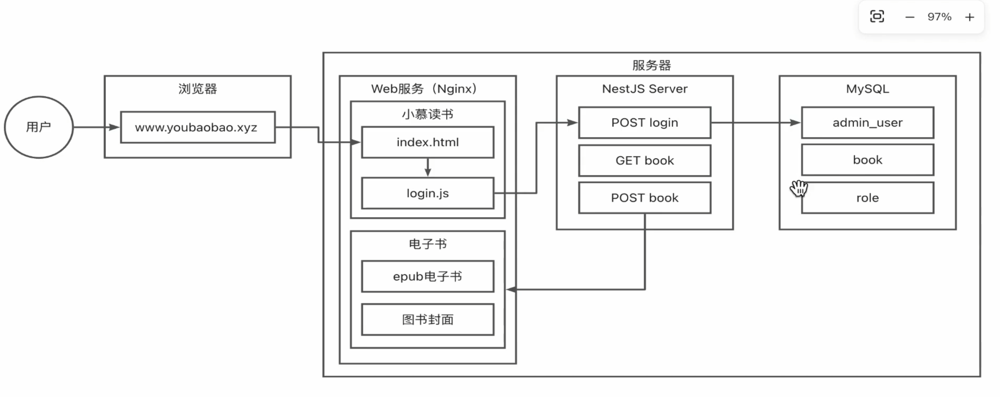
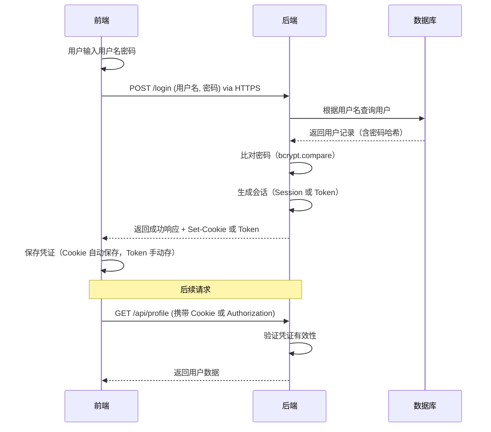

# 项目课程笔记




前端页面提供用户交互 后端程序处理复杂逻辑与数据请求 数据库进行数据存储

nginx提供Web服务，其部署页面


# 开启预览模式

预览模式是指**在本地服务器上运行已构建好的生产环境代码**，用于在实际部署前验证应用的表现。它与开发模式有本质区别：

| 模式                             | 用途         | 特点                         | 适用场景           |
| :------------------------------- | :----------- | :--------------------------- | :----------------- |
| **开发模式** (`npm run dev`)     | 开发时使用   | 支持热更新、调试、开发服务器 | 代码编写和调试阶段 |
| **构建模式** (`npm run build`)   | 生成生产代码 | 代码压缩、tree-shaking、优化 | 生成可部署的代码   |
| **预览模式** (`npm run preview`) | 验证构建结果 | 使用构建后的代码启动服务器   | 部署前的最终验证   |

## **在 Vue 项目中如何使用预览模式**

对于使用 Vite 的 Vue 项目（包括 vue-vben-admin-main），预览模式的使用非常简单：

```bash
# 构建项目
npm run build

# 启动预览服务器（默认在 localhost:4173）
npm run preview
```

或者，如果项目配置了 Turborepo：

```bash
# 使用 Turborepo 启动预览
turbo run preview
```

## **预览模式的工作原理**

1. 首先执行 `npm run build` 构建项目
2. 然后启动一个本地服务器（默认使用 `vite preview`）
3. 用构建后的文件（`dist` 目录中的内容）服务
4. 通过浏览器访问 `http://localhost:4173` 查看效果

在npm run preview开启预览模式之前要先进行构建 让其构建出dist目录 并且编译整个项目 但是进行构建指令npm run build之前，需要先给本地创建git仓库，

也就是说要先在本地创建仓库

**文档构建插件（@nolebase/vitepress-plugin-git-changelog）**安装了此插件的项目需要一个仓库来生成变更日志 那么第一次构建此项目就需要初始化仓库

```bash
# 进入项目根目录
cd E:\MyCode\根目录

# 初始化 Git 仓库
git init

# 添加所有文件到暂存区
git add .

# 提交初始版本
git commit -m "Initial commit"
```


# Vite中base配置项详解

在Vite中，`base`配置项是一个非常关键的配置，它直接影响项目构建后的静态资源路径，与项目的部署环境密切相关。

## base的作用

`base`用于设置项目的公共基础路径，决定了Vite在构建时如何生成静态资源的引用路径（如JS、CSS、图片等）。

## base的合法值

base有三种合法的写法：

1. **绝对URL**：`/test/`
2. **完整的URL**：`https://test.com/`
3. **空字符串或`./`**：用于嵌入形式的开发

## 常见使用场景

### 1. 部署到网站根路径（如`https://example.com/`）

```ts
base: '/'
```

- 静态资源路径：`https://example.com/static/js/main.js`
- 适用于直接部署在域名根目录下的项目

### 2. 部署到子路径（如`https://example.com/my-project/`）

```ts
base: '/my-project/'
```

- 静态资源路径：`https://example.com/my-project/static/js/main.js`
- 适用于部署在子路径下的项目

### 3. 本地开发预览（直接打开dist/index.html）

```ts
base: './'
```

- 静态资源路径：`./static/js/main.js`
- 这样可以避免在WebStorm等编辑器中直接预览dist/index.html时出现资源加载问题

## 常见问题与解决方案

### 问题：刷新页面后静态资源404

**现象**：

- 第一次加载页面正常
- 刷新页面后，资源请求路径错误，导致404

**原因**：

- 配置了错误的base值，例如：

  ```ts
  base: './' // 但实际部署在子路径
  ```

  或

  ```ts
  base: '/' // 但实际部署在子路径
  ```

**解决方案**：

- 根据实际部署路径设置正确的base值

- 例如，如果部署在

  ```
  https://example.com/my-app/
  ```

  ，则应设置：

  ```ts
  base: '/my-app/'
  ```

## 最佳实践

1. **多环境部署**：使用环境变量动态设置base

   ```ts
   base: process.env.VITE_BASE_PATH || '/'
   ```

2. **开发与生产环境**：

   - 开发环境：`base: './'`（方便本地预览）
   - 生产环境：根据实际部署路径设置（`'/'`或`'/subpath/'`）

3. **避免常见错误**：

   - 不要将base设置为`'./'`用于生产环境部署（除非部署在根路径）
   - 不要将base设置为`'/'`用于子路径部署

## 为什么base如此重要

base配置直接影响到构建后的资源路径，如果配置不正确，会导致：

- 静态资源404错误
- 页面加载不完整
- 部署后功能异常

正确配置base是确保Vite项目在不同部署环境下都能正常工作的关键。

## 示例配置

```ts
// vite.config.ts
import { defineConfig } from 'vite'

export default defineConfig({
  // 根据环境动态设置base
  base: process.env.VITE_BASE_PATH || './',
  
  build: {
    outDir: 'dist',
    assetsDir: 'assets'
  }
})
```

这样配置后，你可以在构建时通过环境变量指定正确的base路径，确保资源加载正常。


# Nest.js

启动Nest.js开发者服务的指令

```bash
npm run start:dev
```


## Nest中controller.ts创建路由

在controller.ts中 使用通过一定格式编写即可处理请求，返回值可以是方法也可以直接是一个值

```ts
import { Controller, Get } from '@nestjs/common';
import { AppService } from './app.service';
import path from 'path';

@Controller('home') //相当于在此处创建了一个路由接口
export class AppController {
  constructor(private readonly appService: AppService) { }

  @Get('/') //如果想请求到getHello()方法的返回值，则需要通过GET/home/
  getHello(): string {
    return this.appService.getHello();
  }

  @Get('test') //如果想直接请求到getTest()，则需要通过GET/home/test
  getTest(): string {
    return "test"
  }

}


```


## Nest 中创建Restful API

controller.ts中 从common引入Get(获取数据) Post(插入数据) Put(更新数据) Delete(删除数据)四个方法装饰器，按照一定格式编写即可写出符合Restful的API

```ts
import { Controller, Get, Post, Put, Delete } from '@nestjs/common';
import { AppService } from './app.service';
import path from 'path';

@Controller() //相当于在此处创建了一个路由接口
export class AppController {
  constructor(private readonly appService: AppService) { }

  @Get('/') //如果想请求到getHello()方法的返回值，则需要通过GET/home/
  getHello(): string {
    return this.appService.getHello();
  }

  @Get('test')
  getTest(): string {
    return "test"
  }

  @Get('data/:id')
  getData(): string {
    return "返回单条数据"
  }

  @Post('data')
  postData(): string {
    return "修改数据"
  }

  @Put('data')
  putData(): string {
    return "更新数据"
  }

  @Delete('data/:id')
  deleteData(): string {
    return "删除单条数据"
  }
}


```


## Nest 中的带参数请求处理

以下是针对 NestJS 中 `Param`、`Query`、`Body` 参数用法的**精简学习笔记**，结合你提供的代码进行解析，重点突出核心概念和常见用法：

### 核心知识点

NestJS 通过**装饰器**自动解析请求参数，无需手动处理 `req.params`/`req.query`/`req.body`。

| 参数类型  | 作用位置                 | 装饰器          | 示例场景                               | 代码用法示例                            |
| --------- | ------------------------ | --------------- | -------------------------------------- | --------------------------------------- |
| **Param** | **URL 路径中的动态部分** | `@Param('key')` | 从路径获取 ID（如 `/data/123`）        | `getData(@Param('id') id: string)`      |
| **Query** | **URL 查询字符串**       | `@Query('key')` | 从 `?name=abc&age=18` 获取参数         | `getUsers(@Query('name') name: string)` |
| **Body**  | **请求体（POST/PUT）**   | `@Body()`       | 获取 JSON 数据（如 `{ "name": "A" }`） | `createData(@Body() data: any)`         |

------

### 关键点解析

#### ✅ **1. `@Param`（路径参数）**

- **用法**：`@Param('id')` → 从 **URL 路径**中获取动态值（如 `/data/123` 的 `123`）。

- 你的代码：

  ```typescript
  @Get('data/:id') // 路径参数：:id
  getData(@Param('id') id: string) { // 通过装饰器获取 id
    return `返回单条数据, id: ${id}`;
  }
  
  //还能这样简写
  @Get('data/:id') // 路径参数：:id
  getData(@Param() params) { // 通过装饰器获取 id
    return `返回单条数据, id: ${params.id}`;
  }
  ```
  
  - **请求示例**：`GET /data/1001` → 返回 `id: 1001`
  - **注意**：路径必须写成 `data/:id`（带 `:`），否则无法识别。

#### ✅ **2. `@Query`（查询参数）**

- **用法**：`@Query('key')` → 从 **URL 查询字符串**获取参数（如 `?id=1001`）。

- 你的代码：

  ```typescript
  @Get('users')
  getUsers(@Query('page') page: number, @Query('limit') limit: number) {
    return `第 ${page} 页，每页 ${limit} 条`;
  }
  ```
  
  - **请求示例**：`GET /users?page=2&limit=10` → 返回 `第 2 页，每页 10 条`

#### ✅ **3. `@Body`（请求体）**

- **用法**：`@Body()` → 获取 **POST/PUT 请求体**（JSON 数据）。

- 你的代码：

  ```typescript
  @Post('data')
  createData(@Body() data: { name: string, age: number }) {
    return `创建数据: ${data.name}, ${data.age}`;
  }
  ```
  
  - 请求示例

    （POST）：

    ```json
    {
      "name": "Alice",
      "age": 30
    }
    ```
  
    → 返回 

    ```
    创建数据: Alice, 30
    ```

------

### ⚠️ **重要注意事项**

1. **`@Param` 的路径必须写 `:id`**
   ❌ 错误：`@Get('data/id')` → 无法识别动态参数
   ✅ 正确：`@Get('data/:id')`

2. **`@Query` 无需 `@Body`**
   `@Query` 用于 `GET` 请求（查询字符串），**不用于 `POST`**。

3. **`@Body` 仅用于 `POST`/`PUT`**
   `GET` 请求**没有请求体**，用 `@Query`。

4. **类型转换**  

   - ```
     @Param
     ```

      和 

     ```
     @Query
     ```

      默认返回 

     字符串

     （需手动转换）：

     ```typescript
     @Get('users')
     getUserById(@Param('id') id: string) {
       const userId = +id; // 转为数字
     }
     ```

5. **装饰器必须写对**
   ❌ 错误：`@Param('id')` → 用了中文逗号 `，`（你的代码中 `Param ，Query` 有中文逗号）
   ✅ 正确：`@Param('id')`（英文逗号）

------

### 📝 **总结速查表**

| 场景           | HTTP 方法 | 请求示例                         | 参数装饰器       | 获取值方式               |
| -------------- | --------- | -------------------------------- | ---------------- | ------------------------ |
| 获取路径 ID    | `GET`     | `/data/1001`                     | `@Param('id')`   | `id: string`             |
| 获取查询参数   | `GET`     | `/users?page=2&limit=10`         | `@Query('page')` | `page: number`           |
| 获取 JSON 数据 | `POST`    | `POST /data` + `{ "name": "A" }` | `@Body()`        | `data: { name: string }` |

> 💡 **一句话理解**：
> `Param` → 路径上 `:xxx` 的值，`Query` → `?xxx=xxx` 的值，`Body` → 请求体里的 JSON。


## Nest 中注册使用Provider

提供者（Provider）是 Nest 的核心概念之一。许多基础的 Nest 类（如服务、存储库、工厂和辅助工具）都可以被视为提供者。提供者的核心特性在于它能够作为依赖项被注入到其他类中。默认情况下，提供者的生命周期与应用程序的生命周期一致：启动时：所有依赖项会被解析，每个提供者实例化一次（单例模式）。关闭时：这些实例会被销毁。但 Nest 也支持将提供者设置为请求作用域（request-scoped），此时其生命周期与单个 HTTP 请求绑定，而非整个应用程序。

人话来说就是一些服务例如数据存储 操作数据库等等方法封装起来 形成一个Provider 通过编辑 注册 引入 构造器构建 使用，来响应一些请求的操作

 NestJS Provider 的描述（"服务封装 → 注册 → 引入 → 构造器注入 → 使用"）**精准且符合 NestJS 的设计哲学**

编辑：创建一个用 @Injectable() 装饰的类（服务）
注册：在模块的 providers 数组中注册这个类
引入：在控制器中引入这个服务类
构造器构建：在控制器的构造函数中声明这个服务
使用：通过 this.catsService 调用服务的方法

第一步：在app.service.ts文件中添加一份这样的方法集合，并使用@Injectable()装饰，导出

```ts
import { Injectable } from '@nestjs/common';

@Injectable()
export class AppService {
  getHello(): string {
    return 'Hello World!';
  }
}

//以下的TestService是新写的
@Injectable()
export class TestService {
    getTest(): string {
    return 'Test';
  }
    
}

```

第二步：在app.module.ts文件中的`import { AppService, TestService } from './app.service';`导入并且在providers配置项中添加刚才导入的集合

```TS
import { Module } from '@nestjs/common';
import { AppController } from './app.controller';
import { AppService, TestService } from './app.service';//导入刚刚写的TestService

@Module({
  imports: [],
  controllers: [AppController],
  providers: [AppService,TestService], //TestService是新导入的
})
export class AppModule {}
```

第三步：在app.controller.ts文件中添加`import { TestService } from './app.service';`导入TestService，并给AppController类的构造器添加TestService参数进行传入`  private readonly testService: TestService`，然后就可以享用了

```ts
@Get('test')
getTest(): string {
  // 通过 TestService 获取测试数据
  return this.testService.getTest();
}
```

app.controller.ts完整代码

```ts
import { Controller, Get, Post, Put, Delete, Param, Query } from '@nestjs/common';
import { AppService } from './app.service';
import { TestService } from './app.service';
import path from 'path';

@Controller() //相当于在此处创建了一个路由接口
export class AppController {
  constructor(
    private readonly appService: AppService,
    private readonly testService: TestService
  ) { }

  @Get('/') //如果想请求到getHello()方法的返回值，则需要通过GET/home/
  getHello(): string {
    return this.appService.getHello();
  }

  @Get('test')
  getTest(): string {
    return this.testService.getTest()
  }

  @Get('data/:id')
  getData(@Param('id') id: string): string {
    return `返回单条数据,id:${id}`
  }

  @Post('data')
  postData(): string {
    return "修改数据"
  }

  @Put('data')
  putData(): string {
    return "更新数据"
  }

  @Delete('data/:id')
  deleteData(): string {
    return "删除单条数据"
  }

  @Get('users')
  getUsers(@Query('page') page: number, @Query('limit') limit: number) {
    return `第 ${page} 页，每页 ${limit} 条`;
  }
}


```


## Nest 中异常处理

### 简单的异常处理

简单的异常处理可以放在处理响应，实现业务逻辑的service中，可以通过判断条件来抛出异常

这是标准的抛出错误语句

```ts
 throw new HttpException("BAD_REQUEST", HttpStatus.BAD_REQUEST)
```

其new了一个HttpException的对象，`HttpException` 构造函数接收两个必选参数来决定响应内容：

其语法为`HttpException("response",status)`

- `response` 参数定义了 JSON 响应体，可以是如下所述的 `string` 或 `object` 类型，人话就是错误提示。
- `status` 参数定义了 [HTTP 状态码](https://developer.mozilla.org/zh-CN/docs/Web/HTTP/Reference/Status)

响应结果为

```js
{
  "statusCode": 400,
  "message": "BAD_REQUEST"
}
```


你可以给response位置改为中文

```ts
 throw new HttpException("需要参数", HttpStatus.BAD_REQUEST)
```

响应结果为

```js
{
  "statusCode": 400,
  "message": "需要参数"
}
```

例子

```ts
//app.controller.ts
  @Get('testIntError/:id')
  getIntError(@Param('id') id: any) {
    return this.testService.getIntError(id)
  }


//app.service.ts
  getIntError(param): any {
    const num = parseInt(param, 10);
    if (!Number.isInteger(num)) {
      throw new HttpException(`BAD_REQUEST 错误参数：${param}`, HttpStatus.BAD_REQUEST)
    }
    return `${num} 你的值为整数，不会报错`
  }
```

确实这样的异常处理很强大了，但是有个问题——没法改变返回结构，如果需要自定义异常结构，那就要自定义异常以及配置异常过滤器了

### 复杂的异常处理

在src目录下创建exception文件夹，创建名为http-exception.filter.ts的文件，将下面的代码怼进去

```ts
import { ExceptionFilter, Catch, ArgumentsHost, HttpException } from '@nestjs/common';
import { Request, Response } from 'express';

@Catch(HttpException)
export class HttpExceptionFilter implements ExceptionFilter {
 catch(exception: HttpException, host: ArgumentsHost) {
   const ctx = host.switchToHttp();
   const response = ctx.getResponse<Response>();
   const request = ctx.getRequest<Request>();
   const status = exception.getStatus();

   response
     .status(status)
     .json({
       statusCode: status,
       timestamp: new Date().toISOString(),
       path: request.url,
     });
 }
}
```


"我用这个'锅'（response）返回一个漂亮错误：

.status(status)：设置错误代码（404/500等）

.json({ ... })：返回一个结构化的错误JSON

statusCode：错误代码（和状态码一样）

timestamp：错误发生时间（自动格式化）

path：用户访问的URL（比如/api/users/123）"


在 `main.ts` 中注册

```ts
// src/main.ts
async function bootstrap() {
  const app = await NestFactory.create(AppModule);
  
  // ✅ 关键：注册这个过滤器
  app.useGlobalFilters(new HttpExceptionFilter());
  
  await app.listen(3000);
}
bootstrap();
```


使用的时候先引入UseFilters再利用装饰器new我们写的过滤器

```ts
//先引入UseFilters
import { Controller, Get, Post, Put, Delete, Param, Query, UseFilters } from '@nestjs/common';
import { AppService } from './app.service';
import { TestService } from './app.service';
//再引入自制的过滤器
import { HttpExceptionFilter } from "./exception/http-exception.filter";

@Controller() //相当于在此处创建了一个路由接口
export class AppController {
  constructor(
    private readonly appService: AppService,
    private readonly testService: TestService
  ) { }

  @Get('/') //如果想请求到getHello()方法的返回值，则需要通过GET/home/
  getHello(): string {
    return this.appService.getHello();
  }

  @Get('test')
  getTest(): string {
    return this.testService.getTest()
  }

  @Get('data/:id')
  getData(@Param('id') id: string): string {
    return `返回单条数据,id:${id}`
  }

  @Post('data')
  postData(): string {
    return "修改数据"
  }

  @Put('data')
  putData(): string {
    return "更新数据"
  }

  @Delete('data/:id')
  deleteData(): string {
    return "删除单条数据"
  }

  @Get('users')
  getUsers(@Query('page') page: number, @Query('limit') limit: number) {
    return `第 ${page} 页，每页 ${limit} 条`;
  }

  @Get('testIntError/:id')
    //通过usefilters使用HttpExceptionFilter过滤器
  @UseFilters(new HttpExceptionFilter())
  getIntError(@Param('id') id: any) {
    return this.testService.getIntError(id)
  }
}


```


通过错误代码判断返回不同格式信息的过滤器这样写

```ts
import { ExceptionFilter, Catch, ArgumentsHost, HttpException } from '@nestjs/common';
import { Request, Response } from 'express';

@Catch(HttpException)
export class HttpExceptionFilter implements ExceptionFilter {
  catch(exception: HttpException, host: ArgumentsHost) {
    const ctx = host.switchToHttp();
    const response = ctx.getResponse<Response>();
    const request = ctx.getRequest<Request>();
    const status = exception.getStatus();
    const message = exception.message || 'Internal Server Error';

    // ====== 核心：根据错误状态码定制返回格式 ======
    let errorResponse = {
      statusCode: status,
      timestamp: new Date().toISOString(),
      path: request.url,
      message: message,
    };

    // 400 错误：添加详细错误信息（如表单验证错误）
    if (status === 400) {
      errorResponse = {
        ...errorResponse,
        errors: this.extractErrors(exception), // 自定义错误提取逻辑
      };
    }

    // 401 错误：添加认证信息
    if (status === 401) {
      errorResponse = {
        ...errorResponse,
        details: 'Authentication required',
      };
    }

    // 403 错误：添加权限信息
    if (status === 403) {
      errorResponse = {
        ...errorResponse,
        details: 'You do not have permission to access this resource',
      };
    }

    // 404 错误：添加资源信息
    if (status === 404) {
      errorResponse = {
        ...errorResponse,
        details: `Resource not found at ${request.url}`,
      };
    }

    // 500 错误：添加内部错误码（不暴露具体细节）
    if (status >= 500) {
      errorResponse = {
        ...errorResponse,
        errorCode: 'INTERNAL_SERVER_ERROR',
      };
    }

    // ====== 返回最终格式 ======
    response.status(status).json(errorResponse);
  }

  // 辅助方法：提取错误详情（示例）
  private extractErrors(exception: HttpException): string[] {
    // 这里可以解析异常中的错误详情
    // 例如：如果异常是 ValidationPipe 抛出的，可以解析 errors 数组
    return ['Invalid email format', 'Name is required'];
  }
}
```


## Nest 中构建Module

在NestJS中，模块（Module）是应用的基本构建单元，用于组织和管理代码。以下是如何构建NestJS模块的详细步骤：

### 1. 模块的基本概念

- 模块是应用的基本构建单元，用于封装相关特性、服务、控制器和中间件
- 模块提供依赖注入的上下文，使代码更加模块化和可重用
- 每个应用程序至少有一个根模块（通常为`AppModule`）

### 2. 创建模块的两种方式

#### 方法一：使用Nest CLI（推荐）

```bash
# 创建一个名为user的模块
nest g module user
nest g controller user
```

执行上述命令后，Nest CLI会在`src/user`目录下创建以下文件：

- `user.module.ts`
- `user.controller.ts`
- `user.service.ts`

#### 方法二：手动创建

在`src`目录下创建`user`文件夹，并在其中创建`user.module.ts`文件。

### 3. 模块的基本结构

```typescript
import { Module } from '@nestjs/common';
import { UserController } from './user.controller';
import { UserService } from './user.service';

@Module({
  imports: [], // 导入其他模块
  controllers: [UserController], // 注册控制器
  providers: [UserService], // 注册提供者（服务）
  exports: [] // 导出需要在其他模块中使用的提供者
})
export class UserModule {}
```

### 4. 模块的组成部分

#### 4.1 `controllers`

- 注册一组控制器
- 控制器负责处理传入的请求和向客户端返回响应

#### 4.2 `providers`

- 注册一组提供者（服务）
- 提供者是NestJS的基础概念，用于封装业务逻辑

#### 4.3 `imports`

- 导入其他模块
- 这些模块导出的提供者可以在本模块中使用

#### 4.4 `exports`

- 导出由本模块提供，并且需要在其他模块中使用的提供者
- 用于将模块的内部功能暴露给其他模块

### 5. 根模块（AppModule）配置

根模块是应用程序的起点，通常位于`src/app.module.ts`：

```typescript
import { Module } from '@nestjs/common';
import { UserModule } from './user/user.module';

@Module({
  imports: [UserModule], // 导入其他模块
  controllers: [AppController],
  providers: [AppService],
})
export class AppModule {}
```

### 6. 全局模块（Global Module）

如果需要在所有模块中共享一个服务，可以创建全局模块：

```typescript
// logger.module.ts
import { Module, Global } from '@nestjs/common';
import { LoggerService } from './logger.service';

@Global() // 使用@Global()装饰器
@Module({
  providers: [LoggerService],
  exports: [LoggerService], // 导出服务
})
export class LoggerModule {}
```

在根模块中导入一次：

```typescript
// app.module.ts
import { Module } from '@nestjs/common';
import { LoggerModule } from './logger/logger.module';

@Module({
  imports: [LoggerModule], // 只需导入一次
})
export class AppModule {}
```

现在可以在任何模块中直接使用`LoggerService`：

```typescript
// user.service.ts
import { Injectable } from '@nestjs/common';
import { LoggerService } from '../logger/logger.service';

@Injectable()
export class UserService {
  constructor(private readonly logger: LoggerService) {}

  createUser(name: string) {
    this.logger.log(`Creating user: ${name}`);
    // 其他逻辑
  }
}
```

### 7. 模块的依赖关系

- 在不同模块中注册同一个提供者，默认会共享实例
- 一个模块可以导入多个其他模块，形成模块树结构
- 模块之间通过`imports`和`exports`建立依赖关系

### 8. 模块的目录结构示例

```
src/
├── app.module.ts        # 根模块
├── user/
│   ├── user.module.ts   # 用户模块
│   ├── user.controller.ts
│   └── user.service.ts
├── cats/
│   ├── cats.module.ts
│   ├── cats.controller.ts
│   └── cats.service.ts
└── main.ts              # 应用入口文件
```

### 9. 模块的优势

- 代码结构清晰，易于维护
- 促进代码重用
- 便于团队协作（不同团队可以负责不同模块）
- 便于测试（可以独立测试模块）

通过这种方式构建模块，可以有效地组织大型应用的代码结构，使应用更加模块化、可维护和可扩展。


## Nest 中的管道

### 定义

在 NestJS 中，**管道（Pipe）** 是一种用于处理 HTTP 请求参数的装饰器和类，它在控制器方法被调用**之前**执行。管道是实现输入验证、数据转换和格式化的重要组件。

#### 核心职责

- **验证**：数据不符合规则时直接抛异常，请求不会到达控制器
- **转换**：将入参转换为我们需要的格式（如字符串→数字、普通对象→DTO实例）

### ParseIntPipe 详解

`ParseIntPipe` 是 NestJS 内置的管道，用于**将字符串参数转换为整数**，如果转换失败会抛出 400 错误。

#### 基本用法

```typescript
@Get(':id')
findOne(@Param('id', ParseIntPipe) id: number) {
  return this.catsService.findOne(id);
}
```

#### 工作原理

1. 当请求 `GET /cats/123` 时，`:id` 的值是字符串 `'123'`

2. `ParseIntPipe` 自动将 `'123'` 转换为数字 `123`

3. 如果请求 

   ```
   GET /cats/abc
   ```

   ，则转换失败，返回 400 错误：

   ```json
   {
     "statusCode": 400,
     "message": "Validation failed (numeric string is expected)",
     "error": "Bad Request"
   }
   ```

#### 自定义错误状态码

可以自定义错误状态码（如 404 而不是默认的 400）：

```typescript
@Get()
getHello(@Query('test', new ParseIntPipe({ errorHttpStatusCode: HttpStatus.NOT_FOUND })) test: string): string {
  return test + 10;
}
```

#### 适用场景

| 场景     | 代码示例                                    |
| -------- | ------------------------------------------- |
| 路径参数 | `@Param('id', ParseIntPipe) id: number`     |
| 查询参数 | `@Query('page', ParseIntPipe) page: number` |
| 请求体   | `@Body('age', ParseIntPipe) age: number`    |

#### 为什么需要 ParseIntPipe？

在 JavaScript 中，所有路由参数都是字符串类型。当需要数字类型（如 ID、页码）时，直接使用字符串可能导致：

- 类型错误（如 `id + 1` 变成字符串拼接）
- 逻辑错误（如 `if (id > 10)` 无法正确比较）

ParseIntPipe 确保了参数在到达控制器前被正确转换。

### 与 DTO 结合使用

ParseIntPipe 与 DTO（数据传输对象）结合使用，可以实现更强大的参数验证：

```typescript
// DTO 定义
export class UserDto {
  @IsInt()
  @Min(0)
  age: number;
}

// 控制器
@Get()
getUsers(@Query(ValidationPipe) userDto: UserDto) {
  console.log(userDto.age); // 已转换为整数
}
```

### 总结

- 管道是 NestJS 中处理请求参数的"过滤器"
- `ParseIntPipe` 是最常用的管道之一，用于将字符串参数转为整数
- 使用简单：只需在参数装饰器中添加 `ParseIntPipe`
- 自动处理类型转换，避免类型错误
- 转换失败时自动返回 400 错误，无需手动处理

> 📌 **小贴士**：NestJS 提供了多种内置管道，如 `ParseBoolPipe`、`ParseArrayPipe`、`DefaultValuePipe` 等，它们都能极大简化参数处理逻辑，使代码更简洁、健壮。


## NestJS 中使用 TypeORM 集成 MySQL 数据库

本文将逐步讲解如何在 NestJS 项目中集成 TypeORM 并连接 MySQL 数据库。假设你已经安装了 Node.js 和 MySQL 数据库。

### 安装必要的依赖

我们需要安装 TypeORM 的 NestJS 封装包、TypeORM 本身以及 MySQL 驱动：

```bash
npm install @nestjs/typeorm typeorm mysql2
```

- `@nestjs/typeorm`：NestJS 对 TypeORM 的集成模块。
- `typeorm`：TypeORM 核心库。
- `mysql2`：MySQL 数据库驱动（也可以使用 `mysql`，但推荐 `mysql2`）。

### 配置 TypeORM 连接

打开 `src/app.module.ts`，在 `@Module` 装饰器中导入 `TypeOrmModule.forRoot()` 并配置数据库连接信息。

```typescript
import { Module } from '@nestjs/common';
import { TypeOrmModule } from '@nestjs/typeorm';
import { AppController } from './app.controller';
import { AppService } from './app.service';

@Module({
  imports: [
    TypeOrmModule.forRoot({
      type: 'mysql',           // 数据库类型
      host: 'localhost',       // 数据库主机地址
      port: 3306,              // 数据库端口（默认3306）
      username: 'root',        // 数据库用户名
      password: 'password',    // 数据库密码
      database: 'test',        // 数据库名称（需提前创建）
      entities: [__dirname + '/**/*.entity{.ts,.js}'], // 实体文件路径
      synchronize: true,       // 自动同步数据库表结构（开发环境使用，生产环境建议关闭）
    }),
  ],
  controllers: [AppController],
  providers: [AppService],
})
export class AppModule {}
```

**注意**：

- 请将 `username`、`password` 和 `database` 修改为你自己的 MySQL 配置。
- `synchronize: true` 会在每次应用启动时自动创建数据库表（根据实体），非常适合开发阶段，但生产环境请设置为 `false` 并使用迁移。
- `entities` 配置告诉 TypeORM 去哪里找实体文件。

### 创建一个实体（Entity）

实体对应数据库中的一张表。我们在 `src` 下创建一个 `user` 目录，并在其中新建 `user.entity.ts` 文件：

```typescript
// src/user/user.entity.ts
import { Entity, Column, PrimaryGeneratedColumn } from 'typeorm';

@Entity() // 表示这是一个实体
export class User {
  @PrimaryGeneratedColumn() // 自增主键
  id: number;

  @Column({ length: 100 }) // 字符串列，最大长度100
  name: string;

  @Column({ default: 18 }) // 整数列，默认值18
  age: number;

  @Column({ unique: true }) // 唯一约束的列
  email: string;
}
```

实例

```ts
import { Column, Entity, PrimaryGeneratedColumn, Unique } from "typeorm";

@Entity('admin_user')
export class User {
  @PrimaryGeneratedColumn()
  id: number;

  @Column()
  @Unique(['username'])
  username: string;

  @Column()
  password: string;

  @Column()
  avatar: string;

  @Column()
  role: string;

  @Column()
  nickname: string;

  @Column()
  active: number;
}
```


- `@Entity()`：标记一个类为数据库实体（表），可选参数指定表名（如 `@Entity('users')`）。  
- `@Column()`：定义属性为数据库列，常用参数包括 `type`（列类型）、`length`（长度）、`default`（默认值）、`unique`（唯一约束）、`nullable`（是否可为空）。  
- `@PrimaryGeneratedColumn()`：定义自动生成的主键列，默认自增；可传入 `'uuid'` 改用 UUID 生成策略。  
- `@Unique()`：在实体类上声明联合唯一约束，接收字段名数组，如 `@Unique(['email', 'phone'])`。

### 创建模块、服务和控制器

为了演示数据库操作，我们创建一个 User 模块，包含 Service 和 Controller。

#### 生成模块和资源

使用 Nest CLI 快速生成：

```bash
nest g module user
nest g service user
nest g controller user
```

这会在 `src/user` 下创建对应的文件。

#### 在模块中注册 TypeORM 实体

打开 `src/user/user.module.ts`，导入 `TypeOrmModule.forFeature()` 并将 `User` 实体传入，这样 TypeORM 就会在该模块范围内注册 `User` 的仓库（Repository）。

```typescript
import { Module } from '@nestjs/common';
import { TypeOrmModule } from '@nestjs/typeorm';
import { User } from './user.entity';
import { UserService } from './user.service';
import { UserController } from './user.controller';

@Module({
  imports: [TypeOrmModule.forFeature([User])], // 注册 User 实体
  providers: [UserService],
  controllers: [UserController],
})
export class UserModule {}
```

#### 编写 Service 中的数据库操作

在 `user.service.ts` 中注入 `User` 的 Repository，然后编写 CRUD 方法。

```typescript
import { Injectable } from '@nestjs/common';
import { InjectRepository } from '@nestjs/typeorm';
import { Repository } from 'typeorm';
import { User } from './user.entity';

@Injectable()
export class UserService {
  constructor(
    @InjectRepository(User)
    private userRepository: Repository<User>,
  ) {}

  // 创建用户
  async create(userData: Partial<User>): Promise<User> {
    const user = this.userRepository.create(userData); // 创建实体实例
    return await this.userRepository.save(user);       // 保存到数据库
  }

  // 查询所有用户
  async findAll(): Promise<User[]> {
    return await this.userRepository.find();
  }

  // 根据ID查询单个用户
  async findOne(id: number): Promise<User | null> {
    return await this.userRepository.findOneBy({ id });
  }

  // 更新用户
  async update(id: number, updateData: Partial<User>): Promise<User> {
    await this.userRepository.update(id, updateData);
    return this.findOne(id);
  }

  // 删除用户
  async remove(id: number): Promise<void> {
    await this.userRepository.delete(id);
  }
}
```

#### 编写 Controller 的接口

在 `user.controller.ts` 中定义 REST API 端点，调用 Service 的方法。

```typescript
import { Controller, Get, Post, Body, Param, Put, Delete } from '@nestjs/common';
import { UserService } from './user.service';
import { User } from './user.entity';

@Controller('users')
export class UserController {
  constructor(private readonly userService: UserService) {}

  @Post()
  create(@Body() userData: Partial<User>): Promise<User> {
    return this.userService.create(userData);
  }

  @Get()
  findAll(): Promise<User[]> {
    return this.userService.findAll();
  }

  @Get(':id')
  findOne(@Param('id') id: string): Promise<User> {
    return this.userService.findOne(+id);
  }

  @Put(':id')
  update(@Param('id') id: string, @Body() updateData: Partial<User>): Promise<User> {
    return this.userService.update(+id, updateData);
  }

  @Delete(':id')
  remove(@Param('id') id: string): Promise<void> {
    return this.userService.remove(+id);
  }
}
```

### 测试运行

确保 MySQL 服务已启动，并且配置的数据库（例如 `test`）已经存在（可以使用 CREATE DATABASE test; 创建）。

然后启动应用：

```bash
npm run start:dev
```

现在可以使用 API 工具（如 Postman）访问以下接口进行测试：

- `POST /users` – 创建用户（body 发送 JSON：`{"name":"张三","age":20,"email":"zhangsan@example.com"}`）
- `GET /users` – 获取所有用户
- `GET /users/1` – 获取 ID 为 1 的用户
- `PUT /users/1` – 更新用户信息
- `DELETE /users/1` – 删除用户

### 常见问题与提示

- **数据库连接失败**：检查 MySQL 服务是否运行，用户名密码是否正确，数据库是否存在。
- **端口冲突**：如果 MySQL 使用非默认端口，请在配置中修改 `port`。
- **实体自动同步**：`synchronize: true` 在开发时很方便，但切勿在生产环境使用，否则可能导致数据丢失。生产环境应使用迁移（migration）。
- **路径别名**：如果使用 `entities` 路径通配符不生效，可以改为 `entities: [User]` 并确保实体已导入 


# 前后端登录验证场景

---

## 1. 前端操作（浏览器/客户端）

### 1.1 用户输入与前端校验
- 用户在登录页面输入**用户名/邮箱**和**密码**。
- 前端可以进行基本的格式校验（如非空、密码长度、邮箱格式），以减少无效请求，**但绝不能依赖前端校验作为安全手段**，因为恶意用户可以绕过。

### 1.2 发送登录请求
- 前端通过 **HTTPS POST** 请求将用户名和密码发送到后端登录接口（如 `/api/login`）。
- 请求体一般为 JSON 格式，例如：
  ```json
  {
    "username": "user@example.com",
    "password": "plaintextPassword"
  }
  ```
- **注意**：这里发送的是明文密码（在 HTTPS 加密通道中传输）。不要在前端对密码做哈希，否则哈希值会成为新的“密码等价物”，增加风险（详见之前的解释）。

### 1.3 处理响应
- 前端接收后端返回的响应。
- 如果登录成功：
  - **Session-Cookie 方式**：浏览器会自动保存后端通过 `Set-Cookie` 头设置的会话 Cookie（HttpOnly、Secure、SameSite 等属性），后续请求会自动携带该 Cookie，无需前端额外处理。
  - **Token 方式（如 JWT）**：后端返回一个 Token（通常放在响应体或 `Authorization` 头中），前端需要手动将 Token 保存到 `localStorage`、`sessionStorage` 或内存中，并在后续请求的 `Authorization` 头中携带。
- 如果登录失败，前端提示错误信息（如“用户名或密码错误”）。

---

## 2. 后端操作（服务器）

### 2.1 接收请求并验证参数
- 后端接口接收用户名和密码，进行基本格式校验（如是否为空）。
- 根据用户名从数据库（或其他存储）中查找用户记录。

### 2.2 验证密码
- 取出数据库中存储的**密码哈希值**和**盐**（如果使用 bcrypt，盐已包含在哈希字符串中）。
- 使用相同的哈希算法（如 bcrypt）对前端传来的明文密码加盐哈希，并与数据库中的哈希值比对。
- **密码绝不能明文存储**，必须使用加盐慢哈希（bcrypt、scrypt、Argon2）。

### 2.3 创建会话（登录成功时）
- 如果密码匹配，说明身份验证通过，后端需要为用户创建一个会话，以便后续请求识别用户身份。

#### 方案 A：Session-Cookie
1. 在服务器内存或存储（如 Redis）中创建一个 Session 对象，生成唯一的 Session ID。
2. 将用户信息（如用户 ID、角色）存入 Session。
3. 通过 `Set-Cookie` 响应头将 Session ID 发送给前端浏览器，Cookie 通常设置为 `HttpOnly`（防止 JavaScript 访问）、`Secure`（仅 HTTPS 发送）、`SameSite`（防止 CSRF）等属性。
4. 后续请求中，浏览器会自动携带该 Cookie，后端通过解析 Cookie 中的 Session ID 获取用户信息。

#### 方案 B：Token（如 JWT）
1. 生成一个包含用户信息（如用户 ID、过期时间）的 JSON Web Token，使用服务器密钥签名。
2. 将 Token 返回给前端（通常在响应体或 `Authorization` 头中）。
3. 后续请求中，前端需在 `Authorization` 头中携带 `Bearer <token>`，后端验证签名和有效期后解析出用户信息。

### 2.4 返回响应
- 登录成功：返回状态码 200，可附带用户基本信息（如用户名、头像）或 Token。
- 登录失败：返回 401 Unauthorized 或 400 Bad Request，并附带错误信息。

---

## 3. 后续请求的认证流程

### 3.1 携带凭证
- **Session-Cookie**：浏览器自动在请求头中带上 Cookie，后端通过 Session 中间件解析用户。
- **Token**：前端手动在请求头中添加 `Authorization: Bearer <token>`。

### 3.2 后端验证
- 后端在每个需要认证的接口中验证凭证的有效性（Session 是否存在、Token 是否合法且未过期）。
- 验证通过后，允许访问资源；否则返回 401 或 403。

---

## 4. 安全原理与关键措施

| 环节         | 原理与措施                                                   | 目的                                 |
| ------------ | ------------------------------------------------------------ | ------------------------------------ |
| **传输层**   | 强制使用 HTTPS（TLS），加密所有通信内容                      | 防止中间人窃听、篡改密码或会话凭证   |
| **密码存储** | 加盐慢哈希（bcrypt/Argon2），防止彩虹表攻击                  | 即使数据库泄露，也无法直接还原密码   |
| **会话凭证** | Session ID 或 Token 应足够随机，且设置 HttpOnly、Secure、SameSite 等属性 | 防止 XSS 窃取 Cookie，防止 CSRF 攻击 |
| **登录接口** | 加入验证码、限制尝试频率（防止暴力破解）                     | 防止自动化攻击                       |
| **登出**     | 前端清除 Token 或删除本地存储，后端销毁 Session 或加入 Token 黑名单 | 确保会话正确终止                     |

---

## 5. 经典流程图



---

## 总结
经典登录验证的核心是：
- **前端**负责收集凭证并通过 HTTPS 安全发送，以及后续请求中携带凭证。
- **后端**负责验证身份、管理会话、安全存储密码，并在每个受保护接口中校验凭证。
- 安全依赖于 HTTPS、加盐哈希密码、合理的会话管理和防御机制。

不同技术选型（Session vs Token）在实现细节上有所差异，但基本原理一致。


# 登录业务场景实现逻辑与技术细节

## 1. 概述
登录是绝大多数 Web 应用的入口，其核心目标是**验证用户身份**并在后续请求中**维持认证状态**。一个安全的登录系统必须同时保证**传输安全**、**存储安全**和**凭证安全**。本文将详细描述从用户输入到后端验证再到前端维护会话的完整流程，并说明每个环节的技术选型与安全考量。

---

## 2. 整体流程（详细步骤）

### 2.1 用户输入阶段
1. 用户在登录页面输入用户名（或邮箱/手机号）和密码，可勾选“记住我”等选项。
2. 前端可进行基础格式校验（如非空、密码长度），但仅作为用户体验优化，不能依赖其保证安全。

### 2.2 登录请求发送
3. 前端通过 HTTPS POST 请求将用户名和密码以 JSON 格式发送到后端登录接口（例如 `/api/login`）。HTTPS 确保传输过程中数据加密，防止中间人窃听。
4. 请求示例：
   ```http
   POST /api/login HTTP/1.1
   Host: example.com
   Content-Type: application/json
   
   {
     "username": "user@example.com",
     "password": "用户输入的明文密码"
   }
   ```

### 2.3 后端接收与查询
5. 后端接口接收到请求后，首先进行基本参数校验（如字段是否存在、格式是否正确）。
6. 根据用户名从数据库（或其他用户存储）中查询对应的用户记录。若用户不存在，为安全起见，应返回模糊的错误信息（如“用户名或密码错误”），避免泄露用户存在性。

### 2.4 密码验证
7. 后端从数据库记录中取出该用户的**密码哈希值**（例如 bcrypt 生成的字符串）。
8. 使用与存储时相同的哈希算法（如 bcrypt 的 `compare` 方法）对前端传来的明文密码进行验证：将明文密码与存储的哈希值作为输入，算法会提取盐并重新计算哈希，然后比对。
9. 如果验证失败（密码错误），后端返回 HTTP 401 Unauthorized 状态码，并附带错误信息（如“用户名或密码错误”），流程终止。

### 2.5 凭证生成与返回（登录成功）
10. 如果密码验证通过，说明用户身份真实。后端需要为该用户创建一个会话凭证，以便后续请求识别身份。根据采用的认证方案不同，分为两种情形：
    - **基于 Token（如 JWT）**：后端生成一个包含用户标识（如 `user_id`）、过期时间等信息的 JWT，并使用服务器私钥签名。
    - **基于 Session**：后端在服务端存储（如 Redis）中创建一个 Session 记录，关联用户 ID，并生成一个唯一的 Session ID。
11. 后端将凭证返回给前端：
    - **Token 方式**：在响应体中返回 JSON 格式的 Token，例如 `{ "token": "eyJhbGciOiJIUzI1NiIs..." }`。
    - **Session 方式**：通过 `Set-Cookie` 响应头将 Session ID 发送给浏览器，Cookie 通常设置为 `HttpOnly`、`Secure`、`SameSite` 等安全属性。
12. 响应状态码为 200 OK。

### 2.6 前端处理响应
13. 前端接收到成功响应后，根据凭证类型进行保存：
    - **Token 方式**：前端将 Token 保存在安全位置（推荐内存变量，或 `sessionStorage`，避免使用 `localStorage` 以防 XSS 窃取）。后续请求需在 `Authorization` 头中携带 `Bearer <token>`。
    - **Session 方式**：浏览器自动保存 Cookie，前端无需额外操作，后续请求会自动携带。
14. 如果登录失败，前端根据后端返回的错误信息提示用户。

### 2.7 后续请求的认证
15. 在用户登录后的每次请求中，前端需要携带凭证：
    - **Token 方式**：在请求头中添加 `Authorization: Bearer <token>`。
    - **Session 方式**：浏览器自动在请求头中添加 `Cookie: sessionId=...`。
16. 后端在需要认证的接口中，验证凭证的有效性：
    - **JWT**：验证签名、过期时间，解析出用户标识，然后将用户信息附加到请求上下文（如 `req.user`）供后续使用。
    - **Session**：根据 Cookie 中的 Session ID 查询服务端存储，获取对应用户信息。
17. 验证通过则正常处理请求并返回数据；验证失败（如凭证过期、无效）则返回 401 或 403 状态码。

---

## 3. 前端实现细节

### 3.1 用户输入与表单提交
- 提供用户名/邮箱、密码输入框，可附加验证码、记住我等功能。
- **前端可做基础校验**（非空、格式），但**不能依赖前端校验保证安全**（可被绕过）。

### 3.2 发送登录请求
- **必须使用 HTTPS**，确保传输过程中数据加密，防止中间人窃听。
- 请求方法：`POST`
- 请求头：`Content-Type: application/json`
- 请求体（JSON 格式示例）：
  ```json
  {
    "username": "user@example.com",
    "password": "用户输入的明文密码"
  }
  ```
- **注意**：不要在前端对密码做哈希或加密，否则哈希值会成为新的“密码等价物”，增加风险（详见第7节误区）。

### 3.3 处理响应
#### 登录成功
- **情况A：使用 Token（如 JWT）**  
  后端返回类似：
  ```json
  {
    "status": "success",
    "token": "eyJhbGciOiJIUzI1NiIs..."
  }
  ```
  前端需将 Token 保存在安全的地方：
  - 推荐：**内存变量**（刷新页面后丢失，需重新登录，适用于高安全场景）
  - 次选：`sessionStorage`（标签页关闭后丢失）
  - 避免：`localStorage`（持久化，易受 XSS 攻击窃取）
  - 如果使用 Cookie（HttpOnly）则前端无需手动存储，浏览器自动管理。
- **情况B：使用 Session-Cookie**  
  后端通过 `Set-Cookie` 头设置会话 Cookie（通常为 `HttpOnly`），浏览器自动保存，前端无感知。

#### 登录失败
- 后端返回 401 状态码及错误信息，前端提示用户。

### 3.4 后续请求携带凭证
- **Token 方式**：在请求头中添加 `Authorization: Bearer <token>`
- **Session-Cookie 方式**：浏览器自动携带 Cookie，前端无需额外操作。

---

## 4. 后端实现细节

### 4.1 接收请求
- 解析请求体，获取用户名和明文密码。
- 基本参数校验（非空、类型）。

### 4.2 查询用户
- 根据用户名从数据库（或其他存储）查找用户记录。
- 若用户不存在，应返回模糊错误（如“用户名或密码错误”），避免枚举用户名。

### 4.3 密码验证
- 取出数据库中存储的**密码哈希**（例如 bcrypt 输出）。
- 使用相同的哈希算法验证密码：
  ```javascript
  const bcrypt = require('bcrypt');
  const isValid = await bcrypt.compare(plainPassword, storedHash);
  ```
- 验证失败则返回 401。

### 4.4 生成凭证
验证通过后，需要为用户创建一个会话凭证，用于后续请求的认证。

#### 方案一：基于 Token（JWT）
- 生成 JWT，包含用户标识（如 `user_id`）、过期时间等，使用服务器私钥签名。
- 返回给前端：
  ```json
  { "token": "eyJhbGciOiJIUzI1NiIs..." }
  ```
- 优点：无状态，易于扩展；缺点：难以主动吊销，需配合黑名单。

#### 方案二：基于 Session
- 在服务器端存储（如 Redis、内存）中创建 Session 记录，关联用户 ID。
- 生成唯一的 Session ID，通过 `Set-Cookie` 发送给前端，Cookie 属性建议：
  - `HttpOnly`（防止 XSS 读取）
  - `Secure`（仅 HTTPS 发送）
  - `SameSite=Strict/Lax`（防止 CSRF）
  - `Max-Age` 或 `Expires`（设置有效期）
- 优点：易于吊销；缺点：需要存储，扩展性稍差。

### 4.5 返回响应
- 登录成功：状态码 200，携带凭证。
- 登录失败：状态码 401，附带错误信息（避免暴露具体原因）。

---

## 5. 密码存储技术

### 5.1 基本原则
- **绝不能明文存储密码**。
- **绝不能使用可逆加密**（如 AES）存储密码，因为加密密钥一旦泄露，所有密码都会被还原。
- 必须使用**加盐哈希**，且推荐使用**慢哈希算法**。

### 5.2 什么是加盐哈希？
- **盐**：随机生成的字符串，每个用户唯一，与密码组合后一起哈希。
- **作用**：即使两个用户密码相同，由于盐不同，哈希值也不同；防止彩虹表攻击。
- bcrypt 等算法会自动生成并存储盐，开发者无需手动管理。

### 5.3 推荐算法
- **bcrypt**：最广泛使用，可配置工作因子（成本），输出格式包含算法标识、成本因子、盐和哈希。
- **Argon2**：更现代，抗 GPU 攻击更强，但库支持略少。
- **scrypt**：同样优秀，但不如前两者普及。
- **禁止使用 MD5、SHA-1、SHA-256 等快速哈希**（无盐或简单加盐仍可被暴力破解）。

### 5.4 存储示例（bcrypt）
数据库用户表设计：
```sql
CREATE TABLE users (
  id INT PRIMARY KEY AUTO_INCREMENT,
  username VARCHAR(255) UNIQUE NOT NULL,
  password_hash VARCHAR(60) NOT NULL,   -- bcrypt 输出固定60字符
  created_at TIMESTAMP
);
```
注册时：
```javascript
const saltRounds = 10;
const hash = await bcrypt.hash(password, saltRounds);
// 存储 hash 到 password_hash 字段
```
登录时：
```javascript
const match = await bcrypt.compare(inputPassword, storedHash);
```

### 5.5 安全性说明
- 即使攻击者获得了 `password_hash`、盐和算法，也无法直接反推出原始密码（哈希单向性）。
- 但如果用户使用弱密码（如 `123456`），攻击者可以通过字典攻击，将常见密码加盐哈希后比对，从而破解。
- 因此，**强制用户使用强密码** + **慢哈希算法** 是必要的。

---

## 6. 令牌与认证的深入理解

### 6.1 Token（JWT） vs Session-Cookie
| 特性     | JWT                               | Session-Cookie                     |
| -------- | --------------------------------- | ---------------------------------- |
| 存储位置 | 客户端（前端保存）                | 服务端（内存/Redis）+ 客户端Cookie |
| 状态     | 无状态（服务器不存储会话）        | 有状态（服务器存储会话）           |
| 扩展性   | 好，无需共享存储                  | 需集中存储（如Redis），适合集群    |
| 吊销     | 难，需维护黑名单                  | 易，直接删除会话记录               |
| 安全性   | Token 需防止 XSS 窃取（存于内存） | Cookie 可设 HttpOnly，防 XSS 更好  |
| 适用场景 | 分布式系统、移动端、跨域          | 传统 Web 应用，需服务端控制会话    |

### 6.2 凭证存储最佳实践
- **JWT**：
  - 优先存储在内存变量中（刷新页面即丢失，但可配合刷新令牌实现无感续期）。
  - 如果必须持久化（如“记住我”），可考虑使用 `sessionStorage`，并注意 XSS 防护。
  - 绝对不要将敏感信息（如密码）放入 JWT payload。
- **Session-Cookie**：
  - 设置 Cookie 为 `HttpOnly`、`Secure`、`SameSite`。
  - 使用足够随机的 Session ID。
  - 服务端定期清理过期会话。

---

## 7. 常见误区与安全陷阱

### 7.1 前端哈希密码
❌ 错误做法：前端用 MD5 哈希密码后再发送。  
✅ 正确：发送明文密码（由 HTTPS 加密）。  
**原因**：前端哈希后的值成为新的“密码等价物”，攻击者截获后可直接用于登录；且无法增加安全性。

### 7.2 明文存储密码
❌ 错误：数据库直接保存用户密码。  
✅ 正确：使用加盐慢哈希（如 bcrypt）。  
**后果**：数据库泄露即所有账号密码暴露。

### 7.3 使用快速哈希（MD5/SHA1）存储
❌ 错误：`password = md5(password)` 甚至不加盐。  
✅ 正确：使用 bcrypt/Argon2 等慢哈希。  
**后果**：可被 GPU 快速暴力破解，弱密码瞬间被还原。

### 7.4 Token 保存在 localStorage
❌ 错误：将 JWT 存入 `localStorage`，且无额外防护。  
✅ 正确：优先内存变量，或使用 `httpOnly` Cookie。  
**后果**：XSS 漏洞可窃取 Token，导致账户被盗。

### 7.5 忽略 HTTPS
❌ 错误：网站未启用 HTTPS，直接传输密码。  
✅ 正确：全站 HTTPS，配置 HSTS。  
**后果**：中间人可轻易抓包获取密码。

---

## 8. 安全加固措施

### 8.1 传输层
- 强制 HTTPS，配置 HSTS 防止降级攻击。
- 使用安全的 TLS 版本（TLS 1.2+）及加密套件。

### 8.2 身份验证层
- 登录接口限流（如每分钟 5 次尝试），防止暴力破解。
- 增加验证码（图形、短信）对抗自动化攻击。
- 记录登录日志，异常 IP 告警。

### 8.3 凭证管理
- 设置合理的令牌有效期（如 JWT 短期 + 刷新令牌）。
- 提供登出接口，服务端销毁会话或加入黑名单。
- 密码修改/重置时，使所有现有令牌失效（如修改密码后删除所有 Session）。

### 8.4 前端安全
- 使用 `Content-Security-Policy` 减轻 XSS 风险。
- 避免将敏感信息暴露在 URL 中（如 GET 请求带密码）。

---

## 9. 最佳实践清单（Checklist）
- [ ] 全站启用 HTTPS，配置 HSTS。
- [ ] 前端通过 POST + JSON 发送明文密码。
- [ ] 后端使用 bcrypt（成本 ≥ 10）存储密码哈希。
- [ ] 登录接口返回统一的错误信息（如“用户名或密码错误”）。
- [ ] 生成凭证：优先选择 HttpOnly Cookie 或内存 Token。
- [ ] 设置合理的过期时间。
- [ ] 登录接口实施限流和验证码。
- [ ] 定期审计代码，避免 XSS、CSRF 漏洞。

---

## 10. 结语
登录是应用安全的第一道防线，必须谨慎设计。通过 HTTPS、加盐哈希、安全的凭证管理以及多层防御，可以有效抵御常见攻击，保护用户账户安全。上述流程与细节可作为团队开发时的通用参考，根据具体技术栈（如 Spring Boot、Express、Django 等）做相应调整。


# 前端权限控制：本质上是控制路由

这句话揭示了前端权限控制的核心思路，但需要从多个角度深入理解。下面我将解析这句话的含义、实现方式、适用场景以及需要注意的边界。

---

## 一、为什么说“前端权限控制本质上是控制路由”？

### 1. 路由是前端的“页面导航”
在单页应用（SPA）中，路由决定了用户当前看到哪个页面（或视图）。每个路由通常对应一个页面级组件。用户登录后，能够访问哪些页面，直接体现为他能点击哪些链接、路由跳转到哪些路径。因此，限制用户访问某些页面，最直接的方式就是**控制路由的可访问性**。

### 2. 权限的常见粒度
- **页面级权限**：不同角色（如管理员、普通用户）能看到不同的菜单和页面。
- **按钮/操作级权限**：在同一个页面内，某些用户能看到“新增”按钮，另一些用户则看不到。
- **数据级权限**：不同用户看到同一列表中的不同数据。

虽然权限粒度有多种，但**页面级权限是最基础、最直观的**。前端权限控制往往从页面级开始，而页面级权限的实现必然落在路由上。

### 3. 前端权限控制的核心目标
让未授权的用户无法进入某些页面，或即使通过 URL 直接访问也会被重定向。这正是通过路由守卫（导航守卫）来完成的。因此，“控制路由”是实现这一目标的核心手段。

---

## 二、如何通过路由实现前端权限控制？

### 2.1 静态路由与动态路由
- **静态路由**：所有路由在代码中写死，登录后全部可用。这种方式不适合多角色系统。
- **动态路由**：根据用户权限动态生成可访问的路由表，通常分为：
  - **基础路由**：所有人可访问（如登录页、404页）。
  - **权限路由**：需要根据角色动态添加。

### 2.2 常见实现流程
1. **用户登录**，后端返回用户权限标识（如角色列表、权限码）。
2. **前端根据权限动态生成路由**：
   - 方式一：前端提前定义好所有权限路由与所需权限的映射，登录后根据权限过滤出可访问的路由，动态添加到路由实例。
   - 方式二：后端直接返回可访问的路由配置（前端只做渲染）。
3. **路由守卫**：在每次路由跳转前检查用户是否有权访问目标路由，若无则重定向到登录页或403页。
4. **菜单生成**：根据动态路由自动生成侧边栏菜单，隐藏无权限的入口。

### 2.3 示例（Vue Router 路由守卫）
```javascript
router.beforeEach((to, from, next) => {
  if (to.meta.requiresAuth && !store.state.user.isLogin) {
    next('/login'); // 未登录，跳转登录
  } else if (to.meta.role && !store.state.user.roles.includes(to.meta.role)) {
    next('/403'); // 有登录但角色不匹配
  } else {
    next(); // 允许访问
  }
});
```

---

## 三、这句话的局限性

虽然“前端权限控制本质上是控制路由”抓住了页面级权限的核心，但需要注意以下几点：

### 1. 前端权限控制只是“显示控制”
前端的所有控制都可以被用户绕过（如修改浏览器代码、直接发起 API 请求）。**真正的安全必须依赖后端**：后端要对每个接口进行权限校验，确保即使前端绕过，也无法获取数据或执行操作。前端权限控制主要是为了**提升用户体验**（隐藏无权限的入口，减少不必要的请求），而非安全防线。

### 2. 权限控制不止于路由
- **按钮级权限**：需要在组件内部根据权限码控制按钮、选项卡等元素的显示/隐藏。这已超出路由范围，但仍属于前端权限控制的一部分。
- **数据过滤**：某些数据可能需要在前端根据权限过滤显示字段（如隐藏敏感信息），但这通常更推荐后端直接过滤。

### 3. 路由控制并不能解决所有权限问题
例如，用户可能通过直接访问 API 接口获取数据，这需要后端拦截；或者前端某个路由虽然被隐藏，但用户知道路径后仍可尝试跳转，此时路由守卫会阻止，但若路由守卫被绕过（如通过某些浏览器插件），后端仍要拦截。

---

## 四、总结

- **核心理解**：前端权限控制中最基础、最直观的部分就是页面级权限，而页面级权限的实现必然落实到路由的访问控制上。
- **实现手段**：动态路由 + 路由守卫。
- **边界认知**：前端权限控制是体验优化，不是安全防御；后端必须对每个请求做独立校验。
- **扩展思考**：当需要按钮级权限时，可在全局混入或自定义指令中利用权限码控制元素显示，但这依然建立在用户权限数据的基础上（通常由后端在登录时返回）。

因此，这句话是对前端权限控制核心思路的精炼概括，但在实际开发中要结合更细粒度的控制和后端安全共同构建完整的权限体系。


# 信息分页

通过携带参数向后端接口传输类似于page=1&pagesize=20，这样的操作，


